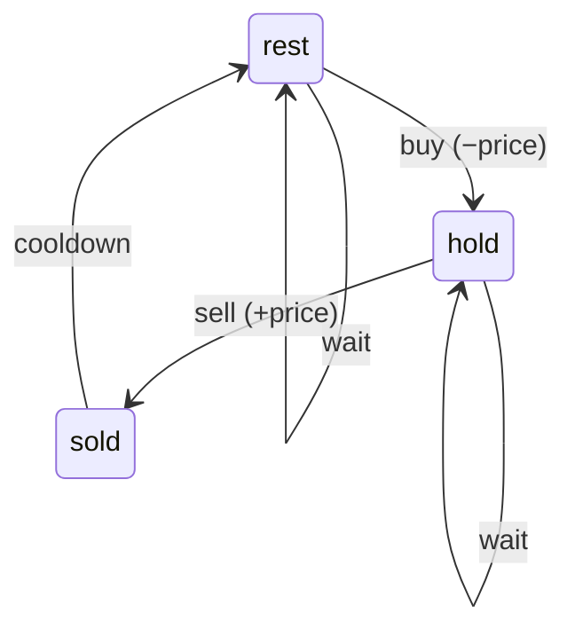

`prices[i]` is the price of a stock on day `i`. You may make as many buy-then-sell round trips as you like, subject to two rules:

- You hold at most one share at a time, so you must sell before buying again.
- After you sell, you must wait one full day before buying again (a one-day cooldown). Selling on day `i` means the earliest next purchase is on day `i + 2`.

Return the maximum total profit. Doing nothing, for a profit of `0`, is always allowed.

### Examples

| Input | Output | Why |
|---|---|---|
| `[3, 5, 1, 4]` | `3` | Buy at 1, sell at 4. Selling at 5 on day 1 would force a cooldown on day 2, the only cheap day |
| `[1, 4, 2, 7]` | `6` | Buy at 1, sell at 7. Two trades (`+3`, then `+5`) would need a purchase on day 2, the cooldown day |
| `[2, 1, 4, 5, 2, 9, 7]` | `10` | Buy 1 → sell 4, cool down on day 3, buy 2 → sell 9 |

### Constraints

- `1 ≤ len(prices) ≤ 5000`
- `0 ≤ prices[i] ≤ 1000`

### Follow-up

The interviewer asks: "Replace the cooldown with a fixed fee paid on every sale." Then: "Now at most `k` round trips are allowed. What is the state?"

## Solution

### The naive approach

On each day choose buy, sell or wait, subject to the rules, and recurse: roughly `3ⁿ` action sequences before pruning, and the same (day, situation) pair is reached by countless different histories.

### The insight

The future depends on the past only through *what situation you are in at the end of today*. There are three:

- **hold**: you own a share.
- **sold**: you sold today, so tomorrow is a cooldown day.
- **rest**: you own nothing and did not sell today, so you are free to buy tomorrow.

Draw the allowed moves between them and the DP writes itself:



`sold` has no self-loop and no edge to `hold`: that is the cooldown.

### The DP

- **State.** `hold[i]`, `sold[i]`, `rest[i]` are the maximum profit at the end of day `i` in each situation.
- **Transitions.**
  - `hold[i] = max(hold[i-1], rest[i-1] - prices[i])`: keep holding, or buy today from `rest`.
  - `sold[i] = hold[i-1] + prices[i]`: sell today the share held yesterday.
  - `rest[i] = max(rest[i-1], sold[i-1])`: keep resting, or finish yesterday's cooldown.
- **Base cases (before day 0).** `rest = 0` (no money made, nothing owned), `hold = sold = −∞` (impossible: you cannot own or have sold anything before the first day).
- **Iteration order.** Day by day, computing all three new values from the previous day's three.
- **Answer.** `max(sold[n-1], rest[n-1])`. Ending while still holding is never optimal, so `hold` is excluded.

### Worked table for `[2, 1, 4, 5, 2, 9, 7]`

| day | start | 0 | 1 | 2 | 3 | 4 | 5 | 6 |
|---|---|---|---|---|---|---|---|---|
| price | – | 2 | 1 | 4 | 5 | 2 | 9 | 7 |
| `hold` | −∞ | −2 | −1 | −1 | −1 | 1 | 1 | 1 |
| `sold` | −∞ | −∞ | −1 | 3 | 4 | 1 | **10** | 8 |
| `rest` | 0 | 0 | 0 | 0 | 3 | 4 | 4 | **10** |

Read it backwards: `rest` on day 6 is 10 because of `sold` on day 5 (sell at 9). That sale used `hold` on day 4, which is 1 = `rest[3] − 2` (buy at 2 on day 4). `rest[3] = 3` came from `sold[2]` (sell at 4), which used `hold[1] = −1` (buy at 1). Day 3 is the cooldown. Notice `sold[3] = 4` (buy at 1, sell at 5) is better than `sold[2]` on its own, but it would put the cooldown on day 4 and miss the purchase at 2.

### Tabulated version

```python
def max_profit_cooldown_table(prices: list[int]) -> int:
    n = len(prices)
    NEG = float("-inf")
    hold, sold, rest = [NEG] * n, [NEG] * n, [0] * n
    hold[0] = -prices[0]
    for i in range(1, n):
        hold[i] = max(hold[i - 1], rest[i - 1] - prices[i])
        sold[i] = hold[i - 1] + prices[i]
        rest[i] = max(rest[i - 1], sold[i - 1])
    return max(sold[n - 1], rest[n - 1])
```

Time `O(n)`, space `O(n)`.

### Space-optimised version

```python
def max_profit_cooldown(prices: list[int]) -> int:
    hold, sold, rest = float("-inf"), float("-inf"), 0
    for p in prices:
        # all three right-hand sides use yesterday's values
        hold, sold, rest = max(hold, rest - p), hold + p, max(rest, sold)
    return max(sold, rest)
```

Time `O(n)`, space `O(1)`. The simultaneous assignment matters: computing `sold` from a `hold` that was already updated today would let you buy and sell on the same day.

### Common mistakes

- Letting `hold` be entered from `sold` (buying the day after a sale), which erases the cooldown. On `[1, 4, 2, 7]` that returns 8 instead of 6.
- Updating the three variables one after another instead of simultaneously.
- Initialising `hold` to 0, which pretends you got a share for free on day −1.
- Trying to reason with "local minima and maxima" as in the unlimited-trades problem without cooldown. The cooldown makes adjacent trades interact, and peak-valley reasoning no longer gives the optimum.

### How to discuss it

Say "this is a state machine DP" and draw the three-state diagram before writing anything. Then each transition is one edge in the diagram, the base cases are "only `rest` is reachable before day 0", and the code is three lines.

The same framing solves the whole stock family. With a transaction fee and no cooldown, collapse to two states: `hold = max(hold, free - p)` and `free = max(free, hold + p - fee)`. With at most `k` round trips, add the number of completed trades to the state: `hold[t]` and `free[t]` for `t = 0..k`, giving `O(n · k)` time and `O(k)` space; and when `k ≥ n / 2` the limit cannot bind, so fall back to the unlimited version. Being able to generate these from the diagram, rather than having memorised six separate solutions, is the senior signal.
