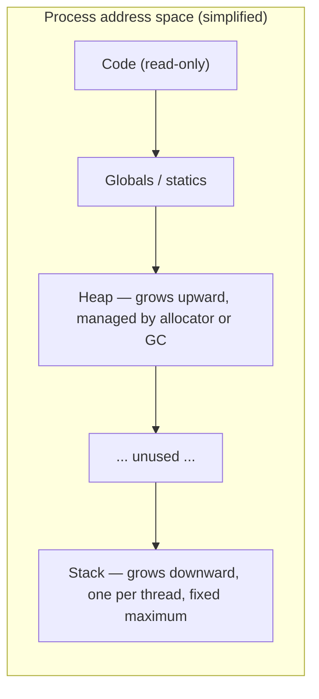

You write a clean recursive depth-first search over a tree, it passes every unit test, and then production feeds it a tree that is really a 50,000-node chain. Python raises `RecursionError: maximum recursion depth exceeded`. Node prints `RangeError: Maximum call stack size exceeded`. A C++ service segfaults with no message at all. Go quietly keeps going, because its goroutine stacks grow. Same algorithm, four different outcomes, and the difference is not the algorithm. It is where each runtime puts the bookkeeping for a function call.

Every variable you declare lives in one of two places: the **stack**, a fixed-size region that grows and shrinks with function calls, or the **heap**, an open-ended region managed by an allocator or a garbage collector. Which one your value lands in decides how fast it is to create, how long it lives, whether it can be shared, and whether a deep recursion will crash. Knowing the mechanism lets you predict the crash instead of debugging it after it ships.

## Two regions, two lifetimes

A process's memory is a single address space, but the runtime carves it into regions with different rules.



The stack is a contiguous block, typically 1–8 MiB per thread, with a single pointer (the *stack pointer*) marking where the top currently is. Calling a function moves the pointer down to reserve space for that call; returning moves it back up. That is the whole allocation strategy, and it is why the stack is fast: reserving 64 bytes for a function's locals is one subtraction, freeing them is one addition, and there is nothing to track because whatever was allocated last is always freed first.

The heap has no such ordering. Objects are created and destroyed in arbitrary order, so something has to keep track of which bytes are free. In C and Rust that something is an allocator (`malloc`, jemalloc, mimalloc) that maintains free lists bucketed by size class. In Python, JavaScript, Go and Java it is the same kind of allocator plus a garbage collector that decides when a block can go back on the free list. A heap allocation costs tens of nanoseconds on a fast path and can cost microseconds when the allocator has to ask the OS for more pages. A stack allocation costs about one cycle.

```viz
{"type": "memory", "scenario": "stack-heap", "title": "Stack frames versus heap objects", "caption": "Watch locals appear and vanish with each call while heap objects outlive the function that created them."}
```

Lifetime is the other half of the story. A stack value dies when its function returns; that is not a policy, it is a consequence of the pointer moving back up. If you want a value to outlive the call that created it, or to be shared by two callers, it has to go on the heap. That single rule explains most of what each language does.

## Anatomy of a stack frame

When `caller()` invokes `callee(a, b)`, the machine pushes a **frame** (also called an activation record) onto the stack. On x86-64 with a C-like calling convention, a frame contains roughly:

| Slot | What it holds | Why it exists |
|---|---|---|
| Arguments beyond the register set | Extra parameters | The first six integer arguments travel in registers; the rest are spilled here |
| Return address | Where to continue in `caller` after `callee` returns | The `call` instruction pushes it automatically |
| Saved frame pointer | `caller`'s base pointer | Lets the debugger and the return sequence find the previous frame |
| Locals | `callee`'s local variables | Fixed-size, laid out by the compiler |
| Spill space and alignment padding | Registers the compiler ran out of | Keeps the frame 16-byte aligned |

A small function with three integer locals has a frame of maybe 48 bytes. A function with a local `char buf[4096]` has a frame of over 4 KiB, and recursing 2,000 deep through it needs 8 MiB, which is exactly the default main-thread stack on Linux. That is how a perfectly reasonable-looking recursive parser overflows.

```viz
{"type": "memory", "scenario": "call-stack", "title": "Frames pushed and popped", "caption": "Each call pushes a frame with its return address and locals; each return pops it. The stack pointer is the only state the machine needs."}
```

The return address deserves attention because it is why stack overflow is not just a crash but historically a security hole. Write past the end of a local buffer and you overwrite the return address; the function "returns" to wherever the attacker chose. Modern compilers insert canaries and operating systems randomise layout, but the mechanism is the reason those defences exist.

## A concrete trace: factorial

```python
def factorial(n):
    if n <= 1:
        return 1
    return n * factorial(n - 1)
```

Calling `factorial(5)` pushes five frames before anything is multiplied. Each frame holds its own `n` and the address to return to inside the `return n * ...` line. Only when `factorial(1)` returns `1` does the stack start unwinding: `2 * 1`, then `3 * 2`, then `4 * 6`, then `5 * 24`.

```viz
{"type": "recursion", "algorithm": "factorial", "n": 5, "title": "factorial(5): five frames deep before the first multiply"}
```

The observation that matters: the maximum stack depth equals the maximum recursion depth, and the work done *after* the recursive call (`n *` here) is precisely what prevents the frame from being discarded early. `factorial(10**5)` needs 100,000 live frames at once, regardless of how cheap each one is.

## What each language actually puts on the stack

The textbook picture above is C. The languages you use daily bend it, and the bends explain their behaviour.

**C, C++, Rust.** Locals of known size go on the stack. A `Vec<i32>` is three words on the stack (pointer, length, capacity) and its elements are on the heap. A `Box<T>` is one stack word pointing at a heap `T`. Rust's compiler knows every type's size at compile time, so frame layout is fixed and there is no runtime cost to deciding.

**Go.** Every local *starts* as a stack candidate, and the compiler runs **escape analysis** to decide. If a pointer to the local could outlive the function (returned, stored in a struct that is returned, captured by a goroutine, passed to an interface), the value is moved to the heap. `go build -gcflags=-m` prints those decisions, and reading them is a standard step when a Go service allocates more than expected.

```go
func makePoint() *Point {
    p := Point{1, 2}   // "moved to heap: p" — the pointer escapes via return
    return &p
}
```

**Python.** Every value is a heap object, full stop. An integer, a string, a list: all `PyObject`s allocated on the heap with a reference count and a type pointer. What the interpreter's "stack" holds is references to those objects. Even the frame itself was a heap-allocated `PyFrameObject` until Python 3.11 moved frame data into a per-thread chunk that behaves like a stack. The practical result is that a Python "stack frame" is hundreds of bytes and involves at least one allocation, which is one of several reasons a Python function call costs on the order of 50–100 ns where a C call costs 1–2 ns.

**JavaScript (V8).** Similar to Python in spirit: objects live on the heap and the stack holds tagged references. V8 cheats where it can: small integers (Smis, 31 bits on 64-bit builds with pointer compression) are stored directly in the tagged word without allocation, and the optimising compiler performs escape analysis to keep short-lived objects out of the heap entirely.

The consequence for you: in Python and JavaScript, "is this on the stack or the heap?" is the wrong question about a value. The right question is "how many objects does this line allocate?", because every allocation is heap work and GC pressure.

## How recursion really fails

Four runtimes, four failure modes. The differences are worth memorising because they decide how you write tree and graph code.

| Runtime | Limit | What enforces it | What you see |
|---|---|---|---|
| CPython | 1,000 frames by default (`sys.getrecursionlimit()`) | A counter, not the C stack | `RecursionError`, catchable |
| Node / V8 | Roughly 10,000 frames for small functions; depends on frame size and `--stack-size` | The C stack allotted to the JS thread (about 1 MB by default) | `RangeError: Maximum call stack size exceeded`, catchable |
| Go | Effectively none for reasonable programs; goroutine stacks start at a few KiB and grow by copying, up to 1 GB on 64-bit | The runtime's max stack size | `fatal error: stack overflow`, not recoverable |
| Rust / C / C++ | Main thread 8 MiB on Linux by default; spawned threads 2 MiB in Rust | The OS guard page below the stack | `SIGSEGV`; Rust prints "thread has overflowed its stack" then aborts |
| JVM | Roughly 10,000–20,000 frames with the default `-Xss` (512 KiB to 1 MiB) | Thread stack size | `StackOverflowError`, catchable but usually fatal in practice |

The CPython limit is the one people misunderstand. It is deliberately conservative; `sys.setrecursionlimit(10**6)` raises the counter, but in versions before 3.11 each Python call also consumed real C stack, so a high limit converted a clean `RecursionError` into a segfault. Since 3.11, pure-Python-to-Python calls no longer nest on the C stack, which makes a raised limit much safer, but calls that cross into C (`__getattr__`, comparison dunders, `json` decoding of nested lists) still do. Treat the raised limit as a workaround, not a design.

Go's growable stacks are elegant but not free. When a goroutine outgrows its stack the runtime allocates a new one twice as large and copies every frame, adjusting pointers into the stack. A goroutine that recurses 100,000 deep will trigger a dozen such copies. Amortised it is fine; it is the same doubling argument as a dynamic array. But a service that spins up a million goroutines pays a few KiB each just for starting stacks, which is why goroutines are cheap rather than free.

## Converting recursion to an explicit stack

Whenever the input can be deep (linked-list-shaped trees, long dependency chains, user-controlled nesting), the senior move is to carry the stack yourself on the heap, where the only limit is memory.

```python
def dfs_recursive(node, visit):
    visit(node)
    for child in node.children:
        dfs_recursive(child, visit)

def dfs_iterative(root, visit):
    stack = [root]
    while stack:
        node = stack.pop()
        visit(node)
        # push in reverse so the leftmost child is processed first
        stack.extend(reversed(node.children))
```

The two produce the same pre-order. The iterative version handles a chain of ten million nodes with ten million list entries (about 80 MB of pointers in CPython), where the recursive one dies at 1,000.

The harder case is recursion that does work *after* the call, such as post-order traversal or `height(node) = 1 + max(height(left), height(right))`. There the explicit stack needs to remember *where you were* in each frame, which is exactly what the return address does for you. The standard trick is to push `(node, state)` pairs:

```python
def height(root):
    if root is None:
        return 0
    stack = [(root, False)]
    heights = {}
    while stack:
        node, children_done = stack.pop()
        if node is None:
            continue
        if not children_done:
            stack.append((node, True))          # come back after the children
            stack.append((node.left, False))
            stack.append((node.right, False))
        else:
            heights[node] = 1 + max(heights.get(node.left, 0), heights.get(node.right, 0))
    return heights[root]
```

You have re-implemented the call stack: the `True` marker is the return address, and `heights` is the place return values go. It is uglier than the recursive version, and you should say so in an interview while explaining why you are writing it anyway. The [recursion design lesson](/learn/algorithms/recursion-backtracking/recursion-design) covers the general transformation.

## Tail calls, and why you cannot rely on them

A call in *tail position* (the last thing the function does, with nothing to compute afterwards) does not need its frame after the callee starts, so the compiler could reuse it. Scheme requires this. C compilers do it at `-O2` when they can prove it safe. Rust and Go do not guarantee it. CPython refuses on purpose (the maintainers prefer real tracebacks). ECMAScript 2015 specified it, but only Safari's JavaScriptCore shipped it; V8 and SpiderMonkey did not, so in Node it does not happen.

The practical rule: if you need a loop, write a loop. Tail-recursive Python and JavaScript still overflow.

```python
def sum_to(n, acc=0):          # tail call, still 1,000-frame limited in CPython
    return acc if n == 0 else sum_to(n - 1, acc + n)
```

## Stack size as a capacity number

Stacks cost memory before you use them. A thread's stack is *reserved* virtual memory, touched lazily page by page, so 1,000 threads at 8 MiB each reserve 8 GB of address space while using only what they touch. This matters in two places: 32-bit or container-limited environments where address space is finite, and the thread-per-request servers of the last decade, where thread count was capped by stack reservations long before CPU ran out. Green threads, goroutines and async runtimes exist largely to escape that cap; a Go goroutine starts at about 2–8 KiB and a Rust async task's state machine is often a few hundred bytes.

A related production bug: recursive-descent parsers for JSON, YAML, XML and regular expressions with attacker-controlled nesting depth. `[[[[[[...]]]]]]` 100,000 levels deep is a few hundred kilobytes of input and, in a naive parser, a stack overflow that takes down the process. Mature parsers cap nesting depth (a few hundred levels) precisely because of this; if you write one, so should you.

## Heap allocation costs, briefly

Since Python and JavaScript put everything on the heap, it is worth having numbers. A hot-path allocation from a thread-local free list is about 10–30 ns in a tuned allocator; CPython's small-object allocator (`pymalloc`) is in that range for objects under 512 bytes. The cost that bites is not the allocation but what follows: the object has to be initialised, it pollutes the CPU cache, and eventually a collector has to prove it dead. A loop that allocates a tuple per iteration for ten million iterations spends more time on allocation and reclamation than on the arithmetic.

Two lessons in this track make the point concrete: [space complexity and the memory hierarchy](/learn/foundations/complexity/space-complexity-and-memory-hierarchy) shows why contiguous stack-like layouts are cache-friendly, and [memory management](/learn/foundations/how-code-runs/memory-management) covers what reclaiming heap objects costs in each runtime.

## Senior signals

- You state the recursion limit of the runtime you are using and the failure mode (`RecursionError` versus segfault versus growable stack) before the interviewer asks.
- When a tree or graph problem allows deep inputs, you say "this could be a chain, so I'll use an explicit stack" and you can write the post-order version with a state marker, not just pre-order.
- You know that in Python and JavaScript the interesting question is allocation count, not stack versus heap, and you can point at the line in a loop that allocates.
- You can explain Go's escape analysis in one sentence and read `-gcflags=-m` output to find an unexpected heap allocation.
- You treat `sys.setrecursionlimit` as a patch with a known failure mode, not a fix.
- You recognise attacker-controlled nesting depth as a denial-of-service vector and cap it.

## Check yourself

```quiz
- q: >-
    A recursive function has one local array of 8 KiB and no other significant locals. On a Linux main thread with the default 8 MiB stack, roughly how deep can it recurse before overflowing?
  options: ["About 100 calls", "About 1,000 calls", "About 100,000 calls", "It cannot overflow; arrays are on the heap"]
  answer: 1
  explanation: >-
    Each frame is a little over 8 KiB, so 8 MiB holds about 1,000 frames. A fixed-size local array in C, C++ or Rust lives in the frame; only Python and JavaScript would put it on the heap.
- q: >-
    In CPython, `sys.setrecursionlimit(1_000_000)` followed by a recursion 500,000 deep is most likely to:
  options: ["Work, because the limit is now high enough", "Raise RecursionError anyway", "Succeed for pure-Python calls on 3.11+ but may crash the process if the recursion passes through C code", "Be automatically converted to a loop"]
  answer: 2
  explanation: >-
    The limit is a counter. Since 3.11, Python-to-Python calls do not consume C stack, so deep pure recursion can work; but any path through C (dunder methods, C-implemented libraries) still uses the real stack and can segfault. Before 3.11 the crash was likely regardless.
- q: >-
    Why can a Go program recurse a million levels deep while a Rust program with the same recursion aborts?
  options: ["Go performs tail-call elimination", "Go goroutine stacks grow by copying to a larger block; Rust threads have a fixed stack with a guard page", "Rust allocates frames on the heap, which is slower", "Go frames are smaller than Rust frames"]
  answer: 1
  explanation: >-
    Go's runtime detects an about-to-overflow stack, allocates a bigger one and copies the frames. Rust (like C) reserves a fixed region and hits a guard page. Neither language guarantees tail-call elimination.
- q: >-
    You are converting a recursive post-order tree traversal to an iterative one. What must the explicit stack store that a pre-order conversion does not need?
  options: ["The parent pointer of each node", "A marker saying whether the node's children have already been processed", "The depth of each node", "Nothing; post-order is just pre-order reversed"]
  answer: 1
  explanation: >-
    Post-order does work after the recursive calls return, so each stack entry needs to record whether it is being visited for the first time or resumed. That marker plays the role of the return address. Reversing pre-order gives a right-to-left post-order only for the specific case of a binary tree with no side effects during the visit, which is a trick, not the general transformation.
- q: >-
    A JSON API accepts arbitrary documents and parses them with a recursive-descent parser. Which input is the cheapest denial-of-service attack against it?
  options: ["A 1 GB document of flat key-value pairs", "A document with a single 100 MB string", "A few hundred kilobytes of nested arrays opened 100,000 levels deep", "A document with 10,000 duplicate keys"]
  answer: 2
  explanation: >-
    Nesting depth maps directly to stack depth in a recursive parser; a few hundred kilobytes of `[` characters overflow the stack and crash the process. The large documents cost bandwidth and memory but do not crash anything by themselves. Production parsers cap nesting depth for this reason.
```
