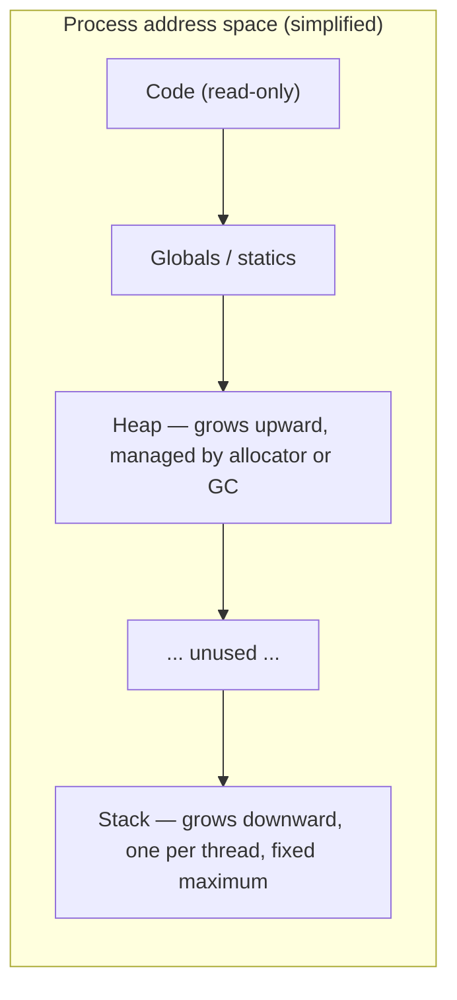

You write a clean recursive depth-first search over a tree, it passes every unit test, and then production feeds it a tree that is really a 50,000-node chain. Python raises `RecursionError: maximum recursion depth exceeded`. Node prints `RangeError: Maximum call stack size exceeded`. A C++ service segfaults with no message at all. Go keeps going, because its goroutine stacks grow. Same algorithm, four different outcomes, and the difference is not the algorithm. It is where each runtime puts the bookkeeping for a function call.

Every variable you declare lives in one of two places: the **stack**, a fixed-size region that grows and shrinks with function calls, or the **heap**, an open-ended region managed by an allocator or a garbage collector. Which one your value lands in decides how fast it is to create, how long it lives, whether it can be shared, and whether a deep recursion will crash. Knowing the mechanism, down to the bytes in a frame and the page that triggers the crash, lets you predict the failure instead of debugging it in production.

## Two regions, two lifetimes

A process's memory is a single address space, but the runtime carves it into regions with different rules.



The stack is a contiguous block, 8 MiB for the main thread on Linux by default (`ulimit -s` prints 8192, in KiB), with a single register (the *stack pointer*, `rsp` on x86-64) marking where the top currently is. Calling a function moves the pointer down to reserve space for that call; returning moves it back up. That is the whole allocation strategy, and it is why the stack is fast: reserving 32 bytes of locals is one `sub rsp, 32` instruction, freeing them is one `add`, and there is nothing to track because whatever was allocated last is always freed first.

The heap has no such ordering. Objects are created and destroyed in arbitrary order, so something has to track which bytes are free: in C and Rust an allocator (glibc `malloc`, jemalloc, mimalloc) with free lists bucketed by size class; in Python, JavaScript, Go and Java the same kind of allocator plus a garbage collector that decides when a block can go back on the free list. A heap allocation costs tens of nanoseconds on the cached fast path and microseconds when the allocator has to ask the kernel for fresh pages. A stack allocation costs one instruction.

```viz
{"type": "memory", "scenario": "stack-heap", "values": [3, 2, 1], "title": "Stack frames versus heap objects", "caption": "Watch locals appear and vanish with each call while heap objects outlive the function that created them."}
```

Lifetime is the other half of the story. A stack value dies when its function returns; that is not a policy, it is a consequence of the pointer moving back up. A value that must outlive the call that created it, or be shared by two callers, has to go on the heap. That single rule explains most of what each language does.

## Anatomy of a stack frame, byte by byte

Take a small C function and look at what the compiler builds for it on x86-64 Linux, where the System V calling convention fixes the rules:

```c
long score(long n) {
    long acc = n * 2;          // 8 bytes, must sit at an address divisible by 8
    int  count = 1;            // 4 bytes, divisible by 4
    char tag[5] = "abcd";      // 5 bytes, any address
    return acc + count + tag[0];
}
```

The convention says: the first six integer or pointer arguments arrive in registers (`rdi`, `rsi`, `rdx`, `rcx`, `r8`, `r9`), so `n` is in `rdi`; the return value leaves in `rax`; the `call` instruction pushes an 8-byte **return address**; and `rsp` must be a multiple of 16 at the instant of every `call`, so that callees can spill 16-byte vector registers with aligned stores. As written, `score` calls nothing, so GCC 13 at `-O0` never moves `rsp` for it: the locals sit in the red zone described below. Give it a call to make and the prologue becomes `push rbp; mov rbp, rsp; sub rsp, N`. The tightest layout that satisfies every rule, with `N = 32`, is:

| Offset from `rbp` | Bytes | Contents | Why here |
|---|---|---|---|
| +8 | 8 | Return address | Pushed by the caller's `call` |
| 0 | 8 | Saved `rbp` of the caller | `push rbp`; lets `leave` and debuggers walk back |
| −8 | 8 | `acc` | 8-byte aligned |
| −12 | 4 | `count` | 4-byte aligned |
| −17 to −13 | 5 | `tag[5]` | Byte aligned |
| −24 to −18 | 7 | Padding | Keeps `n` 8-aligned |
| −32 to −25 | 8 | `n`, copied from `rdi` | Unoptimised code spills arguments so the debugger can see them |

Locals plus the spilled argument need 25 bytes, but the reservation must be 32, because the frame's bottom is where the *next* `call` happens and must again be 16-aligned. On entry `rsp` is 8 mod 16 (the caller was aligned, then `call` pushed 8 bytes); `push rbp` makes it 0 mod 16; `sub rsp, 32` keeps it there. The whole frame is 8 + 8 + 32 = 48 bytes. GCC 13 (with `-fno-stack-protector`) uses exactly these offsets for `acc`, `count` and `tag` but spills `n` to `rbp−40` and reserves 48, and Ubuntu's GCC, which enables the stack protector by default, puts an 8-byte canary at `rbp−8` and moves `tag` directly beneath it. The rules fix a minimum, not the layout.

Three details matter later. The compiler owns the layout: at `-O2` GCC folds this function to two instructions (`lea rax, [rdi+rdi+98]; ret`, since `'a'` is 97) with no frame at all, and the `push rbp` disappears (GCC omits the frame pointer at `-O1` and above unless you pass `-fno-omit-frame-pointer`, which profilers want). Frame size is a property of the binary, not the source. The return address sits at a known offset above the locals, so writing past the end of `tag` overwrites it and lets an attacker choose where the function "returns"; stack canaries and address randomisation exist because of this layout. And leaf functions may use a 128-byte **red zone** below `rsp` without moving it, so tiny functions have no visible frame at all.

```viz
{"type": "memory", "scenario": "call-stack", "n": 3, "title": "Frames pushed and popped", "caption": "Each call pushes a frame with its return address and locals; each return pops it. The stack pointer is the only state the machine needs."}
```

## A hand trace: three frames of factorial

```c
long fact(long n) {
    if (n <= 1) return 1;
    return n * fact(n - 1);
}
```

Unoptimised, the prologue is `push rbp; mov rbp, rsp; sub rsp, 16; mov [rbp-8], rdi` (16 bytes of locals: `n` plus 8 bytes of alignment padding), the recursive call is `call fact` followed by `imul rax, [rbp-8]`, and the epilogue is `leave; ret`, where `leave` means `mov rsp, rbp; pop rbp` and `ret` pops the return address into the instruction pointer. Each frame is 8 + 8 + 16 = 32 bytes. Suppose `main` executes `call fact` with `n = 3` while `rsp` is `0x7ffdf000`:

| Step | Action | `rsp` after | What is now on top |
|---|---|---|---|
| 1 | `main`: `call fact`, `rdi = 3` | `0x7ffdeff8` | Return address into `main` |
| 2 | `fact(3)` prologue | `0x7ffdefe0` | Saved `rbp` at `…eff0`, `n = 3` at `…efe8` |
| 3 | `fact(3)`: `call fact`, `rdi = 2` | `0x7ffdefd8` | Return address pointing at the `imul` |
| 4 | `fact(2)` prologue | `0x7ffdefc0` | Saved `rbp` at `…efd0`, `n = 2` at `…efc8` |
| 5 | `fact(2)`: `call fact`, `rdi = 1` | `0x7ffdefb8` | Return address pointing at the `imul` |
| 6 | `fact(1)` prologue | `0x7ffdefa0` | `n = 1` at `…efa8`; peak depth, 96 bytes below `main` |
| 7 | `fact(1)`: `n <= 1`, `rax = 1`, `leave; ret` | `0x7ffdefc0` | Execution resumes at `fact(2)`'s `imul` |
| 8 | `fact(2)`: `rax = 1 × 2`, `leave; ret` | `0x7ffdefe0` | Resumes at `fact(3)`'s `imul` |
| 9 | `fact(3)`: `rax = 2 × 3 = 6`, `leave; ret` | `0x7ffdf000` | Back in `main`, `rax = 6`, `rsp` exactly where it started |

Check the alignment rule at steps 3 and 5: `0x…efe0` and `0x…efc0` are both multiples of 16, so each `call` is legal. The peak is three live frames, 96 bytes. The multiply happens on the way *back up*, which is why the frame cannot be discarded before the callee returns: `[rbp-8]` is still needed at the `imul`.

Now scale it. At 32 bytes per frame, an 8 MiB stack holds 8 × 1,048,576 / 32 = 262,144 frames, so this unoptimised `fact` crashes near `n ≈ 260,000` (slightly less, because `main` and the C library already used some stack). Frame size times depth against the stack limit is the calculation to make before writing anything recursive over user-sized input. At `-O2`, GCC can rewrite this multiply-then-recurse into a loop with an accumulator; do not rely on that rescue.

```viz
{"type": "recursion", "algorithm": "factorial", "n": 5, "title": "factorial(5): five frames deep before the first multiply"}
```

## Heap allocation, byte by byte

Now the other region. In C, `malloc(24)` under glibc does the following:

1. Add 8 bytes for the chunk's **size header** and round up to a multiple of 16: 24 + 8 = 32, so a 32-byte chunk, which is also the minimum chunk size on 64-bit. `malloc(1)` costs the same 32 bytes; `malloc(25)` costs 48. The header's low three bits are flags (previous chunk in use, allocated by `mmap`, non-main arena), which is only possible because sizes are always multiples of 16.
2. Look in the thread-local **tcache**: 64 bins in 16-byte steps covering chunks from 32 to 1,040 bytes, up to 7 cached chunks per bin (16 since glibc 2.43; 2.42 added optional tcache bins for large blocks). A hit is a handful of instructions and no lock.
3. Miss: try the fastbins (chunks up to 128 bytes; glibc 2.43 removed them), then the sorted small and large bins, then split the **top chunk** at the end of the arena, and if that is exhausted, ask the kernel for more with `brk` or `mmap`.
4. Requests of 128 KiB and above skip the arena and get their own `mmap` mapping (the threshold adapts upward to 32 MiB as large blocks are freed). Those pages are backed only when touched, at roughly a microsecond of page fault per 4 KiB page.

The returned pointer is 16-byte aligned and points 16 bytes into the chunk; the 8 bytes immediately after your 24 are the *next* chunk's `prev_size` field, which is only meaningful when this chunk is free. That overlap is why `malloc_usable_size` reports 24 for a 32-byte chunk rather than 16.

Other allocators keep the same shape with different classes: jemalloc's small classes go 8, 16, 32, 48, 64, 80, 96, 112, 128, then four per doubling; CPython's `pymalloc` serves objects up to 512 bytes from 16-byte classes carved out of pools inside arenas (1 MiB arenas of 16 KiB pools on 64-bit since 3.10) and hands larger requests to the system `malloc`.

The same alignment rules explain `sizeof` on a struct:

```c
struct A { char c; long n; int i; };   // sizeof == 24
struct B { long n; int i; char c; };   // sizeof == 16
```

Every field must start at an address divisible by its own size, and the struct's size is rounded up to its largest field's alignment so that an array of them keeps every element aligned. `A` places `c` at 0, pads 7 bytes so `n` can start at 8, puts `i` at 16, and pads 4 so the total is a multiple of 8: 24 bytes for 13 bytes of data. `B` needs no interior padding and only 3 bytes at the end. Rust reorders fields to minimise this unless you ask for `#[repr(C)]`; C and Go keep your order, which is why Go has a `fieldalignment` linter. On a struct allocated ten million times, the 8 bytes between `A` and `B` are 80 MB.

## What each language actually puts on the stack

The textbook picture above is C. The languages you use daily bend it, and the bends explain their behaviour.

**C, C++, Rust.** Locals of known size go on the stack. A `Vec<i32>` is three words on the stack (pointer, length, capacity, 24 bytes) and its elements are on the heap. A `Box<T>` is one stack word pointing at a heap `T`. Rust's compiler knows every type's size at compile time, so frame layout is fixed and there is no runtime cost to deciding.

**Go.** Every local *starts* as a stack candidate, and the compiler runs **escape analysis** to decide. If a pointer to the local could outlive the function (returned, stored in a struct that is returned, captured by a goroutine, passed to an interface), the value is moved to the heap. `go build -gcflags=-m` prints those decisions; the [memory management lesson](/learn/foundations/how-code-runs/memory-management) walks through a full listing.

```go
func makePoint() *Point {
    p := Point{1, 2}   // "moved to heap: p" — the pointer escapes via return
    return &p
}
```

**Python.** Every value is a heap object. An integer, a string, a list: all `PyObject`s allocated on the heap with a reference count and a type pointer. What the interpreter's "stack" holds is references to those objects. Even the frame itself was a heap-allocated `PyFrameObject` until Python 3.11 moved frame data into a per-thread chunk that behaves like a stack (`_PyInterpreterFrame`), creating a full frame object only when a traceback or `sys._getframe` needs one. A 3.14 frame is 80 bytes of fixed fields plus 8 bytes per local and per evaluation-stack slot, and a Python-to-Python call measured about 10 ns on CPython 3.14 on this track's test machine, where a C call costs 1–2 ns.

**JavaScript (V8).** Similar to Python in spirit: objects live on the heap and the stack holds tagged references. V8 cheats where it can: small integers (Smis, 31 bits on 64-bit builds with pointer compression) are stored directly in the tagged word without allocation, and the optimising compiler performs escape analysis to keep short-lived objects out of the heap entirely.

So in Python and JavaScript, "is this on the stack or the heap?" is the wrong question about a value. The right question is "how many objects does this line allocate?", because every allocation is heap work and GC pressure.

## How recursion really fails

Four runtimes, four failure modes. The differences decide how you write tree and graph code.

| Runtime | Limit | What enforces it | What you see |
|---|---|---|---|
| CPython | 1,000 Python frames by default (`sys.getrecursionlimit()`) | A counter per thread, not the C stack | `RecursionError`, catchable |
| Node / V8 | Order of 10,000 frames for small functions; `--stack-size` defaults to 984 KiB and frames are roughly 50–150 bytes | The C stack allotted to the JS thread | `RangeError: Maximum call stack size exceeded`, catchable |
| Go | Goroutine stacks start at 2 KiB and grow by copying, up to 1 GB on 64-bit | The runtime's `maxstacksize` | `fatal error: stack overflow`, not recoverable |
| Rust / C / C++ | Main thread 8 MiB on Linux; Rust-spawned threads 2 MiB; glibc threads inherit the 8 MiB limit; musl threads 128 KiB | The OS guard page below the stack | `SIGSEGV`; Rust prints "thread has overflowed its stack" then aborts |
| JVM | Roughly 10,000–20,000 frames with the default 1 MiB `-Xss` | Thread stack size | `StackOverflowError`, catchable, but it unwinds through arbitrary code with `finally` blocks half-run, so services treat it as fatal |

The CPython limit is the one people misunderstand, and it has changed shape across versions. Before 3.11 every Python call also nested a C call to the evaluation loop, so `sys.setrecursionlimit(10**6)` turned a clean `RecursionError` into a segfault once the 8 MiB C stack ran out. In 3.11 Python-to-Python calls stopped consuming C stack, so the counter became the only limit for pure-Python recursion. In 3.12 the check was split: `sys.setrecursionlimit` governs Python frames, and a separate C-recursion limit guards paths that re-enter the interpreter from C (comparison dunders, `__getattr__`, `copy.deepcopy`, the `json` decoder on nested lists). 3.13 raised that C limit and made it platform-dependent; 3.14 replaced the C-side counter with a measurement of the remaining machine stack. The rule that survives every version: a raised limit protects only the pure-Python path, and recursion that passes through C can still hit the real stack.

Go's growable stacks are not free. When a goroutine outgrows its stack the runtime allocates one twice as large and copies every frame, adjusting pointers into the stack using the compiler's stack maps. Recursing 100,000 deep triggers a dozen such copies; amortised, it is the dynamic-array doubling argument. The initial size (8 KiB in Go 1.2–1.3, 2 KiB since 1.4, and since 1.19 sized from the observed average) is why a million goroutines cost a few gigabytes rather than 8 TB of reservations.

## Under the hood: the guard page and the growing stack

A stack overflow in C, C++ or Rust is not detected by any counter. It is a page fault. On Linux the main thread's stack is a mapping that grows downward on demand: touch the page immediately below the current lowest page and the kernel extends the mapping, up to the `RLIMIT_STACK` ceiling. Below that ceiling sits a **guard gap** with no mapping at all (256 pages, 1 MiB, since the 2017 Stack Clash fixes; one page before). Thread stacks from `pthread_create` are ordinary `mmap` regions with a `PROT_NONE` guard page at the low end, one 4 KiB page by default in glibc. The first store below the limit lands in the guard, the fault has nowhere to go, and the kernel delivers `SIGSEGV`.

The signature is recognisable. `dmesg` prints a line like `segfault at 7ffc1234efe8 ip 000055d5… sp 00007ffc1234efe8 error 6`, and the tell is that the faulting address equals or sits within a page of `sp`. In a debugger, `bt` shows thousands of identical frames. Rust's runtime installs a `SIGSEGV` handler on an alternate signal stack (there is no room on the overflowed one) that checks whether the faulting address is inside the thread's guard page and, if so, prints `thread 'main' has overflowed its stack` before aborting with `SIGABRT`. A Go program never reaches the guard page: every non-trivial function prologue compares `rsp` against `g.stackguard0` and on failure calls `runtime.morestack`, which allocates the doubled stack, copies, and retries. Only when the doubled size would exceed 1 GB does it print `runtime: goroutine stack exceeds 1000000000-byte limit` and die. The garbage collector shrinks stacks using less than a quarter of their allocation, so a burst of deep recursion does not pin memory forever.

Reserved and used stack are different numbers: pages are backed by physical memory only when touched, so 1,000 threads at 8 MiB reserve 8 GB of address space and typically use tens of megabytes. The [virtual memory lesson](/learn/systems/operating-systems/virtual-memory) covers the page-fault mechanics; the consequence here is that thread count is capped by address space and mapping counts before RAM.

## Converting recursion to an explicit stack

Whenever the input can be deep (linked-list-shaped trees, long dependency chains, user-controlled nesting), the senior move is to carry the stack yourself on the heap, where the only limit is memory.

```python
def dfs_recursive(node, visit):
    visit(node)
    for child in node.children:
        dfs_recursive(child, visit)

def dfs_iterative(root, visit):
    stack = [root]
    while stack:
        node = stack.pop()
        visit(node)
        # push in reverse so the leftmost child is processed first
        stack.extend(reversed(node.children))
```

The two produce the same pre-order. The iterative version handles a chain of ten million nodes with ten million list entries (80 MB of pointers in CPython, 8 bytes each), where the recursive one dies at 1,000.

The harder case is recursion that does work *after* the call, such as post-order traversal or `height(node) = 1 + max(height(left), height(right))`. There the explicit stack needs to remember *where you were* in each frame, which is exactly what the return address does for you. The standard trick is to push `(node, state)` pairs:

```python
def height(root):
    if root is None:
        return 0
    stack = [(root, False)]
    heights = {}
    while stack:
        node, children_done = stack.pop()
        if node is None:
            continue
        if not children_done:
            stack.append((node, True))          # come back after the children
            stack.append((node.left, False))
            stack.append((node.right, False))
        else:
            heights[node] = 1 + max(heights.get(node.left, 0), heights.get(node.right, 0))
    return heights[root]
```

You have re-implemented the call stack: the `True` marker is the return address, and `heights` is where return values go. It is uglier than the recursive version; say so in an interview while explaining why you are writing it anyway. The [recursion design lesson](/learn/algorithms/recursion-backtracking/recursion-design) covers the general transformation and the [tree traversals lesson](/learn/data-structures/trees/binary-tree-traversals) applies it to all three orders.

## Tail calls, and why you cannot rely on them

A call in *tail position* (the last thing the function does, with nothing to compute afterwards) does not need its frame after the callee starts, so the compiler could reuse it. Scheme requires this. C compilers do it at `-O2` when they can prove it safe. Rust and Go do not guarantee it. CPython refuses on purpose (the maintainers prefer real tracebacks). ECMAScript 2015 specified it and Safari's JavaScriptCore [shipped it in 2016](https://webkit.org/blog/6240/ecmascript-6-proper-tail-calls-in-webkit/), but V8 does not do it: a strict-mode tail-recursive sum overflows at 10,000 levels in Node 24. If you need a loop, write a loop; tail-recursive Python and JavaScript still overflow.

```python
def sum_to(n, acc=0):          # tail call, still 1,000-frame limited in CPython
    return acc if n == 0 else sum_to(n - 1, acc + n)
```

## Stack size as a capacity number

Stacks cost address space before you use them, which capped thread-per-request servers long before CPU ran out. Goroutines and async runtimes escape that cap: a goroutine starts at 2 KiB and a Rust async task's state machine is often a few hundred bytes, so a million of either fits where a thousand threads would not. The [async and event loops lesson](/learn/systems/concurrency/async-and-event-loops) is the other half of that story.

A related production bug: recursive-descent parsers for JSON, YAML, XML and regular expressions with attacker-controlled nesting depth. `[[[[[[...]]]]]]` 100,000 levels deep is a few hundred kilobytes of input and, in a naive parser, a stack overflow that takes down the process. Mature parsers cap nesting: `serde_json` refuses documents deeper than 128 levels by default, Jackson 2.15 added a default limit of 1,000, and CPython's `json` decoder participates in the interpreter's recursion check so it raises rather than crashes. Cap yours too.

## Trade-offs

| Strategy | Allocate / free cost | Maximum size | Can outlive the call? | Failure mode |
|---|---|---|---|---|
| Fixed native stack (C, Rust, JVM threads) | One instruction each | Fixed per thread: 8 MiB main, 1–2 MiB spawned | No | Guard-page `SIGSEGV`; no recovery |
| Growable copying stack (Go) | One instruction, plus a copy at each doubling | 1 GB per goroutine | No | Fatal after 1 GB; `morestack` cost in hot code |
| Heap-allocated frames (CPython before 3.11, generators) | An allocation per call, tens of ns | Memory | Yes (generators, closures) | Counter-limited `RecursionError` |
| Explicit stack on the heap (your list of tuples) | Amortised O(1) append | Memory | Yes | Out of memory, catchable in most runtimes |

## Failure modes in production

**Symptom: a worker crashes with `RecursionError` (or `SIGSEGV` in a native service) on one specific input, and a retry fails identically.** Diagnosis: the traceback or core dump shows the same function hundreds of times; the input is a degenerate shape (a chain-like tree, a deeply nested document, a long dependency path). Fix: convert the recursion to an explicit stack, or cap depth and reject the input with a clear error. Raising the limit moves the crash; it does not remove it.

**Symptom: a Python service segfaults instead of raising `RecursionError`, with no Python traceback.** Diagnosis: someone set `sys.setrecursionlimit` high and the deep path goes through C (`__eq__` on nested dataclasses, `copy.deepcopy`, pickling, a C-accelerated decoder), so the machine stack overflowed before the Python counter tripped. Fix: restore a sane limit; if the deep structure is legitimate, walk it iteratively.

**Symptom: a JVM or native service logs `unable to create native thread` or `pthread_create: Resource temporarily unavailable` while the machine has free RAM.** Diagnosis: count threads (`ls /proc/<pid>/task | wc -l`); each thread stack is a mapping plus a guard mapping, and the process is hitting `vm.max_map_count` (65,530 by default, about 32,000 threads), `ulimit -u`, or address-space limits in a container. Fix: reduce the stack size (`-Xss256k`, `ulimit -s`, `RUST_MIN_STACK`), cap the pool, or move to an async or goroutine model.

**Symptom: a program works on Ubuntu and segfaults inside an Alpine container, on a path with a large local array.** Diagnosis: musl's default thread stack is 128 KiB against glibc's 8 MiB, so a 512 KiB buffer that lived on the stack now overflows the first time that thread runs it. Fix: allocate large buffers on the heap, or set the thread stack size explicitly at creation.

**Symptom: a Go service shows `runtime.morestack` and `runtime.copystack` near the top of a CPU profile.** Diagnosis: a deep or wide call path (large local arrays, deep recursion) keeps running on freshly started goroutines whose stacks begin small, so each one grows by copying. Fix: reuse goroutines from a pool so the grown stack persists, shrink the hot path's frames, or replace the recursion with an explicit stack.

## Interviewer follow-ups

**"Why is stack allocation faster than heap allocation?"** Model answer: allocation is one register subtraction and deallocation one addition, because lifetimes are nested so the last thing allocated is always the first freed; no free list, no header, no size-class lookup, no locking, and the top of the stack is almost always in L1 cache. Heap allocation must find a free block of the right class, write a header, and eventually prove the block dead. Common wrong answer: "stack memory is a faster kind of memory". It is the same RAM; the speed comes from the discipline, not the hardware.

**"What is in a stack frame, and how does a buffer overflow become code execution?"** Model answer: the return address, the saved frame pointer, the locals and padding to 16-byte alignment, from high to low addresses. A write past the end of a local array runs upward into the saved `rbp` and the return address, so `ret` jumps wherever the overflow wrote. Canaries put a random value between the locals and the return address and check it before `ret`; ASLR makes the target hard to guess. Common wrong answer: "the overflow corrupts the heap".

**"How would you make a depth-first search over a ten-million-node graph safe in Python?"** Model answer: replace the recursion with an explicit stack of nodes (pre-order) or `(node, state)` pairs (post-order), and state the memory cost: 8 bytes per pointer plus the tuple, hundreds of megabytes at worst, versus a guaranteed crash at 1,000 frames. Common wrong answer: `sys.setrecursionlimit(10**7)`, which fails at the C stack on older versions and on any path through C.

**"Why do goroutines start with 2 KiB stacks when a thread gets 8 MiB?"** Model answer: because Go can grow a stack by copying it, so it starts tiny and pays a doubling only when needed, and a million goroutines cost gigabytes rather than terabytes of reservation. The cost is the prologue check in every function and the occasional copy, and it depends on the compiler knowing which stack words are pointers, which C cannot, so C threads cannot copy their stacks. Common wrong answer: "goroutines are threads with a smaller default".

## What mid-level engineers get wrong

- Treating `sys.setrecursionlimit` as the fix for deep recursion. Consequence: the process crashes with a segfault on the first path through C instead of raising a catchable error.
- Assuming tail recursion is optimised in Python or JavaScript because "the compiler handles it". Consequence: a tail-recursive loop overflows at exactly the same depth as the non-tail version.
- Estimating recursion depth without a frame size. Consequence: a parser that is fine at 1,000 levels dies at 20,000 because a local buffer made each frame 4 KiB.
- Putting a large array on the stack in code that runs in threads, containers or on Alpine. Consequence: a crash that reproduces only in production, where the thread's stack is smaller than the developer's main thread.
- Believing Go recursion is unlimited. Consequence: an unrecoverable fatal error at 1 GB, with `morestack` copies degrading latency long before it.
- Ignoring struct field order in Go or C. Consequence: 50% more memory and cache traffic for a hot struct, invisible in the source.

```exercise
id: struct-layout-with-padding
title: Compute sizeof with alignment padding
prompt: |
  Given `fields`, a list of field sizes in bytes (each 1, 2, 4 or 8, in
  declaration order), return the total size a C compiler would give the
  struct on x86-64. Rules: each field starts at the next offset divisible
  by its own size; the struct's total size is rounded up to a multiple of
  the largest field size, so an array of the struct keeps every element
  aligned. An empty list has size 0.
languages: [python, javascript]
entry: struct_size
starter:
  python: |
    def struct_size(fields):
        # your code here
        return 0
  javascript: |
    function struct_size(fields) {
      // your code here
      return 0;
    }
tests:
  - args: [[1, 8, 4]]
    expected: 24
    label: char, long, int
  - args: [[8, 4, 1]]
    expected: 16
    label: long, int, char (reordered)
  - args: [[1, 1, 1]]
    expected: 3
    label: no padding needed
  - args: [[]]
    expected: 0
    label: empty struct
  - args: [[2, 4, 1]]
    expected: 12
    label: trailing padding to a multiple of 4
  - args: [[1, 2, 4, 8]]
    expected: 16
    hidden: true
  - args: [[1, 4, 1, 4]]
    expected: 16
    hidden: true
hints:
  - "Keep a running offset; before placing a field of size f, round the offset up to a multiple of f."
  - "Track the largest field size seen and round the final offset up to a multiple of it."
```

## Senior signals

- You state the recursion limit of the runtime you are using and the failure mode (`RecursionError` versus segfault versus growable stack) before the interviewer asks, and which CPython version changed the C-stack behaviour.
- You estimate depth capacity as stack size divided by frame size, knowing a frame is the locals rounded to 16 bytes plus 16 bytes of return address and saved frame pointer.
- When a tree or graph problem allows deep inputs, you say "this could be a chain, so I'll use an explicit stack" and you can write the post-order version with a state marker, not only pre-order.
- You know that in Python and JavaScript the interesting question is allocation count, not stack versus heap, and you can point at the line in a loop that allocates.
- You can explain a stack overflow as a page fault into a guard page, read the `segfault at … sp …` line in `dmesg`, and tell it apart from a null-pointer dereference.
- You treat `sys.setrecursionlimit` as a patch with a known failure mode, and you recognise attacker-controlled nesting depth as a denial-of-service vector and cap it.
- You reorder struct fields by size when a struct is allocated in bulk, and you can compute `sizeof` by hand.

## Check yourself

```quiz
- q: >-
    A recursive C function has one local array of 8 KiB and no other significant locals. On a Linux main thread with the default 8 MiB stack, roughly how deep can it recurse before overflowing?
  options: ["No limit; the array goes on the heap", "Around 1,000 frames deep", "Around 100,000 frames deep", "Around 100 frames deep"]
  answer: 1
  explanation: >-
    Each frame is a little over 8 KiB, so 8 MiB holds about 1,000 frames. A fixed-size local array in C, C++ or Rust lives in the frame; only Python and JavaScript would put it on the heap.
- q: >-
    In CPython 3.12 or later, `sys.setrecursionlimit(1_000_000)` followed by a pure-Python recursion 500,000 deep is most likely to:
  options: ["Raise RecursionError anyway, since CPython caps the limit", "Segfault, since every Python call also consumes C stack", "Work, but crash if the recursion passes through C code", "Be turned into a loop by CPython's tail-call optimisation"]
  answer: 2
  explanation: >-
    Since 3.11, Python-to-Python calls do not consume C stack, so a raised counter is honoured for pure-Python recursion. Any path through C (dunder methods, deepcopy, C-implemented decoders) is guarded by a separate C-side limit and can still overflow the real stack. The "every call consumes C stack" behaviour describes versions before 3.11. CPython deliberately does no tail-call optimisation.
- q: >-
    Why can a Go program recurse a million levels deep while a Rust program with the same recursion aborts?
  options: ["Rust allocates frames on the heap, which fills up sooner", "Go performs tail-call elimination on recursive calls", "Go stacks grow by copying; Rust stacks are fixed in size", "Go's compiler emits much smaller frames, so more fit"]
  answer: 2
  explanation: >-
    Go's prologue check detects an about-to-overflow goroutine stack, allocates one twice as large and copies the frames, fixing up pointers using the compiler's stack maps. Rust (like C) reserves a fixed region per thread and hits a guard page. Neither language guarantees tail-call elimination.
- q: >-
    You are converting a recursive post-order tree traversal to an iterative one. What must the explicit stack store that a pre-order conversion does not need?
  options: ["Nothing extra; post-order is pre-order reversed", "The parent pointer of every node along the current path", "The depth of each node, to know when to unwind", "A flag saying whether its children are already done"]
  answer: 3
  explanation: >-
    Post-order does work after the recursive calls return, so each stack entry needs to record whether it is being visited for the first time or resumed. That marker plays the role of the return address. Reversing pre-order gives a right-to-left post-order only for a binary tree with no side effects during the visit, which is a trick, not the general transformation.
- q: >-
    On x86-64, what is `sizeof(struct { char c; long n; int i; })` and why?
  options: ["13 bytes, the sum of the three field sizes", "32 bytes, with each field in its own 8-byte slot", "16 bytes, rounded up to two machine words", "24 bytes, with padding after c and after i"]
  answer: 3
  explanation: >-
    n must start at an offset divisible by 8, so 7 bytes of padding follow c; i sits at 16; then the struct is padded to a multiple of 8 so arrays stay aligned, giving 24. Reordering to long, int, char gives 16, because only 3 trailing bytes are needed. Fields are not each given a full word.
- q: >-
    A native service dies with SIGSEGV. In dmesg the faulting address is 16 bytes below the reported stack pointer, and gdb shows the same function 40,000 times. What happened?
  options: ["A null pointer dereference inside the recursive function", "The stack pointer ran into the guard page below the stack", "The kernel's OOM killer terminated the process for memory use", "The heap allocator corrupted a chunk header during recursion"]
  answer: 1
  explanation: >-
    A fault address adjacent to the stack pointer plus a very deep, repetitive backtrace is the stack overflow signature: the next frame's store landed in the unmapped guard region. A null dereference faults at a tiny address, heap corruption usually surfaces in malloc or free, and the OOM killer sends SIGKILL, not SIGSEGV.
```
