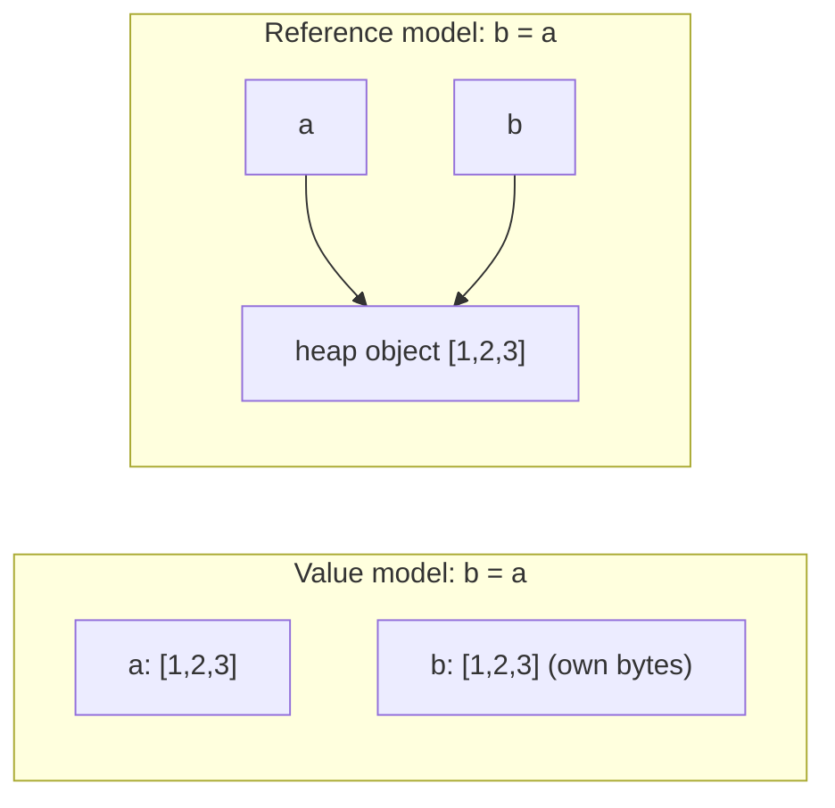

A helper function receives a list of orders, sorts it to find the largest, and returns the top one. Two weeks later a report downstream is in the wrong order and nobody can see why: the helper sorted the caller's list in place. A Go service appends to a slice it was handed, and a completely different goroutine sees the new element, sometimes. A JavaScript component spreads `{...state}` to "copy" it, mutates a nested array, and the old state changes too. A Python function has a default argument of `[]` and accumulates results across calls.

Every one of these is the same bug: two names for one piece of memory, and a write through one name that the holder of the other did not expect. The languages you use disagree about what a variable holds, when assignment copies, and when it merely creates another name. You need the rule for each, because the rule decides both correctness and cost: a copy you did not know about is an O(n) operation hiding in a function call, and a copy you assumed but did not get is a shared-state bug.

## Two models of a variable

There are two coherent mental models, and each language picks one (or, in Go's case, mixes them by type).

**Value model (C, Go, Rust, and primitives everywhere).** A variable *is* a box of bytes. `b = a` copies the bytes from `a`'s box into `b`'s box. Afterwards there are two independent values. If you want sharing you ask for it explicitly with a pointer or reference.

**Reference model (Python, JavaScript objects, Java objects, Ruby).** A variable is a *name* bound to an object that lives elsewhere (on the heap). `b = a` makes `b` a second name for the same object. Nothing is copied except the reference itself. If you want independence you ask for it explicitly with a copy.



The single most useful habit from this lesson is to ask, for every assignment and every function argument, *which model applies here*.

## Python: names bound to objects

In Python everything is an object on the heap, and every variable, attribute, list slot and dictionary value is a reference. Assignment rebinds a name; it never copies an object.

```python
a = [1, 2, 3]
b = a
b.append(4)
print(a)          # [1, 2, 3, 4]  -- same object
print(a is b)     # True

b = b + [5]       # builds a NEW list and rebinds b
print(a)          # [1, 2, 3, 4]  -- a is untouched now
b += [6]          # list.__iadd__ mutates in place: a would be affected if b still aliased a
```

The confusion people report as "Python passes lists by reference but ints by value" is not two rules. It is one rule (references everywhere) plus the fact that ints, strings and tuples are *immutable*, so no operation on them can be observed through another name. `x += 1` on an int must produce a new object because the old one cannot change. `xs += [1]` on a list mutates in place because it can.

`is` compares identity (same object), `==` compares value. You will occasionally see `a is b` return `True` for two separately created small integers or short strings because CPython caches them; that is an implementation detail you must never rely on, and it is why `x is 5` gets a `SyntaxWarning`.

Function calls follow the same rule: the parameter is a new name bound to the caller's object. Mutate it and the caller sees it; rebind it and the caller does not.

```python
def add_default(item, bucket=[]):     # the [] is created ONCE, at definition time
    bucket.append(item)
    return bucket

add_default(1)   # [1]
add_default(2)   # [1, 2]  -- surprise: same list
```

The default is evaluated when `def` runs, so every call that omits `bucket` shares one list. The idiom is `bucket=None` followed by `if bucket is None: bucket = []`.

## JavaScript: primitives by value, objects by reference

JavaScript has seven primitive types (number, string, boolean, `undefined`, `null`, symbol, bigint) that behave as values, and everything else (objects, arrays, functions) behaves as references.

```javascript
const a = [1, 2, 3];
const b = a;
b.push(4);
console.log(a);            // [1, 2, 3, 4]

const s = { user: { name: "Ann" }, tags: ["x"] };
const t = { ...s };        // shallow: t.user and t.tags are the SAME objects as s.user, s.tags
t.tags.push("y");
console.log(s.tags);       // ["x", "y"]
```

`const` means the *binding* cannot change; it says nothing about the object. `Object.freeze` makes an object's own properties read-only, but only one level deep. React's "never mutate state" rule exists because its change detection compares references, so a mutation through an alias is invisible to it. `structuredClone` (or a library) is what a real deep copy costs; the spread operator is not it.

## Go: values by default, with three reference-like types

Go is the language where this lesson matters most, because it is value-model for structs and arrays and something subtler for slices, maps and channels.

A struct assignment copies every field. Passing a struct to a function copies it. That is safe and sometimes expensive: a struct with a 1 KiB array inside costs 1 KiB per call. Use a pointer when the struct is large or must be mutated.

```go
type Config struct{ Retries int; Hosts [64]string }

func tweak(c Config) { c.Retries = 5 }      // copies ~1 KiB, mutates the copy, no effect
func tweakP(c *Config) { c.Retries = 5 }    // mutates the caller's value
```

A **slice** is a small header of three words: a pointer to a backing array, a length and a capacity. Copying a slice copies the header; both headers point at the same array. Writes through either are visible through the other, up to the shared length.

```go
a := []int{1, 2, 3}
b := a
b[0] = 99
fmt.Println(a)             // [99 2 3]  -- shared backing array

c := append(a, 4)          // cap(a) was 3, so append ALLOCATES a new array
c[0] = 7
fmt.Println(a)             // [99 2 3]  -- a is unaffected this time

d := make([]int, 3, 10)    // len 3, cap 10
e := append(d, 4)          // fits within capacity: NO allocation, e and d share the array
e[0] = 7
fmt.Println(d)             // [7 0 0]  -- d sees the write
```

Whether `append` aliases or copies depends on whether the write fits inside the existing capacity. That makes it the source of the most reported class of subtle Go bugs: a function appends to a slice it received, sometimes overwriting elements the caller still holds, sometimes not, depending on how the caller built the slice. The defensive patterns are to append only to a slice you own, to use the full-slice expression `s[low:high:max]` to cap capacity when handing out sub-slices, or to `copy` explicitly.

Maps and channels are pointers to runtime structures, so assignment shares. There is no way to copy a map except by iterating.

The dynamic-array growth animation below is the same mechanism that decides whether Go's `append` reallocates and whether a Python `list.append` copies: when capacity runs out, a new array of roughly double the size is allocated and every element is copied across.

```viz
{"type": "memory", "scenario": "dynamic-array-growth", "title": "Growth by doubling", "caption": "Appends within capacity write in place; the one that exceeds capacity allocates a new block and copies everything, which is when old aliases stop seeing new writes."}
```

## Rust: moves, copies and the borrow checker

Rust adds a third verb. Assignment of a non-`Copy` type (a `String`, a `Vec`, a `Box`) *moves* the value: the source is no longer usable, so there is never a moment when two names own the same heap buffer.

```rust
let a = vec![1, 2, 3];
let b = a;              // move: a is now invalid
// println!("{:?}", a); // compile error: value used after move
let c = b.clone();      // explicit O(n) copy
```

Small plain types (`i32`, `f64`, `bool`, `char`, tuples of them) implement `Copy` and behave as values. Sharing without moving is done with references, and the borrow checker enforces the rule that makes aliasing safe: at any moment you may have either any number of shared references (`&T`) or exactly one mutable reference (`&mut T`), never both. The Go slice bug above is a compile error in Rust, because holding `a` while writing through `b` to the same buffer is exactly what the rule forbids.

The cost is that the programmer must decide up front who owns what. The payoff is that every copy of heap data is spelled `.clone()`, so the O(n) is visible in the source. The [memory management lesson](/learn/foundations/how-code-runs/memory-management) covers how ownership also replaces the garbage collector.

## What copying actually costs

"Copy" hides three different operations with three different prices.

| Operation | Python | JavaScript | Go | Cost |
|---|---|---|---|---|
| Copy the reference or header | `b = a` | `b = a` | `b = a` (slice header, 24 bytes) | O(1) |
| Shallow copy: new container, same elements | `list(a)`, `a[:]`, `dict(d)`, `copy.copy` | `[...a]`, `a.slice()`, `{...o}` | `copy(dst, src)`, `append([]T(nil), a...)` | O(n) in the container's length |
| Deep copy: recursively copy everything reachable | `copy.deepcopy` | `structuredClone` | Hand-written | O(total size), plus cycle tracking |

A shallow copy of a list of a million dictionaries copies a million references (8 MB in CPython) in a few milliseconds and leaves every dictionary shared. A deep copy walks every dictionary and every value inside them and can take seconds and multiply memory.

Slicing is the trap. Python `a[1:]` allocates a new list and copies `n - 1` references, so a recursive function that slices its input at each level is O(n²) overall:

```python
def total(xs):                     # O(n^2): every level copies the remainder
    return 0 if not xs else xs[0] + total(xs[1:])
```

JavaScript `slice` also copies. Go slicing shares the backing array, so `a[1:]` is O(1); the cost shows up instead as memory that cannot be freed because a tiny sub-slice keeps a huge array alive. Rust `&a[1..]` is a borrowed view, O(1) and unable to outlive `a`.

Strings follow the container rules of their language, with a twist covered in [numbers, strings and Unicode](/learn/foundations/how-code-runs/numbers-strings-unicode): they are immutable in Python, JavaScript, Java and Go, so slicing may share (Go, some JS engines) or copy (Python), but you never get an aliasing bug from one.

## The aliasing bug catalogue

These recur often enough to be worth recognising on sight.

**Multiplying a nested container.** `grid = [[0] * n] * m` creates one inner list referenced `m` times. `grid[0][0] = 1` sets the first column of every row. The fix is `[[0] * n for _ in range(m)]`. The same happens with `Array(m).fill(Array(n).fill(0))` in JavaScript.

**Storing a caller's collection.** A class that does `self.items = items` in its constructor now shares state with whoever called it. If the class relies on `items` not changing, copy it or document the contract. Java's defensive-copy idiom and Rust's ownership are two answers to this one problem.

**Mutating while iterating.** Removing from a Python list inside a `for` over the same list skips elements; adding to a Go map while ranging over it is allowed but the iteration may or may not see the new keys; modifying a Java collection during iteration throws. Iterate over a copy or build a new collection.

**Closures capturing a loop variable.** In Python, `[lambda: i for i in range(3)]` yields three lambdas that all return `2`, because they capture the variable, not its value at creation. JavaScript `var` had the same behaviour; `let` in a `for` header creates a fresh binding per iteration and fixed it.

**Mutable default arguments** (Python), covered above.

**Returning internal state.** A getter that returns `self._cache` hands out a live reference. The caller's "read" can corrupt the cache.

Each has the same shape: a name you did not think of as an alias is one.

## Choosing a strategy

Three strategies remove aliasing bugs, and each trades something.

**Defensive copying** at boundaries: copy inputs on the way in and outputs on the way out. Simple, always correct, O(n) per boundary crossing. Fine for small data; a problem when the same 10 MB list crosses five function boundaries.

**Immutability**: tuples, frozen dataclasses, `Object.freeze`, records, or persistent data structures (Clojure's vectors, Immutable.js, `im` in Rust) that make a "modified copy" in O(log n) by sharing most of the structure. Removes the bug class entirely; costs allocation on every update and a mental model people find awkward at first.

**Ownership**: exactly one owner, transfers are explicit. Rust enforces it; in other languages it is a convention ("the function that creates the list owns it; callers get a copy or a read-only view"). Zero runtime cost, but it must be documented and reviewed.

A senior engineer picks one per codebase area and states it. What they do not do is copy sometimes, based on which bug bit them most recently.

## Senior signals

- Before writing a function that takes a collection, you say whether it mutates its argument, and if it does, you name it that way (`sort` versus `sorted`).
- You can explain Go's slice header and predict, from `len` and `cap`, whether a given `append` will alias or reallocate.
- You know that `{...obj}` and `list(xs)` are shallow, that deep copies are O(total size), and you can say which one a given bug requires.
- You spot `[[0] * n] * m` and mutable default arguments in code review without running the code.
- You can state Rust's aliasing rule (many shared or one mutable) and explain what class of bug it prevents.
- When asked "why is this function slow", you look for the slice or copy inside the loop before you look at the algorithm.

## Check yourself

```quiz
- q: >-
    In Python, `def f(xs): xs = xs + [1]` is called with a list `a`. After the call, `a` is:
  options: ["Unchanged, because the function rebinds its local name to a new list", "Extended by 1, because lists are passed by reference", "Extended by 1 only if the list was non-empty", "A copy of the original"]
  answer: 0
  explanation: >-
    `xs + [1]` builds a new list and `xs =` rebinds the local name; the caller's object is untouched. `xs += [1]` or `xs.append(1)` would mutate the shared object and the caller would see it.
- q: >-
    A Go function receives `s := make([]int, 2, 8)` and does `t := append(s, 9); t[0] = 5`. What does the caller's `s` look like afterwards?
  options: ["[0 0]: append always copies", "[5 0]: the append fit within capacity so t shares s's backing array", "[5 0 9]: the caller's length grew", "A compile error"]
  answer: 1
  explanation: >-
    Capacity 8 with length 2 means the append writes into the existing array and returns a header with length 3 over the same memory. The write to t[0] is visible through s. The caller's length stays 2, so it cannot see the 9.
- q: >-
    Which of these is a deep copy?
  options: ["JavaScript `[...arr]`", "Python `arr[:]`", "JavaScript `structuredClone(obj)`", "Go `b := a` where a is a slice"]
  answer: 2
  explanation: >-
    Spread and slicing create a new outer container but share every element. Assigning a Go slice copies only the 24-byte header. structuredClone recursively copies the whole reachable graph.
- q: >-
    A recursive Python function processes a list by calling itself on `xs[1:]`. On a list of 10,000 elements the total copying work is on the order of:
  options: ["10,000 operations", "100,000 operations", "50 million operations", "It depends on the element size"]
  answer: 2
  explanation: >-
    Each level copies the remaining n - k references: 9,999 + 9,998 + ... ≈ n²/2 = 50 million reference copies. The element size does not matter because only references are copied. Pass an index instead of slicing.
- q: >-
    Why does Rust reject `let b = &mut a; let c = &a; b.push(1);` while Go and Python happily run the equivalent?
  options: ["Rust does not support mutable collections", "Rust forbids a mutable reference coexisting with a shared reference to the same value, which is exactly the condition under which aliasing bugs occur", "Rust requires all collections to be cloned before mutation", "Rust cannot infer the lifetime of c"]
  answer: 1
  explanation: >-
    The borrow rule is many shared or one mutable, never both at once. Go slices and Python lists allow both, which is why the bug class exists there. Cloning is not required; the fix is to end one borrow before starting the other.
```
