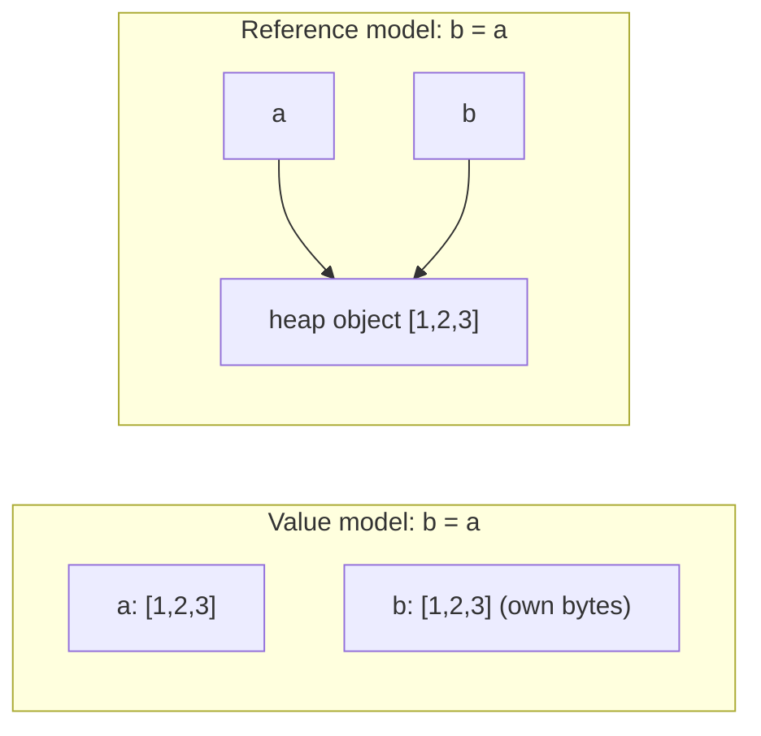

A helper function receives a list of orders, sorts it to find the largest, and returns the top one. Two weeks later a report downstream is in the wrong order and nobody can see why: the helper sorted the caller's list in place. A Go service appends to a slice it was handed, and a completely different goroutine sees the new element, sometimes. A JavaScript component spreads `{...state}` to "copy" it, mutates a nested array, and the old state changes too. A Python function has a default argument of `[]` and accumulates results across calls.

Every one of these is the same bug: two names for one piece of memory, and a write through one name that the holder of the other did not expect. The languages you use disagree about what a variable holds, when assignment copies, and when it merely creates another name. You need the rule for each, because the rule decides both correctness and cost: a copy you did not know about is an O(n) operation hiding in a function call, and a copy you assumed but did not get is a shared-state bug.

## Two models of a variable

There are two coherent mental models, and each language picks one (or, in Go's case, mixes them by type).

**Value model (C, Go, Rust, and primitives everywhere).** A variable *is* a box of bytes. `b = a` copies the bytes from `a`'s box into `b`'s box. Afterwards there are two independent values. If you want sharing you ask for it explicitly with a pointer or reference.

**Reference model (Python, JavaScript objects, Java objects, Ruby).** A variable is a *name* bound to an object that lives elsewhere (on the heap). `b = a` makes `b` a second name for the same object. Nothing is copied except the reference itself, 8 bytes. If you want independence you ask for it explicitly with a copy.



The single most useful habit from this lesson is to ask, for every assignment and every function argument, *which model applies here*.

## The same bug in four languages

Take the opening bug and write it four times. The helper wants the largest order, sorts to find it, and the caller expects its own list to be untouched.

```python
def largest(orders):
    top = orders          # a second name for the caller's list
    top.sort()            # sorts the caller's list in place
    return top[-1]
```

```javascript
function largest(orders) {
  const top = orders;     // same array object
  top.sort((a, b) => a - b);
  return top[top.length - 1];
}
```

```go
func largest(orders []int) int {
    top := orders         // copies the 24-byte slice header, not the elements
    sort.Ints(top)        // sorts the shared backing array
    return top[len(top)-1]
}
```

```rust
fn largest(orders: Vec<i32>) -> i32 {
    let mut top = orders; // moves the Vec: the caller can no longer use it
    top.sort();
    *top.last().unwrap()
}
```

Which boxes are shared after the first line of each body:

| Language | What `top = orders` copies | Boxes shared with the caller | Caller's data after the sort |
|---|---|---|---|
| Python | An 8-byte reference | The one `list` object and everything in it | Sorted (the bug) |
| JavaScript | An 8-byte reference | The one `Array` object | Sorted (the bug) |
| Go | The 24-byte slice header | The backing array | Sorted (the bug); the caller's header still says the same length |
| Rust | Ownership moves; 24 bytes on the stack | Nothing: the caller's `orders` is dead | Cannot be observed: `orders` is unusable after the call, at compile time |

Rust does not fix the bug by copying; it refuses to let two live names own one buffer. If the caller tries `let v = vec![3, 1, 2]; largest(v); println!("{v:?}")`, the compiler answers `error[E0382]: borrow of moved value: v`, pointing at the call as the move and the `println!` as the later use. To let the caller keep its list you must choose: `largest(v.clone())` (an explicit O(n) copy, visible at the call site) or `fn largest(orders: &mut Vec<i32>)` (the mutation is now in the signature, and the caller writes `largest(&mut v)`). Either way the aliasing is spelled out in the source.

In the other three languages the fix is a decision, not a compiler error: `sorted(orders)` in Python, `[...orders].sort()` in JavaScript, `slices.Sorted(slices.Values(orders))` or an explicit `copy` in Go, or a naming convention that says `largest` may mutate. The [Go essentials lesson](/learn/senior-craft/languages-for-senior-engineers/go-essentials) and the [Rust essentials lesson](/learn/senior-craft/languages-for-senior-engineers/rust-essentials) take the two systems languages further.

## Under the hood: CPython names, PyObjects and reference counts

In CPython every value is a `PyObject` on the heap, and every variable, attribute, list slot and dictionary value is an 8-byte pointer to one. The object begins with a 16-byte header: `ob_refcnt` (8 bytes, how many pointers currently refer to it) and `ob_type` (8 bytes, a pointer to the type object). A list adds `ob_size`, a pointer `ob_item` to a separately allocated array of element pointers, and `allocated` (the capacity), so `sys.getsizeof([1, 2, 3])` reports 88 on CPython 3.14: a 56-byte object (header, GC bookkeeping and the three list fields) plus a 4-slot array of element pointers, 32 bytes. The literal is built by extending an empty list, which allocates exactly but rounds up to an even number of slots, since the allocator's 16-byte granularity makes the odd slot free.

Assignment never copies an object; it changes which object a name points at and adjusts counts. Trace this snippet with `sys.getrefcount` in mind (it always reports one more than you expect, because its own argument is a reference):

```python
a = [1, 2, 3]
b = a
b.append(4)
del a
b = None
```

| Step | Statement | `ob_refcnt` of the list | Who holds the references |
|---|---|---|---|
| 1 | `a = [1, 2, 3]` | 1 | The name `a` |
| 2 | `b = a` | 2 | `a`, `b` (8 bytes copied; no element touched) |
| 3 | `b.append(4)` | 2 (3.14 calls the method without building a bound-method object and borrows `b` from the local) | `a`, `b`; `a` now sees `[1, 2, 3, 4]` |
| 4 | `del a` | 1 | `b` |
| 5 | `b = None` | 0 | Nobody: the list is freed *now*, and its four element pointers are decremented in turn |

Step 5 is why CPython's memory tracks live data closely and why `with` blocks release files promptly. The [memory management lesson](/learn/foundations/how-code-runs/memory-management) covers what happens to cycles that never reach zero.

Two details change what you observe. Since 3.12, `None`, `True`, `False`, the small integers from −5 to 256 and the interpreter's statically allocated strings are *immortal* ([PEP 683](https://peps.python.org/pep-0683/)): their count is pinned at a sentinel that increments and decrements do not change, so `sys.getrefcount(None)` returns a huge constant (3,221,225,472 on 3.14). A string you intern at run time with `sys.intern` is not immortal on 3.14; its count still moves. And the small-int cache is why `x = 256; y = 256; x is y` is `True` while the same test at 257 may be `False`: `is` compares addresses, `==` compares values, and only `==` is a promise.

The "Python passes lists by reference but ints by value" folklore is not two rules. It is one rule (a reference to the object, everywhere) plus the fact that ints, strings and tuples are immutable, so no operation on them can be observed through another name. `x += 1` on an int must produce a new object because the old one cannot change; `xs += [1]` on a list calls `list.__iadd__`, which mutates in place, and every other name for that list sees it.

```python
def add_default(item, bucket=[]):     # the [] is created ONCE, when def runs
    bucket.append(item)
    return bucket

add_default(1)   # [1]
add_default(2)   # [1, 2]  -- the same list, refcount held by the function object
```

The default is evaluated when `def` runs and stored on the function object, so every call that omits `bucket` shares one list. The idiom is `bucket=None` followed by `if bucket is None: bucket = []`.

## JavaScript: primitives by value, objects by reference, and V8 shapes

JavaScript has seven primitive types (number, string, boolean, `undefined`, `null`, symbol, bigint) that behave as values, and everything else (objects, arrays, functions) behaves as references.

```javascript
const a = [1, 2, 3];
const b = a;
b.push(4);
console.log(a);            // [1, 2, 3, 4]

const s = { user: { name: "Ann" }, tags: ["x"] };
const t = { ...s };        // shallow: t.user and t.tags are the SAME objects as s.user, s.tags
t.tags.push("y");
console.log(s.tags);       // ["x", "y"]
```

`const` means the *binding* cannot change; it says nothing about the object. `Object.freeze` makes an object's own properties read-only, one level deep. React's "never mutate state" rule exists because its change detection compares references, so a mutation through an alias is invisible to it. `structuredClone` is a real deep copy (with limits: it throws `DataCloneError` on functions and drops prototypes, so class instances come back as plain objects); the spread operator is not.

V8 adds a layer that decides *performance* rather than correctness. Every object carries a pointer to a **hidden class** (V8 calls it a map, other engines say shape) describing which properties it has and at which offsets. Objects built by the same sequence of property additions share one map, because each addition is a transition in a tree of maps:

```javascript
const p = {}; p.x = 1; p.y = 2;   // map chain: {} -> {x} -> {x, y}
const q = {}; q.y = 2; q.x = 1;   // map chain: {} -> {y} -> {y, x}: a DIFFERENT map
```

A property access site such as `o.x` keeps an **inline cache**: the map it last saw and the offset of `x` in that map. If the next object has the same map, the read is one comparison and one load at a fixed offset, the same cost as a struct field in C. A site that sees one map is monomorphic; up to four maps is polymorphic (a short chain of comparisons); more than that is megamorphic: V8 stops tracking maps at that site and looks up every access in a global stub cache keyed by map and property name, so the JIT can no longer compile the read as a fixed-offset load. Adding properties in different orders, adding them after construction, or `delete`-ing one (which can switch the object to slow, dictionary-mode properties) all fragment the maps. The rule that follows: initialise every property in the constructor, in the same order, and never `delete`. The [source-to-execution lesson](/learn/foundations/how-code-runs/from-source-to-execution) shows what the JIT does with a monomorphic site.

## Go: values by default, with three reference-like types

Go is the language where this lesson matters most, because it is value-model for structs and arrays and something subtler for slices, maps and channels.

A struct assignment copies every field. Passing a struct to a function copies it. That is safe and sometimes expensive: a struct holding a `[64]string` array is 64 × 16 = 1,024 bytes of string headers, copied on every call. Use a pointer when the struct is large or must be mutated.

```go
type Config struct{ Retries int; Hosts [64]string }

func tweak(c Config) { c.Retries = 5 }      // copies ~1 KiB, mutates the copy, no effect
func tweakP(c *Config) { c.Retries = 5 }    // mutates the caller's value
```

A **slice** is a 24-byte header of three words: a pointer to a backing array, a length and a capacity.

```text
s := make([]int, 2, 4)

 header (24 bytes, copied on assignment)      backing array (heap, shared)
 +---------+-----+-----+                      +----+----+----+----+
 | ptr ----|-----|-----|--------------------> | 0  | 0  | ?  | ?  |
 | len = 2 | cap = 4 |                        +----+----+----+----+
 +---------+---------+                          in use    spare capacity
```

Copying a slice copies the header; both headers point at the same array. Whether `append` aliases or reallocates depends on whether the new length fits inside the existing capacity. Trace it:

| Step | Code | `len`, `cap` of result | Backing array | What an older alias `s` sees |
|---|---|---|---|---|
| 1 | `s := make([]int, 2, 4)` | 2, 4 | A (4 slots) | `[0 0]` |
| 2 | `t := append(s, 7)` | 3, 4 | A: fits, no allocation | `s` is still `[0 0]`; `s[:3]` would show `[0 0 7]` |
| 3 | `t[0] = 9` | 3, 4 | A | `s` is `[9 0]`: the write is visible |
| 4 | `u := append(t, 8)` | 4, 4 | A: fits exactly | `s` is `[9 0]` |
| 5 | `v := append(u, 6)` | 5, 8 | New array B (cap doubled, 4 elements copied) | `s` is `[9 0]` |
| 6 | `v[0] = 1` | 5, 8 | B | `s` is *still* `[9 0]`: the alias is now stale |

Steps 3 and 6 are the same statement with opposite outcomes, decided by a capacity the caller never sees. That is the source of the most reported class of subtle Go bugs: a function appends to a slice it received and sometimes overwrites elements the caller still holds. The growth rule since Go 1.18 is to double while the capacity is under 256 and then grow by about 1.25× with smoothing, rounded up to the allocator's size class, so the reallocation points are predictable but not obvious. The defensive patterns are to append only to a slice you own, to cap capacity with the full slice expression `s[low:high:max]` when handing out sub-slices (so the recipient's first append is forced to reallocate), or to `copy` explicitly.

Maps and channels are pointers to runtime structures, so assignment shares. There is no way to copy a map except by iterating (`maps.Clone` does that for you).

```viz
{"type": "memory", "scenario": "dynamic-array-growth", "gc": true, "title": "Growth by doubling", "caption": "Appends within capacity write in place; the one that exceeds capacity allocates a new block and copies everything, which is when old aliases stop seeing new writes."}
```

## Rust: moves, copies and the borrow checker's reasoning

Rust adds a third verb. Assignment of a non-`Copy` type (a `String`, a `Vec`, a `Box`) *moves* the value: the source is no longer usable, so there is never a moment when two names own the same heap buffer. Small plain types (`i32`, `f64`, `bool`, `char`, tuples of them) implement `Copy` and behave as values. Sharing without moving is done with references, and the borrow checker enforces one rule: at any moment a value may have any number of shared references (`&T`) *or* exactly one mutable reference (`&mut T`), never both.

Here is the Go append trap written in Rust, and what the compiler says:

```rust
fn main() {
    let mut v = vec![1, 2, 3];
    let first = &v[0];        // shared borrow of v, alive until its last use
    v.push(4);                // needs &mut v: may reallocate and move the elements
    println!("{first}");      // the shared borrow is used here, so it is still alive
}
```

```text
error[E0502]: cannot borrow `v` as mutable because it is also borrowed as immutable
 --> src/main.rs:4:5
  |
3 |     let first = &v[0];
  |                  - immutable borrow occurs here
4 |     v.push(4);
  |     ^^^^^^^^^ mutable borrow occurs here
5 |     println!("{first}");
  |                ------- immutable borrow later used here
```

The reasoning, step by step: `&v[0]` creates a shared borrow whose lifetime extends to its last use on line 5 (lifetimes are non-lexical: they end at the last use, not the closing brace). `push` takes `&mut self`, which requires that no other borrow of `v` is alive. One is, so rule fires. The reason the rule exists is on line 4's comment: `push` may reallocate the buffer, after which `first` would point into freed memory, which is precisely what the stale Go alias at step 6 above does silently. Move the `println!` above the `push` and the program compiles, because the shared borrow now ends before the mutable one begins. No clone was needed; the fix was ordering.

The cost is that the programmer must decide up front who owns what. The payoff is that every copy of heap data is spelled `.clone()`, so the O(n) is visible in the source, and every mutation through a shared path is a compile error rather than a bug report.

## What copying actually costs

"Copy" hides three different operations with three different prices.

| Operation | Python | JavaScript | Go | Bytes moved for a million-element list |
|---|---|---|---|---|
| Copy the reference or header | `b = a` | `b = a` | `b = a` (24-byte header) | 8 (or 24) |
| Shallow copy: new container, same elements | `list(a)`, `a[:]`, `dict(d)`, `copy.copy` | `[...a]`, `a.slice()`, `{...o}` | `copy(dst, src)`, `slices.Clone` | 8 MB of pointers (Python, JS) or 8 MB of `int64` (Go) |
| Deep copy: recursively copy everything reachable | `copy.deepcopy` | `structuredClone` | Hand-written | 8 MB plus every element; for a million small dicts, hundreds of MB |

A shallow copy of a million references is an 8 MB `memcpy`, a millisecond or two, and leaves every element shared. `copy.deepcopy` walks every element and everything inside it, allocates each anew, and keeps a memo dictionary keyed by `id()` of every object it has visited (so shared sub-objects stay shared inside the copy and cycles terminate); on a million small dictionaries that is seconds and several hundred megabytes. Deep copy is required only when the copy will be mutated *below* the first level while the original is still in use. Most "I need a deep copy" cases are really "I need a fresh outer container", which is the shallow copy.

Slicing is the trap. Python `a[1:]` allocates a new list and copies `n − 1` references, so a recursive function that slices its input at each level is O(n²) overall:

```python
def total(xs):                     # O(n^2): every level copies the remainder
    return 0 if not xs else xs[0] + total(xs[1:])
```

For n = 10,000 that is about 50 million reference copies, 400 MB of memory traffic, for a sum. JavaScript `slice` also copies. Go slicing shares the backing array, so `a[1:]` is O(1); the cost shows up instead as memory that cannot be freed because a tiny sub-slice keeps a huge array alive. Rust `&a[1..]` is a borrowed view, O(1) and unable to outlive `a`.

Strings follow the container rules of their language, with a twist covered in [numbers, strings and Unicode](/learn/foundations/how-code-runs/numbers-strings-unicode): they are immutable in Python, JavaScript, Java and Go, so slicing may share (Go, some JS engines) or copy (Python), but you never get an aliasing bug from one.

## The aliasing bug catalogue

These recur often enough to be worth recognising on sight.

**Multiplying a nested container.** `grid = [[0] * n] * m` creates one inner list referenced `m` times. `grid[0][0] = 1` sets the first column of every row. The fix is `[[0] * n for _ in range(m)]`. The same happens with `Array(m).fill(Array(n).fill(0))` in JavaScript.

**Storing a caller's collection.** A class that does `self.items = items` in its constructor now shares state with whoever called it. If the class relies on `items` not changing, copy it or document the contract. Java's defensive-copy idiom and Rust's ownership are two answers to this one problem.

**Mutating while iterating.** Removing from a Python list inside a `for` over the same list skips elements; adding to a Go map while ranging over it is allowed but the iteration may or may not see the new keys; modifying a Java collection during iteration throws `ConcurrentModificationException`. Iterate over a copy or build a new collection.

**Closures capturing a loop variable.** In Python, `[lambda: i for i in range(3)]` yields three lambdas that all return `2`, because they capture the variable, not its value at creation. JavaScript `var` had the same behaviour; `let` in a `for` header creates a fresh binding per iteration. Go had it too until 1.22, which made each iteration's variable distinct; code compiled with an older `go` directive keeps the old rule.

**Mutable default arguments** (Python), covered above.

**Returning internal state.** A getter that returns `self._cache` hands out a live reference. The caller's "read" can corrupt the cache.

Each has the same shape: a name you did not think of as an alias is one.

## Trade-offs: three ways to remove aliasing bugs

| Strategy | Runtime cost | Where the bug goes | Ergonomics | Language support |
|---|---|---|---|---|
| Defensive copying at boundaries | O(n) per boundary crossing; a 10 MB list crossing five functions is 50 MB of copying | Removed, at the cost of copies you may not need | Easy to adopt, easy to forget | Any language |
| Immutability (tuples, frozen dataclasses, records, persistent structures) | Allocation on every update; persistent vectors make a "modified copy" in O(log n) by sharing structure | Removed by construction | Awkward for update-heavy code until the idioms are learned | Clojure, Immutable.js, `im` in Rust, `frozen=True` |
| Ownership (one owner, explicit transfers) | Zero at runtime | Compile error (Rust) or code-review convention (elsewhere) | Up-front design effort | Rust enforces; elsewhere a convention |

A senior engineer picks one per codebase area and states it. What they do not do is copy sometimes, based on which bug bit them most recently.

## Failure modes in production

**Symptom: a downstream report's ordering changes intermittently, with no change to the report code.** Diagnosis: a helper called earlier in the request sorts, reverses or pops its argument in place; the caller's list is the same object. Search for `.sort(`, `.reverse(`, `.pop(` applied to parameters, or assert `id(result) != id(input)` in a test. Fix: use `sorted()` (returns a new list) or copy at the boundary, and name mutating helpers so the mutation is visible (`sort` versus `sorted`).

**Symptom: a Go service returns corrupted results under load, and the race detector points at a slice element written by two goroutines.** Diagnosis: two sub-slices of one backing array were handed to two workers, and each `append`ed within the shared capacity, overwriting the other's elements. Fix: cap capacity with `s[low:high:high]` so the first append reallocates, or `copy` into a fresh slice per worker.

**Symptom: a React component does not re-render after state "changes".** Diagnosis: the update mutated the existing object (`state.items.push(x)`) and then set the same reference, so the reference-equality check saw no change. Fix: build a new object for every changed level (`{...state, items: [...state.items, x]}`) or use an immutable-update helper such as Immer.

**Symptom: a Python worker's memory is several times its data size, and `tracemalloc` attributes most of it to `copy.deepcopy`.** Diagnosis: request objects carry a reference to a large shared configuration or model, and deep-copying the request copies the configuration too, once per request. Fix: copy only the mutable part, or mark the shared object with `__deepcopy__` returning `self`.

**Symptom: a Go process holds gigabytes after processing a stream of large messages, though it retains only a few small fields.** Diagnosis: the retained fields are sub-slices of the original buffers, so each pins its whole buffer. Fix: `bytes.Clone` or `strings.Clone` the small part before storing it.

## Interviewer follow-ups

**"Is Python pass-by-value or pass-by-reference?"** Model answer: neither term fits; it is call-by-object-reference. The callee receives a new name bound to the caller's object, so mutating the object is visible to the caller and rebinding the name is not. Common wrong answer: "lists are passed by reference and ints by value", which predicts the wrong thing for `xs = xs + [1]` inside a function.

**"When does Go's `append` allocate, and how do you hand out a sub-slice safely?"** Model answer: when the new length exceeds the capacity; below that it writes into the shared backing array. Handing out `s[i:j:j]` sets capacity equal to length so the recipient's first append must reallocate, which severs the alias. Common wrong answer: "append always copies" or "slices are passed by value so they are safe", both of which fail the trace above.

**"Why does the borrow checker reject a push while a reference to an element is alive, and how do you fix it without cloning?"** Model answer: the push may reallocate, which would leave the reference dangling; the rule is one mutable borrow or many shared, never both. End the shared borrow first (use it, or copy the element out as a `Copy` value) and then push. Common wrong answer: "add `.clone()`", which compiles but hides an O(n) copy that ordering would have avoided.

**"Why does the order in which you add properties to a JavaScript object affect performance?"** Model answer: V8 assigns hidden classes through a transition tree keyed by property order, so `{x, y}` and `{y, x}` have different maps and a property-access site that sees both becomes polymorphic; past four maps it goes megamorphic and every access goes through a global cache lookup instead of a fixed-offset load. Common wrong answer: "objects are hash maps, so order does not matter", which is what V8 falls back to only when the fast path fails.

## What mid-level engineers get wrong

- Believing `list(xs)`, `xs[:]`, `{...obj}` or `Object.assign` copies the contents. Consequence: a nested mutation leaks into the "copy".
- Reaching for `copy.deepcopy` or `structuredClone` by default. Consequence: seconds of CPU and multiplied memory when a fresh outer container was all that was needed.
- Passing a Go struct with a large array by value in a hot path. Consequence: a kilobyte copied per call, invisible in the source and visible in the profile.
- Trusting that a Go slice argument cannot affect the caller. Consequence: an `append` inside the callee overwrites the caller's elements when capacity allows.
- Slicing inside recursion in Python or JavaScript. Consequence: O(n²) time and memory traffic for a linear algorithm.
- Using `is` where `==` was meant because it happened to work on small ints. Consequence: a comparison that passes tests and fails at 257.
- Adding properties to JavaScript objects conditionally or in varying orders. Consequence: polymorphic and megamorphic access sites that the JIT cannot optimise.

```exercise
id: refcount-simulator
title: Simulate CPython reference counts
prompt: |
  Simulate reference counting for a set of names. `ops` is a list of
  operations, applied in order:

  - `["assign", name, "new"]` creates a new object (numbered 1, 2, 3, … in
    creation order) with reference count 1 and binds `name` to it.
  - `["assign", name, other]` binds `name` to the object `other` is bound to.
  - `["del", name]` unbinds `name`.

  Rebinding or unbinding a name decrements the count of the object it
  previously referred to; binding increments the new object's count. When a
  count reaches 0 the object is freed. Return the list of object numbers in
  the order they were freed. Mind the order of increment and decrement when
  a name is rebound to the object it already holds: that must not free it.
languages: [python, javascript]
entry: refcount_trace
starter:
  python: |
    def refcount_trace(ops):
        # your code here
        return []
  javascript: |
    function refcount_trace(ops) {
      // your code here
      return [];
    }
tests:
  - args: [[["assign", "a", "new"], ["assign", "b", "a"], ["del", "a"], ["del", "b"]]]
    expected: [1]
    label: freed when the last name goes
  - args: [[["assign", "a", "new"], ["assign", "a", "new"]]]
    expected: [1]
    label: rebinding frees the old object
  - args: [[["assign", "a", "new"], ["assign", "b", "new"], ["assign", "a", "b"]]]
    expected: [1]
    label: object 2 survives with two names
  - args: [[]]
    expected: []
    label: no operations
  - args: [[["assign", "a", "new"], ["del", "a"], ["assign", "b", "new"], ["del", "b"]]]
    expected: [1, 2]
    label: freed in order
  - args: [[["assign", "a", "new"], ["assign", "a", "a"]]]
    expected: []
    hidden: true
  - args: [[["assign", "a", "new"], ["assign", "b", "a"], ["assign", "c", "a"], ["del", "a"], ["del", "b"], ["assign", "c", "new"]]]
    expected: [1]
    hidden: true
hints:
  - "Keep a dict from name to object number and a dict from object number to count."
  - "On assign, increment the new object's count before decrementing the old one, exactly as CPython's Py_SETREF does."
```

## Senior signals

- Before writing a function that takes a collection, you say whether it mutates its argument, and if it does, you name it that way (`sort` versus `sorted`).
- You can draw the 24-byte Go slice header and predict, from `len` and `cap`, whether a given `append` will alias or reallocate, and you know `s[i:j:j]` is how you sever the alias.
- You can trace CPython reference counts through an assignment, a call and a `del`, and you know which objects are immortal since 3.12 and why `is` on small ints is a trap.
- You can read a borrow-checker error, name the rule that fired, and fix it by reordering before reaching for `.clone()`.
- You know that `{...obj}` and `list(xs)` are shallow, that deep copies are O(total size) plus a memo table, and you can say which one a given bug requires.
- You initialise JavaScript object properties in a fixed order and never `delete`, because you know what a megamorphic inline cache costs.
- You spot `[[0] * n] * m`, mutable default arguments and closures over loop variables in code review without running the code.
- When asked "why is this function slow", you look for the slice or copy inside the loop before you look at the algorithm.

## Check yourself

```quiz
- q: >-
    In Python, `def f(xs): xs = xs + [1]` is called with a list `a`. After the call, `a` is:
  options: ["Extended by 1, since + on a list appends in place", "Unchanged, because xs is rebound to a new list", "A new list object, because Python passes by value", "Extended by 1, because lists are passed by reference"]
  answer: 1
  explanation: >-
    `xs + [1]` builds a new list and `xs =` rebinds the local name; the caller's object is untouched. "Passed by reference" is the tempting half-truth: the function does receive the same object, but rebinding a name never affects the caller. `xs += [1]` or `xs.append(1)` would mutate the shared object and the caller would see it.
- q: >-
    A Go function receives `s := make([]int, 2, 8)` and does `t := append(s, 9); t[0] = 5`. What does the caller's `s` look like afterwards?
  options: ["[5 0 9]: the caller's length grew as well", "[5 0]: the append reused the backing array of s", "[0 0]: append always copies to a new array", "[0 0]: s is passed by value, so it is safe"]
  answer: 1
  explanation: >-
    Capacity 8 with length 2 means the append writes into the existing array and returns a header with length 3 over the same memory. The write to t[0] is visible through s. Passing a slice copies only its header, not the backing array, so "passed by value" does not protect it. The caller's length stays 2, so it cannot see the 9.
- q: >-
    Which of these is a deep copy?
  options: ["JavaScript `structuredClone(obj)`", "Go `b := a` where a is a slice", "Python `list(arr)` or `arr[:]`", "JavaScript `Object.assign({}, obj)`"]
  answer: 0
  explanation: >-
    Object.assign, list() and slicing create a new outer container but share every element. Assigning a Go slice copies only the 24-byte header. structuredClone recursively copies the whole reachable graph, though it drops functions and prototypes.
- q: >-
    A recursive Python function processes a list by calling itself on `xs[1:]`. On a list of 10,000 elements the total copying work is on the order of:
  options: ["About 100,000 reference copies", "About 50 million reference copies", "It depends on each element's size", "About 10,000 reference copies"]
  answer: 1
  explanation: >-
    Each level copies the remaining n - k references: 9,999 + 9,998 + ... ≈ n²/2 = 50 million reference copies. The element size does not matter because only references are copied. Pass an index instead of slicing.
- q: >-
    Why does Rust reject `let first = &v[0]; v.push(4); println!("{first}");` while Go and Python happily run the equivalent?
  options: ["Rust requires a clone before mutating a collection", "Rust cannot infer how long the borrow first must live", "Rust cannot mutate a Vec through any reference", "A live shared borrow forbids the mutable borrow push needs"]
  answer: 3
  explanation: >-
    The rule is many shared or one mutable, never both, and the shared borrow is alive until its last use in the println. push needs a mutable borrow because it may reallocate, which would leave first dangling: exactly the stale-alias bug Go and Python allow. Cloning is not required; moving the println above the push ends the shared borrow first.
- q: >-
    Two JavaScript factories build objects with the same two properties, one as `{x, y}` and the other as `{y, x}`. A hot function reads `.x` from a mix of both. What does V8 do at that read?
  options: ["Treats them as one shape, since the property sets are equal", "Sees two hidden classes and uses a polymorphic inline cache", "Rebuilds one object into the other's shape on first access", "Throws, because objects with different shapes cannot be mixed"]
  answer: 1
  explanation: >-
    Hidden classes are assigned by the order of property additions, so the two factories produce two maps. A site that sees a handful of maps becomes polymorphic, a short chain of checks; past four it becomes megamorphic and falls back to a generic cache lookup. V8 never rewrites objects to match, and the property sets being equal does not merge the maps.
```
