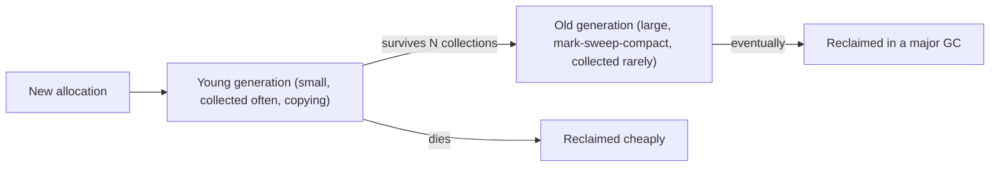

A Go service shows a saw-tooth on its memory graph and a p99 latency spike every time the tooth drops. A Node worker's heap grows by a few megabytes an hour until the container is OOM-killed on day three, even though "JavaScript has garbage collection". A Python batch job that builds a large graph of objects takes twice as long as expected, and the profiler blames a function called `gc.collect`. A Rust program has none of these problems and instead has a compile error you have spent forty minutes on.

All four are the same problem seen from different sides: heap memory has to be reclaimed, someone has to decide when it is safe, and every strategy for deciding has a cost you pay somewhere. Knowing which strategy your runtime uses tells you where that cost will appear and what a leak looks like in a language that supposedly cannot have them.

## The question every strategy answers

Heap memory is safe to reuse when no live code can reach it. The **root set** is everything the program can reach directly: local variables on every thread's stack, global variables, registers. Anything reachable from a root by following pointers is live; everything else is garbage.

There are three families of answer to "is this reachable?":

1. **Reference counting**: every object carries a count of references to it; when the count hits zero it is unreachable, free it now.
2. **Tracing**: periodically start from the roots, follow every pointer, and free whatever was not visited.
3. **Ownership**: prove at compile time exactly when each value's single owner goes out of scope, and free it there. No runtime bookkeeping at all.

CPython uses the first with a tracing collector as a backup. V8, the JVM and Go use the second. Rust uses the third with the first available as an opt-in. Each choice explains observable behaviour of the language.

## Under the hood: the CPython object and its cycle collector

Every CPython object starts with a 16-byte header on 64-bit builds: `ob_refcnt` (8 bytes) and `ob_type` (8 bytes, a pointer to the type object). Objects that can contain references to other objects (lists, dicts, class instances, functions; not ints, strings or bytes, which cannot form cycles) are *GC-tracked* and carry a second 16-byte `PyGC_Head` *before* the header, two pointers that link the object into the collector's generation list. That is why `sys.getsizeof([])` is 56: 16 bytes of GC head, 16 of object header, and 24 for the list's `ob_size`, `ob_item` pointer and `allocated` capacity. The free-threaded build (3.13+) widens the header further for *biased reference counting*: a thread id plus a local count the owning thread updates without atomics and a shared count other threads update atomically, because most objects are only ever touched by one thread, and [PEP 703](https://peps.python.org/pep-0703/) chose biased counting for its lower overhead than making every increment atomic.

Every operation that creates or drops a pointer adjusts the count. Trace a snippet that ends in a cycle:

```python
class Node:
    def __init__(self):
        self.other = None

a = Node()
b = Node()
a.other = b
b.other = a
del a
del b
```

| Step | Statement | `a`'s object count | `b`'s object count | Reachable from a root? |
|---|---|---|---|---|
| 1 | `a = Node()` | 1 (name `a`) | – | Yes |
| 2 | `b = Node()` | 1 | 1 (name `b`) | Yes |
| 3 | `a.other = b` | 1 | 2 (`b`, `a.other`) | Yes |
| 4 | `b.other = a` | 2 (`a`, `b.other`) | 2 | Yes |
| 5 | `del a` | 1 (`b.other`) | 2 | Yes, via `b` |
| 6 | `del b` | 1 (`b.other`) | 1 (`a.other`) | **No**, and neither count is zero |

After step 6 the two nodes keep each other alive forever as far as counting is concerned. Reference counting alone cannot free a cycle, and cycles are common: doubly linked lists, trees with parent pointers, an exception that holds a traceback that holds the frame that holds the exception.

```viz
{"type": "memory", "scenario": "reference-counting", "title": "Counts rising and falling", "caption": "Each new reference bumps the count; the object is freed at the instant the count reaches zero, with no separate collection phase."}
```

The `gc` module's cycle collector finds them with a subtraction trick. For every tracked object in the generation being collected it copies `ob_refcnt` into a scratch field `gc_refs`; then it walks every tracked object's outgoing references and decrements the *referent's* `gc_refs`. What remains in `gc_refs` is the number of references coming from *outside* the tracked set: from roots, from untracked objects, or from other generations. Run it on the two nodes: both start at 1; `a.other` decrements `b` to 0; `b.other` decrements `a` to 0. Anything left above zero is reachable from outside and is marked reachable along with everything it points at; everything else, including both nodes, is garbage. The collector then calls each type's `tp_clear` to break the references, which lets ordinary counting free the memory.

The collector is generational with three generations and default thresholds `(700, 10, 10)` through 3.12 and `(2000, 10, 10)` from 3.13: generation 0 is collected when tracked allocations minus deallocations since the last collection exceed the first threshold; generation 1 after every 10 generation-0 collections; generation 2 after every 10 generation-1 collections, and only when the objects promoted since the last full collection exceed 25% of the long-lived set, a guard that stops full collections from becoming quadratic on a growing heap. Since 3.12 collection is triggered from the interpreter loop between bytecodes rather than from inside the allocator. 3.14.0 shipped an **incremental** collector (two generations, young and old, with old-generation work done in slices so that no single pause scans the whole heap), but 3.14.5 put the generational collector back in the default build (gh-142516), so 3.14.7 reports `(2000, 10, 10)` again. Check `gc.get_threshold()` on the version you run before quoting numbers.

The pause is proportional to the number of tracked objects in the generation, which is what shows up as `gc.collect` in a profile of code that builds millions of small containers. The standard mitigations are `gc.disable()` around a bulk-build phase and `gc.freeze()` after loading a large static dataset, which moves everything currently tracked into a permanent generation the collector stops rescanning. Swift and Objective-C use the same counting idea (ARC) with no backup collector, so cycles leak unless one edge is `weak`.

## Tracing collectors: a mark-sweep walk

A tracing collector ignores counts entirely. When it decides to run, it marks every object reachable from the roots, then sweeps the heap freeing everything unmarked. Walk it on a concrete graph. Roots: a stack variable pointing at `A` and a global pointing at `B`. Edges: `A → C`, `C → D`, `B → D`, `E → F`, `F → E` (an unreachable cycle), and `G` with no references at all.

| Step | Action | Marked so far | Work list |
|---|---|---|---|
| 1 | Push the roots | – | `A`, `B` |
| 2 | Pop `A`, mark it, push its children | `A` | `B`, `C` |
| 3 | Pop `B`, mark it, push `D` | `A B` | `C`, `D` |
| 4 | Pop `C`, mark it, push `D` (already queued) | `A B C` | `D`, `D` |
| 5 | Pop `D`, mark it; no children | `A B C D` | `D` |
| 6 | Pop `D` again: already marked, skip | `A B C D` | empty |
| 7 | Sweep: free every unmarked object | – | `E`, `F`, `G` freed |

`E` and `F` point at each other and are freed anyway, because reachability, not counting, is the test. The cost of the mark phase is proportional to the *live* heap (four objects here), and the sweep is proportional to the whole heap; garbage is free to find in the mark phase and only costs in the sweep.

```viz
{"type": "memory", "scenario": "gc-mark-sweep", "title": "Mark from the roots, sweep the rest", "caption": "Objects not reached during the mark phase are garbage even if they point at each other. Cycles are free."}
```

Cycles cost nothing, and assignments are plain pointer writes, so the mutator (your program) runs faster between collections. The price is the collection itself, and the naive version stops every thread while it runs.

## The generational hypothesis, with numbers

The single most important optimisation rests on an empirical observation: most objects die young. A temporary string, a loop's tuple, a request's parsed body: all garbage within microseconds. Ungar's 1984 generation-scavenging collector for Smalltalk was built on it, and V8's own description of its collector ([Trash talk](https://v8.dev/blog/trash-talk)) says that only a very small percentage of objects survive a collection. The exact fraction depends on the workload and on the nursery size: a larger nursery gives objects longer to die.

So collectors split the heap into a small **young generation** collected very frequently and a large **old generation** collected rarely. A young collection only has to trace objects that survived a short window, which is few, and copies them into survivor space or promotes them. Objects that live through a couple of young collections are promoted to the old generation and mostly left alone.



One subtlety makes it work: an old object may point at a young one (you append a fresh item to a long-lived list). Young collections must know about those pointers without scanning the whole old generation, so the runtime inserts a **write barrier** on every pointer store that records old-to-young references in a remembered set. That is a small tax on every field write in V8 and the JVM, invisible in source but present in the machine code.

### V8 (Node, Chrome)

V8's young generation is built from semi-spaces whose maximum size Node derives from the heap limit (its documentation gives 1 MiB for a 512 MiB limit and under 16 MiB for limits up to 2 GiB on 64-bit; `--max-semi-space-size` overrides it). Allocation is a pointer bump in the active semi-space. When it fills, the **scavenger** copies live objects into the other semi-space (in parallel on helper threads), and the old semi-space is declared empty in O(1); an object that survives a second scavenge is promoted to old space. A scavenge is on the order of a millisecond and its cost is proportional to survivors, not to garbage. Old space uses **mark-compact**: marking runs concurrently on helper threads with the main thread paused only briefly at the start and end, sweeping is lazy, and pages with heavy fragmentation are compacted by moving objects and updating pointers. The old-space limit defaults to a few gigabytes depending on Node version and system memory; `--max-old-space-size` raises it, and a heap that grows steadily towards it is the signature of a leak.

### JVM

HotSpot's default collector, G1, divides the heap into regions and collects the ones with most garbage first, aiming at a pause target (`MaxGCPauseMillis`, default 200 ms). ZGC does almost all its work concurrently with the application and, per [JEP 439](https://openjdk.org/jeps/439), keeps pauses typically under a millisecond independent of heap size, up to multiple terabytes; Shenandoah takes a similar concurrent approach. The cost is throughput and memory overhead, including load barriers on reference reads. The choice is a real design decision: a batch job wants throughput, a trading gateway wants ZGC.

### Go

Go's collector is a **concurrent, non-generational, non-compacting tri-colour mark-sweep**. Objects are white (unvisited), grey (visited, children pending) or black (done); the collector runs on its own goroutines alongside the program, and a write barrier (active only during marking) keeps the invariant that a black object never points at a white one without the collector hearing about it. There are two stop-the-world pauses per cycle, to start marking and to finish it, each typically tens of microseconds. The cost moves elsewhere: during a cycle, dedicated workers take 25% of `GOMAXPROCS`, and if allocation outruns marking, the allocating goroutines are made to *assist*, which is where GC shows up in a latency profile.

`GOGC=100` means: start the next cycle when the heap has grown 100% over the live heap measured at the end of the last one. With 1 GB live, the trigger is near 2 GB, the collection drops it back to 1 GB, and the graph is a saw-tooth between those lines. `GOGC=200` trades memory for fewer cycles; `GOGC=off` disables collection. `GOMEMLIMIT` (Go 1.19+) adds a ceiling: as the total heap approaches it the collector runs more often regardless of `GOGC`, so a container does not get OOM-killed while waiting for the next proportional trigger. Go is not generational on purpose: a generational scheme needs a write barrier that is always on, and the Go team's [2018 account of the collector's design](https://go.dev/blog/ismmkeynote) explains that escape analysis already keeps many short-lived objects on the stack, so generational collection helps Go less than other runtimes.

## Escape analysis: reading `-gcflags=-m`

Go and V8 avoid a great deal of collection by never allocating on the heap in the first place. The compiler decides per variable, and Go prints its decisions:

```go
package main

import "fmt"

type Point struct{ X, Y int }

func newPoint() *Point {
    p := Point{1, 2}
    return &p
}

func sum(ps []Point) int {
    t := 0
    for _, p := range ps {
        t += p.X
    }
    return t
}

func show(p Point) {
    fmt.Println(p)
}

func main() {
    small := make([]byte, 64)
    large := make([]byte, 1<<20)
    n := len(small) + len(large)
    show(*newPoint())
    fmt.Println(sum([]Point{{n, 0}}))
}
```

`go build -gcflags=-m` prints one line per decision. Go 1.27.1 prints these, after the `can inline` lines and with the repeats from inlined calls in `main` omitted:

```text
./main.go:8:2: moved to heap: p
./main.go:12:10: ps does not escape
./main.go:21:13: ... argument does not escape
./main.go:21:14: p escapes to heap
./main.go:25:15: make([]byte, 64) does not escape
./main.go:26:15: make([]byte, 1048576) escapes to heap
```

Read it decision by decision. `p` in `newPoint` is **moved to heap** because its address is returned: the frame that holds it dies at the return, so the value cannot live there. `ps` in `sum` **does not escape**: the function only reads through it and stores the pointer nowhere, so the caller's slice header can stay on the caller's stack. `p` in `show` **escapes to heap** because `fmt.Println` takes `...any`, and converting a struct to an interface stores a copy behind a pointer the callee may keep; a value passed through an interface boundary the compiler cannot see through is usually a heap allocation, which is why `fmt` calls appear in allocation profiles. `make([]byte, 64)` stays on the stack, `make([]byte, 1<<20)` does not: the compiler stack-allocates constant-size `make` calls up to 64 KiB, because the frame size must be known at compile time. A `make` whose size is only known at run time used to escape unconditionally; since Go 1.25 the compiler gives a non-escaping one a 32-byte stack buffer (the compiler's `VariableMakeThreshold`) and uses it when the requested size fits, so on Go 1.27 `make([]byte, n)` made no heap allocation for `n` up to 32 and one allocation from 33 (measured with `testing.AllocsPerRun`).

The consequences for a hot path: return values rather than pointers to small structs, avoid interface conversions in inner loops, and pass slices into functions rather than allocating inside them. V8 performs the same analysis inside its optimising compiler for objects that never leave a function, but it cannot print its decisions, so in JavaScript the evidence is an allocation profile.

## Ownership: Rust

Rust has no collector and no reference counts by default. Every value has exactly one owner; when the owner goes out of scope the value is **dropped**, which frees its heap memory and recursively drops what it owned. The compiler inserts those drops at compile time, in reverse declaration order for locals and in declaration order for a struct's fields, so the cost is exactly what C's `free` costs, placed automatically and impossible to forget or double up.

```rust
fn build() -> Vec<String> {
    let names = vec!["a".to_string(), "b".to_string()];   // names owns the Vec, which owns the Strings
    let view = &names;                                     // a borrow: no ownership change
    println!("{}", view.len());
    names                                                  // ownership moves to the caller; nothing freed here
}                                                          // if names had not been returned, it would be dropped here
```

```viz
{"type": "memory", "scenario": "ownership-borrowing", "title": "One owner, many borrows", "caption": "Borrows come and go without touching ownership; the value is freed exactly once, when its owner leaves scope."}
```

What you give up is the freedom to have two owners, and that is where reference counting comes back. `Rc<T>` allocates a block holding a strong count, a weak count and the value (16 bytes of counts on 64-bit); `Rc::clone` increments the strong count with a plain add, and the value is dropped when it reaches zero. `Arc<T>` is the same with atomic counts, safe across threads; an uncontended atomic increment costs tens of cycles, and a hot `Arc` cloned from many cores bounces its cache line between them, which is the same cost CPython's free-threaded build had to engineer around. Neither detects cycles, so a parent pointer in a tree must be a `Weak<T>`, which does not keep the value alive and must be upgraded before use. Interior mutation through a shared owner needs `RefCell` (checked at run time) or `Mutex`. Data structures with cycles or back-pointers are usually built on indices into a `Vec` or an arena instead. The trade is compile-time effort for zero pauses, which is why Rust is chosen for latency-critical paths and why it is not the fastest language to prototype in. The [Rust essentials lesson](/learn/senior-craft/languages-for-senior-engineers/rust-essentials) develops the borrow rules.

Rust also does not compact, and neither do most allocators. Long-running processes with many differently sized allocations can fragment, holding more memory than they use. jemalloc and mimalloc mitigate this with size-class bins; a compacting GC avoids it entirely, which is the one memory-related advantage the JVM holds over Rust.

## Trade-offs

| Runtime | Strategy | Typical pause | Cycles | Where the cost hides |
|---|---|---|---|---|
| CPython | Refcount + generational cycle collector | Cycle collection: milliseconds, proportional to tracked containers | Backup collector | Cache-line writes on every reference op; the GIL makes counts safe |
| V8 | Generational; scavenger + concurrent mark-compact | Scavenge ~1 ms; major GC pauses usually under 10 ms | Free | Write barriers; heap limit; young-generation churn from closures |
| JVM (G1) | Generational, region-based | Target 200 ms by default, tunable | Free | Throughput and memory overhead; tuning |
| JVM (ZGC) | Concurrent, generational since JDK 21 (default mode since 23) | Under 1 ms | Free | Load barriers on reads; throughput and memory |
| Go | Concurrent tri-colour mark-sweep | Two pauses of tens of microseconds per cycle | Free | 25% CPU during cycles; assists; heap 2× live by default |
| Rust | Ownership; allocator only | None | `Weak` by hand | Compile-time design; explicit `Arc`; fragmentation |

The numbers are orders of magnitude that move with heap size and hardware, but the shape is stable: reference counting spreads cost thinly everywhere, tracing concentrates it into cycles, ownership pays at compile time.

A rule that follows from all of them: **allocation rate is the knob**. A tracing collector's total work is proportional to how often it runs, which is proportional to how fast you allocate. A Go handler that allocates 10 MB per request at 1,000 requests per second forces a cycle several times a second; the same handler reusing buffers via `sync.Pool` might collect once a minute. In V8, keeping objects monomorphic and avoiding per-iteration closures reduces young-generation churn. In CPython, `__slots__` on hot classes and avoiding needless tuple creation help for the same reason. The [stack and heap lesson](/learn/foundations/how-code-runs/stack-heap-and-the-call-stack) explains why allocation count, not object size, is the number to watch.

## Failure modes in production: leaks in garbage-collected languages

A collector frees what is unreachable. It cannot free what is reachable but unwanted, and that is what a leak looks like in Python, JavaScript, Java and Go: not a `malloc` without a `free`, but a reference somebody forgot to drop. The diagnostic method is the same everywhere: take two heap snapshots minutes apart under steady load and look at what grew (Chrome DevTools or `node --heapsnapshot-signal`, `tracemalloc` in Python, `pprof` heap profiles in Go, a JVM heap dump read as a dominator tree).

**Symptom: heap grows linearly with traffic and never plateaus; a snapshot diff shows one `Map`, `dict` or `HashMap` holding most of the growth.** Diagnosis: a cache or registry keyed by request ID, session ID or user ID with no eviction; it grows by definition. Fix: bound it with an LRU (the [LRU cache lesson](/learn/advanced-data-structures/caches-and-eviction/lru-cache) builds one) or a TTL, and add a metric for its size.

**Symptom: a Node process prints `MaxListenersExceededWarning: Possible EventEmitter memory leak detected. 11 listeners added`, and snapshots show components retained through an `_events` array.** Diagnosis: a handler registered with `emitter.on(...)` per request or per component mount is never removed, and the emitter is long-lived, so every closure and everything it captured stays reachable. Fix: remove the listener on teardown, use `once` for one-shot handlers, or pass an `AbortSignal` so the runtime removes it for you.

**Symptom: a small callback keeps a large buffer alive; the snapshot's retainer path goes through a closure that never mentions the buffer.** Diagnosis: V8 gives all closures created in one scope a single shared context object, so if *any* closure in that scope references the buffer, every closure from the scope retains it. Fix: set the variable to `null` when done, or create the callback in its own function so it gets its own context.

**Symptom: a Go service's goroutine count (`runtime.NumGoroutine`, `/debug/pprof/goroutine`) climbs steadily, along with memory.** Diagnosis: goroutines blocked forever on a channel send with no receiver, a receive with no sender, or a `select` with no cancellation path; each holds its stack and everything reachable from it. Fix: give every goroutine a `context.Context` and a `select` on `ctx.Done()`, size buffered channels deliberately, and assert the goroutine count in integration tests.

**Symptom: a Python worker's RSS grows though `gc.collect()` frees nothing, and `tracemalloc` points at a module-level list or a `functools.lru_cache` on a method.** Diagnosis: module globals live as long as the process, and `lru_cache` on a method keys the cache on `self`, so instances stay alive until they age out of the cache, which with `maxsize=None` is never ([Python FAQ](https://docs.python.org/3/faq/programming.html#how-do-i-cache-method-calls)). Fix: move the accumulation into a request-scoped object, use `cachetools` with a bound, or cache on a standalone function keyed by an ID rather than an instance.

**Symptom: a Java service leaks across requests only when running on a thread pool.** Diagnosis: `ThreadLocal` values set per request on pooled threads outlive the request that set them. Fix: `remove()` in a `finally`, or scoped values.

## Interviewer follow-ups

**"Why does CPython need a cycle collector if it already reference-counts?"** Model answer: two objects that point at each other hold each other's count at one after every outside reference is gone, so counting never frees them; the `gc` module finds such groups by subtracting internal references from the counts and treating whatever is left as the outside world. Common wrong answer: "the collector is for objects Python forgot to count", which does not exist; every reference is counted.

**"What does `GOGC=100` mean, and what would you change if a Go service was OOM-killed at 2 GB with a 1 GB live heap?"** Model answer: the next cycle starts when the heap reaches twice the live size, so 1 GB live legitimately peaks near 2 GB; set `GOMEMLIMIT` a little under the container limit so the collector runs earlier as it approaches, and only then consider a lower `GOGC`, which costs CPU. Common wrong answer: "lower `GOGC` to 50", which halves the peak at the price of twice as many cycles, when the limit knob was designed for exactly this.

**"Why is Go's collector not generational when every other major collector is?"** Model answer: generational collection needs a write barrier on every pointer store to record old-to-young references, and Go's designers judged the barrier's cost and complexity too high given that escape analysis already keeps most short-lived values on the stack; Go pays instead with a 25% CPU share during concurrent marking. Common wrong answer: "Go's collector is generational, that is why it is fast".

**"Where does reference counting come back in Rust, and what does it cost?"** Model answer: `Rc` and `Arc`, when a value needs more than one owner; `Rc::clone` is a plain increment and `Arc::clone` an atomic one, and neither detects cycles, so back-pointers must be `Weak`. Common wrong answer: "Rust has no reference counting", or "`Arc` is free because it is a smart pointer".

## What mid-level engineers get wrong

- Reading a saw-tooth memory graph as a leak. Consequence: a page, a "fix" that lowers `GOGC`, and a slower service; the troughs rising over time is the leak signal, not the teeth.
- Optimising heap size when GC dominates a profile. Consequence: no change, because the collector's work is proportional to allocation rate and survivors, not to the heap limit.
- Assuming a garbage-collected language cannot leak. Consequence: an unbounded map or a listener registry grows for days and the container is OOM-killed with no error in the logs.
- Calling `gc.collect()` in a request handler "to be safe". Consequence: a full collection per request, milliseconds of pause each time, for garbage that reference counting already freed.
- Passing structs through interfaces in a Go hot loop. Consequence: an allocation per call that `-gcflags=-m` would have shown as `escapes to heap`.
- Storing an `Rc` parent pointer in a Rust tree. Consequence: a reference cycle that is never freed, in a language advertised as leak-free by construction.

```exercise
id: mark-sweep-garbage
title: Find the garbage with mark and sweep
prompt: |
  `objects` is a list of object ids. `edges` maps an object id (as a
  string key) to the list of ids it references. `roots` is the list of ids
  directly reachable from the program. Return the sorted list of ids that
  a mark-sweep collector would free: every object not reachable from any
  root by following edges. Objects that reference each other but are not
  reachable from a root are garbage. Ids with no entry in `edges` reference
  nothing.
languages: [python, javascript]
entry: garbage
starter:
  python: |
    def garbage(objects, edges, roots):
        # your code here
        return []
  javascript: |
    function garbage(objects, edges, roots) {
      // your code here
      return [];
    }
tests:
  - args: [[1, 2, 3, 4, 5, 6], {"1": [2], "2": [3], "4": [5], "5": [4]}, [1]]
    expected: [4, 5, 6]
    label: unreachable cycle and an orphan are garbage
  - args: [[1, 2], {"1": [2], "2": [1]}, [1]]
    expected: []
    label: a reachable cycle is live
  - args: [[1, 2, 3], {}, []]
    expected: [1, 2, 3]
    label: no roots means everything is garbage
  - args: [[], {}, []]
    expected: []
    label: empty heap
  - args: [[1, 2, 3, 4, 5], {"1": [2, 3], "2": [4], "3": [4]}, [1]]
    expected: [5]
    label: diamond reaches 4 once
  - args: [[1, 2, 3], {"3": [3]}, [1]]
    expected: [2, 3]
    hidden: true
  - args: [[1, 2, 3, 4], {"1": [2], "3": [4]}, [1, 3]]
    expected: []
    hidden: true
hints:
  - "Breadth-first or depth-first from every root, keeping a visited set; then return the sorted objects not in it."
  - "Look up edges with the string form of the id: `edges.get(str(x), [])` in Python, `edges[String(x)] ?? []` in JavaScript."
```

## Senior signals

- You can name your runtime's collector and its pause characteristics, and you know which knob (`GOGC`, `GOMEMLIMIT`, `--max-old-space-size`, `-Xmx`, `gc.freeze`) is the right first move for a given symptom.
- You treat allocation rate, not heap size, as the thing to optimise when GC shows up in a profile, and you can point at the allocating line, in Go by reading `-gcflags=-m`.
- You explain leaks in GC languages as "reachable but unwanted" and list the usual suspects (unbounded maps, listeners, shared closure contexts, timers, blocked goroutines, thread-locals) before opening a profiler.
- You can trace reference counts through a cycle, explain the subtraction trick the cycle collector uses, and say what the generation thresholds mean on the Python version you run.
- You can walk a mark phase on a small graph and state that its cost is proportional to live data while the sweep is proportional to the heap.
- You can say what Rust's ownership model gives up (shared mutable graphs are awkward, `Rc` cycles leak) as well as what it gains (no pauses, no leaks of the GC kind).
- You recognise a saw-tooth memory graph as normal collector behaviour and a monotonic climb as a leak, and you do not page anyone for the former.

## Check yourself

```quiz
- q: >-
    Two CPython objects reference each other and nothing else references them. What happens?
  options: ["Never freed, because reference counting cannot see cycles", "Kept at count 1 until the cyclic collector finds them", "Freed at once, when the last outside reference is dropped", "Rejected, because CPython raises an error on cycles"]
  answer: 1
  explanation: >-
    Reference counting alone cannot see that the cycle is unreachable, because each object still has a count of 1, so nothing is freed immediately. The gc module's collector subtracts internal references from the counts, finds both at zero, breaks the cycle with tp_clear and lets counting free them.
- q: >-
    A Go service's memory graph rises to about 2 GB, drops to 1 GB, and repeats every few seconds under steady load. Latency is fine. What is the most likely explanation?
  options: ["Goroutine stacks growing and shrinking under steady load", "The kernel reclaiming page cache every few seconds", "Normal GOGC=100 cycles around a live heap of about 1 GB", "A leak that the garbage collector is only partly fixing"]
  answer: 2
  explanation: >-
    Go starts a cycle when the heap grows 100% beyond the live heap after the previous cycle, producing exactly this saw-tooth around a 1 GB live set. A leak would show the troughs rising over time. Setting GOMEMLIMIT caps the peaks if the container is tight.
- q: >-
    Why do generational collectors need a write barrier on pointer stores?
  options: ["To trigger compaction of the young generation on write", "To prevent data races between threads that store pointers", "To remember old-to-young pointers for young collections", "To count references held by old-generation objects"]
  answer: 2
  explanation: >-
    A young collection traces only the young generation plus roots; an old object pointing at a young one would otherwise be missed and the young object wrongly freed. The barrier records those old-to-young pointers in a remembered set, so the young collection finds them without scanning the whole old generation. It is bookkeeping for reachability, not reference counting.
- q: >-
    A Node process's heap grows steadily for days until it is OOM-killed. Which is the least likely cause?
  options: ["An event listener added per request and never removed", "A module-level Map keyed by request ID, never cleared", "A setInterval capturing a large object, never cleared", "Short-lived request objects that reference each other in cycles"]
  answer: 3
  explanation: >-
    V8 is a tracing collector; unreachable cycles are collected without special handling. The other three keep objects reachable from a root, which is what a leak in a garbage-collected language looks like.
- q: >-
    `go build -gcflags=-m` prints `moved to heap: p` for a local struct in a function that returns `&p`. Why did the compiler decide that?
  options: ["The address outlives the frame, so the value cannot stay there", "The struct is larger than the 64 KiB stack allocation limit", "Taking any address in Go forces a heap allocation", "Structs in Go are always allocated on the heap"]
  answer: 0
  explanation: >-
    Escape analysis moves a value to the heap when a pointer to it can survive the function, and a returned address does. Taking an address that stays inside the function does not escape, small structs normally live on the stack, and the 64 KiB rule applies to constant-size make calls, not to a two-field struct.
- q: >-
    Which statement about Rust's memory management is accurate?
  options: ["Rust reference-counts every value, preventing data races", "Rust frees each value once, at a point fixed at compile time", "Rust compacts its heap periodically to avoid fragmentation", "Rust runs a lightweight garbage collector at each scope exit"]
  answer: 1
  explanation: >-
    Drops are inserted at compile time based on ownership, so there are no collection pauses; nothing runs at scope exit except the inserted drop. Reference counting is opt-in via Rc/Arc for shared-ownership graphs, and Rust's allocator does not compact, so fragmentation is possible in long-running processes.
```
