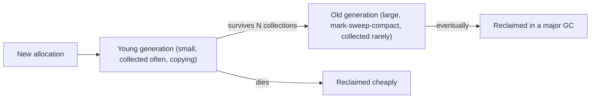

A Go service shows a saw-tooth on its memory graph and a p99 latency spike every time the tooth drops. A Node worker's heap grows by a few megabytes an hour until the container is OOM-killed on day three, even though "JavaScript has garbage collection". A Python batch job that builds a large graph of objects takes twice as long as expected, and the profiler blames a function called `gc.collect`. A Rust program has none of these problems and instead has a compile error you have spent forty minutes on.

All four are the same problem seen from different sides: heap memory has to be reclaimed, someone has to decide when it is safe, and every strategy for deciding has a cost you pay somewhere. Knowing which strategy your runtime uses tells you where that cost will appear and what a leak looks like in a language that supposedly cannot have them.

## The question every strategy answers

Heap memory is safe to reuse when no live code can reach it. The **root set** is everything the program can reach directly: local variables on every thread's stack, global variables, registers. Anything reachable from a root by following pointers is live; everything else is garbage.

There are three families of answer to "is this reachable?":

1. **Reference counting**: every object carries a count of references to it; when the count hits zero it is unreachable, free it now.
2. **Tracing**: periodically start from the roots, follow every pointer, and free whatever was not visited.
3. **Ownership**: prove at compile time exactly when each value's single owner goes out of scope, and free it there. No runtime bookkeeping at all.

CPython uses the first with a tracing collector as a backup. V8, the JVM and Go use the second. Rust uses the third with the first available as an opt-in. Each choice explains observable behaviour of the language.

## Reference counting: CPython and Swift

Every CPython object begins with a header containing `ob_refcnt` and a type pointer. Binding a name, storing into a list, passing an argument: each increments the count. Rebinding, deleting, returning from a function: each decrements. When a decrement reaches zero, the object is freed *immediately*, and its own references to other objects are decremented in turn, which can cascade.

```python
import sys
a = [1, 2, 3]
print(sys.getrefcount(a))   # 2: the name a, plus the temporary argument to getrefcount
b = a
print(sys.getrefcount(a))   # 3
del b                       # count drops to 1
del a                       # count drops to 0: the list is freed right here
```

```viz
{"type": "memory", "scenario": "reference-counting", "title": "Counts rising and falling", "caption": "Each new reference bumps the count; the object is freed at the instant the count reaches zero, with no separate collection phase."}
```

The strengths are immediacy and predictability. Memory is reclaimed the moment it becomes garbage, so a Python process's memory tracks its live data closely, and `with open(...)` style cleanup is prompt. There are no long pauses, because work is spread across every assignment.

The costs are just as concrete:

- **Every reference operation writes to memory.** `x = y` is not a register move; it touches the object's header, which pulls that cache line in and dirties it. On a multi-core machine with shared objects this is why free-threaded CPython had to invent *biased reference counting* (a fast path for the owning thread, atomics for others): plain atomic increments on every assignment would have halved throughput.
- **Cycles never reach zero.** Two objects that point at each other have count 1 each forever, even when nothing else references them. A doubly linked list, a parent pointer in a tree, an exception holding a traceback holding the frame that holds the exception: all cycles.

CPython handles cycles with a separate **generational cyclic collector** in the `gc` module. It tracks container objects (lists, dicts, instances; not ints or strings, which cannot form cycles) and runs when allocations minus deallocations since the last run cross a threshold (700 by default for the youngest generation). It finds cycles by temporarily subtracting internal references and seeing which counts drop to zero. That run is a pause proportional to the number of tracked objects in the generation, and it is what shows up as `gc.collect` in a profile of code that allocates millions of small containers. The standard mitigation for a bulk-build phase is `gc.disable()` around it, or `gc.freeze()` after loading a large static dataset so the collector stops rescanning it.

Swift and Objective-C use the same idea (ARC) without the backup collector, so cycles leak unless you mark one edge `weak`. Rust's `Rc`/`Arc` are the same again, and `Weak` exists for the same reason.

## Tracing collectors: mark, sweep, and the generational hypothesis

A tracing collector ignores counts entirely. When it decides to run, it marks every object reachable from the roots, then sweeps the heap freeing everything unmarked.

```viz
{"type": "memory", "scenario": "gc-mark-sweep", "title": "Mark from the roots, sweep the rest", "caption": "Objects not reached during the mark phase are garbage even if they point at each other. Cycles are free."}
```

Cycles cost nothing, and assignments are plain pointer writes, so the mutator (your program) runs faster between collections. The price is the collection itself: its cost is proportional to the *live* heap, not to the garbage, and the naive version stops every thread while it runs.

The single most important optimisation is the **generational hypothesis**: most objects die young. A temporary string, a loop's tuple, a request's parsed body: all garbage within microseconds. So collectors split the heap into a small **young generation** collected very frequently and a large **old generation** collected rarely. A young-generation collection only has to trace objects that survived a short window, which is few, and copies them into survivor space or promotes them. Objects that live through a couple of young collections are promoted to the old generation and mostly left alone.



One subtlety makes generational collection work: an old object may point at a young one (you append a fresh item to a long-lived list). Young collections must know about those pointers without scanning the whole old generation, so the runtime inserts a **write barrier** on every pointer store that records old-to-young references. That is a small tax on every field write in V8 and the JVM, invisible in source but present in the machine code.

### V8 (Node, Chrome)

V8's young generation ("new space", tens of megabytes) uses a semi-space copying **scavenger**: live objects are copied to the other half, the old half is declared empty in O(1). Scavenges typically take on the order of a millisecond and run in parallel on helper threads. The old generation uses mark-sweep with compaction, and marking is incremental and concurrent so that the main thread pauses only briefly. The default old-space limit is a few gigabytes; `--max-old-space-size` raises it, and a heap that grows steadily towards it is the signature of a leak.

### JVM

HotSpot's default collector, G1, divides the heap into regions and collects the ones with most garbage first, aiming at a configurable pause target. ZGC and Shenandoah do almost all work concurrently with the application and hold pauses under a millisecond even on heaps of hundreds of gigabytes, at the cost of throughput (load barriers on every reference read) and memory overhead. The choice is a real design decision: a batch job wants throughput, a trading gateway wants ZGC.

### Go

Go's collector is a **concurrent, non-generational, non-compacting tri-colour mark-sweep**. Objects are white (unvisited), grey (visited, children pending) or black (done); the collector runs on its own goroutines alongside the program, and a write barrier keeps the invariant that a black object never points at a white one. Pauses are on the order of tens to hundreds of microseconds. The cost moves elsewhere: while a cycle runs, the collector takes roughly a quarter of the CPU, and if allocation outruns marking, the allocating goroutines are made to assist. The `GOGC` knob (default 100) starts a cycle when the heap grows 100% over the live size after the last collection, which produces the saw-tooth: heap climbs to twice the live set, drops, climbs again. `GOMEMLIMIT` adds a hard ceiling so a container does not get OOM-killed while waiting for the next proportional trigger.

The reason Go is not generational is deliberate: the write barrier a generational scheme needs was judged too expensive, and Go's escape analysis already keeps many short-lived objects on the stack, where they cost nothing to reclaim.

## Ownership: Rust

Rust has no collector and no reference counts by default. Every value has exactly one owner; when the owner goes out of scope the value is dropped, which frees its heap memory and recursively drops what it owned. The compiler inserts those drops at compile time, so the cost is exactly what C's `free` costs, placed automatically and impossible to forget or double up.

```rust
fn build() -> Vec<String> {
    let names = vec!["a".to_string(), "b".to_string()];   // names owns the Vec, which owns the Strings
    let view = &names;                                     // a borrow: no ownership change
    println!("{}", view.len());
    names                                                  // ownership moves to the caller; nothing freed here
}                                                          // if names had not been returned, it would be dropped here
```

```viz
{"type": "memory", "scenario": "ownership-borrowing", "title": "One owner, many borrows", "caption": "Borrows come and go without touching ownership; the value is freed exactly once, when its owner leaves scope."}
```

What you give up is the freedom to have two owners. Shared ownership must be explicit (`Rc<T>` single-threaded, `Arc<T>` across threads, both reference-counted, both with `Weak` for cycles), and interior mutability must be explicit (`RefCell`, `Mutex`). Data structures with cycles or back-pointers (doubly linked lists, graphs with parent links) are famously awkward and usually built on indices into a `Vec` or arena instead. The trade is compile-time effort for zero runtime cost and no pauses, which is why Rust is chosen for latency-critical paths and why it is not the fastest language to prototype in.

Rust also does not compact, and neither do most allocators. Long-running processes with many differently sized allocations can fragment, holding more memory than they use. jemalloc and mimalloc mitigate this with size-class bins; a compacting GC avoids it entirely, which is the one memory-related advantage the JVM holds over Rust.

## What it costs, in numbers

| Runtime | Strategy | Typical pause | Where the cost hides |
|---|---|---|---|
| CPython | Refcount + generational cycle collector | Cycle collection: milliseconds, proportional to tracked containers | Cache-line writes on every reference op; the GIL makes refcounts safe |
| V8 | Generational; scavenger + concurrent mark-sweep-compact | Scavenge ~1 ms; major GC pauses usually under 10 ms | Write barriers; heap limit; deopts during GC |
| JVM (G1) | Generational, region-based | Configurable target, ~10–200 ms | Throughput and memory overhead; tuning |
| JVM (ZGC) | Concurrent, non-generational or generational depending on version | Under 1 ms | Load barriers on reads; ~10–20% throughput |
| Go | Concurrent tri-colour mark-sweep | Tens to hundreds of microseconds | 25% CPU during cycles; assist pressure; heap 2× live by default |
| Rust | Ownership; allocator only | None | Compile-time design; explicit `Arc`; fragmentation |

The numbers are orders of magnitude, and they move with heap size and hardware, but the shape is stable: reference counting spreads cost thinly everywhere, tracing concentrates it into cycles, ownership pays at compile time.

A rule that follows from all of them: **allocation rate is the knob**. A tracing collector's total work is proportional to how often it runs, which is proportional to how fast you allocate. A Go handler that allocates 10 MB per request at 1,000 requests per second forces a GC cycle several times a second; the same handler reusing buffers via `sync.Pool` might collect once a minute. In V8, keeping objects monomorphic and avoiding per-iteration closures reduces young-generation churn. In CPython, `__slots__` on hot classes and avoiding needless tuple creation help for the same reason. Escape analysis in Go and V8 does some of this for you, but only for objects the compiler can prove never leave the function.

## Leaks in garbage-collected languages

A collector frees what is unreachable. It cannot free what is reachable but unwanted, and that is what a leak looks like in Python, JavaScript, Java and Go: not a `malloc` without a `free`, but a reference somebody forgot to drop.

The catalogue is short and recurs everywhere:

- **Unbounded caches and maps.** A dictionary keyed by request ID, session ID or user ID with no eviction. Grows forever by definition. Use an LRU with a size cap or a TTL.
- **Event listeners and callbacks.** In browsers and Node, `emitter.on(...)` from a component that is later discarded keeps the component alive through the listener; Node even warns at 11 listeners on one event for this reason.
- **Closures capturing more than they need.** A closure that references one field of a large object keeps the whole object alive in most runtimes, because the closure captures the variable, not the field.
- **Timers.** `setInterval` without `clearInterval` holds its callback and everything it captures until the process exits.
- **Thread-locals and statics.** Java `ThreadLocal` values on pooled threads outlive the request that set them. Module-level lists in Python that accumulate.
- **Sub-slices of large buffers.** In Go, a 20-byte slice of a 10 MB read keeps the whole 10 MB alive. Copy the small part out.
- **Cycles with finalisers.** Historically, Python objects in a cycle with `__del__` were uncollectable; since 3.4 they are collected, but finalisers that resurrect objects still cause trouble.

Diagnosing them is a skill with a standard toolkit: heap snapshots diffed across time (Chrome DevTools, `node --heapsnapshot-signal`), `tracemalloc` in Python to attribute allocations to source lines, `pprof` heap profiles in Go, and JVM heap dumps read with a dominator-tree view. In every tool the method is the same: take two snapshots minutes apart under steady load, and look at what grew.

## Senior signals

- You can name your runtime's collector and its pause characteristics, and you know which knob (`GOGC`, `GOMEMLIMIT`, `--max-old-space-size`, `-Xmx`, `gc.freeze`) is the right first move for a given symptom.
- You treat allocation rate, not heap size, as the thing to optimise when GC shows up in a profile, and you can point at the allocating line.
- You explain leaks in GC languages as "reachable but unwanted" and list the usual suspects (unbounded maps, listeners, closures, timers) before opening a profiler.
- You know why CPython needs a cycle collector on top of refcounts and what kinds of objects it tracks.
- You can say what Rust's ownership model gives up (shared mutable graphs are awkward) as well as what it gains (no pauses, no leaks of the GC kind).
- You recognise a saw-tooth memory graph as normal collector behaviour and a monotonic climb as a leak, and you do not page anyone for the former.

## Check yourself

```quiz
- q: >-
    Two CPython objects reference each other and nothing else references them. What happens?
  options: ["Kept at count 1 until the cyclic collector finds them", "Never freed, because reference counting cannot see cycles", "Freed at once, when the last outside reference is dropped", "Rejected, because CPython raises an error on cycles"]
  answer: 0
  explanation: >-
    Reference counting alone cannot see that the cycle is unreachable, because each object still has a count of 1, so nothing is freed immediately. That is why CPython has a backup: the gc module's generational collector periodically scans container objects and reclaims such cycles, so they are not leaked forever.
- q: >-
    A Go service's memory graph rises to about 2 GB, drops to 1 GB, and repeats every few seconds under steady load. Latency is fine. What is the most likely explanation?
  options: ["Normal GOGC=100 cycles around a live heap of about 1 GB", "The kernel reclaiming page cache every few seconds", "Goroutine stacks growing and shrinking under steady load", "A leak that the garbage collector is only partly fixing"]
  answer: 0
  explanation: >-
    Go starts a cycle when the heap grows 100% beyond the live heap after the previous cycle, producing exactly this saw-tooth around a 1 GB live set. A leak would show the troughs rising over time. Setting GOMEMLIMIT caps the peaks if the container is tight.
- q: >-
    Why do generational collectors need a write barrier on pointer stores?
  options: ["To trigger compaction of the young generation on write", "To remember old-to-young pointers for young collections", "To prevent data races between threads that store pointers", "To count references held by old-generation objects"]
  answer: 1
  explanation: >-
    A young collection traces only the young generation plus roots; an old object pointing at a young one would otherwise be missed and the young object wrongly freed. The barrier records those old-to-young pointers in a remembered set, so the young collection finds them without scanning the whole old generation. It is bookkeeping for reachability, not reference counting.
- q: >-
    A Node process's heap grows steadily for days until it is OOM-killed. Which is the least likely cause?
  options: ["Short-lived request objects that reference each other in cycles", "A module-level Map keyed by request ID, never cleared", "An event listener added per request and never removed", "A setInterval capturing a large object, never cleared"]
  answer: 0
  explanation: >-
    V8 is a tracing collector; unreachable cycles are collected without special handling. The other three keep objects reachable from a root, which is what a leak in a garbage-collected language looks like.
- q: >-
    Which statement about Rust's memory management is accurate?
  options: ["Rust reference-counts every value, preventing data races", "Rust frees each value once, at a point fixed at compile time", "Rust runs a lightweight garbage collector at each scope exit", "Rust compacts its heap periodically to avoid fragmentation"]
  answer: 1
  explanation: >-
    Drops are inserted at compile time based on ownership, so there are no collection pauses; nothing runs at scope exit except the inserted drop. Reference counting is opt-in via Rc/Arc for shared-ownership graphs, and Rust's allocator does not compact, so fragmentation is possible in long-running processes.
```
