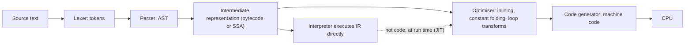

The same loop, summing ten million integers, takes about half a second in plain Python, a few milliseconds in Go or Rust, and about ten milliseconds in Python if you write it with NumPy. The loop is identical. The difference is entirely in what stands between your source text and the CPU: an interpreter walking bytecode one instruction at a time, a compiler that turned the loop into eleven machine instructions months before it ran, or a library that lets you hand the loop to compiled code.

"Python is slow" and "Rust is fast" are folklore until you can say *why*, and the why has consequences you will meet at work: JIT warm-up that makes the first thousand requests after a deploy slow, a Python service that cannot use its second core, a Java process that takes 20 seconds to start in a serverless function, a JavaScript function that runs fast for an hour and then suddenly ten times slower because someone passed it a string instead of a number. Each is a property of the execution pipeline.

## The pipeline every language shares

Whatever the language, source text goes through the same stages. Where each language *stops* and starts executing is what separates a compiler from an interpreter.



- **Lexing and parsing** turn text into a tree. Every language does this; it costs time proportional to source size and is why very large generated files slow builds.
- **Lowering to an intermediate representation.** Python and Java produce bytecode for a virtual stack machine. LLVM-based compilers (Rust, Clang, Swift) produce SSA form. Go has its own SSA backend.
- **Optimisation** rewrites the IR: fold `2 * 3` into `6`, inline small functions, hoist loop-invariant loads, eliminate dead code, vectorise. This is where most of the speed comes from and most of the compile time goes.
- **Code generation** picks registers and emits machine instructions for a specific CPU.

An **ahead-of-time (AOT) compiler** runs all stages before the program starts and ships machine code. An **interpreter** stops at the IR and executes it with a loop that reads one instruction, does it, reads the next. A **just-in-time (JIT) compiler** starts as an interpreter, watches which code runs often, and compiles that code to machine code while the program runs, using what it has observed.

## Why an interpreter is slow: the cost of one `a + b`

Take `total = total + x` inside a Python loop. CPython compiles the function to bytecode once (cached in `__pycache__`), then executes it:

```python
>>> import dis
>>> def add(total, x): return total + x
>>> dis.dis(add)
  1           LOAD_FAST                0 (total)
              LOAD_FAST                1 (x)
              BINARY_OP                0 (+)
              RETURN_VALUE
```

Four instructions look cheap. What `BINARY_OP` actually does:

1. Read the opcode, jump to its handler (a branch the CPU often mispredicts).
2. Pop two `PyObject*` from the value stack.
3. Check the type of the left operand; find its `+` implementation via the type's slot table.
4. Check that both are ints of a size that fits the fast path; if so, add the digits; if not, fall back to arbitrary-precision addition.
5. Allocate a new int object for the result (small ints are cached; large ones are allocated).
6. Decrement the reference counts of the two operands, possibly freeing one.
7. Push the result.

That is on the order of 30–100 machine instructions and at least one memory allocation for what a compiled language does in one `add` instruction with no allocation at all, because the compiler knew at build time that both operands were 64-bit integers living in registers. The ratio, roughly 30–100 to 1, is the whole story of "Python is slow" for tight numeric loops. It is not the syntax and not the language design; it is that every operation must rediscover, at run time, what the types are and where the values live.

Python 3.11's **specialising adaptive interpreter** narrows the gap. After a `BINARY_OP` has seen two ints a few times it rewrites itself in place to `BINARY_OP_ADD_INT`, a version that skips the type dispatch and checks only that the assumption still holds. Together with cheaper frames it gave 3.11 a 10–60% speed-up over 3.10 on typical code. Python 3.13 added an experimental copy-and-patch JIT that compiles those specialised traces to machine code; it is off by default and its gains are still modest. The 30–100× overhead is now more like 10–50× for arithmetic loops, and still an order of magnitude.

## Why a JIT can be fast: V8

V8 (Chrome, Node, Deno) runs JavaScript through a tiered pipeline:

1. **Ignition** compiles source to bytecode and interprets it, gathering *type feedback* at every property access and operation.
2. **Sparkplug** compiles that bytecode to unoptimised machine code almost instantly, removing dispatch overhead but not type checks.
3. **Maglev** produces reasonably optimised code quickly for warm functions.
4. **TurboFan** compiles hot functions with the full optimiser, *speculating* on the observed types: "this `+` has only ever seen small integers, so emit an integer add with an overflow check and a bail-out."

The bail-out is called **deoptimisation**: if the speculation is violated (a string arrives), the optimised code is thrown away and execution falls back to the interpreter, which will re-profile and possibly re-optimise. A function that keeps flipping between shapes of input never settles, and that is the "fast for an hour, then slow" bug.

Two mechanisms make speculation pay:

- **Hidden classes (shapes) and inline caches.** Objects created the same way share a hidden class describing their layout. A property access site remembers the hidden class it last saw and the offset of the property; if the next object matches, the load is a single memory read at a fixed offset, exactly like a compiled struct field. A site that sees one shape is *monomorphic* (fastest), a few shapes *polymorphic* (a short chain of checks), many shapes *megamorphic* (falls back to a hash lookup and never gets optimised). Adding properties in different orders, or deleting properties, creates new shapes.
- **Inlining across the profile.** Because the JIT sees which function a call site actually reaches, it can inline through indirect calls and interfaces that an AOT compiler cannot resolve. This is the one structural advantage a JIT has over AOT: it optimises for what the program *does*, not for what the type system *allows*.

A monomorphic JavaScript numeric loop under TurboFan runs within a small factor of C. The same loop with mixed types, or objects of varying shape, runs closer to CPython speed. That variance is the price of dynamism, and writing JIT-friendly code (stable shapes, consistent types at each site, no `arguments` tricks) is a real skill in performance-sensitive Node services.

The JVM follows the same design with C1 (fast, lightly optimised) and C2 (slow, heavily optimised) tiers, and because Java has static types, its speculation is mostly about *which* implementation of an interface is live, not what type a value is. GraalVM native-image trades that JIT for AOT compilation to fix the start-up problem, at the cost of some peak performance.

## Why AOT is fast, and what it gives up: Go and Rust

Go compiles to machine code ahead of time with a compiler designed for speed of compilation: a large service builds in seconds. Its optimiser is deliberately simpler than LLVM's (less aggressive inlining, no autovectorisation), so Go code is typically slower than equivalent Rust or C by a small factor and faster than any interpreted language by a large one. Static types mean every `a + b` is one instruction; escape analysis keeps values on the stack; the garbage collector, covered in [memory management](/learn/foundations/how-code-runs/memory-management), is the main run-time cost.

Rust compiles through LLVM with the full optimiser. Generics are **monomorphised**: `Vec<i32>` and `Vec<String>` become two separate compiled types, each specialised, which is why Rust iterators and closures compile to the same code as a hand-written loop ("zero-cost abstraction") and also why Rust compile times are long and binaries are large. There is no runtime type dispatch unless you ask for it with `dyn Trait`.

What AOT gives up is runtime knowledge. It cannot see which branch is hot or which interface implementation is live, so it must generate code that is correct for all of them. Profile-guided optimisation (PGO) recovers some of this by feeding a recorded profile back into a second compile; Go, Rust and Clang all support it, and the gain is typically 5–15%.

## The numbers, side by side

For a tight loop summing 10^7 integers on a modern core, the shape is:

| Implementation | Approximate time | Why |
|---|---|---|
| CPython `for` loop | 300–600 ms | Bytecode dispatch, boxing, refcounting per iteration |
| CPython `sum(range(n))` | ~50 ms | The loop runs in C inside `sum`; only the iteration protocol remains |
| NumPy `arr.sum()` | ~5–10 ms | One call into a compiled, vectorised kernel over contiguous memory |
| Node, monomorphic loop | ~10 ms | TurboFan compiled the loop to machine integer adds |
| Go | ~3–5 ms | AOT machine code; bounds checks on each access |
| Rust `iter().sum()` | ~2–5 ms | AOT, bounds checks elided, possibly vectorised |

These are orders of magnitude, not benchmarks; the [benchmarking lesson](/learn/foundations/complexity/benchmarking-reality) explains why the exact figures move by 2× between machines. The lesson in the table is that "Python is slow" is really "Python *bytecode loops* are slow", and the standard escape is to move the loop into compiled code: NumPy, pandas, a C extension, Cython, or a Rust module via PyO3. A Python service that spends its time in `json.loads`, `re`, database drivers and NumPy is already mostly running C.

## What the pipeline does to production

**Warm-up.** A JIT-compiled service is slow for its first seconds to minutes: functions run interpreted until profiled, then compile, then possibly deoptimise and recompile. The first requests after a Node or JVM deploy are visibly slower, and a canary that is judged on its first minute of latency will look worse than the stable fleet. Warm the process with synthetic traffic before it takes real load, or judge canaries after warm-up. Go and Rust binaries have no such phase, which is one reason they dominate short-lived workloads like CLI tools and serverless functions; a JVM function's cold start of several seconds is the same phenomenon with the class loader added.

**Deoptimisation storms.** A single code path that sees a new type at a hot site can deoptimise a large compiled region. In Node this looks like a sudden, sustained latency increase with no deploy; `--trace-deopt` finds the site.

**The GIL.** CPython's global interpreter lock means only one thread executes bytecode at a time. CPU-bound Python does not scale across cores with threads; it needs processes (`multiprocessing`), or the work must be in C code that releases the lock (NumPy does; `json.loads` does not). Free-threaded builds of CPython (3.13+, opt-in) remove the GIL at a single-thread throughput cost while the ecosystem catches up. Node has the same single-thread-of-JavaScript property for different reasons, with `worker_threads` as the escape.

**Start-up versus peak.** Interpreted languages start instantly and run slowly; JITs start slowly and run fast; AOT starts instantly and runs fast but compiles slowly. Choose by workload shape: a request handler that runs for days wants a JIT or AOT; a script that runs for 200 ms wants an interpreter or AOT; a build that runs a thousand times a day wants Go's compile speed.

**Binary size and dependencies.** AOT ships machine code for one CPU family; a Rust binary is self-contained, a Go binary is self-contained, a Python service ships an interpreter and a virtual environment, a JVM service ships a JVM. Container image size and cold-start time follow directly.

## Senior signals

- You explain Python's speed as bytecode dispatch plus boxing plus refcounting per operation, and you give the escape (move the loop into C via NumPy, Cython or an extension) rather than "rewrite it in Go".
- You know what a JIT speculates on, what deoptimisation is, and you can describe monomorphic versus megamorphic call sites and why they matter in a Node service.
- You budget for JIT warm-up in deploys and canary analysis, and you know Go and Rust do not need it.
- You can say what monomorphisation buys Rust and what it costs (compile time, binary size).
- You state the GIL's actual rule (one thread executes bytecode at a time; C code may release it) rather than "Python has no real threads".
- You choose a runtime for a workload by start-up time, peak throughput and operational shape, and you can defend the choice with the pipeline, not with folklore.

## Check yourself

```quiz
- q: >-
    Why is `total + x` roughly 30–100 times slower in a CPython loop than in compiled Go?
  options: ["CPython rediscovers operand types and allocates a result on each +", "Python re-parses the loop's source text on every iteration", "Python stores integers as strings and converts on each +", "Go spreads the additions across multiple CPU cores"]
  answer: 0
  explanation: >-
    CPython must dispatch the bytecode, discover the operand types, check for the integer fast path, allocate a result object and adjust reference counts, where Go emits a single add instruction on values whose types were fixed at compile time. Parsing happens once (bytecode is cached), there is no parallelism involved, and Python ints are binary digit arrays, not strings.
- q: >-
    A Node service runs at 2 ms p50 for an hour, then jumps to 20 ms and stays there with no deploy. Which explanation fits best?
  options: ["A hot function saw a new shape and was deoptimised", "The event loop exhausted its pool of JavaScript threads", "The garbage collector switched to a slower, persistent mode", "The JIT finished warming up and moved to its final tier"]
  answer: 0
  explanation: >-
    Sustained slowdown after a change in input shape is the deoptimisation signature: the site becomes polymorphic or megamorphic and the optimiser no longer produces fast code. Warm-up makes things faster over time, not slower. GC does not have modes that persist like this, and JavaScript runs on a single event-loop thread, so there is no pool of JS threads to exhaust.
- q: >-
    Which is a structural advantage a JIT has over an ahead-of-time compiler?
  options: ["Smaller binaries, since only hot code is compiled", "It optimises for the types and call targets it observes", "Faster start-up, since no ahead-of-time build is needed", "It never needs to deoptimise once code is compiled"]
  answer: 1
  explanation: >-
    Run-time profile information is the JIT's edge: it can inline through calls an AOT compiler must leave indirect. AOT compilers can only approximate it with PGO. JITs start slower (they must profile and compile first), need the runtime shipped alongside, and deoptimise when speculation fails.
- q: >-
    A CPU-bound Python job is rewritten to use eight threads and gets no faster. The most likely reason is:
  options: ["Python threads are green threads confined to one core", "The job turns out to be I/O bound, not CPU bound", "Creating and switching Python threads is too slow", "The GIL lets only one thread run bytecode at a time"]
  answer: 3
  explanation: >-
    Python threads are real OS threads, but the interpreter lock serialises bytecode execution, so pure-Python CPU work does not parallelise across threads. Use processes, or move the work into C code that releases the GIL (NumPy does), or a free-threaded build.
- q: >-
    You are choosing a runtime for a serverless function that runs for about 100 ms per invocation, thousands of times an hour, and is cold-started often. Which consideration dominates?
  options: ["Binary compatibility across different CPU families", "Start-up time, since warm-up can outweigh the work", "Garbage collector pause times during each request", "Peak throughput once the hot loop is fully optimised"]
  answer: 1
  explanation: >-
    With 100 ms of work per invocation, a multi-second JVM cold start (class loading plus JIT warm-up) dominates, and the JIT never pays off; an AOT binary (Go, Rust) or a lightweight interpreter starts in milliseconds. Peak throughput and GC pauses matter for long-running processes, not this shape.
```
