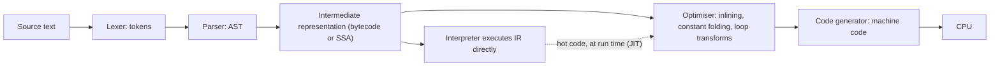

The same loop, summing ten million integers, takes 108 ms in plain CPython 3.14, 5 ms in Node 24, 1.8 ms in Go 1.27 and 1.3 ms in Rust 1.98 (all measured on one AMD Ryzen 9 9950X3D, best of several runs). The loop is identical. The difference is entirely in what stands between your source text and the CPU: an interpreter walking bytecode one instruction at a time, a just-in-time compiler that watched the loop run and then compiled it, or an ahead-of-time compiler that turned the loop into a handful of vector instructions before the program started.

"Python is slow" and "Rust is fast" are folklore until you can say *why*, and the why has consequences you will meet at work: JIT warm-up that makes the first thousand requests after a deploy slow, a Python service that cannot use its second core, a Java process that takes seconds to start in a serverless function, a JavaScript function that runs fast for an hour and then five times slower because someone passed it a string instead of a number. Each is a property of the execution pipeline, and this lesson traces one tiny function through every stage of four pipelines so that you can see where each property comes from.

## The pipeline every language shares

Whatever the language, source text goes through the same stages. Where each language *stops* and starts executing is what separates a compiler from an interpreter.



An **ahead-of-time (AOT) compiler** runs every stage before the program starts and ships machine code. An **interpreter** stops at the IR and executes it with a loop that reads one instruction, does it, reads the next. A **just-in-time (JIT) compiler** starts as an interpreter, watches which code runs often and with which types, and compiles that code to machine code while the program runs, using what it observed.

## One function, four pipelines

The function is two lines:

```python
def add(total, x):
    return total + x
```

### Stage 1: tokens

The lexer turns characters into tokens. CPython's `tokenize` module reports seventeen for this function:

```text
NAME 'def'   NAME 'add'   OP '('   NAME 'total'   OP ','   NAME 'x'   OP ')'   OP ':'   NEWLINE
INDENT '    '   NAME 'return'   NAME 'total'   OP '+'   NAME 'x'   NEWLINE   DEDENT   ENDMARKER
```

Python's lexer is unusual in emitting `INDENT` and `DEDENT` tokens (the whitespace *is* syntax); every other language's lexer does the same job with braces. Lexing costs time proportional to source size, which is why very large generated files slow builds.

### Stage 2: the abstract syntax tree

The parser turns the token stream into a tree. `ast.dump` shows it:

```text
FunctionDef(name='add', args=arguments(args=[arg(arg='total'), arg(arg='x')]),
  body=[Return(value=BinOp(left=Name(id='total', ctx=Load()), op=Add(), right=Name(id='x', ctx=Load())))])
```

Every language builds this shape. What differs is what happens next.

### Stage 3: CPython bytecode

CPython compiles the AST to bytecode for a stack machine, caches it in `__pycache__`, and interprets it. `dis.dis(add)` on 3.14.7:

```text
RESUME                              0
LOAD_FAST_BORROW_LOAD_FAST_BORROW   1 (total, x)
BINARY_OP                           0 (+)
RETURN_VALUE
```

Four instructions, 18 bytes of `co_code`: two bytes per instruction plus ten bytes of **inline cache** after `BINARY_OP`, empty for now. `LOAD_FAST_BORROW_LOAD_FAST_BORROW` is a *superinstruction* (two loads fused into one dispatch) that pushes borrowed references (3.14 skips the reference-count increment for values it knows will not outlive the frame). Then the interpreter loop: fetch the opcode, jump to its handler, execute, repeat.

### Stage 3½: CPython specialises

Call `add(1, 2)` a hundred times and disassemble again with `dis.dis(add, adaptive=True)`:

```text
RESUME_CHECK                        0
LOAD_FAST_BORROW_LOAD_FAST_BORROW   1 (total, x)
BINARY_OP_ADD_INT                   0 (+)
RETURN_VALUE
```

The generic `BINARY_OP` has rewritten itself in place to `BINARY_OP_ADD_INT`, a version that checks only "are both operands exact `int`s?" and then adds, skipping the type dispatch. Call it a hundred times with strings and it becomes `BINARY_OP_ADD_UNICODE`. Call it with a mixture and it gives up and reverts to the generic form. This is the **specialising adaptive interpreter** from PEP 659 (Python 3.11): the ten bytes of inline cache hold a counter and the specialisation's data, and the bytecode is the profile.

### Stage 3 in V8: Ignition bytecode

V8 (Node, Chrome, Deno) compiles the same function to bytecode for its Ignition interpreter. `node --print-bytecode --print-bytecode-filter=add`:

```text
Ldar a1          ; load argument 1 (x) into the accumulator
Add a0, [0]      ; accumulator = a0 (total) + accumulator, recording types in feedback slot 0
Return
```

Six bytes. The `[0]` is a **feedback vector slot**: every time `Add` executes, it records what it saw (small integer, double, string, anything), and that record is what the compilers below read.

### Stages 4–5 in V8: Sparkplug, Maglev, TurboFan

When `add` (or a loop containing it) gets hot, V8 compiles it, in tiers. Run the summing loop under `node --trace-opt --trace-deopt` and V8 narrates:

```text
[marking <JSFunction sumArr> for optimization to MAGLEV, reason: hot and stable]
[compiling method <JSFunction sumArr> (target MAGLEV) OSR]
[completed compiling ... (target MAGLEV) OSR - took 0.000, 0.166, 0.003 ms]
[compiling method <JSFunction sumArr> (target TURBOFAN_JS) OSR]
[bailout (kind: deopt-eager, reason: overflow): deoptimizing <JSFunction sumArr>, <Code MAGLEV>]
[completed compiling ... (target TURBOFAN_JS) OSR - took 0.003, 0.698, 0.006 ms]
```

The tiers, named as V8 names them: **Ignition** interprets bytecode and collects feedback; **Sparkplug** (2021) compiles bytecode to machine code almost instantly with no optimisation, removing dispatch overhead; **Maglev** (2023) produces reasonably optimised code in a fraction of a millisecond; **TurboFan** runs the full optimiser, speculating on the feedback: "this `Add` has only ever seen small integers, so emit an integer add with an overflow check and a bail-out". `OSR` is *on-stack replacement*: the loop was compiled while it was running and the interpreter's frame was swapped for the compiled one mid-iteration. The `overflow` bailout is the speculation failing: the running sum crossed $2^{31}$ and stopped fitting V8's small-integer representation, so the Maglev code was thrown away and the function went back to collecting feedback before TurboFan compiled it with wider arithmetic. Measured, the first call of that loop took 3.13 ms and the steady state 0.47 ms; the [benchmarking lesson](/learn/foundations/complexity/benchmarking-reality) shows what that does to a benchmark.

### Stage 5 in Go and Rust: machine code before the program starts

Go compiles the same function (marked `//go:noinline` so it survives as a function) to four bytes of machine code, shown by `go build -gcflags=-S`:

```text
ADDQ BX, AX      ; 48 01 d8
RET              ; c3
```

Go's register-based calling convention (since 1.17) passes the two arguments in `AX` and `BX` and returns in `AX`. Rust, through LLVM with `#[inline(never)]`, produces the equivalent under the System V convention (arguments in `rdi` and `rsi`):

```text
leaq (%rdi,%rsi), %rax
retq
```

(`lea` is the compiler's favourite three-operand add.) Without the no-inline attribute both compilers delete the function entirely and put the `add` instruction directly in the caller's loop, where Rust's LLVM backend then vectorises it: with the default x86-64 target that is SSE2 `paddq`, two `i64`s per instruction across several accumulators, and four per instruction with AVX2 if you compile with `-C target-cpu=native` on a machine that has it.

### The trace, side by side

| Stage | CPython 3.14 | V8 (Node 24) | Go 1.27 | Rust 1.98 (LLVM) |
|---|---|---|---|---|
| Tokens, AST | at import, cached as `.pyc` | at load, lazily per function | at build | at build |
| IR | stack bytecode, 18 bytes | register bytecode, 6 bytes, with feedback slots | SSA | LLVM SSA |
| First execution | bytecode interpreter | Ignition interpreter | machine code | machine code |
| After warm-up | same bytecode, specialised in place (`BINARY_OP_ADD_INT`) | Sparkplug → Maglev → TurboFan machine code | same | same |
| Types known when | never (checked on every execution) | speculated from feedback, guarded | at build | at build |
| `total + x` costs | tens of instructions plus an allocation | one instruction plus an overflow check | one instruction | one instruction |

## Why an interpreter is slow: the cost of one `a + b`

Take `s += x` inside a Python loop. What the generic `BINARY_OP` does, per execution:

1. Read the opcode, jump to its handler (a branch the CPU often mispredicts).
2. Pop two `PyObject*` from the value stack.
3. Check the type of the left operand; find its `+` implementation via the type's slot table.
4. Check that both are ints small enough for the fast path; if not, fall back to arbitrary-precision addition.
5. Allocate a new int object for the result (values from −5 to 256 are cached; every other result is a fresh object).
6. Decrement the reference counts of the two operands, possibly freeing one.
7. Push the result.

The specialised `BINARY_OP_ADD_INT` removes step 3 and most of step 4 (one guard: both exact `int`), but steps 1, 5, 6 and 7 remain. Measured on the ten-million-element sum: 10.8 ns per iteration for the `for` loop (six bytecodes per iteration including the loop machinery), 2.3 ns for `sum(list)` (the loop runs in C; only the per-element object handling remains), against 0.13–0.5 ns compiled. The ratio, roughly 20–80×, is the whole story of "Python is slow" for tight numeric loops. It is not the syntax; it is that every operation must rediscover, at run time, what the types are and where the values live, and must allocate its result.

CPython 3.14 also ships an experimental copy-and-patch JIT (PEP 744, off by default; `PYTHON_JIT=1` enables it in builds that include it, and `sys._jit.is_available()` tells you). Measured on the same loop with the JIT enabled: 132 ms, no faster than the 108 ms interpreter. That is honest about where the project is: the JIT removes dispatch but not boxing or reference counting, and the gains so far are small and workload-dependent.

## Why a JIT can be fast, and when it is not

Two mechanisms make V8's speculation pay:

- **Hidden classes (shapes) and inline caches.** Objects created the same way share a hidden class describing their layout. A property access site remembers the hidden class it last saw and the offset of the property; if the next object matches, the load is one memory read at a fixed offset, exactly like a compiled struct field. A site that sees one shape is *monomorphic* (fastest), up to four shapes *polymorphic* (a short chain of checks), more than that *megamorphic* (a lookup in a global cache keyed by shape and property name, with no fixed-offset load for the optimiser to emit). Adding properties in different orders, or deleting properties, creates new shapes.
- **Inlining across the profile.** Because the JIT sees which function a call site actually reaches, it inlines through indirect calls and interfaces that an AOT compiler must leave as calls. This is the one structural advantage a JIT has over AOT: it optimises for what the program *does*, not for what the type system *allows*.

The price is **deoptimisation**. Measured: a loop whose `+` had only seen integers ran in 0.47 ms; after one call with an array of strings, the next integer call took 11.2 ms (deoptimise, re-profile, recompile) and every call after that 2.35 ms, five times slower, for the life of the process, because the site's feedback now says "number or string" and the generic path stays. A function that keeps flipping between shapes of input never settles, and that is the "fast for an hour, then slow" bug.

The JVM follows the same design with C1 (fast, lightly optimised) and C2 (slow, heavily optimised) tiers; because Java has static types, its speculation is mostly about *which* implementation of an interface is live rather than what type a value is. GraalVM's native-image trades the JIT for AOT compilation to fix start-up, at some cost in peak performance.

## Why AOT is fast, and what it gives up: Go and Rust

Go compiles to machine code ahead of time with a compiler designed for speed of compilation: a large service builds in seconds. Static types mean every `a + b` is one instruction; escape analysis keeps values on the stack; the optimiser is deliberately simpler than LLVM's (less aggressive inlining, no autovectorisation), which is why Go's loop measured 0.18 ns per element against Rust's 0.13, and why both are 20–60× faster than CPython. The garbage collector, covered in [memory management](/learn/foundations/how-code-runs/memory-management), is the main run-time cost.

Rust compiles through LLVM with the full optimiser. Generics are **monomorphised**: `Vec<i32>` and `Vec<String>` become two separate compiled types, each specialised, which is why Rust iterators and closures compile to the same code as a hand-written loop ("zero-cost abstraction"), why `a.iter().sum()` vectorises, and also why Rust compile times are long and binaries large. There is no runtime type dispatch unless you ask for it with `dyn Trait`.

What AOT gives up is runtime knowledge. It cannot see which branch is hot or which interface implementation is live, so it generates code that is correct for all of them. Profile-guided optimisation (PGO) feeds a recorded profile back into a second compile; Go, Rust and Clang all support it, and [Go's documentation](https://go.dev/doc/pgo) reports gains of around 2–14% on a representative set of programs as of Go 1.22.

## The numbers, side by side

The same work in each runtime, measured on one machine (AMD Ryzen 9 9950X3D; each figure the best of several runs; other machines move them by 2× but not the ordering):

| Summing $10^7$ 64-bit integers | Time | Per element | Why |
|---|---|---|---|
| CPython `for` loop | 108 ms | 10.8 ns | six bytecodes per iteration, boxing, refcounting |
| CPython `sum(range(n))` | 48 ms | 4.8 ns | the loop is in C; each element is still created as an object |
| CPython `sum(list)` | 23 ms | 2.3 ns | the loop is in C; elements already exist |
| Node, monomorphic loop, warm | 5.0 ms | 0.50 ns | TurboFan compiled the loop to integer adds with overflow checks and bounds checks |
| Go | 1.8 ms | 0.18 ns | AOT scalar loop; the bounds check is proved away, but nothing is vectorised |
| Rust `iter().sum()` | 1.3 ms | 0.13 ns | AOT, bounds checks elided, vectorised |
| NumPy `arr.sum()` | not measured here | order of 0.1–1 ns | one call into a compiled, vectorised kernel over contiguous memory |

| Cold start of a hello-world | Time (20 runs, average) |
|---|---|
| Rust binary | 1.6 ms |
| Go binary | 2.4 ms |
| `python3 -c pass` | 8.1 ms (6.4 ms with `-S`, skipping `site`) |
| `node -e 0` | 15.7 ms |
| JVM hello-world | not measured here; typically tens of milliseconds, and seconds for a framework-heavy service |

The lesson in the first table is that "Python is slow" is really "Python *bytecode loops* are slow", and the standard escape is to move the loop into compiled code: NumPy, pandas, a C extension, Cython, or a Rust module via PyO3. A Python service that spends its time in `json.loads`, `re`, database drivers and NumPy is already mostly running C. The lesson in the second table is that start-up is a property of the runtime's shape, and it decides short-lived workloads.

## Under the hood: how the runtimes decide

**CPython's counters.** Every adaptive instruction carries a counter in its inline cache. `RESUME` becomes `RESUME_CHECK` after the function has run a few times; `BINARY_OP` decrements its counter on each execution and, when it reaches zero, calls the specialiser, which inspects the operands and rewrites the opcode. A specialised instruction that fails its guard (an `int` site that receives a `str`) does the generic operation *and* decrements a miss counter; too many misses and it reverts to the adaptive form, backs off exponentially, and may respecialise later. All of this lives in the bytecode array itself, which is why `dis` can show it and why a function's bytecode is different after it has run.

**V8's feedback lattice.** Each `Add` slot moves monotonically up a lattice: `None → SignedSmall → Number → NumberOrOddball` on the numeric side, with separate `String` and `BigInt` branches that meet the numeric ones only at `Any` (V8's `BinaryOperationFeedback` encodes each state as a bit mask, and combining is a bitwise OR). Feedback never narrows again without a full reset, which is why one string call is permanent. Small integers ("Smis", 32-bit in a default 64-bit Node build and 31-bit with pointer compression) are stored as tagged immediates; anything else is a heap-allocated double. The `overflow` and `not a Smi` deopt reasons in the trace are that boundary being crossed.

**Go's static knowledge.** The compiler knows `total` and `x` are `int64`, so the SSA backend emits one `ADDQ`; there is no check because there is nothing to check. What Go *does* add at run time is bounds checks on slice indexes it cannot prove safe and write barriers on pointer stores while the garbage collector is marking. In the summing loop the check is proved away (`-d=ssa/check_bce/debug=1` reports none), so the gap to Rust in the table is vectorisation.

**LLVM's freedom.** Rust hands LLVM a fully typed SSA program with no aliasing between `&mut` references, which is more than C can promise. LLVM inlines `add` into its caller, sees a reduction over a contiguous slice, and emits vector adds over several accumulators (SSE2 `paddq` on the default target, AVX2 with `target-cpu=native`); that is the 0.13 ns. The same freedom is why Rust compile times are long: every generic instantiation is optimised separately.

## What the pipeline does to production

**Warm-up.** A JIT-compiled service is slow for its first seconds to minutes: functions run interpreted until profiled, then compile, then possibly deoptimise and recompile. The first requests after a Node or JVM deploy are visibly slower, and a canary judged on its first minute will look worse than the stable fleet. Warm the process with synthetic traffic before it takes real load, or judge canaries after warm-up. Go and Rust binaries have no such phase, which is one reason they dominate short-lived workloads like CLI tools and serverless functions.

**The GIL.** CPython's global interpreter lock means only one thread executes bytecode at a time. CPU-bound Python does not scale across cores with threads; it needs processes (`multiprocessing`), or the work must be in C code that releases the lock (NumPy does; `json.loads` does not). Free-threaded builds (3.13+, a separate build; `sys._is_gil_enabled()` reports which you have, and it was `True` on the standard build measured here) remove the GIL at a single-thread throughput cost while the ecosystem catches up. Node has the same single-thread-of-JavaScript property for different reasons, with `worker_threads` as the escape.

**Start-up versus peak.** Interpreted languages start fast and run slowly; JITs start slowly and run fast; AOT starts fast and runs fast but compiles slowly. Choose by workload shape:

| Runtime shape | Start-up | Peak throughput | Predictability | Build time | Deploy artefact |
|---|---|---|---|---|---|
| Interpreter (CPython) | milliseconds | lowest (10–50× off compiled) | high: no tiers | none | interpreter + venv |
| JIT (V8, JVM) | tens of ms to seconds | high once warm | lower: warm-up, deopts, GC | none / seconds | runtime + source or bytecode |
| AOT (Go) | milliseconds | high | high | seconds | one static binary |
| AOT with LLVM (Rust, C++) | milliseconds | highest | high | minutes | one binary, larger |
| AOT + PGO | milliseconds | a few percent to 15% higher | high | plus a profiling run | one binary |

A request handler that runs for days wants a JIT or AOT; a script that runs for 200 ms wants an interpreter or AOT; a function invoked thousands of times an hour for 100 ms each wants the fastest cold start, which the table says is a native binary.

## Failure modes in production

**A canary rolled back during warm-up.** *Symptom:* every JVM or Node deploy's canary is 30–50% slower than the baseline for its first minutes and the automated analysis rejects it. *Diagnosis:* the baseline has been running with optimised code for days; the canary is interpreting and compiling. Plot latency against process age. *Fix:* pre-warm with mirrored traffic or start the comparison window after warm-up.

**A sustained slowdown with no deploy.** *Symptom:* a Node service's p50 goes from 2 ms to 10 ms and stays there. *Diagnosis:* a new field arrived with a different type, a hot site went polymorphic or megamorphic, and V8 recompiled it with the generic path; `node --trace-deopt` names the function and the reason. *Fix:* normalise types at the boundary, construct objects with the same properties in the same order, and restart the process if the pollution was a one-off.

**Eight threads, one core.** *Symptom:* a CPU-bound Python job rewritten with a thread pool gets no faster; `top` shows one core at 100%. *Diagnosis:* the GIL; a sampling profiler (`py-spy`) shows every thread waiting on it. *Fix:* `multiprocessing` or a process pool, move the hot loop into NumPy or a compiled extension that releases the GIL, or a free-threaded build once your dependencies support it.

**A slow Python service whose profile is all Python.** *Symptom:* 80% of request time in a pure-Python loop over records. *Diagnosis:* the loop pays 10 ns per bytecode-level operation; the same work vectorised in NumPy or done in a compiled extension pays under 1 ns. *Fix:* restructure the hot loop as array operations, or move it to Rust via PyO3; do not rewrite the whole service.

**Cold starts eating the budget.** *Symptom:* a serverless function that does 100 ms of work has p99 latency of several seconds. *Diagnosis:* the runtime's cold start (JVM class loading plus JIT; a Python function importing heavy libraries, which `python -X importtime` itemises) dominates the work. *Fix:* a native binary (Go, Rust, GraalVM native-image), lazy imports, or provisioned warm instances.

```exercise
id: tiny-lexer
title: Tokenise an expression
prompt: |
  Implement the first stage of the pipeline for a tiny expression language.
  `tokens(src)` returns a list of `[kind, text]` pairs, where an identifier
  (`[A-Za-z_][A-Za-z0-9_]*`) has kind `"name"`, a run of digits has kind
  `"number"`, and each of the single characters `+ - * / ( ) =` is an
  `"op"`. Spaces separate tokens and produce nothing. The input contains
  only those characters.
languages: [python, javascript]
entry: tokens
starter:
  python: |
    def tokens(src):
        # scan left to right; group letters/digits/underscores into names, digits into numbers
        return []
  javascript: |
    function tokens(src) {
      // scan left to right; group letters/digits/underscores into names, digits into numbers
      return [];
    }
tests:
  - args: ["total + x"]
    expected: [["name", "total"], ["op", "+"], ["name", "x"]]
  - args: [""]
    expected: []
    label: empty source
  - args: ["a*(b+12)"]
    expected: [["name", "a"], ["op", "*"], ["op", "("], ["name", "b"], ["op", "+"], ["number", "12"], ["op", ")"]]
    label: no spaces between tokens
  - args: ["x1 = 42"]
    expected: [["name", "x1"], ["op", "="], ["number", "42"]]
    label: a digit inside a name stays part of the name
  - args: ["  7  "]
    expected: [["number", "7"]]
    label: surrounding whitespace
  - args: ["_tmp2-3"]
    expected: [["name", "_tmp2"], ["op", "-"], ["number", "3"]]
    hidden: true
  - args: ["count/2*count"]
    expected: [["name", "count"], ["op", "/"], ["number", "2"], ["op", "*"], ["name", "count"]]
    hidden: true
hints:
  - "Keep an index i. If src[i] is a space, advance. If it starts a name (letter or underscore), advance while the character is a letter, digit or underscore. If it is a digit, advance while digits. Otherwise it is a one-character op."
  - "In JavaScript, /[A-Za-z_]/.test(ch) and /[0-9]/.test(ch) are the two character classes you need."
```

## Interviewer follow-ups

**"Why is `total + x` roughly 20–80 times slower in a CPython loop than in Go?"** *Model answer:* CPython dispatches a bytecode, checks the operand types (once specialised, one guard), allocates a result object and adjusts reference counts on every execution, because types are only known at run time; Go's compiler knew both were `int64` and emitted one `ADDQ`. Measured: 10.8 ns versus 0.18 ns per element. *Common wrong answer:* "Python is interpreted so it re-parses the source", which is false (bytecode is compiled once and cached) and misses boxing and refcounting, the larger costs.

**"What does a JIT do that an AOT compiler cannot?"** *Model answer:* it optimises for observed behaviour: it inlines through call sites whose target it has seen, specialises arithmetic on the types that actually flowed, and lays out code for the branches that were hot; AOT can only approximate this with PGO. The cost is warm-up and the possibility of deoptimisation when the observation stops holding. *Common wrong answer:* "JITs are faster because they compile to machine code", which AOT compilers also do.

**"A Node service is slow for the first minute after every deploy. Bug?"** *Model answer:* warm-up: Ignition interprets and collects feedback, then Sparkplug, Maglev and TurboFan compile the hot functions; measured, a hot loop's first call was 6.6× its steady state. Judge the canary after warm-up or pre-warm it. *Common wrong answer:* rolling back on the first minute's numbers.

**"Would you write this data pipeline in Python?"** *Model answer:* if the per-record work is in NumPy, a database driver or a compiled library, yes, because the Python loop overhead is small relative to that work; if the hot loop is pure Python over millions of records, either vectorise it or put that loop in Rust or Go, and measure the ratio before deciding. *Common wrong answer:* "no, Python is slow" or "yes, performance doesn't matter", neither of which looked at where the time goes.

**"Why can't CPython use eight threads for a CPU-bound job?"** *Model answer:* the GIL lets one thread execute bytecode at a time; threads still help when the work is in C code that releases the lock or is I/O; for pure-Python CPU work use processes or a free-threaded build. *Common wrong answer:* "Python threads are green threads", which they are not; they are OS threads serialised by a lock.

## What mid-level engineers get wrong

- **Believing "compiled" means fast and "interpreted" means slow.** V8 and the JVM interpret first and reach near-native speed; CPython compiles to bytecode and stays slow. The speed comes from knowing types and avoiding allocation, not from the label.
- **Benchmarking a JIT on its first call.** The number is the interpreter plus the compiler, 5–10× the steady state.
- **Passing mixed types through one hot function.** One string through an integer site costs 5× for the rest of the process's life; the fix is to keep call sites monomorphic.
- **Rewriting the whole service instead of the hot loop.** A Python service's profile is often mostly C already; moving the one pure-Python loop into NumPy or Rust captures most of the gain at a fraction of the cost.
- **Using threads for CPU-bound Python.** The GIL serialises them; the job gets no faster and often slower from contention.
- **Choosing a JVM for a 100 ms serverless function.** Cold start dominates; a native binary starts in a couple of milliseconds.
- **Assuming the CPython JIT is on and helps.** In 3.14 it is off by default, experimental, and on the loop measured here it was not faster.

## Senior signals

- You can trace a two-line function through tokens, AST, bytecode, specialised bytecode and machine code, and name what each runtime knows at each stage.
- You explain Python's speed as bytecode dispatch plus boxing plus refcounting per operation, quote the measured ratio (about 10 ns versus 0.2 ns per simple operation), and give the escape (move the loop into C via NumPy, Cython or an extension) rather than "rewrite it in Go".
- You know what a JIT speculates on, what deoptimisation is, that feedback only widens, and you can describe monomorphic versus megamorphic call sites and why they matter in a Node service.
- You name V8's tiers (Ignition, Sparkplug, Maglev, TurboFan) and the JVM's (C1, C2) correctly, know what on-stack replacement is, and budget for warm-up in deploys and canary analysis.
- You can say what monomorphisation buys Rust and what it costs (compile time, binary size), and why Go's simpler optimiser is a deliberate trade for build speed.
- You state the GIL's actual rule (one thread executes bytecode at a time; C code may release it) rather than "Python has no real threads", and you know how to check which build you are on.
- You choose a runtime for a workload by start-up time, peak throughput and operational shape, with measured numbers, not folklore.

## Check yourself

```quiz
- q: >-
    Why is `total + x` roughly 20–80 times slower in a CPython loop than in compiled Go?
  options: ["Go spreads the additions across multiple CPU cores", "Python stores integers as strings and converts on each +", "CPython checks operand types, allocates a result and adjusts refcounts on each +", "Python re-parses the loop's source text on every iteration"]
  answer: 2
  explanation: >-
    CPython must dispatch the bytecode, guard the operand types (one check once specialised to BINARY_OP_ADD_INT), allocate a result object and adjust reference counts, where Go emits a single add instruction on values whose types were fixed at compile time. Parsing happens once (bytecode is cached), there is no parallelism involved, and Python ints are binary digit arrays, not strings.
- q: >-
    After calling `add(1, 2)` a hundred times, `dis.dis(add, adaptive=True)` shows `BINARY_OP_ADD_INT` where the original bytecode had `BINARY_OP`. What happened?
  options: ["The adaptive interpreter rewrote the instruction in place for the observed types", "Python re-parsed the function with type hints inferred from the calls", "The JIT compiled the function to machine code and dis shows its name", "The bytecode cache in __pycache__ was regenerated with a faster opcode"]
  answer: 0
  explanation: >-
    PEP 659's specialising interpreter keeps a counter in the instruction's inline cache and, once it fires, replaces the generic opcode with a version that guards only on the types it saw. It is still interpreted bytecode, not machine code; nothing is re-parsed; and the .pyc on disk holds the generic form.
- q: >-
    A Node service runs at 2 ms p50 for an hour, then jumps to 10 ms and stays there with no deploy. Which explanation fits best?
  options: ["The event loop exhausted its pool of JavaScript threads", "The JIT finished warming up and moved to its final tier", "The garbage collector switched to a slower, persistent mode", "A hot site saw a new type and was recompiled with the generic path"]
  answer: 3
  explanation: >-
    Sustained slowdown after a change in input shape is the deoptimisation signature: feedback only widens, so once a site has seen a second type the optimiser keeps the generic path, measured at 5× slower for a polluted add site. Warm-up makes things faster over time, not slower. GC does not have modes that persist like this, and JavaScript runs on a single event-loop thread, so there is no pool of JS threads to exhaust.
- q: >-
    Which is a structural advantage a JIT has over an ahead-of-time compiler?
  options: ["Smaller binaries, since only hot code is compiled", "It optimises for the types and call targets it observes", "Faster start-up, since no ahead-of-time build is needed", "It never needs to deoptimise once code is compiled"]
  answer: 1
  explanation: >-
    Run-time profile information is the JIT's edge: it can inline through calls an AOT compiler must leave indirect and specialise on the types that actually flowed. AOT compilers can only approximate it with PGO. JITs start slower (they must profile and compile first), need the runtime shipped alongside, and deoptimise when speculation fails.
- q: >-
    A CPU-bound Python job is rewritten to use eight threads and gets no faster. The most likely reason is:
  options: ["Python threads are green threads confined to one core", "The job turns out to be I/O bound, not CPU bound", "Creating and switching Python threads is too slow", "The GIL lets only one thread run bytecode at a time"]
  answer: 3
  explanation: >-
    Python threads are real OS threads, but the interpreter lock serialises bytecode execution, so pure-Python CPU work does not parallelise across threads. Use processes, or move the work into C code that releases the GIL (NumPy does), or a free-threaded build.
- q: >-
    You are choosing a runtime for a serverless function that runs for about 100 ms per invocation, thousands of times an hour, and is cold-started often. Which consideration dominates?
  options: ["Binary compatibility across different CPU families", "Start-up time, since it can outweigh the work itself", "Garbage collector pause times during each request", "Peak throughput once the hot loop is fully optimised"]
  answer: 1
  explanation: >-
    With 100 ms of work per invocation, a JVM cold start of hundreds of milliseconds to seconds (class loading plus JIT warm-up) dominates, and the JIT never pays off; a Go or Rust binary starts in a couple of milliseconds (measured 2.4 and 1.6 ms for a hello-world) and Python in about 8. Peak throughput and GC pauses matter for long-running processes, not this shape.
```
