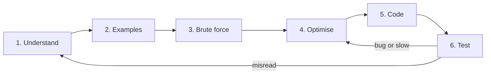

You are handed a problem you have not seen before. Maybe it is an interviewer reading from a doc, maybe it is a ticket that says "dedupe these events but keep the most recent one per user". The instinct of most engineers is to start typing within thirty seconds, because typing feels like progress. Ten minutes later they have a half-written function, a vague sense that it is wrong, and no idea which part to fix.

The engineers who consistently solve unfamiliar problems do not think faster. They follow a protocol that turns one big question ("how do I solve this?") into six small ones, each with a concrete deliverable. This lesson is that protocol, walked twice end to end with measured costs, then taken apart to see what the interpreter does with the code it produces. Every lesson and problem editorial on Ascend uses it, and it is the shape a senior interviewer is listening for whether or not they say so.

## The loop



Six steps, each with an output you could write on a whiteboard:

| Step | Output | Time budget in a 45-minute round |
|---|---|---|
| 1. Understand | A one-sentence restatement, the input/output types, the constraints | 2–3 min |
| 2. Examples | Two or three tiny inputs worked by hand, one of them an edge case | 2–3 min |
| 3. Brute force | The simplest correct algorithm and its cost, stated not coded | 2–3 min |
| 4. Optimise | The brute force's bottleneck, the idea that removes it, the new complexity | 5–10 min |
| 5. Code | A clean implementation of the optimised idea | 10–15 min |
| 6. Test | Your examples traced by hand through your code, then edge cases | 5 min |

The arrows back from *Test* are the important part. The first pass is rarely right, and the protocol says where to go when it is not: a wrong answer on an example you understood means the optimisation is broken, back to step 4; a wrong answer on a case you had not considered usually means you misread the problem, back to step 1.

Each step makes the next one cheaper: understanding first means the examples test the right problem, examples first means the brute force can be checked, brute force first means the optimisation targets a known bottleneck rather than a guessed technique, and optimising first means the code is written once. Skipping a step moves the time to debugging, where it costs three times as much and earns no credit. The [45-minute protocol](/learn/interview-patterns/interview-execution/the-45-minute-protocol) lays the same steps against a clock.

## Walkthrough 1: the longest substring without repeats

> Given a string `s`, return the length of the longest substring that contains no repeated characters.

That is the whole statement; it is [Longest Substring Without Repeating Characters](/practice/longest-substring-no-repeat) in the practice set. Resist the urge to code.

### Step 1: Understand

Restate it in your own words, and pin down every term that could mean two things.

- **Substring**, not subsequence: contiguous. `"abc"` is a substring of `"xabcx"`; `"ac"` is not.
- **No repeated characters**: every character in the window appears once.
- **Return the length**, not the substring. The wrong return type is a common way to fail.
- **Alphabet and size**: ASCII allows a 128-entry array, arbitrary Unicode means a hash map; if `n` can be 10⁵, anything quadratic is out.
- **Empty string**: valid; the answer is 0.

Write the signature before anything else; it fixes the types:

```python
def longest_unique_substring(s: str) -> int: ...
```

This step looks trivial and is where most wrong answers are born: solve the subsequence version perfectly and you still fail.

### Step 2: Examples

Make examples small enough to work by hand and varied enough to expose the shape of the problem.

| Input | Output | Why |
|---|---|---|
| `"abcabcbb"` | 3 | `"abc"` is the longest; `"abca"` repeats `a` |
| `"bbbbb"` | 1 | Every substring longer than 1 repeats `b` |
| `"pwwkew"` | 3 | `"wke"`; the answer is not `"pwke"`, that is a subsequence |
| `""` | 0 | Edge case |
| `"abba"` | 2 | `"ab"` or `"ba"`; this one will matter later |

The third example catches the subsequence misreading. The fifth looks pointless; it breaks a specific tempting bug in step 5. Working `"pwwkew"` by hand, you scanned left to right, extending a run of distinct characters until a repeat, then restarted. That intuition *is* the optimised algorithm, unnamed.

### Step 3: Brute force

State the most obvious correct algorithm and its cost. It is a correctness baseline, it shows you can solve the problem at all, and its bottleneck tells you what to optimise.

```python
def longest_unique_brute(s: str) -> int:
    best = 0
    n = len(s)
    for i in range(n):
        for j in range(i + 1, n + 1):          # substring s[i:j]
            if len(set(s[i:j])) == j - i:      # all distinct?
                best = max(best, j - i)
    return best
```

There are $n(n+1)/2$ substrings and checking one builds a set from up to $n$ characters: about $n^3/6$ operations, $O(n^3)$. Put a number on it. Measured on one machine (AMD Ryzen 9 9950X3D, CPython 3.14.7, random lowercase text, best of three runs), this function takes 6.6 ms at $n = 200$, 41 ms at 400 and 305 ms at 800: 6–8× per doubling, the $2^3 = 8$ of a cubic algorithm showing through, and about a week at $n = 10^5$. Say the number out loud.

Converting a growth class into a count against the stated $n$ is the most useful reflex from the [complexity module](/learn/foundations/complexity/why-big-o). Working figures: about $10^7$ simple loop iterations per second in CPython, $10^8$ to $10^9$ compiled. So $O(n^2)$ at $n = 10^5$ ($10^{10}$) is out of reach in any runtime and $O(n \log n)$ (about $1.7 \times 10^6$) is comfortable in all.

### Step 4: Optimise

Look at the brute force and ask: *what work is repeated?*

Checking `s[i:j]` and then `s[i:j+1]` from scratch throws away what you learned: if `s[i:j]` was distinct, `s[i:j+1]` is distinct if and only if `s[j]` is not already in the window. Keep a set of the window's characters and extend one character at a time: $O(1)$ per check, $O(n^2)$ in total, restarting from each `i`.

Be precise about that $O(n^2)$, because an interviewer will ask. The inner loop stops at the first repeat, so it runs at most $|\Sigma| + 1$ times for an alphabet of size $|\Sigma|$: on lowercase text it is effectively $O(n \cdot |\Sigma|)$ and measured 2.4 ms at $n = 8{,}000$, while on 8,000 all-distinct code points it took 2.4 s, growing 4× per doubling. "Quadratic in the worst case, which is a large alphabet with few repeats" is the honest statement.

The outer loop still restarts from every `i`. Suppose `s[i:j]` is distinct and `s[j]` repeats the character at position `k` (with `i ≤ k < j`). Every start `i' ≤ k` is now useless, because a window from `i'` that includes `s[j]` also includes `s[k]`. The next candidate start is `k + 1`, and the start pointer only ever moves right.

Two pointers that both move monotonically right, with a structure describing what lies between them, is the **sliding window** pattern, formalised in [Sliding window](/learn/interview-patterns/array-patterns/sliding-window). Watch it run:

```viz
{"type": "array", "algorithm": "sliding-window-longest-unique", "values": [1, 2, 3, 1, 2, 4], "title": "Longest window without repeats", "caption": "The right pointer always advances; the left pointer jumps past the previous occurrence of a repeated value."}
```

Each pointer moves at most `n` times: $O(n)$ time, $O(\min(n, |\Sigma|))$ space for the map of last-seen positions. Measured, about 57 ns per character: 6 ms at $n = 10^5$, 60 ms at $10^6$. State the new complexity and check it against the constraints before writing a line.

### Step 5: Code

Now, and only now, write the implementation. Because the idea is fully formed, every line has a reason.

```python
def longest_unique_substring(s: str) -> int:
    last_seen: dict[str, int] = {}   # char -> index of its most recent occurrence
    left = 0                          # window is s[left:right+1]
    best = 0
    for right, ch in enumerate(s):
        if ch in last_seen and last_seen[ch] >= left:
            left = last_seen[ch] + 1  # jump past the previous occurrence
        last_seen[ch] = right
        best = max(best, right - left + 1)
    return best
```

```javascript
function longest_unique_substring(s) {
  const lastSeen = new Map();
  let left = 0, best = 0;
  for (let right = 0; right < s.length; right++) {
    const ch = s[right];
    if (lastSeen.has(ch) && lastSeen.get(ch) >= left) {
      left = lastSeen.get(ch) + 1;
    }
    lastSeen.set(ch, right);
    best = Math.max(best, right - left + 1);
  }
  return best;
}
```

The condition `last_seen[ch] >= left` is the line that `"abba"` exists to test. Without it, when `right` reaches the final `a`, the code sees `a` was last at index 0 and sets `left = 1`, moving the window *backwards* from 3 to 1 and reporting the invalid window `"bba"` with length 3. With it, index 0 is outside the current window and is ignored.

### Step 6: Test

Trace your examples through the code by hand, one variable at a time; a five-character trace takes under a minute and catches most off-by-one bugs before anything runs.

| `right` | `ch` | `last_seen[ch]` before | `left` after | window | `best` |
|---|---|---|---|---|---|
| 0 | a | – | 0 | `a` | 1 |
| 1 | b | – | 0 | `ab` | 2 |
| 2 | b | 1 (≥ left) | 2 | `b` | 2 |
| 3 | a | 0 (< left, ignored) | 2 | `ba` | 2 |

Returns 2. Edge cases: `""` never enters the loop and returns 0; `"a"` returns 1; `"bbbbb"` moves `left` every step and never exceeds 1.

Then the cases your examples did *not* cover. Spaces and punctuation are characters, matching the statement. Outside the Basic Multilingual Plane, Python iterates by code point but JavaScript's `s[right]` indexes UTF-16 code units: `"a😀b".length` is 4, `[..."a😀b"].length` is 3, and the emoji is two "characters" that can never repeat each other. Raising that unprompted is a senior signal; see [Numbers, strings and Unicode](/learn/foundations/how-code-runs/numbers-strings-unicode).

## A senior thinking aloud

What the six steps sound like when a strong candidate does them on this problem, with the signals an interviewer writes down in brackets.

> "Longest contiguous run with no character appearing twice, and I return the length rather than the run. Two things to pin down: is it substring or subsequence, and what is the alphabet?"
>
> *[separates the two readings first; the alphabet decides the data structure]*
>
> "Say arbitrary Unicode and n up to 10⁵. Then anything quadratic is 10¹⁰ and out; I need close to linear."
>
> *[converts the constraint into an operation budget before choosing an approach]*
>
> "Examples: `abcabcbb` gives 3, `bbbbb` gives 1, `pwwkew` gives 3 and not 4, because `pwke` is a subsequence. And `abba`; I want that one for later."
>
> *[one example separates the readings; one is reserved to break an anticipated bug]*
>
> "Brute force is every substring, check distinct, keep the longest: n² substrings times n to check, so n³, around 10¹⁴ here. Correct, useless, but it tells me what to fix: I re-check the same characters every time I extend."
>
> *[brute force and cost in one breath, then the repeated work, not a technique name]*
>
> "If I keep the set of characters in the window, extending by one is O(1). When I hit a repeat of a character at position k, no start at or before k can ever work again, so the left edge jumps to k + 1 and never moves back. Both pointers only move right, so it is O(n) with O(alphabet) space."
>
> *[derives the window from the bottleneck; states the monotonicity argument]*
>
> "Coding it. The condition I care about is `last_seen[ch] >= left`; without it the left edge can move backwards. Let me trace `abba`... returns 2."
>
> *[traces the reserved example through the finished code before declaring done]*

About five minutes of speech, and nothing in it is clever: each line is the deliverable of one step, said out loud. [Communicating while solving](/learn/foundations/problem-solving/communicating-while-solving) takes it apart line by line.

## Under the hood: what one iteration of the window costs

The optimised solution is $O(n)$. Here is what that costs per character in CPython 3.14.7, and why the claim holds.

The loop body compiles to between 18 and 29 bytecodes per character depending on which branches are taken. After a few hundred iterations the adaptive interpreter has specialised the ones that matter; from `dis.dis(f, adaptive=True)` on the warmed function:

```text
FOR_ITER                          ; next (index, ch) tuple from enumerate
UNPACK_SEQUENCE / STORE_FAST_STORE_FAST
CONTAINS_OP_DICT                  ; ch in last_seen: hash, probe, compare
BINARY_OP_SUBSCR_DICT             ; last_seen[ch]: a second probe of the same key
COMPARE_OP_INT                    ; >= left
STORE_SUBSCR_DICT                 ; last_seen[ch] = right
LOAD_GLOBAL_BUILTIN (max)         ; look up the name "max" in builtins
BINARY_OP_SUBTRACT_INT, BINARY_OP_ADD_INT
CALL_BUILTIN_FAST_WITH_KEYWORDS   ; max(best, cur): pack args, enter C, return
```

Three details set the constant:

- **The dict probe is cheap because the key is a one-character string.** For code points below 256, indexing a `str` returns a cached singleton (`"abc"[0] is "xa"[1]` is `True`) whose hash is computed once and cached, and a dict probe compares pointers before contents. So for Latin-1 text a probe is: read a cached hash, index a 64-slot table (26 keys, load below two thirds), one pointer compare. Outside Latin-1 each `ch` is a fresh object (`cjk[0] is cjk[0]` is `False`), so the hash is recomputed (SipHash over the bytes) and a hit compares kind, length and contents. Measured: 57 ns per character on lowercase text, 79 ns on text from 26 CJK code points. Same $O(n)$, 40% apart.
- **`max` is a function call.** `LOAD_GLOBAL_BUILTIN` plus `CALL_BUILTIN_FAST_WITH_KEYWORDS` packs two arguments, enters C, iterates them and returns. Replacing `best = max(best, cur)` with `if cur > best: best = cur` measured 47 ns per character against 57: about 10 ns, a sixth of the loop. Not worth changing in an interview; worth knowing when a profiler points at a hot loop.
- **Node is about three times faster on the same code.** The JavaScript version measured 21 ns per character on Node 24: V8 compiles the loop to machine code, and a `Map` lookup on a short string is a hash and a compare with no interpreter dispatch. Both are linear; the constant belongs to the runtime.

Why the $O(n)$ claim holds, as an argument rather than a slogan: `right` takes every value from 0 to $n - 1$ once. `left` is only ever assigned `last_seen[ch] + 1` under the guard `last_seen[ch] >= left`, so it never decreases and never exceeds `right + 1`; its total movement is at most $n$. Each iteration performs a constant number of dict operations, each $O(1)$ on average because the table holds at most $|\Sigma|$ keys and hashing a one-character key is constant work. At 57 ns per character a 10⁶-character string takes about 60 ms; the brute force on the same input, about $1.7 \times 10^{17}$ set operations, would take centuries.

## Walkthrough 2: Two Sum

> Given an array of integers `nums` and an integer `target`, return the indices of two distinct elements whose values add to `target`. Exactly one such pair exists.

This is [Two Sum](/practice/two-sum), the most-asked warm-up in the industry, and the second pass is where the protocol stops feeling like a checklist.

### Understand

- **Indices, not values**: return `[i, j]`; ask whether order matters (assume `i < j`).
- **Distinct elements, not distinct values**: `[3, 3]` with target 6 is valid, answer `[0, 1]`; one element used twice is not.
- **Exactly one pair**: no zero-or-many handling, but ask; "return all pairs" has a different complexity floor.
- **Constraints**: `n` up to 10⁵; values may be negative; overflow is a concern in JavaScript above $2^{53}$ and none in Python.

Signature: `def two_sum(nums: list[int], target: int) -> list[int]`.

### Examples

| Input | Output | Why |
|---|---|---|
| `[2, 7, 11, 15]`, 9 | `[0, 1]` | 2 + 7 |
| `[3, 1, 4, 2]`, 6 | `[2, 3]` | 4 + 2; the pair is at the end, so every element is visited |
| `[3, 3]`, 6 | `[0, 1]` | duplicate values, distinct indices |
| `[-1, 5, 3]`, 2 | `[0, 2]` | negatives |

### Brute force

Every pair $(i, j)$ with $i < j$: $n(n-1)/2$ pairs, each one addition and one comparison. For $n = 10^5$ that is 4,999,950,000 pairs; at $10^7$ iterations per second in CPython, roughly eight minutes. $O(n^2)$ time, $O(1)$ space.

```python
def two_sum_brute(nums, target):
    n = len(nums)
    for i in range(n):
        for j in range(i + 1, n):
            if nums[i] + nums[j] == target:
                return [i, j]
    return []
```

### Optimise

For a fixed `i` the inner loop answers one question: "is `target - nums[i]` somewhere to the right?" That is a membership query, and a linear scan is the slowest way to answer one; a hash map from value to index answers it in $O(1)$. Walk left to right and look *backwards*: when you reach `x`, ask whether `target - x` has already been seen. Every pair is examined exactly once, when its right-hand member is reached.

### Code

```python
def two_sum(nums: list[int], target: int) -> list[int]:
    seen: dict[int, int] = {}          # value -> index of its first occurrence
    for i, x in enumerate(nums):
        need = target - x
        if need in seen:
            return [seen[need], i]
        seen[x] = i                    # insert after the check, so [3, 3] works
    return []
```

```javascript
function two_sum(nums, target) {
  const seen = new Map();            // not {}: object keys are always strings
  for (let i = 0; i < nums.length; i++) {
    const need = target - nums[i];
    if (seen.has(need)) return [seen.get(need), i];
    seen.set(nums[i], i);
  }
  return [];
}
```

The order of the two statements in the loop is what `[3, 3]` tests: insert before checking and `x = 3` finds itself, returning `[0, 0]`. In JavaScript the `Map` matters: a plain object stringifies every key, harmless for integers, but on string inputs `"constructor" in seen` is `true` for an empty object because of the prototype chain. Past $2^{53}$, `target - nums[i]` loses precision; if the constraints allow it, say so and use `BigInt`.

### Test

Trace `[3, 1, 4, 2]`, target 6:

| `i` | `x` | `need` | `need in seen`? | Action | `seen` after |
|---|---|---|---|---|---|
| 0 | 3 | 3 | no | insert | `{3: 0}` |
| 1 | 1 | 5 | no | insert | `{3: 0, 1: 1}` |
| 2 | 4 | 2 | no | insert | `{3: 0, 1: 1, 4: 2}` |
| 3 | 2 | 4 | yes, at 2 | return `[2, 3]` | |

Then `[3, 3]`: at `i = 1`, `need = 3` is in `seen` at index 0, return `[0, 1]`. Then `[1, 2]` with target 5: the loop ends and returns `[]`, which the statement rules out and the code should still not crash on. $O(n)$ time, $O(n)$ space; the space is the price, and the first follow-up below.

## Brute force, optimised, or good enough

Four ways to solve the first problem, measured on one machine (CPython 3.14.7 and random lowercase text unless stated):

| Version | Time | Measured | Lines | Bug surface | Ship it when |
|---|---|---|---|---|---|
| Enumerate all substrings | $O(n^3)$ | 305 ms at $n = 800$; about a week at $10^5$ | 7 | none worth naming | never, but state it first |
| Restart from each start with a set | $O(n \cdot \min(n, \lvert\Sigma\rvert))$; $O(n^2)$ worst | 2.4 ms at $n = 8{,}000$ (26 letters); 2.4 s at 8,000 all-distinct | 9 | the `while` bound | small alphabet and $n \le 10^4$ |
| Sliding window with last-seen map | $O(n)$ | 57 ns per character; 60 ms at $10^6$ | 9 | the `>= left` guard | $n \ge 10^5$ or an unbounded alphabet |
| The same window on a JIT runtime | $O(n)$ | 21 ns per character on Node 24 | 11 | UTF-16 indexing | when the Python constant is the bottleneck |

The second row is the one to notice. On the alphabet most interview inputs use, the "quadratic" version is effectively linear with a constant of about 20, and its code is simpler than the window's. If the problem says $n \le 10^4$ and lowercase letters, shipping it is correct, and saying why ("the inner loop cannot run past 26 characters") is a stronger signal than reaching for the window by reflex. That call needs the numbers from step 3.

## Taking a hint without losing the thread

Step 4 is where you stall, if you stall. Interviewers expect it and give hints; what they grade is what you do with one. Four steps:

1. **Stop.** Finish the sentence, then stop talking and typing; a hint given over the top of your typing is a hint you did not hear.
2. **Restate it and place it in the loop.** "You are saying the brute force redoes the distinctness check each time; that is the bottleneck, so this is a step 4 problem." Placing it tells you where to resume and tells the interviewer you understood.
3. **Derive the consequence out loud.** From the hint to the change in your plan, in your own words; do not guess the name of the technique, work out what it does to your algorithm.
4. **Confirm and resume.** State the new plan and its complexity, check it against one of your examples, and pick up at the step the hint addressed, not at step 1.

Three ways candidates mishandle a hint, and what each costs:

| Mishandling | What it looks like | Consequence |
|---|---|---|
| Ignoring it | "Right, but let me finish this first", then the original approach continues | Recorded as not taking feedback; the remaining time goes on an approach already ruled out |
| Rubber-stamping it | "Oh yes, of course", followed by code that does not use it | Shows the hint was not understood; a second, larger hint follows, which costs more in the debrief than the first |
| Treating it as a verdict | Apologising, deleting everything, restarting from step 1 | Throws away correct work from steps 1 to 3; five minutes gone |

[Communicating while solving](/learn/foundations/problem-solving/communicating-while-solving) has full transcripts of a hint taken well and badly; [Getting unstuck](/learn/interview-patterns/interview-execution/getting-unstuck) covers what to do before a hint arrives.

## The loop outside interviews

The same six steps fit a production task with an algorithmic core. Take the ticket from the opening: "dedupe these events but keep the most recent per user."

- **Understand.** What identifies a user: an ID, or an email whose case can vary? What is "most recent": the event's own timestamp, or its arrival time? They differ whenever a producer retries or a network path reorders. What is the tie-break on equal timestamps?
- **Examples.** Three events for two users, with one out-of-order arrival, so the choice of timestamp visibly changes the answer.
- **Brute force.** Sort by user then time and take the last of each group: $O(n \log n)$, one line with `itertools.groupby`.
- **Optimise.** One pass with a map from user to best-so-far, replacing the entry when the new event's timestamp is at least as large: $O(n)$ time, $O(\text{users})$ space. It is `last_seen` from the first walkthrough with a comparison instead of an unconditional overwrite.
- **Code and test.** The out-of-order example is the trace to do by hand; the exercise below has it as a test.

The difference from an interview is that step 4 often stops early. At ten thousand events a day the sort finishes in milliseconds and the map is over-engineering. At $10^9$ events a day, around 100 GB at 100 bytes each, the sort no longer fits in one process and the map is the design. At the scale of a large streaming service's event pipeline, on the order of $10^{12}$ events a day (the order Netflix has quoted publicly), the "map" is keyed state inside a stream processor: the stream is partitioned by user ID so each worker owns a share of the keys and holds the best-so-far map for that share, checkpointed so a crash does not lose it. The algorithm did not change between the ticket and the platform; only where the map lives did. Knowing when to stop optimising is part of the skill, and it needs the numbers from step 3.

## Failure modes in interviews and production

**Solved the neighbouring problem.** *Symptom:* every example the interviewer gave passes; the first hidden case, or the first production input, fails in a way that makes no sense against your mental model. *Diagnosis:* re-read the statement word by word against your restatement; the usual culprits are substring versus subsequence, indices versus values, "at most k" versus "exactly k", inclusive versus exclusive bounds. *Fix:* step 1 ends with a restatement the interviewer confirms, and step 2 includes one example whose answer differs under the other reading (`"pwwkew"` here).

**No oracle for the optimised code.** *Symptom:* the optimised solution returns a wrong answer and you cannot tell whether the algorithm or the code is wrong, so you change lines to see what happens. *Diagnosis:* step 3 was skipped, so nothing known-correct exists to compare against. *Fix:* keep the brute force, even uncoded. In production, code it as a test: a few hundred random small inputs, asserting the fast version agrees with the slow one. That differential test is about ten lines and catches more bugs per line than any other; [Testing your own code](/learn/foundations/problem-solving/testing-your-own-code) builds it.

**The window edge moves backwards.** *Symptom:* answers are too large on inputs where a character repeats after a long gap, and correct otherwise. *Diagnosis:* trace `"abba"`: `left` jumps to `last_seen[ch] + 1` even when that index is before the current window. *Fix:* the `>= left` guard; more generally, state the invariant "left never decreases" before coding and check every assignment to `left` against it, the subject of [Invariants and loop reasoning](/learn/foundations/problem-solving/invariants-and-loop-reasoning).

**Optimised for an n that never arrives.** *Symptom:* a week spent replacing a sort-based dedupe with a streaming one; the dataset is 8,000 rows and the sort took 3 ms. *Diagnosis:* step 4 ran without the numbers from step 3. *Fix:* before optimising, write down $n$, the current cost at that $n$, and the budget; if the current cost fits with a 10× margin, stop.

## Exercises

```exercise
id: longest-unique-substring
title: Longest substring without repeating characters
prompt: |
  Implement the optimised sliding-window solution from this lesson.
  Return the length of the longest substring of `s` with all distinct
  characters. Aim for O(n) time. `s` may be empty.
languages: [python, javascript]
entry: longest_unique_substring
starter:
  python: |
    def longest_unique_substring(s):
        # your code here
        return 0
  javascript: |
    function longest_unique_substring(s) {
      // your code here
      return 0;
    }
tests:
  - args: ["abcabcbb"]
    expected: 3
  - args: ["bbbbb"]
    expected: 1
  - args: ["pwwkew"]
    expected: 3
    label: substring, not subsequence
  - args: [""]
    expected: 0
    label: empty input
  - args: ["abba"]
    expected: 2
    label: left pointer must never move backwards
  - args: ["dvdf"]
    expected: 3
    hidden: true
  - args: ["a"]
    expected: 1
    hidden: true
hints:
  - "Keep a map from character to the index where you last saw it."
  - "When you see a repeat at index `k`, move `left` to `k + 1`, but only if `k >= left`."
  - "The answer is the largest `right - left + 1` seen at any point."
```

```exercise
id: latest-event-per-user
title: Keep the most recent event per user
prompt: |
  `events` is a list of `[user_id, event_time, payload]` triples in arrival
  order. Return one entry per user as `[user_id, payload]`, taking the event
  with the largest `event_time` for that user. If two events for a user share
  an `event_time`, keep the one that arrived later. Return the entries sorted
  by `user_id`. Aim for one pass over the input and O(users) extra space.
languages: [python, javascript]
entry: latest_per_user
starter:
  python: |
    def latest_per_user(events):
        # your code here
        return []
  javascript: |
    function latest_per_user(events) {
      // your code here
      return [];
    }
tests:
  - args: [[["u1", 5, "a"], ["u2", 3, "b"], ["u1", 9, "c"]]]
    expected: [["u1", "c"], ["u2", "b"]]
  - args: [[["u1", 9, "late-event"], ["u1", 5, "early-event-arrived-late"]]]
    expected: [["u1", "late-event"]]
    label: an out-of-order arrival must not win
  - args: [[["u1", 4, "first"], ["u1", 4, "second"]]]
    expected: [["u1", "second"]]
    label: a tie on event_time goes to the later arrival
  - args: [[]]
    expected: []
    label: empty input
  - args: [[["b", 1, "x"], ["a", 1, "y"]]]
    expected: [["a", "y"], ["b", "x"]]
    label: output sorted by user_id
  - args: [[["u1", 1, "p"], ["u2", 2, "q"], ["u1", 3, "r"], ["u2", 1, "s"], ["u3", 0, "t"]]]
    expected: [["u1", "r"], ["u2", "q"], ["u3", "t"]]
    hidden: true
hints:
  - "One dictionary from user_id to the best [event_time, payload] seen so far; replace it only when the new event_time is greater than or equal to the stored one."
  - "The greater-or-equal rather than strictly-greater comparison is what implements the tie-break; the final sort is over at most one entry per user."
```

## Interviewer follow-ups

**"Your Two Sum uses O(n) extra space. Can you do it in O(1)?"** *Model answer:* if the array may be sorted, two pointers from both ends give $O(n \log n)$ time and $O(1)$ extra space, but sorting destroys the original indices, so you sort `(value, index)` pairs, which is $O(n)$ space again. Without sorting, any $O(1)$-space method re-examines pairs: the brute force. I would ask which resource the constraints care about. *Common wrong answer:* "sort in place and return the positions", which returns indices into the wrong array.

**"The string is a stream too large to hold in memory. Does your solution still work?"** *Model answer:* yes, for the length. The window reads `s` only through the iterator and keeps `last_seen`, `left`, `best` and the current index, so it consumes one character at a time in $O(|\Sigma|)$ memory; the brute force cannot, because it re-reads arbitrary substrings. If the substring itself is wanted, record the best window's offsets and re-read, or buffer the current window. *Common wrong answer:* "no, a sliding window needs random access"; this one never indexes `s`.

**"Change it to the longest substring with at most two distinct characters."** *Model answer:* the same window with a count map instead of a last-seen map. Extend `right`; when the map has three keys, advance `left` and decrement counts until one key drops to zero and is removed. `left` still only moves right, so it is still $O(n)$; on `"eceba"` the answer is 3. *Common wrong answer:* restarting from each start ($O(n^2)$), or reaching for dynamic programming because the word "longest" appeared.

**"You said 10⁸ operations per second. Where does that number come from?"** *Model answer:* it is an order of magnitude that depends on the runtime and on what one operation does. This window measured 57 ns per character in CPython 3.14, about $1.7 \times 10^7$ iterations per second, and 21 ns on Node 24; compiled code on contiguous data reaches $10^8$ to $10^9$. A dict probe, an allocation or a cache miss each count for several. *Common wrong answer:* quoting $10^8$ as a universal constant with no runtime attached.

## What mid-level engineers get wrong

- **Typing within thirty seconds.** The first ten minutes produce code for a problem that was never restated; when it fails there is no example to check against and no brute force to compare with, so debugging is guesswork.
- **Treating "brute force" as an insult.** They skip it, then cannot say what work the optimised version saves, so the optimisation is pattern-matched on the problem title and breaks on the variant.
- **Leaving complexity as a letter.** "It is O(n²)" with no number against the stated $n$; they cannot tell that $O(n^2)$ at $n = 2{,}000$ ($4 \times 10^6$, fine) and at $n = 10^5$ ($10^{10}$, not fine) are different situations.
- **Testing only the examples they were given.** The interviewer's examples explain the problem, not break code; the bug lives in the example nobody wrote, which is why `"abba"` exists.
- **Optimising by reflex.** Reaching for the $O(n)$ structure at $n = 5{,}000$ when the $O(n \log n)$ sort was finished, tested and took 3 ms; the extra code is a liability with no benefit.

## Senior signals

- You restate the problem and write the function signature before anything else, and you ask about constraints (input size, alphabet, empty input) because they decide which complexity is acceptable.
- You produce a brute force and its complexity in one sentence, then name the repeated work it does; the optimisation follows from the bottleneck rather than from the problem title.
- You convert Big-O into an operation count against the stated `n`, say whether it fits, and can say where your "operations per second" figure comes from and what it depends on.
- You argue linearity with monotonicity ("both pointers only move right, so total movement is at most 2n") instead of asserting it, and you can put an order of magnitude on one iteration in your runtime (tens of nanoseconds for a dict-backed window in CPython, a third of that under a JIT).
- You trace an example by hand through your own code before declaring it done, and you keep at least one example whose only purpose is to break a bug you know is tempting.
- You know the brute force is a test oracle, and in production you write the differential test that checks the fast path against it.
- When a hint arrives you restate it, place it in the loop, derive the consequence and resume at that step; you do not restart.
- You know when to stop: an $O(n \log n)$ solution to a problem with `n = 1,000` is finished, and you say so.
- You notice representation issues (UTF-16 code units, integer width) that the problem statement does not mention.

## Check yourself

```quiz
- q: >-
    You have coded a solution and it returns the wrong answer for an example you had not written down before. According to the loop, where do you go first?
  options: ["Step 4, to rethink the optimisation you chose", "Step 1, to check you read the problem right", "Step 5, to find and fix the bug in the code", "Step 3, to compare against the brute force"]
  answer: 1
  explanation: >-
    A failure on a case you never considered usually means the problem is different from the one you solved (a missed constraint or misread term). Re-examine the statement first; fixing code for the wrong problem wastes time. A failure on an example you did work by hand points at the optimisation (step 4) or the code instead.
- q: >-
    In the sliding-window solution, what goes wrong if you drop the check `last_seen[ch] >= left` and always set `left = last_seen[ch] + 1`?
  options: ["left can move backwards, re-admitting a repeated char", "Nothing; the check is redundant since left only grows", "It becomes O(n^2), because left re-scans characters", "It fails on the empty string with a missing-key error"]
  answer: 0
  explanation: >-
    On "abba", the final a was last seen at index 0, outside the current window [2,3]. Without the check left jumps back to 1, the window "bba" contains two b's, and the function returns 3 instead of 2. Complexity is unaffected; the check is exactly what stops left from moving backwards.
- q: >-
    The restart-from-each-start version with a set measured 2.4 ms on 8,000 random lowercase characters but 2.4 s on 8,000 distinct characters. What explains the thousandfold gap?
  options: ["Non-Latin characters make each set lookup far slower", "The interpreter caches results for repeated random text", "Distinct characters force a set resize on every insertion", "A 26-letter alphabet caps every inner loop at about 26 steps"]
  answer: 3
  explanation: >-
    The inner loop stops at the first repeat, which on a 26-letter alphabet arrives within about 20 characters, so the total work is O(n times alphabet) rather than O(n squared). With all-distinct characters every inner loop runs to the end of the string and the quadratic worst case appears. Set resizes are amortised O(1) and the interpreter caches nothing between runs; the 40% CJK slowdown measured elsewhere in the lesson cannot account for a factor of a thousand.
- q: >-
    In the one-pass Two Sum, what goes wrong if you write `seen[x] = i` before the `need in seen` check instead of after it?
  options: ["An element can pair with itself, so [3, 3] returns [0, 0]", "The map grows to 2n entries and doubles the space used", "Negative numbers are never found because need is computed first", "Nothing; the order of the two statements is irrelevant"]
  answer: 0
  explanation: >-
    With the insert first, when x is 3 and target is 6 the lookup for need = 3 finds the entry inserted a moment earlier for the current index, so the function returns [0, 0], using one element twice. Inserting after the check means the current element can only pair with earlier ones. The map holds at most n entries either way, and negatives are unaffected.
- q: >-
    You are stuck in step 4 and the interviewer says: your brute force re-checks the same characters every time it extends. Which response follows the hint protocol?
  options: ["Restate the hint, place it at step 4, derive the change, resume there", "Say of course and keep typing the approach you were on", "Apologise, clear the editor and restart from the restatement", "Ask for the name of the technique so you can implement it directly"]
  answer: 0
  explanation: >-
    The protocol is stop, restate and place the hint in the loop, derive its consequence out loud, then confirm the new plan and resume at the step it addressed. Continuing the original approach ignores the hint; restarting throws away correct work from steps 1 to 3; asking for the technique's name skips the derivation, which is the part being graded.
- q: >-
    The window ran at about 57 ns per character in CPython 3.14 and 21 ns per character on Node 24 for the same algorithm. Which conclusion is justified?
  options: ["CPython dict lookups are asymptotically slower than V8 Map lookups", "Both are O(n); the constant belongs to the runtime, not the algorithm", "The Python version is quadratic because of the call to max", "The JavaScript version has a lower time complexity"]
  answer: 1
  explanation: >-
    Both implementations visit each character once with a constant number of hash-map operations, so both are O(n). The gap is interpreter dispatch and specialisation versus a compiled loop, which changes the constant by about 3x here and nothing about the growth. The max call costs about 10 ns per iteration, a constant, not a factor of n.
```
