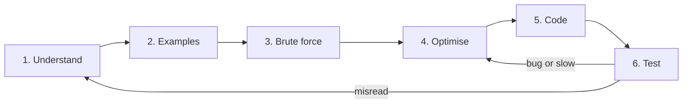

You are handed a problem you have not seen before. Maybe it is an interviewer reading from a doc, maybe it is a ticket that says "dedupe these events but keep the most recent one per user". The instinct of most engineers is to start typing within thirty seconds, because typing feels like progress. Ten minutes later they have a half-written function, a vague sense that it is wrong, and no idea which part to fix.

The engineers who consistently solve unfamiliar problems do not think faster. They follow a protocol that turns one big question ("how do I solve this?") into six small ones, each of which has a concrete deliverable. This lesson is that protocol. Every lesson on Ascend uses it, every practice problem's editorial is structured around it, and it is the shape a senior interviewer is listening for whether or not they say so.

## The loop



Six steps, each with an output you could write on a whiteboard:

| Step | Output | Time budget in a 45-minute round |
|---|---|---|
| 1. Understand | A one-sentence restatement plus the input/output types and constraints | 2–3 min |
| 2. Examples | Two or three tiny inputs with their outputs, worked by hand, including one edge case | 2–3 min |
| 3. Brute force | The simplest correct algorithm and its complexity, stated not coded | 2–3 min |
| 4. Optimise | The bottleneck in the brute force and the idea that removes it, with the new complexity | 5–10 min |
| 5. Code | A clean implementation of the optimised idea | 10–15 min |
| 6. Test | Your examples traced through your code by hand, then edge cases | 5 min |

The arrows back from *Test* are the important part. The loop is a loop because the first pass is rarely right, and the protocol tells you where to go when it is not: a wrong answer on an example you understood means the optimisation is broken, go back to step 4; a wrong answer on a case you had not considered usually means you misread the problem, go back to step 1.

The rest of this lesson walks one problem through all six steps at the level of detail you should actually produce.

## The problem

> Given a string `s`, return the length of the longest substring that contains no repeated characters.

That is the whole statement. Resist the urge to code.

## Step 1: Understand

Restate it in your own words, and pin down every term that could mean two things.

- **Substring**, not subsequence: the characters must be contiguous. `"abc"` is a substring of `"xabcx"`; `"ac"` is not.
- **No repeated characters**: every character in the window appears exactly once.
- **Return the length**, not the substring itself. Returning the wrong type is a surprisingly common way to fail.
- **Input**: a string. Ask what the alphabet is. ASCII lets you use a 128-entry array; arbitrary Unicode means a hash map. Ask the maximum length: if `n` can be 10⁵, anything quadratic is out.
- **Empty string**: is `""` valid input? Assume yes; the answer is 0.

Write the signature before anything else. It fixes the types and makes the rest of the discussion concrete:

```python
def longest_unique_substring(s: str) -> int: ...
```

This step looks trivial. It is where most wrong answers are born. An engineer who "solves" the subsequence version, or returns the substring, has done everything else perfectly and still fails.

## Step 2: Examples

Make examples small enough to work by hand and varied enough to expose the shape of the problem.

| Input | Output | Why |
|---|---|---|
| `"abcabcbb"` | 3 | `"abc"` is the longest; `"abca"` repeats `a` |
| `"bbbbb"` | 1 | Every substring longer than 1 repeats `b` |
| `"pwwkew"` | 3 | `"wke"`; note the answer is not `"pwke"`, that is a subsequence |
| `""` | 0 | Edge case |
| `"abba"` | 2 | `"ab"` or `"ba"`; this one will matter later |

The third example does real work: it catches the subsequence misreading. The fifth looks pointless right now. Keep it; it is the example that breaks a specific tempting bug in step 5.

Working an example by hand also forces you to notice what your brain is doing. To find the answer for `"pwwkew"` you probably scanned left to right, extending a run of distinct characters until you hit a repeat, then started again. That intuition *is* the optimised algorithm. You just have not named it yet.

## Step 3: Brute force

State the most obvious correct algorithm, and state its cost. Do not skip this step because it is "too slow"; it gives you a correctness baseline, it gives the interviewer confidence you can solve the problem at all, and its bottleneck tells you what to optimise.

The brute force: enumerate every substring, check whether it has repeats, keep the longest that does not.

```python
def longest_unique_brute(s: str) -> int:
    best = 0
    n = len(s)
    for i in range(n):
        for j in range(i + 1, n + 1):          # substring s[i:j]
            if len(set(s[i:j])) == j - i:      # all distinct?
                best = max(best, j - i)
    return best
```

Cost: there are $O(n^2)$ substrings and checking each costs $O(n)$, so $O(n^3)$ time. For `n = 10⁵` that is on the order of 10¹⁵ operations, which is years. Say that number out loud. A sense of "how many operations is too many" is the single most useful reflex from the [complexity module](/learn/foundations/complexity/why-big-o): roughly 10⁸ simple operations per second is the working figure, so $O(n^2)$ at `n = 10⁵` (10¹⁰) is already too slow and $O(n \log n)$ (about 1.7 × 10⁶) is comfortable.

## Step 4: Optimise

Look at the brute force and ask: *what work is being repeated?*

Checking `s[i:j]` for distinctness and then checking `s[i:j+1]` from scratch throws away everything you learned. If `s[i:j]` was distinct, `s[i:j+1]` is distinct if and only if `s[j]` is not already in the window. Maintain a set of the characters in the current window and extend one character at a time. That cuts the inner check to $O(1)$ and the total to $O(n^2)$: for each start `i`, extend `j` until you hit a repeat.

That is progress, but the outer loop still restarts from every `i`. The next observation is the real one. Suppose the window `s[i:j]` is distinct and `s[j]` repeats a character at position `k` (with `i ≤ k < j`). Every start position `i' ≤ k` is now useless: any window starting at `i'` and including `s[j]` also includes `s[k]`, a repeat. So the next candidate start is `k + 1`, not `i + 1`. The start pointer only ever moves right.

Two pointers that both move monotonically to the right, with a data structure describing what is between them, is the **sliding window** pattern. You will meet it formally in [Sliding window](/learn/interview-patterns/array-patterns/sliding-window); for now, watch it run:

```viz
{"type": "array", "algorithm": "sliding-window-longest-unique", "values": [1, 2, 3, 1, 2, 4], "title": "Longest window without repeats", "caption": "The right pointer always advances; the left pointer jumps past the previous occurrence of a repeated value."}
```

Each pointer moves at most `n` times, so the total is $O(n)$. Space is $O(\min(n, |\Sigma|))$ for the map of last-seen positions, where $|\Sigma|$ is the alphabet size.

Before coding, say the new complexity and check it against the constraints: $O(n)$ at `n = 10⁵` is 10⁵ steps. Done in well under a millisecond.

## Step 5: Code

Now, and only now, write the implementation. Because the idea is fully formed, the code is short and every line has a reason.

```python
def longest_unique_substring(s: str) -> int:
    last_seen: dict[str, int] = {}   # char -> index of its most recent occurrence
    left = 0                          # window is s[left:right+1]
    best = 0
    for right, ch in enumerate(s):
        if ch in last_seen and last_seen[ch] >= left:
            left = last_seen[ch] + 1  # jump past the previous occurrence
        last_seen[ch] = right
        best = max(best, right - left + 1)
    return best
```

```javascript
function longest_unique_substring(s) {
  const lastSeen = new Map();
  let left = 0, best = 0;
  for (let right = 0; right < s.length; right++) {
    const ch = s[right];
    if (lastSeen.has(ch) && lastSeen.get(ch) >= left) {
      left = lastSeen.get(ch) + 1;
    }
    lastSeen.set(ch, right);
    best = Math.max(best, right - left + 1);
  }
  return best;
}
```

The condition `last_seen[ch] >= left` is the line that `"abba"` exists to test. Without it, when `right` reaches the final `a`, the code sees `a` was last at index 0 and sets `left = 1`, moving the window *backwards* from 3 to 1 and reporting the invalid window `"bba"` with length 3. With it, index 0 is outside the current window and is ignored.

## Step 6: Test

Trace your own examples through the code by hand, one variable at a time. This is not optional and it is not slow; a trace of a five-character string takes under a minute and catches the majority of off-by-one bugs before you ever run anything.

Trace of `"abba"`:

| `right` | `ch` | `last_seen[ch]` before | `left` after | window | `best` |
|---|---|---|---|---|---|
| 0 | a | – | 0 | `a` | 1 |
| 1 | b | – | 0 | `ab` | 2 |
| 2 | b | 1 (≥ left) | 2 | `b` | 2 |
| 3 | a | 0 (< left, ignored) | 2 | `ba` | 2 |

Returns 2. Correct. Now the edge cases: `""` never enters the loop and returns 0; `"a"` returns 1; `"bbbbb"` moves `left` every step and never exceeds 1.

Then think about the cases your examples did *not* cover. What if the string contains spaces or punctuation? The code treats them as characters, which matches the statement. What if it contains characters outside the Basic Multilingual Plane? Python iterates by code point so it behaves; JavaScript's `s[right]` indexes UTF-16 code units, so an emoji is two "characters". Mentioning that unprompted is a senior signal; see [Numbers, strings and Unicode](/learn/foundations/how-code-runs/numbers-strings-unicode).

## Why the order matters

Each step is cheap, and each step makes the next one cheaper.

- Understanding before examples means your examples test the right problem.
- Examples before brute force means you have a way to check the brute force.
- Brute force before optimising means you know what the bottleneck is instead of guessing at a clever technique.
- Optimising before coding means you write the code once.
- Coding before testing is obvious; testing *at all* is what separates working code from plausible code.

Skipping steps does not save time; it moves the time to debugging, where it costs three times as much and produces nothing the interviewer can give you credit for.

## The loop outside interviews

The same six steps are how you should approach a production task with an algorithmic core. "Dedupe these events but keep the most recent per user": understand (what identifies a user? what is "most recent", event time or ingest time?), examples (three events, two users), brute force (sort by user then time, take the last of each group, $O(n \log n)$), optimise (a single pass with a map from user to best-so-far, $O(n)$), code, test. The difference from an interview is that step 4 often stops early: if `n` is ten thousand a day, the sort is fine and the map is over-engineering. Knowing when to stop optimising is part of the skill, and the only way to know is to have done step 3 and looked at the numbers.

## Exercise

```exercise
id: longest-unique-substring
title: Longest substring without repeating characters
prompt: |
  Implement the optimised sliding-window solution from this lesson.
  Return the length of the longest substring of `s` with all distinct
  characters. Aim for O(n) time. `s` may be empty.
languages: [python, javascript]
entry: longest_unique_substring
starter:
  python: |
    def longest_unique_substring(s):
        # your code here
        return 0
  javascript: |
    function longest_unique_substring(s) {
      // your code here
      return 0;
    }
tests:
  - args: ["abcabcbb"]
    expected: 3
  - args: ["bbbbb"]
    expected: 1
  - args: ["pwwkew"]
    expected: 3
    label: substring, not subsequence
  - args: [""]
    expected: 0
    label: empty input
  - args: ["abba"]
    expected: 2
    label: left pointer must never move backwards
  - args: ["dvdf"]
    expected: 3
    hidden: true
  - args: ["a"]
    expected: 1
    hidden: true
hints:
  - "Keep a map from character to the index where you last saw it."
  - "When you see a repeat at index `k`, move `left` to `k + 1`, but only if `k >= left`."
  - "The answer is the largest `right - left + 1` seen at any point."
```

## Senior signals

- You restate the problem and write the function signature before anything else, and you ask about constraints (input size, alphabet, empty input) because they decide which complexity is acceptable.
- You produce a brute force and its complexity in one sentence, then name the repeated work it does; the optimisation follows from the bottleneck rather than from pattern-matching on the problem title.
- You convert Big-O into an operation count against the stated `n` and say whether it fits.
- You trace an example by hand through your own code before declaring it done, and you keep at least one example whose only purpose is to break a specific bug you know is tempting.
- You know when to stop: an $O(n \log n)$ solution to a problem with `n = 1,000` is finished, and you say so.
- You notice representation issues (UTF-16 code units, integer width) that the problem statement does not mention.

## Check yourself

```quiz
- q: >-
    You have coded a solution and it returns the wrong answer for an example you had not written down before. According to the loop, where do you go first?
  options: ["Step 4, to rethink the optimisation you chose", "Step 1, to check you read the problem right", "Step 5, to find and fix the bug in the code", "Step 3, to compare against the brute force"]
  answer: 1
  explanation: >-
    A failure on a case you never considered usually means the problem is different from the one you solved (a missed constraint or misread term). Re-examine the statement first; fixing code for the wrong problem wastes time. A failure on an example you did work by hand points at the optimisation (step 4) or the code instead.
- q: >-
    Why does the protocol insist on stating the brute force even when it is obviously too slow?
  options: ["It lets you skip working through examples by hand later", "It is a correct baseline and exposes the repeated work", "Interviewers require it before they let you optimise", "It is usually fast enough once the constants are tuned"]
  answer: 1
  explanation: >-
    The brute force is a correctness oracle for your examples and a diagnosis tool: the optimisation comes from asking what work it repeats. Interviewer confidence is a side effect, not a rule; interviewers care because the brute force shows you understand the problem. Examples come before the brute force, which is how you check it.
- q: >-
    In the sliding-window solution, what goes wrong if you drop the check `last_seen[ch] >= left` and always set `left = last_seen[ch] + 1`?
  options: ["left can move backwards, re-admitting a repeated char", "Nothing; the check is redundant since left only grows", "It becomes O(n^2), because left re-scans characters", "It fails on the empty string with a missing-key error"]
  answer: 0
  explanation: >-
    On "abba", the final `a` was last seen at index 0, outside the current window [2,3]. Without the check `left` jumps back to 1, the window "bba" contains two b's, and the function returns 3 instead of 2. Complexity is unaffected; the check is exactly what stops left from moving backwards.
- q: >-
    A problem states n ≤ 10^5. Your brute force is O(n^2). Roughly how many operations is that, and is it acceptable?
  options: ["It depends on the language, not the count", "About 10^10, too slow for a typical limit", "About 10^7, fine at 10^8 ops per second", "About 10^5, well within any time limit"]
  answer: 1
  explanation: >-
    (10^5)^2 = 10^10. At roughly 10^8 simple operations per second that is on the order of a minute or more; time limits are seconds. Language changes the constant by maybe 10–100x, not enough to rescue four orders of magnitude.
- q: >-
    Which example in the worked problem exists specifically to catch a misreading of the statement rather than a coding bug?
  options: ["\"pwwkew\"", "\"abba\"", "\"bbbbb\"", "\"abcabcbb\""]
  answer: 0
  explanation: >-
    "pwwkew" has a longer subsequence ("pwke", length 4) than any substring (length 3); it catches solving the subsequence problem. "abcabcbb" gives 3 under either reading, so it cannot tell them apart. "abba" catches the backwards-moving-left-pointer bug, a coding error.
```
