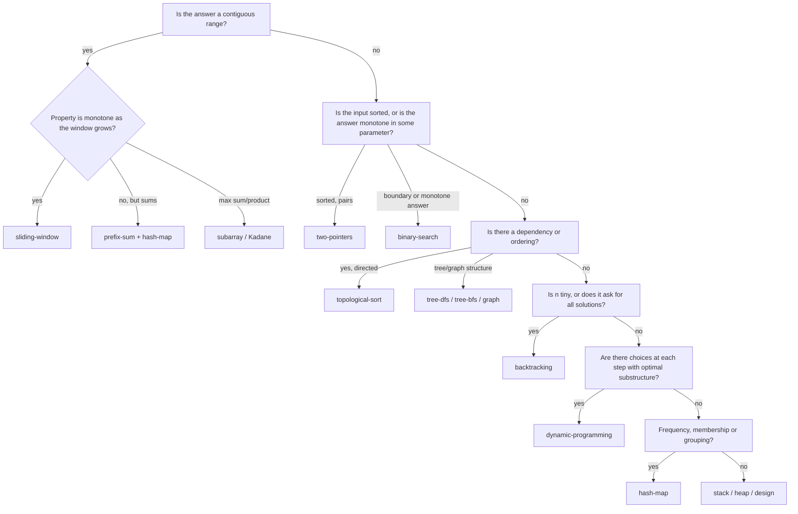

Interview problems are not infinite. A few thousand distinct ones exist in the wild, and nearly all of them are one of about thirty techniques wearing a costume. The costume changes (candies, meeting rooms, servers, gas stations, DNA strings) but the technique underneath is decided by a small number of properties of the input and the question: is the input sorted, is the question about contiguous ranges, does "the smallest k that works" have a monotone structure, is there a dependency order.

Experienced engineers do not solve interview problems from scratch. They read the statement, notice two or three signals, map them to a pattern, and spend their time on the parts of the problem that are genuinely new. This lesson is that mapping, written down. It will not make you good at any individual pattern; each one has its own lesson in the [Interview Patterns](/learn/interview-patterns/array-patterns/two-pointers) track. What it does is give you the first thirty seconds of every problem: *what kind of thing is this?*

## Why the signal comes from the problem, not the solution

A pattern is not a solution. It is a shape of solution that fits a shape of problem. That means the selection happens by looking at the *problem's* properties, and the properties that matter are surprisingly few:

- **What is the input's structure?** Array, string, linked list, tree, graph, intervals, a stream, a grid. Sorted or not. Small alphabet or arbitrary values.
- **What is the question's shape?** A single value (max, min, count, yes/no), a subset of elements, an ordering, a boundary, "all of them", or an object that supports operations.
- **What are the constraints?** `n ≤ 20` means exponential is fine (backtracking, bitmasks). `n ≤ 10⁵` means $O(n \log n)$ or better. `values ≤ 10⁶` means counting arrays are on the table. "O(1) extra space" removes the hash map.
- **What structure does the answer have?** Is the answer *contiguous* (subarray, substring)? Is the answer *monotone* in some parameter (if capacity `c` works then `c + 1` works)? Is there an *order* things must happen in?

Read for those four things before you think about any technique. Then consult the table.

## The catalogue

| Pattern | Strong signals in the statement | Typical complexity | Teaching lesson |
|---|---|---|---|
| **two-pointers** | Sorted array; pairs/triples summing to a target; "in place"; palindromes; partition around a value | $O(n)$ after sort | [two-pointers](/learn/interview-patterns/array-patterns/two-pointers) |
| **sliding-window** | "Longest/shortest *contiguous* substring/subarray with property P"; "at most k distinct"; fixed window size k | $O(n)$ | [sliding-window](/learn/interview-patterns/array-patterns/sliding-window) |
| **prefix-sum** | Many range-sum queries; "subarray with sum equal to k"; counts of something over a range | $O(n)$ build, $O(1)$ query | [prefix-sum](/learn/interview-patterns/array-patterns/prefix-sum) |
| **binary-search** | Sorted input; "first/last position where…"; or an answer that is monotone: "minimum capacity/speed/time such that…" | $O(\log n)$ or $O(n \log \text{range})$ | [binary-search](/learn/interview-patterns/array-patterns/binary-search) |
| **sorting** | Order does not matter in the input but would help; "closest pairs"; anagram grouping; problems that become trivial once sorted | $O(n \log n)$ | [sorting-based-patterns](/learn/interview-patterns/array-patterns/sorting-based-patterns) |
| **intervals** | Start/end pairs; meetings, bookings, ranges; "merge", "overlap", "minimum rooms" | $O(n \log n)$ | [intervals](/learn/interview-patterns/array-patterns/intervals) |
| **cyclic-sort** | Array of `n` numbers in range `1..n` (or `0..n`); "missing", "duplicate", O(1) space | $O(n)$ | [cyclic-sort](/learn/interview-patterns/array-patterns/cyclic-sort) |
| **subarray (Kadane)** | "Maximum sum/product of a contiguous subarray"; best single buy/sell | $O(n)$ | [kadane-and-subarrays](/learn/interview-patterns/array-patterns/kadane-and-subarrays) |
| **matrix** | 2-D grid with rotate/spiral/transpose/set-zero; row-major traversal tricks | $O(rc)$ | [matrix-traversal](/learn/interview-patterns/array-patterns/matrix-traversal) |
| **hash-map** | "Have I seen this before?"; frequency counts; grouping by key; complement lookup; O(n) required for what looks like O(n²) | $O(n)$ | [hash-map-patterns](/learn/interview-patterns/sequence-patterns/hash-map-patterns) |
| **fast-slow-pointers** | Linked list cycle; middle of a list; sequences defined by `x → f(x)` that might loop (happy number) | $O(n)$, $O(1)$ space | [fast-slow-pointers](/learn/interview-patterns/sequence-patterns/fast-slow-pointers) |
| **linked-list** | Reverse, reorder, remove nth, merge lists in place | $O(n)$ | [in-place-linked-list](/learn/interview-patterns/sequence-patterns/in-place-linked-list) |
| **stack** | Matching brackets; nested structure; "most recent unmatched thing"; expression evaluation; undo | $O(n)$ | [stack-patterns](/learn/interview-patterns/sequence-patterns/stack-patterns) |
| **monotonic-stack** | "Next greater/smaller element"; "days until warmer"; histogram areas; spans | $O(n)$ | [monotonic-stack-pattern](/learn/interview-patterns/sequence-patterns/monotonic-stack-pattern) |
| **heap** | "Top k", "k most frequent", "k closest"; repeatedly extract min/max from a changing set; scheduling | $O(n \log k)$ | [top-k-elements](/learn/interview-patterns/sequence-patterns/top-k-elements) |
| **two-heaps** | Running median; balance two halves of a stream | $O(\log n)$ per element | [two-heaps](/learn/interview-patterns/sequence-patterns/two-heaps) |
| **k-way-merge** | k sorted lists/arrays/matrix rows; "smallest range covering all lists" | $O(N \log k)$ | [k-way-merge](/learn/interview-patterns/sequence-patterns/k-way-merge) |
| **tree-bfs** | Level order; "right side view"; minimum depth; anything "per level" | $O(n)$ | [tree-bfs](/learn/interview-patterns/tree-and-graph-patterns/tree-bfs) |
| **tree-dfs** | Path sums; height/diameter; validate; LCA; anything where a node's answer is computed from its children's answers | $O(n)$ | [tree-dfs](/learn/interview-patterns/tree-and-graph-patterns/tree-dfs) |
| **graph** | Islands, regions, "connected", flood fill; grids where you can move to neighbours; clone | $O(V + E)$ | [graph-traversal](/learn/interview-patterns/tree-and-graph-patterns/graph-traversal) |
| **topological-sort** | Prerequisites, dependencies, build order, "is it possible to finish"; a directed graph that must be acyclic | $O(V + E)$ | [topological-sort-pattern](/learn/interview-patterns/tree-and-graph-patterns/topological-sort-pattern) |
| **union-find** | Dynamic connectivity; "merge groups"; redundant edge; number of provinces | near $O(1)$ per op | [union-find-pattern](/learn/interview-patterns/tree-and-graph-patterns/union-find-pattern) |
| **shortest-path** | Weighted edges; "minimum cost/time to reach"; "with at most k stops" | $O(E \log V)$ | [shortest-path-pattern](/learn/interview-patterns/tree-and-graph-patterns/shortest-path-pattern) |
| **trie** | Prefix queries; autocomplete; many words to match against; wildcards in words | $O(L)$ per op | [trie-pattern](/learn/interview-patterns/tree-and-graph-patterns/trie-pattern) |
| **backtracking** | "All subsets/permutations/combinations"; "all ways to…"; `n ≤ 20`; placing things under constraints | exponential | [backtracking-pattern](/learn/interview-patterns/combinatorial-patterns/backtracking-pattern) |
| **dynamic-programming** | "Number of ways"; "minimum cost/maximum value" with choices at each step; overlapping subproblems; strings compared position by position | $O(n)$ to $O(n^2)$ states | [dp-patterns](/learn/interview-patterns/combinatorial-patterns/dp-patterns) |
| **greedy** | Local choice with a provable exchange argument; jump game; intervals scheduling; "minimum number of X to cover" | $O(n \log n)$ | [greedy-pattern](/learn/interview-patterns/combinatorial-patterns/greedy-pattern) |
| **bit-manipulation** | "Without extra memory"; single number among pairs; count bits; powers of two; subsets as masks | $O(n)$ or $O(2^n)$ | [bit-manipulation-pattern](/learn/interview-patterns/combinatorial-patterns/bit-manipulation-pattern) |
| **math** | Pow, big-number arithmetic on strings, geometry counting, digit manipulation | varies | [math-and-geometry](/learn/interview-patterns/combinatorial-patterns/math-and-geometry) |
| **design** | "Implement a class that supports…"; LRU, min-stack, time-based store; every operation must be O(1) or O(log n) | per operation | [design-problems](/learn/interview-patterns/combinatorial-patterns/design-problems) |

The table is not a lookup you memorise. It is a summary of a habit: notice the input structure, the question shape, the constraints, and the answer's structure, and let those choose.

## A decision walk

When the table gives you two candidates, this order of questions usually settles it.



"Monotone as the window grows" is the question that separates sliding window from the harder cases. "Longest substring with all distinct characters" is monotone: if a window has distinct characters, every sub-window does, so shrinking from the left always fixes a violation. "Subarray whose sum equals `k`" with negative numbers is *not* monotone: growing the window can push the sum past `k` and then back. That one needs prefix sums with a hash map, and recognising the difference is the whole problem.

## Three statements, read for signals

### "Given an array of integers, find the contiguous subarray with the largest sum."

Signals: *contiguous* (a range), *largest sum* (a single value), no sort mentioned, no constraint on values (negatives allowed). Contiguous plus "max sum" is the Kadane signal. Sliding window is tempting but wrong: with negatives, the sum is not monotone in the window, so there is no rule for when to shrink. Kadane sidesteps this by asking a different question at each index, "best subarray ending here", which is either the element alone or the element plus the best ending at the previous index.

```viz
{"type": "array", "algorithm": "kadane", "values": [-2, 1, -3, 4, -1, 2, 1, -5, 4], "title": "Kadane: best subarray ending at each index", "caption": "A running best-ending-here value resets whenever it would drag the next element down."}
```

If the statement had said "largest sum of a subarray of length exactly k", the fixed-size window signal would override and sliding window would be right. One phrase changes the pattern.

### "For each day's temperature, how many days until a warmer one?"

Signals: *for each element*, *next* element satisfying a comparison, *to the right*. "For each element, the next greater thing" is the monotonic-stack signal, nearly verbatim. The brute force ($O(n^2)$, scan right from each index) is worth stating because it reveals the repeated work: indices that have already found their answer are scanned again. The stack holds exactly the indices still waiting, in decreasing order of temperature, and each index is pushed once and popped once.

```viz
{"type": "array", "algorithm": "monotonic-stack-next-greater", "values": [73, 74, 75, 71, 69, 72, 76, 73], "title": "Monotonic stack for next greater element", "caption": "Indices waiting for a warmer day sit on the stack; a new warmer value pops every one it answers."}
```

### "There are n courses, some with prerequisites. Can you finish them all?"

Signals: *prerequisites* (directed edges), *can you finish all* (is the dependency graph acyclic?). That is topological sort, or equivalently cycle detection in a directed graph. If the question were "in what order?", the same algorithm produces the order as a by-product. If it were "what is the minimum number of semesters?", it is topological sort by levels (Kahn's algorithm counting rounds). All three costumes, one technique.

## When two patterns fit

Some problems genuinely admit two approaches, and the constraints pick.

- **Top-k frequent elements.** Hash map for counts, then either a heap ($O(n \log k)$) or bucket sort by frequency ($O(n)$). If `k` is close to `n`, the heap gains nothing; if memory is tight, the heap is smaller.
- **Longest consecutive sequence.** Sort then scan, $O(n \log n)$, or a hash set with "only start counting from a number whose predecessor is absent", $O(n)$. The statement's "O(n) required" is the signal for the set.
- **Kth largest element.** Sort ($O(n \log n)$), heap ($O(n \log k)$), or quickselect (expected $O(n)$). The follow-up "the array is a stream" kills sort and quickselect and leaves the heap.

When you see two, say both, with their complexities, and pick using the constraints. That short comparison is worth more to an interviewer than silently choosing the right one.

## Signals that mislead

Pattern matching on surface words has failure modes, and the difference between a mid-level and a senior candidate is often knowing them.

- **"Sorted" does not always mean binary search.** Sorted plus "pair with sum" is two pointers. Sorted plus "merge" is k-way merge. Sorted plus a single lookup is binary search.
- **"Subarray" does not always mean sliding window.** Only when the property is monotone in the window. Otherwise prefix sums, Kadane, or DP.
- **"Minimum" does not always mean greedy.** Greedy needs an exchange argument; without one, it is DP or a search. Coin change with coins `{1, 3, 4}` and target 6 is the canonical counter-example: greedy takes `4 + 1 + 1`, DP finds `3 + 3`.
- **"Graph" does not always mean BFS/DFS.** Weighted edges push you to Dijkstra; "merge groups over time" pushes you to union-find; "dependencies" to topological sort.
- **"Recursion" is not a pattern.** It is an implementation strategy that backtracking, tree-dfs and top-down DP all use. Naming "recursion" as your approach tells the interviewer nothing about whether the algorithm is exponential or linear.

## Building the reflex

Pattern recognition is not memorised from a table; it is built by solving problems and, after each one, writing one sentence: *the signal was X, the pattern was Y, and the thing that made it non-obvious was Z.* Ten problems per pattern with that sentence attached is enough for the reflex to form. Two hundred problems without it is not, which is why engineers who have "done 400 LeetCode problems" still freeze on the 401st.

Ascend's practice problems are tagged by pattern so you can do this deliberately: pick a pattern, solve its problems until the signal is automatic, then move to the next. Each pattern lesson lists its problems and the variations that tend to appear as follow-ups.

## Senior signals

- You read the constraints before the examples, because `n ≤ 20` versus `n ≤ 10⁵` decides the entire approach.
- You name the signal, not just the pattern: "contiguous and monotone, so sliding window" rather than "I think this is sliding window".
- You can say why the tempting wrong pattern fails on this problem (sliding window with negatives, greedy without an exchange argument).
- When two patterns fit you state both with complexities and let the constraints or the follow-up choose.
- You treat "recursion", "hash map" and "sort" as tools, not answers, and can say which algorithmic idea they are serving.
- You recognise the same technique under different costumes (course schedule, build systems, package managers are one problem).

## Check yourself

```quiz
- q: >-
    A statement asks for the longest contiguous subarray whose sum is at most k, with all elements positive. Which pattern, and what property justifies it?
  options: ["Sliding window, since positives make the sum monotone", "Two pointers from both ends, since the array is sorted", "Kadane's algorithm, because it is a subarray problem", "Prefix sum with a hash map, because sums are involved"]
  answer: 0
  explanation: >-
    Positive elements make the window sum monotone: extending never decreases it and shrinking from the left never increases it, so a violation is always fixed by shrinking. With negatives allowed that property breaks and prefix sums would be needed. Kadane answers "maximum sum", a different question, and nothing says the array is sorted.
- q: >-
    Which change to a statement most clearly moves a problem from sliding window to prefix sum plus hash map?
  options: ["Guaranteeing the input array is sorted ascending", "Asking for the shortest window instead of the longest", "Raising n from 10^3 to 10^5, which rules out O(n^2)", "Allowing negative numbers when the sum is what matters"]
  answer: 3
  explanation: >-
    Negative numbers destroy the monotone relationship between window size and window sum, so there is no rule for when to shrink. Prefix sums turn "subarray with sum k" into "two prefixes that differ by k", a hash-map lookup. Shortest versus longest changes the window's bookkeeping, not the pattern.
- q: >-
    A problem says n ≤ 16 and asks for the minimum cost to visit every node exactly once. The constraint is a signal for:
  options: ["Bitmask DP or backtracking, since 2^16 states are cheap", "Dijkstra, because the problem asks for a minimum cost", "Union-find, because visiting every node is connectivity", "Greedy nearest-neighbour, because n is small enough"]
  answer: 0
  explanation: >-
    Tiny n is the signal that an exponential number of states is fine; 2^16 × 16 is about a million. Dijkstra finds single-source shortest paths, not tours, and nearest-neighbour greedy has no exchange argument and gives wrong answers.
- q: >-
    "Given prerequisites between tasks, return the minimum number of rounds needed if independent tasks run in parallel." Which pattern?
  options: ["Topological sort by levels, counting Kahn's rounds", "Backtracking over every valid ordering of the tasks", "Union-find, merging tasks that share a prerequisite", "Shortest path with Dijkstra, weighting each edge 1"]
  answer: 0
  explanation: >-
    Prerequisites are directed edges; rounds are the levels of a topological ordering, produced by repeatedly removing all zero-in-degree nodes. Dijkstra answers a shortest-path question, while rounds are set by the longest prerequisite chain; union-find ignores direction.
- q: >-
    Why is greedy the wrong reflex for minimum-coins with denominations {1, 3, 4} and target 6?
  options: ["Greedy only works when the target is a power of two", "Largest-first gives 4+1+1, but 3+3 uses fewer coins", "Greedy is never valid for minimisation problems", "It is not wrong; largest-first also finds 3+3 here"]
  answer: 1
  explanation: >-
    Taking the largest coin first gives 4+1+1 (three coins) while 3+3 (two coins) is optimal. Greedy requires that a locally best choice can always be exchanged into some optimal solution. That holds for canonical coin systems like {1, 5, 10, 25} but not for {1, 3, 4}, so greedy is sometimes valid, just not here. The safe reflex is DP unless you can state the exchange argument.
```
