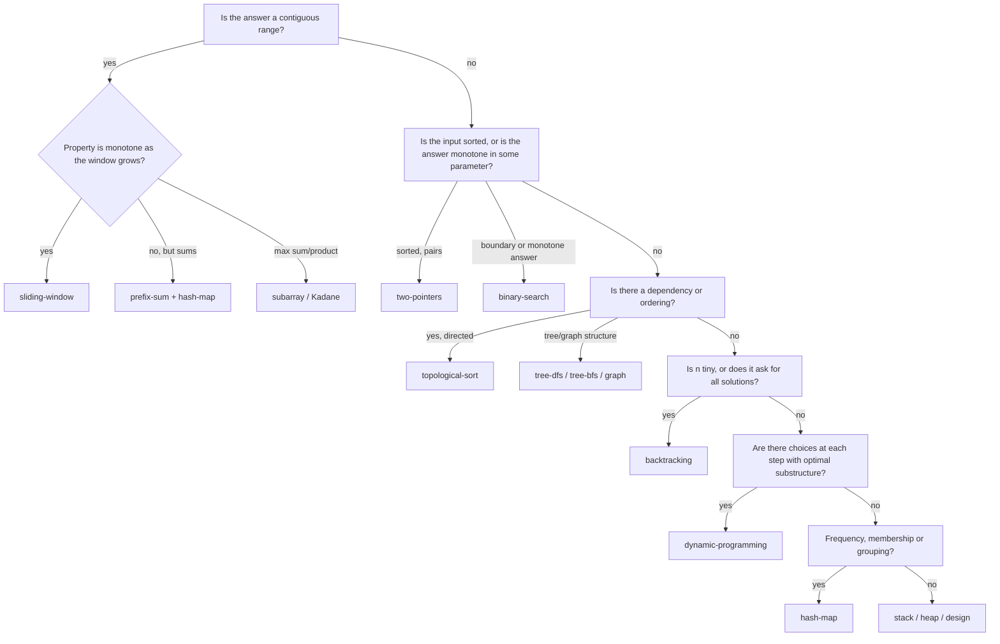

Interview problems are not infinite. A few thousand distinct ones exist in the wild, and nearly all of them are one of about thirty techniques wearing a costume. The costume changes (candies, meeting rooms, servers, gas stations, DNA strings) but the technique underneath is decided by a small number of properties of the input and the question: is the input sorted, is the question about contiguous ranges, does "the smallest k that works" have a monotone structure, is there a dependency order.

Experienced engineers do not solve interview problems from scratch. They read the statement, notice two or three signals, map them to a pattern, and spend their time on what is new. This lesson is that mapping, written down, then exercised on two problems from signal to traced code, one of whose loudest signal points at the wrong pattern. It will not make you good at any individual pattern; each has its own lesson in the [Interview Patterns](/learn/interview-patterns/array-patterns/two-pointers) track. What it gives you is the first thirty seconds of every problem: *what kind of thing is this?*

## Why the signal comes from the problem, not the solution

A pattern is not a solution. It is a shape of solution that fits a shape of problem, so the selection happens by looking at the *problem's* properties, and the properties that matter are few:

- **What is the input's structure?** Array, string, linked list, tree, graph, intervals, a stream, a grid. Sorted or not. Small alphabet or arbitrary values.
- **What is the question's shape?** A single value (max, min, count, yes/no), a subset of elements, an ordering, a boundary, "all of them", or an object that supports operations.
- **What are the constraints?** `n ≤ 20` means exponential is fine (backtracking, bitmasks). `n ≤ 10⁵` means $O(n \log n)$ or better. `values ≤ 10⁶` puts counting arrays on the table. "O(1) extra space" removes the hash map. `-1000 ≤ nums[i]` removes the sliding window from sum problems, as the second walkthrough shows.
- **What structure does the answer have?** Is it *contiguous* (subarray, substring)? Is it *monotone* in some parameter (if capacity `c` works then `c + 1` works)? Is there an *order* things must happen in?

Read for those four things before you think about any technique. Then consult the table.

## The catalogue

| Pattern | Strong signals in the statement | Typical complexity | Teaching lesson |
|---|---|---|---|
| **two-pointers** | Sorted array; pairs/triples summing to a target; "in place"; palindromes; partition around a value | $O(n)$ after sort | [two-pointers](/learn/interview-patterns/array-patterns/two-pointers) |
| **sliding-window** | "Longest/shortest *contiguous* substring/subarray with property P"; "at most k distinct"; fixed window size k | $O(n)$ | [sliding-window](/learn/interview-patterns/array-patterns/sliding-window) |
| **prefix-sum** | Many range-sum queries; "subarray with sum equal to k"; counts of something over a range | $O(n)$ build, $O(1)$ query | [prefix-sum](/learn/interview-patterns/array-patterns/prefix-sum) |
| **binary-search** | Sorted input; "first/last position where…"; or an answer that is monotone: "minimum capacity/speed/time such that…" | $O(\log n)$ or $O(n \log \text{range})$ | [binary-search](/learn/interview-patterns/array-patterns/binary-search) |
| **sorting** | Order does not matter in the input but would help; "closest pairs"; anagram grouping; problems that become trivial once sorted | $O(n \log n)$ | [sorting-based-patterns](/learn/interview-patterns/array-patterns/sorting-based-patterns) |
| **intervals** | Start/end pairs; meetings, bookings, ranges; "merge", "overlap", "minimum rooms" | $O(n \log n)$ | [intervals](/learn/interview-patterns/array-patterns/intervals) |
| **cyclic-sort** | Array of `n` numbers in range `1..n` (or `0..n`); "missing", "duplicate", O(1) space | $O(n)$ | [cyclic-sort](/learn/interview-patterns/array-patterns/cyclic-sort) |
| **subarray (Kadane)** | "Maximum sum/product of a contiguous subarray"; best single buy/sell | $O(n)$ | [kadane-and-subarrays](/learn/interview-patterns/array-patterns/kadane-and-subarrays) |
| **matrix** | 2-D grid with rotate/spiral/transpose/set-zero; row-major traversal tricks | $O(rc)$ | [matrix-traversal](/learn/interview-patterns/array-patterns/matrix-traversal) |
| **hash-map** | "Have I seen this before?"; frequency counts; grouping by key; complement lookup; O(n) required for what looks like O(n²) | $O(n)$ | [hash-map-patterns](/learn/interview-patterns/sequence-patterns/hash-map-patterns) |
| **fast-slow-pointers** | Linked list cycle; middle of a list; sequences defined by `x → f(x)` that might loop (happy number) | $O(n)$, $O(1)$ space | [fast-slow-pointers](/learn/interview-patterns/sequence-patterns/fast-slow-pointers) |
| **linked-list** | Reverse, reorder, remove nth, merge lists in place | $O(n)$ | [in-place-linked-list](/learn/interview-patterns/sequence-patterns/in-place-linked-list) |
| **stack** | Matching brackets; nested structure; "most recent unmatched thing"; expression evaluation; undo | $O(n)$ | [stack-patterns](/learn/interview-patterns/sequence-patterns/stack-patterns) |
| **monotonic-stack** | "Next greater/smaller element"; "days until warmer"; histogram areas; spans | $O(n)$ | [monotonic-stack-pattern](/learn/interview-patterns/sequence-patterns/monotonic-stack-pattern) |
| **heap** | "Top k", "k most frequent", "k closest"; repeatedly extract min/max from a changing set; scheduling | $O(n \log k)$ | [top-k-elements](/learn/interview-patterns/sequence-patterns/top-k-elements) |
| **two-heaps** | Running median; balance two halves of a stream | $O(\log n)$ per element | [two-heaps](/learn/interview-patterns/sequence-patterns/two-heaps) |
| **k-way-merge** | k sorted lists/arrays/matrix rows; "smallest range covering all lists" | $O(N \log k)$ | [k-way-merge](/learn/interview-patterns/sequence-patterns/k-way-merge) |
| **tree-bfs** | Level order; "right side view"; minimum depth; anything "per level" | $O(n)$ | [tree-bfs](/learn/interview-patterns/tree-and-graph-patterns/tree-bfs) |
| **tree-dfs** | Path sums; height/diameter; validate; LCA; anything where a node's answer is computed from its children's answers | $O(n)$ | [tree-dfs](/learn/interview-patterns/tree-and-graph-patterns/tree-dfs) |
| **graph** | Islands, regions, "connected", flood fill; grids where you can move to neighbours; clone | $O(V + E)$ | [graph-traversal](/learn/interview-patterns/tree-and-graph-patterns/graph-traversal) |
| **topological-sort** | Prerequisites, dependencies, build order, "is it possible to finish"; a directed graph that must be acyclic | $O(V + E)$ | [topological-sort-pattern](/learn/interview-patterns/tree-and-graph-patterns/topological-sort-pattern) |
| **union-find** | Dynamic connectivity; "merge groups"; redundant edge; number of provinces | near $O(1)$ per op | [union-find-pattern](/learn/interview-patterns/tree-and-graph-patterns/union-find-pattern) |
| **shortest-path** | Weighted edges; "minimum cost/time to reach"; "with at most k stops" | $O(E \log V)$ | [shortest-path-pattern](/learn/interview-patterns/tree-and-graph-patterns/shortest-path-pattern) |
| **trie** | Prefix queries; autocomplete; many words to match against; wildcards in words | $O(L)$ per op | [trie-pattern](/learn/interview-patterns/tree-and-graph-patterns/trie-pattern) |
| **backtracking** | "All subsets/permutations/combinations"; "all ways to…"; `n ≤ 20`; placing things under constraints | exponential | [backtracking-pattern](/learn/interview-patterns/combinatorial-patterns/backtracking-pattern) |
| **dynamic-programming** | "Number of ways"; "minimum cost/maximum value" with choices at each step; overlapping subproblems; strings compared position by position | $O(n)$ to $O(n^2)$ states | [dp-patterns](/learn/interview-patterns/combinatorial-patterns/dp-patterns) |
| **greedy** | Local choice with a provable exchange argument; jump game; intervals scheduling; "minimum number of X to cover" | $O(n \log n)$ | [greedy-pattern](/learn/interview-patterns/combinatorial-patterns/greedy-pattern) |
| **bit-manipulation** | "Without extra memory"; single number among pairs; count bits; powers of two; subsets as masks | $O(n)$ or $O(2^n)$ | [bit-manipulation-pattern](/learn/interview-patterns/combinatorial-patterns/bit-manipulation-pattern) |
| **math** | Pow, big-number arithmetic on strings, geometry counting, digit manipulation | varies | [math-and-geometry](/learn/interview-patterns/combinatorial-patterns/math-and-geometry) |
| **design** | "Implement a class that supports…"; LRU, min-stack, time-based store; every operation must be O(1) or O(log n) | per operation | [design-problems](/learn/interview-patterns/combinatorial-patterns/design-problems) |

The table is not a lookup you memorise. It is a summary of a habit: notice the input structure, the question shape, the constraints and the answer's structure, and let those choose.

## A decision walk

When the table gives you two candidates, this order of questions usually settles it.



"Monotone as the window grows" is the question that separates sliding window from the harder cases. "Longest substring with all distinct characters" is monotone: if a window has distinct characters, every sub-window does, so shrinking from the left always fixes a violation. "Subarray whose sum equals `k`" with negative numbers is *not* monotone: growing the window can push the sum past `k` and then back. That one needs prefix sums with a hash map, and recognising the difference is the whole problem. The second walkthrough below is exactly that case.

## Walkthrough 1: days until a warmer day

> For each day's temperature, how many days until a strictly warmer one? Return 0 if none comes. `0 ≤ n ≤ 10⁵`, `0 ≤ temps[i] ≤ 200`.

This is [Daily Temperatures](/practice/daily-temperatures). **Signals:** *for each element*, the *next* element to the right satisfying a comparison. "For each element, the next greater thing" is the monotonic-stack row of the table, nearly verbatim. Now run the [problem-solving loop](/learn/foundations/problem-solving/the-problem-solving-loop) on it rather than stopping at the pattern's name.

**Understand:** strictly warmer, so an equal temperature does not count; the answer is a distance in days, not an index; the bounded temperature range (0 to 200) is a signal for a follow-up, not for the main solution. **Examples:**

| Input | Output | Why |
|---|---|---|
| `[73, 74, 75, 71, 69, 72, 76, 73]` | `[1, 1, 4, 2, 1, 1, 0, 0]` | day 2 (75) waits four days for 76 |
| `[70, 70, 70, 75]` | `[3, 2, 1, 0]` | equal is not warmer |
| `[90, 80, 70]` | `[0, 0, 0]` | it only gets colder |
| `[]` | `[]` | empty |

**Brute force:** for each day scan right until a warmer one, $O(n^2)$. Its worst case is a decreasing array, where every scan runs to the end: $n(n-1)/2 \approx 5 \times 10^9$ comparisons at $n = 10^5$, minutes in CPython against the problem's 4-second limit. The repeated work: day `i`'s scan passes over the same days that day `i − 1`'s scan passed over, and a day that has already found its answer is scanned again by every earlier day.

**Optimise:** keep the days that have not yet found a warmer day and resolve them in bulk when one arrives. Read oldest to newest, the waiting days have non-increasing temperatures (a warmer newer day would already have resolved the older one), so only the newest needs comparing with the incoming day, and a new temperature resolves every waiting day colder than it. Each index is pushed once and popped at most once: at most $2n$ stack operations, $O(n)$ time, $O(n)$ space in the worst case.

```python
def daily_temperatures(temps: list[int]) -> list[int]:
    answer = [0] * len(temps)
    waiting: list[int] = []            # indices without a warmer day yet; temps non-increasing
    for i, t in enumerate(temps):
        while waiting and temps[waiting[-1]] < t:
            j = waiting.pop()
            answer[j] = i - j          # day i is the first warmer day for day j
        waiting.append(i)
    return answer                      # anything still waiting keeps its 0
```

```viz
{"type": "array", "algorithm": "monotonic-stack-next-greater", "values": [73, 74, 75, 71, 69, 72, 76, 73], "title": "Monotonic stack for next greater element", "caption": "Indices waiting for a warmer day sit on the stack; a new warmer value pops every one it answers."}
```

**Trace** on the first example (the stack holds indices; temperatures shown for reading):

| `i` | `temps[i]` | Popped (index → answer) | Stack after | Temperatures on stack |
|---|---|---|---|---|
| 0 | 73 | | `[0]` | 73 |
| 1 | 74 | 0 → 1 | `[1]` | 74 |
| 2 | 75 | 1 → 1 | `[2]` | 75 |
| 3 | 71 | | `[2, 3]` | 75, 71 |
| 4 | 69 | | `[2, 3, 4]` | 75, 71, 69 |
| 5 | 72 | 4 → 1, then 3 → 2 | `[2, 5]` | 75, 72 |
| 6 | 76 | 5 → 1, then 2 → 4 | `[6]` | 76 |
| 7 | 73 | | `[6, 7]` | 76, 73 |

Indices 6 and 7 are still waiting at the end and keep their 0. The strict `<` is what `[70, 70, 70, 75]` tests: with `<=`, day 1 would "resolve" day 0 with an equal temperature and the answer would be `[1, 1, 1, 0]` instead of `[3, 2, 1, 0]`.

## Walkthrough 2: subarrays that sum to k

> Count the contiguous, non-empty subarrays of `nums` whose elements sum to exactly `k`. `0 ≤ n ≤ 2 × 10⁴`, `-1000 ≤ nums[i] ≤ 1000`.

This is [Subarray Sum Equals K](/practice/subarray-sum-equals-k), and its loudest signal is a trap. **Signals:** *contiguous* and *sum* say sliding window. But a window needs the property to be monotone in the window, and the constraint `-1000 ≤ nums[i]` says negatives exist, so the sum can pass `k` and come back and there is no rule for when to shrink. The honest signal is "subarray with sum equal to k", the prefix-sum row, combined with "how many earlier prefixes have I seen with a given value", the hash-map row.

**Understand:** count, not find; non-empty; subarrays at different positions count separately even with equal contents; `k` may be negative or zero. **Examples:**

| Input | Output | Why |
|---|---|---|
| `[1, 2, 3]`, 3 | 2 | `[1, 2]` and `[3]` |
| `[0, 0, 0]`, 0 | 6 | three of length 1, two of length 2, one of length 3 |
| `[1, -1, 1, -1]`, 0 | 4 | `[1, -1]` twice, `[-1, 1]`, and the whole array |
| `[]`, 5 | 0 | empty |

**Brute force:** every start, then extend the end with a running sum: $n(n+1)/2 \approx 2 \times 10^8$ additions at $n = 2 \times 10^4$. Measured on one machine (AMD Ryzen 9 9950X3D, CPython 3.14.7, random values in $[-1000, 1000]$): 3.0 s natively, against a 4-second limit enforced by a browser runtime slower than native. Not safe. The repeated work: the sum of `nums[i..j]` is recomputed for each `i` even though it is `prefix[j+1] - prefix[i]`.

**Optimise:** a subarray sum is a difference of two prefix sums, so "subarray ending at `j` sums to `k`" becomes "some earlier prefix equals `prefix[j+1] - k`". Walk once, keeping a frequency map of prefixes seen so far; at each position add the count of the prefix you need. Seed the map with `{0: 1}` for the empty prefix, or subarrays that start at index 0 are never counted. $O(n)$ time, $O(n)$ space; measured 2.2 ms at $n = 2 \times 10^4$, about 1,400 times faster than the brute force.

```python
def subarray_sum(nums: list[int], k: int) -> int:
    seen = {0: 1}                      # prefix sum -> how many prefixes had it
    prefix = 0
    total = 0
    for x in nums:
        prefix += x
        total += seen.get(prefix - k, 0)   # earlier prefixes that make a k-sum ending here
        seen[prefix] = seen.get(prefix, 0) + 1
    return total
```

**Trace** on `[1, -1, 1, -1]`, `k = 0`:

| `x` | `prefix` | `need = prefix − k` | `seen[need]` | `total` | `seen` after |
|---|---|---|---|---|---|
| 1 | 1 | 1 | 0 | 0 | `{0: 1, 1: 1}` |
| −1 | 0 | 0 | 1 | 1 | `{0: 2, 1: 1}` |
| 1 | 1 | 1 | 1 | 2 | `{0: 2, 1: 2}` |
| −1 | 0 | 0 | 2 | 4 | `{0: 3, 1: 2}` |

The last row is the one to understand: prefix 0 has been seen twice before (the empty prefix and after `[1, -1]`), so two subarrays ending at index 3 sum to 0, `[1, -1]` and `[1, -1, 1, -1]`. The order of the two statements in the loop matters as it did in Two Sum: count before you record the current prefix, or `k = 0` counts every empty subarray.

## A senior reading the statement

The second walkthrough, as a strong candidate narrates it, with the signals an interviewer notes in brackets.

> "Count the contiguous subarrays with sum exactly k. Two signals: contiguous, and a sum. My first thought is a sliding window, but a window only works when the sum is monotone in the window, so let me check the constraints. Values are −1000 to 1000. Negatives. So the window is out: growing it can pass k and come back."
>
> *[names the tempting pattern and the property it needs, then tests the property against the constraints]*
>
> "n is up to 2 × 10⁴. Brute force is every start and end with a running sum, about n²/2, 2 × 10⁸ additions. In Python that is seconds against a 4-second limit. Not safe."
>
> *[converts O(n²) to a count against the stated n and the time limit]*
>
> "A subarray sum is a difference of two prefix sums. So the question for each end position is: how many earlier prefixes equal the current prefix minus k? That is a frequency map of prefixes seen so far. O(n) time and space."
>
> *[re-expresses the question as a frequency query, which is the hash-map signal]*
>
> "One subtlety: the empty prefix. I seed the map with 0 → 1, otherwise subarrays starting at index 0 are never counted. Check on [1, 2, 3], k = 3: prefixes 1, 3, 6; at prefix 3 I need 0, one hit; at prefix 6 I need 3, one hit; total 2."
>
> *[states the boundary case before coding and verifies it on an example]*
>
> "If you told me all values were positive, I would go back to the window and drop the map: O(1) space."
>
> *[names the condition under which the rejected pattern becomes the better one]*

## Under the hood: where the operations-per-second budget comes from

Every pattern decision above leaned on a number: "10⁸ simple operations per second". Here is what that figure is made of. Measured on one machine (AMD Ryzen 9 9950X3D; CPython 3.14.7, Node 24.21, gcc 13 at `-O2`; best of several runs, loops of 10⁷ to 10⁸ iterations):

| Loop body | CPython | Node (V8) | C |
|---|---|---|---|
| Empty `for` over a range | 4.1 ns (2.4 × 10⁸/s) | | |
| One integer add per iteration | 13 ns (7.7 × 10⁷/s) | 0.50 ns (2.0 × 10⁹/s) | 0.37 ns, dependent chain (2.7 × 10⁹/s) |
| Sum an array of numbers | 4.9 ns via `sum()` in C (2.0 × 10⁸/s) | 0.37 ns, typed array | 0.21 ns, vectorised (4.9 × 10⁹/s) |
| One hash-map store per iteration | 20 ns (5.0 × 10⁷/s) | 4.0 ns (2.5 × 10⁸/s) | |
| One `list.append` per iteration | 26 ns (3.9 × 10⁷/s) | | |
| The sliding-window body from lesson 1 | 57 ns (1.7 × 10⁷/s) | 21 ns (4.8 × 10⁷/s) | |

Read the rule of thumb off the table. **Compiled code** does $10^9$ simple operations per second, more when the loop vectorises; $10^8$ is ten times pessimistic. **A JIT** does $10^9$ on integer arithmetic and about $10^8$ once each iteration touches a hash map. **CPython** reaches $10^8$ only for an empty loop; any real body, with a dict operation, a call or an append, runs at $2$ to $5 \times 10^7$ per second, so $10^8$ is several times optimistic. The honest budget: $10^9$ per second compiled, $10^8$ under a JIT with real work in the body, $10^7$ in CPython, then scale by what one iteration does (a dict probe 20 to 50 ns in CPython, a DRAM cache miss about 100 ns in any language, as the [cost model lesson](/learn/foundations/complexity/why-big-o) measured). This machine is a fast 2025 desktop; a laptop or a judge's shared server runs two to three times slower, which is why the numbers are quoted to one significant figure.

Time limits come from the same arithmetic. Judges run a reference solution in the intended complexity and multiply its time by a factor, commonly two to five, so the intended solution passes with slack and one class worse does not. Some judges give interpreted languages a per-language multiplier; others give every language the same limit, which is why competitive Python usually runs under PyPy. On this platform each problem carries a `time_limit_ms` (4,000 ms for the problems above) applied per test in both languages, with Python running as Pyodide, CPython compiled to WebAssembly inside a Web Worker, slower than native by a factor to treat as a few. So a solution measured at 3 s natively is a failed submission, and at $n = 2 \times 10^4$ the gap between $O(n^2)$ and $O(n)$ is not "faster"; it is failing versus 2 ms.

## Two more statements, read for signals

**"Find the contiguous subarray with the largest sum."** Signals: *contiguous*, *largest sum*, negatives allowed. Contiguous plus "max sum" is the Kadane row. Sliding window is tempting and wrong for the same reason as walkthrough 2: with negatives the sum is not monotone in the window. Kadane asks a different question at each index, "best subarray ending here", which is either the element alone or the element plus the best ending at the previous index. Had the statement said "of length exactly k", the fixed-size window signal would override; one phrase changes the pattern.

```viz
{"type": "array", "algorithm": "kadane", "values": [-2, 1, -3, 4, -1, 2, 1, -5, 4], "title": "Kadane: best subarray ending at each index", "caption": "A running best-ending-here value resets whenever it would drag the next element down."}
```

**"There are n courses, some with prerequisites. Can you finish them all?"** Signals: *prerequisites* (directed edges), *can you finish all* (is the graph acyclic?). Topological sort, or equivalently cycle detection in a directed graph. "In what order?" is the same algorithm returning its by-product; "minimum number of semesters?" is topological sort by levels, Kahn's algorithm counting rounds. Three costumes, one technique.

## When two patterns fit

Some problems admit two approaches, and the constraints pick. Say both, with their costs, and let the constraints or the follow-up choose; that comparison is worth more to an interviewer than silently choosing the right one.

| Problem | Option | Time | Extra space | Handles a stream | Choose it when |
|---|---|---|---|---|---|
| Top-k frequent | count, then heap of size k | $O(n \log k)$ | $O(n + k)$ | yes | $k \ll n$ or memory-tight |
| | count, then bucket by frequency | $O(n)$ | $O(n)$ | no | $k$ close to $n$ |
| Kth largest | sort | $O(n \log n)$ | $O(1)$ in place | no | one-off, small $n$ |
| | heap of size k | $O(n \log k)$ | $O(k)$ | yes | "the array is a stream" |
| | quickselect | expected $O(n)$ | $O(1)$ | no | one-off, large $n$ |
| Longest consecutive sequence | sort, then scan | $O(n \log n)$ | $O(1)$ | no | no complexity constraint stated |
| | hash set, count only from run starts | $O(n)$ | $O(n)$ | no | "O(n) required" |
| Subarray with sum k | sliding window | $O(n)$ | $O(1)$ | yes | all values positive |
| | prefix sums plus hash map | $O(n)$ | $O(n)$ | yes | negatives allowed |

The same choices appear outside interviews at every scale. A recommender that scores millions of candidates per request and needs the best few hundred keeps them in a bounded heap rather than sorting, because $k \ll n$: the top-k row, and the shape of candidate ranking as large streaming services including Netflix describe it publicly. A build system or pipeline scheduler ordering jobs by declared dependencies is the topological-sort row in a different costume.

## Signals that mislead

Pattern matching on surface words has failure modes, and the difference between a mid-level and a senior candidate is often knowing them.

- **"Sorted" does not always mean binary search.** Sorted plus "pair with sum" is two pointers. Sorted plus "merge" is k-way merge. Sorted plus a single lookup is binary search.
- **"Subarray" does not always mean sliding window.** Only when the property is monotone in the window. Otherwise prefix sums, Kadane, or DP.
- **"Minimum" does not always mean greedy.** Greedy needs an exchange argument; without one, it is DP or a search. Coin change with coins `{1, 3, 4}` and target 6 is the canonical counter-example: greedy takes `4 + 1 + 1`, DP finds `3 + 3`.
- **"Graph" does not always mean BFS/DFS.** Weighted edges push you to Dijkstra; "merge groups over time" to union-find; "dependencies" to topological sort.
- **"Recursion" is not a pattern.** It is an implementation strategy that backtracking, tree-dfs and top-down DP all use. Naming "recursion" as your approach says nothing about whether the algorithm is exponential or linear.

## Failure modes in interviews

**The loud signal was the wrong one.** *Symptom:* the sliding-window solution passes the interviewer's positive-only example and fails the first case with a negative number, or the greedy coin solution passes `{1, 5, 10, 25}` and fails `{1, 3, 4}`. *Diagnosis:* the pattern was chosen from a word ("subarray", "minimum") without checking the property the pattern requires (monotone window, exchange argument). *Fix:* for every pattern you name, say the property it needs and check it against the constraints before coding; the constraints line `-1000 ≤ nums[i]` is where the answer was.

**Pattern chosen before the constraints were read.** *Symptom:* a backtracking solution on `n ≤ 10⁵`, or a DP table of `n × amount` cells on `amount ≤ 10⁹`; "how long does that take?" gets silence. *Diagnosis:* the examples were read first and the constraints skipped. *Fix:* read constraints before examples, convert them into an operation budget against the table above, and let the budget eliminate patterns before the signals select one.

**The tool named as the answer.** *Symptom:* "I will use a hash map" or "I will use recursion", followed by ten minutes of code with no complexity anyone can state. *Diagnosis:* the tool was named but the algorithmic idea was not; a hash map serves two-sum, prefix sums and grouping, and they have different costs. *Fix:* name the signal, then the pattern, then the tool: "for each end position I need the count of an earlier prefix, so a frequency map over prefixes".

**Only one pattern considered.** *Symptom:* a correct $O(n \log n)$ answer, and the follow-up "the input is a stream" produces a restart from scratch. *Diagnosis:* the alternatives were never listed, so the follow-up could not be answered by switching rows. *Fix:* when the table offers two, say both with their costs before choosing; the follow-up is then a one-line switch.

## Building the reflex

Pattern recognition is not memorised from a table; it is built by solving problems and, after each one, writing one sentence: *the signal was X, the pattern was Y, and the thing that made it non-obvious was Z.* Ten problems per pattern with that sentence attached is enough for the reflex to form. Two hundred problems without it is not, which is why engineers who have "done 400 LeetCode problems" still freeze on the 401st. Ascend's practice problems are tagged by pattern so you can do this deliberately: pick a pattern, solve its problems until the signal is automatic, then move on.

## Exercises

```exercise
id: daily-temperatures-stack
title: Days until a warmer day
prompt: |
  `temps` is a list of daily temperatures. Return a list of the same
  length where entry `i` is the number of days until a strictly warmer
  day than day `i`, or 0 if none comes. Aim for O(n) using a stack of
  indices that are still waiting for their warmer day.
languages: [python, javascript]
entry: daily_temperatures
starter:
  python: |
    def daily_temperatures(temps):
        # your code here
        return [0] * len(temps)
  javascript: |
    function daily_temperatures(temps) {
      // your code here
      return temps.map(() => 0);
    }
tests:
  - args: [[73, 74, 75, 71, 69, 72, 76, 73]]
    expected: [1, 1, 4, 2, 1, 1, 0, 0]
  - args: [[70, 70, 70, 75]]
    expected: [3, 2, 1, 0]
    label: equal is not warmer
  - args: [[90, 80, 70]]
    expected: [0, 0, 0]
    label: never warmer
  - args: [[]]
    expected: []
    label: empty input
  - args: [[50]]
    expected: [0]
    label: single day
  - args: [[1, 2, 3, 4]]
    expected: [1, 1, 1, 0]
    hidden: true
  - args: [[5, 4, 3, 2, 1, 6]]
    expected: [5, 4, 3, 2, 1, 0]
    hidden: true
hints:
  - "Keep a stack of indices whose answer is unknown; the temperatures on it are non-increasing from bottom to top."
  - "When day i arrives, pop every index j with temps[j] < temps[i] and set answer[j] = i - j; then push i."
```

```exercise
id: subarray-sum-count
title: Count subarrays that sum to k
prompt: |
  Return the number of contiguous, non-empty subarrays of `nums` whose
  elements sum to exactly `k`. Values may be negative, so a sliding
  window does not work; use prefix sums with a frequency map, and make
  sure subarrays that start at index 0 are counted.
languages: [python, javascript]
entry: subarray_sum
starter:
  python: |
    def subarray_sum(nums, k):
        # your code here
        return 0
  javascript: |
    function subarray_sum(nums, k) {
      // your code here
      return 0;
    }
tests:
  - args: [[1, 2, 3], 3]
    expected: 2
  - args: [[0, 0, 0], 0]
    expected: 6
    label: zeros
  - args: [[1, -1, 1, -1], 0]
    expected: 4
    label: negatives
  - args: [[], 5]
    expected: 0
    label: empty input
  - args: [[5], 5]
    expected: 1
    label: subarray starting at index 0
  - args: [[3, 4, 7, 2, -3, 1, 4, 2], 7]
    expected: 4
    hidden: true
  - args: [[-1, -1, 1], 0]
    expected: 1
    hidden: true
hints:
  - "The sum of nums[i..j] is prefix[j+1] - prefix[i], so a subarray ending at j sums to k when an earlier prefix equals prefix[j+1] - k."
  - "Seed the map with {0: 1} for the empty prefix, and add the count for the needed prefix before recording the current one."
```

## Interviewer follow-ups

**"Daily temperatures in O(1) extra space beyond the output?"** *Model answer:* the bounded range is the signal. Scan from the right keeping, for each of the 201 temperatures, the nearest index to the right where it occurs; day `i`'s answer is the minimum such index over temperatures above `temps[i]`, minus `i`: $O(201 \cdot n)$ time and 201 words of space, a worse constant for a better space bound. *Common wrong answer:* "iterate from the right with the stack", which is still $O(n)$ space.

**"Temperatures arrive as a stream and you must emit each day's answer as soon as it is known."** *Model answer:* the stack solution already does that: an answer is known at the moment its index is popped, so emit on pop. The cost is that unresolved indices stay buffered, and a strictly decreasing stream buffers everything, so memory is $O(n)$ in the worst case and the last answers arrive only at end of stream. *Common wrong answer:* "you need the whole array first", which the pop-time emission disproves.

**"Why seed the prefix map with `{0: 1}`?"** *Model answer:* it represents the empty prefix before index 0. A subarray `nums[0..j]` that sums to `k` has `prefix[j+1] - k == 0`, and without the seed that lookup finds nothing; `[5]` with `k = 5` returns 0 instead of 1. *Common wrong answer:* "to avoid a missing-key error", which `.get(…, 0)` already handles.

**"All values are now positive. Does anything change?"** *Model answer:* the window sum becomes monotone, so a sliding window counts the subarrays in $O(n)$ time and $O(1)$ space; the prefix map still works but its $O(n)$ space is now unnecessary. I would say the switch and why it is now valid. *Common wrong answer:* "no, the prefix map is always the answer to this problem".

**"Top-k frequent: heap or bucket sort?"** *Model answer:* the heap is $O(n \log k)$ and $O(k)$ extra beyond the counts, and it works on a stream; bucket sort is $O(n)$ and $O(n)$ space and needs all counts first. With $k$ near $n$ the heap's log factor buys nothing; with $k$ small and memory tight, or with a stream, the heap wins. *Common wrong answer:* "heap, because it is the top-k pattern", with no reference to $k$, $n$ or memory.

## What mid-level engineers get wrong

- **Choosing the pattern from the problem title.** "Subarray" becomes sliding window and "minimum" becomes greedy before the constraints are read; the solution passes the examples and fails the hidden negative or the `{1, 3, 4}` coins.
- **Reading examples before constraints.** The examples explain the problem; the constraints decide the approach. `n ≤ 20` and `n ≤ 10⁵` are different problems with the same examples.
- **Quoting $10^8$ per second for CPython.** A loop body with a dict operation runs at $2$ to $5 \times 10^7$ per second, so an $O(n^2)$ plan at $n = 2 \times 10^4$ that "should take two seconds" takes three natively and fails in the browser runtime.
- **Naming the tool as the algorithm.** "I will use a hash map" has no complexity; "for each end, look up the count of the prefix I need" does.
- **Memorising the table without the property.** The row for sliding window says "contiguous"; the property it needs is monotone, and the row is useless without it.
- **Committing to one pattern in silence.** When the follow-up changes a constraint, the candidate who listed two options switches in a sentence; the one who did not starts over.

## Senior signals

- You read the constraints before the examples, because `n ≤ 20` versus `n ≤ 10⁵` decides the entire approach, and you turn them into an operation budget with a number attached to your runtime.
- You name the signal, not only the pattern: "contiguous and monotone, so sliding window" rather than "I think this is sliding window".
- You can say why the tempting wrong pattern fails on this problem (sliding window with negatives, greedy without an exchange argument) and under what change to the constraints it would become right.
- When two patterns fit you state both with time, space and streaming behaviour, and let the constraints or the follow-up choose.
- You know where "10⁸ operations per second" comes from and that it is ten times pessimistic for compiled code and several times optimistic for CPython with a real loop body.
- You treat "recursion", "hash map" and "sort" as tools, not answers, and can say which algorithmic idea they are serving.
- You recognise the same technique under different costumes (course schedule, build systems and package managers are one problem; "next warmer day" and "stock span" are another).

## Check yourself

```quiz
- q: >-
    A statement asks for the longest contiguous subarray whose sum is at most k, with all elements positive. Which pattern, and what property justifies it?
  options: ["Sliding window, since positives make the sum monotone", "Two pointers from both ends, since the array is sorted", "Kadane's algorithm, because it is a subarray problem", "Prefix sum with a hash map, because sums are involved"]
  answer: 0
  explanation: >-
    Positive elements make the window sum monotone: extending never decreases it and shrinking from the left never increases it, so a violation is always fixed by shrinking. With negatives allowed that property breaks and prefix sums would be needed. Kadane answers "maximum sum", a different question, and nothing says the array is sorted.
- q: >-
    Which change to a statement most directly moves a problem from sliding window to prefix sum plus hash map?
  options: ["Allowing negative numbers when the sum is what matters", "Asking for the shortest window instead of the longest", "Raising n from 10^3 to 10^5, which rules out O(n^2)", "Guaranteeing the input array is sorted ascending"]
  answer: 0
  explanation: >-
    Negative numbers destroy the monotone relationship between window size and window sum, so there is no rule for when to shrink. Prefix sums turn "subarray with sum k" into "two prefixes that differ by k", a hash-map lookup. Shortest versus longest changes the window's bookkeeping, not the pattern.
- q: >-
    A problem says n ≤ 16 and asks for the minimum cost to visit every node exactly once. The constraint is a signal for:
  options: ["Bitmask DP or backtracking, since 2^16 states are cheap", "Dijkstra, because the problem asks for a minimum cost", "Union-find, because visiting every node is connectivity", "Greedy nearest-neighbour, because n is small enough"]
  answer: 0
  explanation: >-
    Tiny n is the signal that an exponential number of states is fine; 2^16 × 16 is about a million. Dijkstra finds single-source shortest paths, not tours, and nearest-neighbour greedy has no exchange argument and gives wrong answers.
- q: >-
    In the daily-temperatures stack solution, why is the total work O(n) even though the inner while loop can pop many indices in one step?
  options: ["The outer loop skips over indices that were popped in an earlier step", "The while loop runs at most log n times because temperatures halve", "Each index is pushed once and popped at most once: at most 2n operations", "The stack never holds more than 201 indices, one per temperature"]
  answer: 2
  explanation: >-
    An index enters the stack exactly once and leaves at most once, so however the pops are distributed across iterations the total number of pops is at most n. That amortised argument is what makes the algorithm linear; the temperature range plays no role in it, and the outer loop visits every index.
- q: >-
    Why is greedy the wrong reflex for minimum-coins with denominations {1, 3, 4} and target 6?
  options: ["Greedy only works when the target is a power of two", "Largest-first gives 4+1+1, but 3+3 uses fewer coins", "Greedy is never valid for minimisation problems", "It is not wrong; largest-first also finds 3+3 here"]
  answer: 1
  explanation: >-
    Taking the largest coin first gives 4+1+1 (three coins) while 3+3 (two coins) is optimal. Greedy requires that a locally best choice can always be exchanged into some optimal solution. That holds for canonical coin systems like {1, 5, 10, 25} but not for {1, 3, 4}, so greedy is sometimes valid and not here. The safe reflex is DP unless you can state the exchange argument.
- q: >-
    You have an O(n^2) Python solution for a problem with n ≤ 2 × 10^4 and a 4-second limit. Using the measured loop rates, which assessment is honest?
  options: ["Comfortable: 4 × 10^8 steps is well under 10^9 per second", "Fine, because limits are per test and the tests are independent", "Impossible in any language, since 10^8 per second is universal", "Unsafe: about 2 × 10^8 loop bodies at a few times 10^7 per second is seconds"]
  answer: 3
  explanation: >-
    n(n+1)/2 at n = 2 × 10^4 is about 2 × 10^8 loop bodies. A CPython body with an add and a compare runs at a few times 10^7 per second, so the brute force measured about 3 seconds natively and would be slower in the browser runtime; that is a failing submission, not a comfortable one. The same count is well under a second in compiled code, which is why the budget must be attached to a runtime.
```
