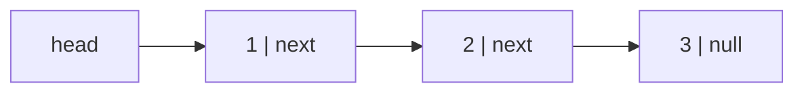

An LRU cache has to move any element to the front of the recency order in O(1) and evict from the back in O(1). An array cannot do the first: moving an element from the middle to the front shifts everything in between. A hash map cannot do the second: it has no notion of "back". The structure that does both is a doubly linked list, which is why Memcached's eviction, Java's `LinkedHashMap` and the Linux page cache's active/inactive lists all contain one. Redis, notably, does not: it approximates LRU by sampling, and the reason is a number this lesson gets to.

A linked list trades the array's contiguous memory for a chain of separately allocated nodes, each pointing at the next. That trade buys O(1) insertion and removal *at a position you already hold*. It costs O(n) access by index, one dependent memory load per node, and between 2× and 20× the memory per element, depending on the language and what you compare against. Knowing what is bought and what is paid, in bytes and nanoseconds rather than in big-O, is the whole topic.

## Nodes and pointers

A singly linked list is a chain of nodes; each node holds a value and a reference to the next node, and the last node's reference is null. The list itself is a single reference to the first node, the head.

```python
class ListNode:
    __slots__ = ("val", "next")          # 48 bytes per node on CPython 3.14; see below

    def __init__(self, val=0, next=None):
        self.val = val
        self.next = next

head = ListNode(1, ListNode(2, ListNode(3)))     # 1 → 2 → 3 → None
```



Every operation is pointer surgery, and the order of the writes is the entire correctness argument. To insert `x` after node `p`: create the node, point it at `p.next`, then point `p` at it.

```python
def insert_after(p, x):
    node = ListNode(x)
    node.next = p.next      # 1. new node points at the old successor
    p.next = node           # 2. p points at the new node
```

Trace `insert_after(p=node 2, x=9)` on `1 → 2 → 3`:

| step | statement | `2.next` | `9.next` | reachable from head |
|---|---|---|---|---|
| 0 | start | 3 | – | `1 → 2 → 3` |
| 1 | `node = ListNode(9)` | 3 | `None` | `1 → 2 → 3` (9 detached) |
| 2 | `node.next = p.next` | 3 | 3 | `1 → 2 → 3` (9 → 3 detached) |
| 3 | `p.next = node` | 9 | 3 | `1 → 2 → 9 → 3` |

Now the same two writes in the wrong order:

| step | statement | `2.next` | `9.next` | reachable from head |
|---|---|---|---|---|
| 2' | `p.next = node` | 9 | `None` | `1 → 2 → 9`; node 3 is unreachable |
| 3' | `node.next = p.next` | 9 | 9 | `1 → 2 → 9 → 9 → 9 …` a self-loop |

Step 2' loses the tail; step 3' reads the pointer you overwrote and makes the node point at itself, so any traversal that follows spins forever. This is the mechanism behind most linked-list bugs: a write that destroys the only copy of a pointer you still need.

To delete the node after `p`: `p.next = p.next.next`. The removed node is unreachable and collected in a garbage-collected language; in C you free it, in Rust the `Box` drops when the last owner is overwritten.

Both operations are O(1) *given `p`*. Finding `p` is O(n), by walking from the head. That qualifier is the source of every misleading claim about linked lists: "O(1) insertion" is true only when you already hold a pointer to the neighbour.

## Singly vs doubly linked

A doubly linked node also holds `prev`. It adds one pointer per node (8 bytes in every language on a 64-bit machine, 4 with Java's compressed references) and buys two things: you can walk backwards, and you can delete a node given only a pointer to *that node*, because you can reach its predecessor.

```python
def unlink(node):            # doubly linked; node is not a sentinel
    node.prev.next = node.next
    node.next.prev = node.prev
```

Two writes, and the node is out. That O(1) unlink-by-handle is what the LRU cache needs: the hash map stores a pointer to the node, a hit unlinks it and re-inserts it at the front, and eviction unlinks the tail. A singly linked list cannot do this without a predecessor pointer, which means an O(n) walk on every hit.

| | Singly | Doubly |
|---|---|---|
| Memory per node | value + 1 pointer | value + 2 pointers |
| Insert after a node | O(1) | O(1) |
| Delete a node given only the node | O(n) (need predecessor) | O(1) |
| Insert before a node | O(n) | O(1) |
| Walk backwards | No | Yes |
| Typical use | Stacks, hash chains, allocator free lists, persistent lists, interview problems | Deques, LRU, intrusive kernel lists, text editor buffers |

## Sentinels: deleting the edge cases

Most bugs in linked-list code are the special cases: the empty list, inserting at the head, deleting the head, the single-node list. Each needs its own branch, and each branch is a place to be wrong.

A **sentinel** (dummy) node removes them. Allocate one node that is never a real element and make it the permanent head. Every real node now has a predecessor, so "insert at the front" and "delete the first node" become the ordinary "after `p`" operations with `p = sentinel`.

Delete every node with value `v`, without a sentinel:

```python
def delete_value(head, v):
    while head is not None and head.val == v:     # special case: new head
        head = head.next
    p = head
    while p is not None and p.next is not None:
        if p.next.val == v:
            p.next = p.next.next
        else:
            p = p.next
    return head
```

With a sentinel:

```python
def delete_value(head, v):
    sentinel = ListNode(0, head)
    p = sentinel
    while p.next is not None:
        if p.next.val == v:
            p.next = p.next.next      # bypass; do not advance, the new p.next is unchecked
        else:
            p = p.next
    return sentinel.next
```

Trace the sentinel version on `6 → 1 → 6 → 6 → 2` with `v = 6` (`S` is the sentinel; the two later sixes are written `6a`, `6b`):

| step | `p` | `p.next` | `p.next.val == 6`? | action | list after `S` |
|---|---|---|---|---|---|
| 1 | S | 6 | yes | `S.next = 1` | `1 → 6a → 6b → 2` |
| 2 | S | 1 | no | `p = 1` | `1 → 6a → 6b → 2` |
| 3 | 1 | 6a | yes | `1.next = 6b` | `1 → 6b → 2` |
| 4 | 1 | 6b | yes | `1.next = 2` | `1 → 2` |
| 5 | 1 | 2 | no | `p = 2` | `1 → 2` |
| 6 | 2 | `None` | – | stop; return `S.next` | `1 → 2` |

Step 1 is the case that needed its own loop without the sentinel, and steps 3–4 show why `p` must not advance after a bypass: the new `p.next` is unexamined. The function returns `sentinel.next`, the correct head whether or not the original survived.

A doubly linked list usually uses one *circular* sentinel whose `next` is the first element and whose `prev` is the last. The empty list is the sentinel pointing at itself both ways, and `unlink` never touches a null pointer.

```python
class DList:
    def __init__(self):
        self.s = ListNode2(None)           # ListNode2 has val, prev, next
        self.s.next = self.s.prev = self.s

    def push_front(self, node):
        node.next = self.s.next
        node.prev = self.s
        self.s.next.prev = node            # old first element (or the sentinel itself)
        self.s.next = node

    def unlink(self, node):
        node.prev.next = node.next
        node.next.prev = node.prev
```

| operation | `S.next` | `S.prev` | ring read from `S` |
|---|---|---|---|
| empty | S | S | `S ⇄ S` |
| `push_front(A)` | A | A | `S ⇄ A ⇄ S` |
| `push_front(B)` | B | A | `S ⇄ B ⇄ A ⇄ S` |
| `unlink(A)` | B | B | `S ⇄ B ⇄ S` |

On the empty list, `push_front(A)` writes `A.next = S`, `A.prev = S`, `S.prev = A` (because `S.next` was `S`), `S.next = A`: four writes, no branch. This is the Linux kernel's `struct list_head` layout and the list inside most LRU implementations.

## Walking the list: what a pointer chase costs

```viz
{"type": "linked-list", "algorithm": "traverse", "values": [4, 8, 15, 16, 23, 42], "title": "Traversal: one dependent pointer load per node"}
```

Traversal is what makes lists slow. Each `p = p.next` reads a pointer to a node that could be anywhere on the heap, and the CPU cannot start fetching node `k + 1` until node `k` has arrived, because the address is inside it:

| | Array scan | List walk |
|---|---|---|
| Unit fetched | 64-byte cache line = 16 four-byte ints | 64-byte line holding one node (or part of one) |
| Next address known | Before the current load returns (stride) | Only after the current load returns |
| Hardware prefetcher | Detects the stride and runs ahead | Nothing to detect |
| Outstanding misses | Around 10–16 per core (line fill buffers; depends on the microarchitecture) | Exactly one |
| Cost per element | Bandwidth-bound: ~10 GB/s per core → 4 MB of ints in ~0.4 ms | Latency-bound: one miss ≈ 80–100 ns from DRAM (depends on CPU and memory) |

Put numbers on a million nodes. The array is 4 MB and streams through at bandwidth: about 0.4 ms. The list, if every node misses to DRAM, is 1,000,000 × ~100 ns ≈ 100 ms, a ratio of about 250×. That ceiling applies to scattered nodes, which is what a list looks like after churn (allocate, free, allocate). A freshly built list whose nodes came out of the allocator in order sits closer to the array, because consecutive nodes share cache lines and the prefetcher catches the stride. Real traversals therefore commonly land between 10× and 50× slower, and where a given list falls depends on allocation order, node size (a 48-byte Python node is most of a line; a 16-byte C node is a quarter of one) and whether the working set fits in L2 or L3 (a million 48-byte nodes is 48 MB, larger than most L3 caches).

```viz
{"type": "memory", "algorithm": "cache-lines", "n": 64, "values": [0, 1, 2, 3, 4, 5, 6, 7, 8, 9, 10, 11, 12, 13, 14, 15, 0, 9, 18, 27, 36, 45, 54, 63, 2, 20, 41, 58], "title": "Sixteen sequential accesses (array scan), then twelve scattered ones (list walk)", "caption": "The sequential run misses once per eight elements; the scattered run misses on almost every access, because each node lives in a different line."}
```

Bjarne Stroustrup's often-cited experiment makes the point: insert random integers into a sorted sequence, keeping it sorted, using a vector (O(n) shifts per insert) and a list (O(1) insert after an O(n) search). The vector wins at every size he tested, by a widening margin, because the list's search is a chain of cache misses while the vector's shift is a `memmove` at bandwidth speed. [Space complexity and the memory hierarchy](/learn/foundations/complexity/space-complexity-and-memory-hierarchy) has the latency table and [CPU caches and memory layout](/learn/systems/performance-engineering/cpu-caches-and-memory-layout) the microarchitecture.

The honest rule: **a linked list is the right choice only when you hold pointers to positions and need O(1) splice or unlink at those positions, or when elements must never move in memory.** If you are going to search for the position anyway, use an array.

## What a node costs, measured

The Python numbers below are from `sys.getsizeof` and `tracemalloc` on CPython 3.14.7 (the two-slot layout has been 48 bytes since 3.8, when the GC header shrank to 16 bytes); the rest follow from the documented object layouts.

| Node | Bytes | Where they go |
|---|---|---|
| Python `ListNode` with `__slots__ = ("val", "next")` | 48 | 16-byte object header + 16-byte GC header + 2 × 8-byte slots |
| Python doubly linked node, three slots | 56 | one more 8-byte slot |
| Python class without `__slots__` | ~88, or ~152 once anything reads `node.__dict__` | the 48 above plus the inline attribute values CPython 3.13+ keeps beside the object; a real dict per instance after |
| Python `int` value (up to 2³⁰) | 28 | 24-byte header + one 30-bit digit; `pymalloc` rounds to 32; ints −5..256 are shared |
| Java `LinkedList.Node` (compressed oops) | 24 | 12-byte header + `item`, `next`, `prev` at 4 bytes each |
| Java `Integer` | 16 | 12-byte header + 4-byte value |
| Java `LinkedHashMap.Entry` | 40 | `HashMap.Node` (hash, key, value, next = 32) + `before`, `after` |
| Rust `Box<Node<i32>>` (`val: i32, next: Option<Box<Node>>`) or the C `struct node { int v; struct node *next; }` | 16 | 4 + 4 padding + 8; `Option<Box<T>>` uses the null niche so it costs nothing |
| Rust `std::collections::LinkedList<i32>` node | 24 | two `Option<NonNull>` + `i32` + padding |

## The allocator's share, and a million integers six ways

The allocator adds its own overhead: glibc `malloc` rounds a 16-byte request up to its 32-byte minimum chunk, while jemalloc has a 16-byte size class with no per-allocation header, so the same C or Rust node costs 32 or 16 bytes depending on which allocator is linked. Storing a million 32-bit integers:

| Representation | Bytes per element | Total for 10⁶ |
|---|---|---|
| Rust `Vec<i32>`, C array, Python `array('i')`, NumPy `int32` | 4 | 4 MB |
| Java `ArrayList<Integer>` (4-byte ref + 16-byte `Integer`) | 20 | 20 MB |
| Java `LinkedList<Integer>` (24 + 16) | 40 | 40 MB |
| Python `list` of ints (8-byte slot + 32-byte int) | 40 | 40 MB (measured 40.0 with `tracemalloc`) |
| Python singly linked, `__slots__` (48 + 32) | 80 | 80 MB (measured 88 per node including the 8-byte slot of the list that held them) |
| Python singly linked, no `__slots__` | 120–184 | 120–184 MB (measured 128 and 192 per node with the list slot) |

Twenty to forty-fold between the array and the Python list of nodes, before counting the cache misses. When a linked list is the right structure, keep the nodes small (`__slots__` in Python, the value inline in Rust or C) and remember that a million nodes is a million objects for the garbage collector to trace.

## Under the hood: CPython's deque and the kernel's `list_head`

**`collections.deque`** is a doubly linked list of *blocks*, each holding 64 slots (`BLOCKLEN` in `Modules/_collectionsmodule.c`). A block is 64 pointers plus a `leftlink` and a `rightlink`: 528 bytes, which is 8.25 bytes per slot, measured on 3.14.7 as 825,496 bytes for a deque of 100,000 items against 800,056 for a list of the same length. Appending or popping at either end touches one block and never copies existing items, so both ends are O(1) with no amortisation; `d[i]` walks `i // 64` block links from the nearer end, so indexing the middle is O(n/64), and the documentation says so. The design gives the list's stable O(1) ends with the array's cache behaviour inside a block. [Stacks and queues](/learn/data-structures/stacks-queues/stacks-and-queues) compares it with the ring buffers that Rust's `VecDeque` and Java's `ArrayDeque` use instead.

**Linux `struct list_head`** is two pointers, `next` and `prev`, embedded *inside* the object being listed:

```c
struct list_head { struct list_head *next, *prev; };

struct task_struct {
    /* ... */
    struct list_head tasks;        /* every task in the system */
    struct list_head children;     /* this task's children */
    struct list_head sibling;      /* linkage in the parent's children list */
    /* ... */
};
```

The list is *intrusive*: no separate node is allocated, the object is the node, and one object can sit on several lists at once (a task is on the global task list, its parent's children list, a run queue, a wait queue). Given a `list_head` pointer, `container_of` subtracts the field offset to recover the enclosing struct. `list_del` unlinks in two writes and then sets the dead entry's `next` and `prev` to poison values (`0x100` and `0x122`, plus a per-architecture delta) so a later use-after-unlink faults on a recognisable address instead of corrupting a neighbour. Sockets' receive queues (`sk_buff_head`), timers, VMAs and the page cache's LRU lists all use the same 16-byte header. When the position is the object itself, there is no search, so the list's only cost is the two pointers.

## Under the hood: allocators and LRU caches

**Allocator free lists.** A free block is by definition unused memory, so the allocator writes the `next` pointer into the block's first bytes: the node storage *is* the free memory. glibc's `malloc` keeps, per thread, a `tcache` of 64 singly linked LIFO lists (one per 16-byte size class up to 1,032 bytes, at most 7 entries each by default), then singly linked fastbins, then doubly linked unsorted, small and large bins. A `free()` of a small chunk is a push; the matching `malloc()` is a pop. The bins that coalesce are doubly linked for the same reason the LRU list is: they must unlink an arbitrary neighbour in O(1). [Memory management](/learn/foundations/how-code-runs/memory-management) covers the rest.

**LRU cache: hash map plus doubly linked list.** The map gives O(1) lookup by key; the list keeps recency order; each map value is a pointer to the list node. A hit is `unlink(node); push_front(node)`, six pointer writes. A miss on a full cache is `unlink(tail); map.pop(tail.key); push_front(new); map[key] = new`.

```viz
{"type": "system", "algorithm": "lru-cache", "keys": ["A", "B", "C", "A", "D", "B", "E", "A"], "title": "LRU with capacity 3: every access is a move-to-front, every eviction is an unlink of the tail"}
```

Hand trace of the same sequence with capacity 3 (list written most-recent first):

| step | access | hit? | list after | map keys | evicted |
|---|---|---|---|---|---|
| 1 | A | miss | `A` | {A} | – |
| 2 | B | miss | `B → A` | {A, B} | – |
| 3 | C | miss | `C → B → A` | {A, B, C} | – |
| 4 | A | hit | `A → C → B` | {A, B, C} | – |
| 5 | D | miss | `D → A → C` | {A, C, D} | B |
| 6 | B | miss | `B → D → A` | {A, B, D} | C |
| 7 | E | miss | `E → B → D` | {B, D, E} | A |
| 8 | A | miss | `A → E → B` | {A, B, E} | D |

One hit in eight: a working set of five keys cycling through a cache of three thrashes, the classic LRU failure that [LRU cache](/learn/advanced-data-structures/caches-and-eviction/lru-cache) and [LFU and modern policies](/learn/advanced-data-structures/caches-and-eviction/lfu-and-modern-policies) address. Python's `OrderedDict` is this structure (a dict plus a doubly linked list of entries); `move_to_end(key)` and `popitem(last=False)` make an LRU in six lines. Memcached keeps a doubly linked LRU per slab class. Redis does *not*: at 100 million keys, two 8-byte pointers per key is 1.6 GB, and every read would become a write to the list. It stores a 24-bit clock per object instead and, on eviction, samples `maxmemory-samples` keys (default 5) and evicts the oldest of the sample: approximate LRU, the right trade when the pointers cost more than the accuracy is worth.

## Under the hood: Java's `LinkedList` and `LinkedHashMap`

`java.util.LinkedList` is a doubly linked list with a 24-byte node per element (`item`, `next`, `prev` under compressed oops) holding a reference to a boxed element. `get(i)` walks from the nearer end, so an indexed `for` loop over it is O(n²): 100,000 elements is about 2.5 × 10⁹ node visits, and this is a real production bug pattern, not a textbook one. `ArrayDeque` is the class the Javadoc recommends for both stack and queue use: a ring buffer, one 4-byte reference per element, no per-element allocation. `LinkedList` survives for the `ListIterator.add`/`remove` case, where you hold the iterator (the position) and splice in O(1).

`java.util.LinkedHashMap` is the map-plus-list structure with the list threaded through the map's own entries: each `Entry` extends `HashMap.Node` with `before` and `after` references, 40 bytes per entry before the key and value objects. Constructed with `accessOrder = true`, every `get` moves the entry to the tail of the list, and overriding `removeEldestEntry` to return `size() > capacity` gives an LRU cache in five lines. That is the JVM's textbook LRU, and it is what most Java caching libraries started from before moving to sampled or window-TinyLFU policies for the same reason Redis did. Hash-table chains ([Hash tables](/learn/data-structures/hashing/hash-tables)) and lock-free queues ([Atomics and lock-free](/learn/systems/concurrency/atomics-and-lock-free)) are the other two places the position is held rather than searched for.

## Trade-offs

| Axis | Dynamic array (`list`, `Vec`, `ArrayList`) | Singly linked | Doubly linked | Block deque (`collections.deque`) |
|---|---|---|---|---|
| Access by index | O(1) | O(n) | O(n) | O(n/64) |
| Insert/delete at a held position | O(n) shift (memmove) | O(1) after, O(n) before | O(1) either side | not supported |
| Push/pop at the front | O(n) | O(1) | O(1) | O(1) |
| Bytes per `int` element, CPython | 40 | 80 | 88 | 40 |
| Traversal | Bandwidth-bound, prefetched | One dependent miss per node | Same | Prefetched within a block |
| Element addresses stable? | No (growth reallocates) | Yes | Yes | Yes |
| Wins when | Almost always | Stacks, free lists, hash chains | Positions held elsewhere (LRU, intrusive) | FIFO/deque without pointer access |

## Production failure modes

| Symptom | Diagnosis | Fix |
|---|---|---|
| A batch job's runtime grows quadratically with input; the profile shows `LinkedList.get(int)` | An indexed loop over a Java `LinkedList`; each `get` walks from an end, about n²/4 node visits | Iterate with the iterator or for-each, or switch to `ArrayList`/`ArrayDeque` |
| Records vanish after an insert, or a traversal never terminates | `p.next = node` written before `node.next = p.next`: tail lost, or a self-loop | Save-then-write order; unit tests that assert the length before and after on empty, one-node and two-node lists |
| A Python service uses 3× the memory estimate and GC pauses grow with the node count | Nodes without `__slots__` (88–152 bytes each plus 32 per int) and a million tracked objects; confirm with `tracemalloc` | `__slots__`, or a `list`/`array`/`deque` if positions are never held; `gc.freeze()` for long-lived node sets |
| p99 latency of cache `get` grows linearly with the cache size | The LRU was built on a singly linked list or on `list.remove`, so the hit path walks to the predecessor | Doubly linked list plus map; in Python, `OrderedDict.move_to_end` |
| A worker pins a CPU at 100% inside a traversal and never returns | A cycle created by re-threading nodes without terminating a tail (see [Merging and partitioning](/learn/data-structures/linked-lists/merging-and-partitioning)); `py-spy dump` or a debugger shows the same addresses repeating | Terminate every re-threaded list explicitly; a debug assertion that runs Floyd's check ([Cycle detection](/learn/data-structures/linked-lists/cycle-detection)) |
| `ConcurrentModificationException`, a segfault, or skipped elements when deleting during a walk | The node being stood on was unlinked (or freed) and then read for `next` | Save `next` before unlinking, hold the predecessor, or use the iterator's own `remove` |

## Interviewer follow-ups

**Q: "Your LRU cache is single-threaded. What breaks with two threads?"**

Model answer: a hit is six pointer writes and a miss is a map update plus an unlink and a push; interleave two and you get a node on the list twice, a dropped node or a cycle, because no intermediate state is a valid list. Lock both `get` and `put` (a `get` mutates the list), and if the lock is contended, shard into N independent LRUs by key hash. Common wrong answer: "reads do not need the lock", which ignores that `get` moves the node to the front.

**Q: "Why does Redis not use a doubly linked list for LRU?"**

Model answer: at 10⁸ keys the two pointers cost 1.6 GB and every read becomes a write to shared memory. Redis keeps a 24-bit clock per object and samples five keys on eviction, which approximates LRU closely enough that the memory and write savings win. Common wrong answer: "because Redis is single-threaded", which is unrelated; a single thread can maintain a list.

**Q: "You need a FIFO queue. Linked list or array?"**

Model answer: a ring buffer (`ArrayDeque`, `VecDeque`, `collections.deque`'s blocks) gives O(1) at both ends with contiguous memory and one allocation per growth, not per element. A linked list wins only if something else holds pointers to the elements, if one object must sit on several queues (intrusive), or for lock-free multi-producer designs. Common wrong answer: "linked list, because push and pop are O(1) at both ends", which is true of the ring buffer too.

**Q: "Ten million integers in a Python singly linked list versus a `list`: how much memory?"**

Model answer, with the measured numbers: a slotted node is 48 bytes and an int 32 after `pymalloc` rounding, so about 800 MB; a `list` is an 8-byte slot plus the 32-byte int, about 400 MB; `array('i')` or a NumPy `int32` array is 40 MB. Common wrong answer: "a list of ints is 40 MB because ints are 4 bytes", which forgets that every Python int is a 28-byte heap object.

**Q: "Delete a node from a singly linked list when you only have a pointer to that node."**

Model answer: copy the successor's value into it and unlink the successor, O(1), then state the two caveats: it fails on the tail, and any external pointer to the successor now refers to a node holding the wrong value, which is why the doubly linked list is the real answer whenever handles are held. Common wrong answer: "impossible without the predecessor".

## What mid-level engineers get wrong

- **Saying "O(1) insert" without "given the position."** They pick a list for a workload that searches for the position first and get a structure that is 10–50× slower to walk than a vector, with none of the promised gain.
- **Building an LRU on a singly linked list or `list.remove`.** Every hit walks the list; the cache gets slower as it gets bigger, which is the opposite of what a cache is for.
- **Estimating memory from the payload.** "A million ints is 4 MB" is off by 20× for a Python linked list and 10× for a Java one; the header, the pointers and the boxed value are the cost.
- **Using Java `LinkedList` as a deque.** It allocates a 24-byte node per element and its own documentation points at `ArrayDeque`.
- **Assuming Redis LRU is exact.** Hit-rate reasoning built on exact LRU is off by the sampling error; check `maxmemory-samples` before arguing about it.
- **Advancing `p` after a bypass.** In the sentinel delete loop, `p = p.next` after `p.next = p.next.next` skips the new successor and leaves adjacent duplicates in place.

## Building lists correctly in interviews

The interview representation is `ListNode(val, next)`; the platform's harness builds `{"$list": [1, 2, 3]}` into real nodes and converts your returned head back into a list of values. Three habits that prevent most bugs:

1. **Draw it.** Three boxes and arrows before writing code. Every pointer assignment corresponds to redrawing one arrow.
2. **Use a sentinel when you build or edit.** Return `sentinel.next`.
3. **Trace the boundaries.** Empty list, one node, two nodes, and the last node. If the loop condition is `while p.next`, ask what happens when `p` is the last node; if it is `while p`, ask what happens when you need `p.next`.

The insertion visualiser inserts into a sorted list; the "find the predecessor" walk is the O(n) part and the splice is two pointer writes.

```viz
{"type": "linked-list", "algorithm": "insert-sorted", "values": [2, 5, 9, 14], "target": 7, "title": "Insert into a sorted list: O(n) to find the spot, O(1) to splice"}
```

## Exercises

```exercise
id: insert-sorted
title: Insert into a sorted linked list
prompt: |
  `head` is the head of a singly linked list sorted in non-decreasing order
  (possibly empty, passed as `None`/`null`). Insert a new node with value
  `value` so the list stays sorted, and return the new head. Insert after
  any existing equal values. Use a sentinel node so that inserting at the
  front needs no special case.

  Nodes are `ListNode(val, next)`; the harness defines the class.
languages: [python, javascript]
entry: insert_sorted
starter:
  python: |
    def insert_sorted(head, value):
        # your code here
        return head
  javascript: |
    function insert_sorted(head, value) {
      // your code here
      return head;
    }
tests:
  - args: [{"$list": [1, 3, 5]}, 4]
    expected: {"$list": [1, 3, 4, 5]}
  - args: [{"$list": []}, 2]
    expected: {"$list": [2]}
    label: empty list
  - args: [{"$list": [2, 4]}, 1]
    expected: {"$list": [1, 2, 4]}
    label: insert at the front
  - args: [{"$list": [1, 2]}, 3]
    expected: {"$list": [1, 2, 3]}
    label: insert at the end
  - args: [{"$list": [5]}, 5]
    expected: {"$list": [5, 5]}
    hidden: true
    label: equal value goes after
  - args: [{"$list": [1, 1, 1]}, 0]
    expected: {"$list": [0, 1, 1, 1]}
    hidden: true
hints:
  - "Create `sentinel = ListNode(0, head)`; walk `p` from the sentinel while `p.next` exists and `p.next.val <= value`."
  - "Splice: `node.next = p.next; p.next = node`; return `sentinel.next`."
```

```exercise
id: delete-value
title: Delete every node with a given value
prompt: |
  Remove every node whose value equals `value` from the singly linked list
  and return the new head. The list is non-empty and at least one node
  survives. Use a sentinel so that deleting the head needs no special case.
languages: [python, javascript]
entry: delete_value
starter:
  python: |
    def delete_value(head, value):
        # your code here
        return head
  javascript: |
    function delete_value(head, value) {
      // your code here
      return head;
    }
tests:
  - args: [{"$list": [1, 2, 6, 3, 4, 5, 6]}, 6]
    expected: {"$list": [1, 2, 3, 4, 5]}
  - args: [{"$list": [1, 2, 3]}, 4]
    expected: {"$list": [1, 2, 3]}
    label: value absent
  - args: [{"$list": [1, 1, 2]}, 1]
    expected: {"$list": [2]}
    label: head deleted twice
  - args: [{"$list": [2, 1, 1]}, 1]
    expected: {"$list": [2]}
    hidden: true
    label: tail deleted
  - args: [{"$list": [3, 3, 3, 7, 3]}, 3]
    expected: {"$list": [7]}
    hidden: true
hints:
  - "With `p` starting at the sentinel: if `p.next.val == value`, bypass it (`p.next = p.next.next`) and do not advance `p`; otherwise advance."
```

## Senior signals

- You say "O(1) insertion *given a pointer to the position*" and know that finding the position is O(n) and a chain of cache misses.
- You can put numbers on the pointer chase: one dependent ~100 ns miss per node against a prefetched 10 GB/s scan, and you know what the 10–50× ratio depends on.
- You know what a node costs in your language (48 bytes slotted in CPython, 24 plus the box in Java, 16 in Rust or C) and that the allocator rounds it.
- You use sentinel nodes by default, can trace why the bypass step must not advance `p`, and know the circular sentinel that makes a doubly linked `unlink` branch-free.
- You can name the systems where lists win (`deque` blocks, `list_head`, allocator free lists, LRU, `LinkedHashMap`) and what they share: the position is held, never searched for.
- You draw the pointers before writing the code and trace empty, single, double and last-node cases explicitly.

## Check yourself

```quiz
- q: >-
    An engineer argues for a linked list over an array "because inserting in the middle is O(1)". What is the strongest objection?
  options: ["Arrays can also insert in the middle in O(1) amortised using spare capacity", "Linked lists must copy the tail on insert to keep their nodes contiguous", "It is O(1) only given the predecessor, and finding that is an O(n) walk", "Linked lists use more memory per node, which outweighs any insert gain"]
  answer: 2
  explanation: >-
    The O(1) claim hides the O(n) search. Because each node is a separate allocation, that search is a chain of dependent cache misses at roughly 100 ns each, while an array's shift is a memmove at memory bandwidth, so arrays win even for middle insertion at the sizes Stroustrup measured. Memory overhead is real but secondary. The list wins only when positions are reached without searching.
- q: >-
    Why does an LRU cache need a doubly linked list rather than a singly linked one?
  options: ["To iterate entries from most to least recent when the cache is listed", "To unlink a node found via the map in O(1), without finding its predecessor", "To store both key and value, since a singly linked node holds one field", "To save memory, since each node's prev pointer replaces a map entry"]
  answer: 1
  explanation: >-
    On a cache hit, the map gives you the node itself. Unlinking it requires updating the predecessor's next pointer, which only a prev pointer makes O(1). A singly linked list would need an O(n) walk to find the predecessor on every hit. Backward iteration is a side benefit, and the extra pointer costs memory rather than saving it.
- q: >-
    In the sentinel version of delete-every-value, what goes wrong if you advance `p` immediately after bypassing `p.next`?
  options: ["The loop terminates early, since `p` steps past the last node", "The sentinel is deleted, so the returned head is a real node's successor", "The loop skips the new successor, so adjacent matching nodes survive", "Nothing, since the bypassed node is unreachable either way"]
  answer: 2
  explanation: >-
    After `p.next = p.next.next`, the new `p.next` has not been examined. Advancing `p` steps over it, so in `1 → 6 → 6 → 2` deleting 6 would remove the first six and keep the second. The correct loop advances only when the current successor is kept. The sentinel itself is never a candidate because the loop only inspects `p.next`.
- q: >-
    Why is a walk over one million linked-list nodes often 10–50 times slower than a scan over one million array elements?
  options: ["The garbage collector must be consulted on every node visit to check that the node is live", "Each node's address is known only after the previous load returns, so nothing can be prefetched", "Pointer dereferences are privileged operations and each one traps into the kernel", "Each node is 48 bytes rather than 4, so the list transfers twelve times as many bytes from memory"]
  answer: 1
  explanation: >-
    The list walk is latency-bound: one dependent DRAM miss of roughly 100 ns per scattered node, with exactly one outstanding miss at a time. The array scan is bandwidth-bound, with the prefetcher running ahead and 10–16 misses in flight. Node size matters at the margin but is not the mechanism; dereferences are ordinary loads and the collector is not involved in a read.
- q: >-
    In `insert_after(p, x)`, what goes wrong if you write `p.next = node` before `node.next = p.next`?
  options: ["The new node points at itself, and the rest of the list is lost", "The new node ends up before p instead of after it in the list", "p is unlinked, since its successor is overwritten before being saved", "Nothing, since both assignments complete before the list is read"]
  answer: 0
  explanation: >-
    After `p.next = node`, the old successor is reachable only through the value you overwrote. `node.next = p.next` then sets node.next to node itself, creating a self-loop and making the tail unreachable. p itself stays in place; it is everything after it that is lost, and any later traversal spins on the self-loop.
- q: >-
    Why does Redis approximate LRU by sampling instead of keeping the map-plus-doubly-linked-list structure?
  options: ["Because sampling five keys is exact LRU whenever the cache holds fewer than five keys", "Because two list pointers per key would cost gigabytes at scale and make every read a write", "Because Redis is single-threaded and a linked list cannot be updated without a lock", "Because a doubly linked list cannot evict from the tail in O(1) once keys expire"]
  answer: 1
  explanation: >-
    Two 8-byte pointers per key is 1.6 GB at 100 million keys, and maintaining recency means writing the list on every read. A 24-bit clock per object plus sampling `maxmemory-samples` keys at eviction approximates LRU closely for far less. Threading is unrelated, tail eviction is O(1) on a doubly linked list, and sampling is approximate in general.
```
