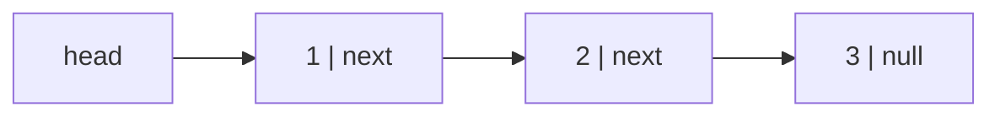

An LRU cache has to move any element to the front of the recency order in O(1) and evict from the back in O(1). An array cannot do the first: moving an element from the middle to the front shifts everything in between. A hash map cannot do the second: it has no notion of "back". The structure that does both is a doubly linked list, and it is the reason every LRU implementation, from Redis to your CDN, contains one.

A linked list trades the array's contiguous memory for a chain of separately allocated nodes, each pointing at the next. That trade buys O(1) insertion and removal *at a position you already hold*, and it costs O(n) access by index and a cache miss per node. Understanding exactly what is bought and what is paid is the whole topic.

## Nodes and pointers

A singly linked list is a chain of nodes; each node holds a value and a reference to the next node, and the last node's reference is null. The list itself is just a reference to the first node, the head.

```python
class ListNode:
    def __init__(self, val=0, next=None):
        self.val = val
        self.next = next

head = ListNode(1, ListNode(2, ListNode(3)))     # 1 → 2 → 3 → None
```



Every operation is pointer surgery. To insert `x` after node `p`: create the node, point it at `p.next`, then point `p` at it. The order of those two assignments matters; do them backwards and you lose the rest of the list.

```python
def insert_after(p, x):
    node = ListNode(x)
    node.next = p.next      # 1. new node points at the old successor
    p.next = node           # 2. p points at the new node
```

To delete the node after `p`: `p.next = p.next.next`. The removed node is unreachable and (in a garbage-collected language) collected; in C or Rust you free it or let ownership drop it.

Both operations are O(1) *given `p`*. Finding `p` in the first place is O(n), by walking from the head. That qualifier is the source of every misleading claim about linked lists: "O(1) insertion" is true only when you already hold a pointer to the neighbour.

## Singly vs doubly linked

A doubly linked node also holds `prev`. It doubles the pointer overhead and buys two things: you can walk backwards, and you can delete a node given only a pointer to *that node* (not its predecessor), because you can reach `prev` from it.

```python
def unlink(node):            # doubly linked, node is not a sentinel
    node.prev.next = node.next
    node.next.prev = node.prev
```

That O(1) unlink-by-handle is exactly what the LRU cache needs: the hash map stores a pointer to the node, a hit unlinks it and re-inserts it at the front, and eviction unlinks the tail. Singly linked lists cannot do this without a predecessor pointer, which means an O(n) walk.

| | Singly | Doubly |
|---|---|---|
| Memory per node | value + 1 pointer | value + 2 pointers |
| Insert after a node | O(1) | O(1) |
| Delete a node given only the node | O(n) (need predecessor) | O(1) |
| Insert before a node | O(n) | O(1) |
| Walk backwards | No | Yes |
| Typical use | Stacks, hash chains, immutable/persistent lists, interview problems | Deques, LRU, intrusive kernel lists, text editor buffers |

## Sentinels: deleting the edge cases

Most bugs in linked-list code are the special cases: the empty list, inserting at the head, deleting the head, the single-node list. Each needs an `if head is None` or `if p is head` branch, and each branch is a place to be wrong.

A **sentinel** (dummy) node removes them. Allocate one node that is never a real element and make it the permanent head. Now every real node has a predecessor, so "insert at the front" and "delete the first node" become the ordinary "insert after `p`" and "delete after `p`" with `p = sentinel`.

Delete every node with value `v`, without a sentinel:

```python
def delete_value(head, v):
    while head is not None and head.val == v:     # special case: new head
        head = head.next
    p = head
    while p is not None and p.next is not None:
        if p.next.val == v:
            p.next = p.next.next
        else:
            p = p.next
    return head
```

With a sentinel:

```python
def delete_value(head, v):
    sentinel = ListNode(0, head)
    p = sentinel
    while p.next is not None:
        if p.next.val == v:
            p.next = p.next.next
        else:
            p = p.next
    return sentinel.next
```

One loop, no special case, and the function returns `sentinel.next`, which is the correct head whether or not the original head was deleted. Use a sentinel in any function that builds or edits a list; the cost is one allocation.

A doubly linked list usually uses *two* sentinels (head and tail) or one circular sentinel whose `next` is the first element and whose `prev` is the last. With that layout, `unlink` never touches a null pointer, and the empty list is the sentinel pointing at itself. This is the Linux kernel's `struct list_head` design and the layout inside most LRU implementations.

## Walking the list

```viz
{"type": "linked-list", "algorithm": "traverse", "values": [4, 8, 15, 16, 23, 42], "title": "Traversal: one pointer dereference per node"}
```

Traversal is the operation that makes lists slow in practice. Each `p = p.next` reads a pointer to a node that could be anywhere on the heap. On a modern CPU a cache miss costs roughly 100 ns; an array walk pays that once per 16 elements (one 64-byte line of 4-byte ints) and gets prefetched, while a list walk pays it once per node with no prefetching possible, because the address of the next node is not known until the current one arrives.

Bjarne Stroustrup's often-cited experiment makes the point: insert random integers into a sorted sequence, keeping it sorted, using a vector (O(n) shifts per insert) and a list (O(1) insert after an O(n) search). The vector wins at every size tested, by a widening margin, because the list's search is a chain of cache misses while the vector's shift is a `memmove` at bandwidth speed. The complexity analysis says the list should win; the memory hierarchy says otherwise. [Space complexity and the memory hierarchy](/learn/foundations/complexity/space-complexity-and-memory-hierarchy) has the numbers.

The honest rule: **a linked list is only the right choice when you hold pointers to positions and need O(1) splice/unlink at those positions, or when elements must never move in memory.** If you are going to search for the position anyway, use an array.

## What a node costs

The per-node overhead is easy to underestimate. Storing a million 32-bit integers:

| Representation | Bytes per element (order of magnitude) | Total |
|---|---|---|
| Rust `Vec<i32>` / C array | 4 | 4 MB |
| Python `array('i')` | 4 | 4 MB |
| Python `list` of ints | 8 (pointer) + 28 (int object) | ~36 MB |
| Rust `LinkedList<i32>` | 4 + 16 (two pointers) + allocator padding | ~24–32 MB |
| Python singly linked `ListNode` with `__slots__` | ~56 (node) + 28 (int) + 8 | ~90 MB |
| Python `ListNode` without `__slots__` | node + a per-instance `__dict__` | well over 100 MB |

Two orders of magnitude between the array and the naive Python list of nodes, before counting the cache misses. When a linked list is the right structure, keep the nodes small (use `__slots__` in Python; store the value inline in Rust) and be aware that a million nodes is a million separate allocations for the garbage collector or allocator to track.

## Where linked lists actually win

- **LRU and LFU caches.** Hash map for lookup, doubly linked list for recency order. O(1) get, put and evict. [LRU cache](/learn/advanced-data-structures/caches-and-eviction/lru-cache) builds it; [LRU Cache](/practice/lru-cache) is the interview problem.
- **Memory allocators.** A free list is a linked list threaded *through the free blocks themselves*: the node storage is the free memory, so the list costs nothing. `malloc` implementations keep free lists per size class.
- **Intrusive lists in kernels and runtimes.** The `next`/`prev` pointers live inside the object (a process, a socket, a timer), so an object can be on several lists at once and unlinked from any of them in O(1) without allocation. Linux's `list_head`, Go's runtime scheduler queues.
- **Deques with stable addresses.** Python's `collections.deque` is a doubly linked list of 64-element blocks: O(1) at both ends, and cache-friendly within a block. Rust's `LinkedList` exists but the documentation itself tells you `VecDeque` is almost always better.
- **Hash table chains.** Each bucket in a chaining table is a short singly linked list; [Hash tables](/learn/data-structures/hashing/hash-tables) covers it and why modern tables avoid it.
- **Persistent (immutable) lists.** In functional languages, prepending to a list shares the entire tail with the old version in O(1). Undo history and version trees exploit the same sharing.
- **Lock-free queues.** Michael–Scott queues and similar structures rely on single-pointer atomic updates that arrays cannot offer.

What these share: the list is never searched by index; positions are reached through some other structure (a hash map, the object itself, a block pointer), and the list provides O(1) splicing at those positions.

## Building lists correctly in interviews

The interview representation is `ListNode(val, next)`; the platform's test harness builds `{"$list": [1, 2, 3]}` into real nodes and converts your returned head back into a list of values. Three habits that prevent most bugs:

1. **Draw it.** Three boxes and arrows on the whiteboard before writing code. Every pointer assignment should correspond to redrawing one arrow.
2. **Use a sentinel when you build or edit.** Return `sentinel.next`.
3. **Trace the boundaries.** Empty list, one node, two nodes, and the last node. If the loop condition is `while p.next`, ask what happens when `p` is the last node; if it is `while p`, ask what happens when you need `p.next`.

The insertion visualiser below inserts into a sorted list; watch how the "find the predecessor" walk is the O(n) part and the splice is two pointer writes.

```viz
{"type": "linked-list", "algorithm": "insert-sorted", "values": [2, 5, 9, 14], "target": 7, "title": "Insert into a sorted list: O(n) to find the spot, O(1) to splice"}
```

## Exercises

```exercise
id: insert-sorted
title: Insert into a sorted linked list
prompt: |
  `head` is the head of a singly linked list sorted in non-decreasing order
  (possibly empty, passed as `None`/`null`). Insert a new node with value
  `value` so the list stays sorted, and return the new head. Insert after
  any existing equal values. Use a sentinel node so that inserting at the
  front needs no special case.

  Nodes are `ListNode(val, next)`; the harness defines the class.
languages: [python, javascript]
entry: insert_sorted
starter:
  python: |
    def insert_sorted(head, value):
        # your code here
        return head
  javascript: |
    function insert_sorted(head, value) {
      // your code here
      return head;
    }
tests:
  - args: [{"$list": [1, 3, 5]}, 4]
    expected: {"$list": [1, 3, 4, 5]}
  - args: [{"$list": []}, 2]
    expected: {"$list": [2]}
    label: empty list
  - args: [{"$list": [2, 4]}, 1]
    expected: {"$list": [1, 2, 4]}
    label: insert at the front
  - args: [{"$list": [1, 2]}, 3]
    expected: {"$list": [1, 2, 3]}
    label: insert at the end
  - args: [{"$list": [5]}, 5]
    expected: {"$list": [5, 5]}
    hidden: true
    label: equal value goes after
  - args: [{"$list": [1, 1, 1]}, 0]
    expected: {"$list": [0, 1, 1, 1]}
    hidden: true
hints:
  - "Create `sentinel = ListNode(0, head)`; walk `p` from the sentinel while `p.next` exists and `p.next.val <= value`."
  - "Splice: `node.next = p.next; p.next = node`; return `sentinel.next`."
```

```exercise
id: delete-value
title: Delete every node with a given value
prompt: |
  Remove every node whose value equals `value` from the singly linked list
  and return the new head. The list is non-empty and at least one node
  survives. Use a sentinel so that deleting the head needs no special case.
languages: [python, javascript]
entry: delete_value
starter:
  python: |
    def delete_value(head, value):
        # your code here
        return head
  javascript: |
    function delete_value(head, value) {
      // your code here
      return head;
    }
tests:
  - args: [{"$list": [1, 2, 6, 3, 4, 5, 6]}, 6]
    expected: {"$list": [1, 2, 3, 4, 5]}
  - args: [{"$list": [1, 2, 3]}, 4]
    expected: {"$list": [1, 2, 3]}
    label: value absent
  - args: [{"$list": [1, 1, 2]}, 1]
    expected: {"$list": [2]}
    label: head deleted twice
  - args: [{"$list": [2, 1, 1]}, 1]
    expected: {"$list": [2]}
    hidden: true
    label: tail deleted
  - args: [{"$list": [3, 3, 3, 7, 3]}, 3]
    expected: {"$list": [7]}
    hidden: true
hints:
  - "With `p` starting at the sentinel: if `p.next.val == value`, bypass it (`p.next = p.next.next`) and do not advance `p`; otherwise advance."
```

## Senior signals

- You say "O(1) insertion *given a pointer to the position*" and know that finding the position is O(n).
- You explain the cache-miss-per-node cost and that arrays beat lists even for middle insertion at most sizes.
- You use sentinel nodes by default and can show how they remove the head/empty special cases.
- You can name the systems where lists genuinely win (LRU, allocators, intrusive kernel lists, deques of blocks) and what they have in common.
- You know why a doubly linked list is required for O(1) unlink-by-handle and why LRU needs exactly that.
- You draw the pointers before writing the code and trace empty, single and last-node cases explicitly.

## Check yourself

```quiz
- q: >-
    An engineer argues for a linked list over an array "because inserting in the middle is O(1)". What is the strongest objection?
  options: ["Arrays can also insert in the middle in O(1) amortised using spare capacity", "Linked lists must copy the tail on insert to keep their nodes contiguous", "It is O(1) only given the predecessor, and finding that is an O(n) walk", "Linked lists use more memory per node, which outweighs any insert gain"]
  answer: 2
  explanation: >-
    The O(1) claim hides the O(n) search. Because each node is a separate allocation, that search is a chain of cache misses, while an array's shift is a fast memmove, so in practice arrays win even for middle insertion. Memory overhead is real but secondary. The list wins only when positions are reached without searching.
- q: >-
    Why does an LRU cache need a doubly linked list rather than a singly linked one?
  options: ["To iterate entries from most to least recent when the cache is listed", "To unlink a node found via the map in O(1), without finding its predecessor", "To store both key and value, since a singly linked node holds one field", "To save memory, since each node's prev pointer replaces a map entry"]
  answer: 1
  explanation: >-
    On a cache hit, the map gives you the node itself. Unlinking it requires updating the predecessor's next pointer, which only a `prev` pointer makes O(1). A singly linked list would need an O(n) walk to find the predecessor. Backward iteration is a side benefit, and the extra pointer costs memory rather than saving it.
- q: >-
    What does a sentinel (dummy) head node buy you?
  options: ["Faster traversal, since the loop can skip the null check at each node", "Fewer allocations, since the first real element is stored in the sentinel", "Every real node has a predecessor, so head edits need no special case", "Protection against cycles, since a walk stops when it reaches the sentinel"]
  answer: 2
  explanation: >-
    Sentinels remove special cases, not complexity. With a dummy node before the first element, head insertion and deletion are ordinary "after p" operations, and the function returns sentinel.next. The sentinel costs one extra allocation and does not change traversal speed.
- q: >-
    In `insert_after(p, x)`, what goes wrong if you write `p.next = node` before `node.next = p.next`?
  options: ["The new node points at itself, and the rest of the list is lost", "The new node ends up before p instead of after it in the list", "p is unlinked, since its successor is overwritten before being saved", "Nothing, since both assignments complete before the list is read"]
  answer: 0
  explanation: >-
    After `p.next = node`, the old successor is only reachable via the value you overwrote. `node.next = p.next` then sets node.next to node itself, creating a self-loop and making the tail unreachable. p itself stays in place; it is everything after it that is lost. Pointer assignment order is the whole game.
- q: >-
    A memory allocator keeps its free blocks in a linked list. Where do the list's nodes live?
  options: ["In a hash table keyed by block address, for O(1) lookup on free()", "In a separate array allocated at startup, one slot per block", "Inside the free blocks themselves, so they cost no extra memory", "On the allocator's stack, since free blocks are reused last-in first-out"]
  answer: 2
  explanation: >-
    Free memory is by definition unused, so the allocator writes the next pointer into the block's first bytes. This intrusive layout is why linked lists are natural for allocators and kernel structures: the node is the object, and a separate array or table would itself need allocating.
```
