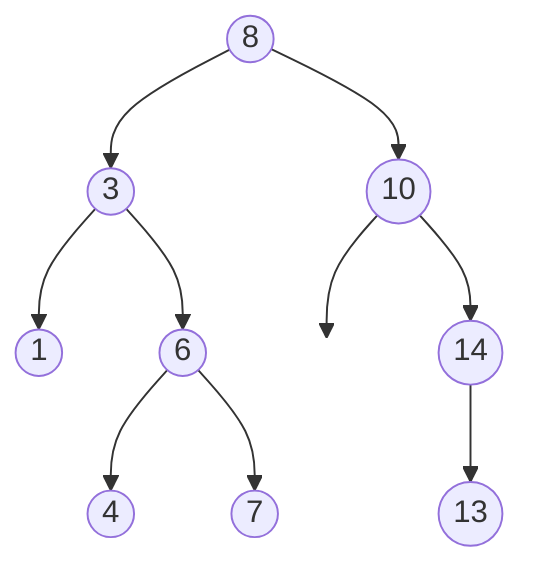

You have a million records and need to find one by key. A sorted array finds it in 20 comparisons but costs half a million shifts on average to insert a new record. A linked list inserts in O(1) but walks half a million nodes to find anything. Every structure you have met so far forces a choice: cheap search or cheap update, never both.

A tree escapes the trade-off by giving each node more than one successor. Start at the root, and each step down discards a whole subtree instead of a single element. If the tree is balanced, twenty steps get you from a million nodes to one. Search, insert and delete all become "walk one path from root to leaf", and the length of that path, the height, is the number that decides whether the tree is fast or useless.

## What a tree is

A tree is a set of nodes with one distinguished **root**, where every node except the root has exactly one **parent** and any number of **children**. There are no cycles: follow parent pointers from any node and you reach the root. Nodes with no children are **leaves**; every other node is **internal**. A tree with n nodes has exactly n − 1 edges, one per non-root node.

A **binary tree** restricts each node to at most two children, left and right, and the order matters: a node with only a left child is a different tree from a node with only a right child. Almost every interview question is about binary trees; general (n-ary) trees get their own lesson at the end of the module.



Terms you must be able to use precisely, because interviewers use them precisely:

| Term | Definition | In the tree above |
|---|---|---|
| Depth of a node | Number of edges from the root to the node | depth(6) = 2, depth(8) = 0 |
| Height of a node | Number of edges on the longest downward path from the node to a leaf | height(6) = 1, height(1) = 0 |
| Height of the tree | Height of the root | 3 (8 → 3 → 6 → 4) |
| Size | Number of nodes | 9 |
| Level | All nodes at the same depth | Level 2 is {1, 6, 14} |
| Subtree rooted at x | x and all of its descendants | Subtree at 3 is {3, 1, 6, 4, 7} |
| Complete tree | Every level full except the last, which is filled left to right | Not complete: level 2 has a gap under 10 |
| Perfect tree | Every level full; 2^(h+1) − 1 nodes | Not perfect |

Two conventions to pin down before you write code. First, this lesson counts height in **edges**, so a single node has height 0 and the empty tree has height −1. Some books count nodes, giving 1 and 0; say which you are using, because the base case of your recursion changes with it. Second, "depth" is measured from the top and "height" from the bottom; a node's depth plus its height is at most the tree's height, with equality only on a longest path.

## Why height is the number that matters

Every operation that walks a single root-to-leaf path costs O(height). For a tree of n nodes, height ranges between two extremes:

- **Minimum, ⌊log₂ n⌋.** A tree where every level is full except possibly the last. A million nodes fit in height 19, because 2^20 − 1 = 1,048,575.
- **Maximum, n − 1.** Every node has exactly one child: a linked list wearing a tree costume. A million nodes, height 999,999.

The gap between 19 and 999,999 is the entire story of the rest of this module. [Binary search trees](/learn/data-structures/trees/binary-search-trees) are O(log n) only if the height stays logarithmic; [balanced trees](/learn/data-structures/trees/balanced-trees) exist to guarantee it. When an interviewer asks "what is the complexity of search in a BST?", the answer is "O(h), which is O(log n) if it is balanced and O(n) if it is not"; anything shorter is a mid-level answer.

The visualiser computes height bottom-up. Watch how each node's height is 1 plus the larger of its children's heights, and how the leaves anchor the recursion at 0.

```viz
{"type": "tree", "algorithm": "height", "values": [8, 3, 10, 1, 6, 14, 4, 7, 13],
 "title": "Height computed bottom-up", "caption": "Values are inserted in BST order. Each node's height is 1 + max(height(left), height(right)); a missing child contributes -1."}
```

## Recursion on trees

A binary tree is either empty, or a node with a left subtree and a right subtree, and those subtrees are themselves binary trees. Because the definition is recursive, algorithms on trees are recursive by default, and the pattern is always the same:

1. **Base case:** the empty tree. Return the answer for nothing (0 for size, −1 for height in edges, `True` for "is balanced").
2. **Recursive calls:** solve the left and right subtrees. Trust that the calls return correct answers; do not trace into them while designing.
3. **Combine:** compute this node's answer from its value and the two sub-answers.

```python
def size(node):
    if node is None:
        return 0
    return 1 + size(node.left) + size(node.right)

def height(node):
    if node is None:
        return -1
    return 1 + max(height(node.left), height(node.right))
```

The step people skip is defining the **contract** of the recursive function in one sentence before writing it: "`height(node)` returns the number of edges on the longest path from `node` down to a leaf, or −1 if `node` is None." If you can state the contract, the combine step writes itself. If you cannot, you end up with a function that half-returns and half-mutates a global, and the interviewer notices.

### Hand trace: `height` on the nine-node tree

Calls are numbered in the order they start. "Depth" is the number of `height` frames alive at that moment, counting the call itself. Ten calls receive `None`, one per missing child (a tree with n nodes has n + 1 null child pointers), and each returns −1 at once; a node's return is 1 + max of its two children's returns.

| Call | Argument | Depth | Returns |
|---|---|---|---|
| 1 | 8 | 1 | 3 = 1 + max(2, 2) |
| 2 | 3 | 2 | 2 = 1 + max(0, 1) |
| 3 | 1 | 3 | 0 |
| 4, 5 | None (1.left), None (1.right) | 4 | −1, −1 |
| 6 | 6 | 3 | 1 = 1 + max(0, 0) |
| 7 | 4 | 4 | 0 |
| 8, 9 | None (4.left), None (4.right) | **5** | −1, −1 |
| 10 | 7 | 4 | 0 |
| 11, 12 | None (7.left), None (7.right) | 5 | −1, −1 |
| 13 | 10 | 2 | 2 = 1 + max(−1, 1) |
| 14 | None (10.left) | 3 | −1 |
| 15 | 14 | 3 | 1 = 1 + max(0, −1) |
| 16 | 13 | 4 | 0 |
| 17, 18 | None (13.left), None (13.right) | 5 | −1, −1 |
| 19 | None (14.right) | 4 | −1 |

At call 8 the stack is at its deepest, five frames: `height(8)` → `height(3)` → `height(6)` → `height(4)` → `height(None)`. That is the tree height (3) plus 2: one frame for the root and one for the null probe below the deepest leaf. Calls return in the order 4, 5, 3, 8, 9, 7, 11, 12, 10, 6, 2, 14, 17, 18, 16, 19, 15, 13, 1, a post-order walk. Nineteen calls for nine nodes: 2n + 1, because every node makes two calls and the root is called once.

### Hand trace: `size` on the same tree

The call order is identical; only the combine rule differs.

| Node | Left returns | Right returns | Returns |
|---|---|---|---|
| 1 | 0 | 0 | 1 |
| 4 | 0 | 0 | 1 |
| 7 | 0 | 0 | 1 |
| 6 | 1 | 1 | 3 |
| 3 | 1 | 3 | 5 |
| 13 | 0 | 0 | 1 |
| 14 | 1 | 0 | 2 |
| 10 | 0 | 2 | 3 |
| 8 | 5 | 3 | 9 |

Both functions are O(n) time (every node and every null pointer visited once) and O(h) space (never more than h + 2 frames). If your hand trace disagrees with the tables, the usual slip is forgetting that a node with one child still makes a `None` call for the other side.

## Four ways to store a tree

### Linked nodes

The default. Each node is an object with a value and child pointers.

```python
class BTNode:
    __slots__ = ("val", "left", "right")
    def __init__(self, val, left=None, right=None):
        self.val, self.left, self.right = val, left, right
```

```typescript
interface BTNode<T> { val: T; left: BTNode<T> | null; right: BTNode<T> | null }
```

Some structures add a **parent pointer**. It makes "walk up to the root" and in-order successor O(1) amortised, at the cost of a third pointer that must be kept consistent on every rotation. The red-black trees behind C++ `std::map` and Java `TreeMap` keep one; interview code rarely needs it.

### What a node costs, measured

The CPython figures were measured on CPython 3.14.7 by allocating 100,000 nodes under `tracemalloc`; they include the 28-byte `int` payload each node holds and the 8-byte list slot that keeps it alive. The Java and Rust figures follow from those runtimes' layout rules.

| Node layout | Bytes per node | Arithmetic |
|---|---|---|
| CPython class with `__slots__` | ~96 measured | `sys.getsizeof` reports 56 for the object (16-byte header + 3 × 8-byte slots + GC bookkeeping) + 28-byte int + 8-byte reference to it |
| CPython plain class | ~136 measured | 48-byte object plus the attribute values that 3.13+ embeds in the instance itself (3.11 and 3.12 kept them in a separate values array); reading `node.__dict__` even once materialises a 296-byte dict on this version |
| Java `int val; Node left, right` | 24 | 12-byte header (compressed class pointers, the default; JDK 25's opt-in `-XX:+UseCompactObjectHeaders` makes it 8) + 4 + 4 + 4 with compressed oops (heaps under 32 GB); a boxed `Integer` adds a 4-byte reference and a separate 16-byte object |
| Rust `struct { val: i32, left: Option<Box<Node>>, right: Option<Box<Node>> }` | 24 | `Option<Box<T>>` is 8 bytes because the null pointer is used as `None`; 4 + 8 + 8 = 20, padded to the 8-byte alignment |
| Rust arena `struct { val: i32, left: u32, right: u32 }` in a `Vec<Node>` | 12 | Indices instead of pointers, `u32::MAX` meaning "no child"; one contiguous allocation for the whole tree |

So a million-node tree costs about 12 MB in a Rust arena, 24 MB as boxed Rust or Java nodes, and 100–140 MB in CPython, before allocator rounding (glibc adds an 8-byte chunk header and rounds to 16 bytes; pymalloc uses 16-byte size classes).

The arena row is why systems code avoids pointer-linked nodes even when the language has them: one allocation instead of a million, nodes packed together so a subtree fits in fewer cache lines, and no borrow-checker fight over who owns a node that two references reach. The costs: a deleted node leaves a hole (keep a free list), and an index means nothing without its arena.

### Arrays in level order

Number the nodes level by level, left to right, starting at 0. For node i:

- left child is at 2i + 1
- right child is at 2i + 2
- parent is at (i − 1) // 2

```text
index:  0  1   2  3  4   5   6
value:  8  3  10  1  6   -  14
```

No pointers at all; the structure is implicit in the indices. This is perfect for **complete** trees, because there are no gaps and the whole tree is one contiguous block. [Binary heaps](/learn/data-structures/heaps/binary-heap-mechanics) are stored this way: the top four levels of a heap of 8-byte values occupy 15 × 8 = 120 bytes, two cache lines.

For a sparse tree it is terrible, and the arithmetic says why. The slot index of a node at depth d is at least 2^d − 1, however few nodes exist at that depth. A path of 21 nodes leaning left needs index 2^20 − 1, so an array of 2^20 = 1,048,576 slots; leaning right it needs about 2^21. In CPython a list of 2^20 `None` references measures 8,388,664 bytes: 8 MiB to hold 21 values. Waste grows exponentially in depth, not linearly in size.

The test harness on this platform uses a related encoding: a level-order list with `null` for missing children, where the children of a `null` are not listed at all. That is the LeetCode convention, compact for sparse trees because nothing is allocated below a null. `[8, 3, 10, 1, 6, null, 14, null, null, 4, 7, 13]` encodes the tree above in 12 entries. Decoding it is a queue walk:

```python
def build_tree(values):
    if not values or values[0] is None:
        return None
    root = BTNode(values[0])
    queue, i = [root], 1
    head = 0
    while head < len(queue) and i < len(values):
        node = queue[head]; head += 1          # head index, not pop(0): pop(0) is O(n)
        if values[i] is not None:
            node.left = BTNode(values[i]); queue.append(node.left)
        i += 1
        if i < len(values) and values[i] is not None:
            node.right = BTNode(values[i]); queue.append(node.right)
        i += 1
    return root
```

### Parent arrays

For general trees, especially ones read from a file or database, the most common representation is a **parent array**: `parent[i]` is the index of node i's parent, and the root's parent is −1. Four bytes per node with 32-bit indices, serialisable as-is, and validated in one pass (exactly one −1, and following parents from every node must terminate). Going *down* the tree requires inverting the array into children lists first, one O(n) pass:

```python
def children_lists(parent):
    children = [[] for _ in parent]
    root = -1
    for i, p in enumerate(parent):
        if p == -1:
            root = i
        else:
            children[p].append(i)
    return root, children
```

This is also how most SQL schemas store hierarchies (`manager_id`, `parent_category_id`). Turning that column into a traversable tree is a routine task that many engineers get quadratic, by scanning the whole row set for "rows whose parent is me" once per node: n scans of n rows is n², which for a 2-million-row org chart is 4 × 10^12 comparisons.

### Left-child, right-sibling

A general tree with any fan-out can be stored with exactly two pointers per node: `first_child` and `next_sibling`. A node's children form a linked list threaded through the sibling pointers, and the whole structure is a binary tree in disguise (`first_child` is left, `next_sibling` is right). Adding a child is O(1) at the front of the sibling list; finding the k-th child is O(k). The Linux kernel's `task_struct` keeps the process tree with the same idea, using doubly linked `children` and `sibling` list heads so a process unlinks from its parent in O(1) on exit.

### Trade-offs across representations

| Representation | Memory per node | Cache behaviour on a root-to-leaf walk | Insert a leaf | Parent lookup | Serialisable as-is |
|---|---|---|---|---|---|
| Linked nodes | value + 2 pointers + object header (24 B Java/Rust, ~96 B CPython) | One likely miss per hop; nodes scattered by allocation order | O(1) once you hold the parent | Only with a third pointer | No: pointers are meaningless outside the process |
| Implicit level-order array | 1 slot per position, including empty positions (2^(h+1) − 1 slots) | Top levels share cache lines; children of i are adjacent | O(1) if the slot exists; impossible without reallocating past the end | O(1) arithmetic | Yes, if the tree is near-complete |
| Parent array | 1 index (4 B) | Upward walks are index reads; downward walks need the inverted lists | O(1) append | O(1) | Yes, and validation is one pass |
| Left-child, right-sibling | 2 pointers | Sibling list is a linked-list walk | O(1) at the front | Only with a third pointer | No |
| Arena with indices | value + 2 indices (12 B with u32) | Insertion-order locality; a subtree built together sits together | O(1) push | Only with a third index | Yes: the `Vec` is the wire format |

## Under the hood: what a pointer hop costs

A pointer-linked tree turns every step down into a dependent load: the CPU cannot fetch the child until it has read the parent's pointer. If the child's cache line is not in cache, that load waits for DRAM, on the order of 100 ns on current server hardware (it depends on the memory controller and on NUMA distance; L3 hits are 10–40 ns, L1 about 1 ns). See [space complexity and the memory hierarchy](/learn/foundations/complexity/space-complexity-and-memory-hierarchy) for the full ladder.

Work the arithmetic for a balanced tree of a million 24-byte nodes. The top 12 levels hold 2^12 − 1 = 4,095 nodes, about 100 KB, which stays resident in L2 across repeated lookups. The remaining 8 levels are a different node on every lookup, so a lookup costs roughly 8 DRAM misses, about 0.8 µs. A degenerate 20-node path costs the same 20 hops: the scattering of nodes across the heap, not the shape, is what makes a linked tree slow.

A binary search over a sorted array of a million 4-byte ints has the same 20 probes, with two differences. The first k probe positions are the same for every search (the middle, then a quarter point, and so on), so the first 12 levels are 4,095 addresses that stay cached; and once the interval is under 16 ints it sits inside one 64-byte line, so the last four probes are free. Roughly 4 to 5 DRAM misses against the tree's 8. A B-tree with 64-byte nodes of 15 keys needs log₁₆(10^6) ≈ 5 node visits, of which perhaps three miss. These estimates are why ordered structures on disk and most in memory fan out more than 2, and why the [balanced trees](/learn/data-structures/trees/balanced-trees) lesson ends with B-trees.

## The recursion depth problem

Each recursive call is a stack frame, and the recursion goes as deep as the tree is tall (plus two, as the trace showed): about 22 frames on a balanced tree of a million nodes, a million frames on a degenerate one, and no default configuration survives the latter.

### The limits, with the numbers

- **CPython** stops at `sys.getrecursionlimit()`, 1,000 by default. Measured on 3.14.7: `height` from this lesson survives a chain of 998 nodes and raises `RecursionError` at 999, because the chain's frames plus the caller reach the limit. `sys.setrecursionlimit(10**6)` lifts it, and `height` on a 200,000-node chain then completed without a crash. That is safe because since 3.11 a Python-to-Python call no longer consumes C stack (the interpreter runs the callee's frame inline), so the limit counts Python frames rather than standing in for the 8 MiB C stack. The C stack still bites recursion that passes through C: on 3.14.7, `json.loads` of a 2,000-deep nested array succeeds, and a 100,000-deep one raises `RecursionError: Stack overflow (used 8148 kB) while decoding a JSON array`.
- **Native code** (C, C++, Rust) gets the thread's stack: 8 MiB for the main thread on Linux by default (`ulimit -s`), which at 100–200 bytes per small frame is on the order of 50,000–100,000 frames. Threads you create yourself often get less.
- **HotSpot JVM** gives each thread 1 MiB on x86-64 Linux by default (`-Xss`; 2 MiB on AArch64), on the order of 10^4 frames of a small method before `StackOverflowError`; the count depends on the frame size the JIT produces.
- **Node.js / V8** reserves 984 KB of stack for JavaScript by default, on the order of 10^4 frames of a simple function before `RangeError: Maximum call stack size exceeded`; raising `--stack-size` far above the default can crash the process instead, because the OS stack is not enlarged with it.

See [the call stack](/learn/foundations/how-code-runs/stack-heap-and-the-call-stack) for what a frame holds and why the stack has a limit at all.

### Where deep trees come from in production

A 100,000-deep tree does not come from a test fixture; it comes from data with an order. Sorted inserts into a naive binary search tree build a chain, so the first sorted export (auto-increment IDs, timestamps, log lines) turns a 20-deep tree into a 100,000-deep one. A deeply nested JSON or XML document from a client or a fuzzer is a tree whose height the sender chooses. The symptom is always the same: a service that has run for months dies on one request with a stack trace a thousand frames long.

### The fix: an explicit stack

Move the frames from the call stack to a heap-allocated list, which is bounded by available memory rather than by a fixed-size thread stack.

```python
def height_iter(root):
    if root is None:
        return -1
    best = -1
    stack = [(root, 0)]                 # (node, depth): the frame's only state
    while stack:
        node, d = stack.pop()
        best = max(best, d)
        if node.left:  stack.append((node.left, d + 1))
        if node.right: stack.append((node.right, d + 1))
    return best
```

This version computed the height of a one-million-node chain (999,999) on the same interpreter that failed at 999 recursively. It uses O(h) heap for the stack, a million tuples for the chain, about 70 MB in CPython: a cost you can see and cap, unlike a C stack overflow. Converting `size` is the same edit; functions whose combine step needs both children's results need the post-order machinery in the [traversals lesson](/learn/data-structures/trees/binary-tree-traversals). The senior habit is to ask "how tall can this tree be, and who controls that?" before choosing recursion.

## Complexity of the basics

| Operation | Cost | Why |
|---|---|---|
| Size, height, sum, count leaves | O(n) time, O(h) stack | Every node visited once; stack depth is the height |
| Find a value (unordered tree) | O(n) | No ordering, so nothing can be pruned |
| Walk root to a given leaf | O(h) | One path |
| Build from a level-order array | O(n) | One queue pass |
| Invert a parent array into children lists | O(n) | One pass with append |
| Compare two trees for equality | O(min(n₁, n₂)) | Stops at the first mismatch |

Note the space column: recursion costs O(h) memory even when it allocates nothing, and a level-order queue holds up to the widest level, n/2 nodes in a complete tree.

## Trees you already use

- **File systems and the DOM.** Directories are internal nodes and files leaves; `du` is a bottom-up size recursion, path resolution a top-down walk. Browser layout is a bottom-up size pass followed by a top-down position pass.
- **Syntax trees.** Every compiler pass is a tree recursion, which is why compilers are a classic source of stack overflows on machine-generated code with thousands of nested parentheses.
- **Database indexes.** B-trees: search trees with hundreds of children per node so the height stays at 3 or 4 for billions of rows.
- **JSON.** A nested object *is* a tree; serialisation is a preorder traversal, and the parser's recursion depth is chosen by whoever sends the document.
- **Build systems.** A graph of 10^5 targets is a DAG, but each target's closure is walked as a tree, and "size of the closure" is the `size` recursion with memoisation.

When a problem says "hierarchy", "nested", "contains" or "parent", model it as a tree and the recursion pattern falls out.

## Production failure modes

| Symptom | Diagnosis | Fix |
|---|---|---|
| `RecursionError`, `StackOverflowError` or a segfault on one request after months of clean operation; hundreds of identical frames in the trace | The height is data-controlled and this input was tall: a sorted batch into an unbalanced BST, a nested document from a client. Confirm with the iterative `height_iter` | Explicit stack; a depth cap on parsers fed by external input; a balanced tree if the shape comes from inserts |
| Building a hierarchy from a `parent_id` table takes minutes and grows with the square of the row count | Per-node "find my children" scans, or one query per node (2 million round trips at ~1 ms is 33 minutes) | Load once, build children lists in one O(n) pass, then traverse |
| Memory explodes for a small tree stored in a level-order array (8 MiB for a 21-node path) | Implicit layout on a sparse or skewed tree; slot count is 2^(h+1) − 1, not n | Linked nodes, an arena, or the null-terminated level-order encoding for storage |
| "Is balanced" or "diameter" is O(n²) and times out on a 10^5-node tree | `height` called from inside a recursion that visits every node, so each node recomputes its subtree's height | Compute height and the property in one post-order pass, returning both ([tree recursion patterns](/learn/data-structures/trees/tree-recursion-patterns)) |
| A Rust or C++ program crashes on drop of a long list-shaped tree although no user code recursed | The default destructor is recursive: dropping a node drops its child, which drops its child | An iterative `Drop` that detaches children onto a stack and drops them one by one |

## Interviewer follow-ups

**"Your `height` is recursive. What happens on a tree of 10^6 nodes?"** Model answer: it depends on the height, not the size; a balanced tree needs about 22 frames, a chain needs 10^6 and overflows CPython's 1,000 limit, the JVM's 1 MiB stack and Node's default. Fix: an explicit stack of (node, depth) pairs, then ask why the tree is a chain. Common wrong answer: "10^6 nodes is fine because O(n) is fast", which confuses time with stack depth.

**"How much memory does a million-node tree take in your language?"** Model answer with the arithmetic: 24 bytes per node in Java with compressed oops (12-byte header + 3 × 4) or in boxed Rust, so 24 MB; around 100 MB in CPython because every node is an object with a header and every value a boxed int; 12 MB in an arena with 32-bit indices. Common wrong answer: "three words per node", forgetting the header and the separately allocated values.

**"Why are heaps stored in arrays but general binary trees are not?"** Model answer: a heap is complete, so the level-order array has no gaps; a general tree of height h needs 2^(h+1) − 1 slots however few nodes it has, so a 21-node path needs about a million. Common wrong answer: "arrays are faster", without the completeness condition.

**"You are given `parent_id` for 2 million rows. How do you compute each node's subtree size?"** Model answer: one pass to build children lists, then one post-order pass (iterative if the hierarchy might be deep) accumulating sizes into the parent; O(n) total. In the database, a recursive CTE, never one query per node. Common wrong answer: recursion from the root that searches the row set for children at every node, O(n²).

## What mid-level engineers get wrong

- **Saying O(log n) for a single-path operation.** The correct claim is O(h); the log only follows from balance, and the interviewer is waiting for you to say what guarantees it.
- **Patching off-by-ones instead of choosing a convention.** A height function with base case 0 counts nodes; calling it "height in edges" makes every answer one too large.
- **Recursing on data whose shape a client controls.** A parser or tree walker that works on fixtures and overflows on the first deeply nested document is the most common tree-related outage.
- **Ignoring per-node memory.** Building a 50-million-node tree of Python objects (5 GB at ~100 bytes each) when a parent array (200 MB) would answer the question.
- **Calling `height` inside a per-node recursion.** `abs(height(l) - height(r)) <= 1 and balanced(l) and balanced(r)` is O(n log n) on a balanced tree and O(n²) on a chain.
- **Using `list.pop(0)` as a queue.** It memmoves every remaining reference, O(n), so a level-order build becomes O(n²); use a head index or `collections.deque`.

## Exercises

```exercise
id: tree-size-and-height
title: Size and height from a level-order array
prompt: |
  Given a binary tree as a **level-order list** with `null` for missing
  children (the LeetCode convention: `[1, 2, 3, null, 4]` is a root 1 with
  children 2 and 3, and 2 has only a right child 4), return `[size, height]`.

  Height counts **edges**: a single node has height 0 and the empty tree
  (empty list) has height -1.

  The starter includes `build_tree`, which decodes the list into linked
  `BTNode` objects; write the recursion on the nodes.
languages: [python, javascript]
entry: tree_stats
starter:
  python: |
    class BTNode:
        def __init__(self, val):
            self.val, self.left, self.right = val, None, None

    def build_tree(values):
        if not values or values[0] is None:
            return None
        root = BTNode(values[0])
        queue, head, i = [root], 0, 1
        while head < len(queue) and i < len(values):
            node = queue[head]; head += 1
            if values[i] is not None:
                node.left = BTNode(values[i]); queue.append(node.left)
            i += 1
            if i < len(values) and values[i] is not None:
                node.right = BTNode(values[i]); queue.append(node.right)
            i += 1
        return root

    def tree_stats(values):
        root = build_tree(values)
        # return [size, height]
        return [0, -1]
  javascript: |
    class BTNode {
      constructor(val) { this.val = val; this.left = null; this.right = null; }
    }

    function build_tree(values) {
      if (!values.length || values[0] === null) return null;
      const root = new BTNode(values[0]);
      const queue = [root];
      let head = 0, i = 1;
      while (head < queue.length && i < values.length) {
        const node = queue[head++];
        if (values[i] !== null && values[i] !== undefined) { node.left = new BTNode(values[i]); queue.push(node.left); }
        i++;
        if (i < values.length && values[i] !== null) { node.right = new BTNode(values[i]); queue.push(node.right); }
        i++;
      }
      return root;
    }

    function tree_stats(values) {
      const root = build_tree(values);
      // return [size, height]
      return [0, -1];
    }
tests:
  - args: [[1, 2, 3, 4, 5]]
    expected: [5, 2]
  - args: [[]]
    expected: [0, -1]
    label: empty tree
  - args: [[1]]
    expected: [1, 0]
    label: single node
  - args: [[1, null, 2, null, 3]]
    expected: [3, 2]
    label: degenerate right chain
  - args: [[5, 3, 8, 1, 4, null, 9, null, 2]]
    expected: [7, 3]
    hidden: true
hints:
  - "Write two separate recursive functions with one-sentence contracts: size(node) and height(node)."
  - "The base case for height is -1 so that a leaf computes 1 + max(-1, -1) = 0."
```

```exercise
id: count-leaves
title: Count the leaves
prompt: |
  Given a binary tree as a level-order list with `null` gaps (same encoding
  as the previous exercise), return the number of **leaves**: nodes with no
  children. The empty tree has zero leaves; a single node is one leaf.

  `build_tree` and `BTNode` are provided again.
languages: [python, javascript]
entry: count_leaves
starter:
  python: |
    class BTNode:
        def __init__(self, val):
            self.val, self.left, self.right = val, None, None

    def build_tree(values):
        if not values or values[0] is None:
            return None
        root = BTNode(values[0])
        queue, head, i = [root], 0, 1
        while head < len(queue) and i < len(values):
            node = queue[head]; head += 1
            if values[i] is not None:
                node.left = BTNode(values[i]); queue.append(node.left)
            i += 1
            if i < len(values) and values[i] is not None:
                node.right = BTNode(values[i]); queue.append(node.right)
            i += 1
        return root

    def count_leaves(values):
        root = build_tree(values)
        return 0
  javascript: |
    class BTNode {
      constructor(val) { this.val = val; this.left = null; this.right = null; }
    }

    function build_tree(values) {
      if (!values.length || values[0] === null) return null;
      const root = new BTNode(values[0]);
      const queue = [root];
      let head = 0, i = 1;
      while (head < queue.length && i < values.length) {
        const node = queue[head++];
        if (values[i] !== null && values[i] !== undefined) { node.left = new BTNode(values[i]); queue.push(node.left); }
        i++;
        if (i < values.length && values[i] !== null) { node.right = new BTNode(values[i]); queue.push(node.right); }
        i++;
      }
      return root;
    }

    function count_leaves(values) {
      const root = build_tree(values);
      return 0;
    }
tests:
  - args: [[1, 2, 3, 4, 5]]
    expected: 3
  - args: [[]]
    expected: 0
    label: empty tree
  - args: [[1]]
    expected: 1
    label: root is a leaf
  - args: [[1, null, 2, null, 3]]
    expected: 1
    label: chain has one leaf
  - args: [[5, 3, 8, 1, 4, null, 9, null, 2]]
    expected: 3
    hidden: true
hints:
  - "A node is a leaf when both children are None; that is a second base case, checked before recursing."
  - "leaves(None) = 0, leaves(leaf) = 1, otherwise leaves(left) + leaves(right)."
```

## Senior signals

- You say **O(h)**, not O(log n), for any single-path operation, and immediately add what keeps h logarithmic.
- You count height in a stated unit (edges or nodes) and pick base cases (−1 or 0) to match, instead of patching off-by-one errors afterwards.
- You state the **contract** of a recursive function in one sentence before writing its body, and you write the combine step from the contract.
- You can trace a recursion's call order and say how deep the stack gets (h + 2 frames for `height`, 2n + 1 calls in total).
- You ask how deep the tree can get, and who controls that, before choosing recursion; you know CPython's 1,000-frame default, the 8 MiB Linux stack and the JVM's 1 MiB thread stack, and you convert to an explicit stack when the answer is "the client decides".
- You give memory per node with the arithmetic (24 bytes in Java with compressed oops or boxed Rust, ~100 in CPython, 12 in an arena) and you know why systems code uses arenas.
- You explain a linked tree's slowness as one DRAM miss per hop below the cached top levels, not as "pointers are slow".
- You know the level-order array layout is perfect for complete trees (heaps) and exponential waste for sparse ones.
- You recognise hierarchies in a schema (`parent_id`) as trees and build the children index in one pass rather than querying per node.

## Check yourself

```quiz
- q: >-
    A binary tree has 1,023 nodes. What are the minimum and maximum possible heights, counting edges?
  options: ["9 and 511", "9 and 1,022", "10 and 1,023", "10 and 1,022"]
  answer: 1
  explanation: >-
    A perfect binary tree with 1,023 = 2^10 - 1 nodes has 10 levels, so its height is 9 edges. The maximum is a chain, where every node has one child: 1,022 edges. "10 and 1,023" counts nodes, not edges.
- q: >-
    Your height() function returns 0 for an empty tree and 1 + max(left, right) otherwise. What does it compute?
  options: ["Depth of the shallowest leaf, counted in nodes", "Height in edges on the longest root-to-leaf path", "Size of the tree, counting the root as 1", "Height in nodes on the longest root-to-leaf path"]
  answer: 3
  explanation: >-
    With base case 0, a single node returns 1, so the function counts nodes on the longest path. To count edges the base case must be -1, so a leaf returns 1 + max(-1, -1) = 0. Both are valid conventions; mixing them is the bug.
- q: >-
    Running the recursive height() on the nine-node tree from the lesson, how many frames are on the stack at its deepest point, and how many calls are made in total?
  options: ["9 frames and 19 calls, one per live node", "4 frames and 18 calls, two per node", "5 frames and 19 calls, two per node plus one", "3 frames and 9 calls, one per node"]
  answer: 2
  explanation: >-
    The deepest moment is height(8) -> height(3) -> height(6) -> height(4) -> height(None): the height (3) plus one frame for the root and one for the null probe below the deepest leaf. Every node makes two calls (one per child pointer, including null ones) and the root is called once, giving 2n + 1 = 19. Frames are never one per node: only the current path is alive.
- q: >-
    Why is the level-order array (children of i at 2i+1 and 2i+2) a poor choice for a general binary tree?
  options: ["Index arithmetic is slower than following a child pointer", "Finding a node's parent requires an O(n) scan of the array", "Sparse or skewed trees waste exponentially many slots", "Inserting a node shifts every later index, costing O(n)"]
  answer: 2
  explanation: >-
    The slot for a node at depth d is at least 2^d - 1, regardless of how many nodes exist at that depth, so a 21-node path needs about a million slots (8 MiB of references in CPython). Nothing shifts on insert (a new child fills slot 2i+1 or 2i+2) and the parent is at (i-1)//2, so the layout is ideal for complete trees, which is why heaps use it.
- q: >-
    A recursive size() on a tree of 500,000 nodes throws RecursionError in Python but works on a different 500,000-node tree. The most likely explanation is:
  options: ["The first tree has more leaves, so more frames are live at once", "The first tree's nodes are larger, so each frame costs more", "The first tree is far taller, so recursion depth passes the limit", "The first tree is wider, so the stack must hold a whole level"]
  answer: 2
  explanation: >-
    Recursion depth equals tree height, not size, leaf count or width. A balanced tree of 500,000 nodes is about 19 deep; a degenerate chain is 499,999 deep, far past CPython's default limit of 1,000. Width matters for a BFS queue, not for the recursion stack. The fix is an explicit stack or guaranteeing balance.
- q: >-
    A Java tree node holds an int and two child references. With the JVM defaults (compressed class pointers and compressed oops), about how much heap does a million-node tree use, ignoring allocator rounding?
  options: ["About 100 MB, since each node is an object plus a boxed value", "About 24 MB, since each node is a 12-byte header plus three 4-byte fields", "About 40 MB, since each node is a 16-byte header plus three 8-byte fields", "About 12 MB, since each node is three 4-byte fields and nothing else"]
  answer: 1
  explanation: >-
    The HotSpot object header is 12 bytes with compressed class pointers, and with compressed oops each reference is 4 bytes, so 12 + 4 + 4 + 4 = 24 bytes per node and 24 MB for a million. Twelve bytes per node is the arena-with-u32-indices figure, which has no header. The 100 MB figure is the CPython cost, where the value is a separate boxed object.
```
