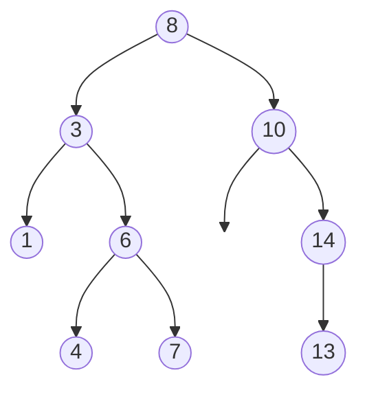

You have a million records and need to find one by key. A sorted array finds it in 20 comparisons but costs half a million shifts to insert a new record. A linked list inserts in O(1) but has to walk half a million nodes to find anything. Every structure you have met so far forces you to pick: cheap search or cheap update, never both.

A tree escapes the trade-off by giving each node more than one successor. Start at the root, and each step down discards a whole subtree instead of a single element. If the tree is balanced, twenty steps get you from a million nodes to one. Search, insert and delete all become "walk one path from root to leaf", and the length of that path, the height, is the number that decides whether the tree is fast or useless.

## What a tree is

A tree is a set of nodes with one distinguished **root**, where every node except the root has exactly one **parent** and any number of **children**. There are no cycles: follow parent pointers from any node and you reach the root. Nodes with no children are **leaves**; every other node is **internal**.

A **binary tree** restricts each node to at most two children, called left and right, and the order matters: a node with only a left child is a different tree from a node with only a right child. Almost every interview question is about binary trees; general (n-ary) trees get their own lesson at the end of the module.



Terms you must be able to use precisely, because interviewers use them precisely:

| Term | Definition | In the tree above |
|---|---|---|
| Depth of a node | Number of edges from the root to the node | depth(6) = 2, depth(8) = 0 |
| Height of a node | Number of edges on the longest downward path from the node to a leaf | height(6) = 1, height(1) = 0 |
| Height of the tree | Height of the root | 3 (8 → 3 → 6 → 4) |
| Size | Number of nodes | 9 |
| Level | All nodes at the same depth | Level 2 is {1, 6, 14} |
| Subtree rooted at x | x and all of its descendants | Subtree at 3 is {3, 1, 6, 4, 7} |

Two conventions to pin down before you write code. First, this lesson counts height in **edges**, so a single node has height 0 and the empty tree has height −1. Some books count nodes, giving 1 and 0; both are fine, but say which you are using. Second, "depth" is measured from the top and "height" from the bottom. A node's depth plus its height is at most the tree's height, with equality only on the longest path.

## Why height is the number that matters

Every operation that walks a single root-to-leaf path costs O(height). For a tree of `n` nodes, height ranges between two extremes:

- **Minimum, ⌊log₂ n⌋.** A tree where every level is full except possibly the last. A million nodes fit in height 19.
- **Maximum, n − 1.** Every node has exactly one child: a linked list wearing a tree costume. A million nodes, height 999,999.

The gap between 19 and 999,999 is the entire story of the rest of this module. [Binary search trees](/learn/data-structures/trees/binary-search-trees) are O(log n) only if the height stays logarithmic; [balanced trees](/learn/data-structures/trees/balanced-trees) exist to guarantee it. When an interviewer asks "what is the complexity of search in a BST?", the answer is "O(h), which is O(log n) if it is balanced and O(n) if it is not"; anything shorter is a mid-level answer.

The visualiser computes height bottom-up. Watch how each node's height is 1 plus the larger of its children's heights, and how the leaves anchor the recursion at 0.

```viz
{"type": "tree", "algorithm": "height", "values": [8, 3, 10, 1, 6, 14, 4, 7, 13],
 "title": "Height computed bottom-up", "caption": "Values are inserted in BST order. Each node's height is 1 + max(height(left), height(right)); a missing child contributes -1."}
```

## Three ways to store a tree

### Linked nodes

The default. Each node is an object with a value and child pointers.

```python
class BTNode:
    __slots__ = ("val", "left", "right")
    def __init__(self, val, left=None, right=None):
        self.val, self.left, self.right = val, left, right
```

```typescript
interface BTNode<T> { val: T; left: BTNode<T> | null; right: BTNode<T> | null }
```

Memory per node is the value plus two pointers plus object overhead: in CPython about 56 bytes for a `__slots__` node holding a small int, in Rust `Option<Box<Node>>` is 8 bytes per pointer plus the value. The nodes are scattered across the heap, so walking a path touches one cache line per node; that is why a million-node tree is measurably slower per step than a binary search over a million-element array, even though both are O(log n).

Some structures add a **parent pointer**. It makes "walk up to the root" and in-order successor O(1) amortised, at the cost of a third pointer and the burden of keeping it consistent on every rotation. Red-black tree implementations in C++ and Java keep parent pointers; most interview code does not need them.

### Arrays in level order

Number the nodes level by level, left to right, starting at 0. For node `i`:

- left child is at `2i + 1`
- right child is at `2i + 2`
- parent is at `(i − 1) // 2`

```text
index:  0  1   2  3  4   5   6
value:  8  3  10  1  6   -  14
```

No pointers at all; the structure is implicit in the indices. This is perfect for **complete** trees, ones where every level is full except the last, which is filled left to right, because there are no gaps. [Binary heaps](/learn/data-structures/heaps/binary-heap-mechanics) are stored exactly this way and gain enormous cache locality from it. For a sparse tree it is terrible: a degenerate tree of 20 nodes needs an array of 2²⁰ slots.

The test harness on this platform uses a related encoding for tree arguments: a level-order list with `null` for missing children, where the children of a present node come next in the list and the children of a `null` are simply not listed. That is the LeetCode convention, and it is compact for sparse trees because it never allocates slots below a null. `[8, 3, 10, 1, 6, null, 14, null, null, 4, 7, 13]` encodes the tree above. Decoding it is a queue walk:

```python
def build_tree(values):
    if not values or values[0] is None:
        return None
    root = BTNode(values[0])
    queue, i = [root], 1
    head = 0
    while head < len(queue) and i < len(values):
        node = queue[head]; head += 1
        if values[i] is not None:
            node.left = BTNode(values[i]); queue.append(node.left)
        i += 1
        if i < len(values) and values[i] is not None:
            node.right = BTNode(values[i]); queue.append(node.right)
        i += 1
    return root
```

### Parent arrays and adjacency lists

For general trees, especially ones read from a file or database, the most common representation is a **parent array**: `parent[i]` is the index of node `i`'s parent, and the root's parent is −1. Six integers describe a six-node tree. Going *down* the tree requires inverting the array into a children list first, which is an O(n) pass. This is also how most SQL schemas store hierarchies (`manager_id`, `parent_category_id`), and turning that column into a traversable tree in memory is a routine task that a surprising number of engineers get quadratic.

## Recursion on trees

A binary tree is either empty, or a node with a left subtree and a right subtree, and those subtrees are themselves binary trees. Because the definition is recursive, algorithms on trees are recursive by default, and the pattern is always the same:

1. **Base case:** the empty tree. Return the answer for nothing (0 for size, −1 for height in edges, `True` for "is balanced").
2. **Recursive calls:** solve the left and right subtrees. Trust that the calls return correct answers; do not trace into them.
3. **Combine:** compute this node's answer from its value and the two sub-answers.

```python
def size(node):
    if node is None:
        return 0
    return 1 + size(node.left) + size(node.right)

def height(node):
    if node is None:
        return -1
    return 1 + max(height(node.left), height(node.right))
```

Trace `height` on the tree above. `height(4)` and `height(7)` are leaves, so their children return −1 and they return 0. `height(6)` = 1 + max(0, 0) = 1. `height(1)` = 0. `height(3)` = 1 + max(0, 1) = 2. On the right, `height(13)` = 0, `height(14)` = 1, `height(10)` = 1 + max(−1, 1) = 2. `height(8)` = 1 + max(2, 2) = 3. Nine calls that do real work, nine more that hit the base case; O(n) total.

The step people skip is defining the **contract** of the recursive function in one sentence before writing it: "`height(node)` returns the number of edges on the longest path from `node` down to a leaf, or −1 if `node` is None." If you can state the contract, the combine step writes itself. If you cannot, you will end up with a function that half-returns and half-mutates a global, and the interviewer will notice.

### The recursion depth problem

Each recursive call is a stack frame, and the recursion goes as deep as the tree is tall. On a balanced tree of a million nodes that is 20 frames. On a degenerate tree it is a million frames, and CPython's default limit is 1,000; Node's is around 10,000; a native thread stack of 8 MiB gives C or Rust perhaps 100,000 frames of a small function. A tree built by inserting sorted input into a naive BST *is* degenerate, and it is a classic production failure: works on test data, crashes with `RecursionError` on the first sorted export.

The fix is an explicit stack, which is the subject of the [traversals](/learn/data-structures/trees/binary-tree-traversals) lesson. The senior habit is to ask "how tall can this tree be?" before choosing recursion.

## Complexity of the basics

| Operation | Cost | Why |
|---|---|---|
| Size, height, sum, count leaves | O(n) time, O(h) stack | Every node visited once; stack depth is the height |
| Find a value (unordered tree) | O(n) | No ordering, so nothing can be pruned |
| Walk root to a given leaf | O(h) | One path |
| Build from a level-order array | O(n) | One queue pass |
| Compare two trees for equality | O(min(n₁, n₂)) | Stops at the first mismatch |

Note the space column. Recursion is not free even when it allocates nothing: the call stack is O(h) memory, and for a level-order walk with a queue the queue holds up to the widest level, which can be n/2 nodes in a complete tree.

## Trees you already use

- **File systems.** Directories are internal nodes, files are leaves, `du` is a bottom-up size recursion, path resolution is a top-down walk.
- **The DOM.** Every browser page is an n-ary tree; `querySelector` is a traversal with a predicate, and layout is a bottom-up size computation followed by a top-down position computation.
- **Syntax trees.** Compilers parse source into a tree and every pass (type checking, optimisation, codegen) is a tree recursion.
- **Database indexes.** B-trees, which are search trees with hundreds of children per node so the height stays at 3 or 4 for billions of rows.
- **JSON.** A nested object *is* a tree; serialisation is a preorder traversal.

When a problem has "hierarchy", "nested", "contains" or "parent" in its description, model it as a tree and the recursion pattern falls out.

## Exercises

```exercise
id: tree-size-and-height
title: Size and height from a level-order array
prompt: |
  Given a binary tree as a **level-order list** with `null` for missing
  children (the LeetCode convention: `[1, 2, 3, null, 4]` is a root 1 with
  children 2 and 3, and 2 has only a right child 4), return `[size, height]`.

  Height counts **edges**: a single node has height 0 and the empty tree
  (empty list) has height -1.

  The starter includes `build_tree`, which decodes the list into linked
  `BTNode` objects; write the recursion on the nodes.
languages: [python, javascript]
entry: tree_stats
starter:
  python: |
    class BTNode:
        def __init__(self, val):
            self.val, self.left, self.right = val, None, None

    def build_tree(values):
        if not values or values[0] is None:
            return None
        root = BTNode(values[0])
        queue, head, i = [root], 0, 1
        while head < len(queue) and i < len(values):
            node = queue[head]; head += 1
            if values[i] is not None:
                node.left = BTNode(values[i]); queue.append(node.left)
            i += 1
            if i < len(values) and values[i] is not None:
                node.right = BTNode(values[i]); queue.append(node.right)
            i += 1
        return root

    def tree_stats(values):
        root = build_tree(values)
        # return [size, height]
        return [0, -1]
  javascript: |
    class BTNode {
      constructor(val) { this.val = val; this.left = null; this.right = null; }
    }

    function build_tree(values) {
      if (!values.length || values[0] === null) return null;
      const root = new BTNode(values[0]);
      const queue = [root];
      let head = 0, i = 1;
      while (head < queue.length && i < values.length) {
        const node = queue[head++];
        if (values[i] !== null && values[i] !== undefined) { node.left = new BTNode(values[i]); queue.push(node.left); }
        i++;
        if (i < values.length && values[i] !== null) { node.right = new BTNode(values[i]); queue.push(node.right); }
        i++;
      }
      return root;
    }

    function tree_stats(values) {
      const root = build_tree(values);
      // return [size, height]
      return [0, -1];
    }
tests:
  - args: [[1, 2, 3, 4, 5]]
    expected: [5, 2]
  - args: [[]]
    expected: [0, -1]
    label: empty tree
  - args: [[1]]
    expected: [1, 0]
    label: single node
  - args: [[1, null, 2, null, 3]]
    expected: [3, 2]
    label: degenerate right chain
  - args: [[5, 3, 8, 1, 4, null, 9, null, 2]]
    expected: [7, 3]
    hidden: true
hints:
  - "Write two separate recursive functions with one-sentence contracts: size(node) and height(node)."
  - "The base case for height is -1 so that a leaf computes 1 + max(-1, -1) = 0."
```

```exercise
id: count-leaves
title: Count the leaves
prompt: |
  Given a binary tree as a level-order list with `null` gaps (same encoding
  as the previous exercise), return the number of **leaves**: nodes with no
  children. The empty tree has zero leaves; a single node is one leaf.

  `build_tree` and `BTNode` are provided again.
languages: [python, javascript]
entry: count_leaves
starter:
  python: |
    class BTNode:
        def __init__(self, val):
            self.val, self.left, self.right = val, None, None

    def build_tree(values):
        if not values or values[0] is None:
            return None
        root = BTNode(values[0])
        queue, head, i = [root], 0, 1
        while head < len(queue) and i < len(values):
            node = queue[head]; head += 1
            if values[i] is not None:
                node.left = BTNode(values[i]); queue.append(node.left)
            i += 1
            if i < len(values) and values[i] is not None:
                node.right = BTNode(values[i]); queue.append(node.right)
            i += 1
        return root

    def count_leaves(values):
        root = build_tree(values)
        return 0
  javascript: |
    class BTNode {
      constructor(val) { this.val = val; this.left = null; this.right = null; }
    }

    function build_tree(values) {
      if (!values.length || values[0] === null) return null;
      const root = new BTNode(values[0]);
      const queue = [root];
      let head = 0, i = 1;
      while (head < queue.length && i < values.length) {
        const node = queue[head++];
        if (values[i] !== null && values[i] !== undefined) { node.left = new BTNode(values[i]); queue.push(node.left); }
        i++;
        if (i < values.length && values[i] !== null) { node.right = new BTNode(values[i]); queue.push(node.right); }
        i++;
      }
      return root;
    }

    function count_leaves(values) {
      const root = build_tree(values);
      return 0;
    }
tests:
  - args: [[1, 2, 3, 4, 5]]
    expected: 3
  - args: [[]]
    expected: 0
    label: empty tree
  - args: [[1]]
    expected: 1
    label: root is a leaf
  - args: [[1, null, 2, null, 3]]
    expected: 1
    label: chain has one leaf
  - args: [[5, 3, 8, 1, 4, null, 9, null, 2]]
    expected: 3
    hidden: true
hints:
  - "A node is a leaf when both children are None; that is a second base case, checked before recursing."
  - "leaves(None) = 0, leaves(leaf) = 1, otherwise leaves(left) + leaves(right)."
```

## Senior signals

- You say **O(h)**, not O(log n), for any single-path operation, and immediately add what keeps h logarithmic.
- You count height in a stated unit (edges or nodes) and pick base cases (−1 or 0) to match, instead of patching off-by-one errors afterwards.
- You state the **contract** of a recursive function in one sentence before writing its body, and you write the combine step from the contract.
- You ask how deep the tree can get before choosing recursion, and you can convert to an explicit stack when the answer is "very".
- You know the level-order array layout and why it is perfect for complete trees (heaps) and terrible for sparse ones.
- You recognise hierarchies in a schema (`parent_id`) as trees and build the children index in one pass rather than querying per node.

## Check yourself

```quiz
- q: >-
    A binary tree has 1,023 nodes. What are the minimum and maximum possible heights, counting edges?
  options: ["9 and 511", "9 and 1,022", "10 and 1,023", "10 and 1,022"]
  answer: 1
  explanation: >-
    A perfect binary tree with 1,023 = 2^10 - 1 nodes has 10 levels, so its height is 9 edges. The maximum is a chain, where every node has one child: 1,022 edges. "10 and 1,023" counts nodes, not edges.
- q: >-
    Your height() function returns 0 for an empty tree and 1 + max(left, right) otherwise. What does it compute?
  options: ["Depth of the shallowest leaf, counted in nodes", "Height in edges on the longest root-to-leaf path", "Size of the tree, counting the root as 1", "Height in nodes on the longest root-to-leaf path"]
  answer: 3
  explanation: >-
    With base case 0, a single node returns 1, so the function counts nodes on the longest path. To count edges the base case must be -1, so a leaf returns 1 + max(-1, -1) = 0. Both are valid conventions; mixing them is the bug.
- q: >-
    Why is the level-order array (children of i at 2i+1 and 2i+2) a poor choice for a general binary tree?
  options: ["Index arithmetic is slower than following a child pointer", "Finding a node's parent requires an O(n) scan of the array", "Sparse or skewed trees waste exponentially many slots", "Inserting a node shifts every later index, costing O(n)"]
  answer: 2
  explanation: >-
    The slot for a node at depth d is around 2^d, regardless of how many nodes actually exist at that depth. A 20-node chain needs about a million slots. Nothing shifts on insert (a new child just fills slot 2i+1 or 2i+2) and the parent is at (i-1)//2, so the layout is ideal for complete trees, which is why heaps use it.
- q: >-
    A recursive size() on a tree of 500,000 nodes throws RecursionError in Python but works on a different 500,000-node tree. The most likely explanation is:
  options: ["The first tree has more leaves, so more frames are live at once", "The first tree's nodes are larger, so each frame costs more", "The first tree is far taller, so recursion depth passes the limit", "The first tree is wider, so the stack must hold a whole level"]
  answer: 2
  explanation: >-
    Recursion depth equals tree height, not size, leaf count or width. A balanced tree of 500,000 nodes is about 19 deep; a degenerate chain is 499,999 deep, far past CPython's limit of 1,000. Width matters for a BFS queue, not for the recursion stack. The fix is an explicit stack or guaranteeing balance.
- q: >-
    You have a table of 2 million rows with a parent_id column and need to compute each node's subtree size. The efficient approach is:
  options: ["Load rows into a level-order array and sum each index's subtree", "Query each node's descendants with a recursive SQL CTE", "Build a children list in one pass, then one bottom-up pass", "Sort rows by parent_id, then binary-search each node's children"]
  answer: 2
  explanation: >-
    One O(n) pass turns the parent array into adjacency lists; one O(n) bottom-up (or reverse-topological) pass computes sizes. Per-node queries are O(n) round trips each; sorting plus searching is O(n log n) and still needs the traversal; a level-order array wastes exponential space on a sparse hierarchy.
```
