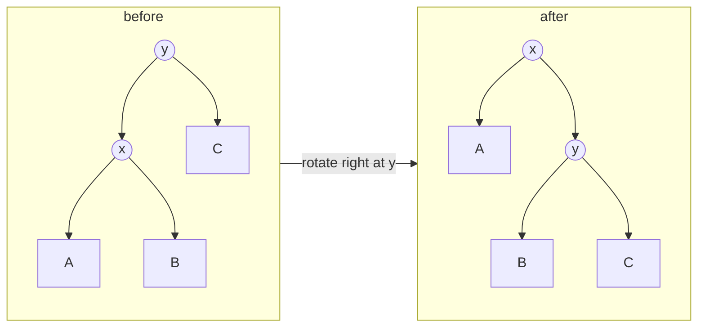

The [previous lesson](/learn/data-structures/trees/binary-search-trees) ended with a BST that turned into a chain because keys arrived in order. Every guarantee the BST offered was conditional on height staying logarithmic, and nothing enforced the condition. A balanced tree is a BST plus a rule that bounds the height, plus a repair mechanism, the rotation, that restores the rule after each insert or delete in O(log n). The rule and the repair are the difference between a data structure and a hope.

## Balance as a promise about height

A perfectly balanced tree of n nodes has height ⌊log₂ n⌋ (in edges, the convention from the [fundamentals lesson](/learn/data-structures/trees/tree-fundamentals)), but insisting on perfection is too expensive: inserting one key into a perfect tree can require rebuilding most of it. Practical balanced trees relax the condition enough that repairs stay local:

| Scheme | Rule | Height bound | Repairs per insert |
|---|---|---|---|
| AVL | Heights of the two children differ by at most 1, at every node | ≤ 1.44 log₂(n + 2) − 0.33 | At most 1 rotation (a double counts as one composite) |
| Red-black | No red node has a red child; every root-to-null path has the same number of black nodes | ≤ 2 log₂(n + 1) | At most 2 rotations, plus recolouring |
| B-tree (order m) | Every node except the root has ⌈m/2⌉ − 1 to m − 1 keys; all leaves at the same depth | ≤ log₍⌈m/2⌉₎((n + 1)/2) | Splits instead of rotations |

### The numbers for a million keys

| Shape | Height (edges) | Where it comes from |
|---|---|---|
| Perfect | 19 | ⌊log₂ 10⁶⌋; 2²⁰ − 1 = 1,048,575 nodes fit in 20 levels |
| AVL, worst case | 27 | The bound gives 28.4; the sparsest AVL tree of height 28 (a Fibonacci tree) needs 1,346,268 nodes |
| Red-black, worst case | 39 | 2 log₂(10⁶ + 1) = 39.86 |
| Plain BST, random order | ~49 for one measured shuffle | The [BST lesson's](/learn/data-structures/trees/binary-search-trees) simulation |
| Plain BST, sorted input | 999,999 | A chain |

Each level costs a dependent load: the CPU cannot fetch the child until it has read the parent's pointer, and a node that is not cached waits for DRAM, on the order of 100 ns on current servers. The top levels stay cached because every lookup passes through them: about 12 levels (4,095 nodes, a few hundred KB) fit in L2 or L3, so the likely misses are roughly height − 12: about 7 for a perfect tree, 15 for the worst AVL, 27 for the worst red-black, and a million loads for the chain. The figures depend on cache sizes, node size and allocation locality; the ordering does not.

## The rotation

A rotation is a local rewiring of three pointers that changes which of two adjacent nodes is on top, without changing the inorder sequence. Given `y` with left child `x`, a **right rotation** makes `x` the parent of `y`:



Inorder before: A x B y C. Inorder after: A x B y C. The subtree B moves from x's right to y's left, which keeps it between x and y in both pictures. A left rotation is the mirror image.

```python
def rotate_right(y):
    x = y.left
    y.left = x.right       # B moves across
    x.right = y
    update_height(y)       # y is now lower, fix it first
    update_height(x)
    return x               # new subtree root

def rotate_left(x):
    y = x.right
    x.right = y.left
    y.left = x
    update_height(x)
    update_height(y)
    return y
```

On `30(20(10, 25), 40)`, rotating right at 30 writes `30.left = 25` (B moves across), `20.right = 30`, and the parent's pointer becomes 20 through the returned value: `20(10, 30(25, 40))`, inorder 10 20 25 30 40 before and after. The height updates run child-first because 20's new height depends on 30's. Three pointer writes, O(1); the rest of balanced-tree maintenance is deciding *where* and *which way* to rotate.

## AVL trees

Each node stores its height (or the balance factor, `height(left) − height(right)`). After a normal BST insert, walk back up the insertion path recomputing heights. The first node whose balance factor becomes +2 or −2 is where the tree is fixed, and there are four cases, determined by which grandchild direction the new key went:

| Case | Shape | Balance factors | Fix |
|---|---|---|---|
| Left-Left | Inserted into left child's left subtree | node +2, left child +1 (or 0 on delete) | Rotate right at node |
| Right-Right | Inserted into right child's right subtree | node −2, right child −1 | Rotate left at node |
| Left-Right | Inserted into left child's right subtree | node +2, left child −1 | Rotate left at left child, then right at node |
| Right-Left | Inserted into right child's left subtree | node −2, right child +1 | Rotate right at right child, then left at node |

```python
def avl_insert(node, key):
    if node is None:
        return AVLNode(key)
    if key < node.val:
        node.left = avl_insert(node.left, key)
    elif key > node.val:
        node.right = avl_insert(node.right, key)
    else:
        return node
    update_height(node)
    bf = balance(node)
    if bf > 1 and key < node.left.val:      # LL
        return rotate_right(node)
    if bf < -1 and key > node.right.val:    # RR
        return rotate_left(node)
    if bf > 1 and key > node.left.val:      # LR
        node.left = rotate_left(node.left)
        return rotate_right(node)
    if bf < -1 and key < node.right.val:    # RL
        node.right = rotate_right(node.right)
        return rotate_left(node)
    return node
```

### The four cases on three keys

Balance factors are written as superscripts; the third insert is the one that breaks the rule.

| Case | Insert order | Before the fix | Rotation(s) | After |
|---|---|---|---|---|
| LL | 30, 20, 10 | `30⁺²(20⁺¹(10⁰, ·), ·)` | right at 30 | `20⁰(10⁰, 30⁰)` |
| RR | 10, 20, 30 | `10⁻²(·, 20⁻¹(·, 30⁰))` | left at 10 | `20⁰(10⁰, 30⁰)` |
| LR | 30, 10, 20 | `30⁺²(10⁻¹(·, 20⁰), ·)` | left at 10 gives `30⁺²(20⁺¹(10, ·), ·)`; then right at 30 | `20⁰(10⁰, 30⁰)` |
| RL | 10, 30, 20 | `10⁻²(·, 30⁺¹(20⁰, ·))` | right at 30 gives `10⁻²(·, 20⁻¹(·, 30))`; then left at 10 | `20⁰(10⁰, 30⁰)` |

The tell for a zig-zag is the sign flip: the unbalanced node and its heavy child have balance factors of opposite sign. A single rotation on a zig-zag leaves the mirror-image imbalance; the first rotation of the double exists to make the signs agree.

### Hand trace: 10, 20, 30, 40, 50, 25

Heights and balance factors after each insert, computed bottom-up, and the rotation that fired.

| Insert | Tree after | Heights / balance factors | Rebalance |
|---|---|---|---|
| 10 | `10` | 10: h0 bf0 | none |
| 20 | `10(·, 20)` | 20: h0 0; 10: h1 −1 | none |
| 30 | `20(10, 30)` | 10, 30: h0 0; 20: h1 0 | 10 reached −2, key went right-right: RR, rotate left at 10 |
| 40 | `20(10, 30(·, 40))` | 40: h0 0; 30: h1 −1; 10: h0 0; 20: h2 −1 | none |
| 50 | `20(10, 40(30, 50))` | 30, 50: h0 0; 40: h1 0; 20: h2 −1 | 30 reached −2: RR, rotate left at 30 |
| 25 | `30(20(10, 25), 40(·, 50))` | 10, 25: h0 0; 20: h1 0; 50: h0 0; 40: h1 −1; 30: h2 0 | 20 reached −2 with right child 40 at +1: RL, rotate right at 40, then left at 20 |

The last step in slow motion. After attaching 25 under 30 the tree is `20(10, 40(30(25, ·), 50))`, with heights 25: 0, 30: 1, 50: 0, 40: 2, 10: 0, 20: 3, so bf(30) = +1, bf(40) = +1 and bf(20) = −2: a zig-zag. Rotating right at 40 gives `20(10, 30(25, 40(·, 50)))`, a straight line with bf(30) now −1; rotating left at 20 lifts 30: `30(20(10, 25), 40(·, 50))`, preorder 30 20 10 25 40 50, height 2.

```viz
{"type": "tree", "algorithm": "avl-insert", "values": [10, 20, 30, 40, 50, 25],
 "title": "Two single rotations and one double", "caption": "Inserting 25 makes node 20 right-heavy by 2 while its right child leans left: the zig-zag. The first rotation straightens the line, the second lifts the middle key."}
```

The classic input, 1 through 7 in order, is four RR cases: rotate left at 1 after inserting 3, at 3 after 5, at 2 after 6 and at 5 after 7, ending in the perfect tree `4(2(1, 3), 6(5, 7))`. Sorted input costs about one rotation per insert (99,983 for 100,000 sorted keys, measured with the code above) and never more.

```viz
{"type": "tree", "algorithm": "avl-insert", "values": [1, 2, 3, 4, 5, 6, 7],
 "title": "AVL insertion of sorted keys", "caption": "Watch the balance factor reach -2 at a node and the left rotation lift its right child. The chain never gets longer than two edges."}
```

### Why one rotation per insert is enough

Before the insert of 25, the subtree at 20 had height 2. The insert made it 3, which is the only reason 20 became unbalanced. After the double rotation the subtree (now rooted at 30) has height 2 again, so every ancestor sees the height it saw before the insert, no balance factor above has changed, and the walk up can stop. The same holds in all four cases: the fix at the lowest unbalanced node restores that subtree's pre-insert height, which is why `avl_insert` returns straight after rotating and why an insert is O(log n) for the descent plus O(1) for the fix.

### Deletion can cascade

Removing a node can shorten a subtree by one, a rotation that repairs the parent can shorten it by one more, and a shorter subtree is exactly what unbalances the next ancestor. Take the sparsest AVL tree of height 4, the 12-node Fibonacci tree `8(5(3(2(1, ·), 4), 7(6, ·)), 11(10(9, ·), 12))`, in which every node has balance factor +1, and delete the leaf 12:

| Step | Node checked | Balance factor | Action | Subtree height |
|---|---|---|---|---|
| 1 | 11 | +2, left child 10 at +1 | rotate right at 11: `10(9, 11)` | was 2, now 1 |
| 2 | 8 | +2 (left 3, right now 1), left child 5 at +1 | rotate right at 8 | was 4, now 3 |

Result `5(3(2(1, ·), 4), 8(7(6, ·), 10(9, 11)))`: two rotations for one deletion, and in a Fibonacci tree of height h the cascade can reach every level, O(log n) rotations of O(1) each. On ordinary data it is rare: deleting 100,000 keys in ascending order took 0.50 rotations per delete, in random order 0.27. The bound matters for tail latency, not the average.

## Red-black trees

### The five rules

1. Every node is red or black.
2. The root is black.
3. Every null (leaf) pointer counts as black.
4. A red node has two black children: reds never stack.
5. Every path from a node down to a null passes the same number of black nodes, the node's **black-height**.

Rules 4 and 5 bound the height. The shortest root-to-null path is all black, with length equal to the black-height b; the longest alternates red and black, so it is at most 2b. The black nodes alone contain a perfect tree of at least 2ᵇ − 1 nodes, so b ≤ log₂(n + 1) and the height is at most 2 log₂(n + 1).

### The 2-3-4 tree behind it

A red-black tree is a binary encoding of a **2-3-4 tree**: nodes hold 1, 2 or 3 keys (2, 3 or 4 children) and all leaves sit at the same depth. Each black node together with its red children is one 2-3-4 node:

```text
2-node        3-node                  4-node
 [b]          [r b]  or  [b r]        [r₁ b r₂]
  b             b          b              b
               /            \            / \
              r              r          r₁  r₂
```

A red child means "same 2-3-4 node as my parent". Rule 4 caps a 2-3-4 node at three keys; rule 5 says the 2-3-4 leaves are level, because only black nodes count as levels. A 2-3-4 tree with n keys has height at most log₂(n + 1) − 1 since every node has at least two children, and the encoding stretches each level into at most two binary levels.

### Insert fix-up: recolour or rotate

Insert as in a plain BST and colour the new node red, so rule 5 holds and only rule 4 can break, and only if the parent is red. Repeat at the new node z until its parent is black:

| Case | Condition | Action | 2-3-4 meaning |
|---|---|---|---|
| 1 | The uncle (parent's sibling) is red | Recolour parent and uncle black, grandparent red; continue with z = grandparent | A 4-node overflowed: split it and push the middle key up |
| 2 | Uncle black, z is the inner grandchild (zig-zag) | Rotate at the parent to straighten the line; fall into case 3 | Rearrange a 3-node so the new key can join it |
| 3 | Uncle black, z is the outer grandchild (straight) | Recolour parent black and grandparent red, rotate at the grandparent | A 3-node grows into a 4-node with the black key in the middle |

Finally colour the root black. Case 1 performs no rotation and moves the problem up two levels; cases 2 and 3 rotate and end the loop, so an insert performs at most two rotations.

### Hand trace: 41, 38, 31, 12, 19, 8

Colours are suffixes; no heights are computed.

| Insert | Parent, uncle | Case | Action | Tree after |
|---|---|---|---|---|
| 41 | none | root | colour black | `41B` |
| 38 | 41 black | none | attach red | `41B(38R, ·)` |
| 31 | 38 red, uncle null (black) | 3, left-left | 38 → black, 41 → red, rotate right at 41 | `38B(31R, 41R)` |
| 12 | 31 red, uncle 41 red | 1 | 31, 41 → black, 38 → red; z = 38 is the root: black | `38B(31B(12R, ·), 41B)` |
| 19 | 12 red, uncle null | 2 then 3 | rotate left at 12; then 19 → black, 31 → red, rotate right at 31 | `38B(19B(12R, 31R), 41B)` |
| 8 | 12 red, uncle 31 red | 1 | 12, 31 → black, 19 → red; z = 19, parent 38 black: stop | `38B(19R(12B(8R, ·), 31B), 41B)` |

Six inserts, three rotations (one single, one double), two recolour-only fix-ups, final height 3. In the 2-3-4 view the root [38] has children [19 · 31] and [41].

### Why the rotation count is bounded, and what it buys

An AVL delete may rotate once per level; a red-black delete's fix-up loop rotates only in the cases that terminate it, at most three rotations (the textbook analysis; most of its cases are recolourings that touch no pointers). Measured averages are less dramatic than the bounds:

| 100,000 keys | AVL | Red-black |
|---|---|---|
| Sorted inserts: final height | 16 | 30 |
| Sorted inserts: rotations per insert | 1.00, all single | 1.00, plus 1.00 recolour steps |
| Random inserts: final height | 19 | 19 |
| Random inserts: rotations per insert | 0.47 events, 0.70 rotations counting a double as two | 0.58, plus 0.51 recolour steps |
| Random deletes: rotations per delete | 0.27 | at most 3 by the bound; not measured here |

(Measured with this lesson's Python and a textbook red-black insert; counts depend on key order.) On random data the two trees end at the same height and do similar work. What red-black buys is the **worst case per operation**: a bounded number of pointer writes for any single update, which is what a kernel or a latency-sensitive service wants. That is why Java's `TreeMap`, C++ `std::map`, .NET's `SortedDictionary` and the Linux kernel's `rbtree` (the scheduler's run queue, epoll's watched descriptors, high-resolution timers) chose it. AVL wins when reads dominate and updates are rare: its worst path is 27 against 39 at a million keys, and on sorted input it stays near perfect (16 against 30 at 100,000). Interviewers want the rules, the height argument and the reasons libraries chose as they did, not the delete cases from memory.

## B-trees: balance for the memory hierarchy

A binary node holds one key and two pointers. On disk, or in main memory with a 64-byte cache line, reading a node costs the same whether it holds 1 key or 100. A B-tree node holds up to m − 1 keys and m children, so each level costs one page read and divides the remaining keys by at least m/2.

The node is the storage page: 4 KiB in SQLite by default, 8 KiB in PostgreSQL, 16 KiB in InnoDB. A 16 KiB page of 8-byte keys and 8-byte child pointers holds 1,024 entries before the page header and per-record overhead, so the fan-out for small keys is in the high hundreds. Three levels of fan-out 1,000 index 10⁹ keys and four levels 10¹²: a point lookup on a billion-row table reads three or four pages, the top one or two from the buffer pool.

Balance costs no rotations. Insert into the leaf the search reaches; if it overflows, split it at the median and push the median into the parent, which may split in turn. A split at the root adds a new root above both halves, lengthening *every* path by one at once, which is why all leaves stay at the same depth. In an order-4 tree, inserting 10, 20, 30 fills one node `[10 20 30]`; inserting 40 splits it into `[20]` with children `[10]` and `[30 40]`. Deletion merges with or borrows from a sibling when a node drops below ⌈m/2⌉ − 1 keys.

A 2-3-4 tree *is* a B-tree of order 4 and a red-black tree is its binary encoding, so the split-and-push-up of case 1 is the recolouring. Rust's `BTreeMap` is a B-tree in memory on purpose: with B = 6 each node holds 5 to 11 keys, 11 `u32` keys occupy 44 bytes inside one cache line, and a lookup in a million entries visits 6 or 7 nodes instead of a binary tree's 20-plus (the miss arithmetic is in the [BST lesson](/learn/data-structures/trees/binary-search-trees)). The [B-tree lesson](/learn/advanced-data-structures/balanced-trees/b-trees-and-b-plus-trees) covers B+-trees, leaf chaining and page splits; the [AVL](/learn/advanced-data-structures/balanced-trees/avl-trees) and [red-black](/learn/advanced-data-structures/balanced-trees/red-black-trees) lessons cover deletion.

```viz
{"type": "system", "scenario": "b-tree-index",
 "title": "A B-tree index lookup", "caption": "Each node is a page holding hundreds of keys; a lookup reads one page per level, three or four in total, and the top levels stay in the buffer pool."}
```

## Under the hood: where the balance metadata lives

| Structure | Node layout | Bytes per node | Balance field |
|---|---|---|---|
| Java `TreeMap.Entry` | key, value, left, right, parent (4-byte compressed references) + `boolean color` | 12-byte header + 20 + 1 = 33, padded to 40; plus 16 each for boxed `Integer` key and value: 72 per entry | one boolean |
| libstdc++ `_Rb_tree_node_base` | `_M_color` (4-byte enum padded to 8), `_M_parent`, `_M_left`, `_M_right` | 32 + the `pair<const K, V>`: 40 for `map<int, int>`, 48 after glibc's chunk header and rounding | 4 bytes, mostly padding |
| Linux `struct rb_node` | `unsigned long __rb_parent_color; struct rb_node *rb_right, *rb_left` | 24 on 64-bit, embedded in the containing struct (intrusive, no separate allocation) | bit 0 of the parent pointer, free because nodes are aligned to `sizeof(long)` |
| AVL node | value, left, right, height | 24 + 1 in a compact layout; a signed byte suffices since heights stay under 100 | one byte, or two bits for a balance factor |
| Rust `BTreeMap` leaf, B = 6 | parent pointer (8), parent index (2), length (2), 11 keys, 11 values | 100 for `(u32, u32)`; an internal node adds 12 child pointers | none: balance is the 5–11 key count |

Per entry the B-tree is cheapest: 9 to 20 bytes per `(u32, u32)` pair depending on fill, about 13 at the 75% fill random inserts produce, against 40–72 for a pointer-linked node plus its allocation. The Linux layout is the other extreme of the same idea: embed the node in the object, steal a pointer bit, and an ordered set costs three words per element with no extra allocations.

**Skip lists** reach O(log n) expected time with no rotation: a sorted linked list where each node also appears in level i + 1 with probability p, so a search drops through about log levels. Redis sorted sets pair a hash table with a skip list (p = 0.25, up to 32 levels in the 7.2 source, about 1.33 forward pointers per node) for ordered ranges. The attraction is concurrency: an insert links one node into a few lists with no structural change elsewhere, which is why Java's `ConcurrentSkipListMap` is lock-free with compare-and-swap, whereas a rotation touches three nodes at once and needs a lock over all of them.

**Treaps** give each key a random priority and keep the tree a BST by key and a heap by priority. The result is exactly the BST built by inserting keys in random order, so its expected depth is the previous lesson's figure of about 2 ln n whatever order keys arrive in. Updates rotate the node into heap position, fewer than two rotations expected, and split and merge run in O(log n), which makes treaps the default ordered set in competitive programming and in persistent collections. See [treaps, skip lists and splay trees](/learn/advanced-data-structures/balanced-trees/treaps-skip-lists-and-splay).

## Trade-offs

| | AVL | Red-black | B-tree (in memory) | Skip list | Treap |
|---|---|---|---|---|---|
| Height bound | 1.44 log₂ n | 2 log₂ n | log₍B₎ n node visits, 6–7 at 10⁶ | O(log n) expected, no hard bound | O(log n) expected, no hard bound |
| Rotations per insert / delete | 1 / up to log n | 2 / 3 | 0; splits and merges | 0 | under 2 expected, each way |
| Memory per entry | node + height byte | node + colour, or a stolen bit | about 13 B per `(u32, u32)` | node + about 1.33 pointers | node + priority |
| Concurrency | lock the rotation path | lock the rotation path | per-node latches, the database technique | lock-free with CAS | lock the rotation path |
| Cache behaviour | one likely miss per level | one likely miss per level | one node per 1–2 lines, few misses | pointer chasing at every level | one likely miss per level |
| Where used | read-heavy indexes | `TreeMap`, `std::map`, Linux `rbtree` | `BTreeMap`, every relational index on disk | Redis ZSET, `ConcurrentSkipListMap`, RocksDB memtables | competitive programming, persistent sets |

Balanced trees are the right answer to "ordered operations on a changing set" and the wrong answer to almost everything else: a [heap](/learn/data-structures/heaps/binary-heap-mechanics) if only the minimum is needed, a hash table if only membership, a [trie](/learn/data-structures/tries-and-string-structures/tries) if the keys are strings sharing prefixes, a sorted array if the set is static. "I'll use a TreeMap" for a problem that only needs `contains` invites the question of why you are paying O(log n) and pointer-chasing for an O(1) job.

## Production failure modes

| Symptom | Diagnosis | Fix |
|---|---|---|
| A hand-rolled ordered index is fast in staging and slows daily in production; p99 grows with the key count, CPU time is in pointer chasing | The structure assumed random keys and got sorted ones (IDs, timestamps): a plain BST, or a treap seeded identically in every process, degenerates. Measure the height against log₂ n | The library's balanced map; if the set is loaded once, build it from sorted input by middle-element recursion, balanced in O(n) |
| Keys are present (iteration prints them) but `contains` returns false; the tree is balanced by every metric | The comparator is not a total order, or a key was mutated after insertion, so rotations placed nodes by one ordering and searches follow another; an inorder walk that is not monotone confirms it | A comparator on immutable fields, transitive and consistent with equality; never mutate a key inside an ordered container |
| After a burst of inserts the node count is below the number of keys inserted, or a C program leaks in proportion to rotations | A rotation dropped a subtree: the `y.left = x.right` line is missing or ordered after `x.right = y`, so B is orphaned; the inorder sequence is shorter than the key set | Write each rotation as the three assignments in the fixed order; property-test every operation: inorder equals the sorted key set, sizes match |
| `RecursionError` or a stack overflow from the balanced insert on the first write after a restart | The tree was rebuilt by a path that bypassed the balanced insert (a deserialiser reattaching nodes from a sorted dump), so it is a chain; the recursive insert descends 10⁵ levels and dies at CPython's 1,000-frame limit before any rotation runs | Rebuild balanced from the sorted dump, or replay inserts through the balanced path; make the insert iterative with an explicit parent stack |
| A reader thread returns the wrong node or loops while writers are active | A rotation is three writes that are not atomic together; a lock-free reader traverses the half-rotated shape | A lock around updates, or a structure built for concurrent readers (a skip list, a copy-on-write tree, the kernel's two-copy latch with a sequence counter) |

## Interviewer follow-ups

**"Insert 10, 20, 30, 40, 50, 25 into an AVL tree. Which rotations fire, and why is the last one double?"** Model answer: the trace above; the last insert leaves 20 at −2 and its right child 40 at +1, opposite signs, so a single left rotation at 20 would leave the mirror-image imbalance; rotate right at 40, then left at 20. Common wrong answer: a single rotation at 20, producing `40(20(10, 30(25, ·)), 50)` with 20 now at +2.

**"Why does an AVL insert need at most one rotation but a delete may need O(log n)?"** Model answer: the fixing rotation restores the subtree's pre-insert height, so ancestors see no change; a delete shortens a subtree, the repairing rotation may shorten it again, and that unbalances the next ancestor, as in the Fibonacci tree with rotations at 11 and then 8. Common wrong answer: "delete is insert in reverse, so it also needs one".

**"Derive the red-black height bound."** Model answer: reds cannot stack, so the longest root-to-null path is at most twice the all-black shortest one of length b; the black nodes form a tree of at least 2ᵇ − 1 nodes, so b ≤ log₂(n + 1) and height ≤ 2 log₂(n + 1); equivalently a 2-3-4 tree of height ≤ log₂(n + 1) with each level encoded as at most two binary levels. Common wrong answer: "at most 2 log n" with no black-height counting.

**"Why is `std::map` a red-black tree but Rust's `BTreeMap` a B-tree?"** Model answer: both are O(log n); red-black gives bounded pointer writes per update and stable node addresses (C++ requires references to survive other inserts); the B-tree does fewer DRAM misses and allocations because a node holds 11 keys in one or two cache lines, and Rust's API does not promise stable addresses. Common wrong answer: "B-trees are only for disk".

**"You have 10⁷ entries and range scans dominate. Which ordered structure?"** Model answer: a B-tree or B+-tree, because a range scan reads consecutive keys from one node or chained leaves at one miss per 11 or per few hundred keys, whereas a pointer-linked tree costs about one miss per key. Common wrong answer: "AVL, because its lookups are fastest", optimising the wrong operation.

## What mid-level engineers get wrong

- **A single rotation on a zig-zag.** The sign flip between the node and its heavy child is the tell; a single rotation mirrors the imbalance instead of removing it.
- **Updating heights in the wrong order.** In `rotate_right`, y's height must be recomputed before x's; the reverse leaves a stale height and the next balance check lies.
- **"Both are O(log n), so it does not matter."** The worst case per update, the memory per node and the API guarantees (stable addresses) are what the choice is about.
- **Assuming B-trees are for disk.** Any node smaller than a cache line wastes the line; `BTreeMap` exists because DRAM misses, not comparisons, dominate an in-memory ordered map.
- **Implementing a balanced tree in production code.** The rotation that orphans a subtree is silent in a garbage-collected language; the library's map has had its rotations reviewed.

## Exercises

```exercise
id: is-height-balanced
title: Check the AVL balance condition
prompt: |
  Given a binary tree as a **level-order list** with `null` gaps, return
  `true` if it is height-balanced: at **every** node, the heights of the
  left and right subtrees differ by at most 1. The empty tree is balanced.

  Do it in O(n): compute height bottom-up and short-circuit as soon as any
  node is unbalanced, rather than calling a separate height() at each node
  (which is O(n log n) at best and O(n²) on a chain).
languages: [python, javascript]
entry: is_height_balanced
starter:
  python: |
    class BTNode:
        def __init__(self, val):
            self.val, self.left, self.right = val, None, None

    def build_tree(values):
        if not values or values[0] is None:
            return None
        root = BTNode(values[0])
        queue, head, i = [root], 0, 1
        while head < len(queue) and i < len(values):
            node = queue[head]; head += 1
            if values[i] is not None:
                node.left = BTNode(values[i]); queue.append(node.left)
            i += 1
            if i < len(values) and values[i] is not None:
                node.right = BTNode(values[i]); queue.append(node.right)
            i += 1
        return root

    def is_height_balanced(values):
        root = build_tree(values)
        return True
  javascript: |
    class BTNode {
      constructor(val) { this.val = val; this.left = null; this.right = null; }
    }

    function build_tree(values) {
      if (!values.length || values[0] === null) return null;
      const root = new BTNode(values[0]);
      const queue = [root];
      let head = 0, i = 1;
      while (head < queue.length && i < values.length) {
        const node = queue[head++];
        if (values[i] !== null && values[i] !== undefined) { node.left = new BTNode(values[i]); queue.push(node.left); }
        i++;
        if (i < values.length && values[i] !== null) { node.right = new BTNode(values[i]); queue.push(node.right); }
        i++;
      }
      return root;
    }

    function is_height_balanced(values) {
      const root = build_tree(values);
      return true;
    }
tests:
  - args: [[1, 2, 3, 4, 5]]
    expected: true
  - args: [[1, 2, null, 3]]
    expected: false
    label: left chain of height 2 versus empty right
  - args: [[]]
    expected: true
    label: empty tree
  - args: [[3, 9, 20, null, null, 15, 7]]
    expected: true
  - args: [[1, 2, 2, 3, 3, null, null, 4, 4]]
    expected: false
    hidden: true
    label: unbalanced below the root
hints:
  - "Write height(node) that returns -1 for None and a sentinel (say, -2 or None) if any subtree is unbalanced; propagate the sentinel upward immediately."
  - "Balanced at a node means abs(hl - hr) <= 1 AND both subtrees are balanced."
```

```exercise
id: avl-insert-preorder
title: AVL insertion with rotations
prompt: |
  Insert the integers of `values` into an initially empty AVL tree in the
  given order (ignore duplicates) and return the **preorder** traversal of
  the final tree.

  Store a height on each node, recompute it after each recursive insert,
  and apply the LL / RR / LR / RL rotation at the first node whose balance
  factor (`height(left) - height(right)`) reaches +2 or -2. Rotations must
  preserve the inorder sequence.
languages: [python, javascript]
entry: avl_insert_preorder
starter:
  python: |
    class AVLNode:
        def __init__(self, val):
            self.val, self.left, self.right, self.height = val, None, None, 0

    def h(node):
        return -1 if node is None else node.height

    def update(node):
        node.height = 1 + max(h(node.left), h(node.right))

    def rotate_right(y):
        # TODO
        return y

    def rotate_left(x):
        # TODO
        return x

    def insert(node, key):
        # TODO: BST insert, update height, rebalance
        return node

    def avl_insert_preorder(values):
        root = None
        for v in values:
            root = insert(root, v)
        out = []
        # preorder into out
        return out
  javascript: |
    class AVLNode {
      constructor(val) { this.val = val; this.left = null; this.right = null; this.height = 0; }
    }

    const h = node => node === null ? -1 : node.height;
    const update = node => { node.height = 1 + Math.max(h(node.left), h(node.right)); };

    function rotate_right(y) {
      // TODO
      return y;
    }

    function rotate_left(x) {
      // TODO
      return x;
    }

    function insert(node, key) {
      // TODO: BST insert, update height, rebalance
      return node;
    }

    function avl_insert_preorder(values) {
      let root = null;
      for (const v of values) root = insert(root, v);
      const out = [];
      // preorder into out
      return out;
    }
tests:
  - args: [[1, 2, 3]]
    expected: [2, 1, 3]
    label: RR
  - args: [[3, 2, 1]]
    expected: [2, 1, 3]
    label: LL
  - args: [[1, 3, 2]]
    expected: [2, 1, 3]
    label: RL
  - args: [[3, 1, 2]]
    expected: [2, 1, 3]
    label: LR
  - args: [[1, 2, 3, 4, 5, 6, 7]]
    expected: [4, 2, 1, 3, 6, 5, 7]
    label: sorted input becomes a perfect tree
  - args: [[]]
    expected: []
  - args: [[10, 20, 30, 40, 50, 25]]
    expected: [30, 20, 10, 25, 40, 50]
    label: the lesson's trace, RR then RR then RL
  - args: [[10, 20, 30, 25, 28]]
    expected: [20, 10, 28, 25, 30]
    hidden: true
    label: LR deep in the tree
hints:
  - "rotate_right(y): x = y.left; y.left = x.right; x.right = y; update(y); update(x); return x."
  - "After the recursive insert and update(node): bf = h(node.left) - h(node.right). bf > 1 and key < node.left.val is LL; bf > 1 and key > node.left.val is LR (rotate left at node.left first)."
```

## Senior signals

- You explain a rotation as **three pointer writes that preserve inorder**, and you know the height updates run child-first.
- You know the four AVL cases by *shape* (straight versus zig-zag, recognised by the sign flip), and why one fix per insertion is enough: the subtree returns to its pre-insert height.
- You know deletion can rotate at every level, can show it on a Fibonacci tree, and know the measured average is far below the bound.
- You can state the five red-black rules, derive the 2 log₂(n + 1) bound from black-height or the 2-3-4 encoding, and explain recolouring as a 4-node split.
- You know which structure your standard library ships, what its node costs and where the colour or height lives, and why the kernel steals a pointer bit.
- You explain B-trees in terms of the memory hierarchy at page scale and at cache-line scale, and you do **not** reach for a balanced tree when a heap or a hash table answers the question.

## Check yourself

```quiz
- q: >-
    After a right rotation at node y with left child x, which statement is true?
  options: ["The tree's height always drops by one; inorder is unchanged", "x is now above y, so the inorder sequence changes", "y's right subtree becomes x's left; inorder is unchanged", "x's right subtree becomes y's left; inorder is unchanged"]
  answer: 3
  explanation: >-
    The subtree between x and y in inorder (x's right) stays between them by becoming y's left; y's right subtree stays where it is. Rotations never change inorder; they only change which of two adjacent nodes is on top, and the height decreases only when the rotation was fixing an imbalance.
- q: >-
    A node has balance factor +2 and its left child has balance factor -1. Which fix is needed?
  options: ["A single left rotation at the node, as for Right-Right", "Rotate right at the left child, then left at the node (RL)", "A single right rotation at the node, as for Left-Left", "Rotate left at the left child, then right at the node (LR)"]
  answer: 3
  explanation: >-
    Left-heavy node whose left child is right-heavy is the zig-zag Left-Right case, recognisable by the opposite signs. A single right rotation would move the heavy subtree to the other side and leave the mirror-image imbalance; the first rotation straightens the shape into Left-Left.
- q: >-
    An AVL insert never needs more than one rotation (single or double), but a delete may need one per level. What explains the difference?
  options: ["Deletion removes a key from the middle of the tree, which invalidates every height above it", "Insert always adds a leaf, and leaves never change balance factors above their parent", "The fixing rotation after an insert restores the subtree to its pre-insert height, so ancestors are unaffected", "Insert rotations are single and delete rotations are double, so each delete counts twice"]
  answer: 2
  explanation: >-
    After an insert, the rotation at the lowest unbalanced node brings that subtree back to exactly the height it had before the insert, so no ancestor's balance factor changed and the walk stops. A delete shortens a subtree, and a repairing rotation can shorten it again, which is exactly what unbalances the next ancestor, as the Fibonacci-tree example shows with rotations at two levels.
- q: >-
    In a red-black tree, why is the height at most 2 log2(n + 1)?
  options: ["Reds cannot stack, so no path is more than twice the all-black shortest path, and 2^b - 1 black nodes fill b levels", "The root is black and each insert adds at most one red node, so reds are at most n/2", "Recolouring keeps the number of red nodes below the number of black nodes overall", "Every path alternates colours, so exactly half the nodes on any path are black"]
  answer: 0
  explanation: >-
    The shortest root-to-null path is all black, with length equal to the black-height b; the longest alternates red and black, so it is at most 2b. The black nodes alone contain a perfect tree of at least 2^b - 1 nodes, so b is at most log2(n + 1). Paths need not alternate exactly, and nothing bounds the overall count of red nodes relative to black ones.
- q: >-
    Why do most standard libraries use red-black trees instead of AVL trees for their ordered maps?
  options: ["They rebalance with a bounded number of rotations per update but allow taller trees", "AVL trees cannot delete without rebuilding the whole tree", "They have smaller height, so lookups need fewer comparisons", "They store no extra per-node data, so they use less memory"]
  answer: 0
  explanation: >-
    AVL keeps a tighter height (about 1.44 log n versus 2 log n) but may rotate at every level during deletion. Red-black fix-ups are bounded by two rotations per insert and three per delete and are mostly recolouring. Both store one extra field per node (a height or a colour), and AVL, not red-black, has the smaller height.
- q: >-
    A database stores a billion rows with a B+-tree index over 16 KiB pages holding about 1,000 keys each. A point lookup reads roughly how many pages?
  options: ["About 9, if each level cuts rows by 10", "About 1,000, one per key in the leaf page", "About 30, one per level of a binary tree", "About 3 or 4, one per level of the B+-tree"]
  answer: 3
  explanation: >-
    Each level divides the remaining keys by about 1,000: 10^9 to 10^6 to 10^3 to 1, so three internal levels plus the leaf. A binary tree would need 30 levels, each a separate page read; the keys inside one page are searched in memory, not read one page each.
```
