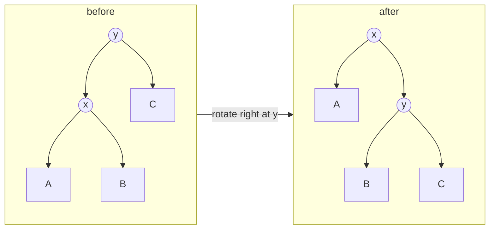

The [previous lesson](/learn/data-structures/trees/binary-search-trees) ended with a BST that turned into a chain because keys arrived in order. Every guarantee the BST offered was conditional on height staying logarithmic, and nothing enforced the condition. A balanced tree is a BST plus a rule that bounds the height, plus a repair mechanism, the rotation, that restores the rule after each insert or delete in O(log n). The rule and the repair are the difference between a data structure and a hope.

## Balance as a promise about height

A perfectly balanced tree of `n` nodes has height ⌊log₂ n⌋, but insisting on perfection is too expensive: inserting one key into a perfect tree can require rebuilding most of it. Practical balanced trees relax the condition just enough that repairs stay local:

| Scheme | Rule | Height bound | Rotations per insert |
|---|---|---|---|
| AVL | Heights of the two children differ by at most 1, at every node | ≤ 1.44 log₂(n + 2) | At most 1 (double counts as 1 composite) |
| Red-black | No red node has a red child; every root-to-null path has the same number of black nodes | ≤ 2 log₂(n + 1) | At most 2 |
| B-tree (order m) | Every node except the root has between ⌈m/2⌉ − 1 and m − 1 keys | ≤ log_{m/2}(n) | Splits instead of rotations |

The bound is what matters. A million keys: at most 29 levels for AVL, at most 40 for red-black, and 3 or 4 for a B-tree with fan-out in the hundreds. All of them are O(log n); AVL trees are a little shorter (faster lookups), red-black trees rebalance a little less (faster updates), B-trees pack many keys per node (fewer memory or disk touches per level).

## The rotation

A rotation is a local rewiring of three pointers that changes which of two adjacent nodes is on top, without changing the inorder sequence. Given `y` with left child `x`, a **right rotation** makes `x` the parent of `y`:



Inorder before: A x B y C. Inorder after: A x B y C. The subtree B moves from x's right to y's left, which keeps it between x and y in both pictures. A left rotation is the mirror image.

```python
def rotate_right(y):
    x = y.left
    y.left = x.right       # B moves across
    x.right = y
    update_height(y)       # y is now lower, fix it first
    update_height(x)
    return x               # new subtree root

def rotate_left(x):
    y = x.right
    x.right = y.left
    y.left = x
    update_height(x)
    update_height(y)
    return y
```

Three pointer writes, O(1). Everything else in balanced-tree maintenance is deciding *where* and *which way* to rotate.

## AVL trees

Each node stores its height (or the balance factor, `height(left) − height(right)`). After a normal BST insert, walk back up the insertion path recomputing heights. The first node whose balance factor becomes +2 or −2 is where the tree is fixed, and there are four cases, determined by which grandchild direction the new key went:

| Case | Shape | Balance factors | Fix |
|---|---|---|---|
| Left-Left | Inserted into left child's left subtree | node +2, left child +1 (or 0 on delete) | Rotate right at node |
| Right-Right | Inserted into right child's right subtree | node −2, right child −1 | Rotate left at node |
| Left-Right | Inserted into left child's right subtree | node +2, left child −1 | Rotate left at left child, then right at node |
| Right-Left | Inserted into right child's left subtree | node −2, right child +1 | Rotate right at right child, then left at node |

The single rotation handles the "straight line" shapes; the "zig-zag" shapes need one rotation to straighten them into a line and a second to lift the middle node. In both cases the subtree's height after the fix equals its height before the insert, so nothing above it is out of balance; one fix per insertion is enough.

```python
def avl_insert(node, key):
    if node is None:
        return AVLNode(key)
    if key < node.val:
        node.left = avl_insert(node.left, key)
    elif key > node.val:
        node.right = avl_insert(node.right, key)
    else:
        return node
    update_height(node)
    bf = balance(node)
    if bf > 1 and key < node.left.val:      # LL
        return rotate_right(node)
    if bf < -1 and key > node.right.val:    # RR
        return rotate_left(node)
    if bf > 1 and key > node.left.val:      # LR
        node.left = rotate_left(node.left)
        return rotate_right(node)
    if bf < -1 and key < node.right.val:    # RL
        node.right = rotate_right(node.right)
        return rotate_left(node)
    return node
```

### Worked example: inserting 1 through 7 in order

The input that destroys a plain BST.

- Insert 1, 2: `1 → (·, 2)`, balance factor of 1 is −1. Fine.
- Insert 3: `1 → (·, 2 → (·, 3))`. Node 1 has bf −2 and the key went right-right. Rotate left at 1: `2 → (1, 3)`.
- Insert 4: goes under 3. `2 → (1, 3 → (·, 4))`. bf(3) = −1, bf(2) = 1 − 2 = −1. Fine.
- Insert 5: under 4. bf(3) = −2, RR. Rotate left at 3: `4 → (3, 5)`, and the tree is `2 → (1, 4 → (3, 5))`. Now height(1) = 0 and height(4) = 1, so bf(2) = −1. Fine.
- Insert 6: under 5. bf(5) = −1. At node 4, height(3) = 0 and height(5) = 1, so bf(4) = −1. At node 2, height(1) = 0 and height(4) = 2, so bf(2) = −2, and 6 went right-right from 2: RR. Rotate left at 2: `4 → (2 → (1, 3), 5 → (·, 6))`.
- Insert 7: under 6. bf(5) = −2, RR. Rotate left at 5: `6 → (5, 7)`. Final: `4 → (2 → (1, 3), 6 → (5, 7))`, height 2, perfectly balanced.

Seven sorted keys, three rotations, and the result is the tree a plain BST would have needed the input order 4, 2, 6, 1, 3, 5, 7 to produce.

```viz
{"type": "tree", "algorithm": "avl-insert", "values": [1, 2, 3, 4, 5, 6, 7],
 "title": "AVL insertion of sorted keys", "caption": "Watch the balance factor reach -2 at a node and the left rotation lift its right child. The chain never gets longer than two edges."}
```

### A zig-zag case

Insert 10, 20, 30, 25, 28. After 10, 20, 30 the RR case gives `20 → (10, 30)`. Insert 25 under 30's left, then 28 under 25's right. Now bf(30) = height(25) − height(·) = 1 − (−1) = 2, and the key went left then right: LR. Rotate left at 25 to get `28 → (25, ·)`, then right at 30 to get `28 → (25, 30)`. The final tree is `20 → (10, 28 → (25, 30))`.

Deletion is the same idea with more cases (the sibling subtree may have balance factor 0), and unlike insertion a single deletion can require a rotation at *every* level on the way up, still O(log n).

## Red-black trees

An AVL tree keeps the strictest practical balance and pays for it with more rotations during updates. Red-black trees loosen the rule: every node is red or black, the root is black, red nodes have only black children, and every path from a node down to a null has the same count of black nodes (the **black-height**). Since reds cannot stack, the longest path (alternating red and black) is at most twice the shortest (all black), and the height is at most 2 log₂(n + 1).

Why prefer it? Insertion needs at most two rotations and deletion at most three, versus AVL's potentially O(log n) rotations on delete. Most of the fix-up work is recolouring, which touches no pointers. For a workload with many updates, that is a measurable win; for a read-heavy workload, AVL's shorter trees win slightly. The practical answer is that red-black trees are what most standard libraries chose: C++ `std::map`, Java `TreeMap`, the Linux kernel's `rb_tree` (used for the process scheduler's run queue, virtual memory areas and epoll). You are unlikely to implement one outside of an interview that specifically asks, and even then interviewers want the *properties* and the height argument, not the insertion cases from memory.

An equivalent way to see a red-black tree: it is a 2-3-4 tree (a B-tree with 2, 3 or 4 children per node) where each 3-node and 4-node is encoded as a black node with one or two red children. That correspondence is the cleanest way to understand why recolouring works, and it is the bridge to the next section.

## B-trees: balance for memory hierarchies

A binary node holds one key and two pointers. On disk, or even in main memory with a 64-byte cache line, reading a node costs the same whether it holds 1 key or 100. A B-tree node holds up to `m − 1` keys and `m` children, so each level of the tree consumes one page read and eliminates a factor of `m/2` or more of the remaining keys.

Balance in a B-tree is trivial: all leaves are at the same depth, always. Insertion goes to a leaf; if the leaf overflows, split it into two and push the middle key into the parent; if the parent overflows, split it too, and so on up. Only a split at the root increases the height, and it increases the height of *every* path at once, which is why the leaves stay level.

For a database page of 16 KiB and 8-byte keys plus 8-byte child pointers, a node holds about 1,000 keys. Three levels reach a billion rows. This is why every relational database's primary index is a B+-tree (a B-tree with all values in the leaves and leaves chained for range scans) and why Rust chose a B-tree for its in-memory `BTreeMap` (fan-out around 11: the point is cache lines, not disk). The [databases track](/learn/advanced-data-structures/balanced-trees/b-trees-and-b-plus-trees) goes deep on this; here the takeaway is that "balanced tree" is a family, and the choice within it is driven by the memory hierarchy.

## Choosing, and not choosing

| Need | Structure |
|---|---|
| Ordered map in memory, in a language with a standard library one | Whatever it ships: red-black (C++, Java), B-tree (Rust), skip list (Java's concurrent map) |
| Ordered map on disk, or range scans over large data | B+-tree |
| Read-heavy, updates rare, need the shortest possible height | AVL |
| Only need min or max, not general order | A [heap](/learn/data-structures/heaps/binary-heap-mechanics): simpler, faster, less memory |
| Only need membership or lookup by key | A hash table |
| Keys are strings sharing prefixes | A [trie](/learn/data-structures/tries-and-string-structures/tries) |

The last three rows are the senior move. Balanced trees are the right answer to "ordered operations on a changing set", and the wrong answer to almost everything else. An interviewer who hears "I'll use a TreeMap" for a problem that only needs `contains` will ask why you are paying O(log n) and pointer-chasing for an O(1) job.

## Exercises

```exercise
id: is-height-balanced
title: Check the AVL balance condition
prompt: |
  Given a binary tree as a **level-order list** with `null` gaps, return
  `true` if it is height-balanced: at **every** node, the heights of the
  left and right subtrees differ by at most 1. The empty tree is balanced.

  Do it in O(n): compute height bottom-up and short-circuit as soon as any
  node is unbalanced, rather than calling a separate height() at each node
  (which is O(n log n) at best and O(n²) on a chain).
languages: [python, javascript]
entry: is_height_balanced
starter:
  python: |
    class BTNode:
        def __init__(self, val):
            self.val, self.left, self.right = val, None, None

    def build_tree(values):
        if not values or values[0] is None:
            return None
        root = BTNode(values[0])
        queue, head, i = [root], 0, 1
        while head < len(queue) and i < len(values):
            node = queue[head]; head += 1
            if values[i] is not None:
                node.left = BTNode(values[i]); queue.append(node.left)
            i += 1
            if i < len(values) and values[i] is not None:
                node.right = BTNode(values[i]); queue.append(node.right)
            i += 1
        return root

    def is_height_balanced(values):
        root = build_tree(values)
        return True
  javascript: |
    class BTNode {
      constructor(val) { this.val = val; this.left = null; this.right = null; }
    }

    function build_tree(values) {
      if (!values.length || values[0] === null) return null;
      const root = new BTNode(values[0]);
      const queue = [root];
      let head = 0, i = 1;
      while (head < queue.length && i < values.length) {
        const node = queue[head++];
        if (values[i] !== null && values[i] !== undefined) { node.left = new BTNode(values[i]); queue.push(node.left); }
        i++;
        if (i < values.length && values[i] !== null) { node.right = new BTNode(values[i]); queue.push(node.right); }
        i++;
      }
      return root;
    }

    function is_height_balanced(values) {
      const root = build_tree(values);
      return true;
    }
tests:
  - args: [[1, 2, 3, 4, 5]]
    expected: true
  - args: [[1, 2, null, 3]]
    expected: false
    label: left chain of height 2 versus empty right
  - args: [[]]
    expected: true
    label: empty tree
  - args: [[3, 9, 20, null, null, 15, 7]]
    expected: true
  - args: [[1, 2, 2, 3, 3, null, null, 4, 4]]
    expected: false
    hidden: true
    label: unbalanced below the root
hints:
  - "Write height(node) that returns -1 for None and a sentinel (say, -2 or None) if any subtree is unbalanced; propagate the sentinel upward immediately."
  - "Balanced at a node means abs(hl - hr) <= 1 AND both subtrees are balanced."
```

```exercise
id: avl-insert-preorder
title: AVL insertion with rotations
prompt: |
  Insert the integers of `values` into an initially empty AVL tree in the
  given order (ignore duplicates) and return the **preorder** traversal of
  the final tree.

  Store a height on each node, recompute it after each recursive insert,
  and apply the LL / RR / LR / RL rotation at the first node whose balance
  factor (`height(left) - height(right)`) reaches +2 or -2. Rotations must
  preserve the inorder sequence.
languages: [python, javascript]
entry: avl_insert_preorder
starter:
  python: |
    class AVLNode:
        def __init__(self, val):
            self.val, self.left, self.right, self.height = val, None, None, 0

    def h(node):
        return -1 if node is None else node.height

    def update(node):
        node.height = 1 + max(h(node.left), h(node.right))

    def rotate_right(y):
        # TODO
        return y

    def rotate_left(x):
        # TODO
        return x

    def insert(node, key):
        # TODO: BST insert, update height, rebalance
        return node

    def avl_insert_preorder(values):
        root = None
        for v in values:
            root = insert(root, v)
        out = []
        # preorder into out
        return out
  javascript: |
    class AVLNode {
      constructor(val) { this.val = val; this.left = null; this.right = null; this.height = 0; }
    }

    const h = node => node === null ? -1 : node.height;
    const update = node => { node.height = 1 + Math.max(h(node.left), h(node.right)); };

    function rotate_right(y) {
      // TODO
      return y;
    }

    function rotate_left(x) {
      // TODO
      return x;
    }

    function insert(node, key) {
      // TODO: BST insert, update height, rebalance
      return node;
    }

    function avl_insert_preorder(values) {
      let root = null;
      for (const v of values) root = insert(root, v);
      const out = [];
      // preorder into out
      return out;
    }
tests:
  - args: [[1, 2, 3]]
    expected: [2, 1, 3]
    label: RR
  - args: [[3, 2, 1]]
    expected: [2, 1, 3]
    label: LL
  - args: [[1, 3, 2]]
    expected: [2, 1, 3]
    label: RL
  - args: [[3, 1, 2]]
    expected: [2, 1, 3]
    label: LR
  - args: [[1, 2, 3, 4, 5, 6, 7]]
    expected: [4, 2, 1, 3, 6, 5, 7]
    label: sorted input becomes a perfect tree
  - args: [[]]
    expected: []
  - args: [[10, 20, 30, 25, 28]]
    expected: [20, 10, 28, 25, 30]
    hidden: true
    label: LR deep in the tree
hints:
  - "rotate_right(y): x = y.left; y.left = x.right; x.right = y; update(y); update(x); return x."
  - "After the recursive insert and update(node): bf = h(node.left) - h(node.right). bf > 1 and key < node.left.val is LL; bf > 1 and key > node.left.val is LR (rotate left at node.left first)."
```

## Senior signals

- You explain a rotation as **three pointer writes that preserve inorder**, and you can draw it before writing it.
- You know the four AVL cases by *shape* (straight line versus zig-zag) rather than by memorised code, and you know why one fix per insertion is enough.
- You can state the red-black invariants and derive the 2 log₂(n + 1) height bound from "reds cannot stack".
- You know which structure your standard library actually ships and can say why red-black won in most of them and why Rust chose a B-tree.
- You explain B-trees in terms of the memory hierarchy: one page read per level, fan-out in the hundreds, three levels for a billion keys.
- You do **not** reach for a balanced tree when a heap or a hash table answers the question.

## Check yourself

```quiz
- q: >-
    After a right rotation at node y with left child x, which statement is true?
  options: ["The tree's height always drops by one; inorder is unchanged", "x is now above y, so the inorder sequence changes", "y's right subtree becomes x's left; inorder is unchanged", "x's right subtree becomes y's left; inorder is unchanged"]
  answer: 3
  explanation: >-
    The subtree between x and y in inorder (x's right) stays between them by becoming y's left; y's right subtree stays where it is. Rotations never change inorder; they only change which of two adjacent nodes is on top, and the height decreases only when the rotation was fixing an imbalance.
- q: >-
    A node has balance factor +2 and its left child has balance factor -1. Which fix is needed?
  options: ["A single left rotation at the node, as for Right-Right", "Rotate right at the left child, then left at the node (RL)", "A single right rotation at the node, as for Left-Left", "Rotate left at the left child, then right at the node (LR)"]
  answer: 3
  explanation: >-
    Left-heavy node whose left child is right-heavy is the zig-zag Left-Right case. A single right rotation would move the heavy subtree to the other side and leave it unbalanced; the first rotation straightens the shape into Left-Left.
- q: >-
    Why do most standard libraries use red-black trees instead of AVL trees for their ordered maps?
  options: ["They rebalance in fewer rotations but allow taller trees", "AVL trees cannot delete without rebuilding the whole tree", "They have smaller height, so lookups need fewer comparisons", "They store no extra per-node data, so they use less memory"]
  answer: 0
  explanation: >-
    AVL keeps a tighter height (about 1.44 log n versus 2 log n) but may rotate at every level during deletion. Red-black fix-ups are bounded by a constant number of rotations and are mostly recolouring. Both store one extra field per node (a height or a colour), and AVL, not red-black, has the smaller height.
- q: >-
    A database stores a billion rows with a B+-tree index over 16 KiB pages holding about 1,000 keys each. A point lookup reads roughly how many pages?
  options: ["About 9, if each level cuts rows by 10", "About 1,000, one per key in the leaf page", "About 30, one per level of a binary tree", "About 3 or 4, one per level of the B+-tree"]
  answer: 3
  explanation: >-
    Each level divides the remaining keys by about 1,000: 10^9 → 10^6 → 10^3 → 1, so three internal levels plus the leaf. A binary tree would need 30 levels, each a separate page read; the keys inside one page are searched in memory, not read one page each.
- q: >-
    You need to repeatedly extract the smallest element from a changing set of a million integers, and nothing else. The best structure is:
  options: ["A binary heap, since only the minimum is needed", "An AVL tree, since its height is the shortest", "A B-tree, since wide nodes are cache-friendly", "A red-black tree, since updates need few rotations"]
  answer: 0
  explanation: >-
    A heap gives O(log n) insert and extract-min with an array layout, no pointers, and less memory and better cache behaviour than any balanced tree. Balanced trees, including the cache-friendly B-tree, earn their cost only when you need general ordered queries.
```
