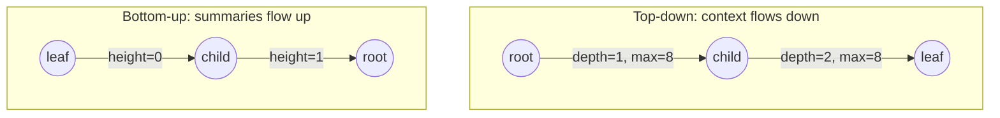

Nearly every binary tree interview problem, and there are dozens, is solved by one recursive function. The problems feel different (diameter, path sums, lowest common ancestor, "good" nodes, symmetric trees, building from traversals) but the code has two shapes, and the skill is recognising which one a problem wants before you write a line. Get the shape right and the function is ten lines; get it wrong and you end up with helper functions calling helper functions, a global counter, and O(n²) runtime.

## Two directions of information

A recursive call on a node has access to two sources of information: what its ancestors *passed down* as arguments, and what its children *return up* as results.

**Top-down** recursion passes accumulated context down. The node uses its ancestors' information to decide something about itself, then recurses. Examples: depth of each node (pass depth + 1), path from root (pass the path so far), the maximum value seen on the way down ("good nodes"), BST validation (pass the allowed range).

**Bottom-up** recursion returns a summary of each subtree up. The node combines its children's summaries with its own value. Examples: height, size, is-balanced, diameter, maximum path sum, subtree sums, whether a subtree contains a target.



The test for which you need: *can the node compute its answer knowing only its ancestors?* If yes, top-down. *Does it need to know about its descendants?* Bottom-up. Some problems need both: validate-BST is naturally top-down (bounds from ancestors), and can also be done bottom-up by returning (min, max, valid) tuples. When both work, top-down usually has simpler code and bottom-up avoids passing many parameters.

## Top-down: the accumulator pattern

Count the nodes whose value is ≥ every value on the path from the root ("good nodes"). Each node needs one fact from above: the maximum so far.

```python
def count_good(node, max_so_far=float("-inf")):
    if node is None:
        return 0
    good = 1 if node.val >= max_so_far else 0
    m = max(max_so_far, node.val)
    return good + count_good(node.left, m) + count_good(node.right, m)
```

The accumulator is immutable here (a number), so passing it is free. When the accumulator is a *path* (a list), the top-down pattern is backtracking: append before recursing, pop after.

```python
def paths_with_sum(root, target):
    out, path = [], []
    def go(node, remaining):
        if node is None:
            return
        path.append(node.val)
        remaining -= node.val
        if node.left is None and node.right is None and remaining == 0:
            out.append(list(path))          # copy: path is reused
        go(node.left, remaining)
        go(node.right, remaining)
        path.pop()                          # undo before returning
    go(root, target)
    return out
```

The `list(path)` copy is a classic bug site: append `path` itself and every result aliases the same list, which is empty by the time you look at it. The `path.pop()` is the other: forget it and the path grows forever.

## Bottom-up: the return-value pattern

Height is the canonical bottom-up recursion, and most bottom-up problems are "height plus one more thing". Take **diameter**: the longest path between any two nodes, measured in edges. A path either passes through the root of some subtree, or lies entirely inside a child subtree. The longest path *through* node `x` is `height(x.left) + height(x.right) + 2` (the two edges from `x` down into each subtree, plus each subtree's height). So the diameter is the maximum of that quantity over all nodes.

The naive implementation calls `height()` at every node: O(n) per call, O(n²) on a chain. The fix is to compute height and track the best diameter in the *same* pass:

```python
def diameter(root):
    best = 0
    def height(node):
        nonlocal best
        if node is None:
            return -1
        hl, hr = height(node.left), height(node.right)
        best = max(best, hl + hr + 2)
        return 1 + max(hl, hr)
    height(root)
    return best
```

Trace on `1 → (2 → (4, 5), 3)`. `height(4)` = 0 and `height(5)` = 0, so at node 2, `best = 0 + 0 + 2 = 2` and it returns 1. `height(3)` = 0. At node 1, `best = max(2, 1 + 0 + 2) = 3`, return 2. Diameter 3: the path 4-2-1-3.

```viz
{"type": "tree", "algorithm": "diameter", "values": [1, 2, 3, 4, 5],
 "title": "Diameter in one bottom-up pass", "caption": "Each node returns its height and updates the running best with left height + right height + 2. Note: the visualiser inserts values in BST order, so the shape differs from the trace above."}
```

The function returns one thing (height) and updates a second thing (best) as a side effect. That is fine in an interview if you say it out loud, but the cleaner style, and the one that generalises, is to **return a tuple**.

## Returning tuples

When a node needs two facts about each child, return both. Is-balanced needs each child's height *and* whether it is balanced:

```python
def is_balanced(root):
    def go(node):                        # returns (height, balanced)
        if node is None:
            return -1, True
        hl, bl = go(node.left)
        hr, br = go(node.right)
        return 1 + max(hl, hr), bl and br and abs(hl - hr) <= 1
    return go(root)[1]
```

Maximum path sum (any node to any node, values may be negative) needs "the best path that starts at this node and goes down" from each child, and it must be allowed to *drop* a child whose best downward path is negative:

```python
def max_path_sum(root):
    best = float("-inf")
    def down(node):                      # best sum of a path starting here and going down
        nonlocal best
        if node is None:
            return 0
        l = max(0, down(node.left))      # a negative branch is worth dropping
        r = max(0, down(node.right))
        best = max(best, node.val + l + r)   # path through this node using both sides
        return node.val + max(l, r)          # only one side can continue upward
    down(root)
    return best
```

The two `max(0, …)` clamps are where people go wrong, and the asymmetry between the update (both sides) and the return (one side) is the heart of the problem: a path that continues up to the parent cannot bend through both children. If you can explain that sentence, you have understood every "path" problem on a tree.

The tuple pattern scales. Largest BST subtree returns `(is_bst, min, max, size)`; house robber on a tree returns `(best if we rob this node, best if we do not)`; the [DP on trees lesson](/learn/algorithms/dynamic-programming/interval-and-tree-dp) is this pattern with more fields.

## Lowest common ancestor

The LCA of nodes `p` and `q` is the deepest node that has both as descendants (a node counts as its own descendant). It is the most common "combine information from both subtrees" question, and it has a top-down answer for BSTs and a bottom-up answer for general trees.

**BST, top-down.** Compare with the current node: if both targets are smaller, the LCA is in the left subtree; both larger, right; otherwise the current node splits them and *is* the LCA. O(h), no recursion needed.

```python
def lca_bst(root, p, q):
    node = root
    while node:
        if p < node.val and q < node.val:   node = node.left
        elif p > node.val and q > node.val: node = node.right
        else:                               return node
```

**General binary tree, bottom-up.** Each call returns "the LCA within this subtree, if both are here; else whichever of p or q is here; else None". When a node gets a non-null result from *both* children, it is the split point.

```python
def lca(node, p, q):
    if node is None or node.val == p or node.val == q:
        return node
    left  = lca(node.left, p, q)
    right = lca(node.right, p, q)
    if left and right:
        return node          # p and q are on different sides
    return left or right     # both on one side (or only one found)
```

Trace on `3 → (5 → (6, 2 → (7, 4)), 1 → (0, 8))` with p = 5, q = 4. The call at 5 returns 5 immediately (it matches). The call at 1 returns None (neither 5 nor 4 below it). At the root, left = 5 and right = None, so return 5, correct: 4 is a descendant of 5, so 5 is its own ancestor. With p = 7, q = 4: at node 2, both children return non-null, so 2 is returned; it propagates up unchanged.

```viz
{"type": "tree", "algorithm": "lca", "values": [6, 2, 8, 0, 4, 7, 9, 3, 5], "a": 3, "b": 5,
 "title": "Lowest common ancestor", "caption": "Bottom-up: a node that receives a hit from both children is the answer. The values here form a BST, so the top-down walk would find the same node."}
```

The general version assumes both values exist in the tree; if they might not, return `(found_p, found_q, lca)` as a tuple and check both flags at the root. A senior interviewer will ask exactly that.

## Building a tree from traversals

Given preorder `[3, 9, 20, 15, 7]` and inorder `[9, 3, 15, 20, 7]`, reconstruct the tree. The preorder's first element is the root; find it in inorder and everything to its left is the left subtree, everything to the right is the right subtree; recurse on both halves. The trick that makes it O(n) is a hash map from value to inorder index (so the split is O(1)) and passing index ranges instead of slicing arrays (slicing copies, O(n) per call, O(n²) total on a chain).

```python
def build(preorder, inorder):
    pos = {v: i for i, v in enumerate(inorder)}
    idx = 0
    def go(lo, hi):                     # inorder range [lo, hi)
        nonlocal idx
        if lo >= hi:
            return None
        val = preorder[idx]; idx += 1
        node = BTNode(val)
        node.left  = go(lo, pos[val])   # must build left first: preorder order
        node.right = go(pos[val] + 1, hi)
        return node
    return go(0, len(inorder))
```

Reconstruction needs inorder plus one of the others; preorder plus postorder alone is ambiguous whenever a node has a single child.

## Recursing on two trees at once

Some problems take two trees, or two halves of one tree, and the recursion advances through both in lockstep. **Same tree**: both null returns true; exactly one null returns false; values differ returns false; otherwise recurse on both left subtrees and both right subtrees. **Symmetric tree** is the same function applied to a tree's left and right subtrees with the children *mirrored*: compare `left.left` with `right.right` and `left.right` with `right.left`. **Subtree of another tree** calls same-tree at every node of the larger tree, which is O(n · m) and acceptable for interview sizes; the serialisation trick in the [next lesson](/learn/data-structures/trees/n-ary-trees-and-serialization) makes it linear.

```python
def same(a, b):
    if a is None or b is None:
        return a is b                       # both None, or exactly one
    return a.val == b.val and same(a.left, b.left) and same(a.right, b.right)

def symmetric(root):
    def mirror(l, r):
        if l is None or r is None:
            return l is r
        return l.val == r.val and mirror(l.left, r.right) and mirror(l.right, r.left)
    return root is None or mirror(root.left, root.right)
```

The pattern is the same contract discipline: the function's contract is about a *pair* of nodes, the base case handles the pair being unequal in shape, and short-circuit evaluation stops at the first mismatch, so the cost is O(min(n₁, n₂)). Merge-two-trees and "flip equivalent" are the same skeleton with a different combine step.

## The pitfalls, named

| Pitfall | Symptom | Fix |
|---|---|---|
| Calling a helper (height, size) inside the recursion | O(n²) on a chain; fine on the interviewer's tiny example | Return the helper's value from the same pass; tuples |
| Global/`nonlocal` accumulator not reset | Second call returns stale answer | Wrap in a function that creates the state fresh; or return tuples |
| Appending the shared path list instead of a copy | All results identical (and empty) | `list(path)` / `path.slice()` at the moment of recording |
| Forgetting to pop after recursing | Paths contain nodes from other branches | Pop in the same function that pushed, on every exit |
| Not clamping negative contributions | Max path sum too small | `max(0, child)` for optional branches |
| Slicing arrays in the recursion | O(n²) reconstruction | Pass indices |
| Recursion depth on a degenerate tree | `RecursionError` in production | Explicit stack, or `sys.setrecursionlimit` with a real stack size, or iterative postorder |

## Exercises

```exercise
id: tree-diameter
title: Diameter of a binary tree
prompt: |
  Given a binary tree as a **level-order list** with `null` gaps, return its
  diameter: the number of **edges** on the longest path between any two
  nodes. The path need not pass through the root. Return 0 for the empty
  tree or a single node.

  One pass, O(n): compute height bottom-up and update the best diameter as
  you return. `build_tree` and `BTNode` are provided.
languages: [python, javascript]
entry: diameter
starter:
  python: |
    class BTNode:
        def __init__(self, val):
            self.val, self.left, self.right = val, None, None

    def build_tree(values):
        if not values or values[0] is None:
            return None
        root = BTNode(values[0])
        queue, head, i = [root], 0, 1
        while head < len(queue) and i < len(values):
            node = queue[head]; head += 1
            if values[i] is not None:
                node.left = BTNode(values[i]); queue.append(node.left)
            i += 1
            if i < len(values) and values[i] is not None:
                node.right = BTNode(values[i]); queue.append(node.right)
            i += 1
        return root

    def diameter(values):
        root = build_tree(values)
        return 0
  javascript: |
    class BTNode {
      constructor(val) { this.val = val; this.left = null; this.right = null; }
    }

    function build_tree(values) {
      if (!values.length || values[0] === null) return null;
      const root = new BTNode(values[0]);
      const queue = [root];
      let head = 0, i = 1;
      while (head < queue.length && i < values.length) {
        const node = queue[head++];
        if (values[i] !== null && values[i] !== undefined) { node.left = new BTNode(values[i]); queue.push(node.left); }
        i++;
        if (i < values.length && values[i] !== null) { node.right = new BTNode(values[i]); queue.push(node.right); }
        i++;
      }
      return root;
    }

    function diameter(values) {
      const root = build_tree(values);
      return 0;
    }
tests:
  - args: [[1, 2, 3, 4, 5]]
    expected: 3
  - args: [[1]]
    expected: 0
    label: single node
  - args: [[]]
    expected: 0
    label: empty tree
  - args: [[1, 2]]
    expected: 1
  - args: [[1, 2, null, 3, 4, 5, 6, 7, null, null, null, null, 8]]
    expected: 5
    hidden: true
    label: longest path avoids the root
hints:
  - "height(None) = -1. At each node, candidate = hl + hr + 2; keep the maximum in a variable outside the recursion."
  - "Return 1 + max(hl, hr) so the parent can use it; the diameter is a side effect, not the return value."
```

```exercise
id: lca-binary-tree
title: Lowest common ancestor in a binary tree
prompt: |
  Given a binary tree as a **level-order list** with `null` gaps and two
  distinct values `a` and `b` that are both present in the tree (all values
  are unique), return the value of their lowest common ancestor: the deepest
  node that has both `a` and `b` in its subtree. A node is its own
  descendant, so if `a` is an ancestor of `b`, the answer is `a`.

  Do not assume the tree is a BST.
languages: [python, javascript]
entry: lca
starter:
  python: |
    class BTNode:
        def __init__(self, val):
            self.val, self.left, self.right = val, None, None

    def build_tree(values):
        if not values or values[0] is None:
            return None
        root = BTNode(values[0])
        queue, head, i = [root], 0, 1
        while head < len(queue) and i < len(values):
            node = queue[head]; head += 1
            if values[i] is not None:
                node.left = BTNode(values[i]); queue.append(node.left)
            i += 1
            if i < len(values) and values[i] is not None:
                node.right = BTNode(values[i]); queue.append(node.right)
            i += 1
        return root

    def lca(values, a, b):
        root = build_tree(values)
        return None
  javascript: |
    class BTNode {
      constructor(val) { this.val = val; this.left = null; this.right = null; }
    }

    function build_tree(values) {
      if (!values.length || values[0] === null) return null;
      const root = new BTNode(values[0]);
      const queue = [root];
      let head = 0, i = 1;
      while (head < queue.length && i < values.length) {
        const node = queue[head++];
        if (values[i] !== null && values[i] !== undefined) { node.left = new BTNode(values[i]); queue.push(node.left); }
        i++;
        if (i < values.length && values[i] !== null) { node.right = new BTNode(values[i]); queue.push(node.right); }
        i++;
      }
      return root;
    }

    function lca(values, a, b) {
      const root = build_tree(values);
      return null;
    }
tests:
  - args: [[3, 5, 1, 6, 2, 0, 8, null, null, 7, 4], 5, 1]
    expected: 3
  - args: [[3, 5, 1, 6, 2, 0, 8, null, null, 7, 4], 5, 4]
    expected: 5
    label: one value is an ancestor of the other
  - args: [[3, 5, 1, 6, 2, 0, 8, null, null, 7, 4], 7, 4]
    expected: 2
  - args: [[1, 2], 1, 2]
    expected: 1
  - args: [[3, 5, 1, 6, 2, 0, 8, null, null, 7, 4], 6, 8]
    expected: 3
    hidden: true
  - args: [[3, 5, 1, 6, 2, 0, 8, null, null, 7, 4], 0, 8]
    expected: 1
    hidden: true
hints:
  - "Return the node itself when it is None or matches a or b; then recurse into both children."
  - "If both children return non-null, this node is the answer; otherwise return whichever child result is non-null."
```

## Senior signals

- You classify a tree problem as **top-down or bottom-up** in the first minute, by asking whether a node's answer depends on its ancestors or its descendants.
- You return **tuples** rather than calling `height()` inside another recursion, and you can explain why the naive version is O(n²) on a chain.
- For path problems you can articulate the asymmetry: *update* with both branches, *return* with one, and clamp negatives.
- You know the BST LCA is a top-down walk with no recursion, and the general LCA is a bottom-up "who reported a hit" recursion, and you ask whether both nodes are guaranteed to exist.
- You reconstruct from traversals with a hash map and index ranges, not slices, and you know which traversal pairs are ambiguous.
- You handle path accumulators with push/pop discipline and copy at the moment of recording.

## Check yourself

```quiz
- q: >-
    A problem asks for the number of nodes whose value is greater than every ancestor's value. Which recursion shape fits, and why?
  options: ["Level order, because ancestors are on earlier levels", "Top-down, because each node needs the maximum above it", "Bottom-up, because each node needs its subtree's maximum", "Either, since both shapes need the same single parameter"]
  answer: 1
  explanation: >-
    The node needs one fact from its ancestors (the running maximum on the path from the root) and nothing from its descendants; pass it down as an argument. A bottom-up version would have to return every value in the subtree, which is wasteful and nothing like the same code.
- q: >-
    def diameter(node): return max(height(node.left) + height(node.right) + 2, diameter(node.left), diameter(node.right)). What is its time complexity on a chain of n nodes?
  options: ["O(n log n)", "O(n)", "O(2^n)", "O(n²)"]
  answer: 3
  explanation: >-
    height() is O(size of subtree) and is called at every node; on a chain the subtree sizes are n, n-1, ..., 1, summing to O(n²). Computing height and diameter in the same pass makes it O(n).
- q: >-
    In the maximum-path-sum recursion, why does a node return node.val + max(l, r) rather than node.val + l + r?
  options: ["Because a path up to the parent can use only one branch", "Because l + r would count a negative branch twice over", "Because the parent adds in the other branch by itself", "To keep the recursion O(n), not O(n²), on a chain"]
  answer: 0
  explanation: >-
    A path is a simple sequence of nodes. If the parent extends this node's path, that path enters the node from above and can leave through at most one child, otherwise it would visit the node twice. The both-sides value is used only to update the global best, never returned; negatives are already handled by the max(0, ...) clamps.
- q: >-
    The bottom-up LCA function is called with two values, one of which is not in the tree. What does it return?
  options: ["The present node, since a lone hit propagates up", "The root, since the search reaches it with one hit", "An error, since one recursive branch returns None", "None, since no node gets a hit from both children"]
  answer: 0
  explanation: >-
    A node matching a or b returns itself immediately, and a lone non-null result propagates up unchanged (left or right), so no error and no None. With one target absent, the function returns the present one, which is wrong if the caller assumes both exist. Return found-flags in a tuple when presence is not guaranteed.
- q: >-
    You reconstruct a tree from preorder and inorder using array slicing at each recursive call. On a tree that is a left chain of n nodes, the cost is:
  options: ["O(n²), since each slice copies its whole subtree", "O(n log n), since each level of recursion slices n items", "O(n), since a slice is a view, not a copy", "O(n), since each node is created exactly once"]
  answer: 0
  explanation: >-
    Each call slices arrays proportional to the subtree size, and on a chain those sizes sum to O(n²). Python and JavaScript slices copy, not view. Pass index ranges and use a value-to-index map instead.
```
