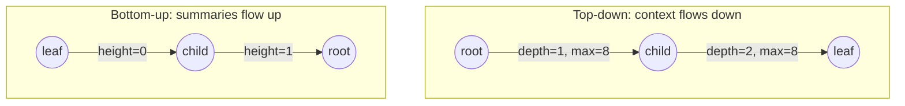

Nearly every binary tree interview problem, and there are dozens, is solved by one recursive function. The problems feel different (diameter, path sums, lowest common ancestor, "good" nodes, symmetric trees, building from traversals) but the code has two shapes, and the skill is recognising which one a problem wants before you write a line. Get the shape right and the function is ten lines; get it wrong and you end up with helper functions calling helper functions, a global counter, and O(n²) runtime.

## One tree for every trace

```text
                 4
               /   \
             -3     6
            /  \
           8   -5
          /      \
         7        9
        /          \
      -1            10
```

Level-order encoding, as the exercises use it: `[4, -3, 6, 8, -5, null, null, 7, null, null, 9, -1, null, null, 10]`. Nine nodes, height 4 (edges, as in the [fundamentals lesson](/learn/data-structures/trees/tree-fundamentals)), all values distinct so that LCA queries are unambiguous, and three negative values so that path sums have something to drop. Every table below is in **post-order** (the order in which calls return: −1, 7, 8, 10, 9, −5, −3, 6, 4) unless it says otherwise, so you can reproduce it with a pen by working up from the leaves.

## Two directions of information

A recursive call on a node has two sources of information: what its ancestors *passed down* as arguments, and what its children *return up* as results.

**Top-down** recursion passes accumulated context down. The node uses its ancestors' information to decide something about itself, then recurses. **Bottom-up** recursion returns a summary of each subtree up, and the node combines its children's summaries with its own value.



| Question about the problem | Top-down | Bottom-up |
|---|---|---|
| Can a node answer knowing only its ancestors? | Yes: depth, path so far, running max, BST bounds | No |
| Does a node need facts about its descendants? | No | Yes: height, size, is-balanced, diameter, max path sum, subtree contains x |
| What does the function return? | Often nothing; results go into an accumulator or a counter | The summary the parent needs, one value or a tuple |
| Where is the answer when the recursion ends? | In the accumulator | In the root's return value, or in a running best updated on the way up |
| Typical bug | Sharing a mutable accumulator across branches | Recomputing a child summary instead of returning it |

Validate-BST works both ways (bounds down, or `(valid, min, max)` up). When both fit, top-down usually has simpler code and bottom-up avoids passing many parameters; the [tree DFS pattern lesson](/learn/interview-patterns/tree-and-graph-patterns/tree-dfs) drills the choice on more problems.

## Top-down: the accumulator pattern

Count the nodes whose value is at least every value on the path from the root ("good nodes"). Each node needs one fact from above: the maximum so far.

```python
def count_good(node, max_so_far=float("-inf")):
    if node is None:
        return 0
    good = 1 if node.val >= max_so_far else 0
    m = max(max_so_far, node.val)
    return good + count_good(node.left, m) + count_good(node.right, m)
```

In visit (pre-) order on the example tree:

| Node | Max above | Good? | Node | Max above | Good? |
|---|---|---|---|---|---|
| 4 | −∞ | yes | −5 | 4 | no |
| −3 | 4 | no | 9 | 4 | yes |
| 8 | 4 | yes | 10 | 9 | yes |
| 7 | 8 | no | 6 | 4 | yes |
| −1 | 8 | no | | | |

Five good nodes. Depth of every node is the same shape with `d + 1` passed down. The accumulator here is an immutable number, so passing it is free. When the accumulator is a *path* (a list), the top-down pattern is backtracking: append before recursing, pop after.

```python
def paths_with_sum(root, target):
    out, path = [], []
    def go(node, remaining):
        if node is None:
            return
        path.append(node.val)
        remaining -= node.val
        if node.left is None and node.right is None and remaining == 0:
            out.append(list(path))          # copy: path is reused
        go(node.left, remaining)
        go(node.right, remaining)
        path.pop()                          # undo before returning
    go(root, target)
    return out
```

With target 15, in visit order:

| Enter | Path after append | Remaining | Leaf? |
|---|---|---|---|
| 4 | [4] | 11 | |
| −3 | [4, −3] | 14 | |
| 8 | [4, −3, 8] | 6 | |
| 7 | [4, −3, 8, 7] | −1 | |
| −1 | [4, −3, 8, 7, −1] | 0 | leaf, hit: copy recorded |
| −5 | [4, −3, −5] | 19 | after three pops |
| 9 | [4, −3, −5, 9] | 10 | |
| 10 | [4, −3, −5, 9, 10] | 0 | leaf, hit |
| 6 | [4, 6] | 5 | leaf, no hit |

Two paths. Note that `remaining` went negative at 7 and the walk continued: with negative values you cannot prune on `remaining < 0`. The `list(path)` copy is a classic bug site: append `path` itself and every result aliases the same list, which is empty by the time you look at it. The `path.pop()` is the other: forget it and the path grows forever.

## Bottom-up: the return-value pattern

Height is the canonical bottom-up recursion, and most bottom-up problems are "height plus one more thing".

| Node | h(left) | h(right) | Returns |
|---|---|---|---|
| −1 | −1 | −1 | 0 |
| 7 | 0 | −1 | 1 |
| 8 | 1 | −1 | 2 |
| 10 | −1 | −1 | 0 |
| 9 | −1 | 0 | 1 |
| −5 | −1 | 1 | 2 |
| −3 | 2 | 2 | 3 |
| 6 | −1 | −1 | 0 |
| 4 | 3 | 0 | 4 |

Take **diameter**: the longest path between any two nodes, in edges. A path either passes through the root of some subtree or lies inside a child subtree. The longest path *through* node x is `height(x.left) + height(x.right) + 2` (the two edges from x down into each subtree, plus each subtree's height), so the diameter is the maximum of that quantity over all nodes, computed in the same pass as height:

```python
def diameter(root):
    best = 0
    def height(node):
        nonlocal best
        if node is None:
            return -1
        hl, hr = height(node.left), height(node.right)
        best = max(best, hl + hr + 2)
        return 1 + max(hl, hr)
    height(root)
    return best
```

| Node | hl | hr | Candidate hl + hr + 2 | Running best | Returns |
|---|---|---|---|---|---|
| −1 | −1 | −1 | 0 | 0 | 0 |
| 7 | 0 | −1 | 1 | 1 | 1 |
| 8 | 1 | −1 | 2 | 2 | 2 |
| 10 | −1 | −1 | 0 | 2 | 0 |
| 9 | −1 | 0 | 1 | 2 | 1 |
| −5 | −1 | 1 | 2 | 2 | 2 |
| −3 | 2 | 2 | **6** | 6 | 3 |
| 6 | −1 | −1 | 0 | 6 | 0 |
| 4 | 3 | 0 | 5 | 6 | 4 |

Diameter 6, the path −1, 7, 8, −3, −5, 9, 10, found at node −3; the candidate at the root is only 5. That is why the running best is updated at *every* node and the answer is not the root's candidate.

```viz
{"type": "tree", "algorithm": "diameter", "values": [1, 2, 3, 4, 5],
 "title": "Diameter in one bottom-up pass", "caption": "Each node returns its height and updates the running best with left height + right height + 2. Note: the visualiser inserts values in BST order, so the shape differs from the lesson's tree."}
```

### The O(n²) trap, counted

The version people write first calls a separate `height()` at every node:

```python
def diameter_naive(node):                  # do not ship this
    if node is None:
        return 0
    through = height(node.left) + height(node.right) + 2
    return max(through, diameter_naive(node.left), diameter_naive(node.right))
```

`height(x)` visits every node of x's subtree. On a chain of n nodes, the node k levels from the bottom has a subtree of k nodes, so computing height once per node visits 1 + 2 + … + n = n(n + 1)/2 nodes:

| Chain length n | Node visits inside `height` calls | Same tree, one-pass version |
|---|---|---|
| 5 | 15 (5 + 4 + 3 + 2 + 1) | 5 |
| 1,000 | 500,500 | 1,000 |
| 100,000 | 5,000,050,000 | 100,000 |

(Counted by instrumenting `height`; `diameter_naive` itself calls it on children rather than on the node, which gives n(n − 1)/2, the same order.) On a balanced tree the damage is O(n log n), which is why the naive code passes the interviewer's example and dies on the skewed test. The fix is always the same: return the helper's value from the same pass.

## Returning tuples

The function above returns one thing (height) and updates a second (best) as a side effect. That is acceptable in an interview if you say it out loud, but the cleaner style, and the one that generalises, is to **return a tuple**. Is-balanced needs each child's height *and* whether it is balanced:

```python
def is_balanced(root):
    def go(node):                        # returns (height, balanced)
        if node is None:
            return -1, True
        hl, bl = go(node.left)
        hr, br = go(node.right)
        return 1 + max(hl, hr), bl and br and abs(hl - hr) <= 1
    return go(root)[1]
```

| Node | hl | hr | Difference | Returns |
|---|---|---|---|---|
| −1 | −1 | −1 | 0 | (0, True) |
| 7 | 0 | −1 | 1 | (1, True) |
| 8 | 1 | −1 | 2 | (2, **False**) |
| 10, 9 | | | 0, 1 | (0, True), (1, True) |
| −5 | −1 | 1 | 2 | (2, False) |
| −3 | 2 | 2 | 0 | (3, False): the flag propagates even though −3 itself is balanced |
| 6 | −1 | −1 | 0 | (0, True) |
| 4 | 3 | 0 | 3 | (4, False) |

Once a subtree reports `False` nothing above can repair it, so a production version short-circuits by returning a sentinel height (the exercise in the [balanced trees lesson](/learn/data-structures/trees/balanced-trees) asks for exactly that). The same shape validates a BST bottom-up by returning `(valid, min, max)`: on the [BST lesson's](/learn/data-structures/trees/binary-search-trees) bad tree `[10, 5, 15, null, null, 6, 20]`, node 15 returns `(True, 6, 20)` and node 10 then fails because its right subtree's minimum, 6, is not greater than 10; the parent-only check would have passed. The tuple is the whole reason the check is O(n): each child summarises its subtree in three numbers, so the parent never re-walks it.

### Maximum path sum: the asymmetry

Maximum path sum (any node to any node, values may be negative) needs "the best sum of a path that starts at this node and goes down" from each child, and it must be allowed to *drop* a child whose best downward path is negative:

```python
def max_path_sum(root):
    best = float("-inf")
    def down(node):                      # best sum of a path starting here and going down
        nonlocal best
        if node is None:
            return 0
        l = max(0, down(node.left))      # a negative branch is worth dropping
        r = max(0, down(node.right))
        best = max(best, node.val + l + r)   # path through this node using both sides
        return node.val + max(l, r)          # only one side can continue upward
    down(root)
    return best
```

| Node | Returned by children (raw) | After clamp l, r | Candidate val + l + r | Running best | Returns val + max(l, r) |
|---|---|---|---|---|---|
| −1 | 0, 0 | 0, 0 | −1 | −1 | −1 |
| 7 | −1, 0 | 0, 0 | 7 | 7 | 7 |
| 8 | 7, 0 | 7, 0 | 15 | 15 | 15 |
| 10 | 0, 0 | 0, 0 | 10 | 15 | 10 |
| 9 | 0, 10 | 0, 10 | 19 | 19 | 19 |
| −5 | 0, 19 | 0, 19 | 14 | 19 | 14 |
| −3 | 15, 14 | 15, 14 | **26** | 26 | 12 |
| 6 | 0, 0 | 0, 0 | 6 | 26 | 6 |
| 4 | 12, 6 | 12, 6 | 22 | 26 | 16 |

Answer 26: the path 7, 8, −3, −5, 9, 10, which drops −1 (clamped to 0 at node 7) and never reaches the root. Two things carry the problem. The clamp: on the two-node tree `[2, -1]` an unclamped version reports 2 + (−1) = 1 instead of 2. The asymmetry between the update and the return: a path that continues up to the parent enters this node from above and can leave through at most one child, otherwise it would visit the node twice, so the both-sides value feeds only the running best. And `best` must start at −∞, not 0: on `[-3, -1, -2]` a zero start returns 0 for a tree whose true answer is −1. If you can explain those three sentences, you have understood every "path" problem on a tree. The pattern scales: largest BST subtree returns `(is_bst, min, max, size)`, house robber on a tree returns `(best if robbed, best if not)`, and the [DP on trees lesson](/learn/algorithms/dynamic-programming/interval-and-tree-dp) is this with more fields.

## Lowest common ancestor

The LCA of p and q is the deepest node that has both as descendants (a node counts as its own descendant). Each call returns "the LCA within this subtree if both are here; else whichever of p or q is here; else None". A node that gets a non-null result from *both* children is the split point.

```python
def lca(node, p, q):
    if node is None or node.val == p or node.val == q:
        return node
    left  = lca(node.left, p, q)
    right = lca(node.right, p, q)
    if left and right:
        return node          # p and q are on different sides
    return left or right     # both on one side (or only one found)
```

LCA(7, 10) on the example tree, in the order calls return:

| Node | Left returns | Right returns | Returns | Why |
|---|---|---|---|---|
| 7 | | | 7 | matches p; its subtree is not visited |
| 8 | 7 | None | 7 | one hit, pass it up |
| 10 | | | 10 | matches q |
| 9 | None | 10 | 10 | one hit |
| −5 | None | 10 | 10 | one hit |
| −3 | 7 | 10 | **−3** | hits from both sides: the split point |
| 6 | None | None | None | |
| 4 | −3 | None | −3 | an answer propagates unchanged |

LCA(8, −1): the call at 8 returns 8 without descending, so −1 is never visited; −3 sees (8, None) and the root sees (8, None): answer 8, correct because 8 is an ancestor of −1. Now LCA(7, 99), where 99 is not in the tree: every row is the same as the first table except that the right side never reports, and the function returns **7**. The caller cannot tell "7 is the ancestor of 99" from "99 is absent". When presence is not guaranteed, return flags:

```python
def lca_safe(node, p, q):                 # returns (candidate, found_p, found_q)
    if node is None:
        return None, False, False
    l, lp, lq = lca_safe(node.left, p, q)
    r, rp, rq = lca_safe(node.right, p, q)
    found_p = lp or rp or node.val == p
    found_q = lq or rq or node.val == q
    if l is not None and r is not None or node.val in (p, q):
        return node, found_p, found_q
    return (l if l is not None else r), found_p, found_q
```

`lca_safe(root, 7, 99)` returns `(7, True, False)`, and the caller checks both flags. The price is that the search no longer stops at the first match (it must keep looking for the other value below it), so it visits all n nodes instead of stopping early.

```viz
{"type": "tree", "algorithm": "lca", "values": [6, 2, 8, 0, 4, 7, 9, 3, 5], "a": 3, "b": 5,
 "title": "Lowest common ancestor", "caption": "Bottom-up: a node that receives a hit from both children is the answer. The values here form a BST, so the top-down walk would find the same node."}
```

### With parent pointers

If nodes know their parent, no recursion is needed: bring both nodes to the same depth, then walk up in lockstep until they meet. LCA(−1, 9): depths are 4 and 3, so lift −1 to its parent 7; then (7, 9) → (8, −5) → (−3, −3). Answer −3 in three steps, O(h) time and O(1) space. Computing the depths costs one walk up from each node. Browsers use the same parent pointers for `Node.compareDocumentPosition`, in a variant that costs O(h) memory: Blink records both nodes' ancestor chains and walks them from the root end until they diverge.

### In a BST

Values order the search: if both targets are smaller than the node go left, if both are larger go right, otherwise the node splits them and *is* the LCA. On the BST lesson's eight-key tree (50, 30, 70, 20, 40, 60, 80, 35), LCA(35, 60) is 50 at the first comparison and LCA(20, 35) goes left once and stops at 30. O(h), iterative, no recursion.

```python
def lca_bst(root, p, q):
    node = root
    while node:
        if p < node.val and q < node.val:   node = node.left
        elif p > node.val and q > node.val: node = node.right
        else:                               return node
```

### Of k nodes, and the binary-lifting preview

For a set of k target values, return a count instead of a node: each call returns how many targets its subtree contains, and the first node (in post-order) whose count reaches k is the LCA. On the example, LCA of {7, 10, 9} is −3 and of {7, −1, 6} is the root.

When the tree is static and there are many queries, one O(n) walk per query is too slow: 10⁵ queries on 10⁵ nodes is 10¹⁰ node visits. **Binary lifting** precomputes `up[j][v]`, the 2ʲ-th ancestor of v, in O(n log n) from `up[j][v] = up[j−1][up[j−1][v]]`, then answers each query in O(log n): lift the deeper node by the depth difference in powers of two, then for j from high to low jump both nodes up 2ʲ whenever their 2ʲ-th ancestors differ; the answer is the parent of where they stop.

| Node | Depth | up[0] (parent) | up[1] | up[2] |
|---|---|---|---|---|
| 4 | 0 | – | – | – |
| −3, 6 | 1 | 4 | – | – |
| 8, −5 | 2 | −3 | 4 | – |
| 7 | 3 | 8 | −3 | – |
| 9 | 3 | −5 | −3 | – |
| −1 | 4 | 7 | 8 | 4 |
| 10 | 4 | 9 | −5 | 4 |

LCA(−1, 10): equal depths, so no lifting. j = 2: up[2] is 4 for both, stay. j = 1: up[1] is 8 versus −5, jump to (8, −5). j = 0: up[0] is −3 for both, stay. Answer: the parent of 8, which is −3. The table costs n·⌈log₂ h⌉ entries (three columns here; 17 for a tree of height 10⁵), and the same doubling idea powers the [sparse table](/learn/advanced-data-structures/range-queries/sparse-tables-and-sqrt-decomposition).

## Building a tree from traversals

Given preorder `[3, 9, 20, 15, 7]` and inorder `[9, 3, 15, 20, 7]`, the preorder's first element is the root; find it in inorder, and everything to its left is the left subtree; recurse on both halves. Two details make it O(n): a hash map from value to inorder index (so the split is O(1)) and index ranges instead of slices (slicing copies, O(n) per call and O(n²) total on a chain, the same arithmetic as the diameter trap).

```python
def build(preorder, inorder):
    pos = {v: i for i, v in enumerate(inorder)}
    idx = 0
    def go(lo, hi):                     # inorder range [lo, hi)
        nonlocal idx
        if lo >= hi:
            return None
        val = preorder[idx]; idx += 1
        node = BTNode(val)
        node.left  = go(lo, pos[val])   # must build left first: preorder order
        node.right = go(pos[val] + 1, hi)
        return node
    return go(0, len(inorder))
```

Reconstruction needs inorder plus one of the others, and distinct values; preorder plus postorder alone is ambiguous whenever a node has a single child. The [serialisation lesson](/learn/data-structures/trees/n-ary-trees-and-serialization) shows why a single traversal with null markers is the better encoding.

## Recursing on two trees at once

Some problems advance through two trees in lockstep. **Same tree**: both null returns true; exactly one null returns false; values differ returns false; otherwise recurse on both left subtrees and both right subtrees. **Symmetric tree** applies the same function to a tree's left and right subtrees with the children *mirrored*.

```python
def same(a, b):
    if a is None or b is None:
        return a is b                       # both None, or exactly one
    return a.val == b.val and same(a.left, b.left) and same(a.right, b.right)

def symmetric(root):
    def mirror(l, r):
        if l is None or r is None:
            return l is r
        return l.val == r.val and mirror(l.left, r.right) and mirror(l.right, r.left)
    return root is None or mirror(root.left, root.right)
```

The contract is about a *pair* of nodes, the base case handles the pair being unequal in shape, and short-circuit evaluation stops at the first mismatch, so the cost is O(min(n₁, n₂)). Merge-two-trees and "flip equivalent" are the same skeleton with a different combine step.

## Under the hood: what the recursion costs

**Frames.** In CPython 3.11 and later a Python-to-Python call pushes a frame onto a per-thread data stack allocated in heap chunks, not onto the C stack; a frame for a function like `height` is on the order of 100–200 bytes (the exact size depends on the version and the function's locals). The recursion limit, 1,000 by default, counts those frames, and `height` on a chain of 10⁵ nodes raises `RecursionError` at frame 1,000 (measured on 3.14.7). Raising the limit with `sys.setrecursionlimit` is safe on these versions because no C stack is consumed by pure-Python recursion; on older versions, and in Node (about 10⁴ frames) or the JVM (a 1 MiB thread stack by default), it is the native stack that overflows.

**Converting to an explicit stack.** Bottom-up patterns need the children's results before the node's, so the conversion is the single-stack post-order with a last-visited pointer from the [traversals lesson](/learn/data-structures/trees/binary-tree-traversals), with the returned values kept in a dictionary keyed by node or pushed onto a second stack. Top-down patterns convert more easily: push `(node, accumulator)` pairs and pop, which is the `height_iter` shape from the fundamentals lesson. Tail-call elimination does not help either way: CPython does not perform it, and a tree recursion makes two calls, so neither is in tail position.

**Memoising subtree results.** If several passes need `height(x)` for many x, compute it once and store it. A dictionary keyed by `id(node)` costs roughly 100 bytes per entry (the dict slot plus the key and value objects) and stays valid only while the nodes are alive and unchanged; storing the result on the node (`node.height = ...`) costs one slot, but mutates a structure other code may share and goes stale silently when the tree is edited. Prefer the tuple return, which needs neither.

## Trade-offs

| | Top-down | Bottom-up, single value plus running best | Bottom-up, tuple | Iterative post-order |
|---|---|---|---|---|
| Information flows | Down, as arguments | Up, as one return; a second fact via `nonlocal` | Up, all facts in the return | Up, via an explicit results store |
| Extra space | O(h) frames; O(h) for a path accumulator | O(h) frames | O(h) frames plus tuple allocations, ~56 bytes each in CPython | O(h) heap for the stack, plus results |
| Early exit | Natural: stop descending | Needs a sentinel or exception | Natural: propagate a sentinel in the tuple | Natural: break the loop |
| Recursion depth | h + 2 frames | h + 2 | h + 2 | None |
| Reusability across calls | Accumulator must be re-created per call | `nonlocal` state must be re-created per call | Pure: no shared state | Pure |
| Fits | depth, path sums, good nodes, BST bounds | diameter, max path sum | is-balanced, validate-BST, largest BST subtree, tree DP | any of the above on a tree whose height a client controls |

## Production failure modes

| Symptom | Diagnosis | Fix |
|---|---|---|
| "Is balanced" or "diameter" is fast on fixtures and times out on one production tree | A helper (`height`, `size`) is called inside the per-node recursion; on a skewed tree of 10⁵ nodes that is 5 × 10⁹ visits | Compute the helper's value in the same pass and return it (tuple) |
| Max path sum is too small, or returns 0 for a tree of negative values | Child contributions not clamped at 0, or `best` initialised to 0 instead of −∞ | `max(0, child)` on each optional branch; `best = -inf` |
| LCA returns a plausible node when one of the two values is missing (a deleted user, a stale id) | The one-hit path propagates a lone match upward and the caller trusts it | Return `(candidate, found_p, found_q)` and check both flags, or verify presence first |
| `RecursionError` at depth 1,000 on a chain-shaped tree | Tree height is data-controlled: sorted inserts into a plain BST, a nested document from a client | Iterative post-order with an explicit stack; a balanced tree if the shape comes from inserts |
| The second call of a tree function returns a stale or inflated answer | Accumulator or `best` stored at module level, or a mutable default argument (`path=[]`), so state leaks across calls | Create the state inside the outer function on every call, or return tuples and keep no state |

## Interviewer follow-ups

**"Your `diameter` returns height and updates a `nonlocal`. Make it pure."** Model answer: return `(height, best_so_far)` from every call; the parent's best is the max of its children's bests and its own `hl + hr + 2`. Same O(n), no shared state, safe to call from several threads. Common wrong answer: moving `best` to a module-level variable, which is worse.

**"What if every value in the tree is negative?"** Model answer: the clamps make both branch contributions 0, so each candidate is the node's own value and `best`, started at −∞, ends as the largest single value; a `best` started at 0 would wrongly return 0. Common wrong answer: "return 0 because the empty path is allowed", which the problem does not permit.

**"LCA when one of the nodes might not exist?"** Model answer: the plain version returns the present node; return found-flags alongside the candidate and check both at the root, accepting that the search can no longer stop at the first match. Common wrong answer: "check whether the result is None", which it never is when one value is present.

**"10⁵ LCA queries on a static tree of 10⁵ nodes?"** Model answer: binary lifting, O(n log n) preprocessing for the `up` table and O(log n) per query, or an Euler tour plus range-minimum query for O(1) queries; the naive O(n) per query is 10¹⁰ visits. Common wrong answer: caching individual query results, which helps only for repeated pairs.

**"This tree is a 10⁶-node chain in Python. Now what?"** Model answer: the recursion is 10⁶ frames deep, so convert to an explicit post-order stack (heap memory, about 70 MB of tuples for a million entries) or raise the recursion limit on CPython 3.11+, where pure-Python frames live on the heap; then ask why the tree is a chain. Common wrong answer: `sys.setrecursionlimit(10**7)` with no thought about which runtime or version is underneath.

## What mid-level engineers get wrong

- **Calling `height()` inside a recursion that visits every node.** O(n log n) on a balanced tree, O(n²) on a chain; the fix is a tuple, not a cache.
- **Returning `node.val + l + r` from the path-sum recursion.** A path that continues upward can use only one branch; the both-sides value updates the best and is never returned.
- **Forgetting the clamp or starting `best` at 0.** Both fail on negative values, which the interviewer's second test contains.
- **Trusting the one-hit LCA result.** A lone match propagates to the root whether or not the other value exists.
- **Appending the shared `path` list instead of a copy, or forgetting to pop.** All results alias one list, or paths contain nodes from other branches.
- **Slicing arrays in `build` from traversals.** O(n²) on a chain; pass index ranges and a value-to-index map.
- **Choosing the recursion shape by habit.** Writing bottom-up for "depth of each node" or top-down for "diameter" produces the helper-calling-helper mess the lesson opened with.

## Exercises

```exercise
id: tree-diameter
title: Diameter of a binary tree
prompt: |
  Given a binary tree as a **level-order list** with `null` gaps, return its
  diameter: the number of **edges** on the longest path between any two
  nodes. The path need not pass through the root. Return 0 for the empty
  tree or a single node.

  One pass, O(n): compute height bottom-up and update the best diameter as
  you return. `build_tree` and `BTNode` are provided.
languages: [python, javascript]
entry: diameter
starter:
  python: |
    class BTNode:
        def __init__(self, val):
            self.val, self.left, self.right = val, None, None

    def build_tree(values):
        if not values or values[0] is None:
            return None
        root = BTNode(values[0])
        queue, head, i = [root], 0, 1
        while head < len(queue) and i < len(values):
            node = queue[head]; head += 1
            if values[i] is not None:
                node.left = BTNode(values[i]); queue.append(node.left)
            i += 1
            if i < len(values) and values[i] is not None:
                node.right = BTNode(values[i]); queue.append(node.right)
            i += 1
        return root

    def diameter(values):
        root = build_tree(values)
        return 0
  javascript: |
    class BTNode {
      constructor(val) { this.val = val; this.left = null; this.right = null; }
    }

    function build_tree(values) {
      if (!values.length || values[0] === null) return null;
      const root = new BTNode(values[0]);
      const queue = [root];
      let head = 0, i = 1;
      while (head < queue.length && i < values.length) {
        const node = queue[head++];
        if (values[i] !== null && values[i] !== undefined) { node.left = new BTNode(values[i]); queue.push(node.left); }
        i++;
        if (i < values.length && values[i] !== null) { node.right = new BTNode(values[i]); queue.push(node.right); }
        i++;
      }
      return root;
    }

    function diameter(values) {
      const root = build_tree(values);
      return 0;
    }
tests:
  - args: [[1, 2, 3, 4, 5]]
    expected: 3
  - args: [[1]]
    expected: 0
    label: single node
  - args: [[]]
    expected: 0
    label: empty tree
  - args: [[1, 2]]
    expected: 1
  - args: [[4, -3, 6, 8, -5, null, null, 7, null, null, 9, -1, null, null, 10]]
    expected: 6
    label: the lesson's tree, best path avoids the root
  - args: [[1, 2, null, 3, 4, 5, 6, 7, null, null, null, null, 8]]
    expected: 5
    hidden: true
    label: longest path avoids the root
hints:
  - "height(None) = -1. At each node, candidate = hl + hr + 2; keep the maximum in a variable outside the recursion."
  - "Return 1 + max(hl, hr) so the parent can use it; the diameter is a side effect, not the return value."
```

```exercise
id: lca-binary-tree
title: Lowest common ancestor in a binary tree
prompt: |
  Given a binary tree as a **level-order list** with `null` gaps and two
  distinct values `a` and `b` that are both present in the tree (all values
  are unique), return the value of their lowest common ancestor: the deepest
  node that has both `a` and `b` in its subtree. A node is its own
  descendant, so if `a` is an ancestor of `b`, the answer is `a`.

  Do not assume the tree is a BST.
languages: [python, javascript]
entry: lca
starter:
  python: |
    class BTNode:
        def __init__(self, val):
            self.val, self.left, self.right = val, None, None

    def build_tree(values):
        if not values or values[0] is None:
            return None
        root = BTNode(values[0])
        queue, head, i = [root], 0, 1
        while head < len(queue) and i < len(values):
            node = queue[head]; head += 1
            if values[i] is not None:
                node.left = BTNode(values[i]); queue.append(node.left)
            i += 1
            if i < len(values) and values[i] is not None:
                node.right = BTNode(values[i]); queue.append(node.right)
            i += 1
        return root

    def lca(values, a, b):
        root = build_tree(values)
        return None
  javascript: |
    class BTNode {
      constructor(val) { this.val = val; this.left = null; this.right = null; }
    }

    function build_tree(values) {
      if (!values.length || values[0] === null) return null;
      const root = new BTNode(values[0]);
      const queue = [root];
      let head = 0, i = 1;
      while (head < queue.length && i < values.length) {
        const node = queue[head++];
        if (values[i] !== null && values[i] !== undefined) { node.left = new BTNode(values[i]); queue.push(node.left); }
        i++;
        if (i < values.length && values[i] !== null) { node.right = new BTNode(values[i]); queue.push(node.right); }
        i++;
      }
      return root;
    }

    function lca(values, a, b) {
      const root = build_tree(values);
      return null;
    }
tests:
  - args: [[3, 5, 1, 6, 2, 0, 8, null, null, 7, 4], 5, 1]
    expected: 3
  - args: [[3, 5, 1, 6, 2, 0, 8, null, null, 7, 4], 5, 4]
    expected: 5
    label: one value is an ancestor of the other
  - args: [[3, 5, 1, 6, 2, 0, 8, null, null, 7, 4], 7, 4]
    expected: 2
  - args: [[1, 2], 1, 2]
    expected: 1
  - args: [[4, -3, 6, 8, -5, null, null, 7, null, null, 9, -1, null, null, 10], 7, 10]
    expected: -3
    label: the lesson's tree, split point below the root
  - args: [[3, 5, 1, 6, 2, 0, 8, null, null, 7, 4], 6, 8]
    expected: 3
    hidden: true
  - args: [[4, -3, 6, 8, -5, null, null, 7, null, null, 9, -1, null, null, 10], 8, -1]
    expected: 8
    hidden: true
    label: ancestor found before its descendant is visited
hints:
  - "Return the node itself when it is None or matches a or b; then recurse into both children."
  - "If both children return non-null, this node is the answer; otherwise return whichever child result is non-null."
```

## Senior signals

- You classify a tree problem as **top-down or bottom-up** in the first minute, by asking whether a node's answer depends on its ancestors or its descendants, and you can fill in a per-node table by hand for either.
- You return **tuples** rather than calling `height()` inside another recursion, and you can quote the cost of the naive version: n(n + 1)/2 visits on a chain, 5 × 10⁹ at 10⁵ nodes.
- For path problems you articulate the three rules: clamp negatives at 0, *update* with both branches, *return* with one, and start the best at −∞.
- You know the BST LCA is a top-down walk, the general LCA is a bottom-up "who reported a hit" recursion, the parent-pointer version is a depth-equalising walk, and you ask whether both nodes are guaranteed to exist.
- You know binary lifting exists for many queries on a static tree and can state its O(n log n) / O(log n) costs.
- You handle path accumulators with push/pop discipline and copy at the moment of recording, and you never keep recursion state at module level.
- You know what a CPython frame costs, where the 1,000-frame limit bites, and how to convert a bottom-up recursion to an explicit post-order stack when the tree's height is chosen by a client.

## Check yourself

```quiz
- q: >-
    A problem asks for the number of nodes whose value is greater than every ancestor's value. Which recursion shape fits, and why?
  options: ["Level order, because ancestors are on earlier levels", "Top-down, because each node needs the maximum above it", "Bottom-up, because each node needs its subtree's maximum", "Either, since both shapes need the same single parameter"]
  answer: 1
  explanation: >-
    The node needs one fact from its ancestors (the running maximum on the path from the root) and nothing from its descendants; pass it down as an argument. A bottom-up version would have to return every value in the subtree, which is wasteful and nothing like the same code.
- q: >-
    def diameter(node): return max(height(node.left) + height(node.right) + 2, diameter(node.left), diameter(node.right)). What is its time complexity on a chain of n nodes?
  options: ["O(n log n)", "O(n)", "O(2^n)", "O(n²)"]
  answer: 3
  explanation: >-
    height() is O(size of subtree) and is called at every node; on a chain the subtree sizes are n, n-1, ..., 1, summing to n(n+1)/2, which is 5 billion visits at 100,000 nodes. Computing height and diameter in the same pass makes it O(n).
- q: >-
    In the maximum-path-sum recursion, why does a node return node.val + max(l, r) rather than node.val + l + r?
  options: ["Because a path up to the parent can use only one branch", "Because l + r would count a negative branch twice over", "Because the parent adds in the other branch by itself", "To keep the recursion O(n), not O(n²), on a chain"]
  answer: 0
  explanation: >-
    A path is a simple sequence of nodes. If the parent extends this node's path, that path enters the node from above and can leave through at most one child, otherwise it would visit the node twice. The both-sides value is used only to update the global best, never returned; negatives are already handled by the max(0, ...) clamps.
- q: >-
    The bottom-up LCA function is called with two values, one of which is not in the tree. What does it return?
  options: ["The present node, since a lone hit propagates up", "The root, since the search reaches it with one hit", "An error, since one recursive branch returns None", "None, since no node gets a hit from both children"]
  answer: 0
  explanation: >-
    A node matching a or b returns itself immediately, and a lone non-null result propagates up unchanged (left or right), so no error and no None. With one target absent, the function returns the present one, which is wrong if the caller assumes both exist. Return found-flags in a tuple when presence is not guaranteed.
- q: >-
    You reconstruct a tree from preorder and inorder using array slicing at each recursive call. On a tree that is a left chain of n nodes, the cost is:
  options: ["O(n²), since each slice copies its whole subtree", "O(n log n), since each level of recursion slices n items", "O(n), since a slice is a view, not a copy", "O(n), since each node is created exactly once"]
  answer: 0
  explanation: >-
    Each call slices arrays proportional to the subtree size, and on a chain those sizes sum to O(n²). Python and JavaScript slices copy, not view. Pass index ranges and use a value-to-index map instead.
- q: >-
    A static tree of 100,000 nodes must answer 100,000 LCA queries. Which approach makes that feasible, and at what cost?
  options: ["The bottom-up recursion per query, O(n) each, since n is small", "Parent pointers: walk both nodes up to the root per query, O(h) each", "Binary lifting: an O(n log n) ancestor table, then O(log n) per query", "Memoise each query's answer in a dictionary keyed by the pair"]
  answer: 2
  explanation: >-
    The up[j][v] table holds each node's 2^j-th ancestor and lets a query equalise depths and jump in powers of two, about 17 steps for this size. Per-query O(n) recursion is 10^10 visits; the parent-pointer walk is O(h), which is fine on a shallow tree but O(n) on a chain; memoising helps only when the same pairs repeat.
```
