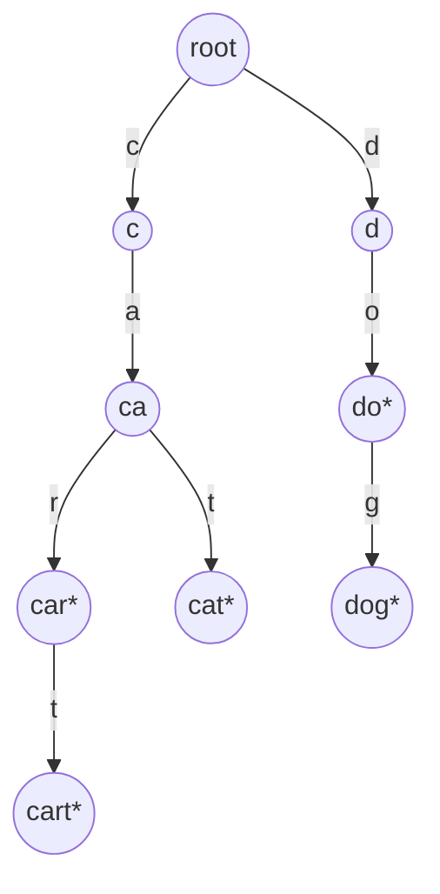
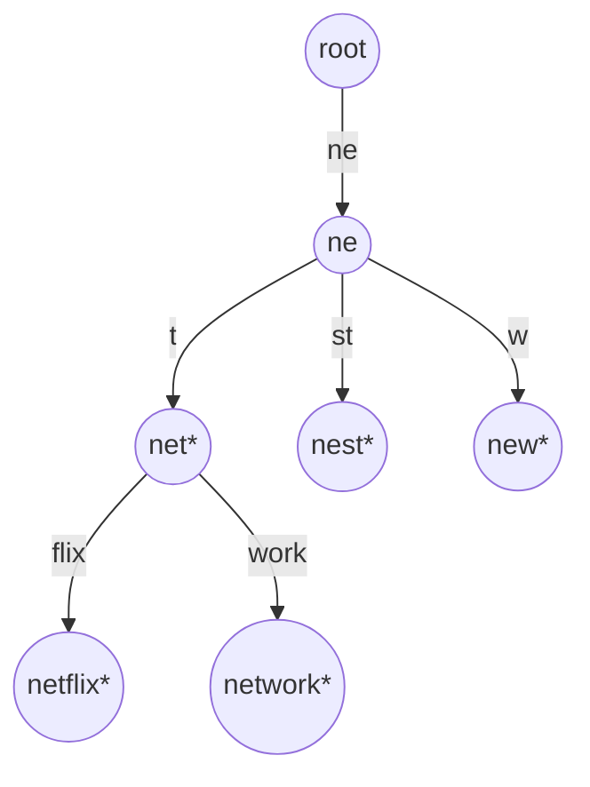

Type "net" into a search box and it suggests "netflix", "network", "netherlands". Type "netw" and the list narrows. A hash set of a million words cannot do this: hashing "netw" tells you whether "netw" itself is a word, and nothing about words that begin with it. You would have to scan all million keys and test each prefix, O(n · L) per keystroke. A sorted array does better, binary search to the first key ≥ "netw" and read forward, O(L log n + results), but insertions cost O(n).

A trie turns the prefix into a *path*. Each character is an edge; every string that starts with "netw" lives in the subtree below the node that "n → e → t → w" reaches. Finding that node costs four steps regardless of how many words the trie holds. That is the whole idea, and everything else is engineering the memory cost down.

## Structure

A trie (from re*trie*val, pronounced "try" by most people to distinguish it from "tree") is a tree in which each node represents a prefix and each edge is labelled with one character. The root is the empty prefix. A node is marked as *terminal* if the prefix it represents is a complete key in the set.



The keys `car`, `cart`, `cat`, `do`, `dog` share nodes for shared prefixes: `car` and `cart` are the same path with one extra edge, and `do` is an internal node that is also terminal. The terminal flag is what distinguishes "this prefix exists" from "this key exists"; forgetting it is the most common trie bug, and it is exactly the difference between `search` and `starts_with`.

```python
class TrieNode:
    __slots__ = ("children", "end")
    def __init__(self):
        self.children = {}    # char -> TrieNode
        self.end = False

class Trie:
    def __init__(self):
        self.root = TrieNode()

    def insert(self, word):
        node = self.root
        for ch in word:
            node = node.children.setdefault(ch, TrieNode())
        node.end = True

    def _walk(self, s):
        node = self.root
        for ch in s:
            node = node.children.get(ch)
            if node is None:
                return None
        return node

    def search(self, word):
        node = self._walk(word)
        return node is not None and node.end

    def starts_with(self, prefix):
        return self._walk(prefix) is not None
```

Every operation walks one character per step, so insert, search and prefix check are all **O(L)** for a key of length L, independent of how many keys are stored. A hash set's lookup is also O(L) (it has to hash the whole string), so for exact membership the two tie asymptotically and the hash set wins on constants. The trie's advantage begins the moment the question involves a prefix.

```viz
{"type": "trie", "algorithm": "insert-search",
 "operations": [["insert", "car"], ["insert", "cart"], ["insert", "cat"], ["insert", "do"], ["insert", "dog"], ["search", "car"], ["search", "ca"], ["prefix", "ca"], ["search", "dot"]],
 "title": "Insert and search in a trie", "caption": "Shared prefixes share nodes. A search that reaches a node must also check the terminal flag; a prefix check does not."}
```

## Autocomplete: enumerating a subtree

Walk to the prefix node, then depth-first traverse its subtree collecting every terminal node's string. The walk is O(L); the enumeration is proportional to the *size of the subtree*, which can be the whole trie if the prefix is empty. Real autocomplete never enumerates: it wants the top `k` suggestions by popularity, which means either a bounded DFS with a heap (the [top-k pattern](/learn/data-structures/heaps/top-k-and-k-way-merge)), or precomputing at each node the `k` best completions below it. The precomputation costs O(k) memory per node and makes each keystroke O(L + k); that is what production search-suggestion services do, with the trie sharded by first character or two across machines.

```viz
{"type": "trie", "algorithm": "prefix-autocomplete",
 "operations": [["insert", "net"], ["insert", "netflix"], ["insert", "network"], ["insert", "nest"], ["insert", "new"], ["prefix", "net"]],
 "title": "Autocomplete from a prefix node", "caption": "Walk to the prefix, then enumerate the subtree. If the children are kept in sorted order, the suggestions come out lexicographically sorted for free."}
```

If children are stored in sorted order (a sorted array, or a map iterated in key order), the DFS yields keys in **lexicographic order** with no sorting step, which is a property hash sets cannot offer at any price.

## Memory: the real cost of a trie

A trie node in the naive representation is expensive. There are three common layouts for the children:

| Children layout | Per-node memory (26 lowercase letters) | Child lookup | Notes |
|---|---|---|---|
| Fixed array of 26 pointers | 26 × 8 = 208 bytes, mostly null | O(1) index | Fast; wasteful; only for small fixed alphabets |
| Hash map | ~200+ bytes in Python for a small dict; ~50 in a compact language | O(1) expected | Handles Unicode; the Python default |
| Sorted array or small vector of (char, child) | 16 bytes per child present | O(log k) or O(k) scan | Compact; children in order; what most production tries use |

For a dictionary of 100,000 English words averaging 8 characters there are roughly 300,000 trie nodes (sharing helps, but most nodes are near the leaves where sharing is rare). With 208-byte array nodes that is 60 MB for 800 KB of raw text: 75× overhead. With compact vectors it is a few megabytes. A hash set of the same words is around 10 MB in Python and 2–3 MB in Rust. So the plain trie is *not* a memory saving over a hash set, despite the intuition that sharing prefixes should help; the per-node overhead dwarfs the sharing. It earns its memory only through the prefix operations.

## Compressed tries: radix trees and Patricia tries

Most trie nodes have exactly one child: the tail of `netflix` after `net` is a chain f → l → i → x with no branching. A **radix tree** (compressed trie, Patricia trie) merges each such chain into a single edge labelled with the whole substring. The node count drops from O(total characters) to O(number of keys), because every internal node now has at least two children.



Insertion and search become string comparisons along edges instead of single-character steps, with the extra case of *splitting* an edge when a new key diverges in the middle of it (inserting `nets` splits the `st` edge of `nest` into `s` then `t`). The code is meaningfully more complex than a plain trie, which is why interview questions ask for the plain version and production libraries ship the compressed one.

Where radix trees run:

- **IP routing.** A router's forwarding table maps prefixes like `10.1.0.0/16` to next hops and must find the *longest* matching prefix for each packet's destination. A binary radix tree over the address bits answers that in at most 32 (or 128) steps; the Linux kernel used a Patricia trie for its routing table for years and now uses a level-compressed variant (LC-trie) for the same job.
- **HTTP routing.** Go's `httprouter` and the routers in Gin and Echo match URL paths against a radix tree of registered routes, so that matching `/users/:id/posts` costs the length of the path, not the number of routes.
- **Kernel page cache.** Linux's `radix_tree` (now the XArray) maps file offsets to cached pages; the keys are integers treated as a sequence of 6-bit digits.
- **Persistent maps.** The hash array mapped trie (HAMT) behind Clojure's and Scala's immutable maps is a trie over hash bits with structural sharing, so "insert" returns a new map that shares almost every node with the old one.
- **Merkle-Patricia tries.** Ethereum's state is a Patricia trie whose node hashes make any key's value cryptographically verifiable from the root hash.

## Tries in interviews

The problem family:

**Implement trie** is the plain structure above. Say the complexity is O(L) per operation and O(total characters) space in the worst case.

**Wildcard search** (`design-add-search-words`): a `.` in the query matches any character, so at a `.` you recurse into every child. The worst case is exponential in the number of dots; say so, and note that a query of all dots is a full traversal.

**Word search on a grid** (`word-search-ii`): find which of thousands of dictionary words can be traced on a letter grid. Backtracking per word is O(words × cells × 4^L). Put the dictionary in a trie and backtrack *once* from each cell, walking the trie in lockstep with the grid: a path that leaves the trie is abandoned immediately. Two refinements interviewers reward: store the full word at the terminal node to avoid rebuilding it, and *prune* a leaf from the trie once its word is found, so the search never rediscovers it.

**Replace words** (shortest prefix that is a dictionary root): walk the trie for each word and stop at the first terminal node.

**Sorting strings**: inserting `n` strings and doing a DFS is a radix sort, O(total characters), which beats comparison sorting when strings are long and share prefixes.

**XOR maximisation**: a binary trie over the bits of integers, walked greedily choosing the opposite bit at each level, finds the maximum XOR pair in O(32 n). It is the same structure with an alphabet of {0, 1}.

## Trie versus hash table versus sorted array

| Operation | Trie | Hash set | Sorted array |
|---|---|---|---|
| Exact lookup | O(L) | O(L) expected, better constants | O(L log n) |
| Insert | O(L) | O(L) amortised | O(n) |
| All keys with prefix p | O(|p| + output) | O(n · |p|) | O(|p| log n + output) |
| Longest prefix of a query that is a key | O(L) | O(L²) (try every prefix) | O(L log n) awkwardly |
| Ordered iteration | Free | Requires sorting | Free |
| Memory | High per node unless compressed | Moderate | Minimal |
| Worst-case guarantees | Yes, no hashing | Hash collisions, resize pauses | Yes |

The senior summary: a hash set for membership, a trie when the queries mention prefixes, a sorted array (or the sorted `keys` of a B-tree) when the set is static or read-heavy and memory matters. And in a language with a good standard library, the "sorted structure" column is often a `BTreeMap` with a `range(prefix..)` query, which gives O(L log n) prefix enumeration with excellent memory and no custom code; that is frequently the pragmatic choice over a hand-written trie.

## Exercises

```exercise
id: implement-trie
title: Implement a trie
prompt: |
  Implement `Trie` with `insert(word)`, `search(word)` (true only if the
  exact word was inserted) and `starts_with(prefix)` (true if any inserted
  word begins with `prefix`). Words are non-empty lowercase strings.

  Use one node object per prefix with a children map and a terminal flag.
  The tests replay operations and compare the returned values.
languages: [python, javascript]
entry: Trie
starter:
  python: |
    class TrieNode:
        def __init__(self):
            self.children = {}
            self.end = False

    class Trie:
        def __init__(self):
            self.root = TrieNode()

        def insert(self, word):
            pass

        def search(self, word):
            return False

        def starts_with(self, prefix):
            return False
  javascript: |
    class TrieNode {
      constructor() { this.children = new Map(); this.end = false; }
    }

    class Trie {
      constructor() { this.root = new TrieNode(); }
      insert(word) {
      }
      search(word) {
        return false;
      }
      starts_with(prefix) {
        return false;
      }
    }
tests:
  - args: [["insert", "apple"], ["search", "apple"], ["search", "app"], ["starts_with", "app"], ["insert", "app"], ["search", "app"]]
    expected: [null, true, false, true, null, true]
  - args: [["insert", "a"], ["insert", "ab"], ["search", "a"], ["search", "ab"], ["search", "abc"], ["starts_with", "abc"]]
    expected: [null, null, true, true, false, false]
    label: a key that is a prefix of another key
  - args: [["search", "x"], ["starts_with", "x"]]
    expected: [false, false]
    label: empty trie
  - args: [["insert", "hello"], ["insert", "help"], ["starts_with", "hel"], ["search", "hel"], ["insert", "hel"], ["search", "hel"], ["starts_with", "helps"]]
    expected: [null, null, true, false, null, true, false]
    hidden: true
hints:
  - "Write one private walk(s) that returns the node reached by s or None; search checks node.end, starts_with checks node is not None."
  - "insert: node = node.children.setdefault(ch, TrieNode()) per character, then set end on the final node."
```

```exercise
id: trie-autocomplete
title: Autocomplete from a word list
prompt: |
  `autocomplete(words, prefix)`: build a trie from `words` (lowercase, may
  contain duplicates) and return every distinct word that starts with
  `prefix`, in **lexicographic order**. An empty prefix returns every
  distinct word. Return `[]` when nothing matches.

  Walk to the prefix node, then depth-first traverse its subtree visiting
  children in sorted character order so the output needs no sort call.
languages: [python, javascript]
entry: autocomplete
starter:
  python: |
    def autocomplete(words, prefix):
        out = []
        return out
  javascript: |
    function autocomplete(words, prefix) {
      const out = [];
      return out;
    }
tests:
  - args: [["car", "cart", "cat", "dog", "cart"], "ca"]
    expected: ["car", "cart", "cat"]
  - args: [["car", "cart", "cat", "dog", "cart"], ""]
    expected: ["car", "cart", "cat", "dog"]
    label: empty prefix returns all distinct words
  - args: [["car", "cart", "cat", "dog"], "z"]
    expected: []
    label: no match
  - args: [["car", "cart", "cat", "dog"], "cart"]
    expected: ["cart"]
    label: prefix is itself a word
  - args: [["app", "apple", "apply", "apt"], "app"]
    expected: ["app", "apple", "apply"]
    hidden: true
  - args: [["b", "ba", "bab", "a"], "ba"]
    expected: ["ba", "bab"]
    hidden: true
hints:
  - "Iterate sorted(node.children) in the DFS; a node that is terminal emits the accumulated string before descending."
  - "Pass the accumulated prefix as a string argument to the DFS, or push/pop characters on a list."
```

## Senior signals

- You describe a trie's cost as **O(L) per operation independent of n**, and you know that for exact lookup a hash set matches it with better constants.
- You know the terminal flag is what separates `search` from `starts_with` and you never forget it.
- You can state the memory problem honestly (a plain trie is *larger* than a hash set for typical dictionaries) and name the fix: compact child storage and path compression.
- You can explain longest-prefix matching in IP routers and URL routers as a radix-tree walk.
- You know the word-search-ii optimisations (store the word at the node, prune found words) and the exponential worst case of wildcard queries.
- You consider a `BTreeMap` range query before hand-writing a trie, and can say when the trie still wins.

## Check yourself

```quiz
- q: >-
    A trie contains "cart" and nothing else. What do search("car") and starts_with("car") return?
  options: ["false, true", "false, false", "true, true", "true, false"]
  answer: 0
  explanation: >-
    The path c-a-r exists (it is a prefix of cart) but the node it reaches is not marked terminal, so search is false and starts_with is true. Confusing the two is the canonical trie bug.
- q: >-
    Why is a plain trie with a 26-pointer array per node usually larger than a hash set of the same words?
  options: ["Most nodes have one child, so ~25 of 26 pointers sit null, and there is a node per character", "Shared prefixes are copied at every branch point, so popular prefixes end up stored many times", "Hash sets compress their keys into one shared buffer, so they use less than the raw text", "Each node also stores the full key string, so every word is duplicated along its path"]
  answer: 0
  explanation: >-
    Prefix sharing saves a little near the root, but the bulk of nodes are near the leaves with a single child each, and each pays for a full 208-byte pointer array. Nothing is duplicated: a trie stores each shared prefix exactly once, which is why the intuition that it saves memory is so tempting. Compact child vectors and path compression recover the memory.
- q: >-
    An HTTP router with 5,000 registered routes matches an incoming path using a radix tree. The match cost is proportional to:
  options: ["The number of registered routes", "The length of the request path", "Path length times the number of routes", "The log of the number of registered routes"]
  answer: 1
  explanation: >-
    A radix walk consumes the path one edge label at a time; the number of registered routes affects only the branching at each node, which is bounded by the alphabet. It is not logarithmic in the route count either: that would be a sorted-array binary search. This is why routers can register thousands of routes at no per-request cost.
- q: >-
    In word-search-ii, why does putting the dictionary in a trie and backtracking once per grid cell beat backtracking once per word?
  options: ["The trie indexes the grid's letters, so each cell's neighbours are found in O(1) time", "The trie makes each grid step O(1) instead of O(L), because no word is compared per step", "The trie removes the need for a visited set, because a grid path can never revisit a trie node", "One grid traversal serves every word, and a path is cut off as soon as it leaves the trie"]
  answer: 3
  explanation: >-
    Per-word backtracking repeats the same grid exploration thousands of times. With a trie, one exploration serves all words, and any path whose prefix is not in the dictionary is pruned immediately. A visited set is still required, because the grid path can loop back to a cell even while the trie walk moves strictly downward.
- q: >-
    You need "all keys with prefix p" over a static set of 10 million short strings, with minimal memory, in Rust. The pragmatic choice is:
  options: ["A sorted Vec or BTreeMap, range-scanning from p until keys stop matching", "A hand-written trie with HashMap children, walking to p then enumerating", "A HashSet of the keys, scanning every key and testing whether it starts with p", "A min-heap of the keys, popping in order until a key no longer starts with p"]
  answer: 0
  explanation: >-
    Sorted storage gives O(L log n + output) prefix enumeration with near-zero overhead per key. A trie gives O(L + output) but costs far more memory, especially with a HashMap per node; for a static set the log factor is a bargain.
```
