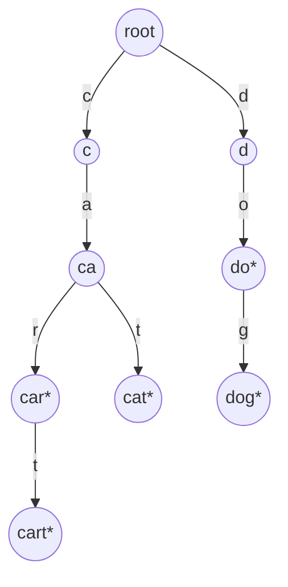
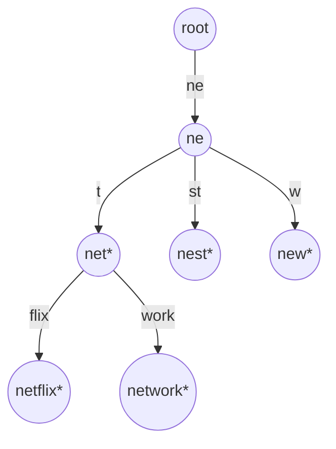

Type "net" into a search box and it suggests "netflix", "network", "netherlands". Type "netw" and the list narrows. A hash set of a million words cannot do this: hashing "netw" tells you whether "netw" itself is a word, and nothing about words that begin with it. You would have to scan all million keys and test each prefix, O(n · L) per keystroke. A sorted array does better, binary search to the first key ≥ "netw" and read forward, O(L log n + results), but insertions cost O(n).

A trie turns the prefix into a *path*. Each character is an edge; every string that starts with "netw" lives in the subtree below the node that "n → e → t → w" reaches. Finding that node costs four steps regardless of how many words the trie holds. That is the whole idea, and everything else is engineering the memory cost down.

## Structure

A trie (from re*trie*val, pronounced "try" by most people to distinguish it from "tree") is a tree in which each node represents a prefix and each edge is labelled with one character. The root is the empty prefix. A node is marked as *terminal* if the prefix it represents is a complete key in the set.



The keys `car`, `cart`, `cat`, `do`, `dog` share nodes for shared prefixes: `car` and `cart` are the same path with one extra edge, and `do` is an internal node that is also terminal. The terminal flag is what distinguishes "this prefix exists" from "this key exists"; forgetting it is the most common trie bug, and it is exactly the difference between `search` and `starts_with`.

```python
class TrieNode:
    __slots__ = ("children", "end")
    def __init__(self):
        self.children = {}    # char -> TrieNode
        self.end = False

class Trie:
    def __init__(self):
        self.root = TrieNode()

    def insert(self, word):
        node = self.root
        for ch in word:
            node = node.children.setdefault(ch, TrieNode())
        node.end = True

    def _walk(self, s):
        node = self.root
        for ch in s:
            node = node.children.get(ch)
            if node is None:
                return None
        return node

    def search(self, word):
        node = self._walk(word)
        return node is not None and node.end

    def starts_with(self, prefix):
        return self._walk(prefix) is not None
```

### Five inserts and three queries, traced

| Operation | Walk | New nodes | Nodes after (excluding root) | Result |
|---|---|---|---|---|
| insert `car` | root → c → a → r, all missing | c, a, r; mark r terminal | 3 | |
| insert `cart` | c, a, r exist; t missing under r | t (terminal) | 4 | |
| insert `cat` | c, a exist; t missing under a | t (terminal) | 5 | |
| insert `do` | d, o missing | d, o (terminal) | 7 | |
| insert `dog` | d, o exist; g missing | g (terminal) | 8 | |
| search `car` | c → a → r, exists | | | r is terminal: **true** |
| search `ca` | c → a, exists | | | a is not terminal: **false** |
| starts_with `ca` | c → a, exists | | | node exists: **true** |
| search `dot` | d → o → t missing | | | walk fails: **false** |

Fifteen characters were inserted and eight nodes were created: prefix sharing saved seven. That ratio, nodes to characters, is the number that decides whether a trie is worth its memory, and the measurements below show it is usually far worse than this toy suggests.

Every operation walks one character per step, so insert, search and prefix check are all **O(L)** for a key of length L, independent of how many keys are stored. A hash set's lookup is also O(L) (it has to hash the whole string), so for exact membership the two tie asymptotically and the hash set wins on constants: one hash computation and one or two probes against L dictionary lookups, each a hash of a one-character string and a probe. The trie's advantage begins the moment the question involves a prefix.

```viz
{"type": "trie", "algorithm": "insert-search",
 "operations": [["insert", "car"], ["insert", "cart"], ["insert", "cat"], ["insert", "do"], ["insert", "dog"], ["search", "car"], ["search", "ca"], ["prefix", "ca"], ["search", "dot"]],
 "title": "Insert and search in a trie", "caption": "Shared prefixes share nodes. A search that reaches a node must also check the terminal flag; a prefix check does not."}
```

### Deletion, which the interview version skips

Removing `cart` must unmark its t node and then delete it, because nothing else uses it. Removing `cat` while `car` exists must delete the t under a and then stop, because a and c are shared. Removing `car` after `cart` is gone deletes r, then a, then c, because each is left childless and non-terminal. The rule: walk down recording the path, unmark the terminal, then walk back up deleting each node that is non-terminal and childless, stopping at the first node that is neither. Skipping the cleanup is a memory leak that grows with churn; deleting without checking children corrupts every key that shares the prefix.

## Autocomplete: enumerating a subtree

Walk to the prefix node, then depth-first traverse its subtree collecting every terminal node's string. The walk is O(L); the enumeration is proportional to the *size of the subtree*, which can be the whole trie if the prefix is empty. Real autocomplete never enumerates: it wants the top `k` suggestions by popularity, which means either a bounded DFS with a heap (the [top-k pattern](/learn/data-structures/heaps/top-k-and-k-way-merge)), or precomputing at each node the `k` best completions below it.

```viz
{"type": "trie", "algorithm": "prefix-autocomplete",
 "operations": [["insert", "net"], ["insert", "netflix"], ["insert", "network"], ["insert", "nest"], ["insert", "new"], ["prefix", "net"]],
 "title": "Autocomplete from a prefix node", "caption": "Walk to the prefix, then enumerate the subtree. If the children are kept in sorted order, the suggestions come out lexicographically sorted for free."}
```

If children are stored in sorted order (a sorted array, or a map iterated in key order), the DFS yields keys in **lexicographic order** with no sorting step, which is a property hash sets cannot offer at any price.

### How autocomplete is actually served

The precomputed version stores `k` (typically 5–10) completions at every node, so a keystroke costs O(L + k) and no traversal. The costs: O(k) extra words per node, and when a completion's popularity changes, every node on its path (L of them) may need its list recomputed, O(L · k log k). At web scale the trie is not one object: it is sharded by the first one or two characters, the hot prefixes are cached, and the "trie" is frequently deployed as a key-value table from prefix to top-k list, because the set of prefixes is at most the total number of characters in the corpus and a KV store shards and replicates without custom code. Redis users build the same thing with a sorted set and a lexicographic range query (`ZRANGE … BYLEX`; the older `ZRANGEBYLEX` is deprecated since Redis 6.2), which is the sorted-array column of the comparison table below. The trie is the way to *think* about the problem; the deployment is whatever gives O(L) lookup with the operational properties you need.

## Memory: the real cost of a trie

A trie node in the naive representation is expensive. There are three common layouts for the children:

| Children layout | Per-node memory (26 lowercase letters) | Child lookup | Notes |
|---|---|---|---|
| Fixed array of 26 pointers | 26 × 8 = 208 bytes, mostly null | O(1) index | Fast; wasteful; only for small fixed alphabets |
| Hash map | 184 bytes for a CPython dict of 1–5 keys, plus the node; a few tens of bytes in a compact language | O(1) expected | Handles Unicode; the Python default |
| Sorted array or small vector of (char, child) | about 16 bytes per child present | O(log k) or O(k) scan | Compact; children in order; what most production tries use |

Measured (CPython 3.14, `tracemalloc`) on the 19,385 distinct lowercase words in this curriculum's own text, 141,348 characters, average length 7.3:

| Structure | Objects | Bytes | Per unit |
|---|---|---|---|
| Trie, `__slots__` nodes with a dict of children | 49,715 nodes | 9.9 MB | 200 bytes per node |
| Trie, plain-object nodes (`__dict__` plus a children dict) | 49,715 nodes | 11.9 MB | 240 bytes per node |
| `set` of the words, including the string objects | 19,385 strings | about 1.5 MB | 27 bytes per entry plus 42 + L per string |
| Fixed 26-pointer array nodes, arithmetic only | 49,715 nodes | 10.3 MB of pointers before node headers | 208 bytes per node |
| Raw text | | 0.14 MB | |

The trie is roughly seven times the hash set and seventy times the raw text. The reason is in the shape: 49,715 nodes for 141,348 characters means sharing removed only 65% of the characters, and 58% of the surviving nodes have exactly one child. Prefix sharing is dense near the root, where the nodes are few, and almost absent near the leaves, where the nodes are many; each of those leaf-ward nodes pays the full per-node overhead to store one character. The trie is *not* a memory saving over a hash set, despite the intuition that sharing prefixes should help. It earns its memory only through the prefix operations, and production tries recover most of it with the techniques below.

## Compressed tries: radix trees and Patricia tries

Most trie nodes have exactly one child: the tail of `netflix` after `net` is a chain f → l → i → x with no branching. A **radix tree** (compressed trie, Patricia trie) merges each such chain into a single edge labelled with the whole substring. Every internal node now has at least two children or is terminal, so the node count drops from O(total characters) to O(number of keys): on the corpus above, 23,665 nodes instead of 49,715, and each remaining node stores a label as a (start, length) slice into a key rather than a copy.



### Insertion with an edge split, traced

Search and insertion become string comparisons along edges. Insert `nets`: at the root, the edge `ne` matches the first two characters; at node `ne`, the edge `t` matches; at `net` (terminal), the remaining `s` matches no edge, so add an edge `s` to a new terminal leaf. No split. Now insert `nap`: at the root the edge `ne` and the key share only `n`. The edge must be **split**: replace `ne` with `n` to a new internal node, hang the old subtree from it under the edge `e`, and add the edge `ap` to a new leaf.

| Step | Root's edges | Node `n`'s edges |
|---|---|---|
| before | `ne` → (ne) | |
| split `ne` at length 1 | `n` → (n) | `e` → (ne) |
| add the new key's remainder | `n` → (n) | `e` → (ne), `ap` → (nap*) |

Deletion is the mirror image: after removing a leaf, a node left with one child and no terminal flag is merged back into its parent's edge. The code is meaningfully more complex than a plain trie, which is why interview questions ask for the plain version and production libraries ship the compressed one.

### Where radix trees run

- **IP routing.** A forwarding table maps prefixes like `10.1.0.0/16` to next hops and must find the *longest* matching prefix for each packet's destination. A binary radix tree over the address bits answers that in at most 32 (or 128) steps; the Linux kernel's IPv4 FIB is a level-compressed trie (LC-trie), and the global BGP table it may hold was about 1.08 million IPv4 prefixes in September 2026 according to the [CIDR Report](https://www.cidr-report.org/as2.0/). A hash table cannot do longest-prefix match without one lookup per possible prefix length.
- **HTTP routing.** Go's `httprouter` and the routers in Gin and Echo match URL paths against a radix tree of registered routes, so that matching `/users/:id/posts` costs the length of the path, not the number of routes.
- **Kernel page cache.** Linux's `radix_tree` (now the XArray) maps file offsets to cached pages; the keys are integers treated as a sequence of 6-bit digits, 64 children per node.
- **Persistent maps.** The hash array mapped trie (HAMT) behind Clojure's and Scala's immutable maps is a trie over 5-bit chunks of the key's *hash*: each node holds a 32-bit bitmap of which children exist and a dense array of only those children, indexed by a population count of the bitmap below the wanted bit, so a node with three children costs three pointers and four bytes, not 32 pointers. Depth is at most seven for a 32-bit hash, and an insert copies only the nodes on one path, so the "new" map shares almost everything with the old one.
- **Merkle-Patricia tries.** Ethereum's state is a Patricia trie whose node hashes make any key's value cryptographically verifiable from the root hash.

## Under the hood: two more layouts worth knowing

**Double-array tries** store the whole trie in two integer arrays, `base` and `check`. The child of state `s` on character `c` is at index `t = base[s] + code(c)`, and the transition is valid only if `check[t] == s`. A lookup is two array reads per character with no pointer chasing and no hashing, and a well-packed double array costs about 8 bytes per state (two 32-bit integers) against the 200 measured above. The price is construction: placing each node means finding a `base` value at which all its children's slots are free, and inserting into a built array can force relocations. This is the layout inside Japanese and Chinese tokenisers such as MeCab (via the Darts library), where the dictionary is static and looked up billions of times.

**Minimal automata (DAWGs and FSTs)** go one step further than a radix tree by sharing *suffixes* as well as prefixes: `nation` and `station` share the `ation` tail. A trie that shares suffixes is a directed acyclic graph, a DAWG, and with values attached to transitions it is a finite state transducer. Lucene's terms index has been an FST since version 4.0: per field, it maps term prefixes to the on-disk blocks of the term dictionary, so an index over tens of millions of terms stays small (how small depends on how much the terms share). Elasticsearch's completion suggester is built on Lucene's FST-based suggester and keeps its structure in memory for the same reason: an FST is the smallest structure that still answers prefix queries in O(L). The [Aho-Corasick lesson](/learn/advanced-data-structures/advanced-strings/aho-corasick) builds on the same automaton view for multi-pattern matching.

## Tries in interviews

**Implement trie** is the plain structure above. Say the complexity is O(L) per operation and O(total characters) space in the worst case.

**Wildcard search** (`design-add-search-words`): a `.` in the query matches any character, so at a `.` you recurse into every child. The worst case is exponential in the number of dots; a query of all dots is a full traversal, and a service that accepts such queries from users needs a dot limit.

**Word search on a grid** (`word-search-ii`): find which of thousands of dictionary words can be traced on a letter grid. Backtracking per word is O(words × cells × 4^L). Put the dictionary in a trie and backtrack *once* from each cell, walking the trie in lockstep with the grid: a path that leaves the trie is abandoned immediately. Two refinements interviewers reward: store the full word at the terminal node to avoid rebuilding it, and *prune* a leaf from the trie once its word is found, so the search never rediscovers it.

**Replace words** (shortest prefix that is a dictionary root): walk the trie for each word and stop at the first terminal node.

**Sorting strings**: inserting `n` strings and doing a DFS is a radix sort, O(total characters), which beats comparison sorting when strings are long and share prefixes.

**XOR maximisation**: a binary trie over the bits of integers, walked greedily choosing the opposite bit at each level, finds the maximum XOR pair in O(32 n). It is the same structure with an alphabet of {0, 1}.

## Trie versus hash table versus sorted array

| Operation | Trie | Hash set | Sorted array |
|---|---|---|---|
| Exact lookup | O(L) | O(L) expected, better constants | O(L log n) |
| Insert | O(L) | O(L) amortised | O(n) |
| All keys with prefix p | O(|p| + output) | O(n · |p|) | O(|p| log n + output) |
| Longest prefix of a query that is a key | O(L) | O(L²) (try every prefix) | O(L log n) awkwardly |
| Ordered iteration | Free | Requires sorting | Free |
| Memory | High per node unless compressed (measured 7× a hash set) | Moderate | Minimal |
| Worst-case guarantees | Yes, no hashing | Hash collisions, resize pauses | Yes |

The senior summary: a hash set for membership, a trie when the queries mention prefixes, a sorted array (or the sorted `keys` of a B-tree) when the set is static or read-heavy and memory matters. In a language with a good standard library, the "sorted structure" column is often a `BTreeMap` with a `range(prefix..)` query, which gives O(L log n) prefix enumeration with excellent memory and no custom code; the [ordered maps lesson](/learn/data-structures/hashing/ordered-maps-vs-hash-maps) covers when that is the pragmatic choice over a hand-written trie.

## Production failure modes

**The autocomplete service runs out of memory after a dictionary refresh.** Symptom: RSS several times the size of the word list; OOM kills after a larger dictionary ships. Diagnosis: a plain trie with a dict per node at about 200 bytes per node, and nodes outnumber words two to three to one. Fix: a radix tree with compact child arrays, a double-array or FST build for a static dictionary, or a prefix-to-top-k table in a KV store.

**A wildcard query pins a core.** Symptom: p99 latency spikes; the slow requests all contain many `.` characters. Diagnosis: each dot fans out to every child, exponential in the number of dots. Fix: cap the number of wildcards, cap the result count, and time-box the traversal.

**The same word is "missing" for some users.** Symptom: `résumé` is found for one client and not another. Diagnosis: one client sends the precomposed `é` (one code point), the other sends `e` plus a combining accent (two code points); they take different paths. Case differences do the same. Fix: normalise (NFC or NFKC, casefold) at both insert and query, as the [strings lesson](/learn/data-structures/arrays-strings/strings-in-depth) explains.

**Deletes leak or corrupt.** Symptom: memory grows with churn even though the key count is flat, or deleting `cat` makes `car` disappear. Diagnosis: deletion that only clears the terminal flag (leak) or deletes every node on the path (corruption). Fix: unwind the path deleting only nodes that are non-terminal and childless.

**Readers see half-inserted keys.** Symptom: a prefix query occasionally returns a word that "does not exist yet" or misses one that does. Diagnosis: concurrent inserts mutate the shared structure while readers walk it. Fix: a lock, or a persistent (copy-on-write) trie where readers hold an immutable root and writers publish a new one, which is what HAMT-based maps give you for free.

## Interviewer follow-ups

**"Top 10 suggestions per keystroke for a billion queries a day. Design it."** Model answer: precompute top-k per prefix, shard by prefix, cache hot prefixes, serve from memory in O(L + k); rebuild offline from query logs with a decay on popularity. Common wrong answer: "walk the trie and collect all completions, then sort", which is O(subtree) per keystroke.

**"How do you delete a word without breaking others?"** Model answer: walk down recording the path, unmark the terminal, then walk up removing nodes that are non-terminal and childless. Common wrong answer: delete every node on the path, or only clear the flag.

**"Why can a hash table not do longest-prefix match for IP routing?"** Model answer: it can only answer exact membership, so it needs one lookup per possible prefix length (up to 32 for IPv4, 128 for IPv6) unless the lengths are bucketed; a radix tree walks the bits once and remembers the last terminal node it passed. Common wrong answer: "hash the whole address".

**"A hundred million URLs, prefix queries, memory is tight."** Model answer: not a pointer trie; a radix tree with compact arrays, or a static build as a double array or FST, or a sorted array with binary search if updates are rare. Common wrong answer: "a trie with a hash map per node", which is the measured 7× blow-up.

**"Your trie stores case-sensitive keys and users type lower case."** Model answer: normalise at insert and query, decide a policy for accents (NFC plus casefold), and store the display form at the terminal node. Common wrong answer: insert every case variant.

## What mid-level engineers get wrong

- **Forgetting the terminal flag**, so `search("ca")` returns true because the path exists.
- **Claiming a trie saves memory over a hash set.** Measured: about seven times more, unless compressed.
- **Enumerating a whole subtree per keystroke** instead of precomputing or bounding the top-k.
- **Deleting by clearing the flag only**, which leaks, or by removing the path, which corrupts shared prefixes.
- **Accepting unbounded wildcard queries** from users.
- **Skipping Unicode normalisation**, so the same word has two spellings in the trie.
- **Hand-writing a trie where a `BTreeMap` range query or a sorted-set range would do**, and shipping more code with worse memory.

## Exercises

```exercise
id: implement-trie
title: Implement a trie
prompt: |
  Implement `Trie` with `insert(word)`, `search(word)` (true only if the
  exact word was inserted) and `starts_with(prefix)` (true if any inserted
  word begins with `prefix`). Words are non-empty lowercase strings.

  Use one node object per prefix with a children map and a terminal flag.
  The tests replay operations and compare the returned values.
languages: [python, javascript]
entry: Trie
starter:
  python: |
    class TrieNode:
        def __init__(self):
            self.children = {}
            self.end = False

    class Trie:
        def __init__(self):
            self.root = TrieNode()

        def insert(self, word):
            pass

        def search(self, word):
            return False

        def starts_with(self, prefix):
            return False
  javascript: |
    class TrieNode {
      constructor() { this.children = new Map(); this.end = false; }
    }

    class Trie {
      constructor() { this.root = new TrieNode(); }
      insert(word) {
      }
      search(word) {
        return false;
      }
      starts_with(prefix) {
        return false;
      }
    }
tests:
  - args: [["insert", "apple"], ["search", "apple"], ["search", "app"], ["starts_with", "app"], ["insert", "app"], ["search", "app"]]
    expected: [null, true, false, true, null, true]
  - args: [["insert", "a"], ["insert", "ab"], ["search", "a"], ["search", "ab"], ["search", "abc"], ["starts_with", "abc"]]
    expected: [null, null, true, true, false, false]
    label: a key that is a prefix of another key
  - args: [["search", "x"], ["starts_with", "x"]]
    expected: [false, false]
    label: empty trie
  - args: [["insert", "hello"], ["insert", "help"], ["starts_with", "hel"], ["search", "hel"], ["insert", "hel"], ["search", "hel"], ["starts_with", "helps"]]
    expected: [null, null, true, false, null, true, false]
    hidden: true
hints:
  - "Write one private walk(s) that returns the node reached by s or None; search checks node.end, starts_with checks node is not None."
  - "insert: node = node.children.setdefault(ch, TrieNode()) per character, then set end on the final node."
```

```exercise
id: trie-autocomplete
title: Autocomplete from a word list
prompt: |
  `autocomplete(words, prefix)`: build a trie from `words` (lowercase, may
  contain duplicates) and return every distinct word that starts with
  `prefix`, in **lexicographic order**. An empty prefix returns every
  distinct word. Return `[]` when nothing matches.

  Walk to the prefix node, then depth-first traverse its subtree visiting
  children in sorted character order so the output needs no sort call.
languages: [python, javascript]
entry: autocomplete
starter:
  python: |
    def autocomplete(words, prefix):
        out = []
        return out
  javascript: |
    function autocomplete(words, prefix) {
      const out = [];
      return out;
    }
tests:
  - args: [["car", "cart", "cat", "dog", "cart"], "ca"]
    expected: ["car", "cart", "cat"]
  - args: [["car", "cart", "cat", "dog", "cart"], ""]
    expected: ["car", "cart", "cat", "dog"]
    label: empty prefix returns all distinct words
  - args: [["car", "cart", "cat", "dog"], "z"]
    expected: []
    label: no match
  - args: [["car", "cart", "cat", "dog"], "cart"]
    expected: ["cart"]
    label: prefix is itself a word
  - args: [["app", "apple", "apply", "apt"], "app"]
    expected: ["app", "apple", "apply"]
    hidden: true
  - args: [["b", "ba", "bab", "a"], "ba"]
    expected: ["ba", "bab"]
    hidden: true
hints:
  - "Iterate sorted(node.children) in the DFS; a node that is terminal emits the accumulated string before descending."
  - "Pass the accumulated prefix as a string argument to the DFS, or push/pop characters on a list."
```

## Senior signals

- You describe a trie's cost as **O(L) per operation independent of n**, and you know that for exact lookup a hash set matches it with better constants.
- You know the terminal flag is what separates `search` from `starts_with`, you never forget it, and you can delete a key without leaking or corrupting.
- You can state the memory problem with a number (a dict-per-node trie measured at about 200 bytes per node and seven times a hash set) and name the fixes in order: compact child arrays, path compression, double arrays or FSTs for static sets.
- You can explain longest-prefix matching in IP routers and URL routers as a radix-tree walk, and why a hash table cannot do it in one lookup.
- You know how autocomplete is actually served: top-k per prefix precomputed, sharded, cached, often in a KV store rather than a pointer structure.
- You know the word-search-ii optimisations (store the word at the node, prune found words) and the exponential worst case of wildcard queries.
- You consider a `BTreeMap` range query or a sorted-set range before hand-writing a trie, and can say when the trie still wins.

## Check yourself

```quiz
- q: >-
    A trie contains "cart" and nothing else. What do search("car") and starts_with("car") return?
  options: ["false, true", "true, false", "false, false", "true, true"]
  answer: 0
  explanation: >-
    The path c-a-r exists (it is a prefix of cart) but the node it reaches is not marked terminal, so search is false and starts_with is true. Confusing the two is the canonical trie bug.
- q: >-
    Why is a plain trie with a 26-pointer array per node usually larger than a hash set of the same words?
  options: ["Hash sets compress their keys into one shared buffer, so they use less than the raw text", "Shared prefixes are copied at every branch point, so popular prefixes end up stored many times", "Most nodes have one child, so ~25 of 26 pointers sit null, and there is a node per character", "Each node also stores the full key string, so every word is duplicated along its path"]
  answer: 2
  explanation: >-
    Prefix sharing saves a little near the root, but the bulk of nodes are near the leaves with a single child each (58% in the measured corpus), and each pays for a full 208-byte pointer array. Nothing is duplicated: a trie stores each shared prefix exactly once, which is why the intuition that it saves memory is so tempting. Compact child vectors and path compression recover the memory.
- q: >-
    An HTTP router with 5,000 registered routes matches an incoming path using a radix tree. The match cost is proportional to:
  options: ["Path length times the number of routes", "The length of the request path", "The log of the number of registered routes", "The number of registered routes"]
  answer: 1
  explanation: >-
    A radix walk consumes the path one edge label at a time; the number of registered routes affects only the branching at each node, which is bounded by the alphabet. It is not logarithmic in the route count either: that would be a sorted-array binary search. This is why routers can register thousands of routes at no per-request cost.
- q: >-
    Deleting the key "cat" from a trie that also holds "car" and "cart" must:
  options: ["Unmark the terminal flag only, leaving all nodes in place for later reuse", "Remove every node on the path c-a-t, since the key is no longer present", "Unmark the terminal, then remove only nodes that are childless and non-terminal on the way up", "Rebuild the trie from the remaining keys, since in-place deletion is unsafe"]
  answer: 2
  explanation: >-
    The t node under a is childless and non-terminal after unmarking, so it goes; a and c are shared with car and cart, so the unwinding stops there. Removing the whole path corrupts the shared keys, and clearing only the flag leaks a node per deleted key.
- q: >-
    In word-search-ii, why does putting the dictionary in a trie and backtracking once per grid cell beat backtracking once per word?
  options: ["The trie removes the need for a visited set, because a grid path can never revisit a trie node", "One grid traversal serves every word, and a path is cut off as soon as it leaves the trie", "The trie makes each grid step O(1) instead of O(L), because no word is compared per step", "The trie indexes the grid's letters, so each cell's neighbours are found in O(1) time"]
  answer: 1
  explanation: >-
    Per-word backtracking repeats the same grid exploration thousands of times. With a trie, one exploration serves all words, and any path whose prefix is not in the dictionary is pruned immediately. A visited set is still required, because the grid path can loop back to a cell even while the trie walk moves strictly downward.
- q: >-
    You need "all keys with prefix p" over a static set of 10 million short strings, with minimal memory, in Rust. The pragmatic choice is:
  options: ["A hand-written trie with HashMap children, walking to p then enumerating", "A HashSet of the keys, scanning every key and testing whether it starts with p", "A min-heap of the keys, popping in order until a key no longer starts with p", "A sorted Vec or BTreeMap, range-scanning from p until keys stop matching"]
  answer: 3
  explanation: >-
    Sorted storage gives O(L log n + output) prefix enumeration with near-zero overhead per key. A trie gives O(L + output) but costs far more memory, especially with a HashMap per node; for a static set the log factor is a bargain, and a double-array or FST build is the next step only if the log factor matters.
```
