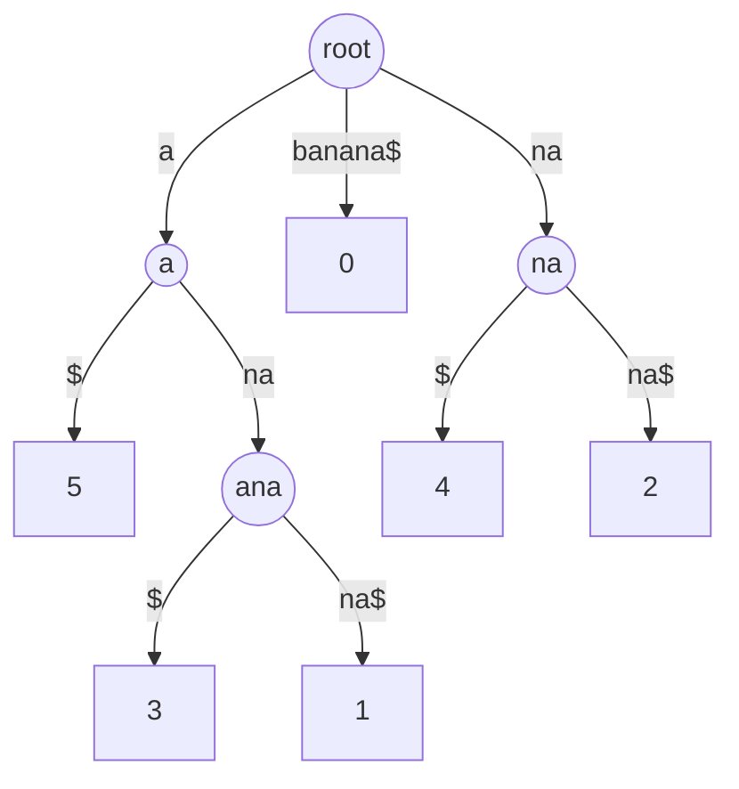

[KMP](/learn/data-structures/tries-and-string-structures/string-matching) preprocesses the *pattern* so that one search over the text is linear. That is the right shape when the text changes and the pattern is fixed, like a filter over a log stream. Flip it: a fixed text (a genome, a code base, a document corpus) and thousands of different patterns. Now every query re-reads the whole text, O(n) each, and a 3-billion-character genome cannot be rescanned for every 20-character read.

The fix is to preprocess the *text*. Every substring of a text is a prefix of some suffix, so if you index all `n` suffixes, "does pattern P occur?" becomes "does any suffix start with P?", which is a prefix query over a set of strings, and the [trie lesson](/learn/data-structures/tries-and-string-structures/tries) showed what to do with those. A suffix trie holds every suffix; a suffix tree compresses it; a suffix array is the same information in a sorted array of integers, and it is what you actually build.

## The suffix trie, and why you cannot afford it

Insert every suffix of `banana` (`banana`, `anana`, `nana`, `ana`, `na`, `a`) into a trie. Searching for `nan` walks n → a → n and succeeds; searching for `nab` fails at `b`. Every substring query is O(m).

```viz
{"type": "trie", "algorithm": "insert-search",
 "operations": [["insert", "banana"], ["insert", "anana"], ["insert", "nana"], ["insert", "ana"], ["insert", "na"], ["insert", "a"], ["prefix", "nan"], ["prefix", "nab"], ["prefix", "ana"]],
 "title": "A suffix trie of banana", "caption": "Every substring is a prefix of some suffix, so a prefix query on the suffixes is a substring query on the text. The trie has O(n²) nodes."}
```

The suffix trie has up to n(n + 1)/2 nodes, one per distinct substring: for a 1 MB text that is on the order of 5 × 10¹¹ nodes. A **suffix tree** applies the radix-tree compression from the trie lesson, merging single-child chains into labelled edges, and because there are only `n` leaves the tree has at most `2n − 1` nodes. Ukkonen's algorithm builds it in O(n), and it answers substring search in O(m), longest repeated substring in O(n), longest common substring of two texts in O(n), and dozens of other classic questions in linear time.



The suffix tree of `banana$`. Leaves are labelled with the suffix's starting index; the `$` terminator guarantees no suffix is a prefix of another, so every suffix ends at a leaf.

The suffix tree is rarely built. Each node needs a child map, a parent pointer, a suffix link and an edge label as a (start, end) pair; a straightforward implementation costs 20–40 bytes per node and up to 2n nodes, so 40–80 bytes per text character (space-optimised implementations shrink this but stay well above a suffix array), and the pointer-chasing construction is cache-hostile. For a human genome that is well over 100 GB. The suffix array holds the same ordering in 4–8 bytes per character.

## The suffix array

Sort all suffixes lexicographically; the suffix array `sa` lists their starting positions in that order. For `banana`:

| rank | sa[rank] | suffix |
|---|---|---|
| 0 | 5 | a |
| 1 | 3 | ana |
| 2 | 1 | anana |
| 3 | 0 | banana |
| 4 | 4 | na |
| 5 | 2 | nana |

`sa = [5, 3, 1, 0, 4, 2]`. Six integers; the text itself supplies the characters. This is the suffix tree's leaves read left to right.

### Substring search, traced

The suffixes starting with `P` form a contiguous block in sorted order, so two binary searches find the block: the first suffix ≥ P, then the first suffix that does not start with P. Every position in the block is an occurrence, and the block width is the occurrence count.

```python
def search(text, sa, pattern):
    lo, hi = 0, len(sa)
    while lo < hi:                          # first suffix >= pattern
        mid = (lo + hi) // 2
        if text[sa[mid]:sa[mid] + len(pattern)] < pattern:
            lo = mid + 1
        else:
            hi = mid
    start = lo
    hi = len(sa)
    while lo < hi:                          # first suffix that does not start with pattern
        mid = (lo + hi) // 2
        if text[sa[mid]:sa[mid] + len(pattern)] == pattern:
            lo = mid + 1
        else:
            hi = mid
    return sa[start:lo]                     # occurrences, in suffix order
```

Search `ana` in `banana`:

| Phase | lo | hi | mid | suffix at sa[mid] | comparison | next |
|---|---|---|---|---|---|---|
| lower | 0 | 6 | 3 | banana | `ban` < `ana`? no | hi = 3 |
| lower | 0 | 3 | 1 | ana | `ana` < `ana`? no | hi = 1 |
| lower | 0 | 1 | 0 | a | `a` < `ana`? yes | lo = 1 |
| upper | 1 | 6 | 3 | banana | starts with `ana`? no | hi = 3 |
| upper | 1 | 3 | 2 | anana | starts with `ana`? yes | lo = 3 |

The block is ranks 1 and 2, so `ana` occurs twice, at positions `sa[1] = 3` and `sa[2] = 1`. Five comparisons, each reading at most three characters: O(m log n). Note the slice `text[sa[mid]:sa[mid] + m]`: comparing the *whole* suffix instead would cost O(n) per comparison on repetitive text. With the LCP array and some care the search drops to O(m + log n), because characters already known to match need not be re-read.

### Construction: prefix doubling

The naive build sorts `n` suffixes with a comparison sort, and each comparison can cost O(n), so O(n² log n); on `aaaa…a` every comparison really does scan to the end. In Python the naive `sorted(range(n), key=lambda i: s[i:])` has a worse problem than time: the key slices materialise every suffix, n²/2 characters, which is 32 MB at n = 8,000 and would be 500 GB at n = 10⁶. The standard practical algorithm is **prefix doubling** (Manber and Myers): sort suffixes by their first character, then by their first 2 characters, then 4, 8, …, and each round is a sort of *pairs of ranks from the previous round*, which are small integers.

The key observation: the first `2k` characters of suffix `i` are the first `k` characters of suffix `i` followed by the first `k` characters of suffix `i + k`. If you already know the rank of every suffix by its first `k` characters, the rank by `2k` characters is the rank of the pair `(rank_k[i], rank_k[i + k])`, with a sentinel for `i + k ≥ n`.

```python
def suffix_array(s):
    n = len(s)
    rank = [ord(c) for c in s]
    sa = list(range(n))
    k = 1
    while True:
        key = lambda i: (rank[i], rank[i + k] if i + k < n else -1)
        sa.sort(key=key)
        new = [0] * n
        for idx in range(1, n):
            new[sa[idx]] = new[sa[idx - 1]] + (key(sa[idx]) != key(sa[idx - 1]))
        rank = new
        if n == 0 or rank[sa[-1]] == n - 1:     # all ranks distinct: sorted
            break
        k *= 2
    return sa
```

### Doubling, traced on banana

Round 0 (single characters): ranks by character are `b = 1, a = 0, n = 2`, so `rank = [1, 0, 2, 0, 2, 0]`. Round `k = 1`, pairs `(rank[i], rank[i + 1])`:

| i | pair | covers | sorted position | new rank |
|---|---|---|---|---|
| 5 | (0, −1) | a | 0 | 0 |
| 1 | (0, 2) | an | 1 | 1 |
| 3 | (0, 2) | an | 2 | 1 (tie) |
| 0 | (1, 0) | ba | 3 | 2 |
| 2 | (2, 0) | na | 4 | 3 |
| 4 | (2, 0) | na | 5 | 3 (tie) |

New ranks `[2, 1, 3, 1, 3, 0]`, with ties between 1/3 and 2/4. Round `k = 2`, pairs `(rank[i], rank[i + 2])`:

| i | pair | covers | sorted position |
|---|---|---|---|
| 5 | (0, −1) | a | 0 |
| 3 | (1, 0) | ana | 1 |
| 1 | (1, 1) | anan | 2 |
| 0 | (2, 3) | bana | 3 |
| 4 | (3, −1) | na | 4 |
| 2 | (3, 3) | nana | 5 |

All distinct, done: `sa = [5, 3, 1, 0, 4, 2]`. Each round is a sort of `n` integer pairs, O(n log n) with a comparison sort or O(n) with radix sort. The number of rounds is not log n but about log₂ of the longest repeated substring plus one, because ranks stay tied as long as suffixes agree: `banana` needs 2 rounds, `a` × 64 needs 6, and a genome with long repeats needs many. Total O(n log² n) with `sort`, O(n log n) with radix sort. Linear-time constructions exist (SA-IS, DC3), and induced-sorting builds such as libsais, an SA-IS implementation, are what production code uses; prefix doubling is what you write by hand.

## The LCP array

The suffix array alone loses one thing the suffix tree had: the *internal nodes*, which encode how much adjacent suffixes share. The **LCP array** restores it: `lcp[i]` is the length of the longest common prefix of the suffixes `sa[i − 1]` and `sa[i]`. For `banana`:

| i | suffix | lcp[i] |
|---|---|---|
| 0 | a | 0 |
| 1 | ana | 1 (with `a`) |
| 2 | anana | 3 (with `ana`) |
| 3 | banana | 0 |
| 4 | na | 0 |
| 5 | nana | 2 (with `na`) |

Computing each entry by direct comparison is O(n²) in the worst case. **Kasai's algorithm** does it in O(n) using one fact: if suffix `i` has LCP `h` with its predecessor in sorted order, then suffix `i + 1` (drop the first character) has LCP at least `h − 1` with *its* predecessor. So process suffixes in text order, and the comparison for each can start from `h − 1` instead of 0; `h` decreases at most `n` times in total, so it can increase at most `2n` times.

```python
def lcp_array(s, sa):
    n = len(s)
    rank = [0] * n
    for i, p in enumerate(sa):
        rank[p] = i
    lcp = [0] * n
    h = 0
    for i in range(n):                    # i = text position
        if rank[i] > 0:
            j = sa[rank[i] - 1]           # predecessor suffix in sorted order
            while i + h < n and j + h < n and s[i + h] == s[j + h]:
                h += 1
            lcp[rank[i]] = h
            if h > 0:
                h -= 1
        else:
            h = 0
    return lcp
```

### Kasai, traced

| text position i | suffix | rank | predecessor in sorted order | h at start | characters compared | lcp | h carried |
|---|---|---|---|---|---|---|---|
| 0 | banana | 3 | anana | 0 | b vs a | 0 | 0 |
| 1 | anana | 2 | ana | 0 | a, n, a match, then n vs end | 3 | 2 |
| 2 | nana | 5 | na | 2 | skip 2, then n vs end | 2 | 1 |
| 3 | ana | 1 | a | 1 | skip 1, then n vs end | 1 | 0 |
| 4 | na | 4 | banana | 0 | n vs b | 0 | 0 |
| 5 | a | 0 | none | | reset | 0 | 0 |

Row 2 is the algorithm's saving: `nana` is `anana` minus its first character, `anana` shared 3 with its predecessor, so `nana` shares at least 2 with its own predecessor and the scan starts at 2 instead of 0. `lcp = [0, 1, 3, 0, 0, 2]`.

### What LCP gives back

- **Longest repeated substring**: the maximum LCP value. For `banana` it is 3, `ana`, at `sa[2]` and `sa[1]`.
- **Number of distinct substrings**: n(n + 1)/2 − Σ lcp. `banana` has 21 − 6 = 15 distinct substrings.
- **Longest common substring of two texts**: build the array of `A + "#" + B`, then take the maximum LCP between adjacent suffixes that start on different sides of the separator. For `banana` and `bandana` the generalised array has 14 entries, the maximum cross-text LCP is 3, and the substring is `ana`.
- **Count occurrences of P**: the width of the block found by binary search.
- **Longest substring occurring at least k times**: maximum over windows of `k − 1` consecutive LCP values of the window minimum, which is a sliding-window minimum with a [monotonic deque](/learn/data-structures/stacks-queues/monotonic-deque).

## Under the hood: the Burrows-Wheeler transform and the FM-index

Sort all *rotations* of `banana$` and read the last column:

| Sorted rotation | Last character |
|---|---|
| `$banana` | a |
| `a$banan` | n |
| `ana$ban` | n |
| `anana$b` | b |
| `banana$` | $ |
| `na$bana` | a |
| `nana$ba` | a |

The last column, `annb$aa`, is the **Burrows-Wheeler transform**. Because `$` is unique and smallest, sorting rotations is the same as sorting suffixes, so the BWT is `text[sa[i] − 1]` for each rank: one byte per character, derived from the suffix array. It has two properties that make it an index. First, it clusters characters that share a right context (the `n`s that precede `a` sit together), which is why `bzip2` applies it to blocks of up to 900 KB (the default) and then compresses the runs. Second, the **LF mapping**: the k-th occurrence of a character `c` in the last column is the same text character as the k-th occurrence of `c` in the first column, and the first column is implicit (a count table `C[c]` = number of characters smaller than `c`: `$` 0, `a` 1, `b` 4, `n` 5).

That gives **backward search**, which counts a pattern without the text and without the suffix array. Process `ana` from its last character. The rows starting with `a` are `[C[a], C[b]) = [1, 4)`. Prepend `n`: the new rows are `[C[n] + occ(n, 1), C[n] + occ(n, 4)) = [5 + 0, 5 + 2) = [5, 7)`, where `occ(c, i)` counts `c` in the first `i` characters of the BWT. Prepend `a`: `[C[a] + occ(a, 5), C[a] + occ(a, 7)) = [1 + 1, 1 + 3) = [2, 4)`. Two rows, so two occurrences, in O(m) steps with O(1) each if `occ` is answered from precomputed checkpoints. Locating them needs the suffix array, which the **FM-index** samples (every 32nd entry, say) and reconstructs by walking the LF mapping to the nearest sample. The result stores a genome's suffix ordering in roughly one byte per base plus the samples, a few gigabytes for a human genome instead of the 25 GB a 64-bit suffix array would need, and read aligners such as BWA and Bowtie answer "where does this 100-base read occur" in microseconds against it.

## Where these structures run

- **Bioinformatics.** Read alignment against a reference genome uses the FM-index above; genome assemblers use suffix arrays and their LCP for overlap detection.
- **Compression.** `bzip2` is the BWT plus move-to-front and Huffman coding; the sort of each block is a suffix array build.
- **Code and log search** mostly does not use suffix arrays. Google Code Search and its descendants (Zoekt, the index behind Sourcegraph) use **trigram indexes**: a posting list per 3-character sequence, intersected to find candidate documents, then verified by a regex. Trigram indexes update incrementally and shard trivially; suffix arrays are static and monolithic. Suffix arrays win when the text is fixed and queries are arbitrary substrings with exact counts.
- **Plagiarism and near-duplicate detection** use the generalised suffix array or, at scale, winnowed rolling hashes (the [Rabin-Karp idea](/learn/data-structures/tries-and-string-structures/string-matching)).

The honest caveat: suffix structures index a **static** text. Append one character and, in general, the whole array must be rebuilt. Dynamic variants exist and are research-grade. If the text changes, the answer is usually a trigram or n-gram index, or a re-index on a schedule.

## Costs and trade-offs

| Structure | Build | Memory per character | Substring query | Extra queries | Updates |
|---|---|---|---|---|---|
| Suffix trie | O(n²) | O(n) nodes per character | O(m) | all | none |
| Suffix tree | O(n) Ukkonen | 40–80 bytes | O(m) | longest repeat, LCS, in O(n) | none |
| Suffix array | O(n) SA-IS, O(n log² n) doubling | 4 bytes (`int32`, n < 2³¹) or 8 | O(m log n), O(m + log n) with LCP | with LCP: the tree's questions | rebuild |
| FM-index | O(n) plus BWT | about 1 byte plus sampled array | O(m) count, locate via samples | count, locate | rebuild |
| Trigram index | O(n) | posting lists, a few bytes per position | candidate set then verify | regex over candidates | per document |

Memory arithmetic matters in Python: a `list` of 10⁶ ints is about 36 MB (8-byte slot plus a 28-byte int object each) against 4 MB for `array('i')` or a NumPy `int32` array, so a suffix array of a 100 MB text is 3.6 GB as a list and 400 MB as an array.

## Production failure modes

**The index build eats memory and dies.** Symptom: building a suffix array for a few-megabyte text takes gigabytes. Diagnosis: the naive build slices every suffix (n²/2 characters), or the array is a Python list of ints at 36 bytes per entry. Fix: prefix doubling or a library build (SA-IS), and an `array`/NumPy `int32` for the result.

**Queries are slow on repetitive text.** Symptom: substring search over a log file with long repeated lines takes far longer than O(m log n) predicts. Diagnosis: the binary search compares whole suffixes, O(n) each on repeats, or the doubling build runs many rounds on long repeats. Fix: compare only `m` characters per probe, use LCP to skip known matches, and use a linear-time build.

**Indices overflow at 2³¹.** Symptom: garbage positions once the text exceeds about 2.1 GB. Diagnosis: 32-bit suffix array entries. Fix: 40-bit or 64-bit entries, or an FM-index with sampled positions.

**The index is stale.** Symptom: new documents are not found; old matches point into deleted text. Diagnosis: a static structure over a changing corpus with no rebuild schedule. Fix: a trigram index with per-document updates, or scheduled rebuilds with the old index serving until the new one is ready.

**A hash-based shortcut gives a wrong answer.** Symptom: "longest duplicate substring" returns a non-duplicate on one input. Diagnosis: the binary-search-on-length solution compared rolling hashes without verification. Fix: verify candidates, or use the exact LCP maximum.

## In interviews

Suffix arrays appear in "hard" string problems and in the follow-up to a hash-based solution: "your rolling hash could collide; can you make it exact?" Recognise the shape: a fixed string, many substring questions, or a question about *all* substrings (longest repeated, count distinct, longest common). Say "suffix array plus LCP" and give the complexity of prefix doubling. Then, unless the interviewer wants the construction, use the naive sort and spend the time on the LCP-based reasoning, which is where the insight is. `longest-palindromic-substring` is usually solved by expand-around-centre or [Manacher](/learn/advanced-data-structures/advanced-strings/manacher-and-palindromes), but the suffix-array solution (LCP between `s` and `reverse(s)` at mirrored positions) is a legitimate O(n log n) answer and shows range. The [advanced suffix array lesson](/learn/advanced-data-structures/advanced-strings/suffix-arrays-and-lcp) covers the O(m + log n) search and range-minimum queries over LCP.

## Interviewer follow-ups

**"Longest duplicate substring of a 10⁵-character string."** Model answer: suffix array plus LCP, the maximum LCP value, O(n log n) exact; or binary search on the length with rolling hashes, O(n log n) expected, verified. Common wrong answer: try every pair of positions, O(n²) or worse.

**"How many distinct substrings does the string have?"** Model answer: n(n + 1)/2 minus the sum of the LCP array, in one pass after the build. Common wrong answer: insert every substring into a set, O(n²) memory.

**"Smallest rotation of a string."** Model answer: the suffix array of `s + s` restricted to starts below `n` gives it, or Booth's algorithm in O(n). Common wrong answer: generate all rotations and sort, O(n² log n).

**"The corpus receives a thousand edits an hour. Suffix array?"** Model answer: no; a trigram or n-gram index with per-document updates, verifying candidates with a regex or exact search. Common wrong answer: "rebuild the array on each edit".

**"A 3-billion-base genome and millions of short reads."** Model answer: an FM-index (BWT plus sampled suffix array, about a byte per base), backward search for counting in O(m), locate via samples. Common wrong answer: a suffix tree, which needs well over 100 GB.

## What mid-level engineers get wrong

- **Building with `key=lambda i: s[i:]`** on anything larger than a test string.
- **Comparing whole suffixes** in the binary search, which is O(n) per probe on repetitive text.
- **Storing the array as a Python list**, nine times the memory of an `int32` array.
- **Presenting the suffix tree as the practical structure** when the array holds the same ordering in a tenth of the memory.
- **Proposing a suffix array for a corpus that changes** without a rebuild strategy.
- **Assuming the number of doubling rounds is log n** when it is governed by the longest repeat.

## Exercises

```exercise
id: suffix-array
title: Build a suffix array
prompt: |
  Return the suffix array of `s`: the starting indices of all suffixes in
  lexicographic order. The empty string returns `[]`.

  A comparison sort of the suffixes is accepted for these inputs, but write
  prefix doubling if you can: sort by (rank[i], rank[i + k]) pairs with a
  sentinel of -1 for i + k beyond the end, doubling k until all ranks are
  distinct.
languages: [python, javascript]
entry: suffix_array
starter:
  python: |
    def suffix_array(s):
        n = len(s)
        sa = list(range(n))
        return sa
  javascript: |
    function suffix_array(s) {
      const n = s.length;
      const sa = Array.from({ length: n }, (_, i) => i);
      return sa;
    }
tests:
  - args: ["banana"]
    expected: [5, 3, 1, 0, 4, 2]
  - args: [""]
    expected: []
    label: empty
  - args: ["a"]
    expected: [0]
  - args: ["aaa"]
    expected: [2, 1, 0]
    label: all equal, shorter suffix sorts first
  - args: ["abc"]
    expected: [0, 1, 2]
  - args: ["mississippi"]
    expected: [10, 7, 4, 1, 0, 9, 8, 6, 3, 5, 2]
    hidden: true
hints:
  - "Naive: sorted(range(n), key=lambda i: s[i:]). In JavaScript, compare with s.slice(i) < s.slice(j) ? -1 : 1."
  - "Prefix doubling: after sorting by pair, assign new ranks by walking the sorted order and incrementing whenever the pair changes; stop when the last rank equals n - 1."
```

```exercise
id: lcp-array
title: Compute the LCP array with Kasai's algorithm
prompt: |
  Given `s`, build its suffix array and return the LCP array: `lcp[0] = 0`
  and, for `i >= 1`, `lcp[i]` is the length of the longest common prefix of
  the suffixes at `sa[i - 1]` and `sa[i]`. The empty string returns `[]`.

  Implement Kasai's O(n) algorithm: process suffixes in text order and
  carry the previous length minus one into the next comparison.
languages: [python, javascript]
entry: lcp_array
starter:
  python: |
    def suffix_array(s):
        return sorted(range(len(s)), key=lambda i: s[i:])

    def lcp_array(s):
        n = len(s)
        sa = suffix_array(s)
        lcp = [0] * n
        return lcp
  javascript: |
    function suffix_array(s) {
      return Array.from({ length: s.length }, (_, i) => i)
        .sort((a, b) => (s.slice(a) < s.slice(b) ? -1 : 1));
    }

    function lcp_array(s) {
      const n = s.length;
      const sa = suffix_array(s);
      const lcp = new Array(n).fill(0);
      return lcp;
    }
tests:
  - args: ["banana"]
    expected: [0, 1, 3, 0, 0, 2]
  - args: [""]
    expected: []
    label: empty
  - args: ["a"]
    expected: [0]
  - args: ["aaa"]
    expected: [0, 1, 2]
  - args: ["abc"]
    expected: [0, 0, 0]
    label: no repeats
  - args: ["mississippi"]
    expected: [0, 1, 1, 4, 0, 0, 1, 0, 2, 1, 3]
    hidden: true
hints:
  - "Build rank[p] = position of suffix p in sa. For each text index i with rank[i] > 0, compare s[i+h:] with s[j+h:] where j = sa[rank[i]-1], extending h."
  - "After storing lcp[rank[i]] = h, decrement h (if positive) before moving to i + 1. When rank[i] == 0, reset h to 0."
```

## Senior signals

- You explain suffix structures as "preprocess the text, not the pattern" and know when that is the right direction.
- You know the suffix trie is O(n²), the suffix tree is O(n) but 40–80 bytes per character, the suffix array is the same ordering in 4–8 bytes per character, and the FM-index gets to about one byte.
- You can trace the binary search and Kasai's carry by hand, describe prefix doubling in two sentences, give its bound, and say that the number of rounds is set by the longest repeat.
- You know the LCP array is what turns the array back into a tree, and you can name three questions it answers (longest repeat, distinct substrings, longest common substring).
- You can explain the BWT as the last column of sorted rotations and backward search as two table lookups per pattern character.
- You know real code search uses trigram indexes, real genomics uses the FM-index, and you can say why suffix arrays lost one battle and won the other.
- You state the static-text limitation before anyone asks.

## Check yourself

```quiz
- q: >-
    Why does a suffix trie of a text of length n have O(n²) nodes while its suffix tree has O(n)?
  options: ["Edge labels are (start, end) pairs, so each node costs O(1) instead of O(n) space", "Single-child chains merge into labelled edges, so every internal node branches", "Ukkonen's algorithm adds each suffix in O(1), so only O(n) nodes are ever created", "The tree stores only the n suffixes, while the trie also stores every substring"]
  answer: 1
  explanation: >-
    A trie has one node per distinct substring, of which there can be n(n+1)/2, even though only the n suffixes were inserted: every substring is a prefix of some suffix, so it appears as a node on that suffix's path. Path compression removes every non-branching node; with n leaves, a tree where every internal node has at least two children has fewer than 2n nodes. The (start, end) labels keep each edge small but do not change how many nodes there are.
- q: >-
    Prefix doubling sorts suffixes by (rank[i], rank[i+k]) pairs. Why does that correctly order the first 2k characters?
  options: ["rank[i+k] orders suffix i+k by its full length, so it settles every remaining tie", "It does not; a final pass comparing the full suffixes is needed to break the last ties", "Suffix i's first 2k characters are its first k followed by the first k of suffix i+k", "Ranks are unique after the first round, so later pairs never need a tie-break"]
  answer: 2
  explanation: >-
    Lexicographic order on the concatenation of two blocks equals order on the pair of the blocks' ranks, provided each rank encodes order on exactly k characters, which the previous round guarantees. rank[i+k] reflects only the first k characters of suffix i+k, not its full length, which is why ties can survive a round and more rounds are needed until all ranks are distinct.
- q: >-
    The LCP array of a text has maximum value 7. What does that tell you?
  options: ["The text contains 7 distinct substrings that each occur twice", "The longest substring occurring at least twice has length 7", "The two longest suffixes of the text share their first 7 characters", "The text is periodic, repeating one block of length 7 throughout"]
  answer: 1
  explanation: >-
    Any repeated substring is a common prefix of two suffixes, and the two suffixes sharing the longest prefix are adjacent in sorted order; the LCP array records exactly those adjacent overlaps. It compares neighbours in sorted order, not the longest suffixes by length, and a single repeat of length 7 says nothing about the whole text being periodic.
- q: >-
    Kasai's algorithm computes all n LCP values in O(n) even though a single comparison may be long. What is the key invariant?
  options: ["If suffix i shares h characters with its predecessor, suffix i+1 shares at least h-1 with its own", "Processing suffixes in sorted order lets each comparison start from the previous entry's value", "Adjacent suffixes in sorted order always share a first character, so each scan starts at 1", "LCP values are non-increasing along the suffix array, so each new scan can stop at the previous value"]
  answer: 0
  explanation: >-
    Dropping the first character from both suffixes of a matching pair leaves a pair that still matches for h-1 characters and is still ordered, so the true predecessor of suffix i+1 matches at least that much. That is why Kasai processes suffixes in text order, not sorted order: neighbouring entries in the sorted array have no such relationship. h decreases by at most 1 per step, so total increases are bounded by 2n.
- q: >-
    Backward search on the BWT of banana$ for the pattern ana narrows the row range as [1, 4), then [5, 7), then [2, 4). What does the final range mean?
  options: ["The pattern occurs twice, at rows 2 and 3 of the sorted suffixes", "The pattern's first character sits in rows 2 and 3 of the last column", "The pattern occurs once, spanning rows 2 through 4", "The pattern occurs at text positions 2 and 3"]
  answer: 0
  explanation: >-
    Each step prepends a pattern character using the C table and an occurrence count, and the range is the block of sorted suffixes (rows) that start with the pattern processed so far; its width, 2, is the occurrence count. Turning rows into text positions needs the sampled suffix array, which here gives positions 3 and 1.
- q: >-
    A team wants substring search over a repository that receives hundreds of commits per hour. A suffix array over the whole repository is a poor fit because:
  options: ["Its queries cost O(n) each, because every search must scan the whole array", "Its memory is 40-80 bytes per character, which is too much for a large repository", "It cannot index binary files, which most repositories contain in large numbers", "It indexes a static text, so every commit forces a rebuild of the whole array"]
  answer: 3
  explanation: >-
    Construction is O(n log n) or O(n) but must be redone per change, which cannot keep up with a busy repository. Trigram indexes update per document and shard across machines, which is why code search engines use them. Queries are not the problem (binary search is O(m log n)), and 40-80 bytes per character is the suffix tree's cost; the array needs 4-8.
```
