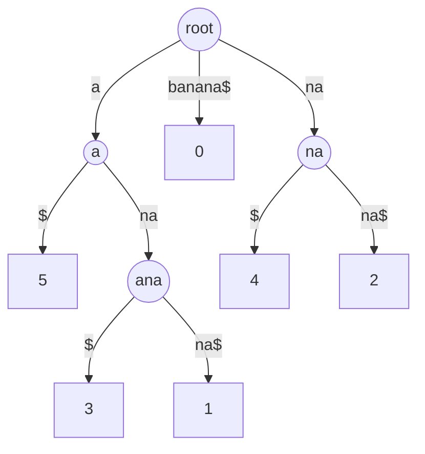

[KMP](/learn/data-structures/tries-and-string-structures/string-matching) preprocesses the *pattern* so that one search over the text is linear. That is the right shape when the text changes and the pattern is fixed, like a filter over a log stream. Flip it: a fixed text (a genome, a code base, a document corpus) and thousands of different patterns. Now every query re-reads the whole text, O(n) each, and a 3-billion-character genome cannot be rescanned for every 20-character read.

The fix is to preprocess the *text*. Every substring of a text is a prefix of some suffix, so if you index all `n` suffixes, "does pattern P occur?" becomes "does any suffix start with P?", which is a prefix query over a set of strings, and the [trie lesson](/learn/data-structures/tries-and-string-structures/tries) showed what to do with those. A suffix trie holds every suffix; a suffix tree compresses it; a suffix array is the same information in a sorted array of integers, and it is what you actually build.

## The suffix trie, and why you cannot afford it

Insert every suffix of `banana` (`banana`, `anana`, `nana`, `ana`, `na`, `a`) into a trie. Searching for `nan` walks n → a → n and succeeds; searching for `nab` fails at `b`. Every substring query is O(m).

```viz
{"type": "trie", "algorithm": "insert-search",
 "operations": [["insert", "banana"], ["insert", "anana"], ["insert", "nana"], ["insert", "ana"], ["insert", "na"], ["insert", "a"], ["prefix", "nan"], ["prefix", "nab"], ["prefix", "ana"]],
 "title": "A suffix trie of banana", "caption": "Every substring is a prefix of some suffix, so a prefix query on the suffixes is a substring query on the text. The trie has O(n²) nodes."}
```

The suffix trie has up to n(n + 1)/2 nodes, one per distinct substring: for a 1 MB text that is on the order of 5 × 10¹¹ nodes. A **suffix tree** applies the radix-tree compression from the trie lesson, merging single-child chains into labelled edges, and because there are only `n` leaves the tree has at most `2n − 1` nodes. Ukkonen's algorithm builds it in O(n), and it answers substring search in O(m), longest repeated substring in O(n), longest common substring of two texts in O(n), and dozens of other classic questions in linear time.



The suffix tree of `banana$`. Leaves are labelled with the suffix's starting index; the `$` terminator guarantees no suffix is a prefix of another, so every suffix ends at a leaf.

In practice the suffix tree is rarely built. Each node needs a child map, a parent pointer, a suffix link and an edge label as a (start, end) pair; real implementations cost 20–40 bytes per node and 2n nodes, so 40–80 bytes per text character, and the pointer-chasing construction is cache-hostile. For a human genome that is well over 100 GB. The suffix array holds the same ordering in 4–8 bytes per character.

## The suffix array

Sort all suffixes lexicographically; the suffix array `sa` lists their starting positions in that order. For `banana`:

| rank | sa[rank] | suffix |
|---|---|---|
| 0 | 5 | a |
| 1 | 3 | ana |
| 2 | 1 | anana |
| 3 | 0 | banana |
| 4 | 4 | na |
| 5 | 2 | nana |

`sa = [5, 3, 1, 0, 4, 2]`. Six integers; the text itself supplies the characters. This is the suffix tree's leaves read left to right.

**Substring search** is binary search: the suffixes starting with `P` form a contiguous block in sorted order, so two binary searches (first suffix ≥ P, first suffix > P with its last character incremented, or equivalently the first suffix that does not start with P) find the block in O(m log n) comparisons; every position in the block is an occurrence. With the LCP array and some care that drops to O(m + log n).

```python
def search(text, sa, pattern):
    lo, hi = 0, len(sa)
    while lo < hi:                          # first suffix >= pattern
        mid = (lo + hi) // 2
        if text[sa[mid]:sa[mid] + len(pattern)] < pattern:
            lo = mid + 1
        else:
            hi = mid
    start = lo
    hi = len(sa)
    while lo < hi:                          # first suffix that does not start with pattern
        mid = (lo + hi) // 2
        if text[sa[mid]:sa[mid] + len(pattern)] == pattern:
            lo = mid + 1
        else:
            hi = mid
    return sa[start:lo]                     # occurrences, in suffix order
```

### Construction: prefix doubling

The naive build sorts `n` suffixes with a comparison sort, and each comparison can cost O(n), so O(n² log n); on `aaaa…a` every comparison really does scan to the end. The standard practical algorithm is **prefix doubling** (Manber and Myers): sort suffixes by their first character, then by their first 2 characters, then 4, 8, …, and each round is a sort of *pairs of ranks from the previous round*, which are integers.

The key observation: the first `2k` characters of suffix `i` are the first `k` characters of suffix `i` followed by the first `k` characters of suffix `i + k`. If you already know the rank of every suffix by its first `k` characters, the rank by `2k` characters is the rank of the pair `(rank_k[i], rank_k[i + k])`, with a sentinel for `i + k ≥ n`.

```python
def suffix_array(s):
    n = len(s)
    rank = [ord(c) for c in s]
    sa = list(range(n))
    k = 1
    while True:
        key = lambda i: (rank[i], rank[i + k] if i + k < n else -1)
        sa.sort(key=key)
        new = [0] * n
        for idx in range(1, n):
            new[sa[idx]] = new[sa[idx - 1]] + (key(sa[idx]) != key(sa[idx - 1]))
        rank = new
        if n == 0 or rank[sa[-1]] == n - 1:     # all ranks distinct: sorted
            break
        k *= 2
    return sa
```

Trace on `banana`. Round 0 (single characters): ranks by character are `b=1, a=0, n=2`, so `rank = [1, 0, 2, 0, 2, 0]`. Round `k = 1`, pairs `(rank[i], rank[i+1])`:

| i | pair | |
|---|---|---|
| 0 | (1, 0) | ba |
| 1 | (0, 2) | an |
| 2 | (2, 0) | na |
| 3 | (0, 2) | an |
| 4 | (2, 0) | na |
| 5 | (0, −1) | a |

Sorted: 5 (0,−1), then 1 and 3 (0,2), then 0 (1,0), then 2 and 4 (2,0). New ranks `[2, 1, 3, 1, 3, 0]`, with ties between 1/3 and 2/4. Round `k = 2`, pairs `(rank[i], rank[i+2])`: 0:(2,3), 1:(1,1), 2:(3,3), 3:(1,0), 4:(3,−1), 5:(0,−1). Sorted: 5, 3, 1, 0, 4, 2. All distinct, done: `sa = [5, 3, 1, 0, 4, 2]`.

Each round is a sort of `n` integer pairs, O(n log n) with a comparison sort or O(n) with radix sort, and there are O(log n) rounds, so O(n log² n) or O(n log n). Linear-time constructions exist (SA-IS, DC3) and SA-IS is what production libraries use; prefix doubling is what you write by hand.

## The LCP array

The suffix array alone loses one thing the suffix tree had: the *internal nodes*, which encode how much adjacent suffixes share. The **LCP array** restores it: `lcp[i]` is the length of the longest common prefix of the suffixes `sa[i − 1]` and `sa[i]`. For `banana`:

| i | suffix | lcp[i] |
|---|---|---|
| 0 | a | 0 |
| 1 | ana | 1 (with `a`) |
| 2 | anana | 3 (with `ana`) |
| 3 | banana | 0 |
| 4 | na | 0 |
| 5 | nana | 2 (with `na`) |

Computing each entry by direct comparison is O(n²) in the worst case. **Kasai's algorithm** does it in O(n) using one fact: if suffix `i` has LCP `h` with its predecessor in sorted order, then suffix `i + 1` (drop the first character) has LCP at least `h − 1` with *its* predecessor. So process suffixes in text order, and the comparison for each can start from `h − 1` instead of 0; `h` decreases at most `n` times in total, so it can increase at most `2n` times.

```python
def lcp_array(s, sa):
    n = len(s)
    rank = [0] * n
    for i, p in enumerate(sa):
        rank[p] = i
    lcp = [0] * n
    h = 0
    for i in range(n):                    # i = text position
        if rank[i] > 0:
            j = sa[rank[i] - 1]           # predecessor suffix in sorted order
            while i + h < n and j + h < n and s[i + h] == s[j + h]:
                h += 1
            lcp[rank[i]] = h
            if h > 0:
                h -= 1
        else:
            h = 0
    return lcp
```

With `sa` and `lcp` the suffix tree's questions come back:

- **Longest repeated substring**: the maximum LCP value. For `banana` it is 3, `ana`, at `sa[2]` and `sa[1]`.
- **Number of distinct substrings**: n(n + 1)/2 − Σ lcp. `banana` has 21 − 6 = 15 distinct substrings.
- **Longest common substring of two texts**: build the array of `A + "#" + B`, then take the maximum LCP between adjacent suffixes that start on different sides of the separator.
- **Count occurrences of P**: the width of the block found by binary search.
- **Longest substring occurring at least k times**: maximum over windows of `k − 1` consecutive LCP values of the window minimum, which is a sliding-window minimum with a [monotonic deque](/learn/data-structures/stacks-queues/monotonic-deque).

## Where these structures run

- **Bioinformatics.** Read alignment against a reference genome (BWA, Bowtie) uses the **FM-index**, a compressed form of the suffix array built on the Burrows-Wheeler transform, which stores the genome's suffix ordering in about 1 byte per base and answers "where does this 100-base read occur" in microseconds.
- **Compression.** `bzip2` applies the Burrows-Wheeler transform, which is the last column of the sorted rotations, essentially the suffix array of the block; the transform groups similar contexts together so that a simple move-to-front and Huffman stage compresses well.
- **Code and log search** mostly does not use suffix arrays. Google Code Search and its descendants (Zoekt, ripgrep's `-F` planning) use **trigram indexes**: a posting list per 3-character sequence, intersected to find candidate documents, then verified by a regex. Trigram indexes update incrementally and shard trivially; suffix arrays are static and monolithic. Suffix arrays win when the text is fixed and queries are arbitrary substrings with exact counts.
- **Plagiarism and near-duplicate detection** use the generalised suffix array or, at scale, winnowed rolling hashes (the [Rabin-Karp idea](/learn/data-structures/tries-and-string-structures/string-matching)).

The honest caveat: suffix structures index a **static** text. Append one character and, in general, the whole array must be rebuilt. Dynamic variants exist and are research-grade. If the text changes, the answer is usually a trigram or n-gram index, or a re-index on a schedule.

## In interviews

Suffix arrays appear in "hard" string problems and in the follow-up to a hash-based solution: "your rolling hash could collide; can you make it exact?" Recognise the shape: a fixed string, many substring questions, or a question about *all* substrings (longest repeated, count distinct, longest common). Say "suffix array plus LCP" and give the complexity of prefix doubling. Then, unless the interviewer wants the construction, use the O(n² log n) naive sort and spend the time on the LCP-based reasoning, which is where the insight is. `longest-palindromic-substring` is usually solved by expand-around-centre or Manacher, but the suffix-array solution (LCP between `s` and `reverse(s)` at mirrored positions) is a legitimate O(n log n) answer and shows range.

## Exercises

```exercise
id: suffix-array
title: Build a suffix array
prompt: |
  Return the suffix array of `s`: the starting indices of all suffixes in
  lexicographic order. The empty string returns `[]`.

  A comparison sort of the suffixes is accepted for these inputs, but write
  prefix doubling if you can: sort by (rank[i], rank[i + k]) pairs with a
  sentinel of -1 for i + k beyond the end, doubling k until all ranks are
  distinct.
languages: [python, javascript]
entry: suffix_array
starter:
  python: |
    def suffix_array(s):
        n = len(s)
        sa = list(range(n))
        return sa
  javascript: |
    function suffix_array(s) {
      const n = s.length;
      const sa = Array.from({ length: n }, (_, i) => i);
      return sa;
    }
tests:
  - args: ["banana"]
    expected: [5, 3, 1, 0, 4, 2]
  - args: [""]
    expected: []
    label: empty
  - args: ["a"]
    expected: [0]
  - args: ["aaa"]
    expected: [2, 1, 0]
    label: all equal, shorter suffix sorts first
  - args: ["abc"]
    expected: [0, 1, 2]
  - args: ["mississippi"]
    expected: [10, 7, 4, 1, 0, 9, 8, 6, 3, 5, 2]
    hidden: true
hints:
  - "Naive: sorted(range(n), key=lambda i: s[i:]). In JavaScript, compare with s.slice(i) < s.slice(j) ? -1 : 1."
  - "Prefix doubling: after sorting by pair, assign new ranks by walking the sorted order and incrementing whenever the pair changes; stop when the last rank equals n - 1."
```

```exercise
id: lcp-array
title: Compute the LCP array with Kasai's algorithm
prompt: |
  Given `s`, build its suffix array and return the LCP array: `lcp[0] = 0`
  and, for `i >= 1`, `lcp[i]` is the length of the longest common prefix of
  the suffixes at `sa[i - 1]` and `sa[i]`. The empty string returns `[]`.

  Implement Kasai's O(n) algorithm: process suffixes in text order and
  carry the previous length minus one into the next comparison.
languages: [python, javascript]
entry: lcp_array
starter:
  python: |
    def suffix_array(s):
        return sorted(range(len(s)), key=lambda i: s[i:])

    def lcp_array(s):
        n = len(s)
        sa = suffix_array(s)
        lcp = [0] * n
        return lcp
  javascript: |
    function suffix_array(s) {
      return Array.from({ length: s.length }, (_, i) => i)
        .sort((a, b) => (s.slice(a) < s.slice(b) ? -1 : 1));
    }

    function lcp_array(s) {
      const n = s.length;
      const sa = suffix_array(s);
      const lcp = new Array(n).fill(0);
      return lcp;
    }
tests:
  - args: ["banana"]
    expected: [0, 1, 3, 0, 0, 2]
  - args: [""]
    expected: []
    label: empty
  - args: ["a"]
    expected: [0]
  - args: ["aaa"]
    expected: [0, 1, 2]
  - args: ["abc"]
    expected: [0, 0, 0]
    label: no repeats
  - args: ["mississippi"]
    expected: [0, 1, 1, 4, 0, 0, 1, 0, 2, 1, 3]
    hidden: true
hints:
  - "Build rank[p] = position of suffix p in sa. For each text index i with rank[i] > 0, compare s[i+h:] with s[j+h:] where j = sa[rank[i]-1], extending h."
  - "After storing lcp[rank[i]] = h, decrement h (if positive) before moving to i + 1. When rank[i] == 0, reset h to 0."
```

## Senior signals

- You explain suffix structures as "preprocess the text, not the pattern" and know when that is the right direction.
- You know the suffix trie is O(n²), the suffix tree is O(n) but 40–80 bytes per character, and the suffix array is the same ordering in 4–8 bytes per character.
- You can describe prefix doubling in two sentences and give its O(n log² n) bound, and you know linear-time builds (SA-IS) exist.
- You know the LCP array is what turns the array back into a tree, and you can name three questions it answers (longest repeat, distinct substrings, longest common substring).
- You know real code search uses trigram indexes, real genomics uses the FM-index, and you can say why suffix arrays lost one battle and won the other.
- You state the static-text limitation before anyone asks.

## Check yourself

```quiz
- q: >-
    Why does a suffix trie of a text of length n have O(n²) nodes while its suffix tree has O(n)?
  options: ["The suffix tree stores only some suffixes", "The suffix tree compresses single-child chains into labelled edges, so every internal node branches and the tree has at most n leaves and n-1 internal nodes", "Suffix tries store the text twice", "The suffix tree drops the terminator"]
  answer: 1
  explanation: >-
    A trie has one node per distinct substring, of which there can be n(n+1)/2. Path compression removes every non-branching node; with n leaves, a tree where every internal node has at least two children has fewer than 2n nodes.
- q: >-
    Prefix doubling sorts suffixes by (rank[i], rank[i+k]) pairs. Why does that correctly order the first 2k characters?
  options: ["Because ranks are unique after the first round", "Because the first 2k characters of suffix i are the first k of suffix i followed by the first k of suffix i+k, and the ranks encode those two blocks' relative order", "Because k is always a power of two", "It does not; a final full comparison is needed"]
  answer: 1
  explanation: >-
    Lexicographic order on the concatenation of two blocks equals order on the pair of the blocks' ranks, provided each rank encodes order on exactly k characters, which the previous round guarantees.
- q: >-
    The LCP array of a text has maximum value 7. What does that tell you?
  options: ["The text has 7 distinct substrings", "The longest substring that occurs at least twice has length 7", "The suffix array has 7 entries", "The text is periodic with period 7"]
  answer: 1
  explanation: >-
    Any repeated substring is a common prefix of two suffixes, and the two suffixes sharing the longest prefix are adjacent in sorted order; the LCP array records exactly those adjacent overlaps.
- q: >-
    Kasai's algorithm computes all n LCP values in O(n) even though a single comparison may be long. What is the key invariant?
  options: ["Adjacent suffixes always share at least one character", "If suffix i shares h characters with its sorted predecessor, suffix i+1 shares at least h-1 with its predecessor, so the comparison can resume from h-1", "The suffix array is sorted", "LCP values are non-increasing"]
  answer: 1
  explanation: >-
    Dropping the first character from both suffixes of a matching pair leaves a pair that still matches for h-1 characters and is still ordered, so the true predecessor of suffix i+1 matches at least that much. h decreases by at most 1 per step, so total increases are bounded by 2n.
- q: >-
    A team wants substring search over a repository that receives hundreds of commits per hour. A suffix array over the whole repository is a poor fit because:
  options: ["Suffix arrays cannot handle binary files", "Suffix arrays index a static text; any change requires rebuilding, so an incrementally updatable index such as a trigram posting list fits better", "Suffix arrays are O(n²) to query", "Suffix arrays only support patterns shorter than 32 characters"]
  answer: 1
  explanation: >-
    Construction is O(n log n) or O(n) but must be redone per change, which cannot keep up with a busy repository. Trigram indexes update per document and shard across machines, which is why code search engines use them.
```
