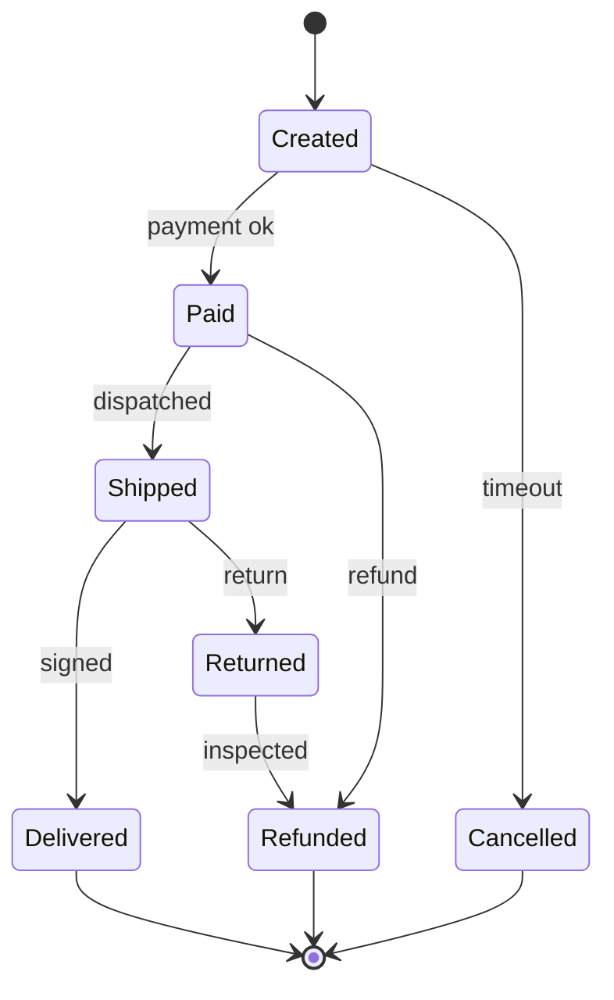

Nobody hands you an adjacency list in production, and the harder interview questions do not either. You get a word list, a set of user accounts with email addresses, a map of a warehouse, two jugs and a tap, a bank's transaction log. The algorithms in this module are all O(V + E) and mechanical; the skill that distinguishes engineers is the sentence that comes before the algorithm: "the vertices are X, the edges are Y, there are about Z of them, and the question is W", where W is one of a dozen standard graph questions. Get the sentence right and the code is twenty lines. Get it wrong, usually by leaving something out of the vertex, and no amount of optimisation helps.

## The modelling method

Four questions, answered in order and out loud:

1. **What is a vertex?** The *complete* state the answer depends on: a word, a grid cell plus what you are carrying, a pair of jug volumes, an account, a version of a package. If two situations with the same vertex could need different answers, the vertex is too small.
2. **What is the edge rule?** A function from a state to its neighbours: change one letter, move a knight, pour a jug. Directed or undirected, weighted or not.
3. **How many states and edges?** Multiply the ranges of the state's components, then multiply by the branching factor. This decides whether you build the graph, explore it implicitly, or need a different idea altogether.
4. **Which question, in graph vocabulary?** Reachability, shortest path, components, cycle, ordering, matching, cut, spanning tree. The question picks the algorithm.

### The method applied to the standard puzzles

| Problem | State (vertex) | Edge rule | Size | Algorithm |
|---|---|---|---|---|
| Word ladder | a word | one letter differs, both in the list | `words`; `words × length` bucket entries | BFS from the start word |
| Knight on a chessboard | a square | the 8 knight moves inside the board | 64 states, ≤ 8 edges each | BFS; a1 to h8 takes 6 moves, no square needs more |
| Water jugs (3 L and 5 L) | `(a, b)` volumes | fill, empty, pour either way | `4 × 6 = 24` states, ≤ 6 edges each | BFS; 4 L reached in 6 moves |
| Shortest path removing ≤ k walls | `(row, col, walls_left)` | 4 moves; a wall costs one unit | `rows × cols × (k + 1)`: 60,000 for 100 × 100, k = 5 | BFS over the enlarged state |
| Lock with 4 dials and forbidden combos | a 4-digit string | turn one dial ±1, skipping forbidden states | 10^4 states, 8 edges each | BFS; `0000` to `0202` with five dead ends is 6 turns, `0000` to `5555` is 20 |
| Minimum genetic mutation | an 8-letter string over ACGT | one letter changes, result in the bank | at most the bank size; 24 candidates per state | BFS; each state generates `8 × 3` candidates |

Each size is the number of states you will *reach* at most, and each is small enough that BFS over the implicit graph finishes in milliseconds. The exercise of writing the size down is what tells you that `(row, col)` for the wall problem is 6× too small a state, and that a 26^5 = 11.9-million-word implicit space is fine to search but not to build.

### Hand trace: BFS over the jug state space

Jugs of 3 and 5 litres, target 4 litres in either jug. Moves are generated in a fixed order: fill A, fill B, empty A, empty B, pour A→B, pour B→A. Only moves that produce an unseen state are listed.

```python
from collections import deque

def jugs(A, B, target):
    def moves(a, b):
        yield A, b                                   # fill A
        yield a, B                                   # fill B
        yield 0, b                                   # empty A
        yield a, 0                                   # empty B
        p = min(a, B - b); yield a - p, b + p        # pour A into B until A empty or B full
        p = min(b, A - a); yield a + p, b - p        # pour B into A
    dist = {(0, 0): 0}
    queue = deque([(0, 0)])
    while queue:
        s = queue.popleft()
        if target in s:
            return dist[s]
        for t in moves(*s):
            if t not in dist:                        # mark on enqueue
                dist[t] = dist[s] + 1
                queue.append(t)
    return -1
```

| Pop | State, distance | New states enqueued | Queue after |
|---|---|---|---|
| 1 | (0,0), 0 | fill A → (3,0); fill B → (0,5) | `(3,0) (0,5)` |
| 2 | (3,0), 1 | fill B → (3,5); pour A→B → (0,3) | `(0,5) (3,5) (0,3)` |
| 3 | (0,5), 1 | pour B→A → (3,2) | `(3,5) (0,3) (3,2)` |
| 4 | (3,5), 2 | none: every move reaches a seen state | `(0,3) (3,2)` |
| 5 | (0,3), 2 | fill A → (3,3) | `(3,2) (3,3)` |
| 6 | (3,2), 2 | empty A → (0,2) | `(3,3) (0,2)` |
| 7 | (3,3), 3 | pour A→B → (1,5) | `(0,2) (1,5)` |
| 8 | (0,2), 3 | pour B→A → (2,0) | `(1,5) (2,0)` |

The search continues through `(1,0)` and `(2,5)` at distance 5 and reaches `(3,4)` at distance 6 on the twelfth pop; the path read back through parents is fill B, pour B→A, empty A, pour B→A, fill B, pour B→A. Sixteen of the 24 possible states are ever reached, which is the number-theory fact in disguise: every reachable volume is a combination of 3s and 5s, and a target is reachable iff it is a multiple of `gcd(A, B)` and at most `A + B`. Pop 4 is the instructive one: a state can have six moves and contribute nothing, and the visited check (mark on enqueue, as the [BFS lesson](/learn/data-structures/graphs/breadth-first-search) insists) is what keeps the queue at 24 entries at most instead of 6^6.

## Shape 1: the social graph

Users are vertices; follows or friendships are edges (directed for follows, undirected for friendships). The graph is enormous, sparse, and has a giant connected component plus many small ones. Its degree distribution is heavy-tailed, power-law-like: most users have a few hundred edges and a few have millions, and those few decide the cost of every query.

- **Degrees of separation, "people you may know"**: BFS to depth 2 with counts. A user with 300 friends whose friends each have 300 friends has up to `300 × 300 = 90,000` friend-of-friend candidates before de-duplication and before ranking by mutual-friend count. Facebook reported an average distance of about 4.6 between any two users in 2016, so depth 3 or 4 reaches a large fraction of the graph; nobody runs that online.
- **Supernodes.** If one of those 300 friends is a celebrity with 10^7 followers, the same two-hop query touches 10^7 vertices, and a query that crosses two or three such nodes is at 10^8. Naive BFS over a social graph is bounded by its supernodes, not by its average degree; the fixes are caps per neighbour, sampling, precomputed candidate lists, or excluding supernodes from expansion.
- **Mutual friends**: intersect two adjacency lists, O(min degree) with hash sets or sorted lists.
- **Communities**: connected components at small scale (`number-of-provinces`), label propagation or modularity methods at large scale.
- **Influence**: PageRank and centrality, iterative computations run offline (below).

```viz
{"type": "graph", "algorithm": "bfs", "directed": false, "start": "you",
 "nodes": [{"id": "you"}, {"id": "ana"}, {"id": "ben"}, {"id": "cy"}, {"id": "dee"}, {"id": "eli"}, {"id": "fay"}],
 "edges": [{"from": "you", "to": "ana"}, {"from": "you", "to": "ben"}, {"from": "ana", "to": "cy"}, {"from": "ben", "to": "cy"}, {"from": "ben", "to": "dee"}, {"from": "cy", "to": "eli"}, {"from": "dee", "to": "fay"}],
 "title": "Friends of friends by BFS", "caption": "Level 1 is your friends, level 2 is friend-of-friend suggestions. cy is reachable two ways but is suggested once, because BFS discovers each vertex once."}
```

### How the graph is stored at scale

A social graph does not fit on one machine, so the adjacency list is sharded by vertex id and a BFS becomes one batched lookup per level: fetch every neighbour list of the current frontier in one round of parallel requests, de-duplicate, repeat. The number of *rounds* (levels), not vertices, is what you optimise, which is why "depth 2" is a product constraint as well as an algorithmic one.

The TAO design that Facebook described in 2013 is the reference shape: the graph is stored as **objects** (typed vertices with an id) and **associations** (typed directed edges `(id1, type, id2)` with a timestamp and a small payload) in a sharded relational store, fronted by a large read-through cache tier, with the API limited to a few calls (`assoc_get`, `assoc_range` for the most recent N edges of a type, `assoc_count`). Every undirected relationship is stored as two associations, one per direction, so "friends of" and "friended by" are both one range read. Cross-region replication is asynchronous, so a read in another region can trail a write by a replication lag that is usually below a second; the API is designed so that most product queries are one or two hops, which a KV store with a cache serves far more cheaply than a graph engine. Graph databases win when queries are variable-depth pattern matches ("accounts within 4 hops sharing a device"), and relational stores win for fixed-depth joins with aggregates, transactions and reporting; the [graph databases lesson](/learn/databases/nosql-and-specialised/graph-time-series-and-vector-databases) has the decision in full.

## Shape 2: the dependency graph

Vertices are packages, build targets, tasks, migrations or services; a directed edge `a → b` means "a must happen before b" or, equivalently and confusingly, "b depends on a". Pick one direction and write it down. A manifest lists what a package *depends on*, which is the reverse of the "must happen before" edge; build one adjacency list from the manifests and reverse it for the other, O(E) once, and keep both.

- **Order**: [topological sort](/learn/data-structures/graphs/topological-sort-and-dags), ties broken by name for reproducible builds.
- **Cycle**: the error case, reported as a path by [three-colour DFS](/learn/data-structures/graphs/connectivity-and-cycles).
- **Blast radius**: what breaks if this changes, or this service goes down, is reachability in the *reverse* graph from the changed vertex. In a service dependency graph, the blast radius of a database is every service that reaches it along call edges; the on-call dashboard that answers "who is affected" is one reverse DFS, and the number it reports (12 services, or 400) is what decides the incident's severity.
- **Parallelism and critical path**: Kahn's levels and the longest-path DP.
- **Version resolution**: not a graph problem; with version constraints it is a constraint-satisfaction search, NP-hard in general, which is why resolvers are complicated and occasionally slow.

## Shape 3: the state machine

A state machine is a directed graph whose vertices are states and whose edges are transitions labelled by the input that triggers them. Regular expression engines, network protocols, UI flows, order lifecycles and workflow engines are all state machines, and graph questions become correctness questions about the system:

- **Unreachable states**: not reachable from the initial state (DFS from start). Dead code in your workflow.
- **Stuck states**: a non-terminal state with no outgoing edge, or one from which no terminal state is reachable (DFS on the reverse graph from the terminals). A protocol state with no timeout edge is a hang.
- **"Can a cancelled order ever become shipped?"**: reachability, and it should be a test.
- **Cycles**: expected (retry loops) or bugs (a loop with no exit edge).



### The transition table makes invalid transitions impossible

The point of writing the machine as an explicit graph is that the code can only follow edges that exist:

```python
TRANSITIONS = {                      # (state, event) -> next state; absence means "not allowed"
    ("created", "payment_ok"): "paid",
    ("created", "timeout"): "cancelled",
    ("paid", "dispatched"): "shipped",
    ("paid", "refund"): "refunded",
    ("shipped", "signed"): "delivered",
    ("shipped", "return"): "returned",
    ("returned", "inspected"): "refunded",
}
TERMINAL = {"delivered", "refunded", "cancelled"}

def advance(state, event):
    try:
        return TRANSITIONS[(state, event)]
    except KeyError:
        raise ValueError(f"no transition from {state!r} on {event!r}")

def check_machine():
    adj = {}
    for (s, _), t in TRANSITIONS.items():
        adj.setdefault(s, set()).add(t); adj.setdefault(t, set())
    seen, stack = set(), ["created"]
    while stack:                                       # every state reachable from the start
        s = stack.pop()
        if s not in seen:
            seen.add(s); stack.extend(adj[s])
    assert seen == set(adj), f"unreachable: {set(adj) - seen}"
    stuck = [s for s in adj if not adj[s] and s not in TERMINAL]
    assert not stuck, f"stuck states: {stuck}"
```

An `if/elif` chain over status strings can be edited into allowing `cancelled → shipped`; a table cannot express that edge unless someone adds it, and `check_machine` runs as a unit test. Two production machines you already run: a regex engine compiles the pattern into an NFA (Thompson's construction, O(m) states for a pattern of length m) and either simulates it in O(n · m) or converts it to a DFA with up to 2^m states; backtracking engines such as Python's `re` instead explore the NFA depth-first and go exponential on patterns like `(a+)+b`, which is why RE2, Go and Rust's regex crate refuse backtracking. TCP is an 11-state machine (`LISTEN`, `SYN_SENT`, `ESTABLISHED`, `TIME_WAIT` and the rest) whose edges are segment flags and timeouts; the [TCP deep dive](/learn/networking/fundamentals/tcp-deep-dive) walks it, and a connection stuck in `CLOSE_WAIT` is a missing edge in the application, not the kernel. Two interacting machines have a product state space, which is where explosion begins and where model checkers do exhaustive graph search with compression.

## Shape 4: the bipartite graph

Two kinds of vertex with edges only between kinds: users and items, workers and jobs, students and courses, accounts and email addresses. Bipartite graphs have their own algorithms:

- **Matching**: assign each job to at most one machine such that the maximum number are assigned. Start a DFS from each unmatched job looking for an *augmenting path* (alternating unmatched and matched edges ending at a free machine) and flip it; O(V · E) for the augmenting-path version, O(E √V) for Hopcroft-Karp, and max-flow for the weighted or capacitated versions in the [flow lesson](/learn/algorithms/graph-algorithms/bridges-articulation-and-flow).
- **Identity resolution** (`accounts-merge`): accounts and email addresses are the two sides; the components are the real people. Build it through the email vertices and run components or union-find; do not compare accounts pairwise, which is O(n²), 2 × 10^10 operations for 200,000 accounts.
- **Collaborative filtering**: "items liked by users who liked what you liked" is a depth-3 walk with counts in the user–item graph; recommenders run it as sparse matrix multiplication, which is the same computation.

```viz
{"type": "graph", "algorithm": "bipartite", "directed": false, "start": "u1",
 "nodes": [{"id": "u1"}, {"id": "u2"}, {"id": "u3"}, {"id": "i1"}, {"id": "i2"}, {"id": "i3"}, {"id": "i4"}],
 "edges": [{"from": "u1", "to": "i1"}, {"from": "u1", "to": "i2"}, {"from": "u2", "to": "i2"}, {"from": "u2", "to": "i3"}, {"from": "u3", "to": "i3"}, {"from": "u3", "to": "i4"}],
 "title": "A user-item graph is bipartite", "caption": "Users on one side, items on the other. Two-colouring succeeds by construction; recommendations are short walks that alternate sides."}
```

## Shape 5: the physical network

Roads, fibre, pipes, power lines: vertices are junctions, edges are links with weights (distance, latency, capacity). This is the home of the [weighted algorithms](/learn/algorithms/graph-algorithms/shortest-paths-dijkstra): Dijkstra and A* for routing, minimum spanning trees for cheapest connection, max-flow for capacity, bridges and articulation points for "which single failure partitions the network". The modelling subtleties are about the edges: one-way streets are directed edges, turn restrictions require a vertex per (junction, incoming road) pair, and time-dependent travel times make the weight a function rather than a number, which breaks Dijkstra's assumptions unless the function is FIFO (leaving later never gets you there earlier).

## Build it, or explore it implicitly?

| Build the adjacency list when… | Explore implicitly when… |
|---|---|
| The graph is given as data (edges in a table, a manifest, a map file) | Neighbours are computed by a rule (moves, letter changes, grid adjacency) |
| You will run several algorithms or queries over it | You run one search from one start |
| V and E fit in memory comfortably | The full graph is astronomically large but the reachable part is small |
| Edge lookup or degree is needed repeatedly | You only ever iterate neighbours |

For `word-ladder` with 5,000 words of length 5, building the graph by comparing all pairs is 12.5 million comparisons; generating neighbours by trying 25 substitutions at each of 5 positions and checking a hash set is 125 lookups per vertex, and you only touch vertices BFS reaches. The wildcard-bucket trick (`h*t`, `*ot`, `ho*`) precomputes neighbour lists in `words × length` entries (18 for the six-word example) and is the middle ground when many searches share the dictionary.

## Under the hood: where the adjacency lives

### A relational table versus index-free adjacency

Store edges as a table `edges(src, dst)` with a B-tree index on `src`. One hop from vertex `u` is one index range scan, O(log E + degree). Two hops is a self-join, `edges e1 JOIN edges e2 ON e1.dst = e2.src WHERE e1.src = u`: a range scan for `u`, then one range scan per neighbour, with the intermediate result materialised; an n-hop query is n joins whose intermediate results grow by the average degree at each step, and a variable-depth query needs a recursive CTE. Neo4j's index-free adjacency, described in the [representations lesson](/learn/data-structures/graphs/graph-representations), stores each vertex's edges as a linked chain of fixed-size records reached by pointer from the vertex, so a hop costs a few pointer dereferences per edge regardless of the table size and no index lookup; the price is locality (one random read per hop for a high-degree vertex) and a store that does not shard across machines as easily as a table keyed by `src`. For one or two hops with a warm cache the two are within a small factor; at four or five hops the join plan's intermediate results are what you pay for.

### Pregel: think like a vertex

When the graph does not fit on one machine, Pregel (Google, 2010) and its descendants Giraph and Spark's GraphX partition the vertices across workers and run in **supersteps**: in each superstep every active vertex reads the messages sent to it in the previous superstep, updates its own value, sends messages along its out-edges, and may vote to halt; a global barrier separates supersteps. BFS in this model is one superstep per level, with the frontier as the set of vertices that received a message. The programmer writes only the per-vertex function, and the runtime handles the shuffle of messages between machines, which is the dominant cost: a superstep on a 10^9-edge graph moves on the order of the frontier's total degree across the network.

### PageRank as power iteration

PageRank is a vertex value `r(v)` updated as `r'(v) = (1 − d) / N + d · Σ over in-edges u → v of r(u) / outdeg(u)`, with damping `d` usually 0.85. Each round is one superstep (every vertex sends `r(u) / outdeg(u)` to its successors and sums what it receives), and the rounds are the power iteration for the dominant eigenvector of the transition matrix; it converges to a fixed tolerance in a few dozen rounds, so the whole computation is a few dozen passes over the edges. Every "influence" or "importance" score in a social or web graph is a variant of this loop, run offline.

## Trade-offs

| Store | 1–2 hop query | n-hop or pattern query | Updates | Scale | Transactions |
|---|---|---|---|---|---|
| Adjacency list in memory | O(degree), nanoseconds per edge | O(reached subgraph) | O(1) append; rebuild for CSR | One machine's RAM | None |
| Relational table, index on `src` | One or two index range scans | n joins, materialised intermediates | Row inserts, indexed | Sharding by `src` is routine | Full ACID |
| Native graph DB (Neo4j) | Pointer chasing, no index | Native; the reason to choose it | Record updates, ACID | Hard to shard | ACID on one instance |
| Sharded KV with cache (TAO-style) | One cached range read per hop | Not offered; precompute offline | Write-through to the shard, async across regions | Billions of edges | Per-shard only |
| Pregel / GraphX | One superstep per hop, batch | Iterative algorithms over the whole graph | Reload the partition | Cluster-sized | None: batch |

## Failure modes

### The state is too small

Symptom: BFS returns "no path" or a path that is too long when a solution exists; tests without the extra resource pass. Diagnosis: two arrivals at the same vertex differ in something the answer depends on (walls left, keys held, jug contents, direction faced), and the visited check discards the second. Fix: put that component into the vertex and re-estimate the size.

### The whole implicit graph is built

Symptom: the process runs out of memory before the search starts, or a 26^5-word ladder graph takes minutes to construct for a query that touches 200 words. Diagnosis: an adjacency list was materialised for every possible state instead of the reached ones. Fix: a neighbour function plus a visited set of reached states only; buckets or precomputation only for the states that exist in the input.

### One supernode per query

Symptom: p99 latency of "friends of friends" is 100× the median, always for users connected to the same few accounts. Diagnosis: the two-hop expansion passes through a vertex with 10^7 edges. Fix: cap the edges expanded per neighbour, sample, precompute candidates for supernodes offline, or exclude vertices above a degree threshold from expansion and treat them as a separate signal.

### A direction that is not there

Symptom: "mutual" or "connected" queries miss half their answers, or a component count is far too high. Diagnosis: an undirected relationship (friendship, shared address) was stored in one direction only. Fix: store both directions (two associations per edge in a TAO-style store, both list entries in memory) and say so in the modelling sentence.

### A scheduling problem dressed as a graph

Symptom: an O(n²) conflict graph built for "maximum number of non-overlapping meetings", then a search over it. Diagnosis: the edges are interval overlaps, and the question is answered by sorting by end time and taking greedily, O(n log n), as in the [interval problems lesson](/learn/algorithms/greedy/interval-problems). Fix: check whether the structure is an interval, a sequence or a DAG before reaching for a traversal; graphs are the general tool, and general costs more.

## Interviewer follow-ups

**"Design 'people you may know' for 10^9 users."** Model answer: two-hop candidates with mutual-friend counts, computed offline in batches over the sharded adjacency (one superstep-style pass per hop), capped per neighbour to defuse supernodes, stored as a ranked list per user and refreshed on a schedule; online, one KV read. Common wrong answer: an online BFS to depth 2 at request time, which is 90,000 candidates for an ordinary user and 10^7 for a celebrity's friend.

**"Why not a graph database for the whole product?"** Model answer: most product reads are one or two hops of a known type, which a sharded KV store with a cache serves at lower cost and higher availability, and reporting needs joins with aggregates and transactions, where relational stores win; a graph engine earns its place for variable-depth pattern queries such as fraud rings. Common wrong answer: "graph data needs a graph database".

**"Two jugs of 3 and 5, target 4. Now three jugs, or an arbitrary target."** Model answer: three jugs is the same BFS with a three-component state, `(A+1)(B+1)(C+1)` states and 12 moves each; for reachability alone, a target is achievable iff it is a multiple of `gcd` of the capacities and at most their sum, which answers the question without a search. Common wrong answer: BFS over `(a, b)` for three jugs, dropping the third component.

**"Shortest path on a grid where you can teleport between any two cells of the same colour."** Model answer: add one virtual vertex per colour, with a 1-cost edge from each cell to its colour's hub and 0-cost edges from the hub back, then 0-1 BFS; O(cells) edges instead of O(cells²). Common wrong answer: adding an edge between every pair of same-coloured cells.

**"How do you catch a stuck state in a workflow before it ships?"** Model answer: build the graph from the transition table in a test; check every state is reachable from the start (DFS), every non-terminal state has an out-edge, and every state can reach a terminal (DFS on the reverse graph from the terminals). Common wrong answer: reviewing the `if/elif` chain by eye.

## What mid-level engineers get wrong

- Leaving what you are carrying, how many moves remain, or which direction you face out of the state, so the visited check prunes the real solution.
- Building "depends on" edges when the algorithm needs "must precede", or an undirected graph from one-way relations.
- Running BFS for a weighted shortest path, or DFS for a shortest path, or counting components when the question was strongly connected components.
- Comparing every pair of items to find edges, O(n²), when a shared attribute links them in O(n).
- Materialising an implicit graph that a neighbour function would have generated on demand.
- Running one traversal from one start and assuming it saw everything; components, bipartiteness and cycle detection all need the outer loop.
- Sizing a social-graph query by the average degree and being surprised by the supernode.
- Marking the input grid in place without saying so, when the caller needs it afterwards.

## Exercises

```exercise
id: install-order
title: Package install order
prompt: |
  `install_order(packages)`: `packages` is an object (dict) mapping each
  package name to the list of package names it depends on. Every name that
  appears as a dependency is also a key. Return a list of all package names
  in an order where each package appears **after** all of its dependencies.
  When several packages are installable at the same time, choose the
  **alphabetically smallest** first. If the dependencies contain a cycle,
  return `[]`. An empty input returns `[]`.

  Note the edge direction: a manifest lists what a package depends on, and
  the install edge points the other way.
languages: [python, javascript]
entry: install_order
starter:
  python: |
    import heapq

    def install_order(packages):
        order = []
        return order
  javascript: |
    function install_order(packages) {
      // packages is a plain object: { name: [dep, dep, ...] }
      const order = [];
      return order;
    }
tests:
  - args: [{"app": ["lib", "log"], "lib": ["log"], "log": []}]
    expected: ["log", "lib", "app"]
  - args: [{"a": ["b"], "b": ["a"]}]
    expected: []
    label: circular dependency
  - args: [{}]
    expected: []
    label: empty
  - args: [{"x": []}]
    expected: ["x"]
  - args: [{"web": ["auth", "db"], "auth": ["db", "crypto"], "db": [], "crypto": []}]
    expected: ["crypto", "db", "auth", "web"]
    hidden: true
    label: alphabetical tiebreak among ready packages
  - args: [{"b": [], "a": [], "c": ["a", "b"]}]
    expected: ["a", "b", "c"]
    hidden: true
hints:
  - "For each package p and each dependency d, add the edge d -> p and increment indegree[p]."
  - "Kahn's algorithm with a min-heap (Python) or a sorted ready list (JavaScript) over names; return [] if the output is shorter than the number of packages."
```

```exercise
id: word-ladder-length
title: Word ladder as an implicit graph
prompt: |
  `ladder_length(begin, end, words)`: all words have the same length. A
  step changes exactly one letter and must produce a word in `words`.
  Return the number of words in the shortest sequence from `begin` to
  `end` inclusive (so `begin -> end` directly is 2), or 0 if no sequence
  exists. `end` must be in `words`; `begin` need not be. Assume
  `begin != end`.

  Do not build the graph. BFS from `begin`, generating neighbours by
  substituting each position with each letter `a`-`z` and checking a set.
languages: [python, javascript]
entry: ladder_length
starter:
  python: |
    from collections import deque

    def ladder_length(begin, end, words):
        word_set = set(words)
        return 0
  javascript: |
    function ladder_length(begin, end, words) {
      const wordSet = new Set(words);
      return 0;
    }
tests:
  - args: ["hit", "cog", ["hot", "dot", "dog", "lot", "log", "cog"]]
    expected: 5
  - args: ["hit", "cog", ["hot", "dot", "dog", "lot", "log"]]
    expected: 0
    label: end not in the list
  - args: ["a", "c", ["a", "b", "c"]]
    expected: 2
    label: one step
  - args: ["hot", "dog", ["hot", "dog"]]
    expected: 0
    label: two letters differ, no intermediate
  - args: ["lead", "gold", ["load", "goad", "gold", "lead", "lord"]]
    expected: 4
    hidden: true
  - args: ["ab", "cd", ["ad", "cd", "cb"]]
    expected: 3
    hidden: true
hints:
  - "Queue of (word, steps) starting at (begin, 1). Remove a word from the set when you enqueue it so it is never revisited."
  - "For each position i and each letter c != word[i], candidate = word[:i] + c + word[i+1:]; if it is in the set, it is a neighbour."
```

## Senior signals

- You open with the **modelling sentence** (vertices, edge rule, size estimate, question) before any code, and you can write the size estimate as a product of ranges.
- You choose the vertex to include everything the answer depends on, and you can explain the "visited without the key" bug from experience.
- You know the five recurring shapes and the algorithm family each one unlocks, and you can trace a BFS over a puzzle's state space by hand.
- You size a social-graph query by its supernodes, not its average degree, and you know why a two-hop query is served from a sharded KV store with a cache rather than a graph engine.
- You describe blast radius as reverse reachability and can produce it from a service dependency graph in one DFS.
- You express a state machine as a transition table and test it with reachability and stuck-state checks.
- You decide explicitly whether to build the graph or explore it implicitly, and you know the wildcard-bucket middle ground.
- You can say what an n-hop query costs in a relational table (n joins), a native graph store (pointer chasing) and a Pregel job (n supersteps), and choose accordingly.

## Check yourself

```quiz
- q: >-
    A BFS for "shortest path through a grid where you may pass through at most one wall" marks cells visited as (row, col) and returns no path even though one exists. The bug is:
  options: ["BFS finds only shortest paths, so the route through a wall needs DFS to be found", "The state omits walls used, so one arrival at a cell blocks a different, later one", "The wall cell must be deleted from the grid before searching, not crossed", "BFS cannot cross walls at all, so the path that breaks through one is never explored"]
  answer: 1
  explanation: >-
    Two arrivals at the same cell with different remaining budgets are different states: a cell reached first after spending the wall marks it visited and blocks a later arrival that still has the wall available. The vertex must be (row, col, walls_used) so that each is visited independently. BFS itself is right for this unweighted problem; the state is what is too small.
- q: >-
    You have 200,000 accounts, each with a few email addresses, and must group accounts belonging to the same person (shared address). The efficient model is:
  options: ["Compare every pair of accounts for a shared address: O(n²) comparisons", "Hash each account's full email set and group equal hashes: O(total emails)", "Sort accounts by first email, merging neighbours that match: O(n log n)", "An account-email graph with components or union-find: O(total emails)"]
  answer: 3
  explanation: >-
    Shared attributes link accounts through the attribute vertex (or a map from email to the first account seen). Iterating each account's emails and unioning with the first account that owns each email touches every email once, and components capture transitive merges; pairwise comparison is 2 × 10^10 operations. Sorting by first email or hashing whole sets only groups accounts whose first address or entire set coincide, missing accounts that share only one address.
- q: >-
    A package manifest for P lists dependencies [A, B]. For a topological install order, which edges should you add?
  options: ["P → A and P → B", "A → P and B → P", "P–A and P–B (undirected)", "A → B and B → P"]
  answer: 1
  explanation: >-
    The install-order edge means 'must come before'. A and B must be installed before P, so the edges point from the dependency to the dependant. Adding them the other way produces the reverse order, which uninstalls correctly but installs backwards.
- q: >-
    A workflow's state machine has a state with no outgoing transitions that is not documented as terminal. In graph terms this is:
  options: ["A source vertex, because no transition leaves from it at all", "An unreachable vertex, because nothing can proceed past it", "A cycle, because the workflow can never leave that state again", "A sink vertex, which means the workflow can get stuck there"]
  answer: 3
  explanation: >-
    Out-degree zero means no way forward: a sink, found by checking out-degree. A source is the opposite (in-degree zero), a cycle needs outgoing edges, and the state may well be reachable, which is exactly why it is dangerous. Checking every non-terminal state has at least one outgoing edge, and that every state is reachable from the start, are two one-pass graph checks worth having as tests.
- q: >-
    For word ladder over a fixed dictionary of 100,000 words that will be queried millions of times with different start and end words, the best preprocessing is:
  options: ["Sort the dictionary so each word's neighbours can be found by binary search", "Build the full adjacency list once by comparing all word pairs: O(n²) time", "Bucket words by wildcard pattern (h*t, *ot, ho*) and read neighbours from them", "Nothing; generate neighbours by substitution fresh on every single query"]
  answer: 2
  explanation: >-
    Pattern buckets give exact neighbour lists in O(n × length) preprocessing and constant lookups per position; per-query substitution is fine for one search but wastes work across millions; pairwise comparison is 10^10 operations. Sorting helps only with shared prefixes, and a one-letter change can occur at any position.
- q: >-
    A "friends of friends" endpoint has a median latency of 5 ms and a p99 of 800 ms, and the slow requests come from users connected to the same few accounts. The most likely cause is:
  options: ["The adjacency list is sharded, so each hop is a network round trip", "A supernode with millions of edges sits inside the two-hop expansion", "The graph is stored undirected, so every edge is expanded twice", "The BFS marks visited on dequeue, so the queue holds duplicate entries"]
  answer: 1
  explanation: >-
    Two-hop cost is the sum of the neighbours' degrees, so one celebrity among a user's friends multiplies the work by their degree, which is why the slow requests cluster around specific accounts. Duplicate queue entries, undirected storage and per-hop round trips would slow every request roughly equally rather than a specific set of users. The fix is a per-neighbour cap, sampling, or precomputed candidates for high-degree vertices.
```
