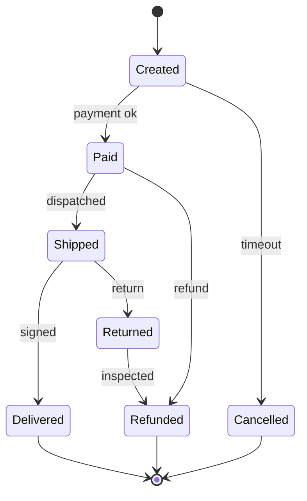

Nobody hands you an adjacency list in production, and the harder interview questions do not either. You get a word list, a set of user accounts with email addresses, a map of a warehouse, a set of currency exchange rates, a bank's transaction log. The algorithms in this module are all O(V + E) and mechanical; the skill that distinguishes engineers is the sentence that comes before the algorithm: "the vertices are X, the edges are Y, and the question is Z", where Z is one of a dozen standard graph questions. Get the sentence right and the code is twenty lines. Get it wrong and no amount of optimisation helps.

## The modelling sentence

Every graph problem answers three questions:

1. **What is a vertex?** An entity with identity: a user, a word, a grid cell, a city, a state of a puzzle, an account, a version of a package.
2. **What is an edge, and is it directed or weighted?** A relation between two vertices: friendship (undirected), "depends on" (directed), a road (weighted by distance), a legal move (directed, implicit), sharing an email address (undirected).
3. **What is the question, in graph vocabulary?** Reachability, shortest path, components, cycle, ordering, matching, cut, spanning tree.

Say these out loud before writing code. An interviewer who hears "vertices are words, edges connect words that differ in one letter, we need the shortest path from `hit` to `cog`, that is BFS on an implicit unweighted graph" knows in fifteen seconds that you will solve the problem.

The step engineers most often get wrong is the vertex. Choosing a *too coarse* vertex loses information you need (the vertex must be the whole state, including what you are carrying); choosing a *too fine* vertex blows up the graph. The examples below show the choice in each case.

## Shape 1: the social graph

Users are vertices; follows or friendships are edges (directed for follows, undirected for friendships). The graph is enormous, sparse (degree in the hundreds), and has a giant connected component plus many small ones.

Questions and their algorithms:

- **Degrees of separation, "people you may know"**: BFS to depth 2 or 3 from the user. Depth matters: with degree 200, depth 2 touches 40,000 vertices and depth 3 touches 8 million; nobody runs BFS to depth 4 on a social graph online.
- **Mutual friends**: intersect two adjacency lists (sorted lists or hash sets, O(min degree)).
- **Communities**: connected components at small scale, label propagation or modularity-based clustering at large scale; interview versions are "count the friend circles" (`number-of-provinces`), which is components.
- **Influence, importance**: PageRank and centrality, which are iterative computations over the adjacency structure, usually run offline with MapReduce-style passes.

```viz
{"type": "graph", "algorithm": "bfs", "directed": false, "start": "you",
 "nodes": [{"id": "you"}, {"id": "ana"}, {"id": "ben"}, {"id": "cy"}, {"id": "dee"}, {"id": "eli"}, {"id": "fay"}],
 "edges": [{"from": "you", "to": "ana"}, {"from": "you", "to": "ben"}, {"from": "ana", "to": "cy"}, {"from": "ben", "to": "cy"}, {"from": "ben", "to": "dee"}, {"from": "cy", "to": "eli"}, {"from": "dee", "to": "fay"}],
 "title": "Friends of friends by BFS", "caption": "Level 1 is your friends, level 2 is friend-of-friend suggestions. cy is reachable two ways but is suggested once, because BFS discovers each vertex once."}
```

The production detail: a social graph does not fit on one machine, so the adjacency list is sharded by vertex id, a BFS becomes a sequence of batched lookups (fetch all neighbours of the current frontier in one round trip per level), and the number of *rounds* (levels), not vertices, is what you optimise. That is why "depth 2" is a product constraint and not just an algorithmic one.

## Shape 2: the dependency graph

Vertices are packages, build targets, tasks or migrations; a directed edge `a → b` means "a must happen before b" (or, equivalently and confusingly, "b depends on a"; pick one direction and write it down). The graph must be a DAG, and the questions are:

- **Order**: [topological sort](/learn/data-structures/graphs/topological-sort-and-dags). With ties broken by name for reproducible builds.
- **Cycle**: the error case, reported as a path (three-colour DFS).
- **What is affected by a change**: reachability from the changed vertex in the *forward* graph (everything downstream must rebuild); what must be built to produce a target is reachability in the *reverse* graph. Keep both adjacency lists; reversing is O(E) once.
- **Parallelism**: the level structure from Kahn's algorithm; the critical path is the longest path in the DAG and is the lower bound on wall-clock time.
- **Version resolution**: not a plain graph problem; with version constraints it is a constraint-satisfaction problem (NP-hard in general, which is why `npm`, `pip` and `cargo` resolvers are complicated and occasionally slow).

The edge-direction confusion is real: a package manifest lists what the package *depends on*, which is the reverse of the "must happen before" edge. Build one list from the manifests and reverse it for the other; do not try to think in both directions at once.

## Shape 3: the state machine

A state machine is a directed graph whose vertices are states and whose edges are transitions, labelled by the input that triggers them. Regular expression engines, network protocol implementations (TCP's connection states), UI flows, order lifecycles (`created → paid → shipped → delivered`, with `cancelled` reachable from some of them) and workflow engines are all state machines.

Graph questions become correctness questions about the system:

- **Unreachable states**: vertices not reachable from the initial state (DFS from start). Dead code in your workflow.
- **Terminal states and deadlocks**: vertices with no outgoing edges; if one is not meant to be terminal, it is a stuck state. In protocol design, a state with no timeout edge is a hang.
- **Can state X ever reach state Y**: reachability. "Can a cancelled order ever become shipped?" should be a test, and it is one DFS.
- **Cycles**: expected (retry loops) or bugs (a workflow that can loop forever). Distinguish by whether the cycle has an exit edge.
- **Product state machines**: two interacting machines have a state space that is the product of their states, which is where explosion begins and where model checkers (TLA+, SPIN) do exhaustive graph search with clever compression.

The interview version is any puzzle: the vertices are configurations, the edges are moves, and "minimum moves" is BFS. The design question is what goes into the state. For "open the lock", the state is the 4-digit combination, 10,000 vertices. For "shortest path in a grid where you may knock down one wall", the state is `(row, col, walls_knocked)`, twice the grid. For "collect all keys", the state is `(row, col, key_bitmask)`, grid × 2^keys. Leaving the extra dimension out of the state is the classic wrong answer: the BFS marks a cell visited without a key and then refuses to revisit it *with* the key, missing the solution.



## Shape 4: the bipartite graph

Two kinds of vertex with edges only between kinds: users and items (recommendations), workers and jobs (assignment), students and courses (enrolment), accounts and email addresses (identity resolution). Bipartite graphs have their own algorithms:

- **Matching**: assign each worker to at most one job such that the maximum number are assigned. Hopcroft-Karp or max-flow; the interview version is usually small enough for augmenting-path DFS.
- **Identity resolution** (`accounts-merge`): accounts are vertices, an edge joins two accounts that share an email address; the components are the real people. Build it through the *email* vertices (bipartite: account – email) and run components or union-find; do not compare accounts pairwise, which is O(n²).
- **Collaborative filtering**: users who liked the same items are two steps apart in the user–item graph; "items liked by users who liked what you liked" is a depth-3 walk with counts. Real recommenders do this as sparse matrix multiplication, which is the same computation.

```viz
{"type": "graph", "algorithm": "bipartite", "directed": false, "start": "u1",
 "nodes": [{"id": "u1"}, {"id": "u2"}, {"id": "u3"}, {"id": "i1"}, {"id": "i2"}, {"id": "i3"}, {"id": "i4"}],
 "edges": [{"from": "u1", "to": "i1"}, {"from": "u1", "to": "i2"}, {"from": "u2", "to": "i2"}, {"from": "u2", "to": "i3"}, {"from": "u3", "to": "i3"}, {"from": "u3", "to": "i4"}],
 "title": "A user-item graph is bipartite", "caption": "Users on one side, items on the other. Two-colouring succeeds by construction; recommendations are short walks that alternate sides."}
```

## Shape 5: the physical network

Roads, fibre, pipes, power lines: vertices are junctions, edges are links with weights (distance, latency, capacity). This is the home of the [weighted algorithms](/learn/algorithms/graph-algorithms/shortest-paths-dijkstra): Dijkstra and A* for routing, minimum spanning trees for cheapest connection, max-flow for capacity, bridges and articulation points for "which single failure partitions the network". The modelling subtleties are about the edges: one-way streets are directed edges, turn restrictions require vertices per (junction, incoming road) pair, and time-dependent travel times make the weight a function rather than a number, which breaks Dijkstra's assumptions unless the function is FIFO (leaving later never gets you there earlier).

## Build it, or explore it implicitly?

| Build the adjacency list when… | Explore implicitly when… |
|---|---|
| The graph is given as data (edges in a table, a manifest, a map file) | Neighbours are computed by a rule (moves, letter changes, grid adjacency) |
| You will run several algorithms or queries over it | You run one search from one start |
| V and E fit in memory comfortably | The full graph is astronomically large but the reachable part is small |
| Edge lookup or degree is needed repeatedly | You only ever iterate neighbours |

For `word-ladder` with 5,000 words of length 5, building the graph by comparing all pairs is 12.5 million comparisons; generating neighbours by trying 25 substitutions at each of 5 positions and checking a hash set is 125 lookups per vertex, and you only touch vertices BFS reaches. The "wildcard bucket" trick (`h*t`, `*ot`, …) precomputes neighbours in O(words × length) and is the middle ground when many searches share the dictionary.

## Modelling mistakes that cost interviews

- **State too small.** Leaving out what you are carrying, how many moves are left, or which direction you are facing, so that visited-checking prunes the real solution.
- **Direction wrong.** Building "depends on" edges when the algorithm needs "must precede", or making an undirected graph from one-way relations.
- **Wrong question.** Running BFS for a weighted shortest path; running DFS for a shortest path; counting components when the question was about strongly connected components in a directed graph.
- **Pairwise construction.** Comparing every pair of items to find edges, O(n²), when a shared attribute (email, prefix, bucket) links them in O(n).
- **Forgetting disconnection.** Running one traversal from one start and assuming it saw everything; components, bipartiteness and cycle detection all need the outer loop over all vertices.
- **Mutating shared structure.** Marking the input grid in place when the caller needs it afterwards; say what you are doing.

## Exercises

```exercise
id: install-order
title: Package install order
prompt: |
  `install_order(packages)`: `packages` is an object (dict) mapping each
  package name to the list of package names it depends on. Every name that
  appears as a dependency is also a key. Return a list of all package names
  in an order where each package appears **after** all of its dependencies.
  When several packages are installable at the same time, choose the
  **alphabetically smallest** first. If the dependencies contain a cycle,
  return `[]`. An empty input returns `[]`.

  Note the edge direction: a manifest lists what a package depends on, and
  the install edge points the other way.
languages: [python, javascript]
entry: install_order
starter:
  python: |
    import heapq

    def install_order(packages):
        order = []
        return order
  javascript: |
    function install_order(packages) {
      // packages is a plain object: { name: [dep, dep, ...] }
      const order = [];
      return order;
    }
tests:
  - args: [{"app": ["lib", "log"], "lib": ["log"], "log": []}]
    expected: ["log", "lib", "app"]
  - args: [{"a": ["b"], "b": ["a"]}]
    expected: []
    label: circular dependency
  - args: [{}]
    expected: []
    label: empty
  - args: [{"x": []}]
    expected: ["x"]
  - args: [{"web": ["auth", "db"], "auth": ["db", "crypto"], "db": [], "crypto": []}]
    expected: ["crypto", "db", "auth", "web"]
    hidden: true
    label: alphabetical tiebreak among ready packages
  - args: [{"b": [], "a": [], "c": ["a", "b"]}]
    expected: ["a", "b", "c"]
    hidden: true
hints:
  - "For each package p and each dependency d, add the edge d -> p and increment indegree[p]."
  - "Kahn's algorithm with a min-heap (Python) or a sorted ready list (JavaScript) over names; return [] if the output is shorter than the number of packages."
```

```exercise
id: word-ladder-length
title: Word ladder as an implicit graph
prompt: |
  `ladder_length(begin, end, words)`: all words have the same length. A
  step changes exactly one letter and must produce a word in `words`.
  Return the number of words in the shortest sequence from `begin` to
  `end` inclusive (so `begin -> end` directly is 2), or 0 if no sequence
  exists. `end` must be in `words`; `begin` need not be. Assume
  `begin != end`.

  Do not build the graph. BFS from `begin`, generating neighbours by
  substituting each position with each letter `a`-`z` and checking a set.
languages: [python, javascript]
entry: ladder_length
starter:
  python: |
    from collections import deque

    def ladder_length(begin, end, words):
        word_set = set(words)
        return 0
  javascript: |
    function ladder_length(begin, end, words) {
      const wordSet = new Set(words);
      return 0;
    }
tests:
  - args: ["hit", "cog", ["hot", "dot", "dog", "lot", "log", "cog"]]
    expected: 5
  - args: ["hit", "cog", ["hot", "dot", "dog", "lot", "log"]]
    expected: 0
    label: end not in the list
  - args: ["a", "c", ["a", "b", "c"]]
    expected: 2
    label: one step
  - args: ["hot", "dog", ["hot", "dog"]]
    expected: 0
    label: two letters differ, no intermediate
  - args: ["lead", "gold", ["load", "goad", "gold", "lead", "lord"]]
    expected: 4
    hidden: true
  - args: ["ab", "cd", ["ad", "cd", "cb"]]
    expected: 3
    hidden: true
hints:
  - "Queue of (word, steps) starting at (begin, 1). Remove a word from the set when you enqueue it so it is never revisited."
  - "For each position i and each letter c != word[i], candidate = word[:i] + c + word[i+1:]; if it is in the set, it is a neighbour."
```

## Senior signals

- You open with the **modelling sentence** (vertices, edges, direction, weights, question) before any code.
- You choose the vertex to include everything the answer depends on, and you can explain the "visited without the key" bug from experience.
- You know the five recurring shapes and the algorithm family each one unlocks.
- You decide explicitly whether to build the graph or explore it implicitly, and you know the wildcard-bucket middle ground.
- You avoid O(n²) pairwise edge construction by linking through shared attributes.
- You treat state machines as graphs and test them with reachability queries.

## Check yourself

```quiz
- q: >-
    A BFS for "shortest path through a grid where you may pass through at most one wall" marks cells visited as (row, col) and returns no path even though one exists. The bug is:
  options: ["The state omits walls used, so one arrival at a cell blocks a different, later one", "BFS finds only shortest paths, so the route through a wall needs DFS to be found", "The wall cell must be deleted from the grid before searching, not crossed", "BFS cannot cross walls at all, so the path that breaks through one is never explored"]
  answer: 0
  explanation: >-
    Two arrivals at the same cell with different remaining budgets are different states: a cell reached first after spending the wall marks it visited and blocks a later arrival that still has the wall available. The vertex must be (row, col, walls_used) so that each is visited independently. BFS itself is right for this unweighted problem; the state is what is too small.
- q: >-
    You have 200,000 accounts, each with a few email addresses, and must group accounts belonging to the same person (shared address). The efficient model is:
  options: ["An account-email graph with components or union-find: O(total emails)", "Sort accounts by first email, merging neighbours that match: O(n log n)", "Hash each account's full email set and group equal hashes: O(total emails)", "Compare every pair of accounts for a shared address: O(n²) comparisons"]
  answer: 0
  explanation: >-
    Shared attributes link accounts through the attribute vertex (or a map from email to the first account seen). Iterating each account's emails and unioning with the first account that owns each email touches every email once, and components capture transitive merges; pairwise comparison is 2 × 10^10 operations. Sorting by first email or hashing whole sets only groups accounts whose first address or entire set coincide, missing accounts that share just one address.
- q: >-
    A package manifest for P lists dependencies [A, B]. For a topological install order, which edges should you add?
  options: ["A → B and B → P", "A → P and B → P", "P–A and P–B (undirected)", "P → A and P → B"]
  answer: 1
  explanation: >-
    The install-order edge means 'must come before'. A and B must be installed before P, so the edges point from the dependency to the dependant. Adding them the other way produces the reverse order, which uninstalls correctly but installs backwards.
- q: >-
    A workflow's state machine has a state with no outgoing transitions that is not documented as terminal. In graph terms this is:
  options: ["An unreachable vertex, because nothing can proceed past it", "A source vertex, because no transition leaves from it at all", "A cycle, because the workflow can never leave that state again", "A sink vertex, which means the workflow can get stuck there"]
  answer: 3
  explanation: >-
    Out-degree zero means no way forward: a sink, found by checking out-degree. A source is the opposite (in-degree zero), a cycle needs outgoing edges, and the state may well be reachable, which is exactly why it is dangerous. Checking every non-terminal state has at least one outgoing edge, and that every state is reachable from the start, are two one-pass graph checks worth having as tests.
- q: >-
    For word ladder over a fixed dictionary of 100,000 words that will be queried millions of times with different start and end words, the best preprocessing is:
  options: ["Sort the dictionary so each word's neighbours can be found by binary search", "Build the full adjacency list once by comparing all word pairs: O(n²) time", "Nothing; generate neighbours by substitution fresh on every single query", "Bucket words by wildcard pattern (h*t, *ot, ho*) and read neighbours from them"]
  answer: 3
  explanation: >-
    Pattern buckets give exact neighbour lists in O(n × length) preprocessing and constant lookups per position; per-query substitution is fine for one search but wastes work across millions; pairwise comparison is 10^10 operations. Sorting helps only with shared prefixes, and a one-letter change can occur at any position.
```
