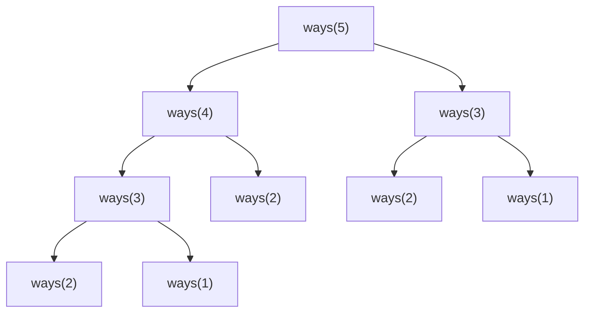

You are asked how many distinct ways there are to climb a staircase of `n` steps if each move climbs 1 or 2 steps. The recursive answer writes itself: the last move was either a 1-step from stair `n-1` or a 2-step from stair `n-2`, so `ways(n) = ways(n-1) + ways(n-2)`. It is correct, and for `n = 45` it takes about 30 seconds in Python, because it makes roughly 3.6 billion calls to compute an answer you could write on the back of a receipt.

The recursion is not wrong. It is *wasteful*: it solves the same subproblem, `ways(20)` say, hundreds of millions of times. Dynamic programming is nothing more than the discipline of noticing that waste and solving each subproblem once. Everything else, the tables, the memo dictionaries, the "bottom-up versus top-down" debate, is bookkeeping around that single idea.

## Why the recursion explodes

Draw the call tree for `ways(5)`:



`ways(3)` appears twice, `ways(2)` three times. The tree has about `1.6ⁿ` nodes because every internal node spawns two children and the depth shrinks by only one or two per level. But there are only `n + 1` *distinct* subproblems: `ways(0)` through `ways(n)`. The ratio between those two numbers, exponential calls versus linear distinct subproblems, is the entire opportunity.

```viz
{"type": "recursion", "algorithm": "fibonacci", "n": 6, "title": "Naive recursion: watch fib(3) and fib(2) get recomputed", "caption": "Every repeated subtree is wasted work. The number of distinct arguments is tiny compared with the number of calls."}
```

## The two properties that make a problem DP

A problem is a dynamic-programming problem when it has both of these:

**Optimal substructure.** The answer to the whole problem can be assembled from answers to smaller instances of the *same* problem. "Number of ways to reach stair `n`" decomposes into "number of ways to reach stair `n-1`" and "stair `n-2`". "Shortest path from A to Z" decomposes into "shortest path from A to some neighbour Y of Z, plus the edge Y→Z". Counting and optimisation problems usually have it; problems where the best choice now depends on the *entire* history usually do not (and when they do, the history has to become part of the state, which is where DP gets expensive).

**Overlapping subproblems.** The decomposition hits the same smaller instances repeatedly. Merge sort has optimal substructure (sort the halves, merge) but its subproblems are disjoint, every element is in exactly one half at each level, so there is nothing to reuse and merge sort is divide and conquer, not DP. Climbing stairs, shortest paths and edit distance all revisit the same states, so caching pays.

If a problem has the first property but not the second, use [divide and conquer](/learn/algorithms/divide-and-conquer/divide-and-conquer-thinking). If it has a *greedy-choice* property, where one locally best decision is always safe, you do not need to explore alternatives at all and [greedy](/learn/algorithms/greedy/greedy-and-exchange-arguments) beats DP. DP sits in the middle: you must consider several choices at each step, but the consequences of a choice depend only on a small summary of the past, the state.

## The four-step procedure

Every DP solution in this module, from climbing stairs to matrix chain multiplication, is produced by answering four questions in order. Write them down; say them out loud in interviews.

1. **State.** What is a subproblem, and what parameters identify it? Write it as a sentence: "`dp[i]` is the number of ways to reach stair `i`." The sentence must be precise enough that a stranger could compute `dp[i]` by hand for any `i`.
2. **Transition.** How does one state's answer follow from smaller states? `dp[i] = dp[i-1] + dp[i-2]`. This is the recurrence. It comes from asking "what was the *last* decision?" and summing or minimising over the possibilities.
3. **Order (and base cases).** Which states have no dependencies (`dp[0] = 1`, `dp[1] = 1`), and in what order must the rest be computed so that every dependency is already filled? For a 1-D array, increasing `i`. For a grid, row by row. For intervals, by increasing length.
4. **Answer.** Which state (or combination of states) is the final answer? `dp[n]`. It is not always the last cell; in longest increasing subsequence it is the *maximum* over all cells.

The state definition is where candidates fail. A vague state ("`dp[i]` has something to do with the first `i` elements") produces a transition you cannot justify. A precise state produces a transition almost mechanically. When you are stuck on a DP problem, the fix is nearly always to go back and sharpen the state, often by adding a dimension ("`dp[i][holding]`: best profit after day `i` *given whether you hold a share*").

## Two ways to fill the table

Once you have the recurrence, there are two ways to evaluate it without repeating work.

### Top-down: memoisation

Keep the recursive function, add a cache keyed by the state. Before computing, check the cache; after computing, store the result.

```python
from functools import lru_cache

def climb(n: int) -> int:
    @lru_cache(maxsize=None)
    def ways(i: int) -> int:
        if i <= 1:
            return 1
        return ways(i - 1) + ways(i - 2)
    return ways(n)
```

```javascript
function climb(n) {
  const memo = new Map();
  function ways(i) {
    if (i <= 1) return 1;
    if (memo.has(i)) return memo.get(i);
    const r = ways(i - 1) + ways(i - 2);
    memo.set(i, r);
    return r;
  }
  return ways(n);
}
```

Each distinct state is computed once; every other call is a cache hit. Time drops from `O(1.6ⁿ)` to `O(n)`. The cost is the call stack: `ways(n)` recurses `n` deep before the first base case returns, so `n = 10⁵` overflows Python's default recursion limit (about 1,000 frames) and will stress JavaScript engines too (limits vary by engine and frame size; think roughly ten thousand frames, not a million).

### Bottom-up: tabulation

Reverse the direction: start from the base cases and fill an array in dependency order until you reach the answer.

```python
def climb(n: int) -> int:
    dp = [0] * (n + 1)
    dp[0] = dp[1] = 1
    for i in range(2, n + 1):
        dp[i] = dp[i - 1] + dp[i - 2]
    return dp[n]
```

Watch the table fill:

```viz
{"type": "dp", "algorithm": "climbing-stairs", "n": 7, "title": "Bottom-up: dp[i] = dp[i-1] + dp[i-2]", "caption": "Each cell reads two already-filled cells to its left. The order (increasing i) guarantees the dependencies exist."}
```

| `i` | 0 | 1 | 2 | 3 | 4 | 5 | 6 | 7 |
|---|---|---|---|---|---|---|---|---|
| `dp[i]` | 1 | 1 | 2 | 3 | 5 | 8 | 13 | 21 |

Because `dp[i]` only reads `dp[i-1]` and `dp[i-2]`, you can throw away everything older and keep two variables, dropping memory from `O(n)` to `O(1)`. This *rolling window* trick recurs in almost every DP family and gets its own treatment in [DP craft](/learn/algorithms/dynamic-programming/dp-craft).

### Choosing between them

| | Top-down (memo) | Bottom-up (table) |
|---|---|---|
| Ease of writing | Recurrence → code directly; order is implicit | You must work out the fill order |
| Subproblems computed | Only those actually needed | All of them, even unreachable ones |
| Stack | Recursion depth = longest dependency chain; can overflow | None |
| Memory optimisation | Hard (the cache holds everything) | Easy (rolling rows/variables) |
| Constant factors | Function-call and hash overhead per state | Tight loop over an array; cache-friendly |

In an interview, write top-down first if the recurrence has awkward dependencies (intervals, trees, bitmasks) or if only a sparse set of states is reachable. Write bottom-up when the state space is a dense rectangle and you may need to optimise memory. Say which you are choosing and why; that sentence alone is a senior signal.

## A worked example with a real decision: minimum cost stairs

Counting ways has no choices, only sums. Most DP problems *optimise* over choices. Take this variant: each stair `i` has a cost `cost[i]` you pay when you step *on* it; you may start on stair 0 or stair 1; you may climb 1 or 2 stairs at a time; and the "top" is one past the last stair. Minimise the total cost.

Run the procedure.

1. **State.** `dp[i]` = the minimum cost to *stand on* stair `i` (having paid for it). Alternative state definitions exist ("minimum cost to *reach* `i` without paying for it yet"); either works as long as the transition and answer are consistent with the sentence you wrote.
2. **Transition.** The last move onto stair `i` came from `i-1` or `i-2`, so `dp[i] = cost[i] + min(dp[i-1], dp[i-2])`. The `min` is the decision; the DP tries both and keeps the cheaper.
3. **Order and base cases.** `dp[0] = cost[0]`, `dp[1] = cost[1]` (you may start on either without paying for anything before). Then increasing `i`.
4. **Answer.** The top is stair `n`, which has no cost, reached from `n-1` or `n-2`: `min(dp[n-1], dp[n-2])`.

Trace with `cost = [1, 100, 1, 1, 1, 100, 1, 1, 100, 1]` (`n = 10`):

| `i` | 0 | 1 | 2 | 3 | 4 | 5 | 6 | 7 | 8 | 9 |
|---|---|---|---|---|---|---|---|---|---|---|
| `cost[i]` | 1 | 100 | 1 | 1 | 1 | 100 | 1 | 1 | 100 | 1 |
| `dp[i]` | 1 | 100 | 2 | 3 | 3 | 103 | 4 | 5 | 104 | 6 |

Check a cell: `dp[4] = cost[4] + min(dp[3], dp[2]) = 1 + min(3, 2) = 3`. `dp[5] = 100 + min(3, 3) = 103`. Answer: `min(dp[9], dp[8]) = min(6, 104) = 6`. The path was 0 → 2 → 3 → 4 → 6 → 7 → 9 → top, paying 1 each time on six stairs.

Note what the table does *not* store: the path. `dp[i]` is a number, not a route. If the interviewer asks "which stairs?", you either store, per cell, which predecessor won (the parent pointer), or walk backwards from the answer re-checking which predecessor produces the stored value. Reconstruction is covered in [DP craft](/learn/algorithms/dynamic-programming/dp-craft).

## Complexity: states times transition cost

The running time of a DP is `(number of distinct states) × (work per transition)`, provided each state is computed once. Climbing stairs has `n` states and an `O(1)` transition: `O(n)`. Edit distance on strings of length `m` and `n` has `m·n` states and an `O(1)` transition: `O(mn)`. Longest increasing subsequence in its simple form has `n` states but each transition scans all earlier states: `O(n²)`. Matrix chain multiplication has `O(n²)` interval states and an `O(n)` transition (try every split): `O(n³)`.

This formula is also how you *estimate whether DP will be fast enough* before writing it. If the state has to include a subset of `n` items, there are `2ⁿ` states and DP is feasible for `n ≤ 20` or so, not for `n = 100`. If a candidate proposes a state and cannot say how many of them there are, they have not finished designing the algorithm.

Memory is the number of states you have to keep *simultaneously*, which is often less than the total: the rolling-window trick keeps only the rows the transition reads.

## Recognising DP in a problem statement

Signals that a problem wants DP:

- It asks for a **count** ("how many ways"), an **optimum** ("minimum cost", "longest", "maximum profit"), or a **yes/no on existence** ("can you partition…"), over sequences of choices.
- The input is a sequence, a grid, a pair of strings, or a set with a small capacity bound, and the constraints (`n ≤ 1000`, `n ≤ 5000`) suggest `O(n²)` is expected rather than `O(n log n)`.
- A brute-force recursion is easy to write and obviously exponential.
- Greedy feels plausible but you can construct a counterexample.

Signals that it does *not*: the "optimal" choice is provably safe locally (greedy); subproblems do not overlap (divide and conquer); the state would need the full history (search with pruning, or the problem is NP-hard and the interviewer wants backtracking with heuristics).

## Exercises

```exercise
id: count-ways-with-steps
title: Count staircase paths with arbitrary step sizes
prompt: |
  There are `n` stairs and you start at the bottom (stair 0). In one move you
  may climb any number of stairs listed in `steps` (a non-empty list of
  distinct positive integers). Return the number of distinct ordered
  sequences of moves that land exactly on stair `n`.

  `n = 0` has exactly one way (do nothing). Use bottom-up DP: define
  `dp[i]` as the number of ways to reach stair `i` and fill increasing `i`.
  Results fit in a 64-bit integer for the tests.
languages: [python, javascript]
entry: count_ways
starter:
  python: |
    def count_ways(n, steps):
        # dp[i] = number of ways to reach stair i
        return 0
  javascript: |
    function count_ways(n, steps) {
      // dp[i] = number of ways to reach stair i
      return 0;
    }
tests:
  - args: [4, [1, 2]]
    expected: 5
  - args: [5, [1, 2, 3]]
    expected: 13
  - args: [0, [1, 2]]
    expected: 1
    label: zero stairs
  - args: [3, [2]]
    expected: 0
    label: unreachable
  - args: [10, [1, 2]]
    expected: 89
  - args: [7, [1, 3, 5]]
    expected: 12
    hidden: true
  - args: [12, [3, 4]]
    expected: 2
    hidden: true
    label: only 3+3+3+3 and 4+4+4
hints:
  - "dp[0] = 1. For each i from 1 to n, dp[i] = sum of dp[i - s] for every s in steps with s <= i."
  - "Order matters here (1 then 2 differs from 2 then 1), so the outer loop is over i and the inner loop over steps."
```

```exercise
id: min-cost-stairs
title: Minimum cost to climb the stairs
prompt: |
  `cost[i]` is the price of standing on stair `i`. You may start on stair 0
  or stair 1, and from stair `i` you may move to `i + 1` or `i + 2`. The top
  is one past the last stair and costs nothing. Return the minimum total
  cost to reach the top.

  `cost` has at least two elements. Solve it bottom-up in O(n) time and
  O(1) extra space (two rolling variables are enough).
languages: [python, javascript]
entry: min_cost_climbing
starter:
  python: |
    def min_cost_climbing(cost):
        # your code here
        return 0
  javascript: |
    function min_cost_climbing(cost) {
      // your code here
      return 0;
    }
tests:
  - args: [[10, 15, 20]]
    expected: 15
  - args: [[1, 100, 1, 1, 1, 100, 1, 1, 100, 1]]
    expected: 6
  - args: [[5, 5]]
    expected: 5
    label: two stairs
  - args: [[0, 0, 0, 0]]
    expected: 0
    label: all free
  - args: [[3, 2, 9, 1, 4, 7]]
    expected: 7
    hidden: true
  - args: [[8, 1]]
    expected: 1
    hidden: true
hints:
  - "dp[i] = cost[i] + min(dp[i-1], dp[i-2]); the answer is min(dp[n-1], dp[n-2])."
  - "You only ever read the previous two values, so keep them in two variables and shift."
```

## Senior signals

- You state the **state definition as a sentence** before writing any code, and you can compute a cell by hand from that sentence alone.
- You derive the transition by asking "**what was the last decision?**" and you can say why every alternative is covered.
- You give the running time as **states × transition cost** and use it to sanity-check feasibility against the constraints before coding.
- You choose top-down or bottom-up **deliberately** (sparse states or awkward order → memo; dense table or memory pressure → tabulation) and say why.
- You know the table stores values, not choices, and you can explain how to **reconstruct the solution** when asked.
- You can tell DP apart from divide and conquer (no overlap) and greedy (a safe local choice) and name the property that decides.

## Check yourself

```quiz
- q: >-
    A recursive solution has optimal substructure but its subproblems never overlap. What should you do?
  options: ["Add memoisation; it never hurts", "Use divide and conquer; a cache would store every result once and never hit", "Convert to a greedy algorithm", "Switch to bottom-up tabulation"]
  answer: 1
  explanation: >-
    A cache only pays when the same state is requested more than once. With disjoint subproblems (merge sort, quicksort) the memo costs memory and hashing for zero hits. Greedy needs a separate safe-choice property, which is not implied here.
- q: >-
    You define dp[i] as "something about the first i elements" and cannot write a transition. What is the most likely fix?
  options: ["Switch from top-down to bottom-up", "Sharpen the state definition, often by adding a dimension that captures what the transition needs to know", "Increase the recursion limit", "Precompute prefix sums"]
  answer: 1
  explanation: >-
    A transition can only be derived from a precise state. If the last decision depends on information the state does not carry (are you holding a share? what was the previous element?), that information must become part of the state.
- q: >-
    A DP has O(n²) states and each transition scans O(n) earlier states. n = 5000. Is it fast enough for a typical 1–2 second limit?
  options: ["Yes, O(n²) is fine for 5000", "No, the total is O(n³) ≈ 1.25 × 10¹¹ operations", "Yes, memoisation reduces it to O(n²)", "It depends on whether you use top-down or bottom-up"]
  answer: 1
  explanation: >-
    Running time is states × transition cost = n² × n = n³. Memoisation only guarantees each state is computed once; it does not shrink the per-state work. Top-down vs bottom-up changes constants, not the exponent.
- q: >-
    Which is a genuine advantage of top-down memoisation over bottom-up tabulation?
  options: ["It uses less memory because it can roll rows", "It never overflows the stack", "It computes only the states that are actually reachable from the initial call", "It is always faster in wall-clock time"]
  answer: 2
  explanation: >-
    Tabulation fills the whole table including states the answer never depends on; memoisation touches only what the recursion requests. Memory rolling and stack safety are advantages of bottom-up, and per-state overhead usually makes memo slower.
- q: >-
    For min-cost climbing stairs with cost = [10, 15, 20], why is the answer 15 and not 10?
  options: ["Because you must start on stair 1", "Because the top is one past the last stair, so from stair 0 you must still step on stair 1 or 2, while from stair 1 a single 2-step reaches the top", "Because the DP takes the minimum of the whole array", "Because stair 0 is free"]
  answer: 1
  explanation: >-
    Starting on stair 0 costs 10 and then you must pay 15 or 20 to make progress (total 25 or 30). Starting on stair 1 costs 15 and a 2-step lands on the top, which is free. The answer is min(dp[n-1], dp[n-2]) = min(15, 30) = 15.
```
