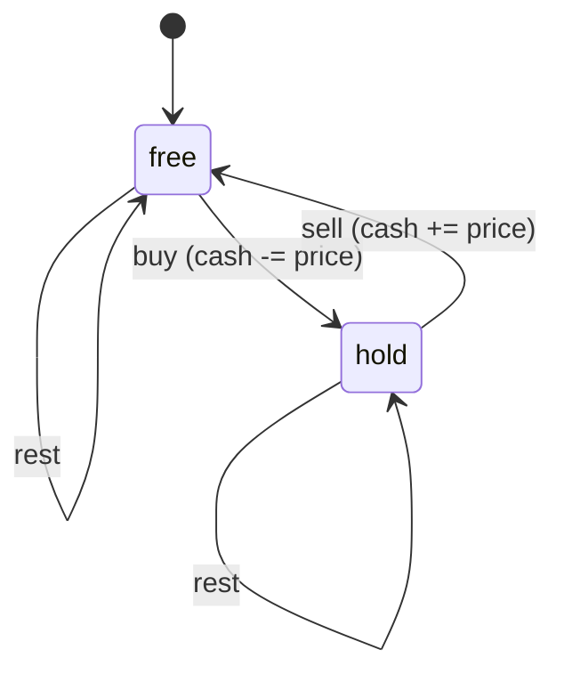

Stock prices for a week: `[7, 1, 5, 3, 6, 4]`. Buy once, sell once, maximise profit: buy at 1, sell at 6, profit 5, and a single pass tracking the running minimum does it. Now allow unlimited transactions but impose a one-day cooldown after each sale. Or allow at most two transactions. Or charge a fee per trade. Each variant seems to need a new trick, and the internet is full of ad-hoc solutions to each. There is one idea that solves all of them: put *what you are currently holding* into the state, and the transitions become a small state machine you can draw.

Sequence DP is the family where the state is an index into a sequence plus, sometimes, a small amount of extra information about the situation at that index: the last element chosen, whether you hold a share, how many transactions remain. This lesson covers the three canonical members: longest increasing subsequence, maximum subarray (Kadane), and the buy/sell state machines.

## Longest increasing subsequence in O(n²)

`[10, 9, 2, 5, 3, 7, 101, 18]` has LIS `[2, 3, 7, 101]` (or `[2, 5, 7, 18]`), length 4.

The natural first attempt, "`dp[i]` = length of the LIS in the first `i` elements", fails: knowing the LIS of `[10, 9, 2, 5]` is 2 tells you nothing about whether `3` extends it, because you do not know what the LIS *ends with*. The state must carry that information, and the cheapest way is to make the state "ends at `i`":

**State.** `dp[i]` = the length of the longest increasing subsequence that **ends exactly at index `i`** (and therefore includes `nums[i]`).

**Transition.** The element before `nums[i]` in that subsequence is some `nums[j]` with `j < i` and `nums[j] < nums[i]`, and before it the best subsequence ending at `j`:

$$dp[i] = 1 + \max\{\, dp[j] : j < i,\ nums[j] < nums[i] \,\}$$

with the max of an empty set being 0.

**Order.** Increasing `i`. **Answer.** `max(dp)`, not `dp[n-1]`, because the LIS can end anywhere. Forgetting this is the classic LIS bug.

Trace:

| `i` | 0 | 1 | 2 | 3 | 4 | 5 | 6 | 7 |
|---|---|---|---|---|---|---|---|---|
| `nums[i]` | 10 | 9 | 2 | 5 | 3 | 7 | 101 | 18 |
| smaller predecessors `j` | – | – | – | 2 | 2 | 2,3,4 | all | 0..5 |
| `dp[i]` | 1 | 1 | 1 | 2 | 2 | 3 | **4** | 4 |

`dp[5]` (value 7): predecessors with smaller values are indices 2, 3, 4 with `dp` 1, 2, 2, so `1 + 2 = 3`. `dp[7]` (value 18): all of 0..5 are smaller; the best is `dp[5] = 3`, so 4. Answer `max = 4`.

```viz
{"type": "dp", "algorithm": "lis", "values": [10, 9, 2, 5, 3, 7, 101, 18], "title": "LIS O(n²): dp[i] = 1 + max dp[j] over smaller earlier elements", "caption": "Each cell scans everything to its left. The answer is the maximum cell, not the last one."}
```

```python
def length_of_lis_quadratic(nums: list[int]) -> int:
    n = len(nums)
    if n == 0:
        return 0
    dp = [1] * n
    for i in range(n):
        for j in range(i):
            if nums[j] < nums[i]:
                dp[i] = max(dp[i], dp[j] + 1)
    return max(dp)
```

`n` states, `O(n)` transition: `O(n²)`. Fine for `n ≤ 5000`. The "ends at `i`" state pattern recurs constantly: longest arithmetic subsequence, number of LIS, longest chain of pairs, Russian doll envelopes. Whenever the transition needs to know the last element chosen, end the state at that element.

## LIS in O(n log n): the tails array

The quadratic transition scans all `j < i` to find the best predecessor. The faster algorithm changes what is stored so that the scan becomes a binary search.

Maintain `tails[k]` = the **smallest possible last element** of an increasing subsequence of length `k + 1` seen so far. This array is always sorted (if a length-3 subsequence ends in 7, a length-2 one ends in something smaller). For each new `x`:

- If `x` is larger than every tail, it extends the longest subsequence: append.
- Otherwise, find the first tail `≥ x` (binary search, `bisect_left`) and replace it with `x`: a subsequence of that length can now end with the smaller value `x`, which makes future extensions easier and never hurts.

Trace `[10, 9, 2, 5, 3, 7, 101, 18]`:

| `x` | action | `tails` |
|---|---|---|
| 10 | append | `[10]` |
| 9 | replace 10 | `[9]` |
| 2 | replace 9 | `[2]` |
| 5 | append | `[2, 5]` |
| 3 | replace 5 | `[2, 3]` |
| 7 | append | `[2, 3, 7]` |
| 101 | append | `[2, 3, 7, 101]` |
| 18 | replace 101 | `[2, 3, 7, 18]` |

Answer: `len(tails) = 4`. Two things to say out loud in an interview: first, `tails` is **not** in general an LIS. It happens to be one here, but run the algorithm on `[3, 4, 1]`: `[3]`, then `[3, 4]`, then the 1 replaces the 3 to give `[1, 4]`, which is not a subsequence of the input at all (the 1 comes after the 4). The length, 2, is still right. Second, the length is correct because each `tails[k]` is a genuine end of some length-`k+1` increasing subsequence, and the array's length is the longest such. If you need the actual subsequence, store for each element which tail slot it landed in and its predecessor, then walk back.

```python
from bisect import bisect_left

def length_of_lis(nums: list[int]) -> int:
    tails: list[int] = []
    for x in nums:
        k = bisect_left(tails, x)      # first tail >= x (strict increase); bisect_right for non-decreasing
        if k == len(tails):
            tails.append(x)
        else:
            tails[k] = x
    return len(tails)
```

`bisect_left` gives strictly increasing subsequences (`[7, 7, 7]` → 1); `bisect_right` gives non-decreasing (`[7, 7, 7]` → 3). Interviewers switch between the two to see whether you know which line changes.

## Maximum subarray: Kadane as a DP

Find the contiguous subarray with the largest sum in `[-2, 1, -3, 4, -1, 2, 1, -5, 4]`: it is `[4, -1, 2, 1]`, sum 6.

The same "ends at `i`" trick applies. **State.** `dp[i]` = the maximum sum of a subarray that ends exactly at `i`. **Transition.** The subarray ending at `i` either is just `nums[i]` alone, or extends the best subarray ending at `i-1`:

$$dp[i] = nums[i] + \max(dp[i-1],\, 0)$$

**Answer.** `max(dp)`.

| `i` | 0 | 1 | 2 | 3 | 4 | 5 | 6 | 7 | 8 |
|---|---|---|---|---|---|---|---|---|---|
| `nums[i]` | -2 | 1 | -3 | 4 | -1 | 2 | 1 | -5 | 4 |
| `dp[i]` | -2 | 1 | -2 | 4 | 3 | 5 | **6** | 1 | 5 |

`dp[3] = 4 + max(-2, 0) = 4`: the running sum before it was negative, so start fresh. `dp[6] = 1 + 5 = 6`. Since `dp[i]` reads only `dp[i-1]`, keep one variable: that is Kadane's algorithm, and it is not a separate trick, it is this DP with the rolling-variable optimisation applied.

```viz
{"type": "dp", "algorithm": "max-subarray", "values": [-2, 1, -3, 4, -1, 2, 1, -5, 4], "title": "Kadane: dp[i] = nums[i] + max(dp[i-1], 0)", "caption": "A negative running sum is dropped (reset to the current element). The answer is the maximum over all positions."}
```

The all-negative case matters: `[-3, -1, -2]` has answer `-1` (the subarray must be non-empty). Initialising the answer to `0` returns `0`, which is wrong. Initialise to `nums[0]` or `-∞`.

**Maximum product subarray** looks the same but a negative times a negative is positive, so the best product ending at `i` might come from the *smallest* product ending at `i-1`. Track both: `hi[i] = max(x, x·hi[i-1], x·lo[i-1])`, `lo[i] = min(x, x·hi[i-1], x·lo[i-1])`. That is a state with two values per index, which is the bridge to the next section.

## State machines: buy and sell

Return to the stock problems. The information the transition needs at day `i` is whether you currently hold a share. Make it part of the state.

**State.** `hold[i]` = the maximum cash after day `i` if you end the day holding one share; `free[i]` = the maximum cash if you end the day holding none. Cash can be negative (you bought).

**Transitions** (unlimited transactions):

- `hold[i] = max(hold[i-1], free[i-1] - price[i])`: keep holding, or buy today.
- `free[i] = max(free[i-1], hold[i-1] + price[i])`: stay out, or sell today.

**Base.** `hold[-1] = -∞` (cannot hold before day 0), `free[-1] = 0`. Or `hold[0] = -price[0]`, `free[0] = 0`. **Answer.** `free[n-1]` (ending with a share is never better than having sold it).



Now every variant is an edit to this diagram:

**Cooldown** (must skip a day after selling): add a `cooldown` state. Selling moves you to `cooldown`, not `free`, and `cooldown` moves to `free` the next day. The transitions become `hold[i] = max(hold[i-1], free[i-1] - p)`, `sold[i] = hold[i-1] + p`, `free[i] = max(free[i-1], sold[i-1])`, answer `max(free[n-1], sold[n-1])`.

Trace `prices = [1, 2, 3, 0, 2]`:

| day | price | `hold` | `sold` | `free` |
|---|---|---|---|---|
| 0 | 1 | -1 | -∞ | 0 |
| 1 | 2 | -1 | 1 | 0 |
| 2 | 3 | -1 | 2 | 1 |
| 3 | 0 | max(-1, 1 − 0) = 1 | -1 | max(1, 2) = 2 |
| 4 | 2 | 1 | 1 + 2 = 3 | 2 |

Answer `max(free, sold) = 3`: buy at 1 on day 0, sell at 2 on day 1 (`sold = 1`), cool down on day 2, buy at 0 on day 3 (`hold = free[2] − 0 = 1`), sell at 2 on day 4 (`sold = 3`). Without the cooldown the answer would be 4 (1→3 and 0→2). The table is doing the case analysis that makes people's ad-hoc solutions wrong.

**Transaction fee**: subtract the fee on sell. **At most `k` transactions**: add a dimension, `hold[i][t]`/`free[i][t]` for `t` transactions used, `O(nk)`. **At most 2 transactions**: `k = 2`, or four rolling variables (`buy1, sell1, buy2, sell2`), which is the same table with `k` unrolled.

```python
def max_profit_with_cooldown(prices: list[int]) -> int:
    NEG = float('-inf')
    hold, sold, free = NEG, NEG, 0
    for p in prices:
        hold, sold, free = max(hold, free - p), hold + p, max(free, sold)
    return max(free, sold)
```

Notice the simultaneous assignment: every new value is computed from the *previous* day's values. In JavaScript, compute all three into temporaries before assigning, or you will read a half-updated state. That bug is invisible on most inputs and fatal on the right one, which is why interviewers like this problem.

## The pattern: what does the transition need to know?

| Problem | Extra state beyond the index | Why |
|---|---|---|
| LIS | (none; "ends at `i`" encodes it) | The transition must know the last element |
| Max subarray | (none; "ends at `i`") | The transition must know whether the run is still open |
| Max product | best and worst product ending at `i` | Sign flips make the worst useful |
| Stock, unlimited | holding / not holding | Buy and sell are only legal from one of the two |
| Stock, cooldown | holding / just sold / free | The cooldown is a third situation |
| Stock, `k` transactions | holding × transactions used | The budget constrains future moves |
| Paint house / colour fence | colour used at `i` | Adjacent constraint depends on the previous choice |

In every row, the state is "index plus the minimum summary of the past that the next decision depends on". If your first state definition produces an unjustifiable transition, that summary is what is missing. This is the same diagnosis as in [the DP mindset](/learn/algorithms/dynamic-programming/the-dp-mindset), now with a concrete recipe: draw the situations you can be in after processing element `i`, and the legal moves between them, and you have both the state and the transition.

## Exercises

```exercise
id: length-of-lis
title: Longest strictly increasing subsequence
prompt: |
  Return the length of the longest strictly increasing subsequence of
  `nums` (elements need not be contiguous). The array may be empty.

  Implement the O(n log n) tails-array method with a hand-written binary
  search (lower bound: first index whose tail is >= x).
languages: [python, javascript]
entry: length_of_lis
starter:
  python: |
    def length_of_lis(nums):
        tails = []
        # for each x: find first tail >= x by binary search; replace or append
        return len(tails)
  javascript: |
    function length_of_lis(nums) {
      const tails = [];
      // for each x: find first tail >= x by binary search; replace or append
      return tails.length;
    }
tests:
  - args: [[10, 9, 2, 5, 3, 7, 101, 18]]
    expected: 4
  - args: [[0, 1, 0, 3, 2, 3]]
    expected: 4
  - args: [[7, 7, 7, 7]]
    expected: 1
    label: strictly increasing means duplicates do not count
  - args: [[]]
    expected: 0
    label: empty
  - args: [[5]]
    expected: 1
  - args: [[3, 1, 2]]
    expected: 2
    hidden: true
  - args: [[1, 3, 6, 7, 9, 4, 10, 5, 6]]
    expected: 6
    hidden: true
hints:
  - "tails[k] is the smallest tail of any increasing subsequence of length k+1; it stays sorted, so binary search for the first tail >= x."
  - "If the search runs off the end, append; otherwise overwrite that slot. The length of tails is the answer."
```

```exercise
id: stock-with-cooldown
title: Best time to buy and sell with cooldown
prompt: |
  `prices[i]` is the price on day `i`. You may buy and sell as many times
  as you like, holding at most one share at a time, but after selling you
  must wait one full day before buying again. Return the maximum profit.
  Return 0 for empty input or when no profitable trade exists.

  Use three rolling states: holding, just sold (in cooldown), and free.
languages: [python, javascript]
entry: max_profit_cooldown
starter:
  python: |
    def max_profit_cooldown(prices):
        # hold, sold, free = -inf, -inf, 0; update all three from the previous day's values
        return 0
  javascript: |
    function max_profit_cooldown(prices) {
      // hold, sold, free = -Infinity, -Infinity, 0; compute new values before assigning
      return 0;
    }
tests:
  - args: [[1, 2, 3, 0, 2]]
    expected: 3
  - args: [[1]]
    expected: 0
    label: single day
  - args: [[]]
    expected: 0
    label: empty
  - args: [[2, 1]]
    expected: 0
    label: falling prices
  - args: [[1, 2, 4]]
    expected: 3
  - args: [[2, 1, 4, 1, 5]]
    expected: 4
    hidden: true
    label: cooldown blocks the second trade
  - args: [[6, 1, 3, 2, 4, 7]]
    expected: 6
    hidden: true
hints:
  - "hold' = max(hold, free - p); sold' = hold + p; free' = max(free, sold). Answer max(free, sold)."
  - "Compute all three new values from the old ones before assigning any of them."
```

## Senior signals

- You define sequence states as **"ends at `i`"** when the transition needs the last element, and you take the **max over all cells** for the answer.
- You explain the `O(n log n)` LIS via **smallest tails per length**, you say clearly that `tails` is not itself an LIS, and you know that `bisect_left` versus `bisect_right` is the strict/non-strict switch.
- You present Kadane as **a DP with a rolling variable**, and you initialise the answer to the first element so all-negative arrays are correct.
- You solve every stock variant by **drawing the state machine** (hold / free / cooldown / transactions used) rather than recalling separate tricks.
- You write **simultaneous updates** for multi-state rolling DPs and can name the bug that sequential assignment causes.
- You diagnose a stuck DP by asking **"what does the next decision need to know about the past?"** and adding exactly that to the state.

## Check yourself

```quiz
- q: >-
    For LIS you define dp[i] as the LIS length among the first i elements. Why does the transition fail?
  options: ["Because the prefix LIS length does not reveal its last element", "Because the answer must then be max(dp) rather than dp[n]", "It does not fail; this prefix state is the usual definition", "Because duplicate values make the prefix LIS length ambiguous"]
  answer: 0
  explanation: >-
    Two subsequences of equal length can end in very different values, and whether nums[i] extends one depends on that ending value, which the length alone does not carry. The 'ends at i' state carries that information implicitly, at the cost of taking a max over all cells for the answer; a prefix state would have its answer at dp[n], so the answer location is not the problem.
- q: >-
    After processing [3, 4, 1], the tails array is [1, 4]. Which statement is true?
  options: ["The LIS length is 1, because the new 1 replaced the 3", "tails must be re-sorted after every replacement", "[1, 4] is an LIS of the input, with length 2", "The LIS length is 2, but [1, 4] is not a subsequence"]
  answer: 3
  explanation: >-
    The 1 replaced the 3 in slot 0. Slot k only guarantees that some increasing subsequence of length k+1 ends in that value; the slots together need not form a subsequence, and here the 1 comes after the 4. The LIS is [3, 4], length 2, which is the length of tails. tails stays sorted by construction.
- q: >-
    Kadane's algorithm initialised with best = 0 is run on [-3, -1, -2]. What happens?
  options: ["Returns 0, wrong since subarrays must be non-empty", "Returns -3, since the first element seeds the best sum", "Returns -6, since every element joins the run", "Returns -1, the correct answer for this input"]
  answer: 0
  explanation: >-
    With best = 0 the algorithm effectively allows an empty subarray. The DP values dp[i] are correct (-3, -1, -2), but the initial 0 wins the max, so it returns 0 instead of -1. Initialise best to nums[0] or -infinity.
- q: >-
    In the unlimited-transactions stock DP, why is the answer free[n-1] rather than max(free[n-1], hold[n-1])?
  options: ["Because selling on the last day beats still holding", "Because the problem forbids buying on the final day", "It should be the max; free[n-1] can miss the optimum", "Because hold[n-1] is always −∞ by the final day"]
  answer: 0
  explanation: >-
    Cash while holding is cash-after-purchase; selling on the last day at any positive price strictly increases it, and free[n-1] already includes that option: free[n-1] >= hold[n-1] + price[n-1] > hold[n-1]. hold[n-1] is finite once any purchase is possible. Taking the max is harmless but shows you have not reasoned about the states.
- q: >-
    You implement the cooldown DP in JavaScript as hold = Math.max(hold, free - p); sold = hold + p; free = Math.max(free, sold); in that order. What is wrong?
  options: ["Later lines read today's new values, allowing illegal moves", "Math.max mishandles -Infinity, so hold is never set", "The three states must be arrays indexed by day to be correct", "Nothing, since JavaScript runs the three statements in order"]
  answer: 0
  explanation: >-
    Each new state must be computed from the previous day's values. Here sold uses the already-updated hold (buying and selling on the same day), and free uses the already-updated sold (skipping the cooldown). Running in order is exactly the problem. Use temporaries or destructuring assignment; arrays are not required, and Math.max handles -Infinity correctly.
```
