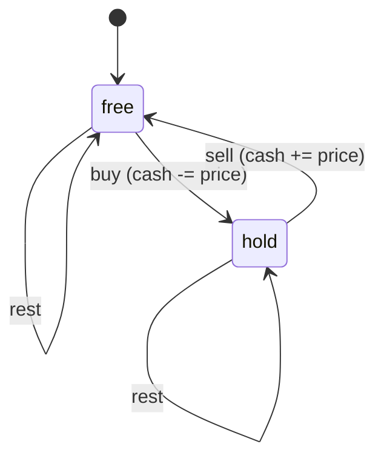

Stock prices for a week: `[7, 1, 5, 3, 6, 4]`. Buy once, sell once, maximise profit: buy at 1, sell at 6, profit 5, and a single pass tracking the running minimum does it. Now allow unlimited transactions but impose a one-day cooldown after each sale. Or allow at most two transactions. Or charge a fee per trade. Each variant seems to need a new trick, and the internet is full of ad-hoc solutions to each. There is one idea that solves all of them: put *what you are currently holding* into the state, and the transitions become a small state machine you can draw.

Sequence DP is the family where the state is an index into a sequence plus, sometimes, a small amount of extra information about the situation at that index: the last element chosen, whether you hold a share, how many transactions remain. This lesson covers the three canonical members: longest increasing subsequence, maximum subarray (Kadane), and the buy/sell state machines, with the correctness argument for each and the `O(n log n)` LIS traced down to its binary-search steps.

## Longest increasing subsequence in O(n²)

`[10, 9, 2, 5, 3, 7, 101, 18]` has LIS `[2, 3, 7, 101]` (or `[2, 5, 7, 18]`), length 4.

The natural first attempt, "`dp[i]` = length of the LIS in the first `i` elements", fails: knowing the LIS of `[10, 9, 2, 5]` is 2 tells you nothing about whether `3` extends it, because you do not know what the LIS *ends with*. The state must carry that information, and the cheapest way is to make the state "ends at `i`":

**State.** `dp[i]` = the length of the longest increasing subsequence that **ends exactly at index `i`** (and therefore includes `nums[i]`).

**Transition.** The element before `nums[i]` in that subsequence is some `nums[j]` with `j < i` and `nums[j] < nums[i]`, and before it the best subsequence ending at `j`:

$$dp[i] = 1 + \max\{\, dp[j] : j < i,\ nums[j] < nums[i] \,\}$$

with the max of an empty set being 0.

**Order.** Increasing `i`. **Answer.** `max(dp)`, not `dp[n-1]`, because the LIS can end anywhere. Forgetting this is the classic LIS bug.

Trace:

| `i` | 0 | 1 | 2 | 3 | 4 | 5 | 6 | 7 |
|---|---|---|---|---|---|---|---|---|
| `nums[i]` | 10 | 9 | 2 | 5 | 3 | 7 | 101 | 18 |
| smaller predecessors `j` | – | – | – | 2 | 2 | 2,3,4 | all | 0..5 |
| `dp[i]` | 1 | 1 | 1 | 2 | 2 | 3 | **4** | 4 |

`dp[3]` (value 5): the only smaller earlier value is `nums[2] = 2` with `dp[2] = 1`, so `1 + 1 = 2`. `dp[5]` (value 7): predecessors with smaller values are indices 2, 3, 4 with `dp` 1, 2, 2, so `1 + 2 = 3`. `dp[7]` (value 18): all of 0..5 are smaller; the best is `dp[5] = 3`, so 4. Answer `max = 4`.

### Why the state is sufficient

**Why "ends at `i`" works.** Whether a later element can extend a subsequence depends only on the subsequence's last value; the length is the quantity being maximised; and `i` fixes both the last value (`nums[i]`) and which elements remain (`i+1..`). Two subsequences ending at the same `i` are therefore interchangeable for every future decision, and only the longer one matters. **Why the transition is exhaustive.** The predecessor of `nums[i]` in any increasing subsequence ending at `i` is either nothing (length 1) or some `j < i` with `nums[j] < nums[i]`; the recurrence tries all of them. Cut-and-paste closes it: if the subsequence through `j` were not the best one ending at `j`, swapping in the best one would give a longer subsequence ending at `i`.

```viz
{"type": "dp", "algorithm": "lis", "values": [10, 9, 2, 5, 3, 7, 101, 18, 4], "title": "LIS O(n²): dp[i] = 1 + max dp[j] over smaller earlier elements", "caption": "The traced input with a 4 appended. Each cell scans everything to its left. dp[8] = 3 is below the maximum 4, so the answer is the maximum cell, not the last one."}
```

```python
def length_of_lis_quadratic(nums: list[int]) -> int:
    n = len(nums)
    if n == 0:
        return 0
    dp = [1] * n
    for i in range(n):
        for j in range(i):
            if nums[j] < nums[i]:
                dp[i] = max(dp[i], dp[j] + 1)
    return max(dp)
```

`n` states, `O(n)` transition: `O(n²)`. Measured here on CPython 3.14, the inner step costs about 40 ns, so `n = 4,000` takes 0.34 s and `n = 10⁵` would take about four minutes. The "ends at `i`" state pattern recurs constantly: longest arithmetic subsequence, number of LIS, longest chain of pairs, Russian doll envelopes. Whenever the transition needs to know the last element chosen, end the state at that element.

## LIS in O(n log n): patience sorting

The quadratic transition scans all `j < i` to find the best predecessor. The faster algorithm stores something different, so that the scan becomes a binary search. It is easiest to see as a card game.

Deal the cards `10, 9, 2, 5, 3, 7, 101, 18` one at a time. Each card goes on the **leftmost pile whose top card is greater than or equal to it**; if no pile qualifies, it starts a new pile to the right. Cards within a pile therefore decrease from bottom to top, and the pile tops, read left to right, are sorted ascending.

| card | piles after placing (top card last) | tops |
|---|---|---|
| 10 | `[10]` | `[10]` |
| 9 | `[10, 9]` | `[9]` |
| 2 | `[10, 9, 2]` | `[2]` |
| 5 | `[10, 9, 2]` `[5]` | `[2, 5]` |
| 3 | `[10, 9, 2]` `[5, 3]` | `[2, 3]` |
| 7 | `[10, 9, 2]` `[5, 3]` `[7]` | `[2, 3, 7]` |
| 101 | `[10, 9, 2]` `[5, 3]` `[7]` `[101]` | `[2, 3, 7, 101]` |
| 18 | `[10, 9, 2]` `[5, 3]` `[7]` `[101, 18]` | `[2, 3, 7, 18]` |

Four piles, and the LIS has length 4. That is not a coincidence, and the proof has two halves. **At most four:** any increasing subsequence uses at most one card per pile, because a pile's cards decrease from bottom to top and were dealt in that order, so two cards from one pile can never both appear in an increasing subsequence. **At least four:** when a card is placed on pile `k`, the top of pile `k−1` at that moment is smaller than it (otherwise the card would have gone there or further left) and was dealt earlier; record it as the card's predecessor. Following predecessors from the top of the last pile yields an increasing subsequence with one card per pile.

### The tails array and its binary search

The code keeps only the tops, called `tails`: `tails[k]` = the smallest possible last element of an increasing subsequence of length `k + 1` seen so far. Placing a card on the leftmost pile with top `≥ x` is `bisect_left(tails, x)`, and since `tails` is sorted the search is `O(log L)` for `L` piles.

Two of those searches, step by step. Placing `x = 3` with `tails = [2, 5]`: `lo = 0, hi = 2`, `mid = 1`, `tails[1] = 5 ≥ 3` so `hi = 1`; `mid = 0`, `tails[0] = 2 < 3` so `lo = 1`; `lo == hi == 1`, replace `tails[1]` to get `[2, 3]`. Placing `x = 18` with `tails = [2, 3, 7, 101]`: `lo = 0, hi = 4`, `mid = 2`, `7 < 18` so `lo = 3`; `mid = 3`, `101 ≥ 18` so `hi = 3`; `k = 3`, replace 101 with 18. Each probe halves the range, and the loop is the [first-true template](/learn/algorithms/sorting-searching/binary-search) with predicate `tails[i] >= x`.

```python
from bisect import bisect_left

def length_of_lis(nums: list[int]) -> int:
    tails: list[int] = []
    for x in nums:
        k = bisect_left(tails, x)      # first tail >= x (strict increase); bisect_right for non-decreasing
        if k == len(tails):
            tails.append(x)
        else:
            tails[k] = x
    return len(tails)
```

`bisect_left` gives strictly increasing subsequences (`[7, 7, 7]` → 1); `bisect_right` gives non-decreasing (`[7, 7, 7]` → 3). Interviewers switch between the two to see whether you know which line changes.

Two things to say out loud in an interview. First, `tails` is **not** in general an LIS. It happens to be one here, but run the algorithm on `[3, 4, 1]`: `[3]`, then `[3, 4]`, then the 1 replaces the 3 to give `[1, 4]`, which is not a subsequence of the input (the 1 comes after the 4). The length, 2, is still right: each `tails[k]` is the top of a real pile. Second, the algorithm is **online**: it reads each element once and keeps only `L` values, so it works on a stream of 10⁹ prices with `O(L)` memory, which the quadratic version cannot.

### Recovering the subsequence

Store two things: `prev[i]`, the index of the top of the pile to the left when `nums[i]` was placed (`−1` for pile 0), and `top[k]`, the index currently on top of pile `k`. On the trace above, `prev = [−1, −1, −1, 2, 2, 4, 5, 5]`: the 5 and the 3 both point at the 2; the 7 points at the 3 (`index 4`); 101 and 18 both point at the 7. Walk back from `top[3]` (index 7, the 18): `18 ← 7 ← 3 ← 2`, so the LIS is `[2, 3, 7, 18]`. Memory `O(n)` for `prev` plus `O(L)` for `top`, still one pass.

The speed difference is not subtle: measured here, `n = 4,000` random values took 0.34 s quadratically and 0.4 ms with `tails`, roughly 750×; at `n = 10⁵` the quadratic inner loop runs 5 × 10⁹ steps and the tails method about 1.7 × 10⁶ binary-search probes. An alternative `O(n log n)` route, a [Fenwick tree](/learn/advanced-data-structures/range-queries/fenwick-trees) over compressed values storing "best length ending with a value ≤ v", is what you use when the question also wants counts or sums along the subsequence, which `tails` cannot give.

## Maximum subarray: Kadane as a DP

Find the contiguous subarray with the largest sum in `[-2, 1, -3, 4, -1, 2, 1, -5, 4]`: it is `[4, -1, 2, 1]`, sum 6.

The same "ends at `i`" trick applies. **State.** `dp[i]` = the maximum sum of a subarray that ends exactly at `i`. **Transition.** The subarray ending at `i` either is `nums[i]` alone, or extends the best subarray ending at `i-1`:

$$dp[i] = nums[i] + \max(dp[i-1],\, 0)$$

**Answer.** `max(dp)`.

| `i` | 0 | 1 | 2 | 3 | 4 | 5 | 6 | 7 | 8 |
|---|---|---|---|---|---|---|---|---|---|
| `nums[i]` | -2 | 1 | -3 | 4 | -1 | 2 | 1 | -5 | 4 |
| `dp[i]` | -2 | 1 | -2 | 4 | 3 | 5 | **6** | 1 | 5 |

`dp[1] = 1 + max(−2, 0) = 1`: the run before it was negative, so start fresh. `dp[3] = 4 + max(−2, 0) = 4`. `dp[6] = 1 + 5 = 6`. `dp[8] = 4 + max(1, 0) = 5`: a positive run, however small, is worth keeping. Correctness is the cut-and-paste argument again: a subarray ending at `i` is either `[i]` alone or `[.., i-1]` plus `nums[i]`, and if the `[.., i-1]` part were not the best subarray ending at `i-1`, replacing it would improve the sum; the `max(·, 0)` is the choice between the two cases. Since `dp[i]` reads only `dp[i-1]`, keep one variable: that is Kadane's algorithm, and it is not a separate trick, it is this DP with the rolling-variable optimisation applied. The same answer falls out of [prefix sums](/learn/data-structures/arrays-strings/prefix-sums-and-difference-arrays): the best subarray ending at `i` is `prefix[i] − min(prefix[0..i-1])`, and `dp[i-1] < 0` is exactly "the current prefix is a new minimum".

```viz
{"type": "dp", "algorithm": "max-subarray", "values": [-2, 1, -3, 4, -1, 2, 1, -5, 4], "title": "Kadane: dp[i] = nums[i] + max(dp[i-1], 0)", "caption": "A negative running sum is dropped (reset to the current element). The answer is the maximum over all positions."}
```

The all-negative case matters: `[-3, -1, -2]` has answer `-1` (the subarray must be non-empty). Initialising the answer to `0` returns `0`, which is wrong. Initialise to `nums[0]` or `-∞`.

### Maximum product: track the minimum too

**Maximum product subarray** looks the same but a negative times a negative is positive, so the best product ending at `i` might come from the *smallest* product ending at `i-1`. Track both: `hi[i] = max(x, x·hi[i-1], x·lo[i-1])`, `lo[i] = min(x, x·hi[i-1], x·lo[i-1])`. Trace `[2, 3, -2, 4]`: `(hi, lo)` runs `(2, 2)`, `(6, 3)`, `(−2, −12)`, `(4, −48)`, answer 6. Trace `[−2, 3, −4]`: `(−2, −2)`, `(3, −6)`, `(24, −12)`: the −4 times the stored minimum −6 is the answer, 24, which a single-track Kadane cannot find. A zero resets both tracks to 0, which is right (`[−2, 0, −1]` → 0). In a fixed-width language the products overflow long before the array is long: sixty-three 2s multiply to 2⁶³, one past the largest signed 64-bit value. That is a state with two values per index, which is the bridge to the next section.

## State machines: buy and sell

Return to the stock problems. The information the transition needs at day `i` is whether you currently hold a share. Make it part of the state.

**State.** `hold[i]` = the maximum cash after day `i` if you end the day holding one share; `free[i]` = the maximum cash if you end the day holding none. Cash can be negative (you bought).

**Transitions** (unlimited transactions):

- `hold[i] = max(hold[i-1], free[i-1] - price[i])`: keep holding, or buy today.
- `free[i] = max(free[i-1], hold[i-1] + price[i])`: stay out, or sell today.

**Base.** `hold[-1] = -∞` (cannot hold before day 0), `free[-1] = 0`. Or `hold[0] = -price[0]`, `free[0] = 0`. **Answer.** `free[n-1]` (ending with a share is never better than having sold it).

Trace `[7, 1, 5, 3, 6, 4]`: `(hold, free)` runs `(−7, 0)`, `(−1, 0)`, `(−1, 4)`, `(1, 4)`, `(1, 7)`, `(3, 7)`. Answer 7: buy at 1, sell at 5, buy at 3, sell at 6. Day 3 is worth reading: `hold = max(−1, 4 − 3) = 1` means "having sold at 5 and re-bought at 3 leaves 1 in hand", a better holding position than the original purchase at 1.



Why the state is sufficient: tomorrow's legal moves depend only on whether you hold a share, and the objective is cash, so "best cash in each holding status" summarises every history that matters. Why each transition is exhaustive: on any day you either rest, buy (only from `free`) or sell (only from `hold`); the two `max` expressions list exactly those.

### Cooldown, fees and k transactions

Now every variant is an edit to this diagram.

**Cooldown** (must skip a day after selling): add a `cooldown` state. Selling moves you to `cooldown`, not `free`, and `cooldown` moves to `free` the next day. The transitions become `hold[i] = max(hold[i-1], free[i-1] - p)`, `sold[i] = hold[i-1] + p`, `free[i] = max(free[i-1], sold[i-1])`, answer `max(free[n-1], sold[n-1])`.

Trace `prices = [1, 2, 3, 0, 2]`:

| day | price | `hold` | `sold` | `free` |
|---|---|---|---|---|
| 0 | 1 | -1 | -∞ | 0 |
| 1 | 2 | -1 | 1 | 0 |
| 2 | 3 | -1 | 2 | 1 |
| 3 | 0 | max(-1, 1 − 0) = 1 | -1 | max(1, 2) = 2 |
| 4 | 2 | 1 | 1 + 2 = 3 | 2 |

Answer `max(free, sold) = 3`: buy at 1 on day 0, sell at 2 on day 1 (`sold = 1`), cool down on day 2, buy at 0 on day 3 (`hold = free[2] − 0 = 1`), sell at 2 on day 4 (`sold = 3`). Without the cooldown the answer would be 4 (1→3 and 0→2). The table is doing the case analysis that makes people's ad-hoc solutions wrong.

**Transaction fee**: subtract the fee on sell. **At most `k` transactions**: add a dimension, `hold[i][t]`/`free[i][t]` for `t` transactions used, `O(nk)`; when `k ≥ n / 2` the limit can never bind (each transaction needs two days), so drop to the unlimited version. **At most 2 transactions**: `k = 2` unrolled into four rolling variables. Trace `buy1, sell1, buy2, sell2` on `[3, 3, 5, 0, 0, 3, 1, 4]`, where `buy1 = max(buy1, −p)`, `sell1 = max(sell1, buy1 + p)`, `buy2 = max(buy2, sell1 − p)`, `sell2 = max(sell2, buy2 + p)`:

| price | `buy1` | `sell1` | `buy2` | `sell2` |
|---|---|---|---|---|
| 3 | −3 | 0 | −3 | 0 |
| 5 | −3 | 2 | −3 | 2 |
| 0 | 0 | 2 | 2 | 2 |
| 3 | 0 | 3 | 2 | 5 |
| 1 | 0 | 3 | 2 | 5 |
| 4 | 0 | 4 | 2 | **6** |

(The repeated 3 and 0 days change nothing and are omitted.) `buy2 = 2` on the day the price hits 0 reads "after banking 2 from the first trade, buying now leaves 2"; the answer 6 is `3 → 5` then `0 → 4`.

```python
def max_profit_with_cooldown(prices: list[int]) -> int:
    NEG = float('-inf')
    hold, sold, free = NEG, NEG, 0
    for p in prices:
        hold, sold, free = max(hold, free - p), hold + p, max(free, sold)
    return max(free, sold)
```

Notice the simultaneous assignment: every new value is computed from the *previous* day's values. In JavaScript, compute all three into temporaries before assigning, or you will read a half-updated state. That bug is invisible on most inputs and fatal on the right one, which is why interviewers like this problem.

## The pattern: what does the transition need to know?

| Problem | Extra state beyond the index | Why |
|---|---|---|
| LIS | (none; "ends at `i`" encodes it) | The transition must know the last element |
| Max subarray | (none; "ends at `i`") | The transition must know whether the run is still open |
| Max product | best and worst product ending at `i` | Sign flips make the worst useful |
| Stock, unlimited | holding / not holding | Buy and sell are only legal from one of the two |
| Stock, cooldown | holding / sold today / free | The cooldown is a third situation |
| Stock, `k` transactions | holding × transactions used | The budget constrains future moves |
| Paint house / colour fence | colour used at `i` | Adjacent constraint depends on the previous choice |

In every row, the state is "index plus the minimum summary of the past that the next decision depends on". If your first state definition produces an unjustifiable transition, that summary is what is missing. This is the same diagnosis as in [the DP mindset](/learn/algorithms/dynamic-programming/the-dp-mindset), now with a concrete recipe: draw the situations you can be in after processing element `i`, and the legal moves between them, and you have both the state and the transition.

## Costs, and when the sequence DP is the wrong tool

| Problem, `n = 10⁵` | Work | Memory | Notes |
|---|---|---|---|
| LIS, quadratic | 5 × 10⁹ steps, minutes in CPython | `O(n)` | only for `n ≤ ~5,000` |
| LIS, `tails` | ~1.7 × 10⁶ probes, milliseconds | `O(L)`, plus `O(n)` for `prev` | online; streams are fine |
| Kadane / product | `n` steps | `O(1)` | one pass, online |
| Stock, `k` transactions | `n · k` steps | `O(k)` rolled | cap `k` at `n/2` |

When is it the wrong tool? **Maximum subarray of length at most `k`** is not "ends at `i`" with one predecessor: the best start is the minimum prefix within a window, which is a [sliding-window](/learn/algorithms/technique-mastery/sliding-window-mastery) deque problem in `O(n)`, not a DP over lengths in `O(nk)`. **LIS where you also need the number of LIS or the maximum sum along one** needs the Fenwick-tree formulation, because `tails` discards the elements it overwrites. **Stock with `k ≥ n/2`** should be solved as unlimited; the `O(nk)` table is wasted work. And **top-down memoisation** is rarely right in this family: the states are dense and the recursion depth is `n`, which is a `RecursionError` at `n = 10⁴` in CPython; write the loop.

## Failure modes

**`[1, 2, 0]` returns 1.** Symptom: LIS is right whenever the array happens to end on its longest run, wrong otherwise. Diagnosis: the answer was read from `dp[n-1]` instead of `max(dp)`. Fix: take the maximum over all cells, or track a running best.

**`[7, 7, 7]` returns 3.** Symptom: equal elements count as increasing. Diagnosis: `bisect_right` (or `<=` in a hand-written search) where the problem says strictly increasing. Fix: `bisect_left`, the first tail `>= x`; test with a run of equal values.

**The reported subsequence is not a subsequence.** Symptom: on `[3, 4, 1]` the code prints `[1, 4]`. Diagnosis: `tails` was returned as the answer. Fix: return its length only, or reconstruct through `prev` and `top` as above.

**All-negative arrays return 0.** Symptom: `[-3, -1, -2]` gives 0. Diagnosis: `best` initialised to 0, which allows an empty subarray. Fix: initialise `best` to `nums[0]` or `-∞`.

**Cooldown returns 4 on `[1, 2, 3, 0, 2]`.** Symptom: the answer ignores the cooldown, or allows buying and selling on the same day. Diagnosis: the three states were updated one after another, so `sold` read the already-updated `hold` and `free` read the already-updated `sold`. Fix: compute all new values from the old ones before assigning (tuple assignment in Python, temporaries in JavaScript).

**Max product is wrong only on inputs with two negatives.** Symptom: `[-2, 3, -4]` gives 3. Diagnosis: only the running maximum is tracked; the −6 that becomes 24 was discarded. Fix: track the running minimum too, and reset both at zeros.

**Max product overflows.** Symptom: negative or nonsense results in Java or Rust on long arrays. Diagnosis: products exceed 2⁶³ after a few dozen elements. Fix: the problem's constraints usually bound the answer; otherwise track sign and log-magnitude, or use a big-integer type.

## Trade-offs

| LIS method | Time | Memory | Gives the subsequence | Online | Also gives counts/sums |
|---|---|---|---|---|---|
| Quadratic `dp[i]` | `O(n²)` | `O(n)` | yes, with `prev` | no | yes, easily |
| `tails` + `bisect` | `O(n log n)` | `O(L)` (+ `O(n)` for reconstruction) | yes, with `prev`/`top` | yes | no |
| Fenwick tree over values | `O(n log n)` | `O(n)` | yes | needs the value set up front | yes |
| Segment tree over values | `O(n log n)` | `O(n)` | yes | needs the value set up front | yes, any associative combine |

## Interviewer follow-ups

**"How many longest increasing subsequences are there?"** Model answer: extend the quadratic DP with `count[i]`: when `dp[j] + 1 > dp[i]` copy `count[j]`, when equal add it; the answer sums `count[i]` over all `i` with `dp[i]` maximal. `[1, 3, 5, 4, 7]` has 2. For `O(n log n)`, a Fenwick tree over compressed values storing `(best length, count)` per prefix. Common wrong answer: counting with `tails`, which discards the information.

**"Russian doll envelopes: nest `(w, h)` pairs, strictly increasing in both."** Model answer: sort by width ascending and, for equal widths, height *descending*, then run LIS on heights; the descending tie-break stops two envelopes of the same width from chaining. `O(n log n)`. Common wrong answer: sorting both ascending, which nests `(5, 4)` inside `(5, 6)`.

**"Best time to buy and sell with at most `k = 10⁹` transactions on 10⁵ days."** Model answer: `k ≥ n/2` cannot bind because each transaction consumes at least two days, so it is the unlimited problem in `O(n)`; otherwise the `O(nk)` table. Common wrong answer: allocating `n × k` states.

**"Maximum subarray, but the length must be at most `k`."** Model answer: prefix sums plus a monotonic deque of prefix minima over the last `k` positions, `O(n)`; Kadane's recurrence has no way to enforce the length. Common wrong answer: Kadane with a length counter, which resets in the wrong place.

**"Give me the LIS itself from the `n log n` algorithm."** Model answer: record, for each element, the index on top of the pile to its left at placement time, and keep the index on top of each pile; walk back from the top of the last pile. `O(n)` extra memory, one pass. Common wrong answer: returning `tails`.

## What mid-level engineers get wrong

- **Answering `dp[n-1]` for LIS or Kadane.** Consequence: correct on arrays that end at their peak, wrong elsewhere.
- **Presenting `tails` as the subsequence.** Consequence: an output that is not a subsequence of the input, as `[3, 4, 1]` shows.
- **Not knowing which bisect gives strict versus non-decreasing.** Consequence: off-by-the-duplicates answers.
- **Initialising Kadane's best to 0.** Consequence: wrong on all-negative input.
- **Sequential updates of multi-state rolling variables.** Consequence: illegal same-day moves; the bug hides on most inputs.
- **Solving each stock variant as a separate trick.** Consequence: no way to derive the next variant under pressure; the state machine derives them all.
- **Reaching for `O(nk)` when `k` cannot bind.** Consequence: a memory error where a one-line check would have reduced the problem.

## Exercises

```exercise
id: length-of-lis
title: Longest strictly increasing subsequence
prompt: |
  Return the length of the longest strictly increasing subsequence of
  `nums` (elements need not be contiguous). The array may be empty.

  Implement the O(n log n) tails-array method with a hand-written binary
  search (lower bound: first index whose tail is >= x).
languages: [python, javascript]
entry: length_of_lis
starter:
  python: |
    def length_of_lis(nums):
        tails = []
        # for each x: find first tail >= x by binary search; replace or append
        return len(tails)
  javascript: |
    function length_of_lis(nums) {
      const tails = [];
      // for each x: find first tail >= x by binary search; replace or append
      return tails.length;
    }
tests:
  - args: [[10, 9, 2, 5, 3, 7, 101, 18]]
    expected: 4
  - args: [[0, 1, 0, 3, 2, 3]]
    expected: 4
  - args: [[7, 7, 7, 7]]
    expected: 1
    label: strictly increasing means duplicates do not count
  - args: [[]]
    expected: 0
    label: empty
  - args: [[5]]
    expected: 1
  - args: [[3, 1, 2]]
    expected: 2
    hidden: true
  - args: [[1, 3, 6, 7, 9, 4, 10, 5, 6]]
    expected: 6
    hidden: true
hints:
  - "tails[k] is the smallest tail of any increasing subsequence of length k+1; it stays sorted, so binary search for the first tail >= x."
  - "If the search runs off the end, append; otherwise overwrite that slot. The length of tails is the answer."
```

```exercise
id: stock-with-cooldown
title: Best time to buy and sell with cooldown
prompt: |
  `prices[i]` is the price on day `i`. You may buy and sell as many times
  as you like, holding at most one share at a time, but after selling you
  must wait one full day before buying again. Return the maximum profit.
  Return 0 for empty input or when no profitable trade exists.

  Use three rolling states: holding, sold today (in cooldown), and free.
languages: [python, javascript]
entry: max_profit_cooldown
starter:
  python: |
    def max_profit_cooldown(prices):
        # hold, sold, free = -inf, -inf, 0; update all three from the previous day's values
        return 0
  javascript: |
    function max_profit_cooldown(prices) {
      // hold, sold, free = -Infinity, -Infinity, 0; compute new values before assigning
      return 0;
    }
tests:
  - args: [[1, 2, 3, 0, 2]]
    expected: 3
  - args: [[1]]
    expected: 0
    label: single day
  - args: [[]]
    expected: 0
    label: empty
  - args: [[2, 1]]
    expected: 0
    label: falling prices
  - args: [[1, 2, 4]]
    expected: 3
  - args: [[2, 1, 4, 1, 5]]
    expected: 4
    hidden: true
    label: cooldown blocks the second trade
  - args: [[6, 1, 3, 2, 4, 7]]
    expected: 6
    hidden: true
hints:
  - "hold' = max(hold, free - p); sold' = hold + p; free' = max(free, sold). Answer max(free, sold)."
  - "Compute all three new values from the old ones before assigning any of them."
```

## Senior signals

- You define sequence states as **"ends at `i`"** when the transition needs the last element, you can say why that state is sufficient, and you take the **max over all cells** for the answer.
- You explain the `O(n log n)` LIS as **patience sorting**: piles, the one-card-per-pile upper bound, the predecessor-chain lower bound; you state that `tails` is not itself an LIS, you can trace the binary-search probes, and you know that `bisect_left` versus `bisect_right` is the strict/non-strict switch.
- You know the `tails` method is **online** with `O(L)` memory, how to reconstruct with `prev` and `top`, and that a Fenwick tree is the route when counts or sums are also wanted.
- You present Kadane as **a DP with a rolling variable**, connect it to prefix sums, and you initialise the answer to the first element so all-negative arrays are correct.
- You solve every stock variant by **drawing the state machine** (hold / free / cooldown / transactions used), you can trace the `k = 2` unrolled version, and you cap `k` at `n/2`.
- You write **simultaneous updates** for multi-state rolling DPs and can name the bug that sequential assignment causes.
- You diagnose a stuck DP by asking **"what does the next decision need to know about the past?"** and adding exactly that to the state.

## Check yourself

```quiz
- q: >-
    For LIS you define dp[i] as the LIS length among the first i elements. Why does the transition fail?
  options: ["Because the prefix LIS length does not reveal its last element", "Because the answer must then be max(dp) rather than dp[n]", "It does not fail; this prefix state is the usual definition", "Because duplicate values make the prefix LIS length ambiguous"]
  answer: 0
  explanation: >-
    Two subsequences of equal length can end in very different values, and whether nums[i] extends one depends on that ending value, which the length alone does not carry. The 'ends at i' state carries that information implicitly, at the cost of taking a max over all cells for the answer; a prefix state would have its answer at dp[n], so the answer location is not the problem.
- q: >-
    After processing [3, 4, 1], the tails array is [1, 4]. Which statement is true?
  options: ["The LIS length is 1, because the new 1 replaced the 3", "tails must be re-sorted after every replacement", "[1, 4] is an LIS of the input, with length 2", "The LIS length is 2, but [1, 4] is not a subsequence"]
  answer: 3
  explanation: >-
    The 1 replaced the 3 in slot 0. Slot k only guarantees that some increasing subsequence of length k+1 ends in that value; the slots together need not form a subsequence, and here the 1 comes after the 4. The LIS is [3, 4], length 2, which is the length of tails. tails stays sorted by construction.
- q: >-
    Kadane's algorithm initialised with best = 0 is run on [-3, -1, -2]. What happens?
  options: ["Returns 0, wrong since subarrays must be non-empty", "Returns -3, since the first element seeds the best sum", "Returns -6, since every element joins the run", "Returns -1, the correct answer for this input"]
  answer: 0
  explanation: >-
    With best = 0 the algorithm effectively allows an empty subarray. The DP values dp[i] are correct (-3, -1, -2), but the initial 0 wins the max, so it returns 0 instead of -1. Initialise best to nums[0] or -infinity.
- q: >-
    In the unlimited-transactions stock DP, why is the answer free[n-1] rather than max(free[n-1], hold[n-1])?
  options: ["Because selling on the last day beats still holding", "Because the problem forbids buying on the final day", "It should be the max; free[n-1] can miss the optimum", "Because hold[n-1] is always −∞ by the final day"]
  answer: 0
  explanation: >-
    Cash while holding is cash-after-purchase; selling on the last day at any positive price strictly increases it, and free[n-1] already includes that option: free[n-1] >= hold[n-1] + price[n-1] > hold[n-1]. hold[n-1] is finite once any purchase is possible. Taking the max is harmless but shows you have not reasoned about the states.
- q: >-
    You implement the cooldown DP in JavaScript as hold = Math.max(hold, free - p); sold = hold + p; free = Math.max(free, sold); in that order. What is wrong?
  options: ["Later lines read today's new values, allowing illegal moves", "Math.max mishandles -Infinity, so hold is never set", "The three states must be arrays indexed by day to be correct", "Nothing, since JavaScript runs the three statements in order"]
  answer: 0
  explanation: >-
    Each new state must be computed from the previous day's values. Here sold uses the already-updated hold (buying and selling on the same day), and free uses the already-updated sold (skipping the cooldown). Running in order is exactly the problem. Use temporaries or destructuring assignment; arrays are not required, and Math.max handles -Infinity correctly.
- q: >-
    In patience sorting, why can the number of piles never be smaller than the LIS length?
  options: ["Each pile top is the smallest tail of its length, so tops form an LIS", "Because cards are placed on the leftmost pile, the piles are never merged", "Each pile is decreasing top-down, so an increasing run takes at most one card per pile", "Because bisect_left returns the pile whose top equals the card"]
  answer: 2
  explanation: >-
    Cards in one pile were dealt in order and each is at most the one below it, so two cards from the same pile can never both belong to an increasing subsequence; an LIS therefore uses at most one card per pile, giving LIS length ≤ piles. The matching lower bound comes from predecessor pointers, not from the tops themselves, which need not form a subsequence at all.
```
