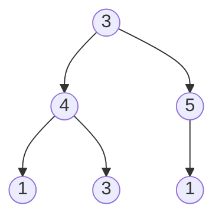
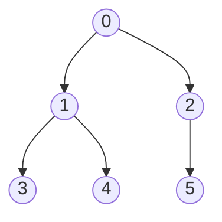

You multiply three matrices `A₁A₂A₃` with dimensions `10×30`, `30×5` and `5×60`. Matrix multiplication is associative, so `(A₁A₂)A₃` and `A₁(A₂A₃)` give the same result, but the first costs `10·30·5 + 10·5·60 = 1,500 + 3,000 = 4,500` scalar multiplications and the second costs `30·5·60 + 10·30·60 = 9,000 + 18,000 = 27,000`. Six times the work for the same answer. With `n` matrices there are a Catalan number of parenthesisations, about `4ⁿ / n^{1.5}`, so trying them all is out; but the best way to multiply a *range* of matrices depends only on the best ways to multiply its two halves, whichever way you split it. That is an interval DP.

This lesson covers the three DP families whose state is not a prefix: intervals (`dp[i][j]` over a contiguous range), subtrees (`dp[node]` computed bottom-up from children), and subsets (`dp[mask]` over which items have been used). Each has a signature fill order, each has a size past which it stops being feasible, and each has one famous problem where the obvious state is wrong and a reversed viewpoint fixes it.

## Interval DP: matrix chain multiplication

Matrices `A₁..Aₙ` where `Aᵢ` is `d[i-1] × d[i]`, so the whole chain is described by `n + 1` dimensions.

**State.** `dp[i][j]` = the minimum number of scalar multiplications to compute the product `Aᵢ…Aⱼ`.

**Transition.** The *last* multiplication performed splits the range somewhere: `(Aᵢ…Aₖ)(Aₖ₊₁…Aⱼ)` for some `k` in `[i, j)`. The left product is `d[i-1] × d[k]`, the right is `d[k] × d[j]`, so the final multiplication costs `d[i-1]·d[k]·d[j]`:

$$dp[i][j] = \min_{i \le k < j} \big( dp[i][k] + dp[k+1][j] + d_{i-1}\, d_k\, d_j \big)$$

**Order and base.** `dp[i][i] = 0` (one matrix, nothing to do). The transition reads strictly shorter intervals, so fill by **increasing length** `len = 2, 3, …, n`, and for each length every starting `i`. **Answer.** `dp[1][n]`.

Trace four matrices, `d = [5, 4, 6, 2, 7]` (`A₁ = 5×4`, `A₂ = 4×6`, `A₃ = 6×2`, `A₄ = 2×7`). Length 2 has one split each:

| interval | split `k` | cost | `dp` |
|---|---|---|---|
| `[1,2]` | 1 | `0 + 0 + 5·4·6 = 120` | 120 |
| `[2,3]` | 2 | `0 + 0 + 4·6·2 = 48` | 48 |
| `[3,4]` | 3 | `0 + 0 + 6·2·7 = 84` | 84 |

Length 3 compares two splits per cell:

| interval | `k` | `dp[i][k] + dp[k+1][j] + d[i-1]·d[k]·d[j]` | `dp` |
|---|---|---|---|
| `[1,3]` | 1 | `0 + 48 + 5·4·2 = 88` | |
| `[1,3]` | 2 | `120 + 0 + 5·6·2 = 180` | **88** (k=1) |
| `[2,4]` | 2 | `0 + 84 + 4·6·7 = 252` | |
| `[2,4]` | 3 | `48 + 0 + 4·2·7 = 104` | **104** (k=3) |

Length 4, the answer cell, tries three splits:

| `k` | left | right | last multiply | total |
|---|---|---|---|---|
| 1 | `dp[1][1] = 0` | `dp[2][4] = 104` | `5·4·7 = 140` | 244 |
| 2 | `dp[1][2] = 120` | `dp[3][4] = 84` | `5·6·7 = 210` | 414 |
| 3 | `dp[1][3] = 88` | `dp[4][4] = 0` | `5·2·7 = 70` | **158** |

`dp[1][4] = 158`. Storing the winning `k` per cell gives the parenthesisation by recursion: `[1,4]` splits at 3, `[1,3]` splits at 1, so the product is `((A₁(A₂A₃))A₄)`: multiply `A₂A₃` (48), then `A₁` by the `4×2` result (40), then by `A₄` (70), total 158. The worst order, `414`, is 2.6× more work.

### Why it is correct

Whatever order you multiply in, some multiplication is performed last, and it combines a product of `Aᵢ..Aₖ` with a product of `Aₖ₊₁..Aⱼ`. Those two sub-products were computed independently, and each must have been computed optimally: if a cheaper order existed for either half, swapping it in leaves the last multiplication's cost unchanged (it depends only on `d[i-1]`, `d[k]`, `d[j]`) and lowers the total. Cut-and-paste again. The state `(i, j)` is sufficient because the cost of a range depends only on the dimensions inside it, never on what surrounds it. And the fill order is a topological order of the dependencies: every cell reads only strictly shorter intervals, which "by increasing length" produces first, whereas row-major order would read `dp[k+1][j]` from a later row before it exists.

`O(n²)` states, `O(n)` transition: `O(n³)`, about `n³/6` inner steps; `n = 500` is 2 × 10⁷, fine anywhere; `n = 5,000` is 2 × 10¹⁰, not fine in any language. The interval DP shape, "the last operation splits the range, try every split", also solves optimal BST construction, polygon triangulation, and stone merging.

```python
def matrix_chain(d: list[int]) -> int:
    n = len(d) - 1                                   # number of matrices
    dp = [[0] * (n + 1) for _ in range(n + 1)]       # 1-indexed matrices
    for length in range(2, n + 1):
        for i in range(1, n - length + 2):
            j = i + length - 1
            dp[i][j] = min(dp[i][k] + dp[k + 1][j] + d[i - 1] * d[k] * d[j]
                           for k in range(i, j))
    return dp[1][n] if n >= 1 else 0
```

Interval DP is also where [palindrome DP](/learn/algorithms/dynamic-programming/string-dp) lives: `pal[i][j]` depends on `pal[i+1][j-1]`, a shorter interval, and the fill-by-length order is the same.

```viz
{"type": "dp", "algorithm": "palindrome-substrings", "a": "abacab", "title": "Interval fill order: length 1, then 2, then 3 …", "caption": "Every interval DP fills the table diagonal by diagonal, because a cell depends only on strictly shorter intervals inside it."}
```

## Burst balloons: when the first choice is the wrong state

Balloons `[3, 1, 5, 8]` each hold a number. Bursting balloon `i` earns `nums[i-1] · nums[i] · nums[i+1]` (treat the ends as 1), and its neighbours then become adjacent. Maximise total coins.

The obvious state, "best coins for the range `[i, j]` if you burst something *first*", fails: after bursting `k` first, the two sides `[i, k-1]` and `[k+1, j]` become adjacent and interact, so they are not independent subproblems. The fix is to think about the balloon burst **last** in the range. If `k` is the last balloon burst in `(i, j)` (open interval, `i` and `j` are the still-standing boundaries), then when it goes its neighbours are exactly `i` and `j`, and before that, the left part `(i, k)` and right part `(k, j)` were burst completely independently, each with `k` still standing as its boundary.

**State.** `dp[i][j]` = max coins from bursting every balloon strictly between `i` and `j`, with `i` and `j` intact. Pad the array with 1s at both ends.

**Transition.**
$$dp[i][j] = \max_{i < k < j} \big( dp[i][k] + dp[k][j] + nums[i]\cdot nums[k]\cdot nums[j] \big)$$

**Order.** Increasing `j − i`. **Answer.** `dp[0][n+1]` on the padded array.

### The trace, gap by gap

Trace with padded `[1, 3, 1, 5, 8, 1]` (indices 0..5).

| gap | cell | candidates `k` (`dp[i][k] + dp[k][j] + nums[i]·nums[k]·nums[j]`) | `dp` |
|---|---|---|---|
| 2 | `dp[0][2]` | `k=1`: `0 + 0 + 1·3·1 = 3` | 3 |
| 2 | `dp[1][3]` | `k=2`: `3·1·5 = 15` | 15 |
| 2 | `dp[2][4]` | `k=3`: `1·5·8 = 40` | 40 |
| 2 | `dp[3][5]` | `k=4`: `5·8·1 = 40` | 40 |
| 3 | `dp[0][3]` | `k=1`: `0 + 15 + 1·3·5 = 30`; `k=2`: `3 + 0 + 1·1·5 = 8` | 30 |
| 3 | `dp[1][4]` | `k=2`: `0 + 40 + 3·1·8 = 64`; `k=3`: `15 + 0 + 3·5·8 = 135` | 135 |
| 3 | `dp[2][5]` | `k=3`: `0 + 40 + 1·5·1 = 45`; `k=4`: `40 + 0 + 1·8·1 = 48` | 48 |
| 4 | `dp[0][4]` | `k=1`: `0 + 135 + 24 = 159`; `k=2`: `3 + 40 + 8 = 51`; `k=3`: `30 + 0 + 40 = 70` | 159 |
| 4 | `dp[1][5]` | `k=2`: `0 + 48 + 3 = 51`; `k=3`: `15 + 40 + 15 = 70`; `k=4`: `135 + 0 + 24 = 159` | 159 |
| 5 | `dp[0][5]` | `k=1`: `0 + 159 + 3 = 162`; `k=2`: `3 + 48 + 1 = 52`; `k=3`: `30 + 40 + 5 = 75`; `k=4`: `159 + 0 + 8 = 167` | **167** |

Reading the winning `k`s back gives the order: `dp[0][5]` bursts balloon 4 (the 8) last; inside `(0, 4)`, balloon 1 (the 3) is last; inside `(1, 4)`, balloon 3 (the 5) is last; balloon 2 (the 1) goes first. Forward: burst 1 (`3·1·5 = 15`), then 5 (`3·5·8 = 120`), then 3 (`1·3·8 = 24`), then 8 (`1·8·1 = 8`): 167.

The "last operation, not first" reversal is a general interval-DP technique. It appears whenever an operation *changes the adjacency* of what remains: removing boxes, merging stones with a cost, cutting a stick at given positions (where the last cut has cost equal to the current segment length). If your interval subproblems seem to interact, ask what happened last.

## Tree DP: states on subtrees

A tree is a recursion waiting to happen: the answer for a node depends on the answers for its children, the children's subtrees are disjoint, and a post-order traversal computes everything bottom-up in `O(n)`. Tree DP is DP where the state is "the subtree rooted at `v`", sometimes with a small extra flag. The disjointness is the correctness argument: choices inside one child's subtree cannot affect another child's subtree, so their optima add, and the only interaction is between `v` and its children, which is what the flag carries.

### House robber on a tree

Nodes hold cash; you may not rob two directly connected nodes. Whether you rob `v` constrains its children, so the state needs a flag.

- `rob[v]` = best from `v`'s subtree if `v` **is** robbed = `val[v] + Σ skip[c]` over children.
- `skip[v]` = best if `v` is **not** robbed = `Σ max(rob[c], skip[c])`.
- Answer `max(rob[root], skip[root])`.



Post-order on this tree, each node returning `(rob, skip)`:

| node | children's `(rob, skip)` | `rob` | `skip` |
|---|---|---|---|
| leaf 1 | none | 1 | 0 |
| leaf 3 | none | 3 | 0 |
| 4 | `(1, 0)`, `(3, 0)` | `4 + 0 + 0 = 4` | `max(1,0) + max(3,0) = 4` |
| leaf 1 | none | 1 | 0 |
| 5 | `(1, 0)` | `5 + 0 = 5` | `max(1, 0) = 1` |
| root 3 | `(4, 4)`, `(5, 1)` | `3 + 4 + 1 = 8` | `max(4,4) + max(5,1) = 9` |

Answer `max(8, 9) = 9`: skip the root, rob the 4 (or its two leaves, also 4) and the 5.

```python
def rob_tree(root) -> int:
    def dfs(node):                       # returns (rob_here, skip_here)
        if node is None:
            return 0, 0
        lr, ls = dfs(node.left)
        rr, rs = dfs(node.right)
        return node.val + ls + rs, max(lr, ls) + max(rr, rs)
    return max(dfs(root))
```

Returning a tuple per node is the tree-DP idiom: the "table" is the recursion's return values, and the fill order is post-order. **Diameter of a tree** is the same shape: each node returns its height, and the diameter through `v` is `height(left) + height(right)`, with the global answer the max over nodes. **Maximum path sum** returns "best downward path from `v`" and updates a global with `left + val + right`. [Tree recursion patterns](/learn/data-structures/trees/tree-recursion-patterns) has more of the family.

```viz
{"type": "tree", "algorithm": "diameter", "values": [1, 2, 3, 4, 5, 6, 7, 8, 9], "title": "Tree DP by post-order: each node returns its height, the diameter is combined on the way up", "caption": "The children are finished before the parent reads them. That is the tree-DP fill order."}
```

### Rerooting: an answer for every root

Sometimes you need the DP answer with *each* node as the root: "for every node, the sum of distances to all other nodes", or "the height of the tree if hung from each node". Running the `O(n)` DP `n` times is `O(n²)`. **Rerooting** does it in `O(n)` with two passes.

1. **Down pass** (post-order): compute `down[v]`, the answer for `v`'s subtree in the original rooting. For sum-of-distances: `size[v]` and `down[v] = Σ (down[c] + size[c])` over children (each node in `c`'s subtree is one step further from `v` than from `c`).
2. **Up pass** (pre-order): derive the answer for child `c` from the parent's full answer. Moving the root from `p` to `c` brings the `size[c]` nodes in `c`'s subtree one step closer and the other `n − size[c]` nodes one step further: `ans[c] = ans[p] − size[c] + (n − size[c])`.

Trace on this tree (edges `0–1, 0–2, 1–3, 1–4, 2–5`, rooted at 0):



Down pass, post-order: leaves 3, 4, 5 have `size = 1`, `down = 0`. Node 1: `size = 3`, `down = (0 + 1) + (0 + 1) = 2`. Node 2: `size = 2`, `down = 0 + 1 = 1`. Node 0: `size = 6`, `down = (2 + 3) + (1 + 2) = 8`. So `ans[0] = 8` (distances 1, 1, 2, 2, 2).

Up pass, pre-order with `n = 6`:

| child `c` | parent `p` | `ans[p] − size[c] + (n − size[c])` | `ans[c]` |
|---|---|---|---|
| 1 | 0 | `8 − 3 + 3` | 8 |
| 2 | 0 | `8 − 2 + 4` | 10 |
| 3 | 1 | `8 − 1 + 5` | 12 |
| 4 | 1 | `8 − 1 + 5` | 12 |
| 5 | 2 | `10 − 1 + 5` | 14 |

A brute-force BFS from every node gives the same `[8, 8, 10, 12, 12, 14]`. Six nodes, two passes, twelve visits, against six BFS runs.

```python
def sum_of_distances(n: int, adj: list[list[int]]) -> list[int]:
    size, down, ans = [1] * n, [0] * n, [0] * n
    order, parent = [], [-1] * n
    stack = [0]
    while stack:                                  # iterative DFS: no recursion limit
        v = stack.pop(); order.append(v)
        for c in adj[v]:
            if c != parent[v]:
                parent[c] = v; stack.append(c)
    for v in reversed(order):                     # post-order: children before parents
        if parent[v] != -1:
            size[parent[v]] += size[v]
            down[parent[v]] += down[v] + size[v]
    ans[0] = down[0]
    for v in order:                               # pre-order: parents before children
        if parent[v] != -1:
            ans[v] = ans[parent[v]] - size[v] + (n - size[v])
    return ans
```

The pattern requires the combine operation to be "subtractable". For sums you subtract. For `max` (the height when hung from each node) you cannot un-max, so the parent keeps its best *and second-best* child height: the up-value for child `c` is `1 + max(up[p], best height among p's other children + 1)`, where "other children" is the second-best when `c` is the best. On the same tree the heights per root are `[2, 3, 3, 4, 4, 4]`.

## Bitmask DP: states on subsets

When the state must remember *which* of `n` things have been used, and `n ≤ ~20`, encode the used set as an `n`-bit integer: bit `i` set means item `i` is used. `2ⁿ` states, each an array index; transitions add one bit.

**Travelling salesman (Held–Karp).** Visit all `n` cities starting and ending at city 0, minimum total distance.

**State.** `dp[mask][last]` = the shortest path that starts at 0, visits exactly the cities in `mask`, and ends at `last` (with `last ∈ mask`, `0 ∈ mask`).

**Transition.** The path arrived at `last` from some `prev` in the mask: `dp[mask][last] = min over prev ∈ mask, prev ≠ last of dp[mask without last][prev] + D[prev][last]`. **Base.** `dp[{0}][0] = 0`. **Order.** Increasing `mask` as an integer: every transition reads a strictly smaller mask, so numeric order is a topological order. **Answer.** `min over last of dp[full][last] + D[last][0]`.

Trace on four cities with symmetric distances `AB = 10, AC = 15, AD = 20, BC = 35, BD = 25, CD = 30` (A = 0, bit 0 is the low bit; masks written as `DCBA`):

| mask | `dp[mask][B]` | `dp[mask][C]` | `dp[mask][D]` |
|---|---|---|---|
| `0011` {A,B} | 10 | | |
| `0101` {A,C} | | 15 | |
| `1001` {A,D} | | | 20 |
| `0111` {A,B,C} | `dp[0101][C] + CB = 15 + 35 = 50` | `dp[0011][B] + BC = 10 + 35 = 45` | |
| `1011` {A,B,D} | `20 + 25 = 45` | | `10 + 25 = 35` |
| `1101` {A,C,D} | | `20 + 30 = 50` | `15 + 30 = 45` |
| `1111` all | `min(dp[1101][C] + CB, dp[1101][D] + DB) = min(85, 70) = 70` | `min(dp[1011][B] + BC, dp[1011][D] + DC) = min(80, 65) = 65` | `min(dp[0111][B] + BD, dp[0111][C] + CD) = min(75, 75) = 75` |

Closing the tour: `min(70 + BA, 65 + CA, 75 + DA) = min(80, 80, 95) = 80`, the tour `A → B → D → C → A` (or its reverse), which brute force over the 3! = 6 tours confirms. `2ⁿ · n` states with an `O(n)` transition: `O(n² · 2ⁿ)`.

### Assignment: one bit per worker

`n` workers, `n` jobs, `cost[w][j]`; assign every job to a distinct worker at minimum cost. Assign jobs in order `0, 1, 2, …`; after `j` jobs the only thing that matters is which workers are taken. **State.** `dp[mask]` = minimum cost of assigning the first `popcount(mask)` jobs to exactly the workers in `mask`. **Transition.** Job `j = popcount(mask)` goes to a free worker `w`: `dp[mask | (1 << w)] = min(…, dp[mask] + cost[w][j])`. `2ⁿ` states, `O(n)` transition: `O(n · 2ⁿ)`.

```viz
{"type": "bits", "algorithm": "subset-mask", "values": [3, 5, 6], "title": "Every subset of n items is an n-bit integer; iterating masks 0..2^n-1 visits subsets in a valid DP order", "caption": "Bit w set means worker w is already assigned. A mask's DP value depends only on masks with fewer bits."}
```

```python
def min_assignment_cost(cost: list[list[int]]) -> int:
    n = len(cost)
    INF = float('inf')
    dp = [INF] * (1 << n)
    dp[0] = 0
    for mask in range(1 << n):
        if dp[mask] == INF:
            continue
        j = mask.bit_count()                # next job to assign (Python 3.10+)
        if j == n:
            continue
        for w in range(n):
            if not mask & (1 << w):
                nxt = mask | (1 << w)
                dp[nxt] = min(dp[nxt], dp[mask] + cost[w][j])
    return dp[(1 << n) - 1]
```

Trace `cost = [[9, 2, 7], [6, 4, 3], [5, 8, 1]]` (rows are workers). `dp[0] = 0`, job 0: `dp[001] = 9`, `dp[010] = 6`, `dp[100] = 5`. Job 1 from `001`: `dp[011] = 9 + 4 = 13`, `dp[101] = 9 + 8 = 17`; from `010`: `dp[011] = min(13, 6 + 2) = 8`, `dp[110] = 6 + 8 = 14`; from `100`: `dp[101] = min(17, 5 + 2) = 7`, `dp[110] = min(14, 5 + 4) = 9`. Job 2: `dp[111] = min(8 + 1, 7 + 3, 9 + 7) = 9`. Assignment: worker 1 → job 0 (6), worker 0 → job 1 (2), worker 2 → job 2 (1).

Two implementation notes a senior engineer mentions: iterate the submasks of a mask with `sub = (sub - 1) & mask`, which visits each submask exactly once and makes "for every mask, for every submask" `O(3ⁿ)` in total rather than `O(4ⁿ)` (each element is outside the mask, in the mask but not the submask, or in both: three choices per element); and use the builtin popcount (`int.bit_count()` since Python 3.10, `__builtin_popcount` in C, `u32::count_ones` in Rust) rather than `bin(x).count('1')`, which allocates a string per call. [Bit tricks in algorithms](/learn/algorithms/technique-mastery/bit-tricks-in-algorithms) covers both.

## Under the hood: sizes, depth and where each family stops

**Bitmask tables are the first to run out of memory.** `dp[mask][last]` for Held–Karp is `2ⁿ · n` cells: 4 MB as `int64` at `n = 15`, 168 MB at `n = 20`, 738 MB at `n = 22`, 6.7 GB at `n = 25`. A Python list of lists multiplies that by roughly five (8-byte pointers plus 28–32-byte int objects), so `n = 20` needs a flat `array('q')` or NumPy to fit in a laptop's memory. Work is `n² · 2ⁿ`: 4 × 10⁸ at `n = 20`, about 40 s in CPython at 100 ns per step (measured order of magnitude on 3.14) and under a second compiled; 2 × 10¹⁰ at `n = 25`, which is minutes even compiled. The honest interview sentence is "bitmask DP is an `n ≤ 20` tool; at `n = 25` the table alone is gigabytes".

**JavaScript bit operations are 32-bit.** `1 << 31` is negative and `1 << 32` is 1, so a mask DP written with `<<`, `&` and `|` silently breaks at `n ≥ 31`; the memory limit bites first, but `n = 31` masks of a 31-bit range are the boundary to remember. Use `BigInt` or a `Uint8Array` of flags past that.

**Tree DP hits the recursion limit before it hits memory.** A path-shaped tree of 10⁵ nodes recurses 10⁵ deep: `RecursionError` in CPython (default limit 1,000), a stack overflow in JavaScript at a few thousand to tens of thousands of frames depending on the engine, fine in Go, whose goroutine stacks grow up to 1 GB, and fine in Rust only until the thread's stack runs out (8 MB for the main thread on a typical Linux, 2 MB for spawned threads). Raising `sys.setrecursionlimit` is not a fix ([from backtracking to memoisation](/learn/algorithms/recursion-backtracking/from-backtracking-to-memoisation) explains why deep recursion can crash the process rather than raise). The fix is the iterative post-order in the rerooting code above: one DFS to record parents and an order, then loop over the order reversed.

### Interval DP and Knuth's optimisation

`O(n³)` means `n³/6` inner steps: `n = 1,000` is 1.7 × 10⁸, tens of seconds in CPython at the 100 ns per step used below and well under a second compiled; `n = 5,000` is 2 × 10¹⁰. Two named results lower the bound for some problems. **Knuth's optimisation** applies when the optimal split point is monotone in `i` and `j` (guaranteed by the quadrangle inequality on the cost); restricting `k` to `[opt[i][j-1], opt[i+1][j]]` makes the whole fill `O(n²)`. Optimal binary search trees qualify; burst balloons does not. And for matrix chain specifically, Hu and Shing gave an `O(n log n)` algorithm via polygon triangulation (SIAM Journal on Computing, 1982 and 1984), cited far more often than implemented.

| Family | States | Transition | Comfortable `n` in CPython | Where it stops |
|---|---|---|---|---|
| Interval | `n²` | `O(n)` splits | ≤ ~500 | `n = 5,000` is 10¹⁰ steps |
| Tree | `n` | `O(children)` | 10⁶ with an iterative traversal | recursion depth, not work |
| Rerooting | `n` | `O(1)` per child | 10⁶ | needs a subtractable or second-best combine |
| Bitmask `dp[mask]` | `2ⁿ` | `O(n)` | ≤ 22 | memory at `2ⁿ` cells |
| Bitmask `dp[mask][last]` | `2ⁿ · n` | `O(n)` | ≤ 18–20 | 168 MB at `n = 20`, 6.7 GB at 25 |

When the input exceeds these, the answer is a different algorithm, not a bigger machine: heuristics or branch-and-bound for TSP at `n = 100`, an `O(n log n)` greedy or a specialised algorithm for the interval problem, streaming for trees that do not fit.

## Choosing the state shape

| Problem smells like | State | Fill order | Cost |
|---|---|---|---|
| "split a range", "last operation on a contiguous segment" | interval `(i, j)` | by increasing length | `O(n²)` states × `O(n)` split = `O(n³)` |
| "on a tree", "subtree", "no two adjacent nodes" | subtree of `v` (+ flag) | post-order | `O(n)` × flag count |
| "answer for every root" | subtree + outside | post-order then pre-order | `O(n)` |
| "assign / visit each of `n ≤ 20` things exactly once" | subset mask (+ last item) | increasing mask | `O(2ⁿ · n)` or `O(2ⁿ · n²)` |

Each row's fill order is the topological order of its dependency graph: shorter intervals before longer, children before parents, smaller masks before larger. Once you name the state shape, the order follows, and the transition comes from asking what the last operation was.

## Failure modes

**Matrix chain returns 0 or a value far too small.** Symptom: the answer for four matrices comes out below the cheapest single multiplication. Diagnosis: the table was filled row by row, so `dp[k+1][j]` was read as its initial 0 before being computed. Fix: fill by increasing length (or `i` descending, `j` ascending); verify on `d = [5, 4, 6, 2, 7]`, which must give 158.

**Burst balloons is wrong on `[3, 1, 5, 8]`.** Symptom: a value below 167. Diagnosis: the state was "burst `k` first", and the two sides were solved as if independent. Fix: "burst `k` last" with `i` and `j` as the surviving boundaries, padded with 1s.

**`RecursionError` on a tree of 10⁵ nodes.** Symptom: the DP passes every small test and dies on a chain-shaped input. Diagnosis: post-order recursion as deep as the tree. Fix: iterative DFS to produce the order, then two loops.

**Rerooted heights are wrong for some nodes only.** Symptom: sum-of-distances rerooting works, height rerooting fails on the child that was the tallest. Diagnosis: `max` is not subtractable; the up pass reused the parent's best child height when computing that same child's outside value. Fix: keep best and second-best per node and use the second-best for the best child.

**`MemoryError` allocating the bitmask table.** Symptom: the allocation itself fails at `n = 22` in Python. Diagnosis: `2²² · 22` cells as a list of lists is several gigabytes. Fix: a flat typed array, `dp[mask]` without the `last` dimension if the problem allows, or accept that `n = 22` needs a compiled implementation.

**The JavaScript mask DP breaks at `n = 31`.** Symptom: wrong answers with no error once `n` reaches 31 or 32. Diagnosis: `1 << 31` is `−2147483648` and `1 << 32` is `1`. Fix: `BigInt` masks or an explicit flag array, although the memory limit makes `n > 22` moot before the shift does.

## Interviewer follow-ups

**"TSP with 100 cities?"** Model answer: Held–Karp is `2¹⁰⁰`, so exact DP is out; the problem is NP-hard. Use a constructive heuristic (nearest neighbour, greedy edge) polished by local search (2-opt, Or-opt, Lin–Kernighan), or branch-and-bound / an ILP solver when a provable optimum is required; state that Christofides gives a 1.5-approximation for metric instances. Common wrong answer: "memoise more aggressively", which cannot reduce `2¹⁰⁰` states.

**"Return the parenthesisation, not the cost."** Model answer: store the winning `k` in a parallel `split[i][j]` table and recurse `(i, split) (split+1, j)` from `[1, n]`; `O(n)` output for `O(n²)` extra memory. Common wrong answer: recomputing every split during the walk-back, which is another `O(n³)`.

**"House robber on a tree with 10⁵ nodes in Python."** Model answer: the recursion is 10⁵ deep on a path; do an iterative DFS to get a post-order, then a loop computing `(rob, skip)` from children already done. Common wrong answer: `sys.setrecursionlimit(10**6)`, which can crash the process instead of raising.

**"Sum of distances from every node, `n = 2 × 10⁵`."** Model answer: rerooting: post-order for `size` and `down`, pre-order with `ans[c] = ans[p] − size[c] + (n − size[c])`, `O(n)`. Common wrong answer: BFS from every node, `O(n²) = 4 × 10¹⁰`.

**"Can matrix chain go below `O(n³)`?"** Model answer: for problems whose optimal split is monotone (quadrangle inequality), Knuth's optimisation bounds `k` between neighbouring cells' optima and gives `O(n²)`; matrix chain specifically has an `O(n log n)` algorithm (Hu–Shing), rarely needed because `n` is small in every real pipeline. Common wrong answer: "no, `O(n³)` is a lower bound".

## What mid-level engineers get wrong

- **Filling an interval table row by row.** Consequence: unfilled cells read as 0 and the answer is silently too small.
- **Choosing the first operation as the interval state.** Consequence: the sides interact and the recurrence is wrong; burst balloons, stone merging and box removal all need "last".
- **Recursive tree DP with no thought for depth.** Consequence: `RecursionError` on the one input shape (a path) that the tests include last.
- **Rerooting `max` by subtraction.** Consequence: wrong for exactly the child that dominated the parent's value.
- **Not sizing the bitmask table before writing it.** Consequence: minutes of coding before discovering that `n = 25` needs 6.7 GB.
- **`bin(mask).count('1')` in the inner loop.** Consequence: a string allocation per state; the builtin is `int.bit_count()`.
- **Trusting `<<` past 30 bits in JavaScript.** Consequence: masks wrap; answers are wrong without any error.

## Exercises

```exercise
id: matrix-chain
title: Matrix chain multiplication
prompt: |
  `dims` has length `n + 1` and describes `n` matrices: matrix `i` (1-based)
  is `dims[i-1] × dims[i]`. Return the minimum number of scalar
  multiplications needed to compute the full product. A single matrix
  (`dims` of length 2) costs 0.

  Use interval DP filled by increasing length; O(n³).
languages: [python, javascript]
entry: matrix_chain
starter:
  python: |
    def matrix_chain(dims):
        # dp[i][j] = min cost to multiply matrices i..j
        return 0
  javascript: |
    function matrix_chain(dims) {
      // dp[i][j] = min cost to multiply matrices i..j
      return 0;
    }
tests:
  - args: [[10, 30, 5, 60]]
    expected: 4500
  - args: [[40, 20, 30, 10, 30]]
    expected: 26000
  - args: [[10, 20]]
    expected: 0
    label: single matrix
  - args: [[5, 10, 3]]
    expected: 150
    label: two matrices
  - args: [[1, 2, 3, 4]]
    expected: 18
  - args: [[30, 35, 15, 5, 10, 20, 25]]
    expected: 15125
    hidden: true
  - args: [[2, 3, 4, 5, 6]]
    expected: 124
    hidden: true
hints:
  - "dp[i][j] = min over k in [i, j) of dp[i][k] + dp[k+1][j] + dims[i-1] * dims[k] * dims[j]."
  - "Loop length from 2 to n, then i from 1, with j = i + length - 1; shorter intervals must already be filled."
```

```exercise
id: min-assignment-bitmask
title: Minimum-cost assignment with a bitmask
prompt: |
  `cost` is an n × n matrix (1 ≤ n ≤ 12): `cost[w][j]` is the cost of
  giving job `j` to worker `w`. Assign every job to a distinct worker and
  return the minimum total cost.

  Use `dp[mask]` = minimum cost of assigning jobs `0..popcount(mask)-1`
  to exactly the workers in `mask`, iterating masks in increasing order.
languages: [python, javascript]
entry: min_assignment_cost
starter:
  python: |
    def min_assignment_cost(cost):
        # dp[mask]: workers in mask have taken the first popcount(mask) jobs
        return 0
  javascript: |
    function min_assignment_cost(cost) {
      // dp[mask]: workers in mask have taken the first popcount(mask) jobs
      return 0;
    }
tests:
  - args: [[[9, 2, 7], [6, 4, 3], [5, 8, 1]]]
    expected: 9
  - args: [[[5]]]
    expected: 5
    label: one worker
  - args: [[[1, 2], [2, 1]]]
    expected: 2
  - args: [[[3, 3], [3, 3]]]
    expected: 6
    label: all costs equal
  - args: [[[10, 1, 3, 4], [2, 10, 5, 7], [9, 8, 10, 1], [6, 5, 2, 10]]]
    expected: 6
    hidden: true
  - args: [[[1, 100, 100], [100, 1, 100], [100, 100, 1]]]
    expected: 3
    hidden: true
hints:
  - "The next job to assign is popcount(mask). For each worker w not in mask, relax dp[mask | (1 << w)] with dp[mask] + cost[w][job]."
  - "Iterating mask from 0 upward is a valid order because every transition increases the mask."
```

## Senior signals

- You recognise interval DP by the phrase **"the last operation splits the range"**, fill by increasing length without being told, and can say why row-major order reads unfilled cells.
- You know the burst-balloons reversal (**think about the balloon burst last**), can explain why "first" fails (the sides stop being independent), and can read the burst order back out of the winning splits.
- You write tree DP as **a post-order function returning a tuple**, you state disjointness of subtrees as the reason the children's values add, and you convert to an iterative order when the tree may be deep.
- You know that **rerooting** gives every-root answers in `O(n)` with a down pass and an up pass, that sums are subtracted while `max` needs a second-best, and you can trace both on a six-node tree.
- You size bitmask DP before writing it (`2ⁿ · n` cells × 8 bytes: 168 MB at `n = 20`) and you say **"this is for `n ≤ 20`"** out loud, with the Held–Karp table as the example.
- You know the **submask enumeration trick** `sub = (sub − 1) & mask` and its `O(3ⁿ)` total, you use a builtin popcount, and you know JavaScript's 32-bit shift boundary.
- You state the fill order as **the topological order of the dependency graph** and derive it from the transition rather than guessing, and you can name Knuth's optimisation as the `O(n²)` escape for monotone interval DPs.

## Check yourself

```quiz
- q: >-
    In matrix chain multiplication, why must the table be filled by increasing interval length rather than row by row?
  options: ["Row-by-row works too; length order is purely a convention", "The matrices must be multiplied left to right, one by one", "dp[k+1][j] is in a later row, so row order reads it unfilled", "Only length order fills the zero diagonal before it is read"]
  answer: 2
  explanation: >-
    dp[i][j] depends on dp[i][k] and dp[k+1][j], shorter intervals, and dp[k+1][j] is in a later row than dp[i][j], so row-major order would read it unfilled. Increasing length (equivalently, i descending with j ascending) is a topological order of the dependencies. The zero diagonal is the base case and can be written up front in any order.
- q: >-
    For burst balloons, defining dp[i][j] as the best coins when balloon k is burst FIRST in (i, j) fails because:
  options: ["The recursion never terminates, since k can be picked again later", "The answer moves to dp[1][n], which the fill never reaches", "The two sides become adjacent, so they stop being independent", "The array can then no longer be padded with ones at both ends"]
  answer: 2
  explanation: >-
    After bursting k first, balloons i..k-1 and k+1..j become adjacent and interact. Interval DP needs the two sides of a split to be solvable separately. Bursting last keeps i and j as the neighbours of k throughout, so the sides never interact. Padding is needed in both formulations and is not the issue.
- q: >-
    House robber on a tree returns (rob, skip) per node. Why does rob[v] add skip[c] for each child rather than max(rob[c], skip[c])?
  options: ["Because skip[c] is always at least as large as rob[c]", "Because a robbed node's children cannot be robbed at all", "It should be the max; the tuple is only a memory saving", "Because rob[c] is undefined for leaves, so skip is safer"]
  answer: 1
  explanation: >-
    The constraint is on directly connected nodes. If v is robbed, its children must be skipped, so only their skip value is legal; skip[c] already includes the best choice for the grandchildren. skip[c] is not always larger (a leaf's rob value is its cash, its skip value 0). skip[v] is where the max is taken.
- q: >-
    A bitmask DP has state dp[mask][last] for a travelling-salesman style problem with n = 25 cities. Is it feasible in a typical interview time limit?
  options: ["Only if the graph is complete, so that every mask is valid", "No: about 8 × 10⁸ states, each with an O(n) transition", "Yes: only 25² states, one for each pair of cities", "Yes: memoisation visits only the reachable masks"]
  answer: 1
  explanation: >-
    2²⁵ ≈ 3.4 × 10⁷ masks times 25 ends is 8.4 × 10⁸ cells, several gigabytes for the dp array alone; the transition multiplies the work by another 25. Bitmask DP is an n ≤ ~20 tool. Memoisation does not reduce the reachable state count here, since nearly every mask is reachable.
- q: >-
    Rerooting computes a per-node answer in O(n) with two passes. What property must the combine operation have?
  options: ["It must be idempotent, so a child counted twice is harmless", "It must be linear, so the answer scales with node values", "It must let one child's contribution be removed again", "It must be commutative, so children combine in any order"]
  answer: 2
  explanation: >-
    The up pass derives the value 'excluding v's subtree' from the parent's full value, so one child's contribution must be removable. For sums you subtract; for max you keep the best and second-best child so that excluding the best still leaves an answer. Commutativity alone does not give you that. Without it, rerooting degrades to recomputing.
- q: >-
    A DP loops over every mask and, inside, over every submask with sub = (sub - 1) & mask. What is the total work over all masks of n bits?
  options: ["O(n · 2ⁿ), since each submask differs from the mask by one bit", "O(2ⁿ), since the trick visits every subset of the n elements once", "O(3ⁿ), since each element is outside, in the mask only, or in both", "O(4ⁿ), since there are 2ⁿ masks and each has up to 2ⁿ submasks"]
  answer: 2
  explanation: >-
    A (mask, submask) pair assigns each element one of three roles, so there are exactly 3ⁿ pairs and the trick visits each once with O(1) work. Iterating all 2ⁿ candidates for every mask would be 4ⁿ; the submasks of a mask are not one-bit neighbours of it; and 2ⁿ counts subsets, not pairs.
```
