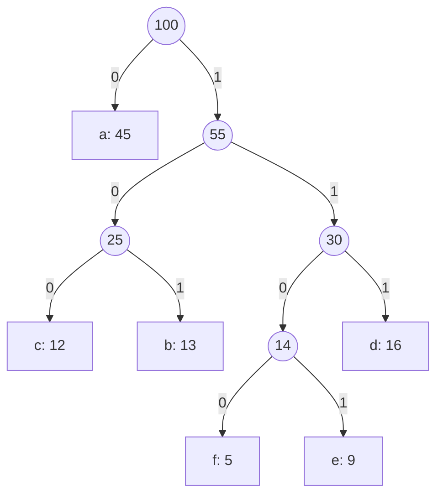

Every byte of every PNG, every gzip response your servers send, and every JPEG on your phone passes through a greedy algorithm that a graduate student invented in 1952 as a term paper. Huffman coding is the cleanest example of a greedy algorithm that is not obvious, is provably optimal, and runs in production at planetary scale. It is also the algorithm whose proof most people cannot reproduce even when they can recite the steps.

This lesson walks the classic greedy algorithms that interviewers actually ask: Huffman, the two jump games, gas station, and task scheduling, each with its trace and its proof idea. It ends by rereading three algorithms from the graph module (Dijkstra, Prim, Kruskal) as greedy algorithms justified by a single idea, the cut property, so the whole family fits in one mental model.

## Huffman coding

You have a text over an alphabet where some symbols are far more common than others. A fixed-width code spends the same bits on every symbol; a *prefix code* (no codeword is a prefix of another, so decoding never needs delimiters) can give short codes to common symbols. Huffman's algorithm builds the prefix code with the minimum total length.

The algorithm: put every symbol in a min-heap keyed by frequency. Repeatedly pop the two lightest nodes, make them children of a new node whose weight is their sum, and push it back. The last node is the root; a symbol's code is the path of 0s and 1s from the root to its leaf.

Take the six-symbol example with frequencies per 100 characters: `a:45, b:13, c:12, d:16, e:9, f:5`.

| step | heap (weights) | pop two | new node |
|---|---|---|---|
| 1 | 5, 9, 12, 13, 16, 45 | 5 (f), 9 (e) | 14 |
| 2 | 12, 13, 14, 16, 45 | 12 (c), 13 (b) | 25 |
| 3 | 14, 16, 25, 45 | 14 (fe), 16 (d) | 30 |
| 4 | 25, 30, 45 | 25 (cb), 30 (fed) | 55 |
| 5 | 45, 55 | 45 (a), 55 | 100 (root) |

```viz
{"type": "heap", "algorithm": "push-pop", "kind": "min",
 "operations": [["push",5],["push",9],["push",12],["push",13],["push",16],["push",45],["pop"],["pop"],["push",14],["pop"],["pop"],["push",25],["pop"],["pop"],["push",30],["pop"],["pop"],["push",55],["pop"],["pop"],["push",100]],
 "title": "Huffman's algorithm as heap operations",
 "caption": "Each pair of pops takes the two lightest subtrees; the push is their merged parent. The pushed weights 14, 25, 30, 55, 100 sum to the total encoded length, 224 bits."}
```

The tree, with left = 0 and right = 1:



Codes: `a = 0`, `c = 100`, `b = 101`, `f = 1100`, `e = 1101`, `d = 111`. Total bits per 100 characters:

$$45·1 + 13·3 + 12·3 + 16·3 + 9·4 + 5·4 = 45 + 39 + 36 + 48 + 36 + 20 = 224$$

A fixed 3-bit code for six symbols costs 300. Huffman saves 25% on this distribution, and the saving grows with skew. Notice the shortcut in the trace: the total cost equals the sum of the merged node weights (`14 + 25 + 30 + 55 + 100 = 224`), because every merge adds one bit to the code of every symbol below it. That identity lets you compute the cost without building the tree, which is the second exercise.

**Why greedy is optimal here.** Two facts, both exchange arguments. First, in some optimal tree the two least frequent symbols are siblings at the deepest level: if they are not, swap them with whatever *is* deepest; the swap moves lighter symbols deeper and heavier ones shallower, so the total cannot increase. Second, merging those two into one pseudo-symbol of combined weight turns the problem into an optimal-code problem on `n − 1` symbols whose cost is exactly the original cost minus the merged weight; so an optimal tree for the smaller problem yields an optimal tree for the larger. Induction closes it. Complexity is $O(n \log n)$ for `n` symbols, or $O(n)$ with two queues if the frequencies arrive sorted.

**In production.** DEFLATE (zlib, gzip, PNG, HTTP `Content-Encoding: gzip`) uses Huffman codes after LZ77 matching; JPEG uses them on quantised coefficients; Brotli and Zstandard use variants with static dictionaries and finite-state entropy. The interview follow-up is "what if the frequencies change while streaming?", and the answer is adaptive Huffman or, in practice, periodically rebuilding tables per block, which is what DEFLATE does.

## Jump game: furthest reach

[Jump Game](/practice/jump-game): `nums[i]` is the maximum jump length from index `i`; can you reach the last index? The greedy keeps one number, `reach`, the furthest index you could have landed on so far. Walk left to right; if `i > reach` you are stranded; otherwise `reach = max(reach, i + nums[i])`.

Trace `[2, 3, 1, 1, 4]`: `i=0`, reach 2; `i=1`, reach `max(2, 4) = 4`; already ≥ 4, done, true. Trace `[3, 2, 1, 0, 4]`: reach 3, 3, 3, 3; `i=4 > 3`, false.

The proof is "greedy stays ahead" in its purest form: `reach` after processing index `i` is *exactly* the furthest index reachable using positions `0..i`, by induction, so no strategy can be ahead of it.

[Jump Game II](/practice/jump-game-ii) asks for the *minimum* number of jumps. Think of it as BFS over the array in layers: layer 0 is index 0; layer 1 is everything reachable in one jump, `1..nums[0]`; layer `k+1` is everything reachable from layer `k`. The answer is the layer containing the last index. You do not need a queue, because each layer is a contiguous range: track `cur_end` (end of the current layer) and `far` (furthest reach from anything in the current layer). When `i` reaches `cur_end`, you have exhausted the layer, so take a jump and set `cur_end = far`.

```python
def min_jumps(nums):
    jumps = cur_end = far = 0
    for i in range(len(nums) - 1):       # never jump from the last index
        far = max(far, i + nums[i])
        if i == cur_end:                 # layer exhausted: must jump
            jumps += 1
            cur_end = far
    return jumps
```

Trace `[2, 3, 1, 1, 4]`: `i=0`: far 2, `i == cur_end` so jumps 1, cur_end 2. `i=1`: far 4. `i=2`: far 4, `i == cur_end`, jumps 2, cur_end 4. Loop ends at `i = 3`. Two jumps (0 → 1 → 4). The loop runs to `n − 2` because reaching the last index never requires jumping *from* it; running to `n − 1` would count one extra jump when the last index is itself a layer boundary.

Why is the greedy layer count minimal? Because it is BFS, and BFS layer numbers are shortest-path distances. The greedy just exploits that layers are intervals.

## Gas station: the restart argument

[Gas Station](/practice/gas-station): `gas[i]` fuel at station `i`, `cost[i]` fuel to reach station `i + 1` around a circle. Find the start from which you can complete a loop, or `−1`. Let `diff[i] = gas[i] − cost[i]`.

Two claims make it linear. First, if `sum(diff) < 0` no start works, since a full loop burns more than it gains. Second, if `sum(diff) ≥ 0` a start exists, and you find it in one pass: keep a running `tank` from a candidate `start`; whenever `tank` goes negative at station `i`, set `start = i + 1` and `tank = 0`.

Trace `gas = [1,2,3,4,5]`, `cost = [3,4,5,1,2]`, so `diff = [−2, −2, −2, 3, 3]`, total 0.

| i | diff | tank before | tank after | action |
|---|---|---|---|---|
| 0 | −2 | 0 | −2 | start = 1, tank = 0 |
| 1 | −2 | 0 | −2 | start = 2, tank = 0 |
| 2 | −2 | 0 | −2 | start = 3, tank = 0 |
| 3 | 3 | 0 | 3 | |
| 4 | 3 | 3 | 6 | |

Answer 3. The argument that skipping straight to `i + 1` is safe: if you started at `s` and first went negative at `i`, then for every station `j` in `s..i` the tank on *arrival* at `j` was non-negative, so starting at `j` instead (with tank 0) reaches `i` with *less or equal* fuel and also fails. Every station from `s` to `i` is therefore ruled out at once, and the pass is $O(n)$. Combined with the total-sum claim, the final `start` is the only survivor and must work. Say both halves in the interview; candidates who state only the restart rule get asked "but why does the last candidate succeed?".

## Task scheduling with cooldown

[Task Scheduler](/practice/task-scheduler): tasks are letters, each takes one unit, the same letter needs `n` idle units between runs. Minimise total time. The greedy is "always run the most frequent remaining task that is off cooldown", which fills the schedule so that the scarce resource (the most frequent letter) is never left waiting.

There is a closed form. Let `max_count` be the highest frequency and `num_max` the number of letters with that frequency. The most frequent letter forces `(max_count − 1)` gaps of length `n + 1`, plus one final slot for each letter that ties at the top:

$$\text{time} = \max\big(\,|\text{tasks}|,\ (\text{max\_count} − 1)(n + 1) + \text{num\_max}\,\big)$$

`AAABBB`, `n = 2`: `max_count = 3`, `num_max = 2`, so `(3 − 1)·3 + 2 = 8`: `A B _ A B _ A B`. The `max` with the task count handles the case where there are so many other letters that no idle slots are needed at all, e.g. `AAABBBCCCDDD` with `n = 2` is simply 12.

The heap simulation is the version to write when the interviewer changes the rules (different durations, different cooldowns per task). Push counts into a max-heap; each round, pop up to `n + 1` tasks, run them, decrement, push back the survivors; a round costs `n + 1` unless the heap is empty afterwards, in which case it costs only the number of tasks you ran. Same answer, $O(T \log 26)$, and the shape generalises to [Reorganize String](/practice/reorganize-string), which is the same greedy with `n = 1` and a "which letter goes next" output.

## Dijkstra, Prim and Kruskal: greedy on a cut

Three graph algorithms you will meet in [Dijkstra](/learn/algorithms/graph-algorithms/shortest-paths-dijkstra) and [minimum spanning trees](/learn/algorithms/graph-algorithms/minimum-spanning-trees) are greedy, and one idea justifies all three: a **cut** is a partition of the vertices into a settled set `S` and the rest, and each algorithm makes a greedy choice about the cheapest edge crossing the cut.

**Dijkstra** settles the unsettled vertex with the smallest tentative distance. Greedy claim: that tentative distance is final. Proof: any other path to it leaves `S` through some edge to an unsettled vertex whose tentative distance is at least as large, and with non-negative weights the path can only get longer from there. Negative edges break exactly that last step, which is why Dijkstra is wrong on them and Bellman-Ford exists.

```viz
{"type": "graph", "algorithm": "dijkstra", "directed": false, "start": "A",
 "nodes": [{"id":"A"},{"id":"B"},{"id":"C"},{"id":"D"},{"id":"E"}],
 "edges": [{"from":"A","to":"B","w":4},{"from":"A","to":"C","w":1},{"from":"C","to":"B","w":2},{"from":"B","to":"D","w":5},{"from":"C","to":"D","w":8},{"from":"D","to":"E","w":3},{"from":"C","to":"E","w":10}],
 "title": "Dijkstra as a greedy choice on the cut",
 "caption": "Each step settles the cheapest unsettled vertex (C at 1, then B at 3 via C, then D at 8, then E at 11). Once settled, a distance never changes; that is the greedy-choice property."}
```

**Prim** grows a tree from one vertex by repeatedly adding the lightest edge crossing the cut between tree and non-tree vertices. **Kruskal** sorts all edges and adds each one that joins two different components. Both are justified by the **cut property**: for any cut, the lightest edge crossing it belongs to some minimum spanning tree. Exchange argument: take an MST `T` that omits the light edge `e`; adding `e` to `T` creates a cycle, which must cross the cut somewhere else at an edge `f` with `w(f) ≥ w(e)`; swap `f` out and `e` in, and the result is a spanning tree no heavier than `T`. Kruskal's correctness is also the matroid theorem from [the first lesson](/learn/algorithms/greedy/greedy-and-exchange-arguments) in disguise: acyclic edge sets form a matroid.

The interview signal is not knowing these algorithms; it is being able to say "Prim is greedy, and it works because of the cut property, which is an exchange argument", then reproducing the exchange in two sentences. [Network Delay Time](/practice/network-delay-time) and [Min Cost to Connect All Points](/practice/min-cost-connect-points) are the two problems where that is tested.

## Where greedy runs in production

- **Compression.** Huffman inside DEFLATE, JPEG, and (as tANS/FSE) in Zstandard. If you have tuned `gzip` levels on a CDN, you have tuned how much effort goes into finding matches before the greedy code is built.
- **Scheduling.** Shortest-job-first minimises mean waiting time (exchange argument: swapping a long job ahead of a short one delays more work); earliest-deadline-first is optimal for meeting deadlines on one machine. Kubernetes' default scheduler scores nodes and greedily places each pod on the best-scoring one, with no backtracking.
- **Load balancing.** "Least connections" and "power of two choices" are greedy: pick the best-looking server right now. They work because the exchange argument is approximately true and re-evaluated every request.
- **Bin packing.** First-fit decreasing (sort items descending, put each in the first bin it fits) is a greedy heuristic for VM placement and container packing. It is *not* optimal (bin packing is NP-hard), but it is within a small constant factor of optimal, which is the honest thing to say about most production greedy: not optimal, but good, fast, and bounded.

That last point is the senior framing. Interview greedy is about *provable* optimality. Production greedy is usually a heuristic whose failure modes you have measured. Knowing which one you are running, and being able to say so, is what the design review is checking.

## Exercises

```exercise
id: min-jumps
title: Jump Game II by layers
prompt: |
  `nums[i]` is the maximum jump length from index `i`. Return the minimum
  number of jumps to reach the last index. You may assume it is reachable.
  A single-element array needs 0 jumps. Aim for O(n) time and O(1) space.
languages: [python, javascript]
entry: min_jumps
starter:
  python: |
    def min_jumps(nums):
        # track the end of the current BFS layer and the furthest reach
        return 0
  javascript: |
    function min_jumps(nums) {
      // track the end of the current BFS layer and the furthest reach
      return 0;
    }
tests:
  - args: [[2, 3, 1, 1, 4]]
    expected: 2
  - args: [[1]]
    expected: 0
    label: already at the end
  - args: [[1, 2]]
    expected: 1
  - args: [[1, 1, 1, 1]]
    expected: 3
  - args: [[5, 1, 1, 1, 1, 1]]
    expected: 1
    label: one jump covers everything
  - args: [[2, 1, 1, 1, 4, 1, 1]]
    expected: 4
    hidden: true
  - args: [[3, 4, 3, 2, 5, 4, 3]]
    expected: 3
    hidden: true
hints:
  - "Loop i from 0 to n - 2. Update far = max(far, i + nums[i]). When i == cur_end, increment jumps and set cur_end = far."
  - "Stopping at n - 2 avoids counting a phantom jump from the last index."
```

```exercise
id: huffman-cost
title: Total bits of an optimal Huffman code
prompt: |
  Given the frequencies of the symbols in a message, return the total number
  of bits the message takes under an optimal Huffman code. Use the identity
  that the total equals the sum of the weights of every merged node.

  Conventions: an empty list returns 0, and a single symbol returns 0 (its
  code is empty; no merges happen).

  In JavaScript there is no built-in heap; re-sorting the array each round
  is acceptable for these sizes, or write a small binary heap.
languages: [python, javascript]
entry: huffman_cost
starter:
  python: |
    import heapq

    def huffman_cost(freqs):
        # heapify, then repeatedly merge the two smallest
        return 0
  javascript: |
    function huffman_cost(freqs) {
      // repeatedly take the two smallest, add their sum to the total, push the sum back
      return 0;
    }
tests:
  - args: [[45, 13, 12, 16, 9, 5]]
    expected: 224
  - args: [[1, 1]]
    expected: 2
  - args: [[7]]
    expected: 0
    label: single symbol
  - args: [[1, 1, 1, 1]]
    expected: 8
    label: uniform frequencies give a fixed-width code
  - args: [[]]
    expected: 0
    label: empty
  - args: [[1, 2, 3, 4, 5]]
    expected: 33
    hidden: true
  - args: [[10, 1, 1, 1]]
    expected: 18
    hidden: true
hints:
  - "Pop the two smallest weights a and b, add a + b to the running total, push a + b, and stop when one node remains."
  - "With [1, 2, 3, 4, 5] the merges are 3, 6, 9, 15 for a total of 33."
```

## Senior signals

- You can trace Huffman on six symbols, compute the **total bits from the merged weights** without drawing the tree, and give the two-part exchange proof.
- You describe Jump Game II as **BFS where layers are intervals**, which is why it needs no queue.
- You state **both halves** of the gas station argument: total fuel decides existence, and a failure at `i` eliminates every start up to `i`.
- You know the task-scheduler **closed form** and when to abandon it for the heap simulation (variable durations or cooldowns).
- You reread **Dijkstra, Prim and Kruskal as greedy on a cut** and can produce the cut-property exchange in two sentences.
- You distinguish **provably optimal greedy** (interviews) from **greedy heuristics with measured bounds** (first-fit, least-connections) in production, and you say which one you are proposing.

## Check yourself

```quiz
- q: >-
    Huffman coding on frequencies 5, 9, 12, 13, 16, 45 produces merged nodes 14, 25, 30, 55 and 100. What is the total encoded length per 100 symbols, and why can you read it off those weights?
  options: ["300, the fixed-width cost", "224, because each merge adds one bit to every symbol beneath it", "100, the root weight", "155, the sum of the internal nodes below the root"]
  answer: 1
  explanation: >-
    Every merge pushes the symbols in both subtrees one level deeper, adding their combined frequency to the total; summing all merged weights (14 + 25 + 30 + 55 + 100) gives 224, matching the sum of frequency × code length. 300 is the 3-bit fixed-width baseline it beats.
- q: >-
    In Jump Game II, why does the loop stop at index n - 2 rather than n - 1?
  options: ["The last element is always 0", "Reaching the last index never requires jumping from it; processing it could count an extra jump when it is a layer boundary", "It saves one iteration for performance", "Because the array is 1-indexed in the problem"]
  answer: 1
  explanation: >-
    Jumps are counted when a layer is exhausted. If the last index happens to be the end of a layer, processing it would increment jumps for a jump that never needs to happen. With [1, 2] the correct answer is 1; looping to n - 1 would return 2.
- q: >-
    The gas station pass fails at station i after starting at s and resets the start to i + 1. What justifies skipping the stations between s and i?
  options: ["They have negative gas", "The tank on arrival at each of them was non-negative, so starting there with an empty tank reaches i with no more fuel and also fails", "The total fuel is negative", "Any start between s and i would loop forever"]
  answer: 1
  explanation: >-
    Starting later cannot help: the original run arrived at each intermediate station with fuel >= 0, so a fresh start there has at most the same fuel at every subsequent point and hits the same shortfall. That is why one linear pass suffices once the total is known to be non-negative.
- q: >-
    Tasks AAAABBBCC with cooldown n = 2. What is the minimum time?
  options: ["9", "10", "11", "12"]
  answer: 1
  explanation: >-
    max_count = 4 (A), num_max = 1, so (4 - 1) × 3 + 1 = 10, which exceeds the 9 tasks. One schedule is A B C A B C A B _ A: three full frames of three then the final A. 9 would require no idle slot, impossible with four As needing two gaps each.
- q: >-
    Which single idea justifies the greedy choice in Dijkstra, Prim and Kruskal?
  options: ["Sorting the edges", "The cut property: the lightest edge crossing a cut is safe, proven by exchanging it with the cycle edge it displaces", "Dynamic programming on subsets of vertices", "The pigeonhole principle"]
  answer: 1
  explanation: >-
    Each algorithm maintains a settled set and commits to the cheapest edge (or, for Dijkstra, the cheapest tentative distance) crossing the cut. The exchange argument shows some optimal solution agrees. Only Kruskal sorts edges, and none of them uses DP.
```
