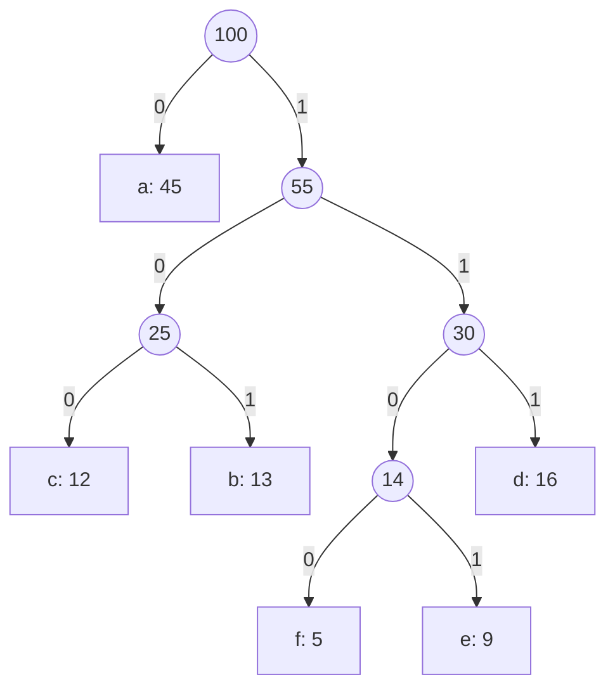

Every byte of every PNG, every gzip response your servers send, and nearly every JPEG passes through a greedy algorithm that David Huffman published in 1952. Huffman coding is the cleanest example of a greedy algorithm that is not obvious, is provably optimal, and runs in production at planetary scale. It is also the algorithm whose proof most people cannot reproduce even when they can recite the steps.

This lesson walks the classic greedy algorithms that interviewers actually ask: Huffman, the two jump games, gas station, and task scheduling, each with its trace and its proof idea. It ends by rereading three algorithms from the graph module (Dijkstra, Prim, Kruskal) as greedy algorithms justified by a single idea, the cut property, so the whole family fits in one mental model.

## Huffman coding

You have a text over an alphabet where some symbols are far more common than others. A fixed-width code spends the same bits on every symbol; a *prefix code* (no codeword is a prefix of another, so decoding never needs delimiters) can give short codes to common symbols. Huffman's algorithm builds the prefix code with the minimum total length.

The algorithm: put every symbol in a min-heap keyed by frequency. Repeatedly pop the two lightest nodes, make them children of a new node whose weight is their sum, and push it back. The last node is the root; a symbol's code is the path of 0s and 1s from the root to its leaf.

Take the six-symbol example with frequencies per 100 characters: `a:45, b:13, c:12, d:16, e:9, f:5`.

| step | heap (weights) | pop two | new node |
|---|---|---|---|
| 1 | 5, 9, 12, 13, 16, 45 | 5 (f), 9 (e) | 14 |
| 2 | 12, 13, 14, 16, 45 | 12 (c), 13 (b) | 25 |
| 3 | 14, 16, 25, 45 | 14 (fe), 16 (d) | 30 |
| 4 | 25, 30, 45 | 25 (cb), 30 (fed) | 55 |
| 5 | 45, 55 | 45 (a), 55 | 100 (root) |

```viz
{"type": "heap", "algorithm": "push-pop", "kind": "min",
 "operations": [["push",5],["push",9],["push",12],["push",13],["push",16],["push",45],["pop"],["pop"],["push",14],["pop"],["pop"],["push",25],["pop"],["pop"],["push",30],["pop"],["pop"],["push",55],["pop"],["pop"],["push",100]],
 "title": "Huffman's algorithm as heap operations",
 "caption": "Each pair of pops takes the two lightest subtrees; the push is their merged parent. The pushed weights 14, 25, 30, 55, 100 sum to the total encoded length, 224 bits."}
```

The tree, with left = 0 and right = 1:



Codes: `a = 0`, `c = 100`, `b = 101`, `f = 1100`, `e = 1101`, `d = 111`. Total bits per 100 characters:

$$45·1 + 13·3 + 12·3 + 16·3 + 9·4 + 5·4 = 45 + 39 + 36 + 48 + 36 + 20 = 224$$

Notice the shortcut in the trace: the total cost equals the sum of the merged node weights (`14 + 25 + 30 + 55 + 100 = 224`), because every merge adds one bit to the code of every symbol below it. That identity lets you compute the cost without building the tree, which is the second exercise.

### Code lengths, the ratio, and the entropy floor

| symbol | frequency | code | length | bits contributed |
|---|---|---|---|---|
| a | 45 | `0` | 1 | 45 |
| d | 16 | `111` | 3 | 48 |
| b | 13 | `101` | 3 | 39 |
| c | 12 | `100` | 3 | 36 |
| e | 9 | `1101` | 4 | 36 |
| f | 5 | `1100` | 4 | 20 |
| total | 100 | | average 2.24 | 224 |

Three ratios are worth knowing. Against the 3-bit fixed code the output is `224 / 300 = 74.7%` of the size, a 25.3% saving. Against 8-bit ASCII it is `224 / 800 = 28%`. Against the floor: the entropy of this distribution is `H = −Σ p log₂ p = 2.2199` bits per symbol, so no code with one codeword per symbol can beat 222 bits per 100, and Huffman's 224 is 0.9% above it. Huffman is always within one bit per symbol of the entropy (`H ≤ L < H + 1`), and the gap is large exactly when one symbol dominates: a source with probabilities 0.99 and 0.01 has entropy 0.08 bits but Huffman spends a whole bit per symbol, twelve times the floor. That gap is why arithmetic coding and ANS exist (see the trade-offs table).

### Decoding is a walk from the root

Prefix-freeness means the decoder never needs delimiters. Encode `faced`: `1100 0 100 1101 111`, 15 bits, the same as the 3-bit code because this word happens to use mostly rare symbols. Decoding reads one bit at a time and restarts at the root each time it reaches a leaf:

| bit positions | bits consumed since the root | node reached | emit |
|---|---|---|---|
| 0–3 | `1100` | leaf f | f |
| 4 | `0` | leaf a | a |
| 5–7 | `100` | leaf c | c |
| 8–11 | `1101` | leaf e | e |
| 12–14 | `111` | leaf d | d |

Nothing in the stream says where one symbol ends; the tree's shape does. That property fails the moment the decoder's tree differs from the encoder's, which is the first failure mode below.

**Why greedy is optimal here.** Two facts, both exchange arguments. First, in some optimal tree the two least frequent symbols are siblings at the deepest level: if they are not, swap them with whatever *is* deepest; the swap moves lighter symbols deeper and heavier ones shallower, so the total cannot increase. Second, merging those two into one pseudo-symbol of combined weight turns the problem into an optimal-code problem on `n − 1` symbols whose cost is exactly the original cost minus the merged weight; so an optimal tree for the smaller problem yields an optimal tree for the larger. Induction closes it. Complexity is $O(n \log n)$ for `n` symbols, or $O(n)$ with two queues if the frequencies arrive sorted.

## Jump game: furthest reach

[Jump Game](/practice/jump-game): `nums[i]` is the maximum jump length from index `i`; can you reach the last index? The greedy keeps one number, `reach`, the furthest index you could have landed on so far. Walk left to right; if `i > reach` you are stranded; otherwise `reach = max(reach, i + nums[i])`.

Trace `[2, 3, 1, 1, 4]`: `i=0`, reach 2; `i=1`, reach `max(2, 4) = 4`; already ≥ 4, done, true. Trace `[3, 2, 1, 0, 4]`: reach 3, 3, 3, 3; `i=4 > 3`, false.

The proof is "greedy stays ahead" in its purest form: `reach` after processing index `i` is *exactly* the furthest index reachable using positions `0..i`, by induction, so no strategy can be ahead of it.

[Jump Game II](/practice/jump-game-ii) asks for the *minimum* number of jumps. Think of it as BFS over the array in layers: layer 0 is index 0; layer 1 is everything reachable in one jump, `1..nums[0]`; layer `k+1` is everything reachable from layer `k`. The answer is the layer containing the last index. You do not need a queue, because each layer is a contiguous range: track `cur_end` (end of the current layer) and `far` (furthest reach from anything in the current layer). When `i` reaches `cur_end`, you have exhausted the layer, so take a jump and set `cur_end = far`.

```python
def min_jumps(nums):
    jumps = cur_end = far = 0
    for i in range(len(nums) - 1):       # never jump from the last index
        far = max(far, i + nums[i])
        if i == cur_end:                 # layer exhausted: must jump
            jumps += 1
            cur_end = far
    return jumps
```

Trace `[2, 3, 1, 1, 4]`: `i=0`: far 2, `i == cur_end` so jumps 1, cur_end 2. `i=1`: far 4. `i=2`: far 4, `i == cur_end`, jumps 2, cur_end 4. Loop ends at `i = 3`. Two jumps (0 → 1 → 4). The loop runs to `n − 2` because reaching the last index never requires jumping *from* it; running to `n − 1` would count one extra jump when the last index is itself a layer boundary.

A longer one, `[3, 4, 3, 2, 5, 4, 3]`, shows the layers as intervals:

| `i` | `nums[i]` | `far` after | `i == cur_end`? | `jumps` | `cur_end` | layer just closed |
|---|---|---|---|---|---|---|
| 0 | 3 | 3 | yes | 1 | 3 | `{0}` |
| 1 | 4 | 5 | no | 1 | 3 | |
| 2 | 3 | 5 | no | 1 | 3 | |
| 3 | 2 | 5 | yes | 2 | 5 | `{1, 2, 3}` |
| 4 | 5 | 9 | no | 2 | 5 | |
| 5 | 4 | 9 | yes | 3 | 9 | `{4, 5}` |

The loop stops before `i = 6`. Three jumps (0 → 1 → 5 → 6 is one witness), and the layers `{0}`, `{1, 2, 3}`, `{4, 5}`, `{6}` are BFS levels. `far` overshooting the array (9 for length 7) is harmless: it is only compared against `i`.

Why is the greedy layer count minimal? Because it is BFS, and BFS layer numbers are shortest-path distances. The greedy exploits the fact that layers are intervals, so a queue is unnecessary.

## Gas station: the restart argument

[Gas Station](/practice/gas-station): `gas[i]` fuel at station `i`, `cost[i]` fuel to reach station `i + 1` around a circle. Find the start from which you can complete a loop, or `−1`. Let `diff[i] = gas[i] − cost[i]`.

Two claims make it linear. First, if `sum(diff) < 0` no start works, since a full loop burns more than it gains. Second, if `sum(diff) ≥ 0` a start exists, and you find it in one pass: keep a running `tank` from a candidate `start`; whenever `tank` goes negative at station `i`, set `start = i + 1` and `tank = 0`.

Trace `gas = [1,2,3,4,5]`, `cost = [3,4,5,1,2]`, so `diff = [−2, −2, −2, 3, 3]`, total 0.

| i | diff | tank before | tank after | action |
|---|---|---|---|---|
| 0 | −2 | 0 | −2 | start = 1, tank = 0 |
| 1 | −2 | 0 | −2 | start = 2, tank = 0 |
| 2 | −2 | 0 | −2 | start = 3, tank = 0 |
| 3 | 3 | 0 | 3 | |
| 4 | 3 | 3 | 6 | |

Answer 3. The argument that skipping straight to `i + 1` is safe: if you started at `s` and first went negative at `i`, then for every station `j` in `s..i` the tank on *arrival* at `j` was non-negative, so starting at `j` instead (with tank 0) reaches `i` with *less or equal* fuel and also fails. Every station from `s` to `i` is therefore ruled out at once, and the pass is $O(n)$. Combined with the total-sum claim, the final `start` is the only survivor and must work. Say both halves in the interview; candidates who state only the restart rule get asked "but why does the last candidate succeed?".

## Task scheduling with cooldown

[Task Scheduler](/practice/task-scheduler): tasks are letters, each takes one unit, the same letter needs `n` idle units between runs. Minimise total time. The greedy is "always run the most frequent remaining task that is off cooldown", which fills the schedule so that the scarce resource (the most frequent letter) is never left waiting.

There is a closed form. Let `max_count` be the highest frequency and `num_max` the number of letters with that frequency. The most frequent letter forces `(max_count − 1)` gaps of length `n + 1`, plus one final slot for each letter that ties at the top:

$$\text{time} = \max\big(\,|\text{tasks}|,\ (\text{max\_count} − 1)(n + 1) + \text{num\_max}\,\big)$$

`AAABBB`, `n = 2`: `max_count = 3`, `num_max = 2`, so `(3 − 1)·3 + 2 = 8`: `A B _ A B _ A B`. The `max` with the task count handles the case where there are so many other letters that no idle slots are needed at all: `AAABBBCCCDDD` with `n = 2` gives `(3 − 1)·3 + 4 = 10` from the formula but has 12 tasks, so the answer is 12 and every slot is busy.

The heap simulation is the version to write when the interviewer changes the rules (different durations, different cooldowns per task). Push counts into a max-heap; each round, pop up to `n + 1` tasks, run them, decrement, push back the survivors; a round costs `n + 1` unless the heap is empty afterwards, in which case it costs only the number of tasks you ran. Trace `AAAABBBCC` with `n = 2`, so rounds have three slots:

| round | heap (count, letter) before | run | pushed back | time added |
|---|---|---|---|---|
| 1 | (4, A) (3, B) (2, C) | A B C | (3, A) (2, B) (1, C) | 3 |
| 2 | (3, A) (2, B) (1, C) | A B C | (2, A) (1, B) | 3 |
| 3 | (2, A) (1, B) | A B | (1, A) | 3, one slot idle |
| 4 | (1, A) | A | none | 1, heap empty so no idle |

Total 10, matching the closed form `(4 − 1)·3 + 1 = 10`. The last row is where implementations go wrong: charging `n + 1` for the final round counts idle time after the last task and returns 12. Same answer as the formula, $O(T \log 26)$, and the shape generalises to [Reorganize String](/practice/reorganize-string), which is the same greedy with `n = 1` and a "which letter goes next" output.

## Dijkstra, Prim and Kruskal: greedy on a cut

Three graph algorithms you will meet in [Dijkstra](/learn/algorithms/graph-algorithms/shortest-paths-dijkstra) and [minimum spanning trees](/learn/algorithms/graph-algorithms/minimum-spanning-trees) are greedy, and one idea justifies all three: a **cut** is a partition of the vertices into a settled set `S` and the rest, and each algorithm makes a greedy choice about the cheapest edge crossing the cut.

**Dijkstra** settles the unsettled vertex with the smallest tentative distance. Greedy claim: that tentative distance is final. Proof: any other path to it leaves `S` through some edge to an unsettled vertex whose tentative distance is at least as large, and with non-negative weights the path can only get longer from there. Negative edges break exactly that last step, which is why Dijkstra is wrong on them and Bellman-Ford exists.

```viz
{"type": "graph", "algorithm": "dijkstra", "directed": false, "start": "A",
 "nodes": [{"id":"A"},{"id":"B"},{"id":"C"},{"id":"D"},{"id":"E"}],
 "edges": [{"from":"A","to":"B","w":4},{"from":"A","to":"C","w":1},{"from":"C","to":"B","w":2},{"from":"B","to":"D","w":5},{"from":"C","to":"D","w":8},{"from":"D","to":"E","w":3},{"from":"C","to":"E","w":10}],
 "title": "Dijkstra as a greedy choice on the cut",
 "caption": "Each step settles the cheapest unsettled vertex (C at 1, then B at 3 via C, then D at 8, then E at 11). Once settled, a distance never changes; that is the greedy-choice property."}
```

**Prim** grows a tree from one vertex by repeatedly adding the lightest edge crossing the cut between tree and non-tree vertices. **Kruskal** sorts all edges and adds each one that joins two different components. Both are justified by the **cut property**: for any cut, the lightest edge crossing it belongs to some minimum spanning tree. Exchange argument: take an MST `T` that omits the light edge `e`; adding `e` to `T` creates a cycle, which must cross the cut somewhere else at an edge `f` with `w(f) ≥ w(e)`; swap `f` out and `e` in, and the result is a spanning tree no heavier than `T`. Kruskal's correctness is also the matroid theorem from [the first lesson](/learn/algorithms/greedy/greedy-and-exchange-arguments) in disguise: acyclic edge sets form a matroid.

The interview signal is not knowing these algorithms; it is being able to say "Prim is greedy, and it works because of the cut property, which is an exchange argument", then reproducing the exchange in two sentences. [Network Delay Time](/practice/network-delay-time) and [Min Cost to Connect All Points](/practice/min-cost-connect-points) are the two problems where that is tested.

## Where greedy runs in production

- **Compression.** Huffman inside DEFLATE, JPEG and Zstandard, as detailed below.
- **Scheduling.** Shortest-job-first minimises mean waiting time (exchange argument: swapping a long job ahead of a short one delays more work); earliest-deadline-first is optimal for meeting deadlines on one machine. Kubernetes' default scheduler scores nodes and greedily places each pod on the best-scoring one, with no backtracking.
- **Load balancing.** "Least connections" and "power of two choices" are greedy: pick the best-looking server right now. They work because the exchange argument is approximately true and re-evaluated every request.
- **Bin packing.** First-fit decreasing (sort items descending, put each in the first bin it fits) is a greedy heuristic for VM placement and container packing. It is *not* optimal (bin packing is NP-hard) but uses at most `11/9 · OPT + 6/9` bins (Dósa's tight bound), which is the honest thing to say about most production greedy: not optimal, but fast and bounded.

That is the senior framing. Interview greedy is about *provable* optimality; production greedy is usually a heuristic whose failure modes you have measured. Saying which one you are running is what the design review checks.

## Under the hood

**DEFLATE (gzip, zlib, PNG, HTTP `Content-Encoding: gzip`).** The stream is a sequence of blocks of three kinds: stored, fixed Huffman (a code written into RFC 1951: 8 bits for literals 0–143, 9 for 144–255, 7 for end-of-block and short match lengths) and dynamic Huffman, where the encoder builds two codes per block from the block's own statistics: one over the 286-symbol literal/length alphabet (256 byte values, end-of-block, 29 LZ77 match-length codes) and one over 30 match-distance codes. Two choices make this work at scale. First, the trees are never transmitted. Only the **code lengths** are, and both sides derive the same **canonical code**: codes of equal length are consecutive integers in symbol order, shorter codes numerically first. Huffman's algorithm is asked only for lengths, so ties, which produce different but equally optimal trees, stop mattering. Second, lengths are capped at 15 bits; when a skewed block demands more, zlib's `gen_bitlen` pulls deep leaves up and accepts a marginally longer output. The lengths are themselves coded with a third code over a 19-symbol alphabet (lengths 0–15 plus three run-length symbols) whose lengths are sent as 3-bit fields, so a dynamic block header costs on the order of a hundred bytes, which is why zlib ends a block when its 16 K-entry literal buffer fills rather than every kilobyte. Decoding does not walk a tree bit by bit: `inflate_fast` indexes a table with the next 9 bits of input (6 for distances) and reads symbol, code length and extra-bit count in one lookup, falling through to a second-level table only for longer codes. `gzip -1` through `-9` never touch this step; they change how hard LZ77 searches for matches.

**Other codecs.** JPEG codes quantised DCT coefficients with Huffman tables (default tables, or per-image ones from `libjpeg`'s `-optimize`, a few percent smaller; lengths limited to 16). HPACK, the header compression in [HTTP/2](/learn/networking/application-protocols/http-2-and-http-3), ships a static canonical Huffman code "generated from statistics obtained on a large sample of HTTP headers" (RFC 7541), and a one-bit flag per header string says whether that string is Huffman-coded, so an HTTP/2 client Huffman-codes a header whenever that is shorter, before encryption. Zstandard uses Huffman for literal bytes and tANS for match lengths and offsets; Brotli adds context modelling and a built-in dictionary. Video codecs show the whole progression: H.264's CAVLC is a Huffman-style variable-length code, while its CABAC mode, HEVC and AV1 use arithmetic coding, because at the probabilities video symbols have the sub-bit gap is worth a multiply per symbol.

**`heapq`.** The build is `n − 1` rounds of two pops and one push on a heap of at most `n` entries; for 286 symbols that is a few thousand comparisons, negligible next to scanning the block. Push `(weight, tiebreak, node)` tuples: a weight tie with a tree node as payload raises `TypeError` in CPython, the same trap as in [Dijkstra](/learn/algorithms/graph-algorithms/shortest-paths-dijkstra); the [binary heap lesson](/learn/data-structures/heaps/binary-heap-mechanics) has the sift costs. When frequencies arrive sorted, two FIFO queues (leaves, merged nodes) replace the heap and the build is `O(n)`, because merged weights come out in non-decreasing order.

## Quantified costs

- **Entropy gap.** Huffman's average length satisfies `H ≤ L < H + 1` bits per symbol. On the six-symbol example the gap is 0.02 bits (0.9%). On a source dominated by one symbol (`p = 0.99`) it is 0.92 bits, a factor of twelve; arithmetic coding closes it to a few thousandths of a bit at the cost of a multiply per symbol.
- **Text.** The order-0 entropy of English letters plus space is about 4.1 bits per character (4.12 measured on the GPL-3 licence text), so Huffman over single characters roughly halves 8-bit text. `gzip -9` on the same file gives 2.76 bits per character, and nearly all of the extra saving comes from LZ77 finding repeated strings, not from the entropy coder (it depends on the text).
- **Table cost.** A dynamic DEFLATE block header is on the order of 50–150 bytes, depending on how many of the 316 symbols are used. Below a few hundred bytes of input that header would be a large fraction of the output, so zlib compares sizes and falls back to the fixed code or a stored block when a dynamic header does not pay.
- **Depth.** With `n` symbols the deepest code is at most `n − 1` bits, reached on Fibonacci frequencies: 17 symbols with frequencies 1, 1, 2, 3, 5, … (a block of 4,180 symbols) already need 16 bits, over DEFLATE's limit; 20 such symbols need 19.
- **The other three algorithms.** Jump game and gas station are one pass with `O(1)` state: 10⁶ elements in well under a second of Python. The scheduler's closed form is `O(T)`; the heap simulation is `O(T log 26)` with a log factor under 5.

## Trade-offs

| Entropy coder | Bits above entropy | Speed | Adaptivity | Used in |
|---|---|---|---|---|
| Fixed width, `⌈log₂ n⌉` bits | up to `log₂ n − H` | fastest, no table | none | raw formats, ASCII |
| Huffman, static per block | under 1 bit/symbol; tiny when probabilities are near powers of ½ | one table lookup per symbol | per-block tables, or adaptive Huffman | DEFLATE, JPEG, HPACK, zstd literals |
| Arithmetic / range coding | around 0.001 bit/symbol | a multiply and a renormalisation per symbol | natural: probabilities update per symbol | CABAC in H.264 and HEVC, AV1, JPEG 2000 |
| ANS (tANS, rANS) | around 0.01 bit/symbol | as fast as Huffman decoding | per-block tables | Zstandard, LZFSE, JPEG XL |

The scheduling pair has the same shape in miniature:

| Task scheduler | Time | Extra state | Handles |
|---|---|---|---|
| Closed form | `O(T)` | two counters | unit durations, one global cooldown |
| Heap simulation | `O(T log σ)` | a heap of `σ` letters | per-task durations, per-task cooldowns, producing the schedule itself |

## Failure modes

**Symptom: the decoder emits garbage, but only when the encoder ran on a different machine or runtime.** Diagnosis: both sides built the tree from frequencies and broke ties differently (heap insertion order, dictionary iteration order): two different, equally optimal trees whose codes disagree. Fix: transmit code lengths and use canonical codes, as DEFLATE does; the tree is never shared.

**Symptom: a home-grown encoder asserts, or packs codes into a 16-bit field and writes corrupt output, on one block of a large file.** Diagnosis: a skewed block. Fibonacci-like frequencies make the tree a chain, and 17 distinct symbols in a block of a few thousand already need a 16-bit code. Fix: length-limit the code (package-merge for the optimum, or zlib's heuristic of pulling deep leaves up), and add a Fibonacci-frequency input to the tests.

**Symptom: `Content-Encoding: gzip` responses are larger than the uncompressed body for small API replies.** Diagnosis: gzip framing alone is 18 bytes (a 10-byte header and an 8-byte CRC-and-length trailer, RFC 1952), and a 60-byte JSON reply has too little repetition to win that back; measured here, one such reply came out at 77 bytes. zlib already uses the fixed code or a stored block when a dynamic header would not pay, so the loss is the framing. A static table trained on one payload type and applied to another inflates output the same way. Fix: a minimum size threshold at the proxy (nginx's `gzip_min_length`).

**Symptom: a stream consisting of one repeated symbol encodes to zero bytes and the decoder cannot tell how many symbols there were.** Diagnosis: a single-leaf tree gives an empty codeword. Fix: force a minimum code length of 1, or store the symbol count in the header; every production format does one of the two.

**Symptom: the task scheduler's heap simulation returns a time larger than the closed form.** Diagnosis: the final round was charged `n + 1` slots although the heap was empty afterwards, counting idle time after the last task. Fix: charge only the tasks run when the heap is empty after a round; round 4 in the trace costs 1, not 3.

## Interviewer follow-ups

**"The frequencies change as the stream goes on. What do you do?"** Model answer: adaptive Huffman (FGK or Vitter's algorithm rebalance the tree per symbol with encoder and decoder in lockstep) or, the industrial answer, per-block tables: buffer tens of kilobytes, build a code for the block, send its lengths, repeat, as DEFLATE does. Common wrong answer: "rebuild the tree after every symbol", `O(n log n)` per symbol with a decoder that cannot tell when the table changed.

**"Huffman is optimal. So nothing compresses better?"** Model answer: optimal among prefix codes with one integer-length codeword per symbol. Integer lengths waste up to a bit per symbol, badly when one symbol dominates; arithmetic coding and ANS share fractions of a bit across symbols and get within about 1% of entropy, and most of a real compressor's gain comes from the modelling (LZ77, context) in front of the coder anyway. Common wrong answer: treating "optimal prefix code" as "optimal compression".

**"Decode faster than one bit per step."** Model answer: canonical codes plus a lookup table indexed by the next 9 or 10 bits of input, storing the symbol and the code's true length so the bit pointer advances correctly; longer codes fall through to a second-level table. That is zlib's `inflate_fast`. Common wrong answer: walking the tree bit by bit, a data-dependent branch per bit and roughly an order of magnitude slower.

**"Jump Game II, but return the jumps taken, and then make each jump cost `cost[i]`."** Model answer: record the index at which each layer closed and walk back to recover a path; with costs it is no longer BFS by layers but shortest path (Dijkstra, or 0-1 BFS when costs are 0 or 1), because the layer argument relied on every jump costing one. Common wrong answer: still jumping to the furthest reach, which minimises the count, not the cost.

**"Gas station: why does the last candidate necessarily succeed?"** Model answer: the prefix before the final `start` sums negative (every restart happened because a running total went negative), so if the final candidate also failed somewhere, the array would be a negative prefix plus a negative segment plus what follows, and with `sum(diff) ≥ 0` that is a contradiction; the wrap-around part is covered because the whole loop is non-negative. Common wrong answer: stating the restart rule and asserting that the survivor works.

## What mid-level engineers get wrong

- **Shipping the tree or the frequencies instead of the code lengths.** Non-deterministic ties then produce decoders that disagree with encoders; canonical codes make lengths sufficient and the tree irrelevant.
- **Compressing tiny payloads.** A dynamic table costs about 100 bytes; below that the compressed output is larger than the input. Threshold it.
- **Quoting Huffman as "within 1% of entropy".** True here, false on skewed sources; the bound is one bit per symbol.
- **Believing gzip levels change the entropy coder.** They change LZ77 effort only.
- **Counting the phantom jump.** Looping to `n − 1` in Jump Game II overcounts when the last index closes a layer: `[1, 2]` returns 2 instead of 1.
- **Stating one half of gas station.** The restart rule alone does not prove the survivor works; the non-negative total does.
- **Reaching for the closed form after the rules change.** Per-task durations or cooldowns break `(max_count − 1)(n + 1) + num_max`; simulate with the heap.
- **Calling a production heuristic "greedy, so optimal".** First-fit decreasing and least-connections are heuristics with measured bounds, not proofs; say which kind you are proposing.

## Exercises

```exercise
id: min-jumps
title: Jump Game II by layers
prompt: |
  `nums[i]` is the maximum jump length from index `i`. Return the minimum
  number of jumps to reach the last index. You may assume it is reachable.
  A single-element array needs 0 jumps. Aim for O(n) time and O(1) space.
languages: [python, javascript]
entry: min_jumps
starter:
  python: |
    def min_jumps(nums):
        # track the end of the current BFS layer and the furthest reach
        return 0
  javascript: |
    function min_jumps(nums) {
      // track the end of the current BFS layer and the furthest reach
      return 0;
    }
tests:
  - args: [[2, 3, 1, 1, 4]]
    expected: 2
  - args: [[1]]
    expected: 0
    label: already at the end
  - args: [[1, 2]]
    expected: 1
  - args: [[1, 1, 1, 1]]
    expected: 3
  - args: [[5, 1, 1, 1, 1, 1]]
    expected: 1
    label: one jump covers everything
  - args: [[2, 1, 1, 1, 4, 1, 1]]
    expected: 4
    hidden: true
  - args: [[3, 4, 3, 2, 5, 4, 3]]
    expected: 3
    hidden: true
hints:
  - "Loop i from 0 to n - 2. Update far = max(far, i + nums[i]). When i == cur_end, increment jumps and set cur_end = far."
  - "Stopping at n - 2 avoids counting a phantom jump from the last index."
```

```exercise
id: huffman-cost
title: Total bits of an optimal Huffman code
prompt: |
  Given the frequencies of the symbols in a message, return the total number
  of bits the message takes under an optimal Huffman code. Use the identity
  that the total equals the sum of the weights of every merged node.

  Conventions: an empty list returns 0, and a single symbol returns 0 (its
  code is empty; no merges happen).

  In JavaScript there is no built-in heap; re-sorting the array each round
  is acceptable for these sizes, or write a small binary heap.
languages: [python, javascript]
entry: huffman_cost
starter:
  python: |
    import heapq

    def huffman_cost(freqs):
        # heapify, then repeatedly merge the two smallest
        return 0
  javascript: |
    function huffman_cost(freqs) {
      // repeatedly take the two smallest, add their sum to the total, push the sum back
      return 0;
    }
tests:
  - args: [[45, 13, 12, 16, 9, 5]]
    expected: 224
  - args: [[1, 1]]
    expected: 2
  - args: [[7]]
    expected: 0
    label: single symbol
  - args: [[1, 1, 1, 1]]
    expected: 8
    label: uniform frequencies give a fixed-width code
  - args: [[]]
    expected: 0
    label: empty
  - args: [[1, 2, 3, 4, 5]]
    expected: 33
    hidden: true
  - args: [[10, 1, 1, 1]]
    expected: 18
    hidden: true
hints:
  - "Pop the two smallest weights a and b, add a + b to the running total, push a + b, and stop when one node remains."
  - "With [1, 2, 3, 4, 5] the merges are 3, 6, 9, 15 for a total of 33."
```

## Senior signals

- You can trace Huffman on six symbols, compute the **total bits from the merged weights** without drawing the tree, and give the two-part exchange proof.
- You describe Jump Game II as **BFS where layers are intervals**, which is why it needs no queue.
- You state **both halves** of the gas station argument: total fuel decides existence, and a failure at `i` eliminates every start up to `i`.
- You know the task-scheduler **closed form** and when to abandon it for the heap simulation (variable durations or cooldowns).
- You reread **Dijkstra, Prim and Kruskal as greedy on a cut** and can produce the cut-property exchange in two sentences.
- You distinguish **provably optimal greedy** (interviews) from **greedy heuristics with measured bounds** (first-fit, least-connections) in production, and you say which one you are proposing.
- You know Huffman is optimal only among **integer-length prefix codes**, that the gap to entropy is under one bit per symbol and large on skewed sources, and that arithmetic coding and ANS exist to close it.
- You know DEFLATE never transmits a tree: it sends **code lengths**, both sides derive the **canonical code**, lengths are capped at 15 bits, and the decoder uses a 9-bit lookup table rather than a bit-by-bit tree walk.

## Check yourself

```quiz
- q: >-
    Huffman coding on frequencies 5, 9, 12, 13, 16, 45 produces merged nodes 14, 25, 30, 55 and 100. What is the total encoded length per 100 symbols, and why can you read it off those weights?
  options: ["224, because each merge adds a bit to every leaf below it", "124, because the root merge adds no bits to any code", "300, because all six symbols need a fixed-width 3-bit code", "100, because the root weight counts every symbol once"]
  answer: 0
  explanation: >-
    Every merge pushes the symbols in both subtrees one level deeper, adding their combined frequency to the total; summing all merged weights (14 + 25 + 30 + 55 + 100) gives 224, matching the sum of frequency × code length. The root merge counts too: it adds the first bit to every code. 300 is the 3-bit fixed-width baseline Huffman beats.
- q: >-
    In Jump Game II, why does the loop stop at index n - 2 rather than n - 1?
  options: ["Skipping it saves an iteration without changing the result", "Processing it can add a jump when it ends a layer", "The problem numbers indices from 1, so n - 1 is past the end", "The last element may be 0, which would strand the scan"]
  answer: 1
  explanation: >-
    Reaching the last index never requires jumping from it. Jumps are counted when a layer is exhausted, so if the last index happens to be the end of a layer, processing it would increment jumps for a jump that never needs to happen. With [1, 2] the correct answer is 1; looping to n - 1 would return 2, so the bound is about correctness, not saving an iteration.
- q: >-
    The gas station pass fails at station i after starting at s and resets the start to i + 1. What justifies skipping the stations between s and i?
  options: ["Stations before i were already visited, so retrying them loops", "The total of diff is negative, so no start in s..i can work", "Each one was reached with a non-negative tank, so it fails at i too", "Each of them has a negative diff, so none of them can be a start"]
  answer: 2
  explanation: >-
    Starting later cannot help: the original run arrived at each intermediate station with fuel >= 0, so a fresh start there with an empty tank has at most the same fuel at every subsequent point and hits the same shortfall. The intermediate stations need not have negative diffs themselves. That is why one linear pass suffices once the total is known to be non-negative.
- q: >-
    Tasks AAAABBBCC with cooldown n = 2. What is the minimum time?
  options: ["11", "10", "9", "12"]
  answer: 1
  explanation: >-
    max_count = 4 (A), num_max = 1, so (4 - 1) × 3 + 1 = 10, which exceeds the 9 tasks. One schedule is A B C A B C A B _ A: three full frames of three then the final A. 9 would require no idle slot, impossible with four As needing two gaps each.
- q: >-
    An encoder and a decoder each build a Huffman tree from the same frequency table, on different machines, and the decoded output is garbage. Both implementations are correct Huffman builds. What happened, and what does DEFLATE do about it?
  options: ["One side used a max-heap by mistake; DEFLATE fixes the heap order in the specification", "Floating-point frequencies rounded differently; DEFLATE sends integer counts instead of probabilities", "The trees differ in total length; DEFLATE transmits the full tree so both sides agree", "Ties were broken differently, giving two optimal trees; DEFLATE sends code lengths and derives a canonical code"]
  answer: 3
  explanation: >-
    Equal weights can be merged in more than one order, and every order gives a tree with the same total length but different codewords. Frequencies are integers, so rounding is not the cause. DEFLATE never transmits a tree or frequencies: it sends each symbol's code length and both sides assign the canonical code (equal lengths get consecutive values in symbol order), so the tie-break is irrelevant.
- q: >-
    A binary source emits symbol X with probability 0.99 and Y with probability 0.01. Its entropy is about 0.08 bits per symbol. What does a Huffman code achieve, and why?
  options: ["About 0.5 bits per symbol, because the two codes average out to half a bit", "About 0.08 bits per symbol, because Huffman is optimal and reaches the entropy", "About 0.1 bits per symbol, within the usual 1% gap of the entropy floor", "1 bit per symbol, because each symbol needs a codeword of at least one whole bit"]
  answer: 3
  explanation: >-
    Huffman assigns one integer-length codeword per symbol, and with two symbols both codewords are exactly one bit, twelve times the entropy. The bound H ≤ L < H + 1 is tight on skewed sources, which is why arithmetic coding and ANS, which share fractions of a bit across symbols, replaced Huffman in video codecs. The 1% gap holds only when probabilities are near powers of one half, as in the lesson's six-symbol example.
```
