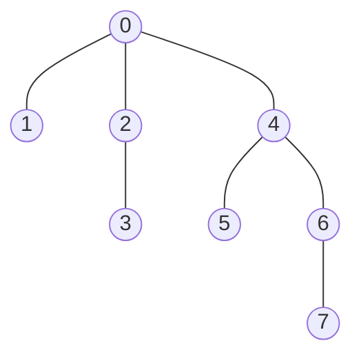
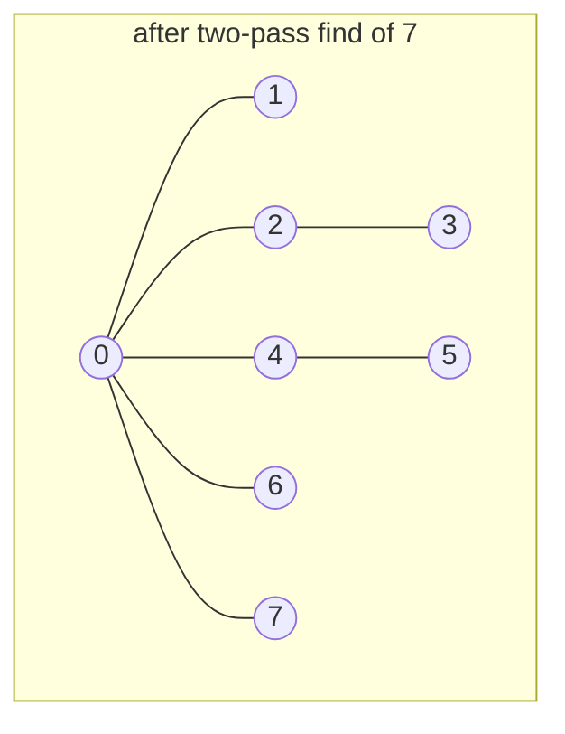

Edges arrive one at a time and after each one you need to answer "are `u` and `v` connected now?". Rerunning BFS costs `O(V + E)` per question, so a stream of `E` edges and `E` questions costs `O(E²)`. Kruskal asks that question once per edge. So does a percolation simulation, a network-partition detector, an "accounts with a shared email are the same person" merger, and every "count the islands as cells appear" problem. All of them need a structure that supports *merge two sets* and *are these in the same set* in something close to constant time, and does not need to support splitting.

That structure is the disjoint-set union, universally called union-find. It is about fifteen lines, it is one of the best-analysed data structures in computer science, and its amortised bound is so close to constant that the function describing it is one you will probably never see exceed 4.

## The representation

Every element has a parent pointer. An element that points to itself is a **root**, and the root of an element's tree is the **representative** of its set. Two elements are in the same set exactly when they have the same root.

```python
parent = list(range(n))        # each element starts as its own root

def find(x):
    while parent[x] != x:
        x = parent[x]
    return x

def union(a, b):
    ra, rb = find(a), find(b)
    if ra == rb:
        return False           # already connected
    parent[ra] = rb            # hang one root under the other
    return True
```

The cost of `find` is the depth of `x` in its tree, and the naive `union` above can build a tree that is a single chain. Union `(i, i + 1)` for `i = 0, 1, 2, …`: each call finds the root of the growing tree (`i`'s root) and hangs it under the singleton `i + 1`.

| union | `parent` after | depth of node 0 |
|---|---|---|
| (0, 1) | `[1, 1, 2, 3, 4, 5]` | 1 |
| (1, 2) | `[1, 2, 2, 3, 4, 5]` | 2 |
| (2, 3) | `[1, 2, 3, 3, 4, 5]` | 3 |
| (3, 4) | `[1, 2, 3, 4, 4, 5]` | 4 |
| (4, 5) | `[1, 2, 3, 4, 5, 5]` | 5 |

After `n − 1` such unions, `find(0)` walks `n − 1` pointers, and a Kruskal that happens to see edges in this order spends `O(n)` per edge, `O(n²)` in total. Two ideas fix this, and they fix it in different ways.

```viz
{"type": "graph", "algorithm": "union-find", "directed": false,
 "title": "Edges as union operations; labels show parent pointers",
 "nodes": [{"id":"A","x":10,"y":25},{"id":"B","x":35,"y":25},{"id":"C","x":60,"y":25},{"id":"D","x":85,"y":25},{"id":"E","x":20,"y":80},{"id":"F","x":50,"y":80},{"id":"G","x":80,"y":80}],
 "edges": [{"from":"A","to":"B"},{"from":"C","to":"D"},{"from":"B","to":"C"},{"from":"E","to":"F"},{"from":"A","to":"D"},{"from":"F","to":"G"}]}
```

Watch the A–D edge: by then A and D already share a root, so the union does nothing and returns `false`. That returned `false` is the entire cycle-detection logic of [Redundant Connection](/practice/redundant-connection) and [Graph Valid Tree](/practice/graph-valid-tree).

## Union by rank: never hang the tall tree under the short one

Store a `rank` per root, an upper bound on the height of its tree. When merging, hang the lower-rank root under the higher-rank one; if the ranks are equal, pick either and increment the winner's rank.

```python
rank = [0] * n

def union(a, b):
    ra, rb = find(a), find(b)
    if ra == rb:
        return False
    if rank[ra] < rank[rb]:
        ra, rb = rb, ra            # ra is now the taller (or equal) root
    parent[rb] = ra
    if rank[ra] == rank[rb]:
        rank[ra] += 1
    return True
```

Trace it on eight elements with the unions `(0,1) (2,3) (4,5) (6,7) (1,3) (5,7) (3,7)`, chosen so that equal-rank trees keep meeting:

| union | roots merged | `parent` after | `rank` after (roots only) |
|---|---|---|---|
| (0, 1) | 0, 1: equal rank, 1 under 0 | `[0, 0, 2, 3, 4, 5, 6, 7]` | 0:1 |
| (2, 3) | 2, 3 | `[0, 0, 2, 2, 4, 5, 6, 7]` | 0:1 2:1 |
| (4, 5) | 4, 5 | `[0, 0, 2, 2, 4, 4, 6, 7]` | 0:1 2:1 4:1 |
| (6, 7) | 6, 7 | `[0, 0, 2, 2, 4, 4, 6, 6]` | 0:1 2:1 4:1 6:1 |
| (1, 3) | 0, 2: equal rank 1, 2 under 0 | `[0, 0, 0, 2, 4, 4, 6, 6]` | 0:2 4:1 6:1 |
| (5, 7) | 4, 6: equal rank 1, 6 under 4 | `[0, 0, 0, 2, 4, 4, 4, 6]` | 0:2 4:2 |
| (3, 7) | 0, 4: equal rank 2, 4 under 0 | `[0, 0, 0, 2, 0, 4, 4, 6]` | 0:3 |

The result is one tree of rank 3 with exactly `2³ = 8` nodes, and the deepest node, 7, sits at depth 3 along the path `7 → 6 → 4 → 0`. Node depths are `[0, 1, 1, 2, 1, 2, 2, 3]`.



Why rank bounds height at `log₂ n`: a root of rank `r` has at least `2^r` nodes under it. By induction, rank increases only when two rank-`(r−1)` trees merge, each with at least `2^(r−1)` nodes, giving at least `2^r`; the trace shows it happening at every equal-rank merge. A tree of rank `r` therefore needs `2^r ≤ n` nodes, so `r ≤ log₂ n`, and `find` is `O(log n)` worst case: at most 30 hops for a billion elements. Union by *size* (hang the smaller set under the larger) gives the same bound by the same argument, and has the practical advantage that you get "how big is this component" for free, which "number of islands" and "largest component" questions need.

## Path compression: make every find pay forward

When `find` walks from `x` to the root, every node on the way now knows the root. Point them all directly at it.

```python
def find(x):
    root = x
    while parent[root] != root:
        root = parent[root]
    while parent[x] != root:       # second pass: compress
        parent[x], x = root, parent[x]
    return root
```

Run `find(7)` on the forest above. The first pass walks `7 → 6 → 4 → 0` and learns that the root is 0. The second pass rewrites every node on that path: `parent[7] = 0`, `parent[6] = 0`, and `parent[4]` was already 0.

| | `parent` | depths of 0..7 |
|---|---|---|
| before `find(7)` | `[0, 0, 0, 2, 0, 4, 4, 6]` | `[0, 1, 1, 2, 1, 2, 2, 3]` |
| after two-pass compression | `[0, 0, 0, 2, 0, 4, 0, 0]` | `[0, 1, 1, 2, 1, 2, 1, 1]` |
| after path halving instead | `[0, 0, 0, 2, 0, 4, 4, 4]` | `[0, 1, 1, 2, 1, 2, 2, 2]` |



Nodes 6 and 7 are now direct children of the root and node 5, which was not on the path, is untouched. The rank of node 0 is still 3 although the tree's true height is now 2: compression shortens trees but never updates ranks, which is why `rank` is an *upper bound* on height, and the union rule only ever needed an upper bound.

The recursive version, `parent[x] = find(parent[x])`, reads more cleanly and is fine in an interview; in production Python it hits the recursion limit (1,000 frames by default) on a chain of a thousand nodes, which is why the two-pass loop above exists. Two one-pass variants are nearly as effective and even shorter: **path halving** (`parent[x] = parent[parent[x]]` on every step, so each node skips to its grandparent) and **path splitting** (every node on the path points at its grandparent). The third row of the table is halving: `find(7)` sets `parent[7] = parent[6] = 4`, jumps to 4, sets `parent[4] = parent[0] = 0`, and stops; node 6 is left alone, and the path from 7 shrank from 3 hops to 2. Path halving is what most competitive programmers write because it is one line inside the loop.

## What the bound actually is

| Technique | Worst-case `find` | Amortised per operation over `m` operations |
|---|---|---|
| Neither | `O(n)` | `O(n)` |
| Union by rank only | `O(log n)` | `O(log n)` |
| Path compression only | `O(n)` for one op | `O(log n)` amortised |
| Both | `O(log n)` | `O(α(n))` |

`α(n)` is the inverse Ackermann function, and "effectively constant" deserves a real definition. Define `A₀(j) = j + 1` and `A_k(j) = A_{k−1}` applied `j + 1` times to `j`. Then `A₁(j) = 2j + 1`, `A₂(j) = 2^(j+1)(j + 1) − 1`, and the values at `j = 1` explode: `A₁(1) = 3`, `A₂(1) = 7`, `A₃(1) = 2047`, and `A₄(1) = A₃(2047)`, a tower of exponentials about two thousand levels high. `α(n)` is the smallest `k` with `A_k(1) ≥ n`:

| `n` | `α(n)` |
|---|---|
| up to 3 | 1 |
| 4 to 7 | 2 |
| 8 to 2,047 | 3 |
| 2,048 to `A₄(1)` | 4 |

The observable universe has around `10⁸⁰` atoms, which is nowhere near `A₄(1)`, so `α(n) ≤ 4` for every input that will ever exist. The bound is amortised: a single `find` can still cost `O(log n)` hops, and `m` operations on `n` elements cost `O(m α(n))` in total. Tarjan proved it in 1975 (Hopcroft and Ullman had `O(m log* n)` earlier, where `log* n`, the number of times you can take a logarithm before reaching 1, is 5 for `n = 2^65536`), and Fredman and Saks proved in 1989 that no structure in the pointer-machine model does better, so the story is closed. When an interviewer asks "what is the complexity", "amortised inverse Ackermann, at most 4 for any physical input, given both union by rank and path compression" is the full answer; "and with only one of the two?" is answered by the table above.

Do not try to reproduce the `α` proof on a whiteboard; it is a potential-function argument over rank levels, in the style of the [amortised analysis lesson](/learn/foundations/complexity/amortized-analysis), that runs to several pages. What you should be able to reproduce is the `2^r` counting argument for `log n`, and the observation that compression only ever shortens paths, so it cannot make anything worse.

## A complete implementation with component counts

```python
class UnionFind:
    def __init__(self, n):
        self.parent = list(range(n))
        self.size = [1] * n
        self.components = n

    def find(self, x):
        while self.parent[x] != x:
            self.parent[x] = self.parent[self.parent[x]]   # path halving
            x = self.parent[x]
        return x

    def union(self, a, b):
        ra, rb = self.find(a), self.find(b)
        if ra == rb:
            return False
        if self.size[ra] < self.size[rb]:
            ra, rb = rb, ra
        self.parent[rb] = ra
        self.size[ra] += self.size[rb]
        self.components -= 1
        return True

    def connected(self, a, b):
        return self.find(a) == self.find(b)
```

`components` starts at `n` and drops by one on every successful merge, so [Number of Provinces](/practice/number-of-provinces) is "count successful unions, subtract from `n`", and "number of islands as cells are added" is the same counter with a union per land neighbour. When elements are strings rather than integers (emails in [Accounts Merge](/practice/accounts-merge)), map each string to an index with a dictionary first; a union-find keyed on a hash map works but is slower and easier to get wrong.

## The offline trick: sort the timeline, answer in one pass

Union-find cannot delete an edge. That sounds like a fatal restriction for questions like "at what time did the network first become fully connected" or "for each query (t, u, v), were u and v connected at time t", and it is not, because those questions can be answered **offline**: collect everything first, sort by time, and replay.

For "earliest moment everyone is connected": sort the edge log by timestamp, union in order, and report the timestamp of the union that brings `components` to 1. For per-query connectivity at a time: sort queries by time too, and advance the edge pointer up to each query's timestamp before answering it. Both are `O((E + Q) log(E + Q))` for the sorts plus `α` per operation.

The trick generalises to *deletions*: if you know the full sequence of deletions in advance, process time backwards. Start from the final graph with all deleted edges removed, then walk the deletions in reverse, each one becoming an insertion. "Number of components after removing each edge in order" becomes "number of components as edges are re-added in reverse", and union-find handles it. This reversal is a standard senior move: turn a structure's weakness into a non-issue by changing the order of the questions rather than the structure.

When the questions genuinely must be answered online with deletions, union-find is the wrong tool and the answer is a dynamic connectivity structure (Holm–de Lichtenberg–Thorup, link-cut trees), which are `O(log² n)` per operation and a few hundred lines. Between the two sits **union-find with rollback**: union by rank *without* path compression, plus a stack recording each union's `(child root, old rank of parent)`, so the last union can be undone in `O(1)`. Every `find` is then `O(log n)`, but unions can be popped in LIFO order, which is what "divide and conquer over time" needs to answer offline connectivity with arbitrary deletions in `O(q log q log n)`. Knowing that boundary is worth more than knowing those structures.

## Extensions worth knowing by name

**Union-find with parity.** Store, alongside each parent pointer, the parity of the path to the parent. `find` accumulates parity along the path (and compresses it). Now you can maintain "u and v are on opposite sides" constraints and detect when a new edge makes the graph non-bipartite: it is how "can these people be split into two groups given dislikes" is solved incrementally, and the base of the 2-SAT connection in the [strongly connected components lesson](/learn/algorithms/graph-algorithms/strongly-connected-components).

**Weighted union-find.** Generalise the parity to any group: store the *ratio* `x / parent(x)` and you can answer "given a/b = 2 and b/c = 3, what is a/c" with one `find` each. Same code, different combining operation.

**Union-find on a grid.** Index cell `(r, c)` as `r * cols + c` and add virtual nodes for "top row" and "bottom row"; percolation ("does water get from top to bottom") is a single `connected(top, bottom)` after unioning open neighbours. [Surrounded Regions](/practice/surrounded-regions)-style problems use a virtual "border" node the same way.

## Under the hood

**Memory layout and why compression matters more at scale.** The whole structure is one or two flat arrays. In Python, `parent = list(range(n))` costs 8 bytes per slot plus a 28-byte `int` object for every value above 256, about 36 bytes per element, so `10⁸` elements need 3.6 GB; `array('i')` or a NumPy `int32` array is 4 bytes per element, 400 MB. Rank fits in one byte (it never exceeds `log₂ n ≤ 63`), and a size counter needs a 32-bit or 64-bit integer. In Rust or C the pair is 5–8 bytes per element. Finds are pointer chasing with no locality: on a parent array larger than the last-level cache, every hop is a cache miss of roughly 100 ns, which is why the difference between a 3-hop path and a 1-hop path shows up in wall-clock time long before `α` does. Path compression pays for itself by shortening the *next* find's chain of misses.

**Libraries.** `networkx.utils.UnionFind` is a dictionary-keyed version (any hashable element) with union by weight and full path compression, and it is what `networkx`'s Kruskal uses; `networkx.connected_components` on a static graph uses BFS instead, because a single traversal is cheaper than `E` unions when nothing is incremental. `scipy.sparse.csgraph.connected_components` likewise labels components by traversal over CSR arrays. Rust's `petgraph::unionfind::UnionFind` (rank plus compression) backs its Kruskal, and the `ena` crate, used inside the Rust compiler's type inference, is a union-find with snapshots and rollback, exactly the "undo stack" variant above.

**Type inference.** Hindley–Milner unification, the algorithm behind type inference in OCaml, Haskell and Rust, is a union-find over type variables: unifying `α` with `β` is a union, and "what is `α` now?" is a find whose root carries the resolved type. Every compile of a Rust crate runs millions of these operations.

**Connected-component labelling in images.** The classic two-pass algorithm scans pixels, gives each new run a provisional label, records "label 12 touches label 7" as a union, and relabels in a second pass with finds. OpenCV's `connectedComponents` and scikit-image's `label` are descendants of this scheme.

**At scale.** Identity resolution ("these two records are the same customer") over hundreds of millions of rows is a union-find over match edges. Distributed frameworks such as Spark GraphX compute components by iterative minimum-label propagation rather than pointer chasing, because a cross-machine pointer hop costs milliseconds; the usual pipeline runs union-find inside each partition and propagates labels only across partition boundaries. The [MST lesson](/learn/algorithms/graph-algorithms/minimum-spanning-trees) shows the other big consumer: Kruskal makes `2E` finds and at most `V − 1` unions.

## Quantified costs

- **The chain without either optimisation.** `10⁵` unions in chain order followed by `10⁵` finds of the deepest node is `10¹⁰` pointer steps, hours in Python and tens of seconds in C. The same operations with path halving alone are amortised `O(log n)`, about `2 × 10⁶` steps.
- **Height with rank.** At most `log₂ n` hops per find: 17 for `10⁵` elements, 30 for `10⁹`. Compression pulls the typical path far below that after a few finds.
- **`α`.** `A₃(1) = 2047`, so `α(n) ≤ 3` for any graph with fewer than 2,048 nodes and `≤ 4` for every physical `n`. The constant is amortised: `m` operations cost `O(m α(n))`, not `α(n)` each.
- **Kruskal's share.** For `E = 10⁷` edges: `2 × 10⁷` finds plus at most `V − 1` unions, roughly `10⁸` pointer steps, seconds in Python and tens of milliseconds in C; the edge sort is 10× more.
- **Memory.** 36 bytes per element as a Python list of ints, 4 as a typed `int32` array, 8 with a size counter in C. A `dict`-keyed union-find costs about 100 bytes per element for the dictionary alone.
- **Recursion.** Python's default recursion limit is 1,000 frames; a recursive `find` on a chain of that depth raises `RecursionError`. With union by rank the depth is at most `log₂ n`, so recursion only fails when linking is naive.

## Trade-offs

| Approach | Add edge | Query "connected?" | Delete edge | Memory | Needs all questions in advance? |
|---|---|---|---|---|---|
| BFS/DFS per query | `O(1)` | `O(V + E)` | `O(1)` | adjacency lists | no |
| Union-find (rank + compression) | amortised `O(α)` | amortised `O(α)` | not supported | `O(V)` | no |
| Union-find, offline reversal | `O(α)` | `O(α)` | `O(α)` by replaying backwards | `O(V + E)` | yes |
| Union-find with rollback | `O(log V)` | `O(log V)` | LIFO undo only, `O(1)` | `O(V + stack)` | yes, for divide and conquer over time |
| Dynamic connectivity (HDT) | `O(log² V)` amortised | `O(log V / log log V)` | `O(log² V)` amortised | `O(E log V)` | no |
| Label propagation (distributed) | batch | after convergence | recompute | per partition | batch |

## Failure modes

**Symptom: `RecursionError` in production on a graph the tests never exercised, from a recursive `find`.** Diagnosis: linking without rank or size, so an adversarial (or merely sorted) edge order built a chain longer than the 1,000-frame default; the recursion depth equals the path length. Fix: union by size or rank, which caps depth at `log₂ n`, and an iterative `find` with path halving so that no input can hit the limit.

**Symptom: the component count is too high and `connected(a, b)` returns `false` for nodes that share an edge.** Diagnosis: `union` wrote `parent[a] = b` using the elements instead of their roots. Moving a non-root `a` under `b` drags `a`'s subtree along but leaves `a`'s former root and siblings behind, splitting a set. Fix: always `find` both sides and link the roots; the exercise's tests include a repeated union that catches this.

**Symptom: after "removing" an element by setting `parent[x] = x`, unrelated elements report that they are disconnected.** Diagnosis: `x` was an internal node, and its subtree went with it. Fix: union-find does not delete; mark the element dead and rebuild, replay offline in reverse, or use rollback or dynamic connectivity.

**Symptom: intermittently wrong components in a multi-threaded service.** Diagnosis: path compression *writes* during `find`, so two threads compressing and uniting concurrently tear the parent array. Fix: partition elements across threads with a merge phase, take a lock, or, if the data is static, replace union-find with a single BFS labelling.

**Symptom: memory use is ten times the estimate and unions slow down as the process ages.** Diagnosis: a `dict`-keyed union-find over strings (emails, IDs), with the dictionary growing and never shrinking. Fix: map each string to a dense integer once, then run on arrays.

**Symptom: `components` drifts from the true count.** Diagnosis: the counter was decremented on every `union` call, including the ones that found the elements already connected. Fix: decrement only when the roots differed, which is why `union` returns a boolean.

## Interviewer follow-ups

**"Edges get deleted, and the questions arrive online. Now what?"** Model answer: union-find cannot help directly. If deletions are known in advance, reverse time. If only the *set* of questions is known, use divide and conquer over time with rollback union-find, `O(q log q log n)`. If nothing is known in advance, a dynamic connectivity structure such as Holm–de Lichtenberg–Thorup at `O(log² n)` amortised per update. Common wrong answer: rebuilding the union-find after each deletion, `O(E)` per query.

**"You said 'effectively constant'. What is `α(n)` exactly?"** Model answer: the inverse of the Ackermann function, `α(n) = min{k : A_k(1) ≥ n}`, with `A₃(1) = 2047` and `A₄(1)` a tower of exponentials; so `α ≤ 4` for any physical input, and the bound is amortised over the whole sequence. Common wrong answer: "it is `O(1)` worst case", which is false for a single find.

**"How would you run this over 10⁹ edges on a cluster?"** Model answer: partition edges by node range, run union-find inside each partition, then propagate component labels across partition boundaries in rounds until nothing changes; that is what graph frameworks do, because pointer chasing across machines is the wrong primitive. Common wrong answer: sharding the parent array across machines and doing remote finds.

**"Maintain 'are these two on opposite sides' constraints and detect a contradiction."** Model answer: union-find with parity: store the parity of each node relative to its parent, accumulate it in `find`, and when a constraint joins two nodes already in one set compare parities. Common wrong answer: rerunning a bipartiteness BFS after every constraint.

**"After a million unions, can I use `find(x)` as a stable component ID?"** Model answer: no; roots change with every merge, so an ID recorded earlier may no longer be a root. Take a snapshot: run `find` over every element after the last union and store the results. Common wrong answer: caching `find` results across unions.

## What mid-level engineers get wrong

- **Recursive `find` with naive linking.** Passes small tests, dies with `RecursionError` on the first long chain.
- **Linking elements instead of roots.** Silently splits sets; the component count comes out too high.
- **Incrementing rank on every union.** Ranks stop bounding height and the `log n` argument no longer holds; the code still works, only slower.
- **Quoting `O(1)`.** The bound is amortised `O(α(n))`; a single find can be `O(log n)`.
- **Trying to delete.** Resetting a pointer corrupts the forest; the honest options are offline reversal, rollback, or a different structure.
- **Dictionary-keyed union-find on ten million strings.** A hundred bytes per key; index the strings first.
- **Treating a root as a permanent ID.** Roots change under union; snapshot after the last merge.
- **Reaching for union-find on a static graph.** One BFS labels components in `O(V + E)` with no pointer chasing; union-find earns its place only when edges arrive over time.

## Exercises

```exercise
id: union-find-class
title: Union-find with union by size and path compression
prompt: |
  Implement `UnionFind` with these methods, replayed from a list of operations:

  - `init(n)`: create `n` singleton sets `0..n-1` (called first, returns nothing)
  - `union(a, b)`: merge the sets; return `true` if they were different, `false` if already the same
  - `connected(a, b)`: return whether `a` and `b` share a root
  - `components()`: return the current number of sets

  Use union by size (hang the smaller set under the larger) and path
  compression (halving or two-pass). Do not use recursion for `find`.
languages: [python, javascript]
entry: UnionFind
starter:
  python: |
    class UnionFind:
        def init(self, n):
            self.parent = list(range(n))
            self.size = [1] * n
            self.count = n

        def find(self, x):
            # walk to the root, compressing on the way
            return x

        def union(self, a, b):
            return False

        def connected(self, a, b):
            return False

        def components(self):
            return self.count
  javascript: |
    class UnionFind {
      init(n) {
        this.parent = Array.from({ length: n }, (_, i) => i);
        this.size = new Array(n).fill(1);
        this.count = n;
      }
      find(x) {
        // walk to the root, compressing on the way
        return x;
      }
      union(a, b) {
        return false;
      }
      connected(a, b) {
        return false;
      }
      components() {
        return this.count;
      }
    }
tests:
  - args: [["init",5],["union",0,1],["union",1,2],["connected",0,2],["connected",0,3],["components"]]
    expected: [null, true, true, true, false, 3]
  - args: [["init",3],["union",0,1],["union",0,1],["components"]]
    expected: [null, true, false, 2]
    label: repeated union is a no-op
  - args: [["init",1],["components"],["connected",0,0]]
    expected: [null, 1, true]
    label: single element
  - args: [["init",6],["union",0,1],["union",2,3],["union",4,5],["union",1,3],["connected",0,2],["connected",0,4],["components"],["union",5,0],["components"]]
    expected: [null, true, true, true, true, true, false, 2, true, 1]
  - args: [["init",4],["union",0,1],["union",1,2],["union",2,3],["union",3,0],["components"]]
    expected: [null, true, true, true, false, 1]
    hidden: true
    label: closing edge of a cycle
  - args: [["init",2],["connected",0,1],["union",1,0],["connected",0,1]]
    expected: [null, false, true, true]
    hidden: true
hints:
  - "In `find`, loop `while parent[x] != x`, setting `parent[x] = parent[parent[x]]` before stepping."
  - "In `union`, find both roots; if equal return false; otherwise swap so `ra` is the larger set, then `parent[rb] = ra`, add sizes, decrement the count."
  - "`connected` is `find(a) == find(b)`."
```

```exercise
id: earliest-full-connection
title: Earliest moment the network is connected
prompt: |
  `logs` is an unsorted list of `[t, u, v]` entries meaning "at time `t`, a
  link between `u` and `v` came up" (`n >= 2` nodes, `0..n-1`; links are never
  removed; several entries may share a timestamp). Return the earliest time
  at which every node can reach every other node, or `-1` if that never
  happens.

  Sort by time and replay with union-find; the answer is the timestamp of
  the union that leaves exactly one component.
languages: [python, javascript]
entry: earliest_full_connection
starter:
  python: |
    def earliest_full_connection(n, logs):
        parent = list(range(n))
        # sort logs by t, union, stop when one component remains
        return -1
  javascript: |
    function earliest_full_connection(n, logs) {
      const parent = Array.from({ length: n }, (_, i) => i);
      // sort logs by t, union, stop when one component remains
      return -1;
    }
tests:
  - args: [4, [[20,0,1],[10,2,3],[5,1,2]]]
    expected: 20
  - args: [2, [[3,0,1]]]
    expected: 3
  - args: [3, [[1,0,1]]]
    expected: -1
    label: never fully connected
  - args: [3, [[4,0,1],[4,1,2],[2,0,2]]]
    expected: 4
    label: shared timestamps
  - args: [4, [[1,0,1],[2,0,1],[3,2,3],[4,0,1],[7,1,3],[9,0,2]]]
    expected: 7
    hidden: true
    label: redundant links do not count
  - args: [5, [[10,0,1],[9,1,2],[8,2,3],[7,3,4],[6,4,0]]]
    expected: 9
    hidden: true
hints:
  - "Sort by timestamp, then process in order; the input is not sorted."
  - "Track `components = n`; each successful union decrements it. Return the current `t` when it reaches 1."
  - "If the loop finishes with more than one component, return -1."
```

## Senior signals

- You can give the `2^r`-nodes-per-rank argument for the `log n` height bound in two sentences, and you know compression makes rank an upper bound rather than the true height.
- You quote the complexity as amortised `O(α(n))` with both optimisations, `O(log n)` with either alone, and you know `α(n) ≤ 4` for any physical input.
- You write `find` iteratively (path halving) in production because the recursive version overflows Python's stack on long chains.
- You turn "connectivity over time" and even "connectivity under deletions" into offline problems by sorting or reversing, and you know dynamic connectivity structures exist for the genuinely online case.
- You keep `size` and a component counter so that "how many islands" and "largest group" fall out with no extra traversal.
- You recognise the parity and weighted extensions ("possible bipartition", "evaluate division") as the same structure with a value on each pointer.
- You can define `α(n)` (`A₃(1) = 2047`, so `α ≤ 3` for a few thousand elements and `≤ 4` for anything physical) and you never quote the bound as worst-case `O(1)`.
- You know rollback union-find (rank without compression plus an undo stack) as the tool between offline reversal and full dynamic connectivity.
- You know why every real implementation links roots only, never non-roots, and why "delete by resetting a parent pointer" corrupts the forest.
- You can size the structure (about 36 bytes per element as a Python list, 4–8 bytes as a typed array) and explain why compression matters most when the parent array no longer fits in cache.

## Check yourself

```quiz
- q: >-
    Using union by rank without path compression, what is the worst-case cost of a single find on n elements?
  options: ["O(log n)", "O(log² n)", "O(α(n))", "O(n)"]
  answer: 0
  explanation: >-
    A root of rank r has at least 2^r nodes, so rank (an upper bound on height) is at most log₂ n. Path compression is needed to get down to amortised α(n); rank alone is logarithmic.
- q: >-
    After path compression, the rank stored at a root no longer equals its tree's height. Why is the union rule still correct?
  options: ["Compression only moves leaves, so heights never actually change", "Rank stays an upper bound on height, and that is all it needs", "Each find resets the root's rank to its new, exact height", "It isn't; heights must be recomputed after each compression"]
  answer: 1
  explanation: >-
    Compression only shortens trees, so height ≤ rank still holds, and the counting argument (a rank-r root has ≥ 2^r nodes) never relied on rank being exact. Compression does change heights, and recomputing them would cost more than the operation it protects.
- q: >-
    You are asked: for each of Q queries (t, u, v), were u and v connected at time t, given a log of link-up events? Links are never removed. What is the right approach?
  options: ["Build the full union-find, then undo links after time t", "Sort events and queries by time; sweep one union-find", "BFS per query on the graph filtered to links before t", "Floyd-Warshall once, then look up each (u, v) pair"]
  answer: 1
  explanation: >-
    Because there are no deletions, connectivity at time t depends only on events up to t. Sorting both lists and advancing the union-find through events, answering each query when its time is reached, is O((E+Q) log(E+Q)) plus near-constant per operation; per-query BFS is the O(Q·E) approach it replaces. Undoing links is not something union-find supports.
- q: >-
    A stream removes edges from a graph one by one and after each removal asks for the number of connected components. All removals are known in advance. How do you use union-find?
  options: ["Rebuild the union-find from scratch after each removal", "Replay the removals in reverse order, as insertions", "Union the removed edges first, then split them off in order", "Delete each edge by resetting its endpoints' parent pointers"]
  answer: 1
  explanation: >-
    Reversing time turns each deletion into an insertion, which union-find handles: start from the graph with all removed edges absent and record component counts backwards. Resetting parent pointers is not a valid deletion because compression has rewired other nodes through them. Rebuilding is O(E) per step; reversal is near-linear overall.
- q: >-
    Two implementations of union differ only in that one hangs the smaller set under the larger and the other always hangs the second root under the first. Both use full path compression. Which statement is true?
  options: ["Size-aware is amortised O(α(n)); the other is O(log n)", "Size-aware is amortised O(log n); the other is O(α(n))", "Both are amortised O(log n); α(n) needs recursive find", "Both are amortised O(α(n)), because compression dominates"]
  answer: 0
  explanation: >-
    Path compression alone gives amortised O(log n); combining it with union by rank or size is what yields the inverse-Ackermann bound. Whether find is recursive or iterative does not matter. Both are fast on typical inputs, but the guarantee differs, and interviewers ask precisely this.
- q: >-
    To delete element x from its set, a colleague proposes setting parent[x] = x. On the forest where 6 and 7 point to 4 and 4 points to 0, what happens after "deleting" 4 this way?
  options: ["Nodes 6 and 7 are silently cut off from 0's set, so connected(6, 0) becomes false", "Nodes 6 and 7 are re-attached to 0 on their next find, so nothing is lost", "Node 4 leaves its set cleanly, because only its own pointer changed", "It raises an error, since a non-root node cannot point to itself"]
  answer: 0
  explanation: >-
    Union-find has no delete. Node 4 is an internal node; making it a root takes its whole subtree with it, so 6 and 7 now report a different root from 0 even though nothing disconnected them. Compression never re-attaches them, because find stops at the first self-pointing node. The honest options are offline reversal, rollback union-find, or a dynamic connectivity structure.
```
