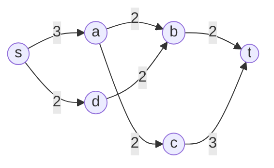

Your network has forty routers and sixty links. Which single link, if it fails, splits the network in two? Which single router? Answering by brute force means removing each link, running BFS, and checking connectivity: `O(E · (V + E))`, which is fine for sixty links and hopeless for a data-centre fabric or a road network with a million edges. The DFS low-link idea from the [SCC lesson](/learn/algorithms/graph-algorithms/strongly-connected-components) answers both questions for every edge and node at once, in a single `O(V + E)` pass.

The second half of this lesson is a different question with a related feel: not "what breaks the network" but "how much can we push through it". Max-flow is the technique behind assignment problems, scheduling, image segmentation and a surprising number of interview problems that say "maximum number of pairs". You are unlikely to be asked to implement Dinic's algorithm in forty-five minutes; you are quite likely to be asked to *recognise* that a problem is bipartite matching and to say how flow solves it.

## Bridges and articulation points

A **bridge** is an edge whose removal increases the number of connected components. An **articulation point** (cut vertex) is a node whose removal does the same. A graph with no bridges is 2-edge-connected; with no articulation points it is biconnected. Redundant networks are designed to have neither, and the check is the algorithm below.

Run a DFS on the undirected graph. Each node gets a discovery time `disc[u]` and a low-link value `low[u]`: the smallest discovery time reachable from `u`'s subtree using tree edges downward and at most one **back edge** upward. Undirected DFS has a property directed DFS lacks: there are no cross edges. Every non-tree edge connects an ancestor and a descendant. So `low[v]` for a child `v` of `u` says exactly how far up the tree `v`'s subtree can climb without using the edge `(u, v)`.

- If `low[v] > disc[u]`, the subtree under `v` cannot reach `u` or anything above it except through `(u, v)`. That edge is a **bridge**.
- If `low[v] ≥ disc[u]`, the subtree under `v` cannot reach anything *strictly above* `u`. Removing `u` strands it, so `u` is an **articulation point**, unless `u` is the DFS root.
- The root is an articulation point if and only if it has two or more DFS children (its subtrees are connected only through it).

The difference between `>` and `≥` is the entire difference between the two problems, and interviewers ask about it. A back edge from `v`'s subtree to `u` itself is enough to save the edge `(u, v)` from being a bridge (the subtree can still reach `u`), but not enough to save `u` from being a cut vertex (removing `u` removes that back edge's endpoint too).

```viz
{"type": "graph", "algorithm": "bridges", "directed": false,
 "title": "Bridges via low-link (labels show disc/low)",
 "nodes": [{"id":"A","x":10,"y":30},{"id":"B","x":35,"y":50},{"id":"C","x":10,"y":75},{"id":"D","x":65,"y":50},{"id":"E","x":90,"y":50}],
 "edges": [{"from":"A","to":"B"},{"from":"B","to":"C"},{"from":"C","to":"A"},{"from":"B","to":"D"},{"from":"D","to":"E"}]}
```

### Traced on five nodes

Trace it event by event, starting at A and taking neighbours in the order the edges were listed:

| # | Event | `disc` / `low` | Verdict |
|---|---|---|---|
| 1 | discover A | `disc[A] = low[A] = 0` | |
| 2 | tree edge A–B, discover B | `disc[B] = low[B] = 1` | |
| 3 | B–A is the edge B arrived by | skipped, by edge index | |
| 4 | tree edge B–C, discover C | `disc[C] = low[C] = 2` | |
| 5 | C–B is C's parent edge | skipped | |
| 6 | back edge C–A | `low[C] = min(2, disc[A] = 0) = 0` | |
| 7 | return to B from C | `low[B] = min(1, low[C] = 0) = 0` | `low[C] = 0 ≤ disc[B] = 1`: B–C is not a bridge, and does not make B a cut vertex |
| 8 | tree edge B–D, discover D | `disc[D] = low[D] = 3` | |
| 9 | tree edge D–E, discover E | `disc[E] = low[E] = 4`; E's only edge is its parent edge | |
| 10 | return to D from E | `low[D] = min(3, low[E] = 4) = 3` | `low[E] = 4 > disc[D] = 3`: **D–E is a bridge**; `≥` also holds: **D is an articulation point** |
| 11 | return to B from D | `low[B] = min(0, low[D] = 3) = 0` | `low[D] = 3 > disc[B] = 1`: **B–D is a bridge**; **B is an articulation point** |
| 12 | return to A from B | `low[A] = min(0, low[B] = 0) = 0` | `low[B] = 0 ≤ disc[A] = 0`: A–B is not a bridge |
| 13 | back edge A–C from A's side | `low[A] = min(0, disc[C] = 2) = 0` | already visited: no effect |
| 14 | root A has one DFS child | | A is not an articulation point |

Final values: `disc = A0 B1 C2 D3 E4`, `low = A0 B0 C0 D3 E4`. Row 7 is the whole `>` versus `≥` story in one line: `low[C]` equals neither bound's failure case because the back edge C–A climbs *above* B, so B–C is neither a bridge nor evidence that B is a cut vertex. Row 10 shows the other extreme: E's subtree has nothing but its parent edge, so it can climb nowhere at all.

### The implementation

```python
def bridges_and_cuts(n, edges):
    adj = [[] for _ in range(n)]
    for i, (u, v) in enumerate(edges):
        adj[u].append((v, i))
        adj[v].append((u, i))
    disc = [-1] * n
    low = [0] * n
    bridges, cuts, t = [], set(), 0

    def dfs(u, parent_edge):
        nonlocal t
        disc[u] = low[u] = t
        t += 1
        children = 0
        for v, i in adj[u]:
            if i == parent_edge:
                continue                    # skip the edge we arrived by, BY INDEX
            if disc[v] == -1:
                children += 1
                dfs(v, i)
                low[u] = min(low[u], low[v])
                if low[v] > disc[u]:
                    bridges.append((min(u, v), max(u, v)))
                if low[v] >= disc[u] and parent_edge != -1:
                    cuts.add(u)
            else:
                low[u] = min(low[u], disc[v])
        if parent_edge == -1 and children >= 2:
            cuts.add(u)

    for u in range(n):
        if disc[u] == -1:
            dfs(u, -1)
    return sorted(bridges), sorted(cuts)
```

**Skip the parent edge by index, not by node.** The tempting version, `if v == parent: continue`, is wrong when parallel edges exist: two edges between `u` and `v` mean neither is a bridge, but skipping "the parent node" skips both and reports one as a bridge. Skipping by edge index handles multigraphs correctly and costs nothing.

Everything else is the SCC code with the directed-graph parts removed: no stack, no `on_stack` check, because in an undirected DFS every already-visited neighbour is an ancestor and therefore still open. The `disc[v]` (not `low[v]`) in the back-edge update matters for cut vertices. On a bow-tie, triangles 0–1–2 and 1–3–4 sharing node 1, the back edge 4–1 would pass on `low[1] = 0`, a value 1 learned from the *other* triangle, so 1's second subtree seems to climb above 1 and the cut vertex disappears. Bridges happen to survive that substitution; articulation points do not. Using `disc[v]` is the habit the previous lesson asked you to build.

## What you do with them

Removing all bridges leaves the **2-edge-connected components**, which you can label with a BFS or union-find that ignores bridge edges. The bridges plus those components form a tree (the bridge tree), and questions like "minimum edges to add so the graph has no bridges" reduce to counting leaves of that tree: `⌈leaves / 2⌉`. Biconnected components (the node version) are trickier because a cut vertex belongs to several of them; the standard trick is to keep a stack of *edges* during the DFS and pop a component every time an articulation condition fires.

In production the question is usually asked about a specific graph: the service dependency graph ("which service, if it goes down, partitions the call graph"), a network topology, or a road network ("which bridge is literally a bridge"). The algorithm is fast enough to run on every deploy.

## Max-flow: the residual graph is the idea

A **flow network** is a directed graph with a source `s`, a sink `t`, and a capacity `c(u, v)` on each edge. A flow assigns each edge a value between 0 and its capacity, with the total in equal to the total out at every node except `s` and `t`. The max-flow problem asks for the largest total leaving `s`.

The greedy attempt, "find a path from `s` to `t` with spare capacity, push as much as fits, repeat", fails on its own. Consider `s → a` (cap 1), `s → b` (1), `a → b` (1), `a → t` (1), `b → t` (1). Push 1 unit along `s → a → b → t`. Now `s → b → t` is blocked at `b → t` and `s → a → t` is blocked at `s → a`, so the greedy stops at 1 while the true max is 2 (`s → a → t` and `s → b → t`).

The fix is the **residual graph**: for every edge `(u, v)` carrying flow `f`, keep the forward edge with residual capacity `c − f` *and add a reverse edge `(v, u)` with capacity `f`*. Pushing flow along a reverse edge cancels flow on the original, which is how a later path can "undo" an earlier bad choice. In the example, after the first push there is a reverse edge `b → a` with capacity 1, so the path `s → b → a → t` is available: it uses `s → b`, cancels the flow on `a → b`, and uses `a → t`. Net effect: two disjoint paths, flow 2. This is the Ford–Fulkerson method, and each such path is an **augmenting path**.

```python
from collections import deque

def max_flow(n, cap, s, t):                 # cap: n x n matrix of capacities
    flow = 0
    while True:
        parent = [-1] * n                   # BFS for the shortest augmenting path (Edmonds-Karp)
        parent[s] = s
        q = deque([s])
        while q and parent[t] == -1:
            u = q.popleft()
            for v in range(n):
                if parent[v] == -1 and cap[u][v] > 0:
                    parent[v] = u
                    q.append(v)
        if parent[t] == -1:
            return flow
        bottleneck, v = float("inf"), t
        while v != s:
            u = parent[v]
            bottleneck = min(bottleneck, cap[u][v])
            v = u
        v = t
        while v != s:
            u = parent[v]
            cap[u][v] -= bottleneck          # forward residual shrinks
            cap[v][u] += bottleneck          # reverse residual grows
            v = u
        flow += bottleneck
```

### Edmonds–Karp on a six-node network

Nodes `s, a, b, c, d, t` with capacities `s→a 3, s→d 2, a→b 2, a→c 2, d→b 2, b→t 2, c→t 3`:



Each round runs a BFS over edges with positive residual capacity, takes the first shortest `s`–`t` path it finds, and pushes the bottleneck. Flows are listed as `edge: flow/capacity`; residual capacity is `capacity − flow` forwards and `flow` backwards.

| Round | BFS path | Bottleneck | Flows after | Total |
|---|---|---|---|---|
| 1 | s→a→b→t | `min(3, 2, 2) = 2` | s→a 2/3, a→b 2/2, b→t 2/2 | 2 |
| 2 | s→a→c→t (s→a has 1 left) | `min(1, 2, 3) = 1` | s→a 3/3, a→c 1/2, c→t 1/3, plus round 1 | 3 |
| 3 | s→d→b→**a**→c→t | `min(2, 2, 2, 1, 2) = 1` | s→d 1/2, d→b 1/2, a→b **1**/2, a→c 2/2, c→t 2/3 | 4 |
| 4 | BFS from s reaches d, b, a (via the reverse edge b→a) and no more | none | | **4** |

Round 3 is the residual graph earning its keep. The path steps from `b` to `a` along the reverse edge that round 1 created (residual capacity 2, the flow on a→b), and pushing one unit along it *cancels* one unit of a→b's flow: that edge drops from 2/2 to 1/2. The net effect is that the unit which used to travel s→a→b→t now travels s→a→c→t, freeing b→t for the unit arriving from d. No individual round moved flow backwards; the reverse edge is bookkeeping that lets a later path reroute an earlier one. Without reverse edges, the same code stops after round 2 with flow 3.

At termination, the nodes BFS can still reach from `s` are `S = {s, a, b, d}`. The edges leaving `S` are a→c (2/2) and b→t (2/2), both saturated, total capacity 4, equal to the flow: that is the minimum cut, and the max-flow min-cut theorem below says this always happens.

Choosing the augmenting path by BFS (shortest in edges) is **Edmonds–Karp**, `O(V E²)`, and it terminates even with irrational capacities, which plain DFS-based Ford–Fulkerson does not. The DFS version has a second problem: on `s→a 1000, s→b 1000, a→b 1, a→t 1000, b→t 1000`, an unlucky path choice alternates s→a→b→t and s→b→a→t with bottleneck 1 each time, 2,000 augmentations for a flow of 2,000, whereas BFS finds s→a→t and s→b→t and is done in two. **Dinic's algorithm** finds all shortest augmenting paths at once using a level graph and runs in `O(V² E)`, or `O(E √V)` on unit-capacity networks such as matching; it is SciPy's default and what competitive programmers have memorised. For an interview, knowing that these exist and what the residual graph is for is the bar; implementing Dinic from memory is not.

**Max-flow min-cut.** The value of the maximum flow equals the capacity of the minimum `s`–`t` cut: the cheapest set of edges whose removal disconnects `t` from `s`. When Edmonds–Karp terminates, the nodes reachable from `s` in the residual graph form one side of a minimum cut, and the saturated edges leaving it are the cut. That duality is why "minimum number of edges to remove so A cannot reach B" and "minimum cost to separate two sets" are flow problems in disguise, and why image segmentation (pixels on the foreground side of the cut versus the background side) is a classic application of max-flow.

## Bipartite matching

Given `L` workers and `R` tasks and a list of "worker `i` can do task `j`" edges, assign as many workers as possible to distinct tasks. Add a source with a capacity-1 edge to every worker and a sink with a capacity-1 edge from every task, give each worker–task edge capacity 1, and the max-flow *is* the maximum matching: the unit capacities enforce "each worker once, each task once".

Because every capacity is 1, the augmenting-path machinery simplifies to **Kuhn's algorithm**: for each worker, DFS for an augmenting path that alternates unmatched edge, matched edge, unmatched edge, … and ends at a free task; flip the path. It is `O(V · E)` in the worst case, usually far below that bound on real instances, and it is short enough to write in an interview.

```python
def max_matching(n_left, n_right, edges):
    adj = [[] for _ in range(n_left)]
    for u, v in edges:
        adj[u].append(v)
    match_right = [-1] * n_right               # task -> worker

    def try_assign(u, seen):
        for v in adj[u]:
            if v in seen:
                continue
            seen.add(v)
            if match_right[v] == -1 or try_assign(match_right[v], seen):
                match_right[v] = u             # take v, possibly after re-homing its old worker
                return True
        return False

    return sum(1 for u in range(n_left) if try_assign(u, set()))
```

The recursive call `try_assign(match_right[v], seen)` is the augmenting path: task `v` is taken, so ask its current worker to find a different task. If that worker succeeds, `v` is free for `u`. The `seen` set is per top-level worker and stops the search from revisiting tasks in the same attempt. Hopcroft–Karp does the same with BFS layering in `O(E √V)`, and is what you would use on a graph with millions of edges.

### Kuhn's algorithm traced

Workers `L0, L1, L2`, tasks `R0, R1, R2`, edges `L0–R0, L0–R1, L1–R0, L2–R1, L2–R2`, processed in order:

| Top-level worker | Search | `match_right` after |
|---|---|---|
| L0 | R0 is free: take it | `[L0, –, –]` |
| L1 | R0 is held by L0, so ask L0 to move; L0 skips R0 (already tried in this search) and finds R1 free; L0 moves to R1 and L1 takes R0 | `[L1, L0, –]` |
| L2 | R1 is held by L0; L0 tries R0, held by L1; L1 has no other task, so L0 cannot move; L2 tries R2, free: take it | `[L1, L0, L2]` |

Size 3. The second row is an augmenting path of length three, `L1 – R0 = L0 – R1`, flipped so that R0 and R1 both end up matched. The third row shows the `seen` set doing its job: inside L2's search, R0 and R1 are each tried once, the chain L2 → L0 → L1 dead-ends, and the search falls back to L2's next edge instead of looping. In flow terms, every successful search is one augmentation of one unit along a path that uses matched edges backwards.

Two theorems make matching answer questions that do not mention matching. **König's theorem**: in a bipartite graph, the minimum vertex cover equals the maximum matching. **Minimum path cover of a DAG**: split each node into an "out" copy and an "in" copy, match, and the answer is `V − |matching|`. "Minimum number of machines to run these jobs given precedence" and "minimum rows and columns to cover all the marked cells" are both this.

## Recognising flow in an interview

The signals: "maximum number of pairs / assignments", "each X used at most once", "minimum things to remove to disconnect", "capacities" or "rates" on edges. When you see them, say the modelling out loud (source, sink, capacities, what the min-cut means), give the complexity of the algorithm you would use, and write Kuhn's algorithm if a matching is all that is needed. That is the senior answer; a mid-level engineer either does not see the reduction or tries to greedy their way through and fails on the two-path example above.

## Under the hood

**Adjacency lists and the `e ^ 1` trick.** The matrix version above is `O(V²)` memory and `O(V²)` per BFS, fine to 2,000 nodes and hopeless at 100,000. Production code stores every edge and its reverse as consecutive entries in one flat edge array, so that the reverse of edge `e` is `e ^ 1`; a node's adjacency is a list of edge indices, and pushing `b` along edge `e` is `cap[e] -= b; cap[e ^ 1] += b`. Parallel edges and the residual bookkeeping fall out for free, and the whole structure is three integer arrays.

**networkx.** `maximum_flow(G, s, t)` defaults to `preflow_push`, a highest-label push–relabel algorithm with global relabelling, which is the practical winner on dense or high-capacity networks; `edmonds_karp`, `dinitz`, `shortest_augmenting_path` and `boykov_kolmogorov` are selectable with `flow_func`. All of them first build a residual network with reverse arcs, and an edge with no `capacity` attribute is treated as infinite, which is a common source of "flow is inf" surprises. `minimum_cut` returns the value and the two node sets, computed from residual reachability exactly as in the trace. For matchings, `networkx.bipartite.hopcroft_karp_matching` is the `O(E√V)` algorithm and `maximum_matching` is an alias. Bridges and articulation points come from a non-recursive low-link DFS (`articulation_points`, `biconnected_components`); `bridges` goes through a chain decomposition, a different linear-time characterisation in which an edge is a bridge if and only if it lies on no chain.

**scipy.** `scipy.sparse.csgraph.maximum_flow(csgraph, source, sink)` runs Dinic's algorithm by default (Edmonds–Karp is selectable) in Cython over CSR arrays, and it requires *integer* capacities: float capacities must be scaled first, which is the right discipline anyway. `scipy.optimize.linear_sum_assignment` solves the *weighted* version of bipartite matching (the assignment problem) in `O(n³)` with a Jonker–Volgenant-style algorithm, and is what you call when the interviewer adds costs.

**Where it runs.** Image segmentation is a major industrial user of min-cut: OpenCV's `grabCut` builds a pixel graph with source and sink representing foreground and background and runs its `GCGraph::maxFlow`, a Boykov–Kolmogorov-style search-tree algorithm (active nodes, orphans) suited to the grid-shaped graphs vision produces. Network engineers compute min-cuts to find the set of links whose failure partitions two data centres and to size redundancy; the [network reliability discussion](/learn/networking/network-algorithms/routing-algorithms) is the protocol side of the same concern. Bridges and articulation points are the "single point of failure" report for any dependency or topology graph, cheap enough to recompute on every change; a service dependency graph with a few thousand services and edges is milliseconds.

## Quantified costs

- **Bridges and articulation points.** One DFS: `Θ(V + E)`. About a second per million edges in pure Python, tens of milliseconds in C; the arrays are `disc`, `low` and the adjacency with edge ids (each Python adjacency entry is a 56-byte tuple, 64 from CPython 3.14, plus two ints, so about 120 bytes per directed edge). Recursion depth equals the longest DFS path, so the same iterative conversion as in the [SCC lesson](/learn/algorithms/graph-algorithms/strongly-connected-components) applies.
- **Edmonds–Karp.** At most `VE / 2` augmentations, each an `O(E)` BFS: `O(VE²)`. With `V = 1,000` and `E = 10,000` the bound is `10¹¹`; the number of rounds is far smaller on ordinary inputs because the bound assumes every augmentation lengthens some shortest path. The matrix version's BFS is `O(V²)` regardless of `E`, and the matrix is `V²` entries: `10⁴` nodes is `10⁸` entries, 800 MB as a Python list of lists.
- **Ford–Fulkerson with DFS.** Bounded only by `O(E · f)` for integer capacities: 2,000 rounds on the 1,000/1,000/1 example, and up to `4 × 10⁹` with 32-bit capacities. Capacity scaling (push only along edges with residual `≥ Δ`, halving `Δ`) fixes that at `O(E² log C)`.
- **Dinic.** `O(V²E)` in general, `O(E√V)` on unit-capacity networks such as matchings: with `2 × 10⁴` nodes and `10⁵` edges, about `1.4 × 10⁷` edge steps, well under a second compiled.
- **Kuhn versus Hopcroft–Karp.** Kuhn is `O(VE)` worst case (`10⁹` at `V = 10⁴`, `E = 10⁵`), typically far less when the search order is randomised or a greedy initial matching is taken first; Hopcroft–Karp is `O(E√V)`, `1.4 × 10⁷` on the same instance.

## Trade-offs

| Algorithm | Time | Capacities | Memory | Reach for it when |
|---|---|---|---|---|
| Edmonds–Karp | `O(VE²)` | any (terminates on reals) | residual graph | interviews; small graphs; you need the min cut too |
| Dinic | `O(V²E)`, `O(E√V)` unit | integer or real | residual graph plus level array | the practical default; competitive programming |
| Push–relabel (networkx default) | `O(V²√E)` with heuristics | integer or real | residual plus excess and height per node | dense graphs, large capacities |
| Boykov–Kolmogorov | no polynomial bound; fast on grids | real | two search trees | image segmentation, grid-shaped graphs |
| Kuhn | `O(VE)` | unit (matching) | `match_right` array | fifteen-line matching in an interview |
| Hopcroft–Karp | `O(E√V)` | unit (matching) | layers plus matching | matchings with millions of edges |
| Hungarian / `linear_sum_assignment` | `O(n³)` | weights | `n × n` cost matrix | *weighted* assignment, minimum cost |

## Failure modes

**Symptom: a graph with two parallel links between the same routers reports one of them as a bridge.** Diagnosis: the DFS skips the parent by *node*, so both parallel edges are ignored from the child's side and the second one never acts as a back edge. Fix: skip by edge index; the exercise has a parallel-edge test for exactly this.

**Symptom: the flow comes out too small, and adding the "missing" path by hand shows it is available.** Diagnosis: no reverse residual edges. On the six-node network the code stops at 3 instead of 4, because the third path needs b→a. Fix: every edge gets a reverse arc of capacity 0 that grows as flow is pushed; with the `e ^ 1` layout it is one line.

**Symptom: max-flow takes minutes on a network with capacities in the millions, then seconds after the capacities are divided by a thousand.** Diagnosis: augmenting paths chosen by DFS, so the number of rounds tracks the capacity values rather than the graph size. Fix: BFS (Edmonds–Karp), Dinic, or capacity scaling; never DFS on weighted networks.

**Symptom: the flow loop never terminates, or terminates with the wrong value, when capacities are floats.** Diagnosis: with irrational-like float capacities plain Ford–Fulkerson can augment forever, and rounding leaves residuals of `10⁻¹²` that look positive. Fix: scale to integers (bytes, milliseconds), which scipy insists on, or use BFS ordering with an epsilon threshold.

**Symptom: Kuhn's matching is smaller than Hopcroft–Karp's on the same input.** Diagnosis: `seen` was shared across top-level workers (later workers are refused tasks a previous search merely *looked at*) or reset inside the recursion (the search can loop and is cut off by the recursion limit). Fix: a fresh `seen` per top-level worker, threaded through the recursion unchanged.

**Symptom: an undirected network reports half the expected flow, or a node "capacity" is ignored.** Diagnosis: an undirected edge modelled as one arc, or a per-node limit that the edge model cannot express. Fix: undirected edge of capacity `c` becomes two arcs `u→v` and `v→u` each of capacity `c`; a node with capacity `k` is split into `v_in → v_out` with capacity `k`, incoming edges into `v_in`, outgoing from `v_out`.

**Symptom: the DFS root is never reported as a cut vertex even when it is one.** Diagnosis: the `low[v] ≥ disc[u]` rule is vacuous at the root (`disc = 0`), so the root needs its own rule. Fix: count DFS children; the root is an articulation point if and only if it has two or more.

## Interviewer follow-ups

**"Each node also has a capacity. Now what?"** Model answer: split every node `v` into `v_in` and `v_out` joined by an edge of the node's capacity; edges into `v` enter `v_in`, edges out of `v` leave `v_out`. The graph doubles in size and the algorithm is unchanged. Common wrong answer: capping the sum of a node's outgoing edge capacities, which does not constrain flow through the node.

**"There are several sources and several sinks."** Model answer: add a super-source with infinite-capacity edges to every source and a super-sink fed by every sink; one run. If each source has its own supply limit, give its super-source edge that capacity. Common wrong answer: running one flow per source pair and summing, which double-counts shared edges.

**"Why BFS for the augmenting path and not DFS?"** Model answer: BFS picks a shortest path, and Edmonds and Karp showed the shortest-path distance from `s` to each node never decreases, so each edge can be the bottleneck at most `V / 2` times: `O(VE)` augmentations. DFS has no such bound; its round count can track capacity values, as the 1,000/1,000/1 network shows. Common wrong answer: "DFS is faster because it finds a path sooner", which is true per round and false overall.

**"Minimum number of edges to delete so that s cannot reach t?"** Model answer: give every edge capacity 1 and compute the max flow; by max-flow min-cut it equals the minimum edge cut, and by Menger's theorem it also equals the number of edge-disjoint `s`–`t` paths. Node version: split nodes with capacity 1. Common wrong answer: "count the bridges on some path", which ignores alternative routes.

**"Schedule these jobs on the fewest machines, given precedence edges."** Model answer: minimum path cover of the DAG: split each node into out-copy and in-copy, add an edge for each precedence, and the answer is `V − |maximum matching|`, because each matched edge chains two jobs onto the same machine. Common wrong answer: greedy longest-chain first, which is not optimal.

## What mid-level engineers get wrong

- **Skipping the parent by node.** Parallel edges become false bridges; the multigraph case is exactly the redundant-link topology the check exists for.
- **Forgetting reverse arcs.** The method degenerates to greedy path packing and undercounts, silently.
- **DFS augmenting paths on weighted networks.** Correct, and unboundedly slow.
- **Floats as capacities.** Non-termination or `10⁻¹²` residuals; scale to integers.
- **One `seen` set for the whole matching.** Undercounts; the set is per top-level search.
- **Modelling undirected edges as one arc, or node limits as edge limits.** Both halve or ignore real capacity.
- **Not recognising the reduction.** "Maximum number of pairs, each used once" is bipartite matching; greedy assignment fails on the two-path example and on the traced instance's second worker.
- **Reporting the last augmenting path as the min cut.** The cut is residual reachability from `s`, not any path.

## Exercises

```exercise
id: find-bridges
title: Find all bridges
prompt: |
  Implement `find_bridges(n, edges)` for an undirected graph on nodes
  `0..n-1`. `edges` are `[u, v]` pairs; the graph may be disconnected and may
  contain parallel edges (two parallel edges between the same nodes are not
  bridges). Return the list of bridges as `[min(u,v), max(u,v)]` pairs, sorted.

  Use one DFS with `disc`/`low` values and skip the edge you arrived by using
  its index, not the parent node.
languages: [python, javascript]
entry: find_bridges
starter:
  python: |
    def find_bridges(n, edges):
        adj = [[] for _ in range(n)]
        for i, (u, v) in enumerate(edges):
            adj[u].append((v, i))
            adj[v].append((u, i))
        # disc, low, dfs(u, parent_edge_index)
        return []
  javascript: |
    function find_bridges(n, edges) {
      const adj = Array.from({ length: n }, () => []);
      edges.forEach(([u, v], i) => { adj[u].push([v, i]); adj[v].push([u, i]); });
      // disc, low, dfs(u, parentEdgeIndex)
      return [];
    }
tests:
  - args: [5, [[0,1],[1,2],[2,0],[1,3],[3,4]]]
    expected: [[1,3],[3,4]]
    label: the graph from the visualisation
  - args: [2, [[0,1]]]
    expected: [[0,1]]
  - args: [3, [[0,1],[1,2],[2,0]]]
    expected: []
    label: a cycle has no bridges
  - args: [4, [[0,1],[1,2],[2,3]]]
    expected: [[0,1],[1,2],[2,3]]
    label: every edge of a path
  - args: [1, []]
    expected: []
  - args: [3, [[0,1],[0,1],[1,2]]]
    expected: [[1,2]]
    hidden: true
    label: parallel edges are not bridges
  - args: [6, [[0,1],[1,2],[2,0],[3,4],[4,5],[5,3],[2,3]]]
    expected: [[2,3]]
    hidden: true
  - args: [4, [[0,1],[2,3]]]
    expected: [[0,1],[2,3]]
    hidden: true
    label: disconnected graph
hints:
  - "On a tree edge to `v`: after the recursive call, `low[u] = min(low[u], low[v])`, and `(u, v)` is a bridge iff `low[v] > disc[u]`."
  - "On an edge to an already-visited `v` that is not the parent edge: `low[u] = min(low[u], disc[v])`."
  - "Loop over all nodes as DFS roots so disconnected graphs are handled."
```

```exercise
id: bipartite-matching-kuhn
title: Maximum bipartite matching
prompt: |
  Implement `max_matching(n_left, n_right, edges)`. Left nodes are
  `0..n_left-1`, right nodes `0..n_right-1`, and each `[u, v]` edge says left
  `u` may be matched to right `v`. Return the size of a maximum matching.

  Use Kuhn's augmenting-path algorithm: for each left node, DFS for a free
  right node, re-homing already-matched left nodes along the way.
languages: [python, javascript]
entry: max_matching
starter:
  python: |
    def max_matching(n_left, n_right, edges):
        adj = [[] for _ in range(n_left)]
        for u, v in edges:
            adj[u].append(v)
        match_right = [-1] * n_right

        def try_assign(u, seen):
            # for each v in adj[u] not yet seen: take it if free, or if its
            # current owner can be re-assigned elsewhere
            return False

        return 0
  javascript: |
    function max_matching(n_left, n_right, edges) {
      const adj = Array.from({ length: n_left }, () => []);
      for (const [u, v] of edges) adj[u].push(v);
      const matchRight = new Array(n_right).fill(-1);
      function tryAssign(u, seen) {
        // for each v in adj[u] not yet seen: take it if free, or if its
        // current owner can be re-assigned elsewhere
        return false;
      }
      return 0;
    }
tests:
  - args: [2, 2, [[0,0],[0,1],[1,0]]]
    expected: 2
    label: needs one re-assignment
  - args: [3, 3, [[0,0],[1,0],[2,0]]]
    expected: 1
    label: everyone wants the same task
  - args: [1, 1, []]
    expected: 0
  - args: [3, 3, [[0,0],[0,1],[1,1],[1,2],[2,2]]]
    expected: 3
  - args: [3, 2, [[0,0],[1,0],[2,1],[1,1]]]
    expected: 2
    hidden: true
  - args: [4, 4, [[0,1],[1,0],[1,1],[2,2],[3,2],[2,3]]]
    expected: 4
    hidden: true
  - args: [2, 3, [[0,0],[0,1],[0,2]]]
    expected: 1
    hidden: true
hints:
  - "`seen` is a fresh set for each top-level left node; it prevents cycling within one augmenting search."
  - "If `match_right[v] == -1` or `try_assign(match_right[v], seen)` succeeds, set `match_right[v] = u` and return true."
  - "The answer is the number of left nodes for which `try_assign` returned true."
```

## Senior signals

- You can say why undirected DFS has no cross edges and therefore why low-link on undirected graphs needs no stack, and you can state the `>` versus `≥` distinction between bridges and articulation points.
- You skip the parent *edge* by index, and you can explain the parallel-edge bug that skipping the parent node introduces.
- You explain the residual graph as "reverse edges let later paths undo earlier choices" and can produce the five-edge example where greedy path pushing gets stuck at 1 instead of 2; you can run Edmonds–Karp by hand on a small network, point to the round where a reverse edge reroutes earlier flow, and read the minimum cut off the final residual reachability.
- You know max-flow equals min-cut, how to read the cut off the final residual graph, and that this is why "minimum removals to disconnect" is a flow problem.
- You reduce "maximum assignments with each item used once" to bipartite matching, write Kuhn's algorithm, and name Hopcroft–Karp and Dinic as the scalable versions.
- You know König's theorem and the DAG path-cover reduction, which turn cover and scheduling questions into matchings.
- You size the algorithms (Edmonds–Karp `O(VE²)`, Dinic `O(V²E)` or `O(E√V)` on unit networks, Kuhn `O(VE)`, Hopcroft–Karp `O(E√V)`) and you know the adjacency-matrix version stops scaling at a few thousand nodes.
- You know what the libraries default to (networkx push-relabel, scipy Dinic over integer CSR capacities, `linear_sum_assignment` for weighted assignment) and that min-cut is the tool behind image segmentation and link-bottleneck analysis.

## Check yourself

```quiz
- q: >-
    In an undirected DFS, node u has child v with low[v] == disc[u]. Which statements are true?
  options: ["(u, v) is not a bridge; a non-root u is an articulation point", "Neither, because the back edge lets v's subtree climb above u", "(u, v) is a bridge, and a non-root u is an articulation point", "(u, v) is a bridge, but u is never an articulation point"]
  answer: 0
  explanation: >-
    low[v] == disc[u] means v's subtree can climb back to u but no higher. Removing the edge leaves the subtree connected through that back edge, so it is not a bridge (that needs low[v] > disc[u]); removing u itself strands the subtree, so u is a cut vertex (root excepted, which needs two children).
- q: >-
    Your bridge finder skips the parent by node (`if v == parent: continue`). On a graph with two parallel edges between nodes 0 and 1 and nothing else, what does it report?
  options: ["One bridge (0,1), which is wrong", "Two bridges, one per parallel edge", "It loops forever between nodes 0 and 1", "No bridges, which is correct"]
  answer: 0
  explanation: >-
    From node 1 both edges lead back to node 0, and both are skipped as 'the parent', so node 1 sees no back edge, low[1] stays at disc[1] > disc[0], and (0,1) is reported as a bridge. The visited check prevents any loop. Skipping by edge index leaves the second edge as a legitimate back edge, giving the correct answer of no bridges.
- q: >-
    Why does the residual graph include a reverse edge with capacity equal to the flow already pushed?
  options: ["As a speed-up that finds augmenting paths in fewer rounds", "To let the network model undirected edges as two arcs", "So a later path can cancel flow chosen by an earlier one", "So BFS terminates even when capacities are irrational"]
  answer: 2
  explanation: >-
    Without reverse edges the method is a greedy path packer and can get stuck below the maximum (flow 1 instead of 2 in the lesson's example), because an early choice can block a better solution. Reverse edges are what make Ford–Fulkerson correct, not merely faster; termination with irrational capacities comes from choosing paths by BFS.
- q: >-
    You need to assign 10,000 volunteers to 8,000 shifts where each volunteer lists the shifts they can take, maximising the number of shifts covered. Which formulation and algorithm?
  options: ["Bipartite matching as a unit-capacity flow, via Hopcroft–Karp", "Greedy: give each volunteer their first free listed shift", "Shortest paths: Dijkstra from a super-source to every shift", "Spanning tree: Kruskal over the volunteer–shift edges"]
  answer: 0
  explanation: >-
    'Each used at most once, maximise pairs' is bipartite matching. Greedy fails whenever re-homing an earlier assignment would free a shift. Hopcroft–Karp is the scalable choice at this size; Kuhn's algorithm also works but is O(VE) worst case.
- q: >-
    After Edmonds–Karp terminates, how do you obtain a minimum s–t cut?
  options: ["Split nodes by whether s reaches them in the residual graph", "Take the edges of the last augmenting path that was found", "Take the minimum-capacity edge on every augmenting path found", "Take every edge whose final flow equals its full capacity"]
  answer: 0
  explanation: >-
    Let S be the nodes reachable from s in the final residual graph; the edges from S to its complement form the cut. Termination means no residual path from s to t, so every original edge from S to V−S is saturated and every edge into S carries zero flow. Their total capacity equals the flow, which by max-flow min-cut is the minimum cut capacity. Saturated edges elsewhere are not necessarily in the cut.
- q: >-
    On the six-node network of the lesson (max flow 4), an implementation returns 3 and stops after the paths s→a→b→t and s→a→c→t. What is the most likely defect?
  options: ["It stores capacities as floats, so the third bottleneck rounds to zero", "It never adds reverse residual edges, so s→d→b→a→c→t is invisible", "It runs one BFS from t instead of s, so it finds paths in the wrong direction", "It uses DFS instead of BFS, so it picks long paths and stops early"]
  answer: 1
  explanation: >-
    The third augmenting path steps from b to a along the reverse edge created by the first path; without reverse edges b has no outgoing residual capacity and the search stops at 3. DFS versus BFS changes which paths are found and how many rounds run, not whether the maximum is reached, and integer capacities of 1 to 3 cannot round away. Searching from t would not find any s-t path at all.
```
