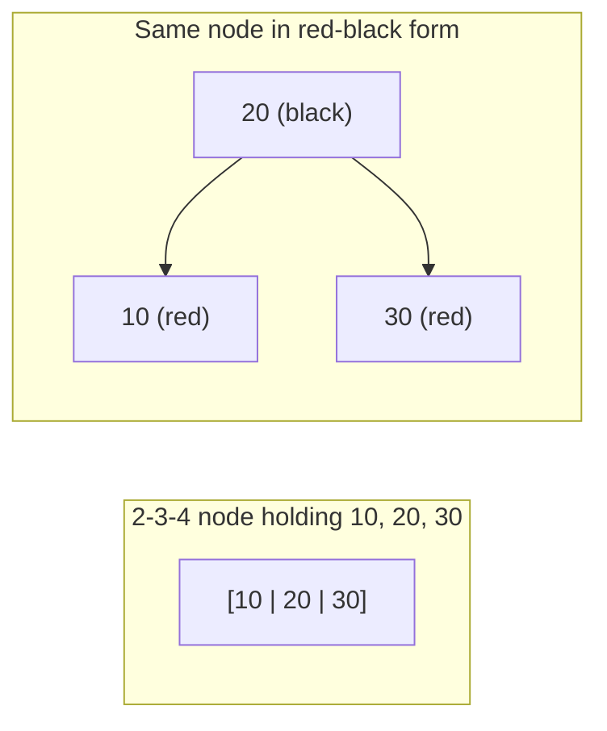

`std::map`, `std::set`, Java's `TreeMap` and `TreeSet`, the treeified buckets inside Java's `HashMap`, .NET's `SortedDictionary`, the Linux scheduler's run queue, nginx's timers and the memory allocator jemalloc all use the same structure, and it is not the AVL tree you learned first. They use a red-black tree. The reason is a trade-off that the [AVL lesson](/learn/advanced-data-structures/balanced-trees/avl-trees) demonstrated: AVL keeps the tree slightly shorter but pays for it with up to O(log n) rotations on every delete. Red-black trees accept a looser height bound in exchange for a guarantee of at most three rotations per operation and an amortised O(1) amount of restructuring.

The mechanics look intimidating because most textbooks present them as a list of cases to memorise. They become obvious once you see that a red-black tree is a 2-3-4 tree drawn with binary nodes. This lesson gives you that reading, then traces insertion and deletion case by case on drawn trees with the rules checked after each step, and finishes with what the nodes cost in libstdc++, the JVM and the Linux kernel.

## The five rules

A red-black tree is a BST in which every node carries one bit, red or black, and:

1. Every node is red or black.
2. The root is black.
3. Every leaf, meaning the null pointers, counts as black.
4. A red node has two black children. Equivalently, no two reds in a row on any path.
5. Every path from a node down to a null leaf passes through the same number of black nodes. That number is the node's **black height**.

Rules 4 and 5 do all the work. Rule 5 says the tree is perfectly balanced *if you only count black nodes*. Rule 4 says red nodes can at most double the length of any path. Together: the longest root-to-leaf path is at most twice the shortest.

## Why the height is at most 2 log₂(n + 1)

Claim: a subtree whose root has black height `bh` contains at least `2^bh − 1` internal nodes. Induction: a null leaf has `bh = 0` and `0 = 2⁰ − 1` nodes. A node with black height `bh` has children with black height `bh` (if the child is red) or `bh − 1` (if black), so each child subtree has at least `2^(bh−1) − 1` nodes, and the total is at least `2(2^(bh−1) − 1) + 1 = 2^bh − 1`.

The root's black height is at least `h/2`, because at least half the nodes on the longest path are black (rule 4). So `n ≥ 2^(h/2) − 1`, which gives `h ≤ 2 log₂(n + 1)`.

For a million keys that is a height of at most 40, versus 28 for AVL and 20 for a perfect tree. Measured rather than bounded: inserting 1 through 1,023 in sorted order gives a red-black tree of height 18 against a bound of 20 and a perfect height of 10, so sorted input, the case that matters, lands near the bound; random keys land near `log₂ n`. In the traces below, inserting 1 through 7 in order gives height 4 where the AVL tree had height 3.

## The 2-3-4 tree behind it

A 2-3-4 tree is a search tree in which every node holds 1, 2 or 3 keys (and so 2, 3 or 4 children), all leaves are at the same depth, and insertion works by adding a key to a leaf node and splitting any node that overflows to 4 keys, pushing its middle key up. Perfect balance is automatic because splits only add height at the root.

A red-black tree is a 2-3-4 tree encoded with binary nodes: a black node together with its red children is one 2-3-4 node. A black node with no red children is a 2-node; with one red child a 3-node; with two red children a 4-node.



Under this reading every rule has a meaning. Rule 5 is "all leaves at the same depth" (black nodes are the 2-3-4 nodes; reds are keys *inside* a node). Rule 4 is "a node holds at most 3 keys" (two reds in a row would put four keys in one node). And every insertion case is one of two 2-3-4 operations: **add a key to a node that has room**, or **split a 4-node**.

## Insertion: three cases

Insert the new key as a red leaf, exactly like a BST insert. Red, because adding a black node would break rule 5 on that path, while adding a red node only risks rule 4 (red parent). Then walk up fixing red-red violations. Let `z` be the red node with a red parent, `p` the parent, `g` the grandparent (black, since `p` is red) and `u` the uncle.

**Case 1: uncle is red.** In 2-3-4 terms, `g` with its two red children is a 4-node and you are adding a fourth key. Split it: colour `p` and `u` black and `g` red. `g` becomes a red key pushed into its own parent's node. Set `z = g` and continue upward, because `g`'s parent might be red. No rotation.

**Case 2: uncle is black and `z` is the "inner" grandchild** (a `p`-then-`z` path that bends: left-right or right-left). Rotate at `p` to straighten it into case 3.

**Case 3: uncle is black and `z` is the "outer" grandchild** (left-left or right-right). Rotate at `g` in the opposite direction, then swap the colours of `g` and the node that took its place. In 2-3-4 terms, `g` was a 2-node or 3-node with room; the rotation is the new key settling into it. Done; no further violations.

Cases 2 and 3 together are exactly the AVL double and single rotation shapes. The difference is that case 1 needs no rotation at all, and it is the most common case. Restructuring is at most two rotations per insert, and the recolouring walk is O(log n) worst case but O(1) amortised over a sequence of inserts (each case-1 step destroys a 4-node, and 4-nodes are only created one at a time).

## Insert traced with the rules checked

Insert 10, 20, 30, 15, 25, 5. Notation: `20B→(10R, 30R)` is a black 20 with red children; `·` is a null leaf. `bh` is the root's black height (null leaves not counted).

| Step | Insert | Lands | Parent | Uncle | Case | Rotations | Tree after | Rules 2, 4, 5 | bh | h |
|---|---|---|---|---|---|---|---|---|---|---|
| 1 | 10 | root | | | root → black | none | `10B` | ok | 1 | 1 |
| 2 | 20 | `10.right` | black | | none | none | `10B→(·, 20R)` | ok | 1 | 2 |
| 3 | 30 | `20.right` | 20 red | null (black) | 3 (outer) | left at 10 | `20B→(10R, 30R)` | ok | 1 | 2 |
| 4 | 15 | `10.right` | 10 red | 30 red | 1 (recolour) | none | `20B→(10B→(·, 15R), 30B)` | 20 went red, root re-blackened; ok | 2 | 3 |
| 5 | 25 | `30.left` | black | | none | none | `20B→(10B→(·, 15R), 30B→(25R, ·))` | ok | 2 | 3 |
| 6 | 5 | `10.left` | black | | none | none | `20B→(10B→(5R, 15R), 30B→(25R, ·))` | ok | 2 | 3 |

Step 4 is the 2-3-4 split: `[10 | 20 | 30]` was a 4-node, adding 15 overflows it, 20 moves up (as a red, into a parent that does not exist, so it becomes the black root) and the tree's black height grows from 1 to 2. In 2-3-4 terms the final tree is a 2-node `[20]` over a 4-node `[5 | 10 | 15]` and a 3-node `[25 | 30]`.

Sorted input 1 through 7 shows the cases alternating:

| Insert | Case | Rotation | Tree after | h |
|---|---|---|---|---|
| 1 | root | | `1B` | 1 |
| 2 | none | | `1B→(·, 2R)` | 2 |
| 3 | 3 at g=1 | left at 1 | `2B→(1R, 3R)` | 2 |
| 4 | 1 (u=1 red) | | `2B→(1B, 3B→(·, 4R))` | 3 |
| 5 | 3 at g=3 | left at 3 | `2B→(1B, 4B→(3R, 5R))` | 3 |
| 6 | 1 (u=3 red) | | `2B→(1B, 4R→(3B, 5B→(·, 6R)))` | 4 |
| 7 | 3 at g=5 | left at 5 | `2B→(1B, 4R→(3B, 6B→(5R, 7R)))` | 4 |

Three rotations in seven inserts, height 4, and the tree leans right: 2 is the root with a single black child on the left and a red 4 carrying five keys on the right. The AVL tree on the same input is the perfect `4→(2→(1,3), 6→(5,7))` after four rotations. Inserting 8 would trigger case 1 at 7 (recolour 5, 7 black, 6 red), then case 3 at the root (4 red under 2 with 1 black: left-rotate at 2), and 4 becomes the root: the first rotation at the top since insert 3.

```python
def insert(tree, key):
    z = Node(key, RED)
    bst_insert(tree, z)                # sets z.parent
    while z.parent and z.parent.color == RED:
        p, g = z.parent, z.parent.parent
        if p is g.left:
            u = g.right
            if u and u.color == RED:                       # case 1
                p.color = u.color = BLACK; g.color = RED; z = g
            else:
                if z is p.right:                           # case 2
                    z = p; rotate_left(tree, z); p = z.parent
                p.color = BLACK; g.color = RED             # case 3
                rotate_right(tree, g)
        else:                                               # mirror
            u = g.left
            if u and u.color == RED:
                p.color = u.color = BLACK; g.color = RED; z = g
            else:
                if z is p.left:
                    z = p; rotate_right(tree, z); p = z.parent
                p.color = BLACK; g.color = RED
                rotate_left(tree, g)
    tree.root.color = BLACK
```

The implementation uses parent pointers and a loop rather than recursion, which is how every production version is written: the fix-up needs to look at uncles and grandparents, which recursion on the way back up cannot see without returning extra state. `rotate_left(tree, x)` must also fix `x.parent`'s child pointer (or `tree.root`), which is the line most often forgotten.

There is no red-black visualiser in the catalogue, so watch the shape a plain BST takes on sorted input, which is exactly the shape the colour rules forbid, and compare with the AVL animation from the previous lesson.

```viz
{"type": "tree", "algorithm": "bst-insert", "values": [1, 2, 3, 4, 5, 6, 7],
 "title": "Unbalanced BST on sorted input",
 "caption": "Seven nodes, height 7. A red-black tree on the same input has height 4; an AVL tree has height 3."}
```

## Deletion: four cases, traced

Delete starts like BST delete: a node with two children swaps places with its in-order successor (the successor takes the deleted node's *colour*), so the node physically removed always has at most one child. Then:

- If the removed node was **red**, nothing changes: no path lost a black, no reds became adjacent. In 2-3-4 terms a key left a 3-node or 4-node that still has a key.
- If it was **black** and its one child is red, move the child up and colour it black: the path gets its black back.
- If it was black with no red child, the paths through it are now one black short. Mark the hole (the child that moved up, often a null) as **double black**, `x`, and repair using `x`'s sibling `w`. With `x` a left child (mirror everything otherwise):

| Case | Condition | Action | Then |
|---|---|---|---|
| **D1** | `w` red | colour `w` black, parent red, left-rotate at parent | re-examine with the new sibling (one of D2–D4) |
| **D2** | `w` black, both of `w`'s children black | colour `w` red, move `x` up to the parent | loop (stops if the parent is red or the root; the parent is then coloured black) |
| **D3** | `w` black, near nephew (`w.left`) red, far nephew black | colour `w.left` black and `w` red, right-rotate at `w` | falls into D4 |
| **D4** | `w` black, far nephew (`w.right`) red | `w` takes the parent's colour, parent and far nephew black, left-rotate at parent | done |

In 2-3-4 terms D2 is "merge with a sibling that has no spare key, borrowing from the parent", D3/D4 are "borrow a key from a sibling that has a spare", and D1 turns a sibling that is a red *key* inside the parent's node into a proper sibling node first. At most one D1, one D3 and one D4 can happen in a single delete, hence **three rotations maximum**; only D2 loops, and it does no rotation.

**Trace 1: D3 then D4.** Start from step 4 of the insert trace, `20B→(10B→(·, 15R), 30B)`, and delete 30.

| Step | State | Reasoning | Tree after | Rules | bh |
|---|---|---|---|---|---|
| 1 | remove 30 (black leaf, no red child) | `x` = null in `20.right`, double black; sibling `w` = 10 (black); `w`'s far nephew (10's left) is null-black, near nephew 15 is red | | rule 5 broken at 20 | |
| 2 | D3 | colour 15 black, 10 red, left-rotate at 10 | `20B→(15B→(10R, ·), ·)` with `x` still at `20.right` | | |
| 3 | D4 | `w` = 15 takes 20's colour (black), 20 and far nephew 10 black, right-rotate at 20 | `15B→(10B, 20B)` | all ok | 2 |

Two rotations, and the 2-3-4 reading is: the leaf `[30]` had no spare key, its sibling `[10 | 15]` did, so a key rotated through the parent.

**Trace 2: four deletes on the six-key tree** `20B→(10B→(5R, 15R), 30B→(25R, ·))`:

| Delete | Removed node | Case | Rotations | Tree after | Rules | bh |
|---|---|---|---|---|---|---|
| 25 | red leaf | none | 0 | `20B→(10B→(5R, 15R), 30B)` | ok | 2 |
| 30 | black leaf | D4: sibling 10 black, far nephew 5 red | right at 20 | `10B→(5B, 20B→(15R, ·))` | ok | 2 |
| 20 | black, one red child 15 | red child moves up, coloured black | 0 | `10B→(5B, 15B)` | ok | 2 |
| 5 | black leaf | D2: sibling 15 black with black children; `x` rises to the root | 0 | `10B→(·, 15R)` | ok | **1** |

The last row is the only way a red-black tree loses black height: the double black reaches the root, which absorbs it. Every path is now one black shorter, consistently.

**Trace 3: D1.** Build `20B→(10B, 30R→(25B, 35B))` (insert 20, 10, 30, 5, 15, 25, 35, 27, then delete the red leaves 27, 15 and 5) and delete 10:

| Step | Case | Action | Tree after |
|---|---|---|---|
| 1 | remove 10 (black leaf) | `x` = null in `20.left`; sibling `w` = 30 is **red** | rule 5 broken |
| 2 | D1 | 30 black, 20 red, left-rotate at 20 | `30B→(20R→(·, 25B), 35B)`, new sibling of `x` is 25 |
| 3 | D2 | 25 has black children: colour 25 red, `x` = 20 | 20 is red, loop ends |
| 4 | absorb | colour 20 black | `30B→(20B→(·, 25R), 35B)`, bh 2, all rules hold |

One rotation. Compare AVL, where a delete on a Fibonacci tree of height `h` costs `h − 2` rotations: here D2 propagates by recolouring only, and the three rotating cases can each fire at most once. That is the whole reason write-heavy ordered containers are red-black.

**Left-leaning red-black trees.** Sedgewick's LLRB variant (2008) restricts red links to left children, which removes the mirror cases and shrinks insert and delete to a few dozen lines. If you ever have to write one from scratch, write that. In an interview, nobody expects you to write red-black delete from memory. They expect you to know the invariants, derive the height bound, insert a handful of keys correctly, name the delete cases and the three-rotation bound, and explain the AVL trade-off.

## Under the hood: what a node costs

**libstdc++ `std::map`.** Every element is a separately allocated `_Rb_tree_node`: a base of colour (an `enum`, 4 bytes plus 4 of padding), parent, left and right pointers (32 bytes) followed by the `pair<const Key, T>`. A `std::map<int64_t, int64_t>` node is 48 bytes, and with the allocator's 16-byte header about 64 bytes per entry, four times the payload. The header caches the leftmost and rightmost nodes, so `begin()` and `rbegin()` are O(1), and the standard guarantees that inserting or erasing *other* elements never invalidates an iterator or a reference, which is the guarantee that rules out a B-tree (whose splits move keys between pages) for `std::map`.

**Java `TreeMap.Entry`.** Fields `key`, `value`, `left`, `right`, `parent` (4-byte compressed references) plus a `boolean color` and the 12-byte object header: 33 bytes, padded to 40, before the boxed key and value objects. A million `Long → Long` entries is about 40 MB of entries plus 32 MB of boxes. Since Java 8, `HashMap` converts a bucket whose chain exceeds 8 entries (in a table of at least 64 slots) into a red-black tree of `TreeNode`s, each 56 bytes, so a hash-flooded bucket degrades to O(log n) rather than O(n); if the keys are not `Comparable` the tie-break is by class name and identity hash, which keeps the tree valid but slow.

**Linux `struct rb_node`.** Three `unsigned long`s (24 bytes on 64-bit): `__rb_parent_color`, `rb_right`, `rb_left`. The colour lives in **bit 0 of the parent pointer**, which is free because nodes are at least 4-byte aligned. The node is *intrusive*: it is embedded in the struct it indexes (`struct sched_entity`, `struct vm_area_struct` until 6.1, `struct hrtimer`, an `epitem` for every watched epoll descriptor), and `rb_entry(node, type, member)` is `container_of`, so there is no separate allocation per entry and no key stored in the node, only in the containing struct. `rb_root_cached` keeps the leftmost node, which is how the CFS/EEVDF scheduler picks the next task in O(1) and hrtimers find the next expiry without a descent. The kernel also has *augmented* red-black trees (`rb_insert_augmented`), which maintain a per-subtree value such as the maximum interval endpoint through rotations, exactly as the AVL lesson maintained heights; the interval tree used for reverse mappings is one.

**jemalloc `rb.h`** is a macro-generated intrusive red-black tree that packs the colour into the low bit of the right-child pointer and, notably, stores no parent pointer at all: rotations are done by recursion with an explicit path array, saving 8 bytes per node in a structure that indexes every extent of memory the allocator manages.

The common thread: real implementations spend engineering on the node layout (a bit stolen from a pointer, intrusive embedding, a cached minimum) because the tree's cost at scale is memory traffic, not comparisons.

## Where they run

| System | What the red-black tree holds | Why not something else |
|---|---|---|
| C++ `std::map` / `std::set` | Any ordered key set | The standard requires iterator stability across inserts, which rules out B-trees and open-addressing hash tables |
| Java `TreeMap`, `TreeSet` | Ordered maps; also `HashMap` buckets with more than 8 collisions | Worst-case O(log n) even under HashDoS |
| Linux kernel `rb_tree` | Scheduler run queue keyed by virtual runtime or deadline, high-resolution timers, epoll's watched descriptors, and until 6.1 each process's memory regions (VMAs) | Intrusive, allocation-free, cheap deletes; the VMA use moved to the maple tree in 6.1 because the read path wanted a wide, cache-friendly B-tree-like node and RCU-safe lookups |
| nginx | Timers keyed by expiry | Need the minimum and arbitrary deletion, both O(log n) |
| jemalloc | Free extents by size and address | Intrusive, no per-node allocation inside an allocator |
| Clojure `sorted-map` | Persistent (immutable) ordered map | Path-copying a red-black tree costs O(log n) per update and the insert cases are simple to write functionally |

The pattern across the table: red-black trees win when you need an *ordered* structure with *arbitrary deletion* in memory and you cannot tolerate a bad worst case. When you only need the minimum, a [heap](/learn/data-structures/heaps/binary-heap-mechanics) is smaller and faster. When you need order and the data does not fit in cache, a [B-tree](/learn/advanced-data-structures/balanced-trees/b-trees-and-b-plus-trees) wins on memory traffic, which is why Rust's `BTreeMap` skipped red-black entirely and Go's standard library ships no ordered map at all. Whether you need order in the first place is the question in [ordered maps vs hash maps](/learn/data-structures/hashing/ordered-maps-vs-hash-maps).

## Trade-offs

| | Red-black | AVL | LLRB | In-memory B-tree | Skip list | Binary heap |
|---|---|---|---|---|---|---|
| Height for 10⁶ keys | ≤ 40 (≈ 20 random) | ≤ 28 | ≤ 40 | 4–5 | ≈ 20 expected | 20 |
| Max rotations, insert | 2 | 1 (single or double) | 2–3 | 0 (split) | 0 | 0 (sift) |
| Max rotations, delete | 3 | O(log n) | O(log n) recolour-and-rotate walk | 0 (merge) | 0 | 0 (sift) |
| Balance data per node | 1 bit | 1 byte or 2 bits | 1 bit | none | level count | none |
| Arbitrary delete by handle | O(log n) | O(log n) | O(log n) | O(log n) | O(log n) expected | O(n) unless indexed |
| Iterator / reference stability | yes | yes | yes | no | yes | no |
| Lines of code (insert + delete) | ~150 | ~80 | ~60 | ~300 | ~60 | ~40 |

## Failure modes

| Symptom | Diagnosis | Fix |
|---|---|---|
| `std::map::find` misses keys that `std::map::count` over a traversal shows are present; occasionally an infinite loop in `insert` | The comparator is not a strict weak ordering: `<=` instead of `<`, a `float` key that can be NaN, or a struct comparator that compares different fields on different paths. The tree is a BST only relative to a consistent order | Compare with `<` on a total order; reject NaN at the boundary; test the comparator's irreflexivity and transitivity in a unit test |
| A crash or silent corruption while iterating and erasing (`for (it = m.begin(); …) m.erase(it)`) | Erasing invalidates the erased iterator only, but the loop then increments a dead iterator | Use `it = m.erase(it)` (C++11) or `m.erase(it++)`; in Java use the iterator's `remove()`, or collect keys first |
| `TreeMap.get` returns null for a key that `containsKey` on a copy finds | A mutable key object was modified after insertion, so it now sorts elsewhere than where it sits (Java allows this; C++ makes `map` keys `const` to prevent it) | Immutable keys, or remove-modify-reinsert |
| p99 of an ordered lookup service is 10× the p50 with no GC pause | The tree outgrew cache: 40 levels × one DRAM miss ≈ 3–4 µs per cold lookup; `perf` shows the time in pointer loads inside `_M_lower_bound` | A B-tree-shaped container, or shard the tree so each shard's upper levels stay hot |
| JVM heap dominated by `TreeMap$Entry` and `Long` objects; old-generation GC pauses grow with map size | 40 bytes of entry plus two 16-byte boxes per mapping, tens of millions of long-lived objects to trace | A primitive-specialised sorted map (fastutil `Long2LongAVLTreeMap` / `RBTreeMap`), or an array-backed B-tree; or ask whether a sorted array suffices |
| `HashMap` operations 5× slower after an attacker-controlled key flood, but not O(n²) | Treeified buckets: keys are not `Comparable`, so the tree is ordered by class name and identity hash and every lookup walks it with full `equals` calls | Make keys `Comparable`, or fix the hash function so buckets do not exceed 8 |

## Interviewer follow-ups

**"Why is a new node inserted red rather than black?"** Model answer: a black leaf would add one black to exactly the paths through it and break rule 5 everywhere at once, which cannot be repaired locally; a red leaf breaks at most rule 4 at one place, which the three cases repair with O(1) rotations. Common wrong answer: "because red is the default" or "so the tree stays shorter".

**"What is the maximum number of rotations in a red-black delete, and why?"** Model answer: three: D1 (red sibling), D3 (near nephew red) and D4 (far nephew red) can each fire at most once, because D1 leads to a D2–D4 that terminates or to D2 which then terminates as the parent is red, and D3 always falls into D4 which terminates. Only D2 loops, and it only recolours. Common wrong answer: "O(log n), like AVL", which confuses the recolouring walk with rotations.

**"How does Java's `HashMap` use a red-black tree, and when does it hurt?"** Model answer: a bucket chain longer than 8 becomes a tree ordered by hash, then by `compareTo` for `Comparable` keys, then by class name and identity hash; it caps flooding at O(log n). It hurts when keys are not `Comparable`, because the tie-break makes every lookup a full walk with `equals`, and the `TreeNode`s are 56 bytes each. Common wrong answer: "HashMap becomes a TreeMap when it is large".

**"Support `rank(key)` and `select(k)` in O(log n)."** Model answer: augment each node with its subtree size, update sizes on the way up and in the two nodes each rotation touches, exactly as the Linux augmented rbtree does; `select` descends comparing `k` with `size(left) + 1`. Common wrong answer: an in-order traversal, which is O(k).

**"You need a container with O(log n) find-min, insert and delete-by-handle. Heap or red-black tree?"** Model answer: a heap deletes only the top in O(log n); arbitrary deletion needs an index from handle to heap position, at which point you have an indexed heap with the same asymptotics but less memory. A red-black tree does all three natively and also gives predecessor/successor and range queries; the kernel's hrtimers and nginx's timers chose it, with a cached leftmost node so find-min is O(1). Common wrong answer: "a heap, because it is O(1) for the minimum", forgetting the deletion requirement.

## What mid-level engineers get wrong

- **Memorising the cases without the 2-3-4 model**, then being unable to reconstruct them in an interview. The model gives you insert in one sentence: add to the node or split it.
- **Claiming red-black delete is O(log n) rotations.** It is three; the O(log n) part is recolouring.
- **Writing a comparator with `<=`.** `std::map` and `TreeMap` both silently corrupt with a non-strict order; the bug shows up as missing keys weeks later.
- **Erasing inside a range-for loop** in C++ and reading the resulting crash as a library bug.
- **Choosing `TreeMap` for a lookup table that never iterates in order.** A `HashMap` is 3–10× faster and smaller; order costs O(log n) per operation and 40 bytes per entry.
- **Assuming the standard library's tree is fine at 100 million entries.** It works, at 4–6 GB and several microseconds per cold lookup; a B-tree or sorted block structure is a fraction of both.

## Exercises

```exercise
id: rb-insert-colours
title: Red-black insert with colours
prompt: |
  Implement `rb_level_order(values)`: insert the distinct integers in
  `values`, in order, into an initially empty red-black tree using the
  standard insert (new node red, then fix-up with the uncle-red recolour case
  and the two rotation cases), and return the final tree in level order as
  a list of `[key, colour]` pairs where colour is `"R"` or `"B"`.

  Use parent pointers. Remember to recolour the root black at the end of
  every insert.
languages: [python, javascript]
entry: rb_level_order
starter:
  python: |
    class Node:
        def __init__(self, key):
            self.key = key
            self.color = "R"
            self.left = self.right = self.parent = None

    class RBTree:
        def __init__(self):
            self.root = None

        def rotate_left(self, x):
            # TODO: standard left rotation that also fixes parent pointers
            pass

        def rotate_right(self, y):
            # TODO
            pass

        def insert(self, key):
            # TODO: BST insert as a red node, then fix-up
            pass

    def rb_level_order(values):
        t = RBTree()
        for v in values:
            t.insert(v)
        # TODO: BFS from t.root, appending [node.key, node.color]
        return []
  javascript: |
    class Node {
      constructor(key) { this.key = key; this.color = "R"; this.left = this.right = this.parent = null; }
    }
    class RBTree {
      constructor() { this.root = null; }
      rotateLeft(x) { /* TODO */ }
      rotateRight(y) { /* TODO */ }
      insert(key) { /* TODO: BST insert as red, then fix-up */ }
    }
    function rb_level_order(values) {
      const t = new RBTree();
      for (const v of values) t.insert(v);
      // TODO: BFS from t.root, pushing [node.key, node.color]
      return [];
    }
tests:
  - args: [[10, 20, 30]]
    expected: [[20, "B"], [10, "R"], [30, "R"]]
    label: outer case, one rotation
  - args: [[30, 10, 20]]
    expected: [[20, "B"], [10, "R"], [30, "R"]]
    label: inner case, two rotations
  - args: [[10, 20, 30, 15, 25, 5]]
    expected: [[20, "B"], [10, "B"], [30, "B"], [5, "R"], [15, "R"], [25, "R"]]
    label: the worked example
  - args: [[1, 2, 3, 4, 5, 6, 7]]
    expected: [[2, "B"], [1, "B"], [4, "R"], [3, "B"], [6, "B"], [5, "R"], [7, "R"]]
    label: sorted input, height 4
  - args: [[]]
    expected: []
    label: empty
  - args: [[50]]
    expected: [[50, "B"]]
    hidden: true
    label: single node is black
  - args: [[10, 5, 15, 3, 7, 12, 20, 1]]
    expected: [[10, "B"], [5, "R"], [15, "B"], [3, "B"], [7, "B"], [12, "R"], [20, "R"], [1, "R"]]
    hidden: true
    label: recolour that stops below the root
hints:
  - "In rotate_left(x): y = x.right; x.right = y.left; fix y.left.parent; y.parent = x.parent; update the parent's child pointer (or the root); y.left = x; x.parent = y."
  - "Fix-up loop: while z.parent is red, find the uncle. Red uncle: recolour parent, uncle, grandparent and move z to the grandparent. Black uncle: rotate at the parent if z is an inner grandchild, then rotate at the grandparent and swap the colours of the parent and grandparent."
  - "Mirror every step when the parent is a right child."
```

```exercise
id: rb-validate
title: Validate the red-black rules
prompt: |
  Implement `rb_valid(nodes)`: `nodes` is a binary tree in level order with
  `null` for missing children (LeetCode convention), where each present node
  is `[key, colour]` and colour is `"R"` or `"B"`. Return `true` if the tree
  is a valid red-black tree: it is a BST with distinct keys, the root is
  black, no red node has a red child, and every root-to-null path has the
  same number of black nodes. An empty list is valid.
languages: [python, javascript]
entry: rb_valid
starter:
  python: |
    def rb_valid(nodes):
        # 1. rebuild the tree from level order (children of the i-th present
        #    node are the next two entries in the queue order)
        # 2. check root colour, then recursively return the black height of
        #    each subtree (or a failure marker) while checking BST bounds
        #    and the red-red rule
        return True
  javascript: |
    function rb_valid(nodes) {
      // 1. rebuild the tree from level order (children of the i-th present
      //    node are the next two entries in the queue order)
      // 2. check root colour, then recursively return the black height of
      //    each subtree (or a failure marker) while checking BST bounds
      //    and the red-red rule
      return true;
    }
tests:
  - args: [[[20, "B"], [10, "R"], [30, "R"]]]
    expected: true
    label: a 4-node
  - args: [[[20, "R"], [10, "B"], [30, "B"]]]
    expected: false
    label: red root
  - args: [[[20, "B"], [10, "R"], [30, "B"], [5, "R"]]]
    expected: false
    label: red child of a red node
  - args: [[[20, "B"], [10, "B"], [30, "B"], [5, "R"], null, null, [40, "B"]]]
    expected: false
    label: black heights differ
  - args: [[[20, "B"], [30, "R"], [10, "R"]]]
    expected: false
    label: colours fine, BST order broken
  - args: [[]]
    expected: true
    label: empty tree
  - args: [[[2, "B"], [1, "B"], [4, "R"], null, null, [3, "B"], [6, "B"], null, null, [5, "R"], [7, "R"]]]
    expected: true
    hidden: true
    label: the sorted 1..7 tree from the lesson
  - args: [[[10, "B"], [5, "B"], [15, "B"], null, null, null, [20, "B"]]]
    expected: false
    hidden: true
    label: a black leaf hanging one level lower
  - args: [[[10, "B"], [5, "B"], [15, "B"], null, null, null, [20, "R"]]]
    expected: true
    hidden: true
    label: the same shape with the extra leaf red is fine
hints:
  - "Rebuild with a queue: pop a node, assign the next two list entries as its children (skipping nulls into the queue), exactly like LeetCode's tree deserialiser."
  - "Return the black height from the recursion (null counts as 1) and a sentinel such as -1 for failure; a node is valid only if both children return equal, non-failed heights."
  - "Pass `(lo, hi)` bounds down the recursion for the BST check."
```

## Senior signals

- You explain red-black trees as **2-3-4 trees in binary clothing**, and use that to say why insertion needs only "add to a node" or "split a node" rather than reciting cases.
- You derive the `2 log₂(n + 1)` height bound from black height and can compare it to AVL's `1.44 log₂ n` with a concrete number, and you know sorted input lands near the bound while random input lands near `log₂ n`.
- You know the trade: AVL is shorter, red-black rotates less, and the difference matters for delete (O(log n) rotations versus at most 3), and you can name the delete case that loops (D2) and say that it only recolours.
- You can quote a node's cost in libstdc++ (32-byte base plus the pair), the JVM (40-byte `Entry`) and the kernel (24 bytes, colour in bit 0 of the parent pointer, intrusive), and explain why the kernel caches the leftmost node.
- You can name where red-black trees run (`std::map`, `TreeMap`, kernel scheduler and timers, jemalloc) and why C++ could not use a B-tree for `std::map` (iterator stability).
- You know that Linux moved VMAs off the rbtree to a B-tree-like maple tree for cache behaviour, and you use that as evidence that in-memory B-trees beat binary trees past cache size.
- You choose a heap when only the minimum is needed, a hash map when order is not, and a B-tree when the structure is large, before you reach for any balanced BST.

## Check yourself

```quiz
- q: >-
    Which single change to a valid red-black tree is guaranteed to keep it valid?
  options: ["Colouring a black root node red", "Colouring a red leaf node black", "Deleting a childless red node", "Inserting a key as a black leaf"]
  answer: 2
  explanation: >-
    Removing a red node with no children changes no path's black count and cannot create two adjacent reds. Colouring a red leaf black adds a black to some paths but not others (rule 5); a red root breaks rule 2; a new black leaf adds a black to one path only.
- q: >-
    During insertion, z is red, its parent is red and its uncle is red. What happens?
  options: ["Recolour p and u black and g red, then continue from g", "Recolour z black and stop, since the red-red pair is gone", "Rotate at the parent, then rotate at the grandparent", "Rotate at the grandparent, then swap the colours of g and p"]
  answer: 0
  explanation: >-
    A red uncle means the grandparent's 2-3-4 node is a full 4-node being split: the middle key (grandparent) moves up as a red, which may in turn violate rule 4 with its own parent, so the loop continues. Rotations are for the black-uncle cases. Recolouring z black would add a black to one path and break rule 5.
- q: >-
    A red-black tree holds 2^20 − 1 keys. What is the largest height it can have?
  options: ["40, which is 2 log₂(n + 1)", "About 29, which is 1.44 log₂ n", "20, as in a perfect tree", "2^20 − 1, on sorted input"]
  answer: 0
  explanation: >-
    The bound is 2 log₂(n + 1) = 2 × 20 = 40. The AVL bound would be about 29 and a perfect tree is 20. The million-node chain is impossible because two reds in a row are forbidden.
- q: >-
    Deleting a black leaf leaves a double-black hole whose sibling is black with two black children. What does the fix-up do?
  options: ["Colour the sibling red and move the problem up to the parent", "Colour the hole red, which restores the black count on its path", "Colour the sibling black and the parent red, then rotate at the sibling", "Rotate at the parent and stop, since the sibling has spare keys"]
  answer: 0
  explanation: >-
    That is case D2: the sibling's 2-3-4 node has no spare key to lend, so the parent's node loses a black on both sides (sibling becomes red) and the double black moves to the parent, where the loop continues or stops if the parent is red or the root. Rotations belong to D1, D3 and D4, which need a red sibling or a red nephew. Colouring the hole itself red is meaningless for a null and breaks rule 4 for a node.
- q: >-
    Why does C++ implement std::map as a red-black tree rather than a B-tree, which is faster on large data?
  options: ["B-trees cannot iterate keys in sorted order across nodes", "B-trees were not yet known when the standard was written", "The standard requires iterators to survive other inserts", "Red-black trees use less memory per key than B-trees do"]
  answer: 2
  explanation: >-
    The standard guarantees that inserting or erasing other elements does not invalidate iterators or references, which requires one node per element. B-tree nodes move keys around within pages on insert and split, which would invalidate pointers to elements. B-trees iterate in order perfectly well; Rust's BTreeMap makes no stability guarantee and so could choose the faster structure.
- q: >-
    You need a container that returns the task with the smallest deadline and lets you cancel arbitrary tasks by handle, with hard latency bounds. Which is the best fit?
  options: ["A binary heap keyed by deadline", "A red-black tree keyed by deadline", "A sorted array of tasks by deadline", "A hash map from deadline to task"]
  answer: 1
  explanation: >-
    A heap gives the minimum but arbitrary cancellation is O(n) unless you add an index. A red-black tree gives O(log n) worst-case for minimum, insert and arbitrary delete, which is why nginx and the Linux hrtimer subsystem use one, with a cached leftmost node so the minimum is O(1). A sorted array has O(n) inserts; a hash map has no order.
```
