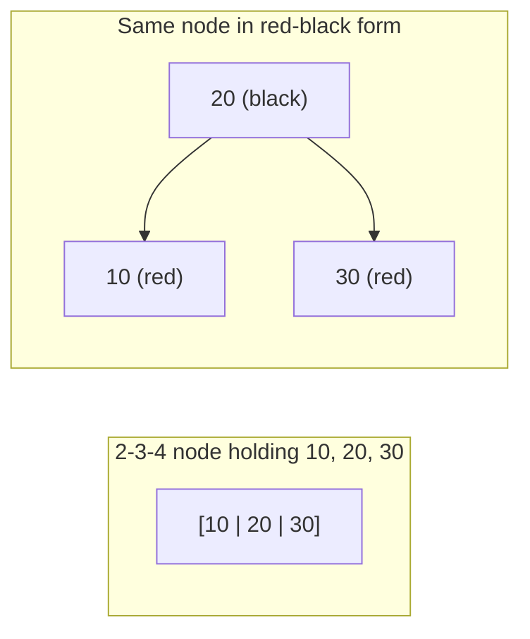

`std::map`, `std::set`, Java's `TreeMap` and `TreeSet`, the treeified buckets inside Java's `HashMap`, .NET's `SortedDictionary`, the Linux scheduler's run queue, nginx's timer wheel and the memory allocator jemalloc all use the same structure, and it is not the AVL tree you learned first. They use a red-black tree. The reason is a trade-off that the [AVL lesson](/learn/advanced-data-structures/balanced-trees/avl-trees) hinted at: AVL keeps the tree slightly shorter but pays for it with up to O(log n) rotations on every delete. Red-black trees accept a looser height bound in exchange for a guarantee of at most three rotations per operation and an amortised O(1) amount of restructuring.

The mechanics look intimidating because most textbooks present them as a list of cases to memorise. They become obvious once you see that a red-black tree is a 2-3-4 tree drawn with binary nodes.

## The five rules

A red-black tree is a BST in which every node carries one bit, red or black, and:

1. Every node is red or black.
2. The root is black.
3. Every leaf, meaning the null pointers, counts as black.
4. A red node has two black children. Equivalently, no two reds in a row on any path.
5. Every path from a node down to a null leaf passes through the same number of black nodes. That number is the node's **black height**.

Rules 4 and 5 do all the work. Rule 5 says the tree is perfectly balanced *if you only count black nodes*. Rule 4 says red nodes can at most double the length of any path. Together: the longest root-to-leaf path is at most twice the shortest.

## Why the height is at most 2 log₂(n + 1)

Claim: a subtree whose root has black height `bh` contains at least `2^bh − 1` internal nodes. Induction: a null leaf has `bh = 0` and `0 = 2⁰ − 1` nodes. A node with black height `bh` has children with black height `bh` (if the child is red) or `bh − 1` (if black), so each child subtree has at least `2^(bh−1) − 1` nodes, and the total is at least `2(2^(bh−1) − 1) + 1 = 2^bh − 1`.

The root's black height is at least `h/2`, because at least half the nodes on the longest path are black (rule 4). So `n ≥ 2^(h/2) − 1`, which gives `h ≤ 2 log₂(n + 1)`.

For a million keys that is a height of at most 40, versus 28 for AVL and 20 for a perfect tree. In practice a red-black tree built from random keys has height close to `log₂ n`, and the sorted-input case, which is the one that matters, lands around `2 log₂ n`. You will see it in the exercise: inserting 1 through 7 in order gives a red-black tree of height 4 where the AVL tree had height 3.

## The 2-3-4 tree behind it

A 2-3-4 tree is a search tree in which every node holds 1, 2 or 3 keys (and so 2, 3 or 4 children), all leaves are at the same depth, and insertion works by adding a key to a leaf node and splitting any node that overflows to 4 keys, pushing its middle key up. Perfect balance is automatic because splits only add height at the root.

A red-black tree is a 2-3-4 tree encoded with binary nodes: a black node together with its red children is one 2-3-4 node. A black node with no red children is a 2-node; with one red child a 3-node; with two red children a 4-node.



Under this reading every rule has a meaning. Rule 5 is "all leaves at the same depth" (black nodes are the 2-3-4 nodes; reds are keys *inside* a node). Rule 4 is "a node holds at most 3 keys" (two reds in a row would put four keys in one node). And every insertion case is one of two 2-3-4 operations: **add a key to a node that has room**, or **split a 4-node**.

## Insertion

Insert the new key as a red leaf, exactly like a BST insert. Red, because adding a black node would break rule 5 on that path, while adding a red node only risks rule 4 (red parent). Then walk up fixing red-red violations. Let `z` be the red node with a red parent, `p` the parent, `g` the grandparent (black, since `p` is red) and `u` the uncle.

**Case 1: uncle is red.** In 2-3-4 terms, `g` with its two red children is a 4-node and you are adding a fourth key. Split it: colour `p` and `u` black and `g` red. `g` becomes a red key pushed into its own parent's node. Set `z = g` and continue upward, because `g`'s parent might be red. No rotation.

**Case 2: uncle is black and `z` is the "inner" grandchild** (a `p`-then-`z` path that bends: left-right or right-left). Rotate at `p` to straighten it into case 3.

**Case 3: uncle is black and `z` is the "outer" grandchild** (left-left or right-right). Rotate at `g` in the opposite direction, then swap the colours of `g` and the node that took its place. In 2-3-4 terms, `g` was a 2-node or 3-node with room; the rotation is just the new key settling into it. Done; no further violations.

Cases 2 and 3 together are exactly the AVL double and single rotation shapes. The difference is that case 1 needs no rotation at all, and it is by far the most common case. Restructuring is at most two rotations per insert, and the recolouring walk is O(log n) worst case but O(1) amortised over a sequence of inserts.

Trace 10, 20, 30, 15, 25, 5 by hand:

- **10**: root, black.
- **20**: red, right of 10. No violation.
- **30**: red, right of 20. Parent red, uncle (10's left null) black, outer grandchild: case 3. Left-rotate at 10, swap colours. Tree: `20B → (10R, 30R)`.
- **15**: red, right of 10. Parent 10 red, uncle 30 red: case 1. Recolour 10 and 30 black, 20 red; 20 is the root so it goes back to black. Tree: `20B → (10B → (·, 15R), 30B)`.
- **25**: red, left of 30. Parent black, nothing to fix.
- **5**: red, left of 10. Parent black, nothing to fix.

Final tree: `20B → (10B → (5R, 15R), 30B → (25R, ·))`. In 2-3-4 terms the root is a 2-node holding 20, its left child is a 4-node `[5 | 10 | 15]` and its right child a 3-node `[25 | 30]`.

```python
def insert(tree, key):
    z = Node(key, RED)
    bst_insert(tree, z)                # sets z.parent
    while z.parent and z.parent.color == RED:
        p, g = z.parent, z.parent.parent
        if p is g.left:
            u = g.right
            if u and u.color == RED:                       # case 1
                p.color = u.color = BLACK; g.color = RED; z = g
            else:
                if z is p.right:                           # case 2
                    z = p; rotate_left(tree, z); p = z.parent
                p.color = BLACK; g.color = RED             # case 3
                rotate_right(tree, g)
        else:                                               # mirror
            u = g.left
            if u and u.color == RED:
                p.color = u.color = BLACK; g.color = RED; z = g
            else:
                if z is p.left:
                    z = p; rotate_right(tree, z); p = z.parent
                p.color = BLACK; g.color = RED
                rotate_left(tree, g)
    tree.root.color = BLACK
```

The implementation uses parent pointers and a loop rather than recursion, which is how every production version is written: the fix-up needs to look at uncles and grandparents, which recursion on the way back up cannot see without returning extra state.

There is no red-black visualiser in the catalogue, so watch the shape a plain BST takes on sorted input, which is exactly the shape the colour rules forbid, and compare with the AVL animation from the previous lesson.

```viz
{"type": "tree", "algorithm": "bst-insert", "values": [1, 2, 3, 4, 5, 6, 7],
 "title": "Unbalanced BST on sorted input",
 "caption": "Seven nodes, height 7. A red-black tree on the same input has height 4; an AVL tree has height 3."}
```

## Deletion, and why you should not memorise it

Deleting a black node removes one black from every path through it, breaking rule 5. The textbook fix introduces a "double black" token that must be absorbed by recolouring a red sibling or nephew, or pushed upward, across four cases and their mirrors. It is famously the longest piece of code in CLRS.

What matters for a senior engineer:

- Delete is O(log n) with **at most three rotations**. Compare AVL's O(log n) rotations. This is the reason write-heavy ordered containers are red-black.
- Deleting a *red* node is free: it cannot break any rule. The 2-3-4 reading explains it: removing a red is removing a key from a 3-node or 4-node that still has a key left.
- Sedgewick's **left-leaning red-black tree** (LLRB) restricts red links to the left, which removes the mirror cases and shrinks insert and delete to a few dozen lines. If you ever have to write one from scratch, write that.

In an interview, nobody expects you to write red-black delete. They expect you to know the invariants, derive the height bound, insert a handful of keys correctly, and explain the AVL trade-off.

## Where they run

| System | What the red-black tree holds | Why not something else |
|---|---|---|
| C++ `std::map` / `std::set` | Any ordered key set | The standard requires iterator stability across inserts, which rules out B-trees and open-addressing hash tables |
| Java `TreeMap`, `TreeSet` | Ordered maps; also `HashMap` buckets with more than 8 collisions | Worst-case O(log n) even under HashDoS |
| Linux kernel `rb_tree` | CFS scheduler's runnable tasks keyed by virtual runtime, high-resolution timers, epoll's watched descriptors, and for years the process's memory regions (VMAs) | Intrusive, allocation-free, cheap deletes; the VMA use was replaced by the maple tree in 6.1 because the read path wanted a wide, cache-friendly B-tree-like node |
| nginx | Timers keyed by expiry | Need the minimum and arbitrary deletion, both O(log n) |
| Clojure `sorted-map` | Persistent (immutable) ordered map | Path-copying a red-black tree costs O(log n) per update and is simple to implement functionally |

The pattern across the table: red-black trees win when you need an *ordered* structure with *arbitrary deletion* in memory and you cannot tolerate a bad worst case. When you only need the minimum, a [heap](/learn/data-structures/heaps/binary-heap-mechanics) is smaller and faster. When you need order and the data does not fit in cache, a [B-tree](/learn/advanced-data-structures/balanced-trees/b-trees-and-b-plus-trees) wins on memory traffic, which is why Rust's `BTreeMap` skipped red-black entirely and Go's standard library ships no ordered map at all.

## Exercise

```exercise
id: rb-insert-colours
title: Red-black insert with colours
prompt: |
  Implement `rb_level_order(values)`: insert the distinct integers in
  `values`, in order, into an initially empty red-black tree using the
  standard insert (new node red, then fix-up with the uncle-red recolour case
  and the two rotation cases), and return the final tree in level order as
  a list of `[key, colour]` pairs where colour is `"R"` or `"B"`.

  Use parent pointers. Remember to recolour the root black at the end of
  every insert.
languages: [python, javascript]
entry: rb_level_order
starter:
  python: |
    class Node:
        def __init__(self, key):
            self.key = key
            self.color = "R"
            self.left = self.right = self.parent = None

    class RBTree:
        def __init__(self):
            self.root = None

        def rotate_left(self, x):
            # TODO: standard left rotation that also fixes parent pointers
            pass

        def rotate_right(self, y):
            # TODO
            pass

        def insert(self, key):
            # TODO: BST insert as a red node, then fix-up
            pass

    def rb_level_order(values):
        t = RBTree()
        for v in values:
            t.insert(v)
        # TODO: BFS from t.root, appending [node.key, node.color]
        return []
  javascript: |
    class Node {
      constructor(key) { this.key = key; this.color = "R"; this.left = this.right = this.parent = null; }
    }
    class RBTree {
      constructor() { this.root = null; }
      rotateLeft(x) { /* TODO */ }
      rotateRight(y) { /* TODO */ }
      insert(key) { /* TODO: BST insert as red, then fix-up */ }
    }
    function rb_level_order(values) {
      const t = new RBTree();
      for (const v of values) t.insert(v);
      // TODO: BFS from t.root, pushing [node.key, node.color]
      return [];
    }
tests:
  - args: [[10, 20, 30]]
    expected: [[20, "B"], [10, "R"], [30, "R"]]
    label: outer case, one rotation
  - args: [[30, 10, 20]]
    expected: [[20, "B"], [10, "R"], [30, "R"]]
    label: inner case, two rotations
  - args: [[10, 20, 30, 15, 25, 5]]
    expected: [[20, "B"], [10, "B"], [30, "B"], [5, "R"], [15, "R"], [25, "R"]]
    label: the worked example
  - args: [[1, 2, 3, 4, 5, 6, 7]]
    expected: [[2, "B"], [1, "B"], [4, "R"], [3, "B"], [6, "B"], [5, "R"], [7, "R"]]
    label: sorted input, height 4
  - args: [[]]
    expected: []
    label: empty
  - args: [[50]]
    expected: [[50, "B"]]
    hidden: true
    label: single node is black
  - args: [[10, 5, 15, 3, 7, 12, 20, 1]]
    expected: [[10, "B"], [5, "R"], [15, "B"], [3, "B"], [7, "B"], [12, "R"], [20, "R"], [1, "R"]]
    hidden: true
    label: recolour that stops below the root
hints:
  - "In rotate_left(x): y = x.right; x.right = y.left; fix y.left.parent; y.parent = x.parent; update the parent's child pointer (or the root); y.left = x; x.parent = y."
  - "Fix-up loop: while z.parent is red, find the uncle. Red uncle: recolour parent, uncle, grandparent and move z to the grandparent. Black uncle: rotate at the parent if z is an inner grandchild, then rotate at the grandparent and swap the colours of the parent and grandparent."
  - "Mirror every step when the parent is a right child."
```

## Senior signals

- You explain red-black trees as **2-3-4 trees in binary clothing**, and use that to say why insertion needs only "add to a node" or "split a node" rather than reciting cases.
- You derive the `2 log₂(n + 1)` height bound from black height and can compare it to AVL's `1.44 log₂ n` with a concrete number.
- You know the trade: AVL is shorter, red-black rotates less, and the difference matters for delete (O(log n) rotations versus at most 3).
- You can name where red-black trees run (`std::map`, `TreeMap`, kernel scheduler and timers) and why C++ could not use a B-tree for `std::map` (iterator stability).
- You know that Linux moved VMAs off the rbtree to a B-tree-like maple tree for cache behaviour, and you use that as evidence that in-memory B-trees beat binary trees past cache size.
- You choose a heap when only the minimum is needed, a hash map when order is not, and a B-tree when the structure is large, before you reach for any balanced BST.

## Check yourself

```quiz
- q: >-
    Which single change to a valid red-black tree is guaranteed to keep it valid?
  options: ["Colouring a red leaf node black", "Colouring a black root node red", "Deleting a childless red node", "Inserting a key as a black leaf"]
  answer: 2
  explanation: >-
    Removing a red node with no children changes no path's black count and cannot create two adjacent reds. Colouring a red leaf black adds a black to some paths but not others (rule 5); a red root breaks rule 2; a new black leaf adds a black to one path only.
- q: >-
    During insertion, z is red, its parent is red and its uncle is red. What happens?
  options: ["Rotate at the grandparent, then swap the colours of g and p", "Recolour p and u black and g red, then continue from g", "Rotate at the parent, then rotate at the grandparent", "Recolour z black and stop, since the red-red pair is gone"]
  answer: 1
  explanation: >-
    A red uncle means the grandparent's 2-3-4 node is a full 4-node being split: the middle key (grandparent) moves up as a red, which may in turn violate rule 4 with its own parent, so the loop continues. Rotations are for the black-uncle cases. Recolouring z black would add a black to one path and break rule 5.
- q: >-
    A red-black tree holds 2^20 − 1 keys. What is the largest height it can have?
  options: ["40, which is 2 log₂(n + 1)", "2^20 − 1, on sorted input", "20, as in a perfect tree", "About 29, which is 1.44 log₂ n"]
  answer: 0
  explanation: >-
    The bound is 2 log₂(n + 1) = 2 × 20 = 40. The AVL bound would be about 29 and a perfect tree is 20. The million-node chain is impossible because two reds in a row are forbidden.
- q: >-
    Why does C++ implement std::map as a red-black tree rather than a B-tree, which is faster on large data?
  options: ["B-trees cannot iterate keys in sorted order across nodes", "The standard requires iterators to survive other inserts", "B-trees were not yet known when the standard was written", "Red-black trees use less memory per key than B-trees do"]
  answer: 1
  explanation: >-
    The standard guarantees that inserting or erasing other elements does not invalidate iterators or references, which requires one node per element. B-tree nodes move keys around within pages on insert and split, which would invalidate pointers to elements. B-trees iterate in order perfectly well; Rust's BTreeMap makes no stability guarantee and so could choose the faster structure.
- q: >-
    You need a container that returns the task with the smallest deadline and lets you cancel arbitrary tasks by handle, with hard latency bounds. Which is the best fit?
  options: ["A binary heap keyed by deadline", "A sorted array of tasks by deadline", "A hash map from deadline to task", "A red-black tree keyed by deadline"]
  answer: 3
  explanation: >-
    A heap gives the minimum but arbitrary cancellation is O(n) unless you add an index. A red-black tree gives O(log n) worst-case for minimum, insert and arbitrary delete, which is why nginx and the Linux hrtimer subsystem use one. A sorted array has O(n) inserts; a hash map has no order.
```
