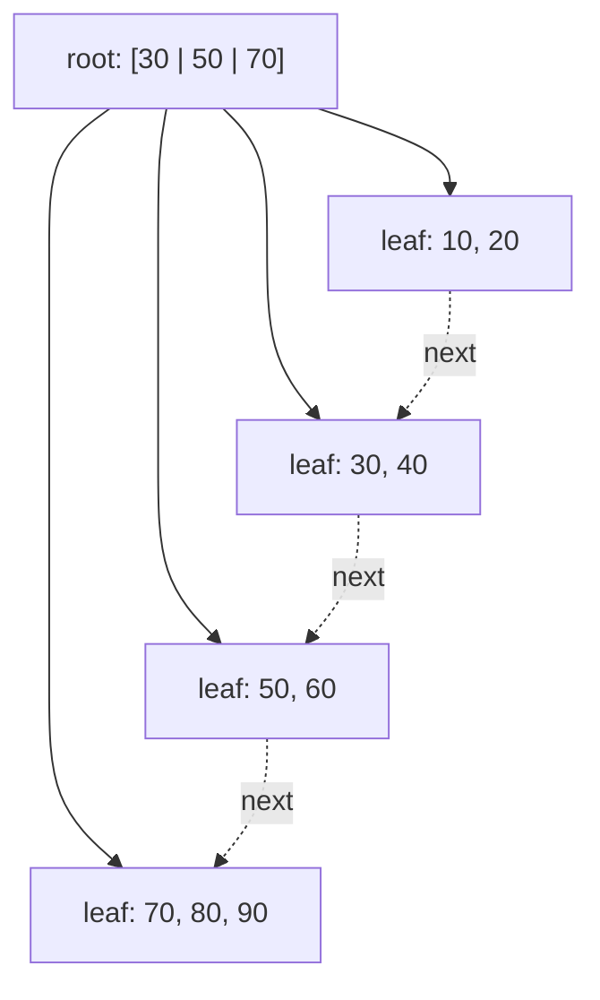

A billion-row table has an index on `user_id`. A lookup in a balanced binary tree over a billion keys touches about 30 nodes. If each node is a separate 8 KB page on disk, that is 30 page reads, and even on an NVMe drive at roughly 100 µs each, 3 ms per lookup, on a machine that needs to do 50,000 of them per second. The binary tree is the wrong shape for anything that lives on disk, and it is the wrong shape for anything that lives in RAM but not in cache, for the same reason: each level costs one slow memory access and yields only one bit of information.

The fix is to make every node as wide as one unit of slow-memory transfer. A node that holds 500 keys yields 9 bits per access, and a billion keys need 4 levels instead of 30. That structure is the B-tree, and its variant the B+ tree is the index structure in Postgres, MySQL InnoDB, SQLite, Oracle, SQL Server, MongoDB's WiredTiger, and most filesystems. When a database's documentation says "B-tree index", it means B+ tree.

## The shape

A B-tree of **order** `m` (some texts use minimum degree `t`, where `m = 2t`) is a search tree in which:

- every node holds between `⌈m/2⌉ − 1` and `m − 1` sorted keys, except the root which may hold as few as one;
- a node with `k` keys has `k + 1` children, and child `i` holds keys strictly between key `i−1` and key `i`;
- all leaves are at the same depth.

The last rule is the balance guarantee, and it is *free*: the tree only grows in height when the root splits, and a root split adds one level to every path at once.

A **B+ tree** adds two changes that matter for databases:

1. Internal nodes hold only keys and child pointers; the actual records (or pointers to them) live only in the leaves. Internal nodes are therefore denser, so fan-out is higher and the tree is shorter.
2. Leaves are linked into a sorted list. A range scan finds the first leaf by descending once and then walks sideways, never going back up.



Lookup: binary search within the root's keys to pick a child, descend, repeat, and at the leaf binary search for the key. Cost is `O(log_f n)` page reads and `O(log₂ f)` comparisons per page, for fan-out `f`.

## The height arithmetic that justifies everything

Take Postgres. A page is 8 KB. An index entry on an 8-byte integer key is the key plus a 6-byte tuple pointer plus a small header, roughly 16 to 20 bytes, so a leaf page holds on the order of 400 entries and an internal page, which stores a key plus a 4-byte child page number, a few hundred more. Use `f = 400` as a round number.

| Levels | Keys reachable | What fits |
|---|---|---|
| 1 (root only) | 400 | a lookup table |
| 2 | 160,000 | a small table |
| 3 | 64 million | most production tables |
| 4 | 25 billion | anything you will index |

Now the part that turns "4 page reads" into "1 page read": the top levels are tiny. A 4-level tree has 1 root page and about 400 pages on the second level, about 3 MB in total, and a few hundred MB on the third. The database's buffer pool keeps those hot permanently. In steady state, a point lookup on a billion-row index costs one disk read, for the leaf, and everything else is memory. This is why indexed lookups feel constant-time in practice and why a database with a buffer pool that cannot hold the internal levels falls off a cliff.

Compare with the AVL tree: 30 levels, no natural way to keep the "top" hot because there is no wide top, and a pointer dereference per level.

## Insertion and splits

Insert descends to the correct leaf and inserts the key in sorted position. If the leaf now holds `m` keys (one too many), it **splits**: the keys are divided between the old leaf and a new sibling, and a separator key is inserted into the parent. In a B+ tree the separator is a *copy* of the new sibling's first key (the leaf keeps its own copy, because leaves hold all the data); in a classic B-tree the middle key *moves* up. If the parent overflows it splits too, and if the root splits, a new root is created with one key and the tree gets one level taller.

Trace it with at most 3 keys per node, inserting 10, 20, … 100 in order. A leaf that reaches 4 keys splits into 2 and 2 and copies the new right leaf's first key upward.

- 10, 20, 30 → one leaf `[10 20 30]`, height 1.
- 40 → leaf overflows → `[10 20] [30 40]`, root `[30]`, height 2.
- 50 → `[30 40 50]`. 60 → split → leaves `[10 20] [30 40] [50 60]`, root `[30 50]`.
- 70, 80 → split → root `[30 50 70]`, four leaves.
- 90, 100 → leaf `[70 80 90 100]` splits and pushes 90 into the root, which now holds `[30 50 70 90]`, four keys, one too many. The root splits: `[30 50]` on the left, `[90]` on the right, and 70 becomes the new root. Height 3.

Notice the pattern with sorted input: every split happens on the rightmost leaf, and the left half of each split is left half-empty forever. Postgres and InnoDB detect this "rightmost insert" case and split unevenly (leaving the left page full and the new right page nearly empty) so that an ascending key produces densely packed pages. Random keys, such as UUIDv4 primary keys, split all over the tree and leave pages about 70% full on average, with the write cost to match. That is the mechanism behind the standard advice to prefer time-ordered identifiers (auto-increment, UUIDv7, ULID) for clustered keys.

```viz
{"type": "system", "scenario": "b-tree-index",
 "title": "B+ tree index: descent, split, and range scan",
 "caption": "Each node is one page. A lookup descends by binary search within each page; an insert into a full leaf splits it and pushes a separator up; a range scan walks the linked leaves."}
```

Deletion is the mirror: remove from the leaf, and if the leaf drops below half full, borrow a key from a sibling or merge with it, pulling a separator down from the parent. Most databases do not do this eagerly. Postgres leaves underfull pages in place and only reclaims a page once it is completely empty and `VACUUM` has confirmed no scan can still reach it. InnoDB merges when a page falls below a threshold. Index bloat after mass deletes, and `REINDEX` to fix it, is the consequence.

## Range scans and why leaves are linked

`SELECT … WHERE created_at BETWEEN a AND b ORDER BY created_at` is one descent to find `a`, then a walk along the leaf chain until `b`. Every page read yields hundreds of rows in order, so the query never touches the internal nodes again and never sorts. In a red-black tree the same range query is an in-order traversal that hops between scattered heap allocations, one key per hop.

The leaf chain is also why `ORDER BY indexed_column LIMIT 10` is cheap (descend to one end, read 10 entries) and why a composite index on `(tenant_id, created_at)` can serve `WHERE tenant_id = ? ORDER BY created_at` without a sort: the leaves for one tenant are contiguous and already ordered by the second column. The order of columns in a composite index is the order of the concatenated key, and the B+ tree can only walk prefixes of it. The [indexes lesson](/learn/databases/relational-fundamentals/indexes) goes deeper on selectivity and covering indexes; the structural fact to carry from here is that an index is a sorted key space cut into pages, and every index feature is a consequence of that.

## What the databases actually do

**Postgres** implements Lehman and Yao's B-link tree: every page carries a pointer to its right sibling and a "high key" bounding what it can contain, so a reader that races a concurrent split can recover by moving right instead of taking a lock on the whole path. Since version 13 leaf entries with equal keys are deduplicated into one key with a list of tuple pointers, which shrinks indexes on low-cardinality columns substantially. The leaf fill factor defaults to 90% to leave room for inserts without immediate splits. The index stores a pointer to the heap tuple, so an index lookup is a leaf read plus a heap page read, unless the index covers every column the query needs, in which case it is an index-only scan (subject to the visibility map).

**InnoDB** takes a different structural decision: the table *is* a B+ tree, keyed by the primary key, with the full row in the leaves (a clustered index). Secondary indexes store the primary key in their leaves rather than a row pointer, so a secondary lookup is two tree descents. The consequences follow directly: primary-key range scans are the fastest thing InnoDB does; a wide primary key bloats every secondary index; and random primary keys cause page splits in the table itself, not just the index. Pages are 16 KB.

**SQLite** stores tables as B+ trees keyed by rowid and indexes as B-trees, in a single file, and its page format is documented well enough to read with a hex editor.

**Filesystems** use the same structure for directories and extents: ext4's htree for large directories, XFS and Btrfs for almost everything, NTFS for its master file table. Any time you need sorted keys on block storage, the answer is a B+ tree.

**In memory**, the argument still holds with the cache line as the unit. Rust's `BTreeMap` uses nodes of up to 11 keys, chosen to fill a couple of cache lines; it beats a red-black tree on lookups and iteration by a constant factor and loses only on the iterator-stability guarantee that C++ needed. The Linux kernel's maple tree, which replaced the VMA red-black tree in 6.1, is a B-tree variant for the same reason.

## The costs

Nothing is free. Senior engineers know three costs of B+ trees and can put numbers on them.

**Write amplification.** Updating one 100-byte row rewrites at least one 8 KB leaf page, an 80× amplification, plus the write-ahead log record, plus in Postgres a full-page image of the page in the WAL the first time it is modified after a checkpoint. Add secondary indexes, each of which is its own B+ tree that needs updating, and a single-row insert can turn into a dozen page writes. This is the cost that [LSM trees](/learn/advanced-data-structures/log-structured-and-disk-structures/lsm-trees-and-sstables) exist to reduce.

**Space.** Pages average 70% full under random insertion, so a B+ tree costs about 1.4× its raw data, more with fill factor headroom, more again after churn has fragmented it.

**Concurrency.** A split modifies three pages (the leaf, its new sibling, the parent) and must not be observed half-done. Postgres's B-link right pointers, InnoDB's latch coupling and optimistic descents are all machinery for letting thousands of readers proceed while one writer splits a page. Hot leaf pages, such as the rightmost leaf under sequential inserts, become contention points: every insert wants the same page.

## Exercise

```exercise
id: bplus-tree-basics
title: Implement a small B+ tree
prompt: |
  Implement `BPlusTree` with integer keys and these methods, replayed by the
  tests as a sequence of operations:

  - `set_order(max_keys)`: every node (leaf or internal) may hold at most
    `max_keys` keys. Called first.
  - `insert(key)`: insert a distinct key (returns nothing).
  - `range(lo, hi)`: return all keys with `lo <= key <= hi` in ascending order.
  - `height()`: number of levels (a single leaf root is 1).
  - `leaves()`: the leaves' key lists, left to right.

  Split rules, applied as soon as a node holds `max_keys + 1` keys: a leaf
  with `m` keys keeps the first `ceil(m / 2)` keys and moves the rest to a new
  right sibling; the new sibling's first key is *copied* into the parent. An
  internal node with `m` keys keeps `keys[:m // 2]`, pushes `keys[m // 2]` up,
  and moves the remaining keys (and the corresponding children) to a new right
  sibling. A root split creates a new root with one key.

  Keep a `next` pointer on leaves and use it for `range`.
languages: [python, javascript]
entry: BPlusTree
starter:
  python: |
    class Node:
        def __init__(self, leaf):
            self.leaf = leaf
            self.keys = []
            self.children = []   # internal nodes only
            self.next = None     # leaves only

    class BPlusTree:
        def __init__(self):
            self.max_keys = 3
            self.root = Node(leaf=True)

        def set_order(self, max_keys):
            self.max_keys = max_keys

        def insert(self, key):
            # TODO: descend to the leaf, insert, split upward as needed
            pass

        def range(self, lo, hi):
            # TODO: descend to the leaf that should hold lo, then walk `next`
            return []

        def height(self):
            # TODO
            return 1

        def leaves(self):
            # TODO: walk from the leftmost leaf along `next`
            return []
  javascript: |
    class Node {
      constructor(leaf) { this.leaf = leaf; this.keys = []; this.children = []; this.next = null; }
    }
    class BPlusTree {
      constructor() { this.maxKeys = 3; this.root = new Node(true); }
      set_order(maxKeys) { this.maxKeys = maxKeys; }
      insert(key) {
        // TODO: descend to the leaf, insert, split upward as needed
      }
      range(lo, hi) {
        // TODO: descend to the leaf that should hold lo, then walk `next`
        return [];
      }
      height() {
        // TODO
        return 1;
      }
      leaves() {
        // TODO: walk from the leftmost leaf along `next`
        return [];
      }
    }
tests:
  - args: [["set_order", 3], ["insert", 10], ["insert", 20], ["insert", 30], ["height"], ["leaves"]]
    expected: [null, null, null, null, 1, [[10, 20, 30]]]
    label: fits in one leaf
  - args: [["set_order", 3], ["insert", 10], ["insert", 20], ["insert", 30], ["insert", 40], ["leaves"], ["height"]]
    expected: [null, null, null, null, null, [[10, 20], [30, 40]], 2]
    label: first leaf split creates a root
  - args: [["set_order", 3], ["insert", 10], ["insert", 20], ["insert", 30], ["insert", 40], ["insert", 50], ["insert", 60], ["insert", 70], ["insert", 80], ["insert", 90], ["insert", 100], ["leaves"], ["height"], ["range", 25, 75]]
    expected: [null, null, null, null, null, null, null, null, null, null, null, [[10, 20], [30, 40], [50, 60], [70, 80], [90, 100]], 3, [30, 40, 50, 60, 70]]
    label: root split to height 3, then a range scan
  - args: [["set_order", 3], ["range", 1, 10], ["height"]]
    expected: [null, [], 1]
    label: empty tree
  - args: [["set_order", 3], ["insert", 50], ["insert", 40], ["insert", 30], ["insert", 20], ["insert", 10], ["leaves"], ["range", 0, 100], ["height"]]
    expected: [null, null, null, null, null, null, [[10, 20, 30], [40, 50]], [10, 20, 30, 40, 50], 2]
    hidden: true
    label: descending inserts split on the left
  - args: [["set_order", 4], ["insert", 1], ["insert", 2], ["insert", 3], ["insert", 4], ["insert", 5], ["insert", 6], ["insert", 7], ["insert", 8], ["insert", 9], ["leaves"], ["height"], ["range", 4, 7]]
    expected: [null, null, null, null, null, null, null, null, null, null, [[1, 2, 3], [4, 5, 6], [7, 8, 9]], 2, [4, 5, 6, 7]]
    hidden: true
    label: order 4 keeps ceil(m/2) on the left
hints:
  - "Write a recursive `_insert(node, key)` that returns `None` when nothing split, or `(separator, new_right_node)` when it did; the caller inserts the separator and child into itself and may split in turn."
  - "For a leaf split with keys `k` of length m: `left = k[:(m + 1) // 2]`, `right = k[(m + 1) // 2:]`, separator `right[0]`. Set `new.next = leaf.next; leaf.next = new`."
  - "For an internal split: `mid = m // 2`; push `keys[mid]` up; the right node takes `keys[mid + 1:]` and `children[mid + 1:]`."
  - "`height` is the number of steps from the root to any leaf plus one; `leaves` walks `children[0]` down to the leftmost leaf and follows `next`."
```

## Senior signals

- You explain a B+ tree by the **unit of transfer**: node size equals page size (or cache-line size), so fan-out is hundreds and height is 3 or 4 for anything realistic.
- You can say why a point lookup on a billion-row index is usually **one disk read**: the upper levels total a few megabytes and stay cached.
- You know the difference between B-tree and B+ tree (data in leaves, linked leaves) and why databases want the B+ form for range scans and `ORDER BY … LIMIT`.
- You explain UUIDv4-versus-sequential primary keys as a **page-split pattern**, and clustered-index consequences in InnoDB (secondary indexes carry the PK; wide PKs cost everywhere).
- You quantify write amplification (one row update rewrites an 8 KB page plus WAL plus each secondary index) and know that this is the cost LSM trees trade away.
- You know that in-memory B-trees (Rust's `BTreeMap`, the kernel's maple tree) beat binary trees past cache size, and why C++'s `std::map` could not follow.

## Check yourself

```quiz
- q: >-
    An index on a 4-billion-row table uses 8 KB pages with about 400 entries each. About how many levels does the B+ tree have, and how many of those are typically served from cache on a point lookup?
  options: ["About 32 levels, about half cached", "4 or 5 levels, all but the leaf cached", "2 levels, both cached", "12 levels, only the root cached"]
  answer: 1
  explanation: >-
    400³ = 64 million and 400⁴ = 25.6 billion, so 4 to 5 levels. The levels above the leaves hold at most a few hundred thousand pages in total, which a normal buffer pool keeps resident; the leaf level is the one that may need disk.
- q: >-
    Why do B+ trees keep records only in the leaves and link the leaves together?
  options: ["It makes the tree balanced", "Internal nodes become denser (higher fan-out, shorter tree) and range scans become a linear walk of adjacent pages", "It reduces the number of page splits", "It allows duplicate keys"]
  answer: 1
  explanation: >-
    Balance comes from the split-at-root rule, not from where data lives. Moving data out of internal nodes lets each internal page hold more separators, and the leaf chain lets a range query read sequential pages without revisiting internal nodes.
- q: >-
    A table uses random UUIDv4 primary keys in InnoDB. Compared with an auto-increment key, what is the main storage-engine cost?
  options: ["Lookups become O(n)", "Every insert lands in a random leaf, causing splits throughout the tree, roughly 70% page fill and more dirty pages per insert, in the table itself because it is clustered", "The index cannot be used for equality lookups", "UUIDs cannot be stored in a B+ tree"]
  answer: 1
  explanation: >-
    Random keys defeat the rightmost-insert optimisation and spread splits everywhere, so pages stay partly empty and each insert dirties an unpredictable page. InnoDB's clustered layout means the table data pays this cost too, and every secondary index carries the 16-byte key.
- q: >-
    After deleting 80% of the rows in a large Postgres table, queries on its index are still slow and the index file is the same size. Why?
  options: ["Postgres does not support deletes from B-trees", "Postgres does not merge underfull pages; it only reclaims completely empty pages after VACUUM, so the index is bloated and needs REINDEX", "The deleted rows are still in the WAL", "The index height cannot decrease"]
  answer: 1
  explanation: >-
    Eager merging on delete is expensive and rarely worth it, so Postgres leaves pages in place. Scans still walk the bloated leaf chain until the index is rebuilt.
- q: >-
    Which query can a B+ tree index on (tenant_id, created_at) serve without a separate sort step?
  options: ["WHERE created_at > ? ORDER BY tenant_id", "WHERE tenant_id = ? ORDER BY created_at", "WHERE created_at BETWEEN ? AND ? ORDER BY created_at", "ORDER BY created_at LIMIT 10"]
  answer: 1
  explanation: >-
    The index is sorted by the concatenated key, so for a fixed tenant_id the leaves are contiguous and in created_at order. Queries that filter or order by created_at without fixing tenant_id cannot walk a prefix of the key and need a different index or a sort.
```
