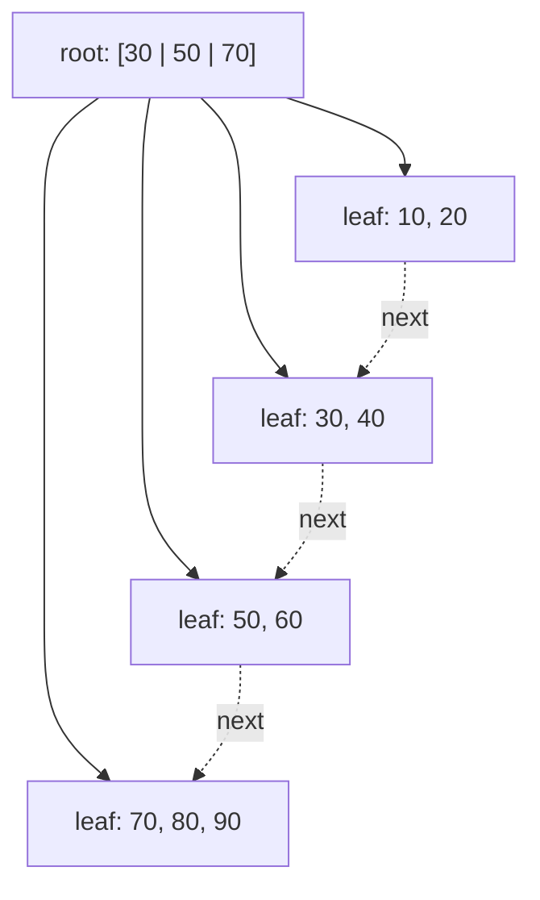

A billion-row table has an index on `user_id`. A lookup in a balanced binary tree over a billion keys touches about 30 nodes. If each node is a separate page on disk, that is 30 page reads, and even on an NVMe drive at roughly 100 µs per random read, 3 ms per lookup, on a machine that needs to do 50,000 of them per second. The binary tree is the wrong shape for anything that lives on disk, and it is the wrong shape for anything that lives in RAM but not in cache, for the same reason: each level costs one slow memory access and yields only one bit of information.

The fix is to make every node as wide as one unit of slow-memory transfer. A node that holds 250 keys yields 8 bits per access, and a billion keys need 4 levels instead of 30. That structure is the B-tree, and its variant the B+ tree is the index structure in Postgres, MySQL InnoDB, SQLite, Oracle, SQL Server, MongoDB's WiredTiger, and most filesystems. When a database's documentation says "B-tree index", it means B+ tree. This lesson computes the fan-out from real page sizes, traces splits and merges node by node, and then opens the page formats of three databases. It assumes the [AVL](/learn/advanced-data-structures/balanced-trees/avl-trees) and [red-black](/learn/advanced-data-structures/balanced-trees/red-black-trees) lessons for the pointer-per-level argument it is replacing.

## The shape

A B-tree of **order** `m` (some texts use minimum degree `t`, where `m = 2t`) is a search tree in which:

- every node holds between `⌈m/2⌉ − 1` and `m − 1` sorted keys, except the root which may hold as few as one;
- a node with `k` keys has `k + 1` children, and child `i` holds keys strictly between key `i−1` and key `i`;
- all leaves are at the same depth.

The last rule is the balance guarantee, and it is *free*: the tree only grows in height when the root splits, and a root split adds one level to every path at once. There are no rotations anywhere.

A **B+ tree** adds two changes that matter for databases:

1. Internal nodes hold only keys and child pointers; the actual records (or pointers to them) live only in the leaves. Internal nodes are therefore denser, so fan-out is higher and the tree is shorter.
2. Leaves are linked into a sorted list. A range scan finds the first leaf by descending once and then walks sideways, never going back up.



Lookup: binary search within the root's keys to pick a child, descend, repeat, and at the leaf binary search for the key. Cost is `O(log_f n)` page reads and `O(log₂ f)` comparisons per page, for fan-out `f`. The comparisons are cheap (the page is in cache once read); the page reads are the whole cost.

## The fan-out arithmetic, from a 4 KiB page and 8-byte keys

Start with the smallest common page, 4 KiB (SQLite's default since 3.12, and the unit most filesystems and SSDs transfer), and 8-byte integer keys.

- A **leaf entry** is the key plus a reference to the row: 8 + 8 = 16 bytes in a generic design.
- An **internal entry** is a key plus a child page number: also 16 bytes.
- The page needs a header for its type, key count, sibling pointer and checksum; call it 40 bytes.

Fan-out `f = ⌊(4096 − 40) / 16⌋ = 253` keys per full page. Under random inserts pages average about 70% full (the split leaves two half-full pages that fill back up), so the working fan-out is `⌊4056 × 0.7 / 16⌋ = 177`.

| Levels | Keys reachable, pages full (253) | Keys reachable, pages 70% full (177) |
|---|---|---|
| 1 (root only) | 253 | 177 |
| 2 | 64,009 | 31,329 |
| 3 | 16.2 million | 5.5 million |
| 4 | **4.1 billion** | 982 million |
| 5 | 1.0 trillion | **174 billion** |

A billion keys is a 4-level tree at full pages and a 5-level tree at 70% fill. Now the part that turns "4 or 5 page reads" into "one or two": the top levels are tiny. With `f = 253`, levels 1–3 hold `1 + 253 + 64,009 = 64,263` pages, **251 MiB**, and the leaf level holds about 4 million pages, 15 GiB. Any buffer pool larger than a few hundred megabytes keeps every internal page resident permanently, so a point lookup costs one disk read for the leaf, plus one for the table row if the index does not cover the query. At 100 µs per NVMe read that is about 200 µs; on network-attached cloud block storage at roughly 1 ms per read, 2 ms; on a spinning disk at 8 ms, 16 ms. The exercise at the end makes you compute these heights for other page sizes and key widths.

Postgres's real numbers, for comparison: an 8 KiB page with a 24-byte header, a 16-byte B-tree special area, a 4-byte line pointer per entry and a 16-byte index tuple (8-byte tuple id and info word plus the 8-byte key) gives `⌊(8192 − 40) / 20⌋ = 407` entries per full leaf. A billion keys is 4 levels; levels 1–3 are 166,057 pages, 1.3 GiB, which is why a Postgres buffer pool of a few gigabytes serves billion-row indexes from memory for everything but the leaf.

Compare with the AVL tree: 30 levels, no natural way to keep the "top" hot because there is no wide top, and a pointer dereference per level.

## Insertion and splits, traced

Insert descends to the correct leaf and inserts the key in sorted position. If the leaf now holds `m` keys (one too many), it **splits**: the keys are divided between the old leaf and a new sibling, and a separator key is inserted into the parent. In a B+ tree the separator is a *copy* of the new sibling's first key (the leaf keeps its own copy, because leaves hold all the data); in a classic B-tree the middle key *moves* up. If the parent overflows it splits too, and if the root splits, a new root is created with one key and the tree gets one level taller.

Trace it with at most 3 keys per node, inserting 10, 20, … 100 in order. A leaf that reaches 4 keys splits 2 and 2 and copies the new right leaf's first key upward; an internal node that reaches 4 keys keeps 2, pushes the third up and moves the fourth right.

| Insert | What happens | Tree after | Height |
|---|---|---|---|
| 10, 20, 30 | fit in the root leaf | `[10 20 30]` | 1 |
| 40 | leaf overflows: split `[10 20] [30 40]`, copy 30 up, new root | `[30] → ([10 20], [30 40])` | 2 |
| 50 | fits | `[30] → ([10 20], [30 40 50])` | 2 |
| 60 | split `[30 40] [50 60]`, copy 50 up | `[30 50] → ([10 20], [30 40], [50 60])` | 2 |
| 70 | fits | `[30 50] → (…, [50 60 70])` | 2 |
| 80 | split, copy 70 up | `[30 50 70] → ([10 20], [30 40], [50 60], [70 80])` | 2 |
| 90 | fits | `[30 50 70] → (…, [70 80 90])` | 2 |
| 100 | leaf `[70 80 90 100]` splits, copies 90 up; root `[30 50 70 90]` overflows: keeps `[30 50]`, pushes 70 up, `[90]` goes right; new root | `[70] → ([30 50] → ([10 20], [30 40], [50 60]), [90] → ([70 80], [90 100]))` | **3** |

Ten inserts, four leaf splits, one internal split, and the height grew exactly once, at the root. Notice the pattern with sorted input: every split happens on the rightmost leaf, and the left half of each split is left half-full forever (five leaves of 2 keys each, 67% full, for a structure that could hold them in four). Postgres and InnoDB detect this "rightmost insert" case and split unevenly, leaving the left page full and the new right page nearly empty, so that an ascending key produces densely packed pages. Random keys, such as UUIDv4 primary keys, split all over the tree and leave pages about 70% full on average, with the write cost to match. That is the mechanism behind the standard advice to prefer time-ordered identifiers (auto-increment, UUIDv7, ULID) for clustered keys.

```viz
{"type": "system", "scenario": "b-tree-index",
 "title": "B+ tree index: descent, split, and range scan",
 "caption": "Each node is one page. A lookup descends by binary search within each page; an insert into a full leaf splits it and pushes a separator up; a range scan walks the linked leaves."}
```

## Deletion: borrow, merge, and the root collapsing

Deletion is the mirror of insertion: remove the key from the leaf, and if the leaf drops below its minimum (2 keys here), first try to **borrow** a key from an adjacent sibling that has more than the minimum, updating the separator in the parent; if neither sibling can spare one, **merge** with a sibling and remove the separator from the parent, which may underflow in turn. Continue from the tree the inserts produced:

| Delete | Leaf level | Internal level | Tree after | Height |
|---|---|---|---|---|
| 100 | `[90]` underflows; sibling `[70 80]` is at the minimum, so **merge** into `[70 80 90]` and drop separator 90 from parent `[90]`, which is now empty | the empty internal node **borrows through the root**: separator 70 comes down from the root, 50 goes up from the left sibling `[30 50]`, and that sibling's last child `[50 60]` moves across | `[50] → ([30] → ([10 20], [30 40]), [70] → ([50 60], [70 80 90]))` | 3 |
| 60 | `[50]` underflows; right sibling `[70 80 90]` has a spare: **borrow** 70, separator becomes 80 | none | `[50] → ([30] → ([10 20], [30 40]), [80] → ([50 70], [80 90]))` | 3 |
| 20 | `[10]` underflows; sibling `[30 40]` at minimum: **merge** into `[10 30 40]`, drop separator 30; parent `[30]` is now empty | its sibling `[80]` is at the minimum too: **merge** the two internal nodes with the root's separator 50 between them into `[50 80]`; the root is now empty, so the merged node **becomes the root** | `[50 80] → ([10 30 40], [50 70], [80 90])` | **2** |

Three deletes, one borrow at each level, two merges, and the height shrank once, at the root. The internal-node borrow in the first row is the step people get wrong on paper: keys do not move directly between internal siblings, they rotate *through the parent*, because the parent's separator is what keeps the two subtrees ordered.

Most databases do **not** do this eagerly. Postgres leaves underfull pages in place and only reclaims a page once it is completely empty and `VACUUM` has confirmed no scan can still reach it. InnoDB merges when a page falls below `MERGE_THRESHOLD`, 50% by default. Index bloat after mass deletes, and `REINDEX` (or `OPTIMIZE TABLE`) to fix it, is the consequence, and it appears in the failure-mode table below.

## Range scans and why leaves are linked

`SELECT … WHERE created_at BETWEEN a AND b ORDER BY created_at` is one descent to find `a`, then a walk along the leaf chain until `b`. Every page read yields hundreds of rows in order, so the query never touches the internal nodes again and never sorts. In a red-black tree the same range query is an in-order traversal that hops between scattered heap allocations, one key per hop.

The leaf chain is also why `ORDER BY indexed_column LIMIT 10` is cheap (descend to one end, read 10 entries) and why a composite index on `(tenant_id, created_at)` can serve `WHERE tenant_id = ? ORDER BY created_at` without a sort: the leaves for one tenant are contiguous and already ordered by the second column. The order of columns in a composite index is the order of the concatenated key, and the B+ tree can only walk prefixes of it. The [indexes lesson](/learn/databases/relational-fundamentals/indexes) goes deeper on selectivity and covering indexes; the structural fact to carry from here is that an index is a sorted key space cut into pages, and every index feature is a consequence of that.

## Under the hood: three page formats

**Postgres.** An index page is 8 KiB: a 24-byte `PageHeaderData` (LSN, checksum, free-space offsets), an array of 4-byte line pointers growing down from the header, the index tuples growing up from the end, and a 16-byte `BTPageOpaqueData` special area at the very end holding the left and right sibling page numbers, the level and flags. Each tuple starts with an 8-byte header: a 6-byte heap tuple id (block number and offset) and a 2-byte size-and-flags word, followed by the key. Postgres implements Lehman and Yao's B-link tree: every page carries a pointer to its right sibling and a **high key** bounding what it may contain, so a reader that races a concurrent split notices its key is above the high key and moves right instead of locking the whole path. Leaf pages are filled to 90% on initial build (`fillfactor`), internal pages to about 70%. Since version 12, separator keys in internal pages are **suffix-truncated** to the shortest prefix that still separates the children, raising internal fan-out; since 13, duplicate keys on a leaf are **deduplicated** into one key with a posting list of tuple ids, which shrinks indexes on low-cardinality columns several-fold; since 14, a page about to split first tries **bottom-up deletion** of entries whose heap tuples are dead, avoiding many splits caused by updates. An index lookup is a leaf read plus a heap read, unless the index covers every column the query needs and the visibility map says the heap page is all-visible, in which case it is an index-only scan.

**InnoDB.** Pages are 16 KiB. The table *is* a B+ tree keyed by the primary key with the full row in the leaves (a **clustered index**); secondary indexes store the primary key in their leaves rather than a row pointer, so a secondary lookup is two tree descents. Each page has a 38-byte file header, a 56-byte page header, fixed infimum and supremum records, a **page directory** of 2-byte slots at the end (one slot per 4–8 records, so a lookup binary-searches the slots and then walks at most 8 records), and an 8-byte trailer with the checksum. InnoDB reserves 1/16 of each page during sequential inserts so that the next insert on the page does not split it, and it merges a page with a neighbour when it falls below 50% full. The consequences follow directly: primary-key range scans are the fastest thing InnoDB does; a wide primary key bloats every secondary index; and random primary keys cause page splits in the table itself, not only in the index.

**SQLite.** One file, 4 KiB pages by default. A table is a B+ tree keyed by `rowid` with the row data in the leaves (an `INTEGER PRIMARY KEY` column *is* the rowid); an index is a classic B-tree whose entries, key plus rowid, live in interior pages as well as leaves. Each page has an 8-byte header (12 for interior pages, which add a right-most child pointer), then a 2-byte cell pointer array, then the cells growing from the end; a row larger than the page spills into a chain of overflow pages, and the format is documented well enough to read with a hex editor.

**Filesystems and in-memory trees.** ext4 uses an htree for large directories and extent trees for file blocks; XFS, Btrfs and NTFS index almost everything with B+ trees. In memory the argument still holds with the cache line as the unit: Rust's `BTreeMap` uses nodes of up to 11 keys, chosen to fill a couple of cache lines, and beats a red-black tree on lookups and iteration by a constant factor, losing only the iterator-stability guarantee that C++ needed. The Linux kernel's maple tree, which replaced the VMA red-black tree in 6.1, is a B-tree variant for the same reason. WiredTiger, MongoDB's engine, uses 4 KiB internal and 32 KiB leaf pages by default because its leaves hold whole documents.

## The costs, with numbers

**Write amplification.** Updating one 100-byte row rewrites at least one 8 KiB leaf page, an 80× amplification, plus the write-ahead log record, plus in Postgres a full-page image of the page in the WAL the first time it is modified after a checkpoint (`full_page_writes`, on by default). A leaf split dirties three pages (leaf, new sibling, parent) and, right after a checkpoint, logs three full-page images: 24 KiB of WAL for a 16-byte insert. Add secondary indexes, each of which is its own B+ tree that needs updating, and a single-row insert can turn into a dozen page writes. This is the cost that [LSM trees](/learn/advanced-data-structures/log-structured-and-disk-structures/lsm-trees-and-sstables) exist to reduce, and [B-tree vs LSM](/learn/advanced-data-structures/log-structured-and-disk-structures/b-tree-vs-lsm) puts the two side by side.

**Space.** Pages average 70% full under random insertion, so a B+ tree costs about 1.4× its raw data, more with fill-factor headroom, more again after churn has fragmented it.

**Concurrency.** A split modifies three pages and must not be observed half-done. Postgres's B-link right pointers, InnoDB's latch coupling and optimistic descents are all machinery for letting thousands of readers proceed while one writer splits a page. Hot leaf pages, such as the rightmost leaf under sequential inserts, become contention points: every insert wants the same page, and the fix is either a hash-partitioned index or accepting the serialisation.

## Trade-offs

| | B+ tree (disk) | B+ tree (memory, `BTreeMap`) | Red-black / AVL | LSM tree | Hash index |
|---|---|---|---|---|---|
| Point lookup, cold | 1–2 page reads (top cached) | 4–5 cache misses | 28–40 cache misses | 1 memtable + several SSTable probes, Bloom-filtered | 1–2 page reads |
| Range scan | leaf chain, sequential | node walk, sequential | in-order pointer chase | merge across levels | not supported |
| Write cost | rewrite a page (+WAL) | shift keys within a node | 2–3 rotations | append + background compaction | rewrite a bucket |
| Space overhead | ~1.4× at 70% fill | ~1.1× | 2–3 pointers per key | ~1.1× plus compaction headroom | ~1.5× |
| Sorted-key insert behaviour | dense pages with rightmost split rule | fine | fine | fine (already sorted) | random buckets |
| Random-key insert behaviour | splits everywhere, 70% fill | fine | fine | fine | fine |

## Failure modes

| Symptom | Diagnosis | Fix |
|---|---|---|
| Insert throughput on a table with a UUIDv4 primary key is a third of an identical table with a sequential key, and the index file is 40% larger | Random keys defeat the rightmost-split rule: every insert lands in a random leaf, splits spread across the tree, pages sit at 70% and every insert dirties an unpredictable page (a random write, and in InnoDB a random write into the table itself) | Time-ordered keys (UUIDv7, ULID, auto-increment); keep the random UUID as a secondary column if clients need it |
| After deleting 80% of a table's rows, index scans are as slow as before and `pg_relation_size` on the index has not moved | Postgres does not merge underfull pages; the leaf chain still contains every page, most nearly empty, and a range scan reads them all | `REINDEX CONCURRENTLY` (or `pg_repack`); for recurring bulk deletes, partition by time and drop partitions instead |
| p99 latency of point lookups jumps from 200 µs to several milliseconds after the dataset grew or the instance shrank | The buffer pool no longer holds the internal levels (or the hot leaves); each lookup now pays 3–5 disk reads instead of 1. `pg_statio_user_indexes` shows a falling hit ratio | Bigger buffer pool, a covering index so heap reads disappear, or shrink the index (drop unused ones, dedup in Postgres 13+) |
| Write throughput plateaus on one core while the rest of the machine is idle; waits show a single index page | Rightmost-leaf contention: every insert with an ascending key needs the same leaf page's lock | Accept it (it is often fine), hash-partition the table, or use a key that spreads inserts over a few leaves rather than one or all |
| A query on `(created_at)` is fast but the same query on `(tenant_id, created_at)` for `WHERE created_at > ?` does a full scan | The composite index is sorted by tenant first; a predicate on the second column alone cannot walk a prefix | Add a single-column index, or put the range column last only when the leading column is fixed by the query |
| Index size is triple the table's key column size | Wide keys (a 36-character UUID string instead of a 16-byte binary) cut fan-out from hundreds to dozens, adding a level and multiplying pages | Store the narrowest representation (`uuid` type, integers), and prefer surrogate keys for wide natural keys |

## Interviewer follow-ups

**"Why does a point lookup on a billion-row index usually cost one disk read?"** Model answer: with fan-out in the hundreds the tree is 4 levels, the top three levels total on the order of 100 MB to 1 GB and stay in the buffer pool, so only the leaf (and possibly the heap row) is read from disk. Common wrong answer: "because the index is cached", without the fan-out arithmetic that says *which* part is cached and why it fits.

**"UUIDv4 primary keys are hurting insert performance. What exactly is the mechanism?"** Model answer: random keys hit random leaves, defeating the rightmost-split optimisation; each insert dirties a random page, splits scatter and leave pages 70% full, and in a clustered engine the table pages split too, so both write I/O and space go up. Common wrong answer: "the tree becomes unbalanced" (a B+ tree is always balanced) or "UUIDs are slow to compare".

**"What is the difference between a B-tree and a B+ tree, and why do databases want the second?"** Model answer: B+ trees keep records only in leaves and link the leaves; internal nodes are denser (shorter tree) and range scans and `ORDER BY … LIMIT` walk the leaf chain without revisiting internal pages. Common wrong answer: "B+ trees are balanced and B-trees are not".

**"How does a reader survive a concurrent page split without locking the whole path?"** Model answer: Lehman–Yao: every page has a right-sibling pointer and a high key; a reader that lands on a page whose high key is below its search key moves right, because the split moved the upper half there; at most one extra hop per level. Common wrong answer: "the database takes a lock on the root", which would serialise every operation.

**"Postgres has a covering index on `(a, b)`. When does an index-only scan still read the heap?"** Model answer: when the visibility map does not mark the heap page all-visible, because the index has no tuple visibility information and MVCC requires checking it; after a `VACUUM` the map is up to date and heap reads disappear. Common wrong answer: "never, that is what covering means".

## What mid-level engineers get wrong

- **Thinking of index height as the cost.** Height is 4 for everything realistic; the cost is how many of those 4 pages are cold, which is decided by buffer-pool size and access pattern.
- **Treating a random UUID as free.** It costs page splits, 30% space and a random write per insert in the table itself under InnoDB.
- **Expecting deletes to shrink an index.** Postgres reclaims pages only when empty and vacuumed; the leaf chain keeps its length until a `REINDEX`.
- **Putting the range column first in a composite index** and then wondering why the equality filter on the second column does not help.
- **Confusing "the table has an index" with "the query uses it".** A B+ tree serves prefix predicates on its key order; anything else is a full scan plus a filter.
- **Believing a hash index is always faster for equality.** It skips the descent but cannot do ranges, sorted output or prefix matches, and most engines' hash indexes are less mature; the B+ tree's descent is a few cached page reads anyway.

## Exercises

```exercise
id: bplus-tree-basics
title: Implement a small B+ tree
prompt: |
  Implement `BPlusTree` with integer keys and these methods, replayed by the
  tests as a sequence of operations:

  - `set_order(max_keys)`: every node (leaf or internal) may hold at most
    `max_keys` keys. Called first.
  - `insert(key)`: insert a distinct key (returns nothing).
  - `range(lo, hi)`: return all keys with `lo <= key <= hi` in ascending order.
  - `height()`: number of levels (a single leaf root is 1).
  - `leaves()`: the leaves' key lists, left to right.

  Split rules, applied as soon as a node holds `max_keys + 1` keys: a leaf
  with `m` keys keeps the first `ceil(m / 2)` keys and moves the rest to a new
  right sibling; the new sibling's first key is *copied* into the parent. An
  internal node with `m` keys keeps `keys[:m // 2]`, pushes `keys[m // 2]` up,
  and moves the remaining keys (and the corresponding children) to a new right
  sibling. A root split creates a new root with one key.

  Keep a `next` pointer on leaves and use it for `range`.
languages: [python, javascript]
entry: BPlusTree
starter:
  python: |
    class Node:
        def __init__(self, leaf):
            self.leaf = leaf
            self.keys = []
            self.children = []   # internal nodes only
            self.next = None     # leaves only

    class BPlusTree:
        def __init__(self):
            self.max_keys = 3
            self.root = Node(leaf=True)

        def set_order(self, max_keys):
            self.max_keys = max_keys

        def insert(self, key):
            # TODO: descend to the leaf, insert, split upward as needed
            pass

        def range(self, lo, hi):
            # TODO: descend to the leaf that should hold lo, then walk `next`
            return []

        def height(self):
            # TODO
            return 1

        def leaves(self):
            # TODO: walk from the leftmost leaf along `next`
            return []
  javascript: |
    class Node {
      constructor(leaf) { this.leaf = leaf; this.keys = []; this.children = []; this.next = null; }
    }
    class BPlusTree {
      constructor() { this.maxKeys = 3; this.root = new Node(true); }
      set_order(maxKeys) { this.maxKeys = maxKeys; }
      insert(key) {
        // TODO: descend to the leaf, insert, split upward as needed
      }
      range(lo, hi) {
        // TODO: descend to the leaf that should hold lo, then walk `next`
        return [];
      }
      height() {
        // TODO
        return 1;
      }
      leaves() {
        // TODO: walk from the leftmost leaf along `next`
        return [];
      }
    }
tests:
  - args: [["set_order", 3], ["insert", 10], ["insert", 20], ["insert", 30], ["height"], ["leaves"]]
    expected: [null, null, null, null, 1, [[10, 20, 30]]]
    label: fits in one leaf
  - args: [["set_order", 3], ["insert", 10], ["insert", 20], ["insert", 30], ["insert", 40], ["leaves"], ["height"]]
    expected: [null, null, null, null, null, [[10, 20], [30, 40]], 2]
    label: first leaf split creates a root
  - args: [["set_order", 3], ["insert", 10], ["insert", 20], ["insert", 30], ["insert", 40], ["insert", 50], ["insert", 60], ["insert", 70], ["insert", 80], ["insert", 90], ["insert", 100], ["leaves"], ["height"], ["range", 25, 75]]
    expected: [null, null, null, null, null, null, null, null, null, null, null, [[10, 20], [30, 40], [50, 60], [70, 80], [90, 100]], 3, [30, 40, 50, 60, 70]]
    label: root split to height 3, then a range scan
  - args: [["set_order", 3], ["range", 1, 10], ["height"]]
    expected: [null, [], 1]
    label: empty tree
  - args: [["set_order", 3], ["insert", 50], ["insert", 40], ["insert", 30], ["insert", 20], ["insert", 10], ["leaves"], ["range", 0, 100], ["height"]]
    expected: [null, null, null, null, null, null, [[10, 20, 30], [40, 50]], [10, 20, 30, 40, 50], 2]
    hidden: true
    label: descending inserts split on the left
  - args: [["set_order", 4], ["insert", 1], ["insert", 2], ["insert", 3], ["insert", 4], ["insert", 5], ["insert", 6], ["insert", 7], ["insert", 8], ["insert", 9], ["leaves"], ["height"], ["range", 4, 7]]
    expected: [null, null, null, null, null, null, null, null, null, null, [[1, 2, 3], [4, 5, 6], [7, 8, 9]], 2, [4, 5, 6, 7]]
    hidden: true
    label: order 4 keeps ceil(m/2) on the left
hints:
  - "Write a recursive `_insert(node, key)` that returns `None` when nothing split, or `(separator, new_right_node)` when it did; the caller inserts the separator and child into itself and may split in turn."
  - "For a leaf split with keys `k` of length m: `left = k[:(m + 1) // 2]`, `right = k[(m + 1) // 2:]`, separator `right[0]`. Set `new.next = leaf.next; leaf.next = new`."
  - "For an internal split: `mid = m // 2`; push `keys[mid]` up; the right node takes `keys[mid + 1:]` and `children[mid + 1:]`."
  - "`height` is the number of steps from the root to any leaf plus one; `leaves` walks `children[0]` down to the leftmost leaf and follows `next`."
```

```exercise
id: btree-height-from-page
title: Compute B+ tree fan-out and height from a page layout
prompt: |
  Implement `btree_height(n, page_bytes, entry_bytes, header_bytes, fill)`.
  The fan-out is `f = floor((page_bytes - header_bytes) * fill / entry_bytes)`,
  the number of entries a page holds at the given fill fraction (`fill` is
  between 0 and 1). Return the number of levels needed to hold `n` keys: the
  smallest `h >= 1` with `f ** h >= n`. Return `-1` if `f < 2` (the page
  cannot hold two entries, so the tree cannot branch).

  Use integer arithmetic for the powers so large values stay exact.
languages: [python, javascript]
entry: btree_height
starter:
  python: |
    def btree_height(n, page_bytes, entry_bytes, header_bytes, fill):
        # your code here
        return 1
  javascript: |
    function btree_height(n, page_bytes, entry_bytes, header_bytes, fill) {
      // your code here
      return 1;
    }
tests:
  - args: [1000000000, 4096, 20, 40, 1.0]
    expected: 4
    label: a billion keys, 4 KiB pages, Postgres-style 20-byte entries
  - args: [1000000000, 4096, 20, 40, 0.7]
    expected: 5
    label: the same tree at 70% fill needs one more level
  - args: [1000000000, 8192, 20, 40, 1.0]
    expected: 4
    label: 8 KiB pages
  - args: [100, 4096, 20, 40, 1.0]
    expected: 1
    label: everything fits in the root
  - args: [1000000, 4096, 2100, 40, 1.0]
    expected: -1
    label: entries so wide only one fits per page
  - args: [1000000000, 4096, 48, 40, 0.7]
    expected: 6
    hidden: true
    label: a 36-character key adds two levels
  - args: [1000000000000, 8192, 20, 40, 0.9]
    expected: 5
    hidden: true
    label: a trillion keys
  - args: [1, 4096, 20, 40, 1.0]
    expected: 1
    hidden: true
    label: a single key
hints:
  - "Compute `f` with floor division after multiplying by `fill`; then loop `h = 1, reach = f; while reach < n: reach *= f; h += 1`."
  - "In JavaScript use `Math.floor` for `f` and plain numbers for `reach`; the test values stay below 2^53."
```

## Senior signals

- You explain a B+ tree by the **unit of transfer**: node size equals page size (or cache-line size), so fan-out is hundreds and height is 4 or 5 for anything realistic, and you can compute `f = ⌊(4096 − 40) / 16⌋ = 253` and the resulting heights on a whiteboard.
- You can say why a point lookup on a billion-row index is usually **one disk read**: the upper levels total a few hundred megabytes and stay cached, and you can put a latency on the leaf read for NVMe, cloud block storage and spinning disk.
- You know the difference between B-tree and B+ tree (data in leaves, linked leaves) and why databases want the B+ form for range scans and `ORDER BY … LIMIT`.
- You can trace a split and a merge including the internal-node borrow through the parent, and you know that real engines skip eager merging and pay for it as bloat.
- You explain UUIDv4-versus-sequential primary keys as a **page-split pattern**, and clustered-index consequences in InnoDB (secondary indexes carry the PK; wide PKs cost everywhere).
- You quantify write amplification (one row update rewrites an 8 KiB page plus WAL plus a full-page image after a checkpoint plus each secondary index) and know that this is the cost LSM trees trade away.
- You know that in-memory B-trees (Rust's `BTreeMap`, the kernel's maple tree) beat binary trees past cache size, and why C++'s `std::map` could not follow.

## Check yourself

```quiz
- q: >-
    An index on a 4-billion-row table uses 8 KiB pages with about 400 entries each. About how many levels does the B+ tree have, and how many of those are typically served from cache on a point lookup?
  options: ["About 32 levels, roughly half of them cached", "4 or 5 levels, all but the leaf cached", "About 12 levels, only the root cached", "2 or 3 levels, all of them cached"]
  answer: 1
  explanation: >-
    400³ = 64 million and 400⁴ = 25.6 billion, so 4 to 5 levels. The levels above the leaves hold at most a few hundred thousand pages in total, which a normal buffer pool keeps resident; the leaf level is the one that may need disk. 32 levels is what a binary tree would need, not a tree with a fan-out of 400.
- q: >-
    Why do B+ trees keep records only in the leaves and link the leaves together?
  options: ["Internal pages fit more separators, and range scans walk sibling leaves", "Linked leaves let the tree hold duplicate keys in overflow chains", "Leaf-only records keep every leaf at one depth, which balances the tree", "Records in leaves mean inserts split pages far less often than B-trees"]
  answer: 0
  explanation: >-
    Balance comes from the split-at-root rule, not from where data lives. Moving data out of internal nodes lets each internal page hold more separators (higher fan-out, shorter tree), and the leaf chain lets a range query read sequential pages without revisiting internal nodes.
- q: >-
    A table uses random UUIDv4 primary keys in InnoDB. Compared with an auto-increment key, what is the main storage-engine cost?
  options: ["Inserts land in random leaves, splitting pages across the whole table", "Equality lookups on UUID keys need a hash index instead of the tree", "Lookups degrade toward O(n) since random keys unbalance the tree", "Each insert triggers rotations that rebalance the tree up to the root"]
  answer: 0
  explanation: >-
    Random keys defeat the rightmost-insert optimisation and spread splits everywhere, so pages stay about 70% full and each insert dirties an unpredictable page. InnoDB's clustered layout means the table data pays this cost too, and every secondary index carries the 16-byte key. The tree itself stays perfectly balanced whatever the key order, so lookups remain O(log n); B+ trees split pages rather than rotate.
- q: >-
    After deleting 80% of the rows in a large Postgres table, queries on its index are still slow and the index file is the same size. Why?
  options: ["Postgres B-tree indexes cannot remove entries once written", "Postgres leaves underfull pages in place until a REINDEX", "The tree height cannot shrink, so lookups keep the original depth", "The deleted rows remain in the WAL, which index scans still read"]
  answer: 1
  explanation: >-
    Eager merging on delete is expensive and rarely worth it, so Postgres does not merge underfull pages; it only reclaims completely empty pages after VACUUM. Scans still walk the bloated leaf chain until the index is rebuilt with REINDEX. Height is not the problem: the internal levels are few and cached, and the cost is the mostly-empty leaves.
- q: >-
    In a B+ tree with at most 3 keys per node, a leaf merge empties its parent, an internal node whose left sibling holds [30 50] and whose grandparent (the root) holds [70]. What repairs the empty node?
  options: ["The sibling's 50 moves sideways into it and the root is unchanged", "The root's 70 moves down into it and the sibling's 50 moves up to the root", "It is deleted and the root's 70 is dropped, shrinking the tree by a level", "It merges with the sibling into [30 50] and the root becomes [30 50 70]"]
  answer: 1
  explanation: >-
    Internal nodes borrow through the parent: the separator between the two siblings (the root's 70) descends into the underfull node, the sibling's largest key (50) rises to replace it, and the sibling's last child moves across. Moving 50 sideways would leave keys below 70 under a subtree that the root says holds keys of 70 and above. A merge is only used when the sibling has no spare key, and it is the parent's separator that joins them, not the other way round.
- q: >-
    Which query can a B+ tree index on (tenant_id, created_at) serve without a separate sort step?
  options: ["WHERE tenant_id = ? ORDER BY created_at", "WHERE tenant_id > ? ORDER BY created_at", "WHERE created_at > ? ORDER BY created_at", "ORDER BY created_at DESC LIMIT 10"]
  answer: 0
  explanation: >-
    The index is sorted by the concatenated key, so for a fixed tenant_id the leaves are contiguous and in created_at order. A range on tenant_id spans many tenants, each sorted by created_at separately, so the combined result still needs a sort. Queries that filter or order by created_at without fixing tenant_id cannot walk a prefix of the key and need a different index or a sort.
```
