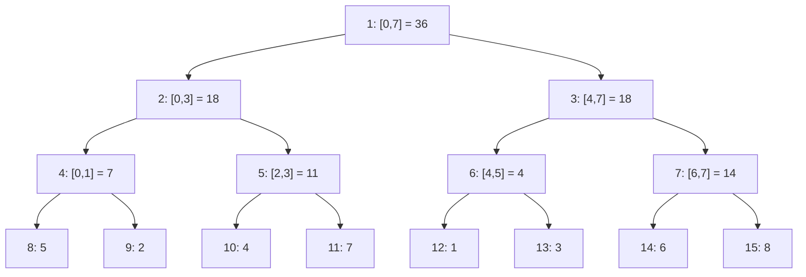

You keep a per-second request count for the last day, 86,400 integers, and a dashboard asks "how many requests between 09:14:03 and 11:02:57" a few hundred times a second while new counts land every second. A prefix-sum array answers each query with one subtraction, but every new second invalidates every later prefix, and rebuilding costs `O(n)`. A plain array makes updates free and every query `O(n)`. Both are wrong at 86,400 elements and hundreds of queries per second; both are catastrophic at a billion.

The segment tree splits the difference: `O(log n)` for a point update and `O(log n)` for a range query. It does that by storing not just the elements but a summary of every "aligned" interval, so that any query range can be assembled from at most `2 log n` of those pre-computed pieces. This lesson builds one on eight concrete values, traces every operation on it node by node, then puts numbers on memory and cache behaviour, shows what a production-grade library (AtCoder's `segtree`) stores, and ends with the places where interval summaries run at scale under other names.

## Why prefix sums stop working

Watch the [prefix-sum](/learn/data-structures/arrays-strings/prefix-sums-and-difference-arrays) construction and notice how much of it depends on every earlier element.

```viz
{"type": "array", "algorithm": "prefix-sum", "values": [5, 2, 4, 7, 1, 3, 6, 8],
 "title": "Prefix sums: one pass to build, one subtraction per query",
 "caption": "sum(2..5) = prefix[5] - prefix[1] = 19 - 7 = 12. Change values[2] and prefix[2..7] are all wrong."}
```

Change `values[2]` from 4 to 9 and six of the eight prefix entries move. The dependency is the problem: `prefix[i]` depends on *every* element before it. A segment tree replaces that long chain of dependencies with a tree of short ones, where each element influences only `log n + 1` summaries.

## The structure, with array indices

Take `n = 8` values `[5, 2, 4, 7, 1, 3, 6, 8]`. Build a complete binary tree whose leaves are the values and whose every internal node stores the sum of its two children. Store the tree in one array with the root at index 1, so that node `i` has children `2i` and `2i + 1` and parent `i // 2`. Leaf `k` lives at index `n + k`. The diagram shows each node as `index: [interval] = value`.



The same tree as the array it is stored in (index 0 is unused):

| index | 1 | 2 | 3 | 4 | 5 | 6 | 7 | 8 | 9 | 10 | 11 | 12 | 13 | 14 | 15 |
|---|---|---|---|---|---|---|---|---|---|---|---|---|---|---|---|
| interval | [0,7] | [0,3] | [4,7] | [0,1] | [2,3] | [4,5] | [6,7] | [0] | [1] | [2] | [3] | [4] | [5] | [6] | [7] |
| value | 36 | 18 | 18 | 7 | 11 | 4 | 14 | 5 | 2 | 4 | 7 | 1 | 3 | 6 | 8 |

Three facts to read off the table. Siblings are adjacent (`2i` and `2i + 1`), so a parent's two children share a cache line. Each level is a contiguous slice: indices 1, 2–3, 4–7, 8–15. And the binary representation of an index is the path from the root: node 11 is `1011₂`, which reads "root, right, left, right", and it covers leaf 3, which is `011₂` with the leading 1 stripped. That last fact is why the iterative query below can navigate with bit tests alone.

**Build.** Copy the values into indices `n .. 2n − 1`, then fill `i = n − 1` down to `1` with `tree[i] = tree[2i] + tree[2i + 1]`. Every node is written once: `O(n)`, and the loop runs downward so that both children exist before their parent is computed.

**Point update.** Change `values[2]` to 9. Only the nodes on the path from leaf 10 to the root contain index 2. Walking up with `i //= 2`:

| step | index | interval | old | new |
|---|---|---|---|---|
| leaf | 10 | [2,2] | 4 | 9 |
| parent | 5 | [2,3] | 11 | 16 |
| parent | 2 | [0,3] | 18 | 23 |
| root | 1 | [0,7] | 36 | 41 |

Four writes for eight elements: `log₂ n + 1` nodes, `O(log n)`.

## Range query: the decomposition, node by node

A query for `[l, r]` walks down from the root and classifies each node it meets: **covered** (the node's interval lies inside `[l, r]`: take its stored value, do not descend), **outside** (contribute the identity, do not descend), or **straddling** (recurse into both children). On the original tree:

| query | node visited | interval | verdict | contributes |
|---|---|---|---|---|
| `[2,5]` | 1 | [0,7] | straddles | |
| | 2 | [0,3] | straddles | |
| | 4 | [0,1] | outside | 0 |
| | 5 | [2,3] | **covered** | 11 |
| | 3 | [4,7] | straddles | |
| | 6 | [4,5] | **covered** | 4 |
| | 7 | [6,7] | outside | 0 |
| | | | **total** | **15** |

Seven nodes visited, two taken. Now a range that is not aligned at either end:

| query | node visited | interval | verdict | contributes |
|---|---|---|---|---|
| `[1,6]` | 1 | [0,7] | straddles | |
| | 2 | [0,3] | straddles | |
| | 4 | [0,1] | straddles | |
| | 8 | [0,0] | outside | 0 |
| | 9 | [1,1] | **covered** | 2 |
| | 5 | [2,3] | **covered** | 11 |
| | 3 | [4,7] | straddles | |
| | 6 | [4,5] | **covered** | 4 |
| | 7 | [6,7] | straddles | |
| | 14 | [6,6] | **covered** | 6 |
| | 15 | [7,7] | outside | 0 |
| | | | **total** | **23** |

Eleven visited, four taken: `[1,6]` is `2 + 11 + 4 + 6`. And a range that reaches the right edge:

| query | node visited | interval | verdict | contributes |
|---|---|---|---|---|
| `[3,7]` | 1 | [0,7] | straddles | |
| | 2 | [0,3] | straddles | |
| | 4 | [0,1] | outside | 0 |
| | 5 | [2,3] | straddles | |
| | 10 | [2,2] | outside | 0 |
| | 11 | [3,3] | **covered** | 7 |
| | 3 | [4,7] | **covered** | 18 |
| | | | **total** | **25** |

The bound: at each level, the query range `[l, r]` can only partially overlap two nodes, the one containing `l` and the one containing `r`. Everything strictly between them is fully inside and gets taken whole; everything else is fully outside and gets pruned. So at most two nodes per level are recursed into, at most four are visited per level, and the walk is `O(log n)`: for `n = 10⁶` that is at most about 80 node visits and 40 taken nodes, against a million for a scan.

## The recursive implementation

Node `i` has children `2i` and `2i + 1`, the root is node 1, and the interval `[lo, hi]` travels down the recursion as arguments.

```python
class SegmentTree:
    def __init__(self, values):
        self.n = len(values)
        self.tree = [0] * (4 * self.n)
        self._build(1, 0, self.n - 1, values)

    def _build(self, node, lo, hi, values):
        if lo == hi:
            self.tree[node] = values[lo]
            return
        mid = (lo + hi) // 2
        self._build(2 * node, lo, mid, values)
        self._build(2 * node + 1, mid + 1, hi, values)
        self.tree[node] = self.tree[2 * node] + self.tree[2 * node + 1]

    def update(self, i, value):
        self._update(1, 0, self.n - 1, i, value)

    def _update(self, node, lo, hi, i, value):
        if lo == hi:
            self.tree[node] = value
            return
        mid = (lo + hi) // 2
        if i <= mid:
            self._update(2 * node, lo, mid, i, value)
        else:
            self._update(2 * node + 1, mid + 1, hi, i, value)
        self.tree[node] = self.tree[2 * node] + self.tree[2 * node + 1]

    def query(self, l, r):
        return self._query(1, 0, self.n - 1, l, r)

    def _query(self, node, lo, hi, l, r):
        if r < lo or hi < l:          # entirely outside
            return 0
        if l <= lo and hi <= r:       # entirely inside
            return self.tree[node]
        mid = (lo + hi) // 2
        return (self._query(2 * node, lo, mid, l, r)
                + self._query(2 * node + 1, mid + 1, hi, l, r))
```

**Why `4n`.** With `n` a power of two the deepest index is `2n − 1`. Otherwise the halving splits unevenly, some leaves sit one level deeper than others, and the index of the deepest leaf can exceed `2n`. Counting the exact slots needed (highest index reached plus one) for a few sizes: `n = 5` needs 10, `n = 6` needs 14, `n = 10` needs 26, `n = 17` needs 34, `n = 100` needs 254, and the worst ratio for any `n < 300` is 3.65 (it is approached when `n` is just above a power of two). `4n` is the smallest round bound that always works; `2 · 2^⌈log₂ n⌉` is the tight one. Allocate `2n` for this layout and `n = 6` writes past the end.

This is the version to reach for when the query logic is non-trivial (finding the first index whose prefix exceeds a threshold, for instance), because `[lo, hi]` is right there in the recursion and you can make decisions with it.

## The iterative implementation, traced with parity

The bottom-up version uses exactly `2n` slots and no recursion. Leaves sit at `n .. 2n − 1`, and the query walks two cursors up the tree.

```python
class SegmentTree:
    def __init__(self, values):
        self.n = len(values)
        self.tree = [0] * (2 * self.n)
        self.tree[self.n:] = values
        for i in range(self.n - 1, 0, -1):
            self.tree[i] = self.tree[2 * i] + self.tree[2 * i + 1]

    def update(self, i, value):
        i += self.n
        self.tree[i] = value
        while i > 1:
            i //= 2
            self.tree[i] = self.tree[2 * i] + self.tree[2 * i + 1]

    def query(self, l, r):                 # inclusive [l, r]
        res = 0
        l += self.n
        r += self.n + 1                    # half-open [l, r)
        while l < r:
            if l & 1:                      # l is a right child: take it, step past
                res += self.tree[l]
                l += 1
            if r & 1:                      # r is a right child: step back, take it
                r -= 1
                res += self.tree[r]
            l //= 2
            r //= 2
        return res
```

The invariant: `[l, r)` is always the part of the query not yet accounted for, expressed as node indices at the current level. A node with an odd index is a right child, so its parent also covers the left sibling, which lies outside the query; the node must be taken now. An even `l` is a left child whose parent might still be fully inside, so wait. Symmetrically for the exclusive `r`: when `r` is odd, `r − 1` is a left child fully inside, so take it. Three traces on the tree above (`n = 8`, leaves at 8..15):

**`[2,5]`**, start `l = 10`, `r = 14`:

| level | `l` | `r` | parity | action | `res` |
|---|---|---|---|---|---|
| leaves | 10 | 14 | both even | nothing; go up | 0 |
| 2 | 5 | 7 | both odd | take node 5 (11), `l` → 6; `r` → 6, take node 6 (4) | 15 |
| 1 | 3 | 3 | `l == r` | stop | **15** |

**`[1,6]`**, start `l = 9`, `r = 15`:

| level | `l` | `r` | parity | action | `res` |
|---|---|---|---|---|---|
| leaves | 9 | 15 | both odd | take node 9 (2), `l` → 10; `r` → 14, take node 14 (6) | 8 |
| 2 | 5 | 7 | both odd | take node 5 (11), `l` → 6; `r` → 6, take node 6 (4) | 23 |
| 1 | 3 | 3 | `l == r` | stop | **23** |

**`[3,7]`**, start `l = 11`, `r = 16`:

| level | `l` | `r` | parity | action | `res` |
|---|---|---|---|---|---|
| leaves | 11 | 16 | `l` odd | take node 11 (7), `l` → 12 | 7 |
| 2 | 6 | 8 | both even | nothing; go up | 7 |
| 1 | 3 | 4 | `l` odd | take node 3 (18), `l` → 4 | 25 |
| 0 | 2 | 2 | `l == r` | stop | **25** |

The nodes taken (9, 14, 5, 6 for `[1,6]`; 11 and 3 for `[3,7]`) are exactly the covered nodes the recursive walk found. Nothing was recomputed; the loop found them by parity alone.

## Non-power-of-two n and non-commutative operations

The iterative tree works for any `n`, not just powers of two, but the shape changes. With `n = 6` the leaves are at 6..11 and the internal nodes cover: node 3 = `[0,1]`, node 4 = `[2,3]`, node 5 = `[4,5]`, node 2 = `[2..5]`, and node 1 = `[2..5]` followed by `[0..1]`. Node 1 is not a contiguous interval and the levels are ragged. The query loop never breaks, because it only relies on the parent relation `i → 2i, 2i + 1` and it never takes node 1 for a proper sub-range, so sum, min, max, gcd and XOR all work unchanged for any `n`.

Non-commutative operations (matrix products, string concatenation, function composition) expose a real bug. Build the tree over the letters `a..h` and concatenate instead of adding. `query(2, 5)` gives `"cdef"`, correct by luck. `query(1, 6)` with the single-accumulator loop above gives **`"bgcdef"`**: the loop took node 9 (`b`), then node 14 (`g`), then node 5 (`cd`), then node 6 (`ef`), appending each as it came. The left pieces arrive left to right and the right pieces arrive right to left, interleaved. The fix keeps two accumulators:

```python
def query(self, l, r):
    resl, resr = self.identity, self.identity
    l += self.n
    r += self.n + 1
    while l < r:
        if l & 1:
            resl = self.op(resl, self.tree[l]); l += 1
        if r & 1:
            r -= 1; resr = self.op(self.tree[r], resr)
        l //= 2; r //= 2
    return self.op(resl, resr)
```

`resl` grows on its right, `resr` grows on its left, and they are joined once at the end. Checked exhaustively for every `l ≤ r` and every `n ≤ 64`, this version returns the correct concatenation, including for ragged trees. What does **not** work on a ragged `2n` tree is any operation that descends from the root and trusts that a node covers a contiguous interval, such as "find the first position where the prefix exceeds `k`" (`max_right` below) or the k-th element walk. For those, round `n` up to a power of two or use the recursive layout.

## Memory layout and cache behaviour

For `n = 10⁶` 64-bit sums, the `2n` array is **16 MB** and the recursive `4n` array is **32 MB**; with 32-bit values the iterative tree is 8 MB. Measured on CPython 3.14 with `sys.getsizeof`, a `2n` list of Python ints is 16 MB of pointers plus 59 MB of `int` objects, **75 MB** in total, which is the kind of number that decides whether a Python service can afford one tree per tenant. The [memory hierarchy lesson](/learn/foundations/complexity/space-complexity-and-memory-hierarchy) has the cache ladder these numbers sit on.

The array form is where the speed comes from. Siblings are adjacent and each level is contiguous, so the top ten levels of any tree (2,047 nodes, 16 KB) stay in L1 across queries, and a query's 40 node reads touch about `2 log n` cache lines rather than `2 log n` random heap objects. A pointer-based node class with `left`/`right` fields costs three to four times the memory and turns every step into a dependent pointer load that the CPU cannot prefetch. The iterative loop's addresses depend only on `l` and `r`, never on tree contents, so the loads of one level can be issued before the previous level's arrive.

Rough costs, which depend on the machine and on whether the tree fits in cache: a C++ or Rust query on a 16 MB tree that sits in L3 is on the order of 100–300 ns; once the tree outgrows L3 (at 8 bytes per node, roughly `n ≥ 2·10⁶` for a 32 MB cache) the lower levels become DRAM misses at 80–100 ns each and a query approaches a microsecond. Measured on CPython 3.14 on one core, `n = 10⁶`, 20,000 random queries: **2.2 µs** per iterative query, 4.5 µs per recursive query; the iterative build took 0.09 s and the recursive build 0.12 s. Building by calling `update` a million times took about 1.0 s, eleven times the `O(n)` build.

If you need a segment tree over 2D data (range sums in a grid), do not nest node objects; nest arrays, or use a Fenwick tree of Fenwick trees, which the [Fenwick lesson](/learn/advanced-data-structures/range-queries/fenwick-trees) covers.

## Choosing the operation

The tree stores a *summary* per node and needs one function to combine two summaries. The summary does not have to be a single number.

| Query | Node stores | Combine |
|---|---|---|
| range sum | sum | `a + b` |
| range min / max | min / max | `min(a, b)` |
| range gcd | gcd | `gcd(a, b)` |
| count of elements equal to the min | `(min, count)` | smaller min wins; equal mins add counts |
| max subarray sum in a range | `(total, best_prefix, best_suffix, best)` | `best = max(a.best, b.best, a.suffix + b.prefix)` |
| "is the range sorted" | `(first, last, sorted)` | `sorted = a.sorted and b.sorted and a.last <= b.first` |
| product of 2×2 matrices | matrix | matrix multiply (non-commutative: two accumulators) |

Anything associative with an identity element (a monoid) works. The identity matters: the outside case returns it, and the iterative accumulators start from it (`0` for sum, `+∞` for min, the empty string, the identity matrix).

## Under the hood: AtCoder Library `segtree`

The AtCoder Library (ACL, the C++ library used on AtCoder since 2020) is the most-copied production-quality segment tree, and its choices are instructive. `segtree<S, op, e>` takes the summary type, the combine function and the identity as template parameters, so a range-min tree is `segtree<int, [](int a, int b){ return min(a, b); }, [](){ return INT_MAX; }>`.

It stores `_n` (the logical size), `size` (the smallest power of two ≥ `n`), `log = log₂ size`, and one `std::vector<S> d(2 * size, e())`. Leaves are `d[size + i]`, `set(p, x)` writes the leaf and recomputes `p >> 1, p >> 2, …` up to the root (`log` steps), `get(p)` reads `d[size + p]`, `prod(l, r)` is the half-open two-accumulator loop above, and `all_prod()` returns `d[1]`. Rounding up to a power of two costs at most 2× memory (for `n = 2^k + 1`) and 5% for `n = 10⁶` (`size = 2²⁰`, 16.8 MB versus 16 MB), and it buys a proper binary tree in which every node covers a contiguous interval. That is what makes `max_right` possible.

`max_right<f>(l)` returns the largest `r` such that `f(prod(l, r))` is true, for a predicate `f` that is true on the identity and stays true as the range shrinks. It is a binary search over the tree in `O(log n)` with no extra memory. Trace it on the eight-value tree with `l = 2` and `f(s) = s ≤ 12`:

| step | node | interval | value | test | outcome |
|---|---|---|---|---|---|
| climb from leaf 10 while even | 5 | [2,3] | 11 | `0 + 11 ≤ 12` | absorb; `sm = 11`, move to node 6, climb to 3 |
| climb | 3 | [4,7] | 18 | `11 + 18 ≤ 12` | fails: descend into node 3 |
| descend | 6 | [4,5] | 4 | `11 + 4 ≤ 12` | fails: descend into node 6 |
| descend | 12 | [4,4] | 1 | `11 + 1 ≤ 12` | absorb; `sm = 12`, move to node 13 |
| leaf level reached | 13 | | | | return `13 − 8 = 5` |

So `sum(2..4) = 12` fits and `sum(2..5) = 15` does not: `max_right = 5`. The climb phase takes whole subtrees while the predicate holds; the descend phase, once a subtree fails, narrows to the exact boundary. This one primitive answers "how far can I extend this window", "the first index where the prefix sum exceeds `k`" (k-th element on a frequency tree), and "the first slot with capacity ≥ `c`" in a scheduler.

## Where interval summaries run in production

The structure rarely appears with the name "segment tree" outside competitions and a few libraries (ACL, Rust's `segment-tree` crates, Python's `sortedcontainers` uses a two-level index instead). The idea, a summary per aligned interval, is everywhere:

- **Order-book depth.** An exchange keeps resting volume per price tick and needs "total volume at or below price `p`" as orders arrive at hundreds of thousands per second. That is a point update plus a prefix query keyed by tick index, and a segment or [Fenwick](/learn/advanced-data-structures/range-queries/fenwick-trees) tree over ticks is the standard in-memory answer when the depth query is hot; matching engines that only need the best few levels keep a sorted array of price levels instead.
- **Monitoring downsampling.** Prometheus itself stores raw samples only, but Thanos and Grafana Mimir compact blocks into 5-minute and 1-hour resolutions carrying `count`, `sum`, `min`, `max` and a counter aggregate per window, and Graphite's Whisper files declare retention tiers such as 10 s for 6 hours then 1 minute for 7 days. Those tiers are the levels of a segment tree flattened onto disk: a query over a year reads the coarse level and touches the fine level only at its edges, which is the two-partial-nodes-per-level argument in another costume.
- **Block statistics in databases.** ClickHouse divides each part into granules of `index_granularity = 8192` rows and keeps a sparse primary index and optional `minmax` skip indexes per granule; Parquet writers store `min`, `max` and `null_count` per column chunk in each row group and, since format 2.5 (2018), a page index with the same statistics per page. A `WHERE ts BETWEEN a AND b` skips whole blocks by their summary. That is one level of a segment tree, the level where a block is the leaf; the [sparse-table lesson](/learn/advanced-data-structures/range-queries/sparse-tables-and-sqrt-decomposition) treats it as sqrt decomposition, which it is.
- **String indexes.** The longest common prefix of two suffixes is the minimum of the LCP array between their ranks, so a [suffix array](/learn/advanced-data-structures/advanced-strings/suffix-arrays-and-lcp) plus a range-minimum structure answers LCP queries in `O(1)` (sparse table) or `O(log n)` with updates (segment tree).
- **GPU prefix scans.** The work-efficient parallel scan (Blelloch, 1990) has an up-sweep phase that computes the sum of every aligned power-of-two block in place, which is exactly the internal nodes of a segment tree built bottom-up, one level per kernel step, and a down-sweep that turns them into prefix sums. CUB's `DeviceScan` replaces the tree with one level of tile aggregates and a decoupled look-back (Merrill and Garland, 2016); either way, the summary-per-block idea is what lets `n` elements be scanned in `O(log n)` parallel steps.

## Trade-offs

| | Prefix sums | Iterative segment tree | Recursive segment tree | Fenwick tree | Sqrt decomposition |
|---|---|---|---|---|---|
| Build | `O(n)` | `O(n)` | `O(n)` | `O(n)` | `O(n)` |
| Point update | `O(n)` | `O(log n)` | `O(log n)` | `O(log n)` | `O(1)` |
| Range query | `O(1)` | `O(log n)`, ≤ `2 log n` nodes | `O(log n)`, ≤ `4 log n` visits | `O(log n)`, two prefixes | `O(√n)` |
| Memory (`n = 10⁶`, 8-byte) | 8 MB | 16 MB | 32 MB | 8 MB | 8 MB + 8 KB |
| Operations supported | invertible | any monoid | any monoid | invertible (sum, XOR, count) | anything |
| Descent queries (`max_right`, k-th) | binary search over prefixes | only with `n` rounded to 2^k | yes, intervals are explicit | yes, by binary lifting | scan blocks |
| Code size | 5 lines | 20 lines | 40 lines | 10 lines | 25 lines |

## Failure modes

| Symptom | Diagnosis | Fix |
|---|---|---|
| Concatenation, matrix or function-composition queries come back with pieces in the wrong order (`bgcdef` for `[1,6]`) | The iterative query appends left pieces and right pieces to one accumulator; they arrive from opposite ends | Two accumulators `resl` and `resr`, joined once at the end; or the recursive tree |
| Every range sum is short by exactly the last element, or an update at `n − 1` is never seen | Half-open and closed conventions mixed: `r += n` instead of `r += n + 1`, or a caller passing `[l, r)` to an inclusive API | Pick one convention per codebase, name it in the signature (`query_inclusive`), and test `query(i, i)` and `query(0, n − 1)` |
| Python: `RecursionError`, or queries 2–5× slower than expected | The tree's depth is only `⌈log₂ n⌉` (20 frames at `n = 10⁶`), so a `RecursionError` means the recursion is per element, not per level (a build that recurses once per value, a range loop written recursively); the slowness is per-call overhead, 4.5 µs versus 2.2 µs per query measured on CPython 3.14 | Iterative `2n` layout; recursion only where the interval logic needs it |
| Sums go negative or wrap after a large batch | 32-bit accumulators: `n = 10⁶` values up to `10⁴` reach `10¹⁰`, past `2³¹ − 1 ≈ 2.1·10⁹`; in JavaScript, `|0` or an `Int32Array` wraps, and plain numbers lose exactness past `2⁵³` | 64-bit sums (`Int64` in typed languages, `BigInt` or `Float64` within `2⁵³` in JavaScript); assert the bound in the build |
| Startup takes 11× longer than the data load | The tree was built by `n` point updates, `O(n log n)`, 1.0 s versus 0.09 s at `n = 10⁶` in CPython | The bottom-up `O(n)` build |
| Wide queries are stale while single-element queries are correct | Leaves were mutated directly (`tree[n + i] = x`, or a bulk write to the source list after building) without recomputing ancestors | Route every write through `update`, or after a bulk mutation rebuild the internal nodes in one `O(n)` pass |
| Range min returns 0 for empty or fully-outside ranges | The outside case returned the sum identity 0 instead of the operation's identity | Return `+∞` for min, `−∞` for max, the empty string for concatenation; make the identity a parameter, as ACL does |

## In interviews

The tell is a combination: an array, repeated range queries, and updates between the queries. Say the three costs out loud: "prefix sums are `O(1)` query but `O(n)` update; a plain array is the reverse; a segment tree makes both `O(log n)` at the cost of `2n` memory and an `O(n)` build". If updates never happen, say so and use prefix sums; the interviewer wants to hear you *not* over-engineer.

Then ask what the query is, because that decides whether a Fenwick tree (simpler, half the memory) will do. Sum, count and XOR are invertible, so a Fenwick tree works; min and max are not, so you need the segment tree. Try the exercises, then contrast with [Range Sum Query Immutable](/practice/range-sum-query-immutable), where the absence of updates makes the tree unnecessary, and [Sliding Window Maximum](/practice/sliding-window-maximum), where a [monotonic deque](/learn/data-structures/stacks-queues/monotonic-deque) beats the tree because the windows move in one direction.

## Interviewer follow-ups

**"Find the first index at or after `l` whose value is at least `x`, in `O(log n)`."** Model answer: a max tree; descend from the root, skipping any node whose interval ends before `l` or whose max is below `x`, and always try the left child first; the first leaf reached is the answer. Each level prunes to at most two live nodes, so it is `O(log n)`; this is ACL's `max_right` in disguise. Common wrong answer: binary search on the index with a range-max query per probe, `O(log² n)`, or a linear scan from `l`.

**"Why does the recursive version need `4n` slots when the tree has only `2n − 1` nodes?"** Model answer: with `n` not a power of two the halving is uneven, leaves land on two different depths, and the `2i / 2i + 1` numbering leaves holes; `n = 6` already needs index 13. The exact bound is `2 · 2^⌈log₂ n⌉`, at most `4n`. Common wrong answer: "because there are `2n` leaves and `2n` internal nodes".

**"The array grows: new indices appear over time. What changes?"** Model answer: if the final size is known, allocate for it and treat missing elements as the identity; if not, either coordinate-compress offline (collect all indices first) or use a dynamic segment tree that allocates nodes on first touch over a fixed coordinate range such as `[0, 2³²)`, `O(log range)` nodes per update. Common wrong answer: rebuilding the tree each time `n` grows, which is `O(n)` per append.

**"Rectangle sums with point updates on a 4,000 × 4,000 grid?"** Model answer: a 2D Fenwick tree (16 million counters, 128 MB of 64-bit sums, `O(log² n)` ≈ 144 steps per operation) or a segment tree of segment trees at four times the memory; a 2D prefix-sum array if there are no updates. Common wrong answer: one 1D tree per row and a loop over rows per query, `O(n log n)` per query.

**"When would you choose a Fenwick tree over this?"** Model answer: when the operation is invertible and you only need prefix or range sums: half the memory, about half the constant, ten lines; the segment tree wins the moment the query is min, max, gcd, a struct, or needs a descent with non-power-of-two `n`. Common wrong answer: "Fenwick is always faster", said without checking whether the operation has an inverse.

## What mid-level engineers get wrong

- **Reaching for the tree when there are no updates.** Prefix sums are `O(1)` per query and 8 bytes per element; the tree costs a logarithm per query for nothing.
- **Returning 0 as the identity for every operation.** Range min over an outside node returns 0 and silently caps every answer at zero; the identity belongs to the operation.
- **Mutating leaves directly after a bulk load** and being surprised that wide queries are wrong while narrow ones are right.
- **Using one accumulator for a non-commutative combine**, which passes every test with commutative sample data and fails in production on the first matrix product.
- **Allocating `2n` for the recursive layout** because "the tree has `2n − 1` nodes". It writes past the end for `n = 6`.
- **Quoting `O(log n)` as the whole story** for `n = 10⁸`: a 1.6 GB tree is DRAM-bound and a query is a microsecond, not 20 cycles; a block layout or a Fenwick tree may be the difference.

## Exercises

```exercise
id: segment-tree-range-sum
title: Implement a segment tree with point update and range sum
prompt: |
  Implement `SegmentTree` with three methods:

  - `build(values)` — initialise the tree from a non-empty list of integers.
  - `update(i, value)` — set element `i` to `value`.
  - `query(l, r)` — return the sum of elements `l..r` inclusive.

  Both `update` and `query` must be O(log n). Use the iterative 2n-array
  layout or the recursive one; both are accepted. The tests replay a
  sequence of calls and compare the returned values (`build` and `update`
  return nothing).
languages: [python, javascript]
entry: SegmentTree
starter:
  python: |
    class SegmentTree:
        def build(self, values):
            self.n = len(values)
            self.tree = [0] * (2 * self.n)
            # TODO: place leaves at n..2n-1 and fill parents

        def update(self, i, value):
            # TODO: set the leaf, then recompute ancestors
            pass

        def query(self, l, r):
            # TODO: inclusive range sum
            return 0
  javascript: |
    class SegmentTree {
      build(values) {
        this.n = values.length;
        this.tree = new Array(2 * this.n).fill(0);
        // TODO: place leaves at n..2n-1 and fill parents
      }
      update(i, value) {
        // TODO: set the leaf, then recompute ancestors
      }
      query(l, r) {
        // TODO: inclusive range sum
        return 0;
      }
    }
tests:
  - args: [["build",[1,3,5,7,9,11]],["query",1,3],["update",1,10],["query",1,3],["query",0,5]]
    expected: [null, 15, null, 22, 43]
  - args: [["build",[5]],["query",0,0],["update",0,-2],["query",0,0]]
    expected: [null, 5, null, -2]
    label: single element
  - args: [["build",[2,4,6,8,10,12,14]],["query",0,6],["query",3,3],["query",2,5]]
    expected: [null, 56, 8, 36]
    label: n is not a power of two
  - args: [["build",[-1,-2,-3,4]],["query",0,3],["update",3,-4],["query",0,3],["query",1,2]]
    expected: [null, -2, null, -10, -5]
    label: negative values
  - args: [["build",[1,2,3,4,5,6,7,8,9,10]],["query",0,9],["update",9,0],["query",5,9],["update",0,100],["query",0,4]]
    expected: [null, 55, null, 30, null, 114]
    hidden: true
  - args: [["build",[0,0,0,0,0]],["update",2,5],["update",4,7],["query",0,4],["query",3,4],["query",0,1]]
    expected: [null, null, null, 12, 7, 0]
    hidden: true
    label: updates on a zero array
hints:
  - "Leaf i lives at tree[n + i]; the parent of index j is j // 2 (j >> 1 in JS)."
  - "For the query, convert to a half-open range: l += n, r += n + 1, then loop while l < r; when l is odd take tree[l] and increment l; when r is odd decrement r and take tree[r]; then halve both."
  - "Do not assume n is a power of two; the parent relation j -> 2j, 2j+1 is all the loop needs."
```

```exercise
id: max-tree-first-at-least
title: Range max with a descent query
prompt: |
  Implement `MaxTree` with:

  - `build(values)` — initialise from a non-empty list of integers.
  - `update(i, value)` — set element `i` to `value`.
  - `query(l, r)` — return the maximum of elements `l..r` inclusive.
  - `first_at_least(l, x)` — return the smallest index `i >= l` with
    `values[i] >= x`, or `-1` if there is none.

  All four must be O(log n). `first_at_least` is the descent: skip any
  node whose interval ends before `l` or whose max is below `x`, and try
  the left child before the right. A scan from `l` passes the tests but is
  O(n) and not the point. The recursive layout is the natural fit.
languages: [python, javascript]
entry: MaxTree
starter:
  python: |
    class MaxTree:
        def build(self, values):
            self.n = len(values)
            self.tree = [float("-inf")] * (4 * self.n)
            # TODO: recursive build over [0, n-1]

        def update(self, i, value):
            # TODO: descend to the leaf, recompute maxima on the way up
            pass

        def query(self, l, r):
            # TODO: inclusive range max; the identity is -inf
            return 0

        def first_at_least(self, l, x):
            # TODO: prune nodes with hi < l or max < x; left child first
            return -1
  javascript: |
    class MaxTree {
      build(values) {
        this.n = values.length;
        this.tree = new Array(4 * this.n).fill(-Infinity);
        // TODO: recursive build over [0, n-1]
      }
      update(i, value) {
        // TODO: descend to the leaf, recompute maxima on the way up
      }
      query(l, r) {
        // TODO: inclusive range max; the identity is -Infinity
        return 0;
      }
      first_at_least(l, x) {
        // TODO: prune nodes with hi < l or max < x; left child first
        return -1;
      }
    }
tests:
  - args: [["build",[5,2,4,7,1,3,6,8]],["query",0,7],["query",2,5],["first_at_least",0,7],["first_at_least",4,7],["update",3,0],["first_at_least",0,7],["query",2,5]]
    expected: [null, 8, 7, 3, 7, null, 7, 4]
    label: the lesson's tree
  - args: [["build",[5]],["query",0,0],["first_at_least",0,6],["first_at_least",0,5]]
    expected: [null, 5, -1, 0]
    label: single element
  - args: [["build",[1,3,2,6,4]],["query",1,3],["first_at_least",0,4],["first_at_least",4,4],["update",4,10],["query",3,4],["first_at_least",0,7]]
    expected: [null, 6, 3, 4, null, 10, 4]
    label: n is not a power of two
  - args: [["build",[-3,-1,-2]],["query",0,2],["first_at_least",0,-2],["first_at_least",2,-2],["first_at_least",0,0]]
    expected: [null, -1, 1, 2, -1]
    label: negative values and no match
  - args: [["build",[9,1,8,2,7,3,6,4,5,0]],["first_at_least",1,8],["first_at_least",3,8],["update",9,9],["first_at_least",3,8],["query",0,9],["query",1,8]]
    expected: [null, 2, -1, null, 9, 9, 8]
    hidden: true
  - args: [["build",[0,0,0,0]],["first_at_least",0,1],["update",2,1],["first_at_least",0,1],["first_at_least",3,1],["query",0,3]]
    expected: [null, -1, null, 2, -1, 1]
    hidden: true
    label: match appears after an update
hints:
  - "Carry (node, lo, hi) through every recursive call; the interval is what lets first_at_least prune."
  - "first_at_least(node, lo, hi, l, x): return -1 if hi < l or tree[node] < x; return lo if lo == hi; otherwise try the left child and, only if it returns -1, the right child."
  - "The pruning guarantees each level keeps at most two live nodes, so the walk is O(log n)."
```

## Senior signals

- You state the three-way trade-off (prefix sums, plain array, segment tree) with costs before writing any code, and you pick prefix sums when there are no updates.
- You can draw the `2n` array for eight values with indices 1..15, name which nodes a query for `[1,6]` takes (9, 5, 6, 14), and explain *why* the odd/even test in the iterative loop is correct.
- You keep two accumulators for non-commutative operations and know that the ragged `2n` tree is fine for `prod` but not for descents, which is why ACL rounds `n` up to a power of two.
- You quote the memory (16 MB `2n`, 32 MB `4n`, 75 MB in CPython for `n = 10⁶`) and know that a query is `2 log n` cache lines on an array and `2 log n` dependent misses on pointer nodes.
- You choose a Fenwick tree when the operation is invertible and a segment tree when it is not (min, max, gcd, structs), and you make the identity a parameter rather than assuming 0.
- You can describe `max_right` and use it for "first index where the prefix exceeds `k`" instead of a binary search over queries.
- You connect the structure to Thanos/Mimir downsampling tiers, ClickHouse granules and Parquet row-group statistics, LCP range minima over suffix arrays, and the up-sweep of a GPU scan.

## Check yourself

```quiz
- q: >-
    An array of 1,000,000 elements receives 50,000 point updates and 50,000 range-sum queries, interleaved. Which structure minimises total work?
  options: ["Prefix sums, rebuilt after every update", "A hash map from each range to its sum", "A segment tree or a Fenwick tree", "A plain array, scanned for every query"]
  answer: 2
  explanation: >-
    Rebuilding prefix sums costs 50,000 × 10⁶ operations; scanning costs the same order for queries. A log-time structure does 100,000 × 20 ≈ 2 million operations. A hash map keyed by range cannot be kept consistent under updates.
- q: >-
    Why can a range query on a segment tree never touch more than about 2 log n nodes?
  options: ["Each node stores the answer for every sub-range of its interval", "Earlier query results are memoised in the internal nodes", "Each level halves the remaining range, as in a binary search", "Per level, only the two nodes at the endpoints can be partial"]
  answer: 3
  explanation: >-
    At any level the query range partially overlaps at most two nodes (the ones containing l and r). Fully covered nodes are taken in O(1) and fully outside nodes are pruned, so recursion continues into at most two nodes per level. The range itself is not halved at each level; it is cut into whole nodes plus two boundary nodes.
- q: >-
    In the iterative query loop, l and r are converted to leaf indices and the range is made half-open. At some level l is odd. What does that mean and what happens?
  options: ["l is a right child: skip it and let its parent cover it later", "l is a leaf node, so the loop terminates on this iteration", "l is a left child, so its parent lies fully inside the query", "l is a right child: take tree[l] and move l right, then go up"]
  answer: 3
  explanation: >-
    Odd indices are right children. Their parent also covers the left sibling, which lies outside [l, r), so the parent cannot be used and the node itself must be taken now. Incrementing l then makes l // 2 point at the next parent that is still a candidate.
- q: >-
    A 2n iterative tree over the letters a..h concatenates strings. query(1, 6) with a single accumulator returns bgcdef instead of bcdefg. Why?
  options: ["The half-open conversion dropped the last element and shifted the rest", "Left pieces arrive left to right and right pieces right to left, interleaved", "The tree has a ragged shape because 8 is not a valid leaf count", "String concatenation is not associative, so no segment tree can do it"]
  answer: 1
  explanation: >-
    The loop takes node 9 (b), then node 14 (g), then node 5 (cd), then node 6 (ef), appending each as found. Pieces taken via l are in order, pieces taken via r come from the right end inward, so one accumulator mixes them. Two accumulators, one grown on its right and one on its left, fix it; concatenation is associative, and n = 8 is a perfect tree.
- q: >-
    A colleague implements the tree with a Node class holding left/right pointers and reports queries are 8× slower than your array version at n = 10⁷. The most likely cause is:
  options: ["Python recursion is slower than an iterative loop", "Garbage collection pauses run during every single query", "Every step chases a pointer to a new heap node: a cache miss", "Building pointer nodes takes O(n log n), which slows queries"]
  answer: 2
  explanation: >-
    Both versions do O(log n) steps; the difference is memory locality. Siblings in an array share cache lines, so a query touches a few cache lines; separately allocated nodes scatter across the heap and each hop is a dependent load that the CPU cannot prefetch. Recursion versus iteration changes a constant factor, not the number of cache misses per query.
- q: >-
    You need the first index at or after l whose value is at least x, on an array with point updates. The O(log n) approach is:
  options: ["A sparse table of maxima, rebuilt after every point update", "A Fenwick tree over the values, answered by prefix subtraction", "Binary search on the index, with a range-max query at each probe", "A max tree descent that prunes nodes ending before l or with max below x"]
  answer: 3
  explanation: >-
    The descent keeps at most two live nodes per level and stops at the first qualifying leaf, which is ACL's max_right pattern. Binary search with a range-max per probe is O(log² n). Max has no inverse, so a Fenwick tree cannot answer it by subtraction, and a sparse table costs O(n) per update.
```
