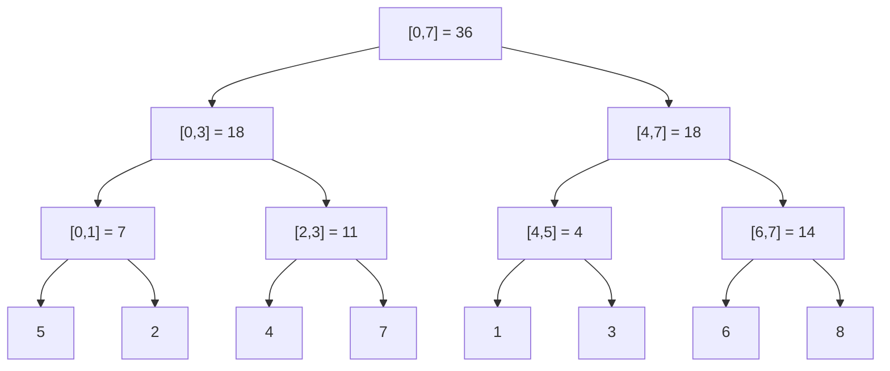

You keep a per-second request count for the last day, 86,400 integers, and a dashboard asks "how many requests between 09:14:03 and 11:02:57" a few hundred times a second while new counts land every second. A prefix-sum array answers each query with one subtraction, but every new second invalidates every later prefix, and rebuilding costs `O(n)`. A plain array makes updates free and every query `O(n)`. Both are wrong at 86,400 elements and hundreds of queries per second; both are catastrophic at a billion.

The segment tree splits the difference: `O(log n)` for a point update and `O(log n)` for a range query. It does that by storing not just the elements but a summary of every "aligned" interval, so that any query range can be assembled from at most `2 log n` of those pre-computed pieces.

## Why prefix sums stop working

Watch the prefix-sum construction and notice how much of it depends on every earlier element.

```viz
{"type": "array", "algorithm": "prefix-sum", "values": [5, 2, 4, 7, 1, 3, 6, 8],
 "title": "Prefix sums: one pass to build, one subtraction per query",
 "caption": "sum(2..5) = prefix[5] - prefix[1] = 19 - 7 = 12. Change values[2] and prefix[2..7] are all wrong."}
```

Change `values[2]` from 4 to 9 and six of the eight prefix entries move. The dependency is the problem: `prefix[i]` depends on *every* element before it. A segment tree replaces that long chain of dependencies with a tree of short ones, where each element influences only `log n` summaries.

## The structure

Take `n = 8` values `[5, 2, 4, 7, 1, 3, 6, 8]`. Build a complete binary tree whose leaves are the values and whose every internal node stores the sum of its two children.



Each node covers an interval; the root covers `[0, n-1]`, and a node covering `[l, r]` has children covering `[l, mid]` and `[mid+1, r]`. There are `n` leaves and `n - 1` internal nodes, so the tree has `2n - 1` nodes and height `⌈log₂ n⌉`.

**Point update.** Change `values[2]` to 9. Only the nodes on the path from that leaf to the root contain index 2: the leaf `[2,2]`, then `[2,3]` (11 → 16), `[0,3]` (18 → 23), `[0,7]` (36 → 41). That is `log n + 1` nodes, and the update is `O(log n)`.

**Range query.** Ask for `sum(2..5)`. Walk down from the root and, at each node, one of three things happens:

- the node's interval lies entirely inside `[2,5]`: take its stored sum and stop;
- the node's interval is entirely outside: contribute 0 and stop;
- it straddles the boundary: recurse into both children.

For `[2,5]`: root straddles → `[0,3]` straddles → `[0,1]` outside, `[2,3]` inside (take 11) → `[4,7]` straddles → `[4,5]` inside (take 4), `[6,7]` outside. Answer: 15. Two stored nodes covered a range of four elements.

The key claim is that a query never takes more than about `2 log n` nodes. At each level of the tree, the query range `[l, r]` can only partially overlap two nodes: the one containing `l` and the one containing `r`. Everything strictly between them is fully inside and gets taken whole; everything else is fully outside and gets pruned. So at most two nodes per level are recursed into, which is `O(log n)` work overall.

## The recursive implementation

Store the tree in an array. Node `i` has children `2i` and `2i + 1` (1-indexed), and the root is node 1. With `n` leaves the array needs at most `4n` entries when `n` is not a power of two, which is the number most people allocate and then feel vaguely guilty about; the next section removes the waste.

```python
class SegmentTree:
    def __init__(self, values):
        self.n = len(values)
        self.tree = [0] * (4 * self.n)
        self._build(1, 0, self.n - 1, values)

    def _build(self, node, lo, hi, values):
        if lo == hi:
            self.tree[node] = values[lo]
            return
        mid = (lo + hi) // 2
        self._build(2 * node, lo, mid, values)
        self._build(2 * node + 1, mid + 1, hi, values)
        self.tree[node] = self.tree[2 * node] + self.tree[2 * node + 1]

    def update(self, i, value):
        self._update(1, 0, self.n - 1, i, value)

    def _update(self, node, lo, hi, i, value):
        if lo == hi:
            self.tree[node] = value
            return
        mid = (lo + hi) // 2
        if i <= mid:
            self._update(2 * node, lo, mid, i, value)
        else:
            self._update(2 * node + 1, mid + 1, hi, i, value)
        self.tree[node] = self.tree[2 * node] + self.tree[2 * node + 1]

    def query(self, l, r):
        return self._query(1, 0, self.n - 1, l, r)

    def _query(self, node, lo, hi, l, r):
        if r < lo or hi < l:          # entirely outside
            return 0
        if l <= lo and hi <= r:       # entirely inside
            return self.tree[node]
        mid = (lo + hi) // 2
        return (self._query(2 * node, lo, mid, l, r)
                + self._query(2 * node + 1, mid + 1, hi, l, r))
```

Build is `O(n)`: every node is visited once. This is the version to reach for when the query logic is non-trivial (finding the first index whose prefix sum exceeds a threshold, for instance), because the interval `[lo, hi]` is right there in the recursion and you can make decisions with it.

## The iterative implementation

Recursion costs a function call per node, and in Python that is the dominant cost. The bottom-up version uses exactly `2n` array slots, no recursion, and runs three to five times faster in practice. It is also the one you can type in ninety seconds under interview pressure.

Place the `n` leaves at indices `n .. 2n-1`. Node `i` is the parent of `2i` and `2i+1`, so the parent of leaf `n + k` is `(n + k) // 2`. Build by filling the internal nodes from `n - 1` down to 1.

```python
class SegmentTree:
    def __init__(self, values):
        self.n = len(values)
        self.tree = [0] * (2 * self.n)
        self.tree[self.n:] = values
        for i in range(self.n - 1, 0, -1):
            self.tree[i] = self.tree[2 * i] + self.tree[2 * i + 1]

    def update(self, i, value):
        i += self.n
        self.tree[i] = value
        while i > 1:
            i //= 2
            self.tree[i] = self.tree[2 * i] + self.tree[2 * i + 1]

    def query(self, l, r):                 # inclusive [l, r]
        res = 0
        l += self.n
        r += self.n + 1                    # half-open [l, r)
        while l < r:
            if l & 1:                      # l is a right child: take it, step past
                res += self.tree[l]
                l += 1
            if r & 1:                      # r is a right child: step back, take it
                r -= 1
                res += self.tree[r]
            l //= 2
            r //= 2
        return res
```

The query loop deserves a trace, because it looks like magic until you see it once. Query `sum(2..5)` on the eight-element tree above (`n = 8`, leaves at 8..15):

| step | `l` | `r` | action | `res` |
|---|---|---|---|---|
| start | 10 | 14 | `l` even, `r` even: neither is a right child | 0 |
| up | 5 | 7 | `l` odd: take node 5 (= `[2,3]` = 11), `l` → 6; `r` odd: `r` → 6, take node 6 (= `[4,5]` = 4) | 15 |
| up | 3 | 3 | `l == r`, stop | 15 |

Node 5 covers `[2,3]` and node 6 covers `[4,5]`, the same two nodes the recursive walk found. The invariant is that `[l, r)` is always the part of the query not yet accounted for, expressed at the current level of the tree. When `l` is a right child, its parent covers more than the query, so you take `l` itself and move `l` right; when `r` (exclusive) is a right child, the node just before it, `r - 1`, is a left child that is fully inside, so you take it and move `r` left. Then both move up a level.

One subtlety makes the iterative version quietly robust: it works for any `n`, not just powers of two. The tree is not a "proper" binary tree when `n` is, say, 6 (some nodes at index `i` have children that live on different levels), but the query invariant only relies on the parent relationship `i → 2i, 2i+1`, which holds regardless. Sum, min, max, gcd, XOR and any other associative *and commutative* operation work unchanged. For non-commutative operations (matrix products, string concatenation) you must accumulate left and right parts separately and combine them at the end.

## Memory layout and cache behaviour

The array form is not just a convenience. The recursive tree with `4n` entries and the iterative one with `2n` both lay siblings next to each other, so a parent's two children share a cache line and the walk up the tree touches `log n` cache lines rather than `log n` random heap allocations. A pointer-based node class with `left`/`right` fields costs three to four times the memory and, more importantly, turns every step into a dependent pointer load. For `n = 10⁷` that is the difference between a query that runs in a microsecond and one that runs in ten.

For the same reason, if you need a segment tree over 2D data (range sums in a grid), do not nest node objects; nest arrays, or better, use a Fenwick tree of Fenwick trees, which the [next-but-one lesson](/learn/advanced-data-structures/range-queries/fenwick-trees) covers.

## Choosing the operation

The tree stores a *summary* per node and needs one function to combine two summaries. The summary does not have to be a single number.

| Query | Node stores | Combine |
|---|---|---|
| range sum | sum | `a + b` |
| range min / max | min / max | `min(a, b)` |
| range gcd | gcd | `gcd(a, b)` |
| count of elements equal to the min | `(min, count)` | smaller min wins; equal mins add counts |
| max subarray sum in a range | `(total, best_prefix, best_suffix, best)` | `best = max(a.best, b.best, a.suffix + b.prefix)` |
| "is the range sorted" | `(first, last, sorted)` | `sorted = a.sorted and b.sorted and a.last <= b.first` |

The last two are where segment trees stop being a Fenwick tree in disguise and become genuinely powerful. Anything that is *associative* can be summarised this way, and that includes composing functions: a node can store "the linear map this interval applies", which is how range-affine-update segment trees work.

## Where you meet them in production

- **Time-series stores and monitoring.** Prometheus-style engines answer `sum_over_time(metric[5m])` across enormous ranges; the storage layer keeps pre-aggregated chunks at several resolutions, which is a segment tree flattened onto disk. The same idea (multi-resolution summaries, `O(log n)` chunks per query) is what makes zooming a Grafana graph feel instant.
- **Order books and matching engines.** An exchange keeps volume per price level and needs "total resting volume below price p" as prices update thousands of times a second. That is a point update plus a prefix query, and a segment or Fenwick tree keyed by price tick is the standard answer.
- **Leaderboards.** "What rank is player X" with scores changing constantly is a prefix count over a frequency array indexed by score. Redis's `ZRANK` uses a skip list with span counts, which is another way to make rank an `O(log n)` walk; a segment tree over bucketed scores is what you build when scores are bounded integers and you want it in your own service.
- **Columnar databases.** Parquet, ClickHouse and Snowflake keep min/max per block of rows so a `WHERE ts BETWEEN` can skip blocks whose summary rules them out. That is one level of a segment tree, the level where a block is the leaf; the [sparse table lesson](/learn/advanced-data-structures/range-queries/sparse-tables-and-sqrt-decomposition) makes that connection precise.

## In interviews

The tell is a combination: an array, repeated range queries, and updates between the queries. Say the three costs out loud: "prefix sums are `O(1)` query but `O(n)` update; a plain array is the reverse; a segment tree makes both `O(log n)` at the cost of `O(n)` extra memory and `O(n)` build". If updates never happen, say so and use prefix sums; the interviewer wants to hear you *not* over-engineer.

Then ask what the query is, because that decides whether a Fenwick tree (simpler, faster, less memory) will do. Sum, count and XOR are invertible, so a Fenwick tree works; min and max are not, so you need the segment tree.

Try the exercise now, and then contrast it with [Range Sum Query Immutable](/practice/range-sum-query-immutable), where the absence of updates makes the tree unnecessary, and [Sliding Window Maximum](/practice/sliding-window-maximum), where a monotonic deque beats the tree because the windows move in one direction.

## Exercise

```exercise
id: segment-tree-range-sum
title: Implement a segment tree with point update and range sum
prompt: |
  Implement `SegmentTree` with three methods:

  - `build(values)` — initialise the tree from a non-empty list of integers.
  - `update(i, value)` — set element `i` to `value`.
  - `query(l, r)` — return the sum of elements `l..r` inclusive.

  Both `update` and `query` must be O(log n). Use the iterative 2n-array
  layout or the recursive one; both are accepted. The tests replay a
  sequence of calls and compare the returned values (`build` and `update`
  return nothing).
languages: [python, javascript]
entry: SegmentTree
starter:
  python: |
    class SegmentTree:
        def build(self, values):
            self.n = len(values)
            self.tree = [0] * (2 * self.n)
            # TODO: place leaves at n..2n-1 and fill parents

        def update(self, i, value):
            # TODO: set the leaf, then recompute ancestors
            pass

        def query(self, l, r):
            # TODO: inclusive range sum
            return 0
  javascript: |
    class SegmentTree {
      build(values) {
        this.n = values.length;
        this.tree = new Array(2 * this.n).fill(0);
        // TODO: place leaves at n..2n-1 and fill parents
      }
      update(i, value) {
        // TODO: set the leaf, then recompute ancestors
      }
      query(l, r) {
        // TODO: inclusive range sum
        return 0;
      }
    }
tests:
  - args: [["build",[1,3,5,7,9,11]],["query",1,3],["update",1,10],["query",1,3],["query",0,5]]
    expected: [null, 15, null, 22, 43]
  - args: [["build",[5]],["query",0,0],["update",0,-2],["query",0,0]]
    expected: [null, 5, null, -2]
    label: single element
  - args: [["build",[2,4,6,8,10,12,14]],["query",0,6],["query",3,3],["query",2,5]]
    expected: [null, 56, 8, 36]
    label: n is not a power of two
  - args: [["build",[-1,-2,-3,4]],["query",0,3],["update",3,-4],["query",0,3],["query",1,2]]
    expected: [null, -2, null, -10, -5]
    label: negative values
  - args: [["build",[1,2,3,4,5,6,7,8,9,10]],["query",0,9],["update",9,0],["query",5,9],["update",0,100],["query",0,4]]
    expected: [null, 55, null, 30, null, 114]
    hidden: true
  - args: [["build",[0,0,0,0,0]],["update",2,5],["update",4,7],["query",0,4],["query",3,4],["query",0,1]]
    expected: [null, null, null, 12, 7, 0]
    hidden: true
    label: updates on a zero array
hints:
  - "Leaf i lives at tree[n + i]; the parent of index j is j // 2 (j >> 1 in JS)."
  - "For the query, convert to a half-open range: l += n, r += n + 1, then loop while l < r; when l is odd take tree[l] and increment l; when r is odd decrement r and take tree[r]; then halve both."
  - "Do not assume n is a power of two; the parent relation j -> 2j, 2j+1 is all the loop needs."
```

## Senior signals

- You state the three-way trade-off (prefix sums, plain array, segment tree) with costs before writing any code, and you pick prefix sums when there are no updates.
- You know the iterative `2n` layout and can explain *why* the odd/even test in the query loop is correct, not just that it works.
- You choose a Fenwick tree when the operation is invertible and a segment tree when it is not (min, max, gcd, "sorted?").
- You describe the node summary as a small struct and can design one for a non-trivial query such as maximum subarray sum.
- You explain the memory-layout argument: array-backed trees keep siblings adjacent and walk `log n` cache lines; pointer-backed nodes turn every step into a dependent load.
- You connect the structure to multi-resolution aggregation in monitoring systems and min/max block summaries in columnar storage.

## Check yourself

```quiz
- q: >-
    An array of 1,000,000 elements receives 50,000 point updates and 50,000 range-sum queries, interleaved. Which structure minimises total work?
  options: ["Prefix-sum array, rebuilt after each update", "Plain array, scanning each query", "A segment tree or Fenwick tree", "A hash map from range to sum"]
  answer: 2
  explanation: >-
    Rebuilding prefix sums costs 50,000 × 10⁶ operations; scanning costs the same order for queries. A log-time structure does 100,000 × 20 ≈ 2 million operations. A hash map keyed by range cannot be kept consistent under updates.
- q: >-
    Why can a range query on a segment tree never touch more than about 2 log n nodes?
  options: ["Because the tree has only 2n nodes in total", "Because at each level only the nodes containing the two boundaries of the range can be partially covered; everything else is taken whole or skipped", "Because the query is memoised", "Because each node stores the answer for every sub-range"]
  answer: 1
  explanation: >-
    At any level the query range partially overlaps at most two nodes (the ones containing l and r). Fully covered nodes are taken in O(1) and fully outside nodes are pruned, so recursion continues into at most two nodes per level.
- q: >-
    You need range minimum with point updates. Which of these is NOT a valid reason to prefer a segment tree over a Fenwick tree here?
  options: ["Min has no inverse, so prefix-min differences cannot recover a range min", "A Fenwick tree only answers prefix queries directly", "A segment tree uses less memory than a Fenwick tree", "The segment tree's node interval is available during the walk, which helps with 'first index where…' queries"]
  answer: 2
  explanation: >-
    A Fenwick tree uses n+1 integers; a segment tree uses 2n or 4n. The other three are exactly why min/max queries need the segment tree.
- q: >-
    In the iterative query loop, l and r are converted to leaf indices and the range is made half-open. At some level l is odd. What does that mean and what happens?
  options: ["l is a right child, so its parent covers elements left of the query; take tree[l] and move l one step right before going up", "l is a leaf, so the loop terminates", "l is a left child, so its parent is fully inside the query", "The range is empty"]
  answer: 0
  explanation: >-
    Odd indices are right children. Their parent also covers the left sibling, which lies outside [l, r), so the node itself must be taken now. Incrementing l then makes l // 2 point at the next parent that is still a candidate.
- q: >-
    A colleague implements the tree with a Node class holding left/right pointers and reports queries are 8× slower than your array version at n = 10⁷. The most likely cause is:
  options: ["Python recursion is slower than iteration", "Each step follows a pointer to a separate heap allocation, so a query is log n cache misses rather than a few cache lines", "The pointer version has O(n log n) build time", "Garbage collection runs during every query"]
  answer: 1
  explanation: >-
    Both versions do O(log n) steps; the difference is memory locality. Siblings in an array share cache lines; separately allocated nodes scatter across the heap and each hop is a dependent load that the CPU cannot prefetch.
```
