Your rate limiter tracks per-user request counts in one-minute buckets, and a policy change says "add 50 to the allowance for every bucket between 08:00 and 20:00 for the next month". That is a *range update*: one instruction that touches 720 buckets. The segment tree from the [previous lesson](/learn/advanced-data-structures/range-queries/segment-trees) handles a point update in `O(log n)`, but applying it 720 times is `O(k log n)`, and when `k` is a million buckets the whole point of the tree evaporates.

The fix is to not do the work. A range update on `[l, r]` is recorded on the `O(log n)` nodes that exactly cover `[l, r]`, as a *pending* value, and the pending value is pushed one level down only when a later operation needs to look inside that node. The amortised cost of every operation stays `O(log n)`, and the bookkeeping is where nearly every implementation goes wrong.

## The difference-array intuition

For range *add* with only *point* queries there is a much simpler trick, and understanding it explains why the lazy tree works.

```viz
{"type": "array", "algorithm": "prefix-sum", "values": [0, 5, 0, 0, -5, 0, 3, 0],
 "title": "A difference array: range add becomes two point updates",
 "caption": "diff = [0,5,0,0,-5,0,3,0] encodes 'add 5 to [1,3]' and 'add 3 to [6,7]'. Its prefix sums are the actual values: [0,5,5,5,0,0,3,3]."}
```

To add `v` to every element of `[l, r]`, set `diff[l] += v` and `diff[r+1] -= v`. The real array is the prefix sum of `diff`. So range add costs `O(1)` and a point read costs a prefix sum, which a Fenwick tree makes `O(log n)`. Two point updates encode a range update because the effect of the add "starts" at `l` and "stops" after `r`; the elements in between never need to be touched.

Lazy propagation is that idea generalised: record the update at the boundary of the region it affects and let it flow inward only when needed. The difference is that the segment tree has to answer *range* sums too, so each node needs to know the total effect of updates that have not yet reached its children.

## Two values per node

Each node keeps two things:

- `sum[node]`: the correct sum of its interval, *including* every update recorded at this node or above it;
- `lazy[node]`: a pending add that has been applied to this node's `sum` but not yet to its children.

The invariant is: **a node's `sum` is always correct for its own interval; its children may be stale by exactly `lazy[node]` per element.**

Take `[1, 2, 3, 4, 5, 6, 7, 8]` and apply "add 10 to `[2, 5]`". The nodes exactly covering `[2,5]` are `[2,3]` and `[4,5]`. Each gets `sum += 10 × 2` and `lazy = 10`. Their ancestors `[0,3]`, `[4,7]` and `[0,7]` get `sum += 10 × (number of elements of [2,5] they contain)`: `[0,3]` gains 20, `[4,7]` gains 20, the root gains 40. Nothing below `[2,3]` or `[4,5]` is touched.

```mermaid
flowchart TD
    R["[0,7] sum 76 (was 36)"] --> A["[0,3] sum 30 (was 10)"]
    R --> B["[4,7] sum 46 (was 26)"]
    A --> C["[0,1] sum 3"]
    A --> D["[2,3] sum 27, lazy 10"]
    B --> E["[4,5] sum 31, lazy 10"]
    B --> F["[6,7] sum 15"]
    D --> L2["3 (stale)"] & L3["4 (stale)"]
    E --> L4["5 (stale)"] & L5["6 (stale)"]
```



Now query `sum(3, 3)`. The walk reaches `[2,3]`, which straddles the query, so it must descend. Before it does, it *pushes* its lazy value down: both children get `sum += 10 × 1`, both children get `lazy += 10` (they are leaves, so nothing further happens), and `lazy[[2,3]]` resets to 0. The leaf `[3,3]` now reads 14, which is correct.

Notice what did not happen: the leaves under `[4,5]` are still stale. They will stay stale until some operation needs to see them, which might be never. That is the whole saving.

## The implementation

```python
class LazySegmentTree:
    def __init__(self, values):
        self.n = len(values)
        self.sum = [0] * (4 * self.n)
        self.lazy = [0] * (4 * self.n)
        self._build(1, 0, self.n - 1, values)

    def _build(self, node, lo, hi, values):
        if lo == hi:
            self.sum[node] = values[lo]
            return
        mid = (lo + hi) // 2
        self._build(2 * node, lo, mid, values)
        self._build(2 * node + 1, mid + 1, hi, values)
        self.sum[node] = self.sum[2 * node] + self.sum[2 * node + 1]

    def _apply(self, node, lo, hi, delta):
        """Apply 'add delta to every element of [lo, hi]' to this node only."""
        self.sum[node] += delta * (hi - lo + 1)
        self.lazy[node] += delta

    def _push(self, node, lo, hi):
        """Move this node's pending add down to its children."""
        if self.lazy[node] != 0 and lo != hi:
            mid = (lo + hi) // 2
            self._apply(2 * node, lo, mid, self.lazy[node])
            self._apply(2 * node + 1, mid + 1, hi, self.lazy[node])
            self.lazy[node] = 0

    def add(self, l, r, delta):
        self._add(1, 0, self.n - 1, l, r, delta)

    def _add(self, node, lo, hi, l, r, delta):
        if r < lo or hi < l:
            return
        if l <= lo and hi <= r:
            self._apply(node, lo, hi, delta)
            return
        self._push(node, lo, hi)
        mid = (lo + hi) // 2
        self._add(2 * node, lo, mid, l, r, delta)
        self._add(2 * node + 1, mid + 1, hi, l, r, delta)
        self.sum[node] = self.sum[2 * node] + self.sum[2 * node + 1]

    def query(self, l, r):
        return self._query(1, 0, self.n - 1, l, r)

    def _query(self, node, lo, hi, l, r):
        if r < lo or hi < l:
            return 0
        if l <= lo and hi <= r:
            return self.sum[node]
        self._push(node, lo, hi)
        mid = (lo + hi) // 2
        return (self._query(2 * node, lo, mid, l, r)
                + self._query(2 * node + 1, mid + 1, hi, l, r))
```

Three details carry the correctness:

1. `_apply` updates `sum` *and* `lazy` together. The node's own sum becomes correct immediately; the pending flag is a promise to its children.
2. `_push` is called in both `_add` and `_query` **before** descending into a node that is only partially covered. If you descend without pushing, the children's sums are stale and the recomputed `sum[node] = sum[left] + sum[right]` after the recursive add *loses the pending update*. This is the bug that produces answers that are right for a while and then drift.
3. After the recursive `_add` returns, the parent's sum is recomputed from the children, which are now correct (they were pushed to and then updated).

The complexity argument is the same as the plain segment tree: an update touches `O(log n)` fully covered nodes, plus `O(log n)` partially covered ancestors that get pushed. Each push is `O(1)`. Query is identical. So both are `O(log n)`, not amortised, genuinely worst-case.

## Range assign, and mixing update types

Range *add* is the easy case because adds compose by addition: two pending adds of 3 and 5 are one pending add of 8. Range **assign** ("set every element in `[l, r]` to `v`") is different: a pending assign overwrites, and a pending add applied on top of a pending assign must be folded into it.

The clean way is to make the lazy value a small *function* and define composition explicitly. With `(mul, add)` representing `x → mul·x + add`:

- add `d` is `(1, d)`;
- assign `v` is `(0, v)`;
- composing "first `(m₁, a₁)`, then `(m₂, a₂)`" gives `(m₁·m₂, a₁·m₂ + a₂)`.

Applying `(mul, add)` to a node of length `len` does `sum = mul·sum + add·len`. This single representation handles add, assign, and multiply, and the composition rule is the only place you have to think. The failure mode when people skip this is a tree with separate `lazy_add` and `lazy_set` fields and an ad hoc "if set is pending then…" branch in `_push` that is wrong in one of the four orderings.

For range *min* with range add, the node stores `min` and `_apply` does `min += delta`. For range min with range assign, `_apply` does `min = v`. For range *sum* with range assign, `_apply` does `sum = v × len`. The pattern is always: decide what `_apply` does to the summary and to the pending value, and decide how two pending values compose. Everything else is the plain segment tree.

## The three bugs

In order of frequency, from reviewing a great many broken submissions:

**Descending without pushing.** Already described. The symptom: a query immediately after an update is correct; a query after a second, overlapping update is wrong. Rule: every path that moves from a node to its children goes through `_push` first, in updates *and* queries.

**Off-by-one on half-open versus closed ranges.** The recursive code above uses closed intervals `[lo, hi]` and `mid+1` for the right child. The iterative segment tree uses half-open `[l, r)`. Copying the `_apply` length calculation `hi - lo + 1` into a half-open implementation, or vice versa, gives sums that are off by exactly `delta` per update. If you see errors that are multiples of the update value, this is the bug.

**Applying the lazy value to `sum` but not to the children's `lazy`.** `_push` must both fix the children's sums *and* set their pending flags, otherwise the grandchildren never learn about the update. The symptom is that queries covering whole subtrees are right and queries on individual leaves are wrong.

A less common fourth: forgetting that `_push` on a leaf should do nothing. If `lo == hi` and you push to `2·node`, you write outside the meaningful region of the array (harmless with `4n` allocation, a crash with `2n`).

## Why the iterative version is harder

The bottom-up `2n` segment tree from the previous lesson has no natural "descend" step, so there is no obvious moment to push. The standard fix is to push *all* ancestors of both boundary leaves top-down before an operation (walk from the root down to `l + n` and `r + n`, pushing at each level), then run the usual bottom-up loop, then recompute those same ancestors bottom-up afterwards. It works, it is about twice as fast as the recursive version in tight loops, and it is also about twice as easy to get wrong. Unless you are in a competitive-programming setting where the constant factor matters, write the recursive version: the interval `[lo, hi]` being visible in every call is what keeps the push logic honest.

## Where it shows up

- **Rate limiting and quota systems** with time-bucketed allowances: "raise the limit for all buckets in this window" is a range add over the bucket array.
- **Scheduling and calendar systems**: "is any slot between 09:00 and 11:00 busy" with bookings that reserve ranges is range assign plus range max (or range sum of booked minutes).
- **Interval colouring problems** on a canvas or a genome browser, where "paint `[l, r]` colour `c`" is range assign and "what colour is position `x`" is a point query.
- **Distributed counters that batch**. Some metrics pipelines accumulate "add `d` to every series matching this label" as a pending operation and resolve it at read time; that is lazy propagation across a service boundary, with the same invariant (the aggregate is correct, the leaves are stale until read).

Note that in each case the lazy tree is only worth it when *both* the update and the query are ranges. With range update and point query, use a difference array over a Fenwick tree ([next lesson](/learn/advanced-data-structures/range-queries/fenwick-trees)). With point update and range query, use the plain segment tree.

## Exercise

```exercise
id: lazy-range-add-range-sum
title: Range add and range sum with lazy propagation
prompt: |
  Implement `LazySegmentTree` with:

  - `build(values)` — initialise from a non-empty list of integers.
  - `add(l, r, delta)` — add `delta` to every element in `l..r` inclusive.
  - `sum(l, r)` — return the sum of elements `l..r` inclusive.

  Both `add` and `sum` must be O(log n) regardless of the range length.
  A solution that loops over the range in `add` will pass the small tests
  but is not what the exercise is about; write the lazy version.
languages: [python, javascript]
entry: LazySegmentTree
starter:
  python: |
    class LazySegmentTree:
        def build(self, values):
            self.n = len(values)
            self.tot = [0] * (4 * self.n)
            self.lazy = [0] * (4 * self.n)
            # TODO: recursive build from values

        def add(self, l, r, delta):
            # TODO: apply to fully covered nodes; push before descending
            pass

        def sum(self, l, r):
            # TODO: push before descending into partially covered nodes
            return 0
  javascript: |
    class LazySegmentTree {
      build(values) {
        this.n = values.length;
        this.tot = new Array(4 * this.n).fill(0);
        this.lazy = new Array(4 * this.n).fill(0);
        // TODO: recursive build from values
      }
      add(l, r, delta) {
        // TODO: apply to fully covered nodes; push before descending
      }
      sum(l, r) {
        // TODO: push before descending into partially covered nodes
        return 0;
      }
    }
tests:
  - args: [["build",[1,2,3,4,5]],["sum",0,4],["add",1,3,10],["sum",0,4],["sum",2,2],["sum",3,4]]
    expected: [null, 15, null, 45, 13, 19]
  - args: [["build",[0,0,0,0]],["add",0,3,1],["add",0,3,1],["sum",0,3],["add",1,2,5],["sum",0,0],["sum",1,1],["sum",1,3]]
    expected: [null, null, null, 8, null, 2, 7, 16]
    label: stacked range adds
  - args: [["build",[5]],["add",0,0,-5],["sum",0,0]]
    expected: [null, null, 0]
    label: single element
  - args: [["build",[1,1,1,1,1,1,1,1]],["add",0,7,2],["add",2,5,3],["sum",0,7],["sum",1,2],["add",4,7,-1],["sum",4,7],["sum",0,7]]
    expected: [null, null, null, 36, 9, null, 14, 32]
    label: overlapping ranges
  - args: [["build",[3,-1,4,1,-5,9,2,-6]],["sum",0,7],["add",2,6,10],["sum",2,6],["sum",0,7],["add",0,7,-2],["sum",1,4],["sum",7,7]]
    expected: [null, 7, null, 61, 57, null, 21, -8]
    hidden: true
  - args: [["build",[1,2,3,4,5,6,7,8]],["add",0,7,1],["sum",3,3],["sum",4,6],["add",3,4,10],["sum",3,4],["sum",0,7]]
    expected: [null, null, 5, 21, null, 31, 64]
    hidden: true
    label: point query after a whole-array add forces a push
hints:
  - "Keep tot[node] correct for its own interval at all times; lazy[node] is the add not yet applied to the children."
  - "Write apply(node, lo, hi, delta) that does tot += delta * (hi - lo + 1) and lazy += delta, and push(node, lo, hi) that applies lazy[node] to both children then clears it."
  - "Call push before recursing into a partially covered node, in both add and sum; then recompute tot[node] from the children after the recursive add."
```

## Senior signals

- You explain lazy propagation as "record the update at the boundary of the region, push it inward only on demand", and you can relate it to the difference-array trick.
- You state the invariant precisely: a node's summary is always correct; only its children may be stale, by exactly the node's pending value.
- You represent pending updates as a composable function `(mul, add)` when more than one update type exists, rather than special-casing add versus assign.
- You know the three classic bugs and the symptom of each, and you test with two overlapping updates followed by a single-element query.
- You pick the difference array or a plain segment tree when only one side of the operation is a range, and you say why.

## Check yourself

```quiz
- q: >-
    After "add 10 to [2,5]" on an 8-element tree, which nodes have a non-zero lazy value?
  options: ["Every node on the paths from leaves 2 and 5 up to the root", "Only the root, which holds the pending add for the whole tree", "Only [2,3] and [4,5], the nodes that exactly cover [2,5]", "Every leaf from 2 to 5, since those are the updated elements"]
  answer: 2
  explanation: >-
    Fully covered nodes receive the update as a pending value and stop. Their ancestors have their sums corrected but no pending value, because their other children were not affected. The leaves are untouched and stale.
- q: >-
    A lazy tree returns correct sums after one range update but wrong sums after a second update that overlaps the first. The most likely bug is:
  options: ["The build step computes internal sums from the wrong children", "Closed and half-open intervals are mixed in the length calculation", "A partially covered node is descended into without a push first", "The tree allocates 4n array slots where 2n would be correct"]
  answer: 2
  explanation: >-
    The first update is recorded as a pending value; the second update descends through that node without pushing, recomputes its sum from stale children, and loses the first update. Pushing before descending prevents it. A closed/half-open mix-up would already give wrong sums after the first update, off by a multiple of the delta.
- q: >-
    You need range assign and range add on the same tree. The robust approach is:
  options: ["Rebuild the whole tree from scratch whenever an assign arrives", "Turn every assign into an add by first reading the current values", "Model pending updates as x -> mul*x + add and compose them", "Keep separate lazy add and assign arrays, branching on them in push"]
  answer: 2
  explanation: >-
    Add is (1, d), assign is (0, v), and composing two updates has one formula. Separate flags require handling four orderings and usually get one wrong; reading current values makes assign O(n).
- q: >-
    Your updates are all range adds but your queries are all single-element reads. What should you use?
  options: ["A plain segment tree with point updates", "A Fenwick tree over a difference array", "A prefix-sum array rebuilt per update", "A lazy segment tree with range add"]
  answer: 1
  explanation: >-
    Range add becomes two point updates on a difference array, and a point read is a prefix sum; a Fenwick tree gives O(log n) for both with far less code and memory than a lazy tree. A plain segment tree with point updates would need O(n) point updates per range add.
- q: >-
    Why is the cost of a lazy range update O(log n) worst-case rather than amortised?
  options: ["It is amortised; one update may still have to touch O(n) nodes", "Pushes are batched and flushed together at the next query", "The walk touches O(log n) nodes per update, each with O(1) work", "The tree is rebalanced after each update to keep it shallow"]
  answer: 2
  explanation: >-
    The walk visits at most O(log n) fully covered nodes and O(log n) partially covered ancestors, the same two-nodes-per-level argument as a query, and each push is constant time regardless of history. No operation ever cascades further than that, so no single update can cost O(n).
```
