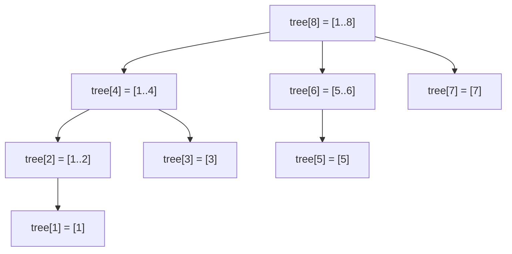

A segment tree answers range sums with updates in `O(log n)`, but it costs `2n` to `4n` integers, a recursive or slightly fiddly iterative walk, and a build step. For the most common case, sums (or anything with an inverse: counts, XOR, products modulo a prime), there is a structure that does the same job in `n + 1` integers with two five-line loops. Peter Fenwick described it in 1994 for the cumulative frequency tables of arithmetic coding, and it is the structure every competitive programmer types from memory and every backend engineer rediscovers when building a leaderboard.

The trick is to let the binary representation of an index decide which partial sums that index is responsible for. This lesson lists the exact cells each query and update touches for concrete indices, explains why the indices start at 1, extends the structure to range updates (one tree and two trees), to two dimensions and to a `bisect`-style k-th element search, and ends with AtCoder's implementation and measured costs.

## The idea: each index owns a power-of-two-length block

Use 1-based indices. Define `lowbit(i) = i & -i`, the value of the lowest set bit of `i`: `lowbit(12) = 4` because `12 = 1100₂`, `lowbit(6) = 2`, `lowbit(8) = 8`, `lowbit(7) = 1`.

```viz
{"type": "bits", "algorithm": "and-or-xor", "a": 12, "b": 4,
 "title": "lowbit(12) = 12 & -12 = 4",
 "caption": "In two's complement, -12 flips every bit above the lowest set bit and keeps that bit, so 12 & -12 isolates it: 1100 & 0100 = 0100."}
```

Cell `tree[i]` stores the sum of the `lowbit(i)` elements ending at position `i`, that is, `values[i − lowbit(i) + 1 .. i]`.

| `i` | binary | `lowbit(i)` | `tree[i]` covers |
|---|---|---|---|
| 1 | 0001 | 1 | `[1, 1]` |
| 2 | 0010 | 2 | `[1, 2]` |
| 3 | 0011 | 1 | `[3, 3]` |
| 4 | 0100 | 4 | `[1, 4]` |
| 5 | 0101 | 1 | `[5, 5]` |
| 6 | 0110 | 2 | `[5, 6]` |
| 7 | 0111 | 1 | `[7, 7]` |
| 8 | 1000 | 8 | `[1, 8]` |

Odd indices cover one element. Multiples of 2 but not 4 cover two. Multiples of 4 but not 8 cover four. Every element is covered by at most `⌊log₂ n⌋ + 1` cells, and the cells nest like a segment tree with every right child deleted: `tree[i]` is exactly the node whose interval ends at `i`.



## Why the indices start at 1

`lowbit(0) = 0`. Cell 0 would own the block `(0 − 0, 0]`, which is empty, and the update loop `i += i & -i` would add 0 forever: a 0-based index passed to a 1-based `add` is an infinite loop, not an exception. In the 1-based layout, 0 is the empty prefix: `prefix(0) = 0`, and reaching it is what stops the query loop.

A 0-based variant exists. It lets `tree[i]` cover `[i & (i + 1), i]` (clear the trailing ones), walks queries with `i = (i & (i + 1)) − 1` and updates with `i |= i + 1`. For 0-based index 6 (`110₂`) the query visits 6 (`[6, 6]`), 5 (`[4, 5]`), 3 (`[0, 3]`) and stops at −1; an update at 2 visits 2, 3, 7, 15. It works, but the two loops are no longer mirror images, which is why almost every implementation keeps 1-based arithmetic inside and converts at the boundary. AtCoder's library does exactly that: its public API is 0-based and half-open, and `add(p, x)` starts with `p++` and writes `data[p − 1]`, so the storage has `n` cells, not `n + 1`.

## Prefix query: strip the lowest bit

To compute `prefix(i) = values[1] + … + values[i]`, take `tree[i]` (a block ending at `i`), jump to the block immediately before it, which ends at `i − lowbit(i)`, and repeat until `i` hits 0.

```python
def prefix(tree, i):          # sum of values[1..i]; tree[0] is unused
    s = 0
    while i > 0:
        s += tree[i]
        i -= i & -i            # drop the lowest set bit
    return s
```

Trace `prefix(7)` on `values = [3, 1, 4, 1, 5, 9, 2, 6]` (positions 1..8), whose tree is `[3, 4, 4, 9, 5, 14, 2, 31]`:

| `i` | binary | cell covers | adds | `s` | next `i` |
|---|---|---|---|---|---|
| 7 | 0111 | `[7, 7]` | 2 | 2 | `7 − 1 = 6` |
| 6 | 0110 | `[5, 6]` | 14 | 16 | `6 − 2 = 4` |
| 4 | 0100 | `[1, 4]` | 9 | 25 | `4 − 4 = 0` |

`3 + 1 + 4 + 1 + 5 + 9 + 2 = 25`. Each step clears one set bit, so the loop runs `popcount(i)` times, at most `⌊log₂ n⌋ + 1`. The query paths for a 16-element tree:

| query | cells visited (block covered) | steps |
|---|---|---|
| `prefix(7)` | 7 `[7]`, 6 `[5,6]`, 4 `[1,4]` | 3 |
| `prefix(11)` | 11 `[11]`, 10 `[9,10]`, 8 `[1,8]` | 3 |
| `prefix(13)` | 13 `[13]`, 12 `[9,12]`, 8 `[1,8]` | 3 |
| `prefix(16)` | 16 `[1,16]` | 1 |

The blocks are disjoint and tile `[1, i]` from right to left. A range sum is two prefixes, `sum(l, r) = prefix(r) − prefix(l − 1)`, and that subtraction is the whole reason the structure needs an inverse: there is no operation that recovers `min(l..r)` from `min(1..r)` and `min(1..l − 1)`.

## Point update: add the lowest bit

To add `delta` to `values[i]`, every cell whose block contains `i` must change. The first is `i` itself; the next enclosing block ends at `i + lowbit(i)`.

```python
def add(tree, n, i, delta):   # values[i] += delta, 1-based
    while i <= n:
        tree[i] += delta
        i += i & -i            # carry into the next enclosing block
```

The update paths for a 16-element tree:

| update at | cells visited (block covered) | steps |
|---|---|---|
| 1 | 1 `[1]`, 2 `[1,2]`, 4 `[1,4]`, 8 `[1,8]`, 16 `[1,16]` | 5 |
| 3 | 3 `[3]`, 4 `[1,4]`, 8 `[1,8]`, 16 `[1,16]` | 4 |
| 5 | 5 `[5]`, 6 `[5,6]`, 8 `[1,8]`, 16 `[1,16]` | 4 |
| 6 | 6 `[5,6]`, 8 `[1,8]`, 16 `[1,16]` | 3 |
| 11 | 11 `[11]`, 12 `[9,12]`, 16 `[1,16]` | 3 |

On the eight-value tree, `add(3, 10)` visits 3, 4, 8 and turns `[3, 4, 4, 9, 5, 14, 2, 31]` into `[3, 4, 14, 19, 5, 14, 2, 41]`: three writes, and exactly the three blocks that contain position 3.

**Why `i + lowbit(i)` is the next enclosing block.** Write `i = p·2^(k+1) + 2^k`, so `lowbit(i) = 2^k`. Then `j = i + 2^k = (p + 1)·2^(k+1)`, whose lowest bit is at least `2^(k+1)`, so `j`'s block starts at or before `j − 2^(k+1) + 1 = p·2^(k+1) + 1 ≤ i`: it contains `i`. Any `t` strictly between `i` and `j` has `lowbit(t) < 2^k` and a block that starts after `i`. So the update loop visits exactly the blocks containing `i`, in increasing size, and the query loop visits disjoint blocks in decreasing position: subtract the low bit to step left, add it to step up.

## Building in O(n)

Calling `add` once per element is `O(n log n)`. The linear build places each value in its own cell and then pushes each cell's finished total into its immediate parent `i + lowbit(i)`:

```python
class Fenwick:
    def __init__(self, values):              # values is 0-based
        self.n = len(values)
        self.tree = [0] * (self.n + 1)
        for i, v in enumerate(values, start=1):
            self.tree[i] += v                  # tree[i] is now complete
            j = i + (i & -i)
            if j <= self.n:
                self.tree[j] += self.tree[i]   # hand the block to its parent

    def add(self, i, delta):                   # 1-based
        while i <= self.n:
            self.tree[i] += delta
            i += i & -i

    def prefix(self, i):                       # 1-based, prefix(0) == 0
        s = 0
        while i > 0:
            s += self.tree[i]
            i -= i & -i
        return s

    def range_sum(self, l, r):                 # 1-based, inclusive
        return self.prefix(r) - self.prefix(l - 1)

f = Fenwick([3, 1, 4, 1, 5, 9, 2, 6])
print(f.tree[1:], f.prefix(7), f.range_sum(3, 6))   # [3, 4, 4, 9, 5, 14, 2, 31] 25 19
```

Increasing `i` guarantees that `tree[i]` is complete before it is pushed, because every block nested inside it has a smaller index. The build, traced:

| `i` | `tree[i]` after adding `values[i]` | pushed to | parent after |
|---|---|---|---|
| 1 | 3 | 2 | `tree[2] = 3` |
| 2 | `3 + 1 = 4` | 4 | `tree[4] = 4` |
| 3 | 4 | 4 | `tree[4] = 8` |
| 4 | `8 + 1 = 9` | 8 | `tree[8] = 9` |
| 5 | 5 | 6 | `tree[6] = 5` |
| 6 | `5 + 9 = 14` | 8 | `tree[8] = 23` |
| 7 | 2 | 8 | `tree[8] = 25` |
| 8 | `25 + 6 = 31` | none (16 > 8) | |

Measured on CPython 3.14 at `n = 10⁶`: the linear build takes 0.08 s and a million `add` calls take 0.41 s.

## Range update, point query: one tree over differences

Store the difference array `d` in the tree instead of the values: `values[i] = d[1] + … + d[i]`. Adding `x` to `[l, r]` becomes two point updates, `add(l, x)` and `add(r + 1, −x)`, and reading `values[i]` is `prefix(i)`.

Trace on eight zeros: "add 5 to `[3, 6]`" is `add(3, 5)` (cells 3, 4, 8) and `add(7, −5)` (cells 7, 8). Then `prefix(5) = tree[5] + tree[4] = 0 + 5 = 5` and `prefix(7) = tree[7] + tree[6] + tree[4] = −5 + 0 + 5 = 0`: position 5 was inside the range, position 7 was not. An `add(r + 1, …)` with `r = n` falls off the end of the loop and does nothing, which is correct, since no position after `n` exists.

## Range update, range query: two trees

A range *sum* over a difference array needs one more tree. With `values[j] = d[1] + … + d[j]`, the prefix sum `S(i)` of the values is:

$$S(i) = \sum_{j=1}^{i} \sum_{t=1}^{j} d[t] = \sum_{t=1}^{i} d[t]\,(i - t + 1) = i \sum_{t \le i} d[t] - \sum_{t \le i} d[t]\,(t-1)$$

So keep `B1` over `d[t]` and `B2` over `d[t]·(t − 1)`: a range add touches two cells in each, and a prefix sum is `i·B1.prefix(i) − B2.prefix(i)`.

```python
class RangeFenwick:
    def __init__(self, n):
        self.b1, self.b2 = Fenwick([0] * n), Fenwick([0] * n)

    def range_add(self, l, r, x):              # 1-based, inclusive
        self.b1.add(l, x);           self.b1.add(r + 1, -x)
        self.b2.add(l, x * (l - 1)); self.b2.add(r + 1, -x * r)

    def prefix_sum(self, i):
        return i * self.b1.prefix(i) - self.b2.prefix(i)

    def range_sum(self, l, r):
        return self.prefix_sum(r) - self.prefix_sum(l - 1)

rf = RangeFenwick(8)
rf.range_add(3, 6, 5); rf.range_add(5, 8, 2)   # values: [0, 0, 5, 5, 7, 7, 2, 2]
print(rf.prefix_sum(6), rf.range_sum(4, 7))    # 24 21
```

Trace the two updates. After them `d[3] = 5`, `d[5] = 2`, `d[7] = −5` (`d[9]` fell off), and `B2` holds `5·2 = 10` at 3, `2·4 = 8` at 5 and `−5·6 = −30` at 7. Then `prefix_sum(6) = 6·(5 + 2) − (10 + 8) = 24`, which is `0 + 0 + 5 + 5 + 7 + 7`, and `prefix_sum(3) = 3·5 − 10 = 5`, `prefix_sum(7) = 7·2 − (−12) = 26`, so `range_sum(4, 7) = 21`. Measured on CPython 3.14 at `n = 10⁶`: 3.0 µs per range add and 2.7 µs per range sum, against 16.9 µs and 9.3 µs for the recursive [lazy segment tree](/learn/advanced-data-structures/range-queries/lazy-propagation) on the same workload. The price is generality: this works only because the effect of an add on a sum is linear in the index.

## Counting inversions

An inversion is a pair `i < j` with `a[i] > a[j]`; the count measures how far from sorted an array is, and it underlies ranking-correlation metrics such as Kendall's tau. Walk left to right. For each `x`, the earlier elements greater than `x` number `seen − (earlier elements ≤ x)`, and the second term is a prefix count over a frequency tree indexed by value. Values may be large or negative, so first **coordinate-compress**: replace each value by its 1-based rank among the distinct values.

```python
def count_inversions(nums):
    ranks = {v: i + 1 for i, v in enumerate(sorted(set(nums)))}   # 1-based ranks
    tree = Fenwick([0] * len(ranks))
    inversions = 0
    for seen, x in enumerate(nums):
        r = ranks[x]
        inversions += seen - tree.prefix(r)    # earlier elements strictly greater than x
        tree.add(r, 1)
    return inversions

print(count_inversions([2, 4, 1, 3, 5]))       # 3: (2,1), (4,1), (4,3)
```

Trace `[2, 4, 1, 3, 5]`: `x = 2` adds `0 − 0`; `x = 4` adds `1 − 1`; `x = 1` adds `2 − 0 = 2`; `x = 3` adds `3 − 2 = 1`; `x = 5` adds `4 − 4`. Total 3. Ranks start at 1 on purpose: a rank of 0 would send `add` into the infinite loop from the 1-indexing section. The same loop run right to left, counting smaller elements already seen, answers "count of smaller elements after each position", and it generalises to "earlier elements in a value range", which the merge-sort count from [divide and conquer](/learn/algorithms/divide-and-conquer/divide-and-conquer-thinking) does not.

## The k-th element: a bisect that survives updates

Given a tree over non-negative frequencies, "the smallest index whose prefix reaches `k`" is `bisect_left(prefix_sums, k)` on the materialised prefix array, but that array costs `O(n)` to maintain per update. Binary search over `prefix()` calls works with updates and costs `O(log² n)`. The tree itself supports an `O(log n)` descent that decides the answer one bit at a time, from the top:

```python
def kth(f, k):                    # smallest i with f.prefix(i) >= k; counts must be >= 0
    pos, step = 0, 1 << (f.n.bit_length() - 1)
    while step:
        nxt = pos + step
        if nxt <= f.n and f.tree[nxt] < k:    # block [pos+1, nxt] is still short of k
            pos, k = nxt, k - f.tree[nxt]
        step >>= 1
    return pos + 1                             # n + 1 means k exceeds the total

scores = Fenwick([2, 0, 3, 1, 0, 4, 1, 2])     # players holding each score 1..8
print(kth(scores, 7))                          # 6: the 7th-lowest score is 6
```

`pos` is always a sum of powers of two larger than `step`, so `lowbit(pos + step) = step` and `tree[pos + step]` is exactly the block `[pos + 1, pos + step]`. The trace, with the tree `[2, 2, 3, 6, 0, 4, 1, 13]` and prefix sums `[2, 2, 5, 6, 6, 10, 11, 13]`:

| `step` | try `pos + step` | block | `tree` | `< k`? | `pos` | `k` |
|---|---|---|---|---|---|---|
| 8 | 8 | `[1, 8]` | 13 | no, 13 ≥ 7 | 0 | 7 |
| 4 | 4 | `[1, 4]` | 6 | yes, absorb | 4 | 1 |
| 2 | 6 | `[5, 6]` | 4 | no, 4 ≥ 1 | 4 | 1 |
| 1 | 5 | `[5, 5]` | 0 | yes, absorb the empty block | 5 | 1 |

The answer is `pos + 1 = 6`, the same as `bisect_left([2, 2, 5, 6, 6, 10, 11, 13], 7) + 1`. Measured on CPython 3.14 at `n = 10⁶`: 1.7 µs per descent against 8.8 µs for a binary search over `prefix()`. The descent also gives **weighted random sampling with changing weights**: draw `u` uniformly from `1..total` and `kth(tree, u)` returns index `i` with probability `wᵢ / total`; changing a weight is one `add`.

## Two dimensions

A Fenwick tree of Fenwick trees answers rectangle sums with point updates: the outer loop walks the row index, the inner loop the column index, and a rectangle is four prefix rectangles by inclusion–exclusion.

```python
class Fenwick2D:
    def __init__(self, rows, cols):
        self.r, self.c = rows, cols
        self.t = [[0] * (cols + 1) for _ in range(rows + 1)]

    def add(self, x, y, delta):                # 1-based cell (x, y)
        i = x
        while i <= self.r:
            j = y
            while j <= self.c:
                self.t[i][j] += delta
                j += j & -j
            i += i & -i

    def prefix(self, x, y):                    # sum over [1..x] x [1..y]
        s, i = 0, x
        while i > 0:
            j = y
            while j > 0:
                s += self.t[i][j]
                j -= j & -j
            i -= i & -i
        return s

    def rect(self, x1, y1, x2, y2):
        return (self.prefix(x2, y2) - self.prefix(x1 - 1, y2)
                - self.prefix(x2, y1 - 1) + self.prefix(x1 - 1, y1 - 1))

g = Fenwick2D(8, 8)
g.add(3, 5, 7); g.add(6, 2, 4); g.add(8, 8, 1)
print(g.rect(1, 1, 8, 8), g.rect(3, 2, 6, 5), g.rect(4, 1, 8, 7))   # 12 11 4
```

`add(3, 5, …)` on an 8 × 8 grid touches the product of the two 1D paths, rows 3, 4, 8 by columns 5, 6, 8: nine cells. Costs grow as the square of the 1D ones: on a 4,096 × 4,096 heat map, an update or a prefix touches at most `13 × 13 = 169` cells, a rectangle is four prefixes, and the table is 16.8 million counters, 128 MiB at 8 bytes each. When the points are sparse (a million points on a `10⁹ × 10⁹` plane) the dense table is impossible; if all queries are known up front, sort points and query edges by `x` and sweep with a 1D tree over compressed `y`, which is `O((n + q) log n)` time and `O(n)` memory.

## Under the hood: AtCoder's fenwick_tree and measured costs

AtCoder's `fenwick_tree<T>` is 30 lines and makes two choices worth copying. The public API is 0-based and half-open: `add(p, x)` and `sum(l, r)` for `[l, r)`, with the `p++` conversion hidden inside, so callers never see the 1-based arithmetic. And the storage is `std::vector<U>` where `U` is the unsigned counterpart of `T`: a prefix sum that overflows in the middle of a computation wraps (defined behaviour for unsigned types in C++), and `sum(r) − sum(l)` is still exact whenever the true range sum fits in `T`. With signed storage the same intermediate overflow is undefined behaviour.

Measured on this machine (one core of a Ryzen 9 9950X3D):

| operation | CPython 3.14, `n = 10⁶` | Node 24, `Float64Array` |
|---|---|---|
| `prefix(i)`, random `i` | 0.65 µs | 13 ns at `n = 10⁶`; 21 ns at `8.4 × 10⁶`; 30 ns at `1.7 × 10⁷` |
| `add(i, 1)`, random `i` | 0.69 µs | 55–67 ns across the same sizes |
| linear build | 0.08 s | |
| `kth` descent | 1.7 µs | |
| memory | 8.0 MB of list pointers, plus int objects above 256 | 8 bytes per cell |

The Node query cost more than doubles once the array (134 MB at `1.7 × 10⁷`) outgrows the L3 cache: the last few cells of a query path are shared by every query and stay cached, but the first few, near `i`, are random misses. In CPython the interpreter dominates: a range sum is two 0.65 µs walks, about 1.3 µs, against 2.2 µs for the iterative segment tree, because each walk is a short loop with no parity tests.

## Where you meet it in production

- **Leaderboards and rank queries.** Redis `ZRANK` uses a skip list whose forward pointers carry *span* counts ([skip lists](/learn/advanced-data-structures/balanced-trees/treaps-skip-lists-and-splay)); a Fenwick tree over score buckets is what you write when scores are bounded and the ranking lives inside your process, with `kth` answering "who is at position 1,000".
- **Order books.** "Total resting volume at or below price `p`" is a prefix sum over price ticks: a point update per order and a prefix query per depth request.
- **Arithmetic coding.** Fenwick's original use: each symbol's cumulative frequency is needed to encode it, and each encoded symbol bumps a frequency.
- **Weighted sampling.** Lottery scheduling and weighted load balancing with changing weights are direct applications of the `kth(random)` descent above.

## Trade-offs

| | Prefix array | Fenwick tree | Two Fenwick trees | Segment tree | Sqrt decomposition |
|---|---|---|---|---|---|
| Operations | invertible, static | invertible: sum, count, XOR | range add + range sum | any monoid, descents | anything per block |
| Point update | `O(n)` | `O(log n)` | `O(log n)`, 4 walks | `O(log n)` | `O(1)` |
| Range query | `O(1)` | `O(log n)`, 2 walks | `O(log n)`, 4 walks | `O(log n)` | `O(√n)` |
| Memory, `n = 10⁶`, 8-byte | 8 MB | 8 MB | 16 MB | 16–32 MB | 8 MB + 8 KB |
| CPython, measured | | 0.65 µs per walk | 3.0 µs add, 2.7 µs sum | 2.2 µs range query | 6–43 µs |
| k-th / descent | `bisect` | yes, `O(log n)` | no | yes | scan blocks |

## Failure modes

| Symptom | Diagnosis | Fix |
|---|---|---|
| The process pins a core forever on the first update; no exception | A 0-based index (or a rank computed from 0) reached the 1-based `add`: `i += i & -i` adds 0 forever | Convert at the API boundary (`p + 1`, as ACL does), `assert i >= 1`, ranks from 1 |
| Range sums are short by one element at the left edge | `prefix(r) − prefix(l)` instead of `prefix(r) − prefix(l − 1)`, or half-open and closed APIs mixed | One convention per codebase; test `sum(i, i)` and the full range |
| `kth` returns an index past the end, or a position whose prefix is below `k` | `k` exceeded the total, or some frequency went negative; the descent assumes non-negative blocks | Check `1 ≤ k ≤ total`; never store negative counts in an order-statistics tree |
| Startup is five times slower than loading the data | The tree was built with `n` calls to `add`, 0.41 s against 0.08 s at `10⁶` | The linear build |
| Counts silently wrong above about 2 billion, or on huge arrays in JavaScript | 32-bit counters; in JavaScript `i & -i` is a 32-bit operation, so indices at or above `2³¹` break, and `Float64Array` sums lose exactness past `2⁵³` | 64-bit counters (`BigInt64Array` in JS), indices below `2³¹`, or ACL-style unsigned storage in C++ |
| Range minimums wrong after a value increases | A Fenwick "min tree" only works while values only decrease; there is no inverse to undo a larger old value | A segment tree |

## Interviewer follow-ups

**"For each element, count the smaller elements to its right."** Model answer: compress values to ranks, walk right to left, answer `prefix(rank − 1)` then `add(rank, 1)`: `O(n log n)`, the inversion loop mirrored. Common wrong answer: sorting a copy and binary-searching, which loses the positions the count depends on.

**"Support range add and range sum without a segment tree."** Model answer: two trees over the difference array, `B1` over `d[t]` and `B2` over `d[t]·(t − 1)`, with `prefix_sum(i) = i·B1(i) − B2(i)`; derive it from `Σ d[t]·(i − t + 1)`. Common wrong answer: "impossible with a Fenwick tree", or one tree over differences, which gives point values only.

**"Pick a server with probability proportional to its weight; weights change every second."** Model answer: a Fenwick tree over weights, `kth(random in 1..total)` per pick and `add(i, new − old)` per change, both `O(log n)`. Common wrong answer: rebuilding a cumulative array on every change, `O(n)`.

**"Why is it 1-indexed?"** Model answer: cell `i` owns `(i − lowbit(i), i]`, and `lowbit(0) = 0`, so index 0 owns nothing and an update at 0 never advances; 1-based indexing makes 0 the empty prefix that ends the query loop. The 0-based variant uses `i |= i + 1` and `(i & (i + 1)) − 1` instead. Common wrong answer: "convention from old Fortran code".

**"Rectangle sums with updates on a 4,000 × 4,000 grid, and then on a sparse `10⁹` plane?"** Model answer: dense grid, a 2D Fenwick tree (about 128 MB of 64-bit counters, `≤ 169` cells per operation); sparse plane, compress coordinates and, if queries are offline, sweep one axis with a 1D tree over the other. Common wrong answer: a 2D array of `10¹⁸` cells, or one 1D tree per row with a loop over rows.

## What mid-level engineers get wrong

- **Calling `add(0, …)` on a 1-based tree** and debugging a hang instead of an exception.
- **Using a Fenwick tree for min or max** with arbitrary updates, because it passed tests where values only fell.
- **Forgetting coordinate compression** and allocating a tree the size of the value range, or crashing on a negative value.
- **Binary searching over `prefix()`** for the k-th element: `O(log² n)` and 5× slower than the descent in the measurement above.
- **Building with `n` adds** in a service that restarts often.
- **Reaching for a lazy segment tree** for range add plus range sum, when two Fenwick trees do it in a fifth of the code and a fifth of the time in Python.

## Exercises

```exercise
id: fenwick-tree
title: Implement a Fenwick tree
prompt: |
  Implement `Fenwick` with:

  - `build(values)` — initialise from a non-empty list of integers (0-based
    input; store however you like internally).
  - `add(i, delta)` — add `delta` to element `i` (0-based).
  - `prefix(i)` — return the sum of elements `0..i` inclusive.
  - `sum(l, r)` — return the sum of elements `l..r` inclusive.

  `add`, `prefix` and `sum` must be O(log n). Use the `i & -i` lowbit
  trick; do not store a plain prefix-sum array.
languages: [python, javascript]
entry: Fenwick
starter:
  python: |
    class Fenwick:
        def build(self, values):
            self.n = len(values)
            self.tree = [0] * (self.n + 1)
            # TODO: fill tree (O(n log n) via add is fine)

        def add(self, i, delta):
            # TODO: 1-based walk upward with i += i & -i
            pass

        def prefix(self, i):
            # TODO: 1-based walk downward with i -= i & -i
            return 0

        def sum(self, l, r):
            return self.prefix(r) - (self.prefix(l - 1) if l > 0 else 0)
  javascript: |
    class Fenwick {
      build(values) {
        this.n = values.length;
        this.tree = new Array(this.n + 1).fill(0);
        // TODO: fill tree (O(n log n) via add is fine)
      }
      add(i, delta) {
        // TODO: 1-based walk upward with i += i & -i
      }
      prefix(i) {
        // TODO: 1-based walk downward with i -= i & -i
        return 0;
      }
      sum(l, r) {
        return this.prefix(r) - (l > 0 ? this.prefix(l - 1) : 0);
      }
    }
tests:
  - args: [["build",[1,2,3,4,5]],["prefix",2],["sum",1,3],["add",2,10],["prefix",2],["sum",1,3],["prefix",4]]
    expected: [null, 6, 9, null, 16, 19, 25]
  - args: [["build",[5]],["prefix",0],["add",0,-5],["prefix",0]]
    expected: [null, 5, null, 0]
    label: single element
  - args: [["build",[2,0,-3,7,1,4]],["sum",0,5],["sum",2,2],["sum",3,5],["add",5,-4],["sum",3,5],["prefix",0]]
    expected: [null, 11, -3, 12, null, 8, 2]
    label: negatives and zeros
  - args: [["build",[1,1,1,1,1,1,1,1,1,1]],["prefix",9],["add",0,5],["add",9,5],["sum",0,9],["sum",1,8],["prefix",0]]
    expected: [null, 10, null, null, 20, 8, 6]
    hidden: true
  - args: [["build",[0,0,0,0,0,0,0]],["add",3,4],["add",3,4],["sum",3,3],["prefix",6],["sum",0,2]]
    expected: [null, null, null, 8, 8, 0]
    hidden: true
    label: repeated adds to one cell
hints:
  - "Convert the 0-based index to 1-based at the top of add and prefix; the tree array has n + 1 slots and slot 0 is unused."
  - "add: while i <= n, tree[i] += delta, i += i & -i. prefix: while i > 0, s += tree[i], i -= i & -i."
  - "In JavaScript, i & -i works on 32-bit integers, which is fine for any n you will meet here."
```

```exercise
id: count-inversions-fenwick
title: Count inversions with a Fenwick tree
prompt: |
  Return the number of pairs `(i, j)` with `i < j` and `nums[i] > nums[j]`.
  Values may be negative or repeated (equal values are not inversions).
  Aim for O(n log n) using coordinate compression plus a Fenwick tree over
  value ranks; a merge-sort solution is also accepted, but write the
  Fenwick one.
languages: [python, javascript]
entry: count_inversions
starter:
  python: |
    def count_inversions(nums):
        # 1. rank the distinct values 1..m
        # 2. walk left to right; inversions += seen - prefix(rank)
        # 3. add(rank, 1)
        return 0
  javascript: |
    function count_inversions(nums) {
      // 1. rank the distinct values 1..m
      // 2. walk left to right; inversions += seen - prefix(rank)
      // 3. add(rank, 1)
      return 0;
    }
tests:
  - args: [[2, 4, 1, 3, 5]]
    expected: 3
  - args: [[]]
    expected: 0
    label: empty
  - args: [[1, 2, 3]]
    expected: 0
    label: sorted
  - args: [[3, 2, 1]]
    expected: 3
    label: reverse sorted
  - args: [[5, 5, 5]]
    expected: 0
    label: equal values are not inversions
  - args: [[1, 3, 2, 3, 1]]
    expected: 4
    hidden: true
  - args: [[-1, -5, 3, 0]]
    expected: 2
    hidden: true
    label: negatives need compression
hints:
  - "Sort the distinct values; map each to its 1-based position. Negative values then become valid tree indices."
  - "For element x at position k (0-based), the earlier elements greater than x number k - prefix(rank(x)); using rank(x) (not rank(x) - 1) makes equal earlier values count as not greater."
```


## Senior signals

- You explain the structure through `lowbit`: subtract it to walk disjoint blocks for a query, add it to walk enclosing blocks for an update, and you can list the cells `prefix(13)` and `add(5, …)` touch in a 16-element tree.
- You know why it is 1-indexed (`lowbit(0) = 0` never advances) and convert at the API boundary, as AtCoder's half-open API does.
- You state the restriction honestly: Fenwick trees need an inverse, so they do sums, counts and XOR, not min or max.
- You derive range add with range sum from two trees (`i·B1(i) − B2(i)`) instead of reaching for a lazy segment tree, and you quote the measured gap (3 µs against 17 µs in CPython).
- You use the `O(log n)` descent for k-th element and weighted sampling, and can explain it as `bisect` performed on the implicit tree, bit by bit from the top.
- You reach for coordinate compression automatically, and for a 2D tree only when the grid is dense enough to afford `rows × cols` counters.
- You connect it to rank queries, order-book depth, arithmetic coding and weighted selection, and you know which of those Redis solves with skip-list spans instead.

## Check yourself

```quiz
- q: >-
    In a Fenwick tree, which elements does tree[12] summarise?
  options: ["values[9..12]", "values[12] only", "values[12..15]", "values[1..12]"]
  answer: 0
  explanation: >-
    12 = 1100 in binary, so lowbit(12) = 4 and tree[12] covers the 4 elements ending at 12, positions 9 to 12. Only powers of two cover a prefix from 1.
- q: >-
    Why does prefix(i) terminate in at most log n + 1 steps?
  options: ["It walks one level up a tree whose height is log n", "It stops at the first cell whose stored sum is zero", "Each step clears one of i's at most log n + 1 set bits", "Each step halves i, so it reaches 0 within log n steps"]
  answer: 2
  explanation: >-
    i -= i & -i removes exactly one set bit; a number up to n has at most floor(log2 n) + 1 set bits. i is not halved (7 goes to 6, not 3), no tree height is being climbed, and cells are never zero-tested.
- q: >-
    You need range minimum queries with arbitrary point updates. A Fenwick tree is the wrong tool because:
  options: ["Min has no inverse to turn two prefixes into a range", "Its lowbit arithmetic breaks when values are negative", "Storing a min per block would need O(n log n) cells", "Its point updates would cost O(n), not O(log n)"]
  answer: 0
  explanation: >-
    The Fenwick tree answers prefixes, and range sum = prefix(r) - prefix(l-1) relies on subtraction. Nothing recovers min(l..r) from min(1..r) and min(1..l-1). Memory and update cost are strengths, and lowbit works on indices, so negative values are fine.
- q: >-
    To count inversions in [40, -7, 40, 12] with a Fenwick tree, what is the first thing you do?
  options: ["Reverse the array so later elements are processed first", "Sort the array so the tree can be filled in value order", "Map each value to its rank: -7 -> 1, 12 -> 2, 40 -> 3", "Build a frequency array of size 41, indexed by value"]
  answer: 2
  explanation: >-
    Coordinate compression turns arbitrary values, negatives included, into dense 1-based indices. A frequency array sized by the maximum value fails for negatives and wastes memory; sorting destroys the order the count depends on; ranks start at 1 because index 0 would never advance in add.
- q: >-
    For range add with range sum you keep B1 over d[t] and B2 over d[t]·(t-1), where d is the difference array. What is the sum of values[1..i]?
  options: ["i·B1.prefix(i) - B2.prefix(i)", "i·(B1.prefix(i) - B2.prefix(i))", "B1.prefix(i) + B2.prefix(i)", "B1.prefix(i) - i·B2.prefix(i)"]
  answer: 0
  explanation: >-
    The sum of values[1..i] is the sum over t of d[t]·(i - t + 1), which splits into i times the sum of d[t] minus the sum of d[t]·(t - 1). The first term needs the multiplication by i outside the prefix; the second is B2's prefix unchanged.
- q: >-
    A call add(0, 5) on a 1-based Fenwick tree never returns. Why?
  options: ["lowbit(0) is 0, so i += i & -i never advances past 0", "The loop walks down past 0 and reads outside the array", "Negative indices wrap around and restart the walk at n", "Index 0 holds the total, so every cell must be rewritten"]
  answer: 0
  explanation: >-
    0 & -0 is 0, so the update loop adds zero to i on every iteration. In the 1-based layout index 0 is the empty prefix, not a cell, which is why implementations convert 0-based indices with p + 1 at the boundary.
```
