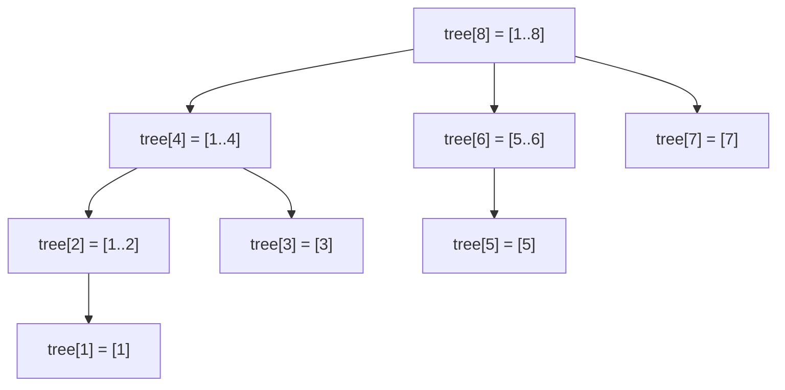

A segment tree answers range sums with updates in `O(log n)`, but it costs `2n` to `4n` integers, a recursive or slightly fiddly iterative walk, and a build step. For the most common case, sums (or anything with an inverse: counts, XOR, products modulo a prime), there is a structure that does the same job in `n + 1` integers with two five-line functions. It was described by Peter Fenwick in 1994 for arithmetic-coding frequency tables, and it is the structure every competitive programmer types from memory and every backend engineer rediscovers when they build a leaderboard.

The trick is to let the binary representation of an index decide which partial sums that index is responsible for.

## The idea: each index owns a power-of-two-length block

Use 1-based indices. Define `lowbit(i) = i & -i`, the value of the lowest set bit of `i`: `lowbit(12) = 4` because `12 = 1100₂`, `lowbit(6) = 2`, `lowbit(8) = 8`, `lowbit(7) = 1`.

```viz
{"type": "bits", "algorithm": "and-or-xor", "a": 12, "b": 4,
 "title": "lowbit(12) = 12 & -12 = 4",
 "caption": "In two's complement, -12 flips every bit above the lowest set bit and keeps that bit, so 12 & -12 isolates it: 1100 & 0100 = 0100."}
```

Now let cell `tree[i]` store the sum of the `lowbit(i)` elements ending at position `i`, that is, `values[i - lowbit(i) + 1 .. i]`.

| `i` | binary | `lowbit(i)` | `tree[i]` covers |
|---|---|---|---|
| 1 | 0001 | 1 | `[1, 1]` |
| 2 | 0010 | 2 | `[1, 2]` |
| 3 | 0011 | 1 | `[3, 3]` |
| 4 | 0100 | 4 | `[1, 4]` |
| 5 | 0101 | 1 | `[5, 5]` |
| 6 | 0110 | 2 | `[5, 6]` |
| 7 | 0111 | 1 | `[7, 7]` |
| 8 | 1000 | 8 | `[1, 8]` |

Odd indices cover one element. Multiples of 2 but not 4 cover two. Multiples of 4 but not 8 cover four. And so on. Every element is covered by about `log n` cells, and the cells nest like a segment tree's right spine with the left children thrown away.



## Prefix query: strip the lowest bit

To compute `prefix(i) = values[1] + … + values[i]`, take `tree[i]` (which covers a block ending at `i`), then jump to the block just before it, which ends at `i - lowbit(i)`, and repeat until `i` hits 0.

```python
def prefix(self, i):           # sum of values[1..i], 1-based
    s = 0
    while i > 0:
        s += self.tree[i]
        i -= i & -i
    return s
```

Trace `prefix(7)` on `values = [_, 3, 1, 4, 1, 5, 9, 2, 6]`:

- `i = 7 = 0111`: add `tree[7] = 2` (covers `[7,7]`); `i -= 1` → 6
- `i = 6 = 0110`: add `tree[6] = 5 + 9 = 14` (covers `[5,6]`); `i -= 2` → 4
- `i = 4 = 0100`: add `tree[4] = 3 + 1 + 4 + 1 = 9` (covers `[1,4]`); `i -= 4` → 0

Total 25, and indeed `3+1+4+1+5+9+2 = 25`. Each step clears one set bit of `i`, so the loop runs at most `⌊log₂ n⌋ + 1` times.

A range sum is two prefixes: `sum(l, r) = prefix(r) - prefix(l - 1)`. This is where the "needs an inverse" restriction comes from: subtraction undoes addition, but there is no operation that undoes `min`.

## Point update: add the lowest bit

To add `delta` to `values[i]`, every cell whose block contains `i` must change. Those are `i` itself, then the next cell whose block extends far enough left to include `i`, which turns out to be `i + lowbit(i)`, and so on.

```python
def add(self, i, delta):       # values[i] += delta, 1-based
    while i <= self.n:
        self.tree[i] += delta
        i += i & -i
```

Trace `add(3, 10)` with `n = 8`: `i = 3 = 0011` → `tree[3]`; `i += 1` → 4 → `tree[4]`; `i += 4` → 8 → `tree[8]`; `i += 8` → 16 > 8, stop. Check against the table: `[3,3]`, `[1,4]` and `[1,8]` are exactly the blocks containing index 3. Three cells touched for `n = 8`, again `O(log n)`.

Why does `i + lowbit(i)` land on the next enclosing block? Adding `lowbit(i)` carries out the lowest set bit, producing a number with a strictly higher lowest bit, whose block starts at or before `i - lowbit(i) + 1` and therefore contains `i`. The symmetry with the query loop (subtract the lowest bit to go to the previous disjoint block; add it to go to the next enclosing one) is the entire structure.

## Building in O(n)

Calling `add` for each element is `O(n log n)`, which is fine but wasteful. The linear build uses the same enclosing-block relationship: after placing `values` into `tree`, push each cell's partial sum into its immediate parent `i + lowbit(i)`.

```python
class Fenwick:
    def __init__(self, values):        # values is 0-based
        self.n = len(values)
        self.tree = [0] * (self.n + 1)
        for i, v in enumerate(values, start=1):
            self.tree[i] += v
            j = i + (i & -i)
            if j <= self.n:
                self.tree[j] += self.tree[i]
```

Processing indices in increasing order guarantees that `tree[i]` is complete before it is pushed upward, because all of its contributing children have smaller indices.

Memory: `n + 1` integers. Compare `2n` for the iterative segment tree and `4n` for the recursive one. For `n = 10⁸` counters that is 800 MB versus 1.6 GB versus 3.2 GB, which is the difference between fitting in one machine's RAM and not.

## Counting inversions

An inversion in an array is a pair `i < j` with `a[i] > a[j]`; the count measures how far from sorted the array is, and it comes up in ranking-correlation metrics (Kendall's tau), in collaborative filtering, and as an interview problem in its own right.

Walk the array left to right. For each element `x`, the number of *earlier* elements greater than `x` is `(elements seen so far) - (elements seen so far that are ≤ x)`. That second quantity is a prefix count over a frequency array indexed by value, and a Fenwick tree maintains it as you go.

Values may be large or negative, so first **coordinate-compress**: sort the distinct values and replace each by its 1-based rank.

```python
def count_inversions(nums):
    ranks = {v: i + 1 for i, v in enumerate(sorted(set(nums)))}
    tree = Fenwick([0] * len(ranks))
    inversions = 0
    for seen, x in enumerate(nums):
        r = ranks[x]
        inversions += seen - tree.prefix(r)   # earlier elements > x
        tree.add(r, 1)
    return inversions
```

Trace `[2, 4, 1, 3, 5]`: ranks are themselves. `x=2`: seen 0, prefix(2) = 0, add 0. `x=4`: seen 1, prefix(4) = 1 (the 2), add 0. `x=1`: seen 2, prefix(1) = 0, add 2 (both 2 and 4 are bigger). `x=3`: seen 3, prefix(3) = 2 (1 and 2), add 1 (the 4). `x=5`: seen 4, prefix(5) = 4, add 0. Total 3: `(2,1), (4,1), (4,3)`.

This is `O(n log n)`, the same as the merge-sort approach from [divide and conquer](/learn/algorithms/divide-and-conquer/divide-and-conquer-thinking), but it generalises to "count of earlier elements in a value range", which merge sort does not.

## Order statistics by binary lifting

The prefix query walks *down* the bits; there is a complementary walk that goes *up*. Given a Fenwick tree over frequencies, "find the smallest index whose prefix sum is at least `k`" (the `k`-th smallest element) can be done in `O(log n)` without binary-searching over `prefix`, which would be `O(log² n)`.

```python
def kth(self, k):              # smallest i with prefix(i) >= k; frequencies non-negative
    pos = 0
    step = 1 << (self.n.bit_length() - 1)
    while step:
        nxt = pos + step
        if nxt <= self.n and self.tree[nxt] < k:
            pos = nxt
            k -= self.tree[nxt]
        step >>= 1
    return pos + 1
```

Starting from the highest power of two, try to extend `pos` by `step`; if the block `tree[pos + step]` does not yet reach `k`, absorb it and subtract its count. Because `pos` is always a sum of decreasing powers of two, `tree[pos + step]` is exactly the block `[pos+1, pos+step]`, so the sums compose correctly. This is the same shape as `git bisect` narrowing a range by halves, or as jumping `2^j` ancestors at a time in a tree: decide bit by bit from the top.

With `add` for "player's score changed" and `kth` for "who is in position 1,000", you have a leaderboard with `O(log n)` for every operation and `n + 1` integers of state, where `n` is the number of distinct score values.

## Where you meet it in production

- **Leaderboards and rank queries.** Redis `ZRANK` uses a skip list whose forward pointers carry *span* counts, which gives `O(log n)` rank in the same spirit; a Fenwick tree over score buckets is what you write when scores are bounded and you want it inside your own process.
- **Order books.** "Total resting volume at or below price `p`" is a prefix sum over price ticks; a Fenwick tree keyed by tick handles hundreds of thousands of updates per second in a few kilobytes.
- **Arithmetic coding and compression.** Fenwick's original use: adaptive frequency tables where each symbol's cumulative frequency is needed for encoding and each encoded symbol bumps a frequency.
- **Database statistics.** Cumulative histograms for selectivity estimation are prefix counts; the planner does not use Fenwick trees per se, but the query it answers ("how many rows have `col ≤ v`") is the same one.
- **2D variants.** A Fenwick tree of Fenwick trees answers rectangle sums in `O(log² n)` with `O(n²)` memory, which is how some heat-map and tile-aggregation systems work at moderate grid sizes.

## When not to use it

Anything without an inverse: range min, range max, range gcd. The prefix trick needs `sum(l, r) = prefix(r) − prefix(l−1)`, and `min` has no subtraction. There are Fenwick variants that support `prefix` min with point updates that only *decrease* values, but the moment values can go up you need a segment tree. Range updates with range queries also want the [lazy segment tree](/learn/advanced-data-structures/range-queries/lazy-propagation), although "range add + point query" (difference array) and "range add + range sum" (two Fenwick trees, one for `delta` and one for `delta × index`) both have Fenwick solutions that are worth knowing exist.

## Exercises

```exercise
id: fenwick-tree
title: Implement a Fenwick tree
prompt: |
  Implement `Fenwick` with:

  - `build(values)` — initialise from a non-empty list of integers (0-based
    input; store however you like internally).
  - `add(i, delta)` — add `delta` to element `i` (0-based).
  - `prefix(i)` — return the sum of elements `0..i` inclusive.
  - `sum(l, r)` — return the sum of elements `l..r` inclusive.

  `add`, `prefix` and `sum` must be O(log n). Use the `i & -i` lowbit
  trick; do not store a plain prefix-sum array.
languages: [python, javascript]
entry: Fenwick
starter:
  python: |
    class Fenwick:
        def build(self, values):
            self.n = len(values)
            self.tree = [0] * (self.n + 1)
            # TODO: fill tree (O(n log n) via add is fine)

        def add(self, i, delta):
            # TODO: 1-based walk upward with i += i & -i
            pass

        def prefix(self, i):
            # TODO: 1-based walk downward with i -= i & -i
            return 0

        def sum(self, l, r):
            return self.prefix(r) - (self.prefix(l - 1) if l > 0 else 0)
  javascript: |
    class Fenwick {
      build(values) {
        this.n = values.length;
        this.tree = new Array(this.n + 1).fill(0);
        // TODO: fill tree (O(n log n) via add is fine)
      }
      add(i, delta) {
        // TODO: 1-based walk upward with i += i & -i
      }
      prefix(i) {
        // TODO: 1-based walk downward with i -= i & -i
        return 0;
      }
      sum(l, r) {
        return this.prefix(r) - (l > 0 ? this.prefix(l - 1) : 0);
      }
    }
tests:
  - args: [["build",[1,2,3,4,5]],["prefix",2],["sum",1,3],["add",2,10],["prefix",2],["sum",1,3],["prefix",4]]
    expected: [null, 6, 9, null, 16, 19, 25]
  - args: [["build",[5]],["prefix",0],["add",0,-5],["prefix",0]]
    expected: [null, 5, null, 0]
    label: single element
  - args: [["build",[2,0,-3,7,1,4]],["sum",0,5],["sum",2,2],["sum",3,5],["add",5,-4],["sum",3,5],["prefix",0]]
    expected: [null, 11, -3, 12, null, 8, 2]
    label: negatives and zeros
  - args: [["build",[1,1,1,1,1,1,1,1,1,1]],["prefix",9],["add",0,5],["add",9,5],["sum",0,9],["sum",1,8],["prefix",0]]
    expected: [null, 10, null, null, 20, 8, 6]
    hidden: true
  - args: [["build",[0,0,0,0,0,0,0]],["add",3,4],["add",3,4],["sum",3,3],["prefix",6],["sum",0,2]]
    expected: [null, null, null, 8, 8, 0]
    hidden: true
    label: repeated adds to one cell
hints:
  - "Convert the 0-based index to 1-based at the top of add and prefix; the tree array has n + 1 slots and slot 0 is unused."
  - "add: while i <= n, tree[i] += delta, i += i & -i. prefix: while i > 0, s += tree[i], i -= i & -i."
  - "In JavaScript, i & -i works on 32-bit integers, which is fine for any n you will meet here."
```

```exercise
id: count-inversions-fenwick
title: Count inversions with a Fenwick tree
prompt: |
  Return the number of pairs `(i, j)` with `i < j` and `nums[i] > nums[j]`.
  Values may be negative or repeated (equal values are not inversions).
  Aim for O(n log n) using coordinate compression plus a Fenwick tree over
  value ranks; a merge-sort solution is also accepted, but write the
  Fenwick one.
languages: [python, javascript]
entry: count_inversions
starter:
  python: |
    def count_inversions(nums):
        # 1. rank the distinct values 1..m
        # 2. walk left to right; inversions += seen - prefix(rank)
        # 3. add(rank, 1)
        return 0
  javascript: |
    function count_inversions(nums) {
      // 1. rank the distinct values 1..m
      // 2. walk left to right; inversions += seen - prefix(rank)
      // 3. add(rank, 1)
      return 0;
    }
tests:
  - args: [[2, 4, 1, 3, 5]]
    expected: 3
  - args: [[]]
    expected: 0
    label: empty
  - args: [[1, 2, 3]]
    expected: 0
    label: sorted
  - args: [[3, 2, 1]]
    expected: 3
    label: reverse sorted
  - args: [[5, 5, 5]]
    expected: 0
    label: equal values are not inversions
  - args: [[1, 3, 2, 3, 1]]
    expected: 4
    hidden: true
  - args: [[-1, -5, 3, 0]]
    expected: 2
    hidden: true
    label: negatives need compression
hints:
  - "Sort the distinct values; map each to its 1-based position. Negative values then become valid tree indices."
  - "For element x at position k (0-based), the earlier elements greater than x number k - prefix(rank(x)); using rank(x) (not rank(x) - 1) makes equal earlier values count as not greater."
```

## Senior signals

- You explain the structure through `lowbit`: subtract it to walk disjoint blocks for a query, add it to walk enclosing blocks for an update.
- You state the restriction honestly: Fenwick trees need an inverse operation, so they do sums, counts and XOR, not min or max.
- You reach for coordinate compression automatically when values are large, sparse or negative.
- You know the `O(n)` build and the `O(log n)` `kth` walk, and can explain the latter as deciding the answer bit by bit from the top.
- You can quantify the memory argument (`n + 1` versus `2n` versus `4n`) and know when it decides between a Fenwick tree and a segment tree at scale.
- You connect it to rank queries in leaderboards, cumulative volume in order books, and cumulative histograms in query planners.

## Check yourself

```quiz
- q: >-
    In a Fenwick tree, which elements does tree[12] summarise?
  options: ["values[12..15]", "values[1..12]", "values[9..12]", "values[12] only"]
  answer: 2
  explanation: >-
    12 = 1100 in binary, so lowbit(12) = 4 and tree[12] covers the 4 elements ending at 12, i.e. positions 9 to 12. Only powers of two cover a prefix from 1.
- q: >-
    Why does prefix(i) terminate in at most log n + 1 steps?
  options: ["It stops at the first cell whose stored sum is zero", "It walks one level up a tree whose height is log n", "Each step halves i, so it reaches 0 within log n steps", "Each step clears one of i's at most log n + 1 set bits"]
  answer: 3
  explanation: >-
    i -= i & -i removes exactly one set bit; a number below n has at most floor(log2 n) + 1 set bits. i is not halved (7 goes to 6, not 3), there is no tree height being climbed, and cells are never zero-tested.
- q: >-
    You need range minimum queries with arbitrary point updates. A Fenwick tree is the wrong tool because:
  options: ["Its point updates would cost O(n), not O(log n)", "Min has no inverse to turn two prefixes into a range", "Its lowbit arithmetic breaks when values are negative", "Storing a min per block would need O(n log n) cells"]
  answer: 1
  explanation: >-
    The Fenwick tree only answers prefixes, and range sum = prefix(r) - prefix(l-1) relies on subtraction. There is no operation that recovers min(l..r) from min(1..r) and min(1..l-1). Memory (n + 1 cells) and update cost are strengths, not weaknesses, and lowbit works on indices, so negative values are fine.
- q: >-
    To count inversions in [40, -7, 40, 12] with a Fenwick tree, what is the first thing you do?
  options: ["Build a frequency array of size 41, indexed by value", "Reverse the array so later elements are processed first", "Map each value to its rank: -7 -> 1, 12 -> 2, 40 -> 3", "Sort the array so the tree can be filled in value order"]
  answer: 2
  explanation: >-
    Coordinate compression turns arbitrary (including negative) values into dense 1-based indices for the tree. A frequency array of size max value fails for negatives and wastes memory; sorting destroys the order the count depends on.
- q: >-
    Which statement about memory is correct for n elements?
  options: ["Fenwick 2n (values and sums); iterative 2n; recursive 2n", "Fenwick n; iterative segment tree n; recursive segment tree n", "Fenwick n + 1; iterative segment tree 2n; recursive up to 4n", "Fenwick 4n; iterative segment tree 2n; recursive n + 1"]
  answer: 2
  explanation: >-
    The Fenwick tree stores only the block sums, one per index, so it does not need 2n for separate values and sums. The segment tree needs internal nodes as well as leaves, and the recursive layout over-allocates to handle n that is not a power of two.
```
