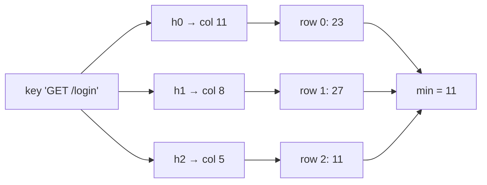

Two questions come up in every analytics or abuse-detection system. "How many times has this key appeared?" (which URLs are hottest, which IP is hammering us, which product is trending) and "how many *distinct* keys have appeared?" (daily active users, unique visitors per page, distinct source IPs per minute). The exact answer to both is a hash map with one entry per distinct key. At a hundred million distinct keys, that is several gigabytes per counter, per node, per time window, and you wanted one per country per hour.

You do not need exact answers. You need "this IP sent roughly 40,000 requests, give or take a few hundred" and "about 3.2 million unique users today, plus or minus 1%". Two structures give you exactly that, with memory that does not grow with the number of distinct keys: the count-min sketch for frequencies and HyperLogLog for cardinality.

## Count-min sketch

A count-min sketch is a grid of `d` rows and `w` columns of integer counters, all zero, with one hash function per row mapping a key to a column.

- **add(key, c)**: for each row `i`, `table[i][h_i(key)] += c`.
- **estimate(key)**: `min over i of table[i][h_i(key)]`.

Each counter is shared by every key that hashes to it in that row, so every counter is at least the true count of any key that maps to it and possibly more. Taking the minimum over rows picks the counter with the least collision noise. The estimate is therefore never *below* the truth, and it is above it only when the key collided in every single row.



Contrast this with what an exact counter does: a hash table with one entry per key, which you can watch grow below. The sketch replaces the per-key entry with a fixed grid.

```viz
{"type": "hash-table", "algorithm": "chaining", "buckets": 4,
 "title": "Exact counting grows with distinct keys",
 "caption": "An exact frequency map stores one entry per distinct key and resizes as keys arrive. A count-min sketch is a fixed d × w grid that never grows.",
 "operations": [["set","/",1],["set","/login",1],["set","/feed",1],["set","/about",1],["set","/pricing",1],["set","/api/me",1],["get","/login"]]}
```

### A worked example, small enough to trace

Take `d = 3` rows and `w = 16` columns, with row `i` using `(fnv1a(key) + i · djb2(key)) mod 16`, the same double-hashing trick from [Bloom filters](/learn/advanced-data-structures/probabilistic-structures/bloom-filters). Insert ten request paths with these true counts:

| Key | Columns (row 0, 1, 2) | True count |
|---|---|---|
| `GET /` | 14, 2, 6 | 1 |
| `GET /login` | 11, 8, 5 | 8 |
| `POST /login` | 11, 14, 1 | 4 |
| `GET /api/feed` | 11, 12, 13 | 11 |
| `GET /static/app.js` | 1, 8, 15 | 7 |
| `GET /about` | 7, 6, 5 | 3 |
| `GET /pricing` | 8, 8, 8 | 10 |
| `POST /api/like` | 12, 4, 12 | 6 |
| `GET /api/me` | 9, 8, 7 | 2 |
| `DELETE /api/post` | 12, 2, 8 | 9 |

Now estimate `GET /login`:

- Row 0, column 11 is shared with `POST /login` (4) and `GET /api/feed` (11): counter = 8 + 4 + 11 = 23.
- Row 1, column 8 is shared with `/static/app.js` (7), `/pricing` (10) and `/api/me` (2): counter = 27.
- Row 2, column 5 is shared only with `GET /about` (3): counter = 11.

The minimum is 11 against a true count of 8. Eight of the ten keys come back exact; `GET /login` and `DELETE /api/post` are overestimated. A 16-column sketch is absurdly small; the point is that you can see the mechanism. Widen `w` and collisions per row fall in proportion.

### The error bound

Let `N` be the total count of everything added. In any one row, the counter for key `x` holds `count(x)` plus the counts of every other key that collided with it. If the hash spreads keys uniformly, each other key lands in `x`'s column with probability `1/w`, so the expected collision mass is at most `N/w`. Markov's inequality then says the collision mass exceeds `2N/w` with probability at most 1/2. The rows use independent hashes, so all `d` rows exceed that simultaneously with probability at most `(1/2)^d`:

$$\text{estimate}(x) \le \text{count}(x) + \frac{2N}{w} \quad \text{with probability} \ge 1 - 2^{-d}.$$

(The tighter textbook bound uses `e/w` and `e^{-d}`; the version above is the one you can derive on a whiteboard.) To size a sketch you pick a tolerable error `ε` as a fraction of `N` and a failure probability `δ`:

$$w = \lceil 2/\varepsilon \rceil, \qquad d = \lceil \log_2(1/\delta) \rceil.$$

**Example.** You want errors below 0.1% of total traffic with 99% confidence: `w = 2000`, `d = 7`. That is 14,000 counters. With 4-byte counters, 56 KB. It does not matter whether you have a thousand distinct keys or a billion.

The catch is in the phrase "fraction of `N`". If `N` is a billion requests, the guarantee is "within a million". That is precise enough to identify a key with 5% of traffic (50 million) and useless for a key with 500 requests. A count-min sketch is a **heavy-hitter** structure: it tells you accurately about keys that are large relative to the stream, and it lies about the long tail, always upward.

### Heavy hitters and conservative update

Finding the top-k keys is the main job. The sketch alone cannot list keys (it never stores them), so you keep a small min-heap of `(estimate, key)` alongside it. On each `add`, update the sketch, estimate the key, and if the estimate beats the heap's minimum, insert it (evicting the minimum when the heap exceeds `k`). The heap holds `k` entries; everything else is the fixed-size grid.

A cheap accuracy win is **conservative update**: when adding `c` to a key, compute the current estimate `e` first and raise each row's counter only to `max(counter, e + c)` instead of adding `c` everywhere. Counters that were already inflated by collisions are not inflated further. It roughly halves the error on skewed data at no memory cost, and it is what most production sketches do.

Where it runs: DDoS and abuse detection (top source IPs per second at line rate), API gateways counting per-tenant calls without a per-tenant counter, stream processors computing trending items, and, as you will see in [LFU and modern policies](/learn/advanced-data-structures/caches-and-eviction/lfu-and-modern-policies), as the frequency memory inside the TinyLFU cache admission policy, where the whole sketch is 4-bit counters that get halved periodically so old popularity fades.

## HyperLogLog

Counting distinct items is a different problem: adding the same key twice must not change the answer. The idea behind HyperLogLog is that a good hash function turns every distinct key into a uniformly random bit string, and uniformly random bit strings have a predictable structure. Half of them start with a 1. A quarter start with `01`. One in `2^r` starts with `r − 1` zeros followed by a 1.

So if you hash every element and record the *longest run of leading zeros* you have ever seen, `R`, you have seen roughly `2^R` distinct elements: it takes about `2^R` random draws to produce one with `R` leading zeros. Duplicates hash identically and contribute nothing new, which is exactly the property you need.

```viz
{"type": "bits", "algorithm": "count-bits", "values": [1, 6, 8, 32, 96],
 "title": "Bit patterns of hashed values",
 "caption": "HyperLogLog looks at the position of the first 1 bit in each hash. A hash starting with r zeros is a 1-in-2^r event, so the longest run seen estimates log2 of the number of distinct hashes."}
```

A single maximum is a terrible estimator: one unlucky hash with 30 leading zeros and you claim a billion elements. Two fixes turn the idea into HyperLogLog.

**Many registers.** Use the first `b` bits of the hash to pick one of `m = 2^b` registers, and use the remaining bits for the leading-zero count `ρ`. Register `j` keeps `M[j] = max ρ` seen among the elements routed to it. You now have `m` independent estimates, each of `n/m` elements.

**Harmonic mean.** Averaging `2^{M[j]}` arithmetically would still be dominated by one outlier. HyperLogLog uses the harmonic mean, which is robust to large values:

$$\hat n = \alpha_m \cdot m^2 \Big/ \sum_{j=1}^{m} 2^{-M[j]},$$

with a bias-correction constant `α_m ≈ 0.7213 / (1 + 1.079/m)` for large `m`.

**Worked example.** `m = 16` registers after a stream: eight registers hold 5, four hold 6, four hold 4. Then `Σ 2^{−M[j]} = 8/32 + 4/64 + 4/16 = 0.25 + 0.0625 + 0.25 = 0.5625`, and with `α_16 = 0.673`, `n̂ = 0.673 × 256 / 0.5625 ≈ 306`. Around three hundred distinct items, each register having seen about 19 of them, and `log2(19) ≈ 4.2` matches the register values of 4–6. With only 16 registers the error is ±26%; the estimate is illustrative, not precise.

### The error bound and the 12 KB number

The relative standard error of HyperLogLog is

$$\sigma \approx \frac{1.04}{\sqrt{m}}.$$

| Registers `m` | Standard error | Memory (6-bit registers) |
|---|---|---|
| 256 | 6.5% | 192 B |
| 4,096 | 1.6% | 3 KB |
| 16,384 | 0.81% | 12 KB |
| 65,536 | 0.41% | 48 KB |

Redis uses `m = 16384` registers of 6 bits: 12 KB per HyperLogLog, 0.81% standard error, for any cardinality up to about `2^64`. That is the number to remember. `PFADD visitors:2026-09-26 user123` and `PFCOUNT visitors:2026-09-26` give you daily uniques per key in 12 KB each, so a year of daily counters for a thousand pages is 4 GB instead of the terabytes an exact set-per-day would need. Redis also keeps a *sparse* encoding for small cardinalities, so a key that has seen ten users takes tens of bytes, not 12 KB.

Two refinements every real implementation has: for small `n` (below about `2.5m`) many registers are still 0 and the formula is biased, so implementations switch to *linear counting*, `m · ln(m / zero_registers)`; and HyperLogLog++ (Google's variant, used in BigQuery's `APPROX_COUNT_DISTINCT` and `HLL_COUNT.*`) uses 64-bit hashes and an empirical bias-correction table to fix the transition region.

### Merging is free; intersecting is not

Two HyperLogLogs with the same `m` merge by taking the register-wise maximum. The result is exactly the HyperLogLog you would have built from the union of both streams, with the same error bound. This is why the structure is loved in distributed systems: each shard, region or day keeps its own 12 KB, and any union (all shards, last 30 days, both regions) is a `PFMERGE`. ClickHouse, Druid, Postgres's `hll` extension, Elasticsearch's `cardinality` aggregation and every observability vendor's "unique count" all rely on this.

What you cannot do is intersect. `|A ∩ B| = |A| + |B| − |A ∪ B|` works algebraically, but the three terms each carry ~1% error on numbers that may be large while the intersection is small, so the error on the difference can exceed the answer. If you need "users who did A and B", use MinHash (next lesson) or count the intersection directly.

## Choosing between exact and approximate

| Need | Structure | Memory | Error |
|---|---|---|---|
| Frequency of any key, exact | Hash map | O(distinct keys) | None |
| Frequency of heavy hitters | Count-min sketch + heap | O(w · d + k) | Additive, ≤ 2N/w, overestimate only |
| Distinct count, exact | Hash set | O(distinct keys) | None |
| Distinct count, approximate | HyperLogLog | 12 KB at 0.81% | Multiplicative, ~1.04/√m |
| Distinct count, mergeable across shards | HyperLogLog | 12 KB per shard | Same after merge |
| Distinct count of an intersection | MinHash or exact | Varies | HLL subtraction blows up |

The interview question is usually "design a system to show trending hashtags" or "count unique viewers of a live stream". The senior move is to say the exact structure first, state its memory cost at the given scale, and then introduce the sketch *with its error bound and the reason the error is acceptable*. "A count-min sketch with `w = 2000, d = 7` is 56 KB and overestimates any key by at most 0.1% of total traffic; for trending we only care about keys above 1%, so that is fine" is a senior answer. "Use HyperLogLog, it's approximate" is not.

## Exercise

```exercise
id: count-min-sketch
title: Implement a count-min sketch
prompt: |
  Implement `CountMinSketch` with `D = 3` rows and `W = 16` counters per
  row. Row `i` maps a key to column `(fnv1a(key) + i * djb2(key)) % W`
  (the hash functions are given).

  `add(key, count)` adds `count` to one counter in each row and returns
  nothing. `estimate(key)` returns the minimum of the key's `D` counters.

  Estimates must never be below the true count. The tests include keys
  whose estimate is inflated by collisions in this tiny sketch.
languages: [python, javascript]
entry: CountMinSketch
starter:
  python: |
    def fnv1a(s):
        h = 0x811C9DC5
        for ch in s:
            h ^= ord(ch)
            h = (h * 0x01000193) & 0xFFFFFFFF
        return h

    def djb2(s):
        h = 5381
        for ch in s:
            h = (h * 33 + ord(ch)) & 0xFFFFFFFF
        return h

    class CountMinSketch:
        D = 3
        W = 16

        def __init__(self):
            self.table = [[0] * self.W for _ in range(self.D)]

        def _cols(self, key):
            # TODO: one column per row
            return []

        def add(self, key, count):
            # TODO
            pass

        def estimate(self, key):
            # TODO
            return 0
  javascript: |
    function fnv1a(s) {
      let h = 0x811c9dc5;
      for (let i = 0; i < s.length; i++) {
        h ^= s.charCodeAt(i);
        h = Math.imul(h, 0x01000193) >>> 0;
      }
      return h;
    }
    function djb2(s) {
      let h = 5381;
      for (let i = 0; i < s.length; i++) {
        h = (Math.imul(h, 33) + s.charCodeAt(i)) >>> 0;
      }
      return h;
    }
    class CountMinSketch {
      constructor() {
        this.D = 3;
        this.W = 16;
        this.table = Array.from({ length: this.D }, () => new Array(this.W).fill(0));
      }
      _cols(key) {
        // TODO: one column per row
        return [];
      }
      add(key, count) {
        // TODO
      }
      estimate(key) {
        // TODO
        return 0;
      }
    }
tests:
  - args: [["add","GET /",5],["add","GET /login",2],["estimate","GET /"],["estimate","GET /login"],["estimate","GET /about"]]
    expected: [null, null, 5, 2, 0]
    label: no collisions yet
  - args: [["estimate","anything"]]
    expected: [0]
    label: empty sketch
  - args: [["add","GET /",1],["add","GET /login",8],["add","POST /login",4],["add","GET /api/feed",11],["add","GET /static/app.js",7],["add","GET /about",3],["add","GET /pricing",10],["add","POST /api/like",6],["add","GET /api/me",2],["add","DELETE /api/post",9],["estimate","GET /login"],["estimate","DELETE /api/post"],["estimate","GET /api/feed"],["estimate","GET /nope"]]
    expected: [null, null, null, null, null, null, null, null, null, null, 11, 10, 11, 0]
    label: GET /login (true 8) and DELETE /api/post (true 9) are overestimated
  - args: [["add","GET /pricing",3],["add","GET /pricing",4],["estimate","GET /pricing"]]
    expected: [null, null, 7]
    label: counts accumulate
  - args: [["add","GET /",1],["add","GET /login",8],["add","POST /login",4],["add","GET /api/feed",11],["add","GET /static/app.js",7],["add","GET /about",3],["add","GET /pricing",10],["add","POST /api/like",6],["add","GET /api/me",2],["add","DELETE /api/post",9],["estimate","GET /"],["estimate","POST /login"],["estimate","GET /about"],["estimate","GET /api/me"]]
    expected: [null, null, null, null, null, null, null, null, null, null, 1, 4, 3, 2]
    hidden: true
    label: keys with a clean row are exact
hints:
  - "Compute h1 = fnv1a(key) and h2 = djb2(key) once; column for row i is (h1 + i * h2) % W."
  - "add touches exactly one counter per row; estimate takes the minimum across rows."
```

## Senior signals

- You state the **count-min guarantee precisely**: never underestimates, overestimates by at most a fraction of *total* traffic, so it is a heavy-hitter tool, not a tail-count tool.
- You size a sketch from `ε` and `δ` and can say "56 KB for 0.1% error at 99% confidence, independent of the number of keys".
- You know HyperLogLog's **12 KB / 0.81%** numbers, why registers use a harmonic mean, and that merging is a register-wise max.
- You refuse to compute an **intersection** by subtracting HyperLogLogs and can say why.
- You mention **conservative update** and the heap-alongside-sketch pattern for top-k.
- You present the exact structure and its memory cost first, then the sketch with its error bound and why the error is acceptable for the product.

## Check yourself

```quiz
- q: >-
    A count-min sketch estimates a key's count as 1,200. Which statement is guaranteed?
  options: ["The true count is at least 1,200", "The true count is at most 1,200", "The true count is within 1% of 1,200", "The true count is exactly 1,200"]
  answer: 1
  explanation: >-
    Every counter a key touches holds its true count plus any collisions, so each row is ≥ the truth and so is their minimum. The sketch never underestimates. It can be exact, but that is not guaranteed.
- q: >-
    You have a count-min sketch with w = 1000 over a stream of 10 billion events. Which key count can it report usefully?
  options: ["A key with 100 million events", "None; the stream is too large", "A key with 50,000 events", "A key with just 500 events"]
  answer: 0
  explanation: >-
    The error bound is additive in total traffic, about 2N/w = 20 million here. Only counts well above that (heavy hitters) are meaningful; the 500- and 50,000-event keys are lost in collision noise.
- q: >-
    Two data centres each keep a HyperLogLog of unique users. How do you get the global unique count?
  options: ["Add the two estimates together for the total", "Take the larger of the two estimates as the total", "Take the register-wise max and estimate from it", "They cannot be combined; recount from raw logs"]
  answer: 2
  explanation: >-
    A register holds the max leading-zero run of the elements routed to it, so the max over both structures is exactly what one structure over the union would hold. Adding estimates double-counts users seen in both centres; the larger estimate ignores users seen only in the other.
- q: >-
    Why does HyperLogLog use a harmonic mean of the registers rather than an arithmetic mean of 2^M[j]?
  options: ["Registers are stored as reciprocals to save space", "One register with a freak long zero run would dominate", "The harmonic mean is unbiased, so no correction is needed", "It is cheaper to compute than an arithmetic mean"]
  answer: 1
  explanation: >-
    Each register's 2^M[j] is a heavy-tailed estimate; one lucky hash gives a huge value that would dominate an arithmetic mean. The harmonic mean is dominated by small values and so is robust to that outlier. It is not unbiased: it still needs the α constant to correct bias.
- q: >-
    Product wants "users who visited both page A and page B this week" from per-page HyperLogLogs. What do you say?
  options: ["Compute |A| + |B| − |A ∪ B|, which is exact for HLLs", "The error can dwarf a small intersection; use MinHash", "Raise the register count enough, then subtract as usual", "PFMERGE the two HyperLogLogs and read the merged count"]
  answer: 1
  explanation: >-
    Each term carries about 1% relative error on possibly large numbers, while the intersection may be tiny; the absolute errors do not cancel, so the subtraction error can exceed the answer. Use MinHash or count the intersection directly. More registers reduce but do not remove the problem. Merging gives the union, not the intersection.
```
