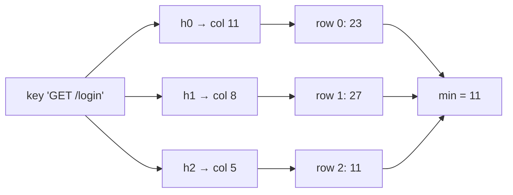

Two questions come up in every analytics or abuse-detection system. "How many times has this key appeared?" (which URLs are hottest, which IP is hammering us, which product is trending) and "how many *distinct* keys have appeared?" (daily active users, unique visitors per page, distinct source IPs per minute). The exact answer to both is a hash map with one entry per distinct key. At a hundred million distinct keys, that is several gigabytes per counter, per node, per time window, and you wanted one per country per hour.

You do not need exact answers. You need "this IP sent roughly 40,000 requests, give or take a few hundred" and "about 3.2 million unique users today, plus or minus 1%". Two structures give you exactly that, with memory that does not grow with the number of distinct keys: the count-min sketch for frequencies and HyperLogLog for cardinality. This lesson traces both cell by cell and register by register, derives their error bounds, checks the bounds by simulation, and then opens the implementations in Redis, BigQuery, ClickHouse, Spark and Caffeine. It uses the double hashing from [Bloom filters](/learn/advanced-data-structures/probabilistic-structures/bloom-filters) and the expectation arguments from [probability for engineers](/learn/foundations/math-for-engineers/probability-for-engineers).

## Count-min sketch

A count-min sketch is a grid of `d` rows and `w` columns of integer counters, all zero, with one hash function per row mapping a key to a column.

- **add(key, c)**: for each row `i`, `table[i][h_i(key)] += c`.
- **estimate(key)**: `min over i of table[i][h_i(key)]`.

Each counter is shared by every key that hashes to it in that row, so every counter is at least the true count of any key that maps to it and possibly more. Taking the minimum over rows picks the counter with the least collision noise. The estimate is therefore never *below* the truth, and it is above it only when the key collided in every single row.



Contrast this with what an exact counter does: a hash table with one entry per key, which you can watch grow below. The sketch replaces the per-key entry with a fixed grid.

```viz
{"type": "hash-table", "algorithm": "chaining", "buckets": 4,
 "title": "Exact counting grows with distinct keys",
 "caption": "An exact frequency map stores one entry per distinct key and resizes as keys arrive. A count-min sketch is a fixed d × w grid that never grows.",
 "operations": [["set","/",1],["set","/login",1],["set","/feed",1],["set","/about",1],["set","/pricing",1],["set","/api/me",1],["get","/login"]]}
```

### The cells, traced

Take `d = 3` rows and `w = 16` columns, with row `i` using `(fnv1a(key) + i · djb2(key)) mod 16`. Insert ten request paths with these true counts:

| Key | Columns (row 0, 1, 2) | True count |
|---|---|---|
| `GET /` | 14, 2, 6 | 1 |
| `GET /login` | 11, 8, 5 | 8 |
| `POST /login` | 11, 14, 1 | 4 |
| `GET /api/feed` | 11, 12, 13 | 11 |
| `GET /static/app.js` | 1, 8, 15 | 7 |
| `GET /about` | 7, 6, 5 | 3 |
| `GET /pricing` | 8, 8, 8 | 10 |
| `POST /api/like` | 12, 4, 12 | 6 |
| `GET /api/me` | 9, 8, 7 | 2 |
| `DELETE /api/post` | 12, 2, 8 | 9 |

After all 61 increments, read every key back. The three counters are the cells the key touches in rows 0, 1 and 2:

| Key | Row 0 cell | Row 1 cell | Row 2 cell | Estimate | True | Error |
|---|---|---|---|---|---|---|
| `GET /` | 1 | **10** (shares column 2 with `DELETE /api/post`) | 1 | 1 | 1 | 0 |
| `GET /login` | 23 (+ `POST /login`, `/api/feed`) | 27 (+ `app.js`, `/pricing`, `/api/me`) | 11 (+ `/about`) | **11** | 8 | +3 |
| `POST /login` | 23 | 4 | 4 | 4 | 4 | 0 |
| `GET /api/feed` | 23 | 11 | 11 | 11 | 11 | 0 |
| `GET /static/app.js` | 7 | 27 | 7 | 7 | 7 | 0 |
| `GET /about` | 3 | 3 | 11 | 3 | 3 | 0 |
| `GET /pricing` | 10 | 27 | 19 | 10 | 10 | 0 |
| `POST /api/like` | 15 | 6 | 6 | 6 | 6 | 0 |
| `GET /api/me` | 2 | 27 | 2 | 2 | 2 | 0 |
| `DELETE /api/post` | 15 | 10 | 19 | **10** | 9 | +1 |

Eight of the ten keys come back exact, because each had at least one row where its column was private. `GET /login` collided in all three rows and is overestimated by 3; `DELETE /api/post` by 1. Row 1 is the noisy one: column 8 is shared by four keys and holds 27. A 16-column sketch is absurdly small; the point is that you can see the mechanism. Widen `w` and collisions per row fall in proportion.

### The error bound

Let `N` be the total count of everything added (61 above). In any one row, the counter for key `x` holds `count(x)` plus the counts of every other key that collided with it. If the hash spreads keys uniformly, each other key lands in `x`'s column with probability `1/w`, so the expected collision mass is at most `N/w`. Markov's inequality then says the collision mass exceeds `2N/w` with probability at most 1/2. The rows use independent hashes, so all `d` rows exceed that simultaneously with probability at most `(1/2)^d`:

$$\text{estimate}(x) \le \text{count}(x) + \frac{2N}{w} \quad \text{with probability} \ge 1 - 2^{-d}.$$

For the trace, `2N/w = 122/16 = 7.6`, and every error above was at most 3. (Cormode and Muthukrishnan's [original paper](https://dsf.berkeley.edu/cs286/papers/countmin-latin2004.pdf) sets `w = ⌈e/ε⌉` and `d = ⌈ln(1/δ)⌉`, and notes that any base `b > 1` gives the same guarantee with `w = b/ε` and `d = log_b(1/δ)`; `b = 2` is the version above, the one you can derive on a whiteboard, and `b = e` minimises the total space.) To size a sketch you pick a tolerable error `ε` as a fraction of `N` and a failure probability `δ`:

$$w = \lceil 2/\varepsilon \rceil, \qquad d = \lceil \log_2(1/\delta) \rceil.$$

**Example.** You want errors below 0.1% of total traffic with 99% confidence: `w = 2000`, `d = 7`. That is 14,000 counters. With 4-byte counters, 56 KB. It does not matter whether you have a thousand distinct keys or a billion.

The catch is in the phrase "fraction of `N`". If `N` is a billion requests, the guarantee is "within a million". That is precise enough to identify a key with 5% of traffic (50 million) and useless for a key with 500 requests. A count-min sketch is a **heavy-hitter** structure: it tells you accurately about keys that are large relative to the stream, and it lies about the long tail, always upward.

### Heavy hitters and conservative update

Finding the top-k keys is the main job. The sketch alone cannot list keys (it never stores them), so you keep a small min-heap of `(estimate, key)` alongside it. On each `add`, update the sketch, estimate the key, and if the estimate beats the heap's minimum, insert it (evicting the minimum when the heap exceeds `k`). The heap holds `k` entries; everything else is the fixed-size grid.

A cheap accuracy win is **conservative update**: when adding `c` to a key, compute the current estimate `e` first and raise each row's counter only to `max(counter, e + c)` instead of adding `c` everywhere. Add one more `GET /login` to the traced sketch: its estimate is 11, so the target is 12; row 0's cell (23) and row 1's (27) are already above 12 and stay put; only row 2's cell moves, from 11 to 12. Counters that were already inflated by collisions are not inflated further: without conservative update, the row-0 cell shared with `POST /login` and `GET /api/feed` and the row-1 cell shared with `app.js`, `/pricing` and `/api/me` would each absorb one more unit of noise. The idea comes from Estan and Varghese's 2002 [traffic-measurement paper](https://conferences.sigcomm.org/sigcomm/2002/papers/traffmeas.pdf), where it cut the false positives of their multistage filters by up to a factor of 20 as the number of stages grew. How much it helps a count-min sketch depends on the skew of the data; it costs no memory, but it gives up decrements, because a counter that was not raised cannot safely be lowered. It is not universal: Caffeine's `FrequencySketch` and RedisBloom's `CMS.INCRBY` both increment every row.

## HyperLogLog

Counting distinct items is a different problem: adding the same key twice must not change the answer. The idea behind HyperLogLog is that a good hash function turns every distinct key into a uniformly random bit string, and uniformly random bit strings have a predictable structure. Half of them start with a 1. A quarter start with `01`. One in `2^r` starts with `r − 1` zeros followed by a 1.

So if you hash every element and record the *longest run of leading zeros* you have ever seen, `R`, you have seen roughly `2^R` distinct elements: it takes about `2^R` random draws to produce one with `R` leading zeros. Duplicates hash identically and contribute nothing new, which is exactly the property you need.

```viz
{"type": "bits", "algorithm": "count-bits", "mode": "leading-zeros", "width": 8, "values": [178, 75, 41, 220, 75, 23, 99, 150],
 "title": "Leading zeros of hashed values",
 "caption": "Each value is an 8-bit hash. HyperLogLog counts the zeros before the first 1: at least r leading zeros is a 1-in-2^r event, so the longest run seen, R, suggests about 2^R distinct hashes. The repeated 75 changes nothing."}
```

A single maximum is a terrible estimator: one unlucky hash with 30 leading zeros and you claim a billion elements. Two fixes turn the idea into HyperLogLog.

**Many registers.** Use the first `b` bits of the hash to pick one of `m = 2^b` registers, and use the remaining bits for `ρ`, the position of the first 1 (one more than the number of leading zeros). Register `j` keeps `M[j] = max ρ` seen among the elements routed to it. You now have `m` independent estimates, each of `n/m` elements.

| Hashed element (first 12 bits shown) | Register (first 4 bits) | Remaining bits | `ρ` | Effect on `M[j]` |
|---|---|---|---|---|
| `0010 1101 0110…` | 2 | `1101…` | 1 (first bit is 1) | `M[2] = max(M[2], 1)` |
| `0010 0001 0111…` | 2 | `0001…` | 4 (three zeros, then 1) | `M[2] = max(M[2], 4)` |
| `1111 0000 0000 1…` | 15 | `0000 0000 1…` | 9 | `M[15] = max(M[15], 9)`: a 1-in-512 event |
| `0010 0001 0111…` again | 2 | same | 4 | no change: duplicates are absorbed |

**Harmonic mean.** Averaging `2^{M[j]}` arithmetically would still be dominated by one outlier like register 15 above. HyperLogLog uses the harmonic mean, which is robust to large values:

$$\hat n = \alpha_m \cdot m^2 \Big/ \sum_{j=1}^{m} 2^{-M[j]},$$

with a bias-correction constant `α_m ≈ 0.7213 / (1 + 1.079/m)` for large `m` (`α_16 = 0.673`, `α_32 = 0.697`, `α_64 = 0.709` are the tabulated small-`m` values).

**Worked example.** `m = 16` registers after a stream: eight registers hold 5, four hold 6, four hold 4. Then `Σ 2^{−M[j]} = 8/32 + 4/64 + 4/16 = 0.25 + 0.0625 + 0.25 = 0.5625`, and `n̂ = 0.673 × 256 / 0.5625 = 306.3`, rounded to **306**. Around three hundred distinct items, each register having seen about 19 of them, and `log₂(19) ≈ 4.2` matches the register values of 4–6. With only 16 registers the standard error is 26%: a simulation of 300 random items into 16 registers produced `[8, 7, 6, 7, 4, 5, 8, 5, 3, 7, 5, 4, 3, 4, 4, 5]` and an estimate of 256, 15% low, inside one standard error. The second exercise makes you implement this estimator.

### The error bound and the 12 KB number

The relative standard error of HyperLogLog is

$$\sigma \approx \frac{1.04}{\sqrt{m}}.$$

| Registers `m` | Standard error | Memory (6-bit registers) |
|---|---|---|
| 256 | 6.5% | 192 B |
| 4,096 | 1.6% | 3 KB |
| 16,384 | 0.81% | 12 KB |
| 65,536 | 0.41% | 48 KB |

Simulated with `m = 16,384` and 64-bit random hashes: 1,000 items estimated as 1,004 (+0.4%), 100,000 as 100,389 (+0.4%), 1,000,000 as 1,002,295 (+0.2%), all inside the 0.81% standard error. Redis uses exactly `m = 16,384` registers of 6 bits: 12 KB per HyperLogLog, 0.81% standard error, for any cardinality up to about `2^64`. That is the number to remember. `PFADD visitors:2026-09-26 user123` and `PFCOUNT visitors:2026-09-26` give you daily uniques per key in 12 KB each, so a year of daily counters for a thousand pages is about 4.5 GB (365,000 keys of 12,304 bytes at most) instead of the terabytes an exact set-per-day would need at a million 8-byte user ids per page per day.

Two refinements every real implementation has: for small `n` many registers are still 0 and the formula is biased, so the original paper switches to *linear counting*, `m · ln(m / zero_registers)`, whenever the raw estimate is at most `2.5m` and some register is still zero; and [HyperLogLog++](https://static.googleusercontent.com/media/research.google.com/en//pubs/archive/40671.pdf) (Heule, Nunkesser and Hall at Google, EDBT 2013) uses 64-bit hashes, a sparse representation for small cardinalities and an empirically measured bias-correction table for estimates below `5m`, which fixes the transition region.

### Merging is free; intersecting is not

Two HyperLogLogs with the same `m` merge by taking the register-wise maximum. The result is exactly the HyperLogLog you would have built from the union of both streams, with the same error bound. This is why the structure is loved in distributed systems: each shard, region or day keeps its own 12 KB, and any union (all shards, last 30 days, both regions) is a `PFMERGE`. ClickHouse, Druid, Postgres's `hll` extension, Elasticsearch's `cardinality` aggregation (HLL++) and the "unique count" features of many observability tools rely on this.

What you cannot do is intersect. `|A ∩ B| = |A| + |B| − |A ∪ B|` works algebraically, but the three terms each carry ~1% error on numbers that may be large while the intersection is small, so the error on the difference can exceed the answer: two sets of a million with an overlap of ten thousand carry ±10,000 of error on each term against a 10,000 answer. If you need "users who did A and B", use MinHash ([next lesson](/learn/advanced-data-structures/probabilistic-structures/minhash-and-lsh)), a Theta sketch, or count the intersection directly.

## Under the hood: Redis, BigQuery, ClickHouse, Spark, Caffeine

**Redis HyperLogLog.** `HLL_P = 14`, so 16,384 registers of `HLL_BITS = 6`, packed into 12,288 bytes plus a 16-byte header that caches the last computed cardinality (`PFCOUNT` returns it without touching the registers until the next `PFADD` changes one). Elements are hashed with 64-bit MurmurHash64A; 14 bits pick the register and the remaining 50 give `ρ`, capped at 51. A new key starts in a **sparse** encoding, a run-length list of registers, and converts to the dense 12 KB only when the sparse form would exceed `hll-sparse-max-bytes` (3,000 by default), so a key that has seen a hundred users costs a few hundred bytes. The estimator has changed twice: Redis 4.0 adopted LogLog-Beta, which corrects the small-range bias with a polynomial in the number of zero registers, and Redis 5.0 moved to Otmar Ertl's improved estimator (2017), which works from a histogram of register values; neither needs HLL++'s lookup table. `PFMERGE` is a register-wise maximum, and since Redis 4.0.7 the destination stays sparse unless one of the inputs is already dense.

**BigQuery**'s `HLL_COUNT.INIT`/`MERGE`/`EXTRACT` functions are [HyperLogLog++](https://cloud.google.com/bigquery/docs/reference/standard-sql/hll_functions) with a default precision of 15 (32,768 registers, about 0.6% error), selectable from 10 to 24; the sketches are storable byte strings, so daily sketches roll up into monthly ones without rescanning. `APPROX_COUNT_DISTINCT` runs the same algorithm at a system-defined precision and returns only the number, so it cannot be re-aggregated. **ClickHouse** `uniqHLL12` uses 2¹² five-bit cells (about 2.5 KB; its docs recommend `uniq` or `uniqCombined` instead), and `uniqCombined` switches from an array to a hash table to a HyperLogLog with an error-correction table as the cardinality grows (default precision 17: 2¹⁷ six-bit cells, 96 KiB), which is the sparse-to-dense idea at the query engine level. **Spark** `approx_count_distinct(col, rsd = 0.05)` is HLL++ sized from the requested relative standard deviation (5% by default, so 2⁹ registers). **Apache DataSketches** (used by Druid) ships HLL alongside the Theta sketch, whose set operations do support intersections with bounded error. **Postgres** has the `hll` extension with `hll_add_agg` and `hll_union_agg` for the same roll-ups.

**Count-min sketches** appear as Caffeine's `FrequencySketch` (4-bit counters, four per key in one 64-byte block, all halved after ten times the cache's maximum size in increments, the admission memory of [W-TinyLFU](/learn/advanced-data-structures/caches-and-eviction/lfu-and-modern-policies)), RedisBloom's `CMS.INITBYDIM`/`CMS.INITBYPROB` and `CMS.INCRBY`, DataSketches `CountMinSketch`, and Twitter's Algebird `CMS` for Scalding and Spark jobs. The same shape suits DDoS detection and API gateways: one sketch per second-window finds the top source IPs at line rate without a per-IP table.

## Choosing between exact and approximate

| Need | Structure | Memory | Error |
|---|---|---|---|
| Frequency of any key, exact | Hash map | O(distinct keys) | None |
| Frequency of heavy hitters | Count-min sketch + heap | O(w · d + k) | Additive, ≤ 2N/w, overestimate only |
| Distinct count, exact | Hash set | O(distinct keys) | None |
| Distinct count, approximate | HyperLogLog | 12 KB at 0.81% | Multiplicative, ~1.04/√m |
| Distinct count, mergeable across shards | HyperLogLog | 12 KB per shard | Same after merge |
| Distinct count of an intersection | MinHash, Theta sketch, or exact | Varies | HLL subtraction blows up |

The interview question is usually "design a system to show trending hashtags" or "count unique viewers of a live stream". The senior move is to say the exact structure first, state its memory cost at the given scale, and then introduce the sketch *with its error bound and the reason the error is acceptable*. "A count-min sketch with `w = 2000, d = 7` is 56 KB and overestimates any key by at most 0.1% of total traffic; for trending we only care about keys above 1%, so that is fine" is a senior answer. "Use HyperLogLog, it's approximate" is not.

## Failure modes

| Symptom | Diagnosis | Fix |
|---|---|---|
| The "top keys" dashboard shows plausible leaders but the counts for mid-tail keys are absurdly high | Count-min error is additive in `N`: a key with 500 hits reads as 50,000 when `2N/w` is that big | Report only keys whose estimate is several times `2N/w`; widen `w`; use conservative update |
| A HyperLogLog of integer user ids reports a cardinality of 1 or a wild number | The "hash" was Java's `Integer.hashCode` (identity) or a similar non-mixing function, so small ids share leading zeros and registers | Hash with Murmur3 or XXH3 before the sketch; never feed raw ids |
| Two HyperLogLogs will not merge, or the merge is silently wrong | Different precisions (`m`), or one built with a 32-bit hash and one with 64-bit | Fix `m` fleet-wide; store the precision with the sketch and reject mismatches |
| "Users who did A and B" from two HLLs comes out negative | Subtraction of estimates whose absolute errors exceed the intersection | MinHash or Theta sketches for intersections; or count the intersection exactly |
| Counts in a count-min sketch wrap around to small numbers | 32-bit counters overflowed on a stream of billions | 64-bit counters, or periodic halving (which Caffeine does for aging anyway) |
| The cardinality estimate for a small set is 20% off although `m` is large | No small-range correction: the raw harmonic estimator is biased below `2.5m` | Linear counting below the threshold, or an HLL++/LogLog-Beta estimator; every library does this, so check yours is not hand-rolled |

## Interviewer follow-ups

**"Why can a count-min sketch only overestimate?"** Model answer: every counter a key touches holds its own count plus collision noise, never less, and the minimum of overestimates is still an overestimate; subtracting an estimate of the noise (count-mean-min) can go either way, which is why the plain version keeps the one-sided guarantee. Common wrong answer: "because hash collisions are rare", which does not explain the direction.

**"Size a sketch to find IPs sending more than 1% of a billion requests."** Model answer: with `w = 2,000` the additive error is `2N/w = 10⁶`, a tenth of the 10⁷ threshold, and `d = 7` gives 99% confidence; 56 KB with 4-byte counters, or 112 KB with 8-byte counters because a billion increments can overflow 32 bits on a hot cell. Common wrong answer: sizing by the number of distinct IPs, which the sketch does not depend on.

**"Why the harmonic mean in HyperLogLog?"** Model answer: each register's `2^{M[j]}` is heavy-tailed, one lucky hash gives an enormous value, and the harmonic mean is dominated by small values so that outlier barely moves it; the `α` constant then corrects the remaining bias. Common wrong answer: "it is more accurate for averages", with no reason.

**"How do you count distinct users across 200 shards with 1% error and no coordination?"** Model answer: each shard keeps a 12 KB HyperLogLog with the same `m`; the coordinator takes the register-wise maximum, which is exactly the union's sketch with the same 0.81% error; store daily sketches and merge for any window. Common wrong answer: summing per-shard counts, which double-counts users seen on several shards.

**"Product wants users who did A and B this week from your per-event HLLs."** Model answer: not from HLLs; the inclusion-exclusion error can exceed the answer; keep MinHash signatures or Theta sketches per event, which estimate Jaccard and intersections, or run the exact join. Common wrong answer: "raise the precision", which shrinks but does not fix the subtraction error.

## What mid-level engineers get wrong

- **Reading a count-min estimate as a count.** It is an upper bound whose slack is a fraction of *total* traffic.
- **Using a sketch to count the tail.** Below `2N/w` the numbers are noise.
- **Feeding raw integers to HyperLogLog** and trusting the leading zeros of a counter.
- **Merging sketches with different precisions** or different hash functions.
- **Subtracting HyperLogLogs** to get an intersection.
- **Hand-rolling the estimator without the small-range correction**, then debugging a 20% bias at low cardinality.

## Exercises

```exercise
id: count-min-sketch
title: Implement a count-min sketch
prompt: |
  Implement `CountMinSketch` with `D = 3` rows and `W = 16` counters per
  row. Row `i` maps a key to column `(fnv1a(key) + i * djb2(key)) % W`
  (the hash functions are given).

  `add(key, count)` adds `count` to one counter in each row and returns
  nothing. `estimate(key)` returns the minimum of the key's `D` counters.

  Estimates must never be below the true count. The tests include keys
  whose estimate is inflated by collisions in this tiny sketch.
languages: [python, javascript]
entry: CountMinSketch
starter:
  python: |
    def fnv1a(s):
        h = 0x811C9DC5
        for ch in s:
            h ^= ord(ch)
            h = (h * 0x01000193) & 0xFFFFFFFF
        return h

    def djb2(s):
        h = 5381
        for ch in s:
            h = (h * 33 + ord(ch)) & 0xFFFFFFFF
        return h

    class CountMinSketch:
        D = 3
        W = 16

        def __init__(self):
            self.table = [[0] * self.W for _ in range(self.D)]

        def _cols(self, key):
            # TODO: one column per row
            return []

        def add(self, key, count):
            # TODO
            pass

        def estimate(self, key):
            # TODO
            return 0
  javascript: |
    function fnv1a(s) {
      let h = 0x811c9dc5;
      for (let i = 0; i < s.length; i++) {
        h ^= s.charCodeAt(i);
        h = Math.imul(h, 0x01000193) >>> 0;
      }
      return h;
    }
    function djb2(s) {
      let h = 5381;
      for (let i = 0; i < s.length; i++) {
        h = (Math.imul(h, 33) + s.charCodeAt(i)) >>> 0;
      }
      return h;
    }
    class CountMinSketch {
      constructor() {
        this.D = 3;
        this.W = 16;
        this.table = Array.from({ length: this.D }, () => new Array(this.W).fill(0));
      }
      _cols(key) {
        // TODO: one column per row
        return [];
      }
      add(key, count) {
        // TODO
      }
      estimate(key) {
        // TODO
        return 0;
      }
    }
tests:
  - args: [["add","GET /",5],["add","GET /login",2],["estimate","GET /"],["estimate","GET /login"],["estimate","GET /about"]]
    expected: [null, null, 5, 2, 0]
    label: no collisions yet
  - args: [["estimate","anything"]]
    expected: [0]
    label: empty sketch
  - args: [["add","GET /",1],["add","GET /login",8],["add","POST /login",4],["add","GET /api/feed",11],["add","GET /static/app.js",7],["add","GET /about",3],["add","GET /pricing",10],["add","POST /api/like",6],["add","GET /api/me",2],["add","DELETE /api/post",9],["estimate","GET /login"],["estimate","DELETE /api/post"],["estimate","GET /api/feed"],["estimate","GET /nope"]]
    expected: [null, null, null, null, null, null, null, null, null, null, 11, 10, 11, 0]
    label: GET /login (true 8) and DELETE /api/post (true 9) are overestimated
  - args: [["add","GET /pricing",3],["add","GET /pricing",4],["estimate","GET /pricing"]]
    expected: [null, null, 7]
    label: counts accumulate
  - args: [["add","GET /",1],["add","GET /login",8],["add","POST /login",4],["add","GET /api/feed",11],["add","GET /static/app.js",7],["add","GET /about",3],["add","GET /pricing",10],["add","POST /api/like",6],["add","GET /api/me",2],["add","DELETE /api/post",9],["estimate","GET /"],["estimate","POST /login"],["estimate","GET /about"],["estimate","GET /api/me"]]
    expected: [null, null, null, null, null, null, null, null, null, null, 1, 4, 3, 2]
    hidden: true
    label: keys with a clean row are exact
hints:
  - "Compute h1 = fnv1a(key) and h2 = djb2(key) once; column for row i is (h1 + i * h2) % W."
  - "add touches exactly one counter per row; estimate takes the minimum across rows."
```

```exercise
id: hll-estimate
title: Estimate cardinality from HyperLogLog registers
prompt: |
  Implement `hll_estimate(registers)`: `registers` is a list of `m`
  non-negative integers (`m` is a power of two, at least 16), each the
  maximum `ρ` seen in that register. Compute the raw estimate
  `alpha(m) * m * m / sum(2 ** -r for r in registers)` with
  `alpha(16) = 0.673`, `alpha(32) = 0.697`, `alpha(64) = 0.709` and
  `alpha(m) = 0.7213 / (1 + 1.079 / m)` otherwise. If the raw estimate is
  at most `2.5 * m` and at least one register is 0, replace it with linear
  counting, `m * ln(m / zeros)` where `zeros` is the number of zero
  registers. Return the estimate rounded to the nearest integer.
languages: [python, javascript]
entry: hll_estimate
starter:
  python: |
    import math

    def hll_estimate(registers):
        # your code here
        return 0
  javascript: |
    function hll_estimate(registers) {
      // your code here
      return 0;
    }
tests:
  - args: [[5, 5, 5, 5, 5, 5, 5, 5, 6, 6, 6, 6, 4, 4, 4, 4]]
    expected: 306
    label: the worked example from the lesson
  - args: [[0, 0, 0, 0, 0, 0, 0, 0, 0, 0, 0, 0, 0, 0, 0, 0]]
    expected: 0
    label: nothing added
  - args: [[0, 0, 0, 0, 0, 0, 0, 0, 0, 0, 0, 0, 0, 0, 0, 1]]
    expected: 1
    label: one item, linear counting
  - args: [[1, 2, 1, 3, 0, 0, 0, 0, 0, 0, 0, 0, 0, 0, 0, 0]]
    expected: 5
    label: small range uses linear counting
  - args: [[8, 7, 6, 7, 4, 5, 8, 5, 3, 7, 5, 4, 3, 4, 4, 5]]
    expected: 256
    hidden: true
    label: the simulated 300-item stream
  - args: [[3, 3, 3, 3, 3, 3, 3, 3, 3, 3, 3, 3, 3, 3, 3, 3, 3, 3, 3, 3, 3, 3, 3, 3, 3, 3, 3, 3, 3, 3, 3, 3]]
    expected: 178
    hidden: true
    label: 32 registers
hints:
  - "Sum `2 ** -r` (Python) or `Math.pow(2, -r)` (JavaScript) over the registers; the harmonic mean is `m / that sum`."
  - "Apply the linear-counting rule after computing the raw estimate, not before."
```

## Senior signals

- You state the **count-min guarantee precisely**: never underestimates, overestimates by at most a fraction of *total* traffic, so it is a heavy-hitter tool, not a tail-count tool, and you can trace the cells that produce an overestimate.
- You size a sketch from `ε` and `δ` and can say "56 KB for 0.1% error at 99% confidence, independent of the number of keys", use 64-bit counters when `N` can reach billions, and pair the sketch with a heap for top-k and conservative update when you never decrement.
- You know HyperLogLog's **12 KB / 0.81%** numbers, can trace a hash into a register and `ρ`, know why registers use a harmonic mean, and that merging is a register-wise max.
- You know Redis's layout (14-bit register index, 6-bit registers, sparse encoding up to 3,000 bytes, cached count in the header) and that BigQuery and Spark run HLL++, and ClickHouse an HLL with an error-correction table, all with selectable precision.
- You refuse to compute an **intersection** by subtracting HyperLogLogs and can say why, and you name MinHash or Theta sketches instead.
- You present the exact structure and its memory cost first, then the sketch with its error bound and why the error is acceptable for the product.

## Check yourself

```quiz
- q: >-
    A count-min sketch estimates a key's count as 1,200. Which statement is guaranteed?
  options: ["The true count is at least 1,200", "The true count is at most 1,200", "The true count is within 1% of 1,200", "The true count is exactly 1,200"]
  answer: 1
  explanation: >-
    Every counter a key touches holds its true count plus any collisions, so each row is ≥ the truth and so is their minimum. The sketch never underestimates. It can be exact, but that is not guaranteed.
- q: >-
    You have a count-min sketch with w = 1000 over a stream of 10 billion events. Which key count can it report usefully?
  options: ["A key with 100 million events", "None; the stream is too large", "A key with 50,000 events", "A key with just 500 events"]
  answer: 0
  explanation: >-
    The error bound is additive in total traffic, about 2N/w = 20 million here. Only counts well above that (heavy hitters) are meaningful; the 500- and 50,000-event keys are lost in collision noise.
- q: >-
    In the traced sketch, adding one more GET /login with conservative update raises only the row-2 cell (from 11 to 12) and leaves the cells holding 23 and 27 untouched. Why is that correct?
  options: ["Only one row needs updating because the minimum row is the one that holds the true count", "Conservative update always writes to exactly one row to keep the update O(1)", "The cells at 23 and 27 belong to other keys, so the sketch must not modify them", "Those cells are already above the key's new estimate of 12, so raising them would add only collision noise"]
  answer: 3
  explanation: >-
    The key's estimate is the minimum, 11, so after the increment no cell needs to exceed 12 to keep the guarantee that every cell is at least the true count. Cells already above 12 were inflated by other keys' collisions, and adding to them would inflate every key sharing them. All three cells are still the key's cells; in this case two happen to need no change.
- q: >-
    Two data centres each keep a HyperLogLog of unique users. How do you get the global unique count?
  options: ["Add the two estimates together for the total", "Take the larger of the two estimates as the total", "Take the register-wise max and estimate from it", "They cannot be combined; recount from raw logs"]
  answer: 2
  explanation: >-
    A register holds the max leading-zero run of the elements routed to it, so the max over both structures is exactly what one structure over the union would hold. Adding estimates double-counts users seen in both centres; the larger estimate ignores users seen only in the other.
- q: >-
    Why does HyperLogLog use a harmonic mean of the registers rather than an arithmetic mean of 2^M[j]?
  options: ["Registers are stored as reciprocals to save space", "One register with a freak long zero run would dominate", "The harmonic mean is unbiased, so no correction is needed", "It is cheaper to compute than an arithmetic mean"]
  answer: 1
  explanation: >-
    Each register's 2^M[j] is a heavy-tailed estimate; one lucky hash gives a huge value that would dominate an arithmetic mean. The harmonic mean is dominated by small values and so is robust to that outlier. It is not unbiased: it still needs the α constant to correct bias.
- q: >-
    Product wants "users who visited both page A and page B this week" from per-page HyperLogLogs. What do you say?
  options: ["Compute |A| + |B| − |A ∪ B|, which is exact for HLLs", "The error can dwarf a small intersection; use MinHash", "Raise the register count enough, then subtract as usual", "PFMERGE the two HyperLogLogs and read the merged count"]
  answer: 1
  explanation: >-
    Each term carries about 1% relative error on possibly large numbers, while the intersection may be tiny; the absolute errors do not cancel, so the subtraction error can exceed the answer. Use MinHash or Theta sketches, or count the intersection directly. More registers reduce but do not remove the problem. Merging gives the union, not the intersection.
```
