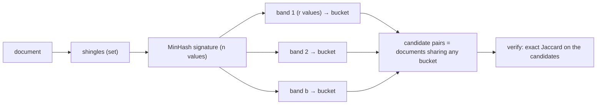

A web crawler has fetched a billion pages. A large fraction of them are near-duplicates: the same article with a different sidebar, the same product page with a different tracking parameter, the same forum thread paginated three ways. Indexing all of them wastes storage, pollutes search results, and, if the corpus is training data for a language model, makes the model memorise boilerplate. You need to find pairs of documents that are, say, 80% similar.

Comparing every pair is `n(n−1)/2 ≈ 5 × 10^17` comparisons. At a billion comparisons per second that is sixteen years. Even if each document were summarised as a small set, you cannot afford to touch every pair. You need two things: a way to estimate similarity from a small fixed-size fingerprint, and a way to find candidate pairs without enumerating pairs at all. Those are MinHash and locality-sensitive hashing.

## Similarity as set overlap

First decide what "similar" means. The workhorse for documents is **Jaccard similarity** between sets:

$$J(A, B) = \frac{|A \cap B|}{|A \cup B|}.$$

Two identical sets score 1, disjoint sets score 0, and `{a, b, c, d}` against `{c, d, e}` scores `2/5 = 0.4`.

To turn a document into a set, **shingle** it: take every substring of `k` consecutive characters (or `k` consecutive words). `"abcab"` with `k = 2` gives `{ab, bc, ca}`. Shingling captures local word order, which bag-of-words does not; two documents with the same words in a different order share few shingles. Typical choices are `k = 5`–`9` characters for short text or `k = 3` words for long documents; a small `k` makes unrelated documents look similar because they share common short strings, a large `k` makes a one-character edit destroy `k` shingles. Shingles are usually hashed to 32- or 64-bit integers so the set is a set of numbers.

At this point a document is a set of a few thousand integers, and you could compute Jaccard exactly with a hash set. That solves the "what is similarity" question and none of the scale problem: the sets are still large, and there are still `n²` pairs.

## MinHash: a fingerprint whose collisions measure similarity

Pick a random permutation `π` of the universe of all possible shingles. Define `minhash_π(A)` as the element of `A` that comes first under `π`. The key fact is

$$P\big[\text{minhash}_\pi(A) = \text{minhash}_\pi(B)\big] = J(A, B).$$

Why: walk the union `A ∪ B` in `π` order and stop at the first element. That element is in both sets with probability `|A ∩ B| / |A ∪ B|`, in which case both minhashes equal it; otherwise it is in exactly one set, and the minhashes differ. No other elements matter.

So one random permutation gives you a biased coin whose bias is the Jaccard similarity. Flip `n` such coins (use `n` permutations) and the fraction of agreements estimates `J`. The **signature** of a set is the vector of its `n` minhashes; `n = 128` 32-bit values is 512 bytes per document, whatever its size, and comparing two documents is comparing two 512-byte vectors position by position.

### Worked example

Universe `{a, b, c, d, e, f}`, `A = {a, b, c, d}`, `B = {c, d, e}`, true `J = 0.4`. Four permutations, written as the order in which elements appear:

| Permutation order | min(A) | min(B) | Agree? |
|---|---|---|---|
| e, a, c, b, d, f | a | e | no |
| c, f, a, b, d, e | c | c | yes |
| d, b, e, a, c, f | d | d | yes |
| b, e, c, a, d, f | b | e | no |

Estimate: `2/4 = 0.5` against a truth of `0.4`. With four permutations the standard error is `√(J(1−J)/n) = √(0.24/4) ≈ 0.24`; with 128 it is `0.043`, and with 256 about `0.03`. Choose `n` from the precision you need at the threshold you care about: distinguishing 0.8 from 0.9 needs `n` in the low hundreds.

### Permutations in practice

You cannot store a random permutation of a `2^64` universe. The standard substitute is `n` random hash functions `h_i(x) = (a_i · x + b_i) mod p` with a large prime `p`; the minhash under `h_i` is `min over x in A of h_i(x)`. Computing a signature is then `n` hashes per shingle, `O(n · |A|)` per document. A cheaper variant, *one-permutation hashing*, hashes each shingle once, splits the hash range into `n` bins, and takes the minimum per bin.

```python
import random

class MinHasher:
    P = (1 << 61) - 1                      # Mersenne prime
    def __init__(self, n=128, seed=0):
        rng = random.Random(seed)
        self.params = [(rng.randrange(1, self.P), rng.randrange(0, self.P)) for _ in range(n)]

    def signature(self, shingle_hashes):
        sig = []
        for a, b in self.params:
            sig.append(min((a * x + b) % self.P for x in shingle_hashes))
        return sig

def estimate_jaccard(sig_a, sig_b):
    return sum(x == y for x, y in zip(sig_a, sig_b)) / len(sig_a)
```

A signature is also a **mergeable** summary: the signature of `A ∪ B` is the position-wise minimum of the two signatures. That is what makes MinHash the right tool for the intersection question HyperLogLog could not answer in the [previous lesson](/learn/advanced-data-structures/probabilistic-structures/count-min-sketch-and-hyperloglog): estimate `J(A, B)` from signatures, estimate `|A ∪ B|` from the merged signature's cardinality (or a HyperLogLog), and `|A ∩ B| = J · |A ∪ B|`.

## Locality-sensitive hashing: finding the pairs

Signatures make each comparison cheap, but a billion documents still means `5 × 10^17` comparisons. Locality-sensitive hashing (LSH) inverts the problem: instead of comparing pairs, hash each document into buckets in a way that *similar documents are likely to share a bucket and dissimilar ones are not*, then compare only within buckets.

For MinHash signatures the construction is **banding**. Split the `n` signature positions into `b` bands of `r` rows each (`n = b · r`). For each band, hash the band's `r` values together into a bucket. Two documents are a *candidate pair* if they land in the same bucket in *at least one* band.

If the true similarity is `s`, the probability that a band's `r` values all agree is `s^r`, so the probability that at least one of the `b` bands agrees is

$$P(\text{candidate}) = 1 - (1 - s^r)^b.$$

That function is an S-curve. With `b = 20` bands of `r = 5` rows (`n = 100`):

| Similarity `s` | `s^5` | `P(candidate)` |
|---|---|---|
| 0.2 | 0.00032 | 0.006 |
| 0.3 | 0.0024 | 0.047 |
| 0.4 | 0.0102 | 0.19 |
| 0.5 | 0.031 | 0.47 |
| 0.6 | 0.078 | 0.80 |
| 0.8 | 0.33 | 0.9996 |
| 0.9 | 0.59 | 1.0000 |

Below 0.3 almost nothing becomes a candidate; above 0.7 almost everything does. The steep part of the curve sits near the threshold `t ≈ (1/b)^{1/r} = 0.05^{0.2} ≈ 0.55`. You tune `b` and `r` to put that threshold where you want it: more rows per band (`r` up) pushes the threshold up and sharpens the curve; more bands (`b` up) pulls the threshold down and catches more candidates.



The cost model is what makes this work at scale. Hashing is `O(n)` per document, one pass. Candidates are found by grouping on `(band, bucket)`, which is a sort or a shuffle in a batch job. Then you compute the exact similarity only for candidate pairs. The two error types are visible in the table: pairs with `s = 0.4` become candidates 19% of the time (**false positives**, filtered out by the verification step at the cost of wasted comparisons), and pairs with `s = 0.6` are missed 20% of the time (**false negatives**, which are gone for good). If you cannot afford false negatives at your threshold, increase `b` and pay with more false positives.

Where this runs: web crawlers and search indexes, plagiarism detection, entity resolution ("are these two customer records the same person?") in data pipelines, and the near-deduplication step in building large text corpora, where MinHash-LSH over 5-gram shingles is the standard first pass before exact suffix-array matching. Spark's MLlib ships `MinHashLSH` for exactly this join.

## Other similarities, other hashes

MinHash is locality-sensitive for Jaccard. Other similarity measures have their own LSH families, and the pattern is always "a hash whose collision probability is a monotone function of similarity, then banding to sharpen it".

**Cosine similarity and random hyperplanes (SimHash).** For vectors, draw a random vector `r` and record one bit: `sign(r · v)`. Two vectors on the same side of the hyperplane agree. The probability of agreement is `1 − θ/π`, where `θ` is the angle between them. Concatenate 64 such bits and Hamming distance between the fingerprints estimates the angle. Google's near-duplicate page detection used 64-bit SimHash fingerprints over weighted term features and looked for fingerprints within Hamming distance 3, which is a very cheap comparison and a very compact index (8 bytes per page).

**Euclidean distance.** Project onto a random line and quantise into buckets of width `w`; nearby points share buckets (`BucketedRandomProjectionLSH` in Spark).

### The bridge to vector search

Embedding vectors from a language model live in 768–3072 dimensions, and "find the 10 nearest neighbours by cosine" is the query behind semantic search, recommendation and retrieval-augmented generation. Random-hyperplane LSH answers it, and it was the standard answer for a decade: no training, sublinear query time, easy to shard.

It is no longer the default. LSH needs many tables to reach high recall in high dimensions, and its memory grows with the number of tables. Graph-based indexes, above all **HNSW** (hierarchical navigable small world), reach 95%+ recall at a fraction of the query cost by greedily walking a graph whose edges connect near neighbours, with coarse upper layers for fast entry. Every mainstream vector database (pgvector, Elasticsearch, Milvus, Qdrant, Weaviate) defaults to HNSW or an IVF variant.

```viz
{"type": "ml", "scenario": "embeddings-similarity",
 "title": "Cosine similarity between embeddings",
 "caption": "Random-hyperplane LSH turns the angle between two vectors into a collision probability; HNSW instead walks a graph of near neighbours."}
```

```viz
{"type": "ml", "scenario": "vector-search-hnsw",
 "title": "HNSW search",
 "caption": "The modern replacement for LSH in high-dimensional nearest-neighbour search: greedy descent through layered proximity graphs."}
```

LSH still wins in three places: when the data is sets rather than vectors (MinHash has no graph-based competitor for Jaccard), when you need a *join* over billions of items in a batch pipeline (bucketing shuffles beautifully; graph search does not), and when the index must be built in a single streaming pass with no training step. Say that when an interviewer asks "why not just use a vector database?" for a deduplication problem.

## Exercises

```exercise
id: jaccard-percent
title: Jaccard similarity of two shingle lists
prompt: |
  Given two lists of shingles (strings, possibly with duplicates), return
  the Jaccard similarity of the two *sets* as an integer percentage,
  rounded to the nearest whole number. Two empty lists are identical
  (return 100).
languages: [python, javascript]
entry: jaccard_percent
starter:
  python: |
    def jaccard_percent(a, b):
        # your code here
        return 0
  javascript: |
    function jaccard_percent(a, b) {
      // your code here
      return 0;
    }
tests:
  - args: [["a","b","c","d"], ["c","d","e"]]
    expected: 40
  - args: [["x","y","z"], ["z","y","x"]]
    expected: 100
    label: order does not matter
  - args: [["a","b"], ["c","d"]]
    expected: 0
    label: disjoint
  - args: [["x","x","y"], ["y","z"]]
    expected: 33
    label: duplicates count once
  - args: [[], []]
    expected: 100
    hidden: true
    label: two empty sets
  - args: [["the","cat","sat"], ["the","cat","sat","on","mat"]]
    expected: 60
    hidden: true
hints:
  - "Convert both lists to sets first; the intersection size over the union size is the answer."
  - "Guard the empty-union case before dividing."
```

```exercise
id: char-shingles
title: Shingle a string
prompt: |
  Return the sorted list of distinct `k`-character shingles of `text`
  (every substring of length `k`). Return an empty list when `text` is
  shorter than `k`. Sort by plain string comparison.
languages: [python, javascript]
entry: shingles
starter:
  python: |
    def shingles(text, k):
        # your code here
        return []
  javascript: |
    function shingles(text, k) {
      // your code here
      return [];
    }
tests:
  - args: ["abcab", 2]
    expected: ["ab", "bc", "ca"]
  - args: ["banana", 3]
    expected: ["ana", "ban", "nan"]
    label: repeated shingles appear once
  - args: ["aaaa", 2]
    expected: ["aa"]
  - args: ["ab", 3]
    expected: []
    label: text shorter than k
  - args: ["hello world", 4]
    expected: [" wor", "ello", "hell", "llo ", "lo w", "o wo", "orld", "worl"]
    hidden: true
    label: spaces are characters too
  - args: ["abc", 1]
    expected: ["a", "b", "c"]
    hidden: true
hints:
  - "There are len(text) - k + 1 shingles; collect them in a set, then sort."
```

## Senior signals

- You define similarity before choosing a structure: **Jaccard on shingles** for documents, **cosine** for embeddings, and you can say why bag-of-words is not enough.
- You can state and prove the MinHash property `P[collision] = J` in two sentences.
- You know LSH is about **avoiding the pairwise loop**, and you can sketch the banding S-curve, place its threshold at `(1/b)^{1/r}` and explain both error types.
- You explain why **HNSW replaced LSH** for embedding search, and the three cases where LSH still wins.
- You pick `n`, `b` and `r` from the precision and threshold the product needs, not from a default.
- You use MinHash signatures to estimate **intersections**, where HyperLogLog subtraction fails.

## Check yourself

```quiz
- q: >-
    Two documents have Jaccard similarity 0.6. With 128 independent MinHash functions, roughly what fraction of their signature positions will agree?
  options: ["It varies with the two documents' sizes", "About 0.77, the square root of 0.6", "About 0.6, independent of set sizes", "About 0.36, since both sets must agree"]
  answer: 2
  explanation: >-
    Each position agrees with probability equal to the Jaccard similarity, independent of set sizes. 0.36 = 0.6² is the probability that two positions both agree; 0.77 = √0.6 plays no role here.
- q: >-
    Your LSH uses 20 bands of 5 rows. Pairs at similarity 0.4 become candidates about 19% of the time, and you cannot afford the verification cost. What is the cheapest change?
  options: ["Use more bands of 5 rows each", "Use more rows in each band", "Use a larger shingle size", "Use exact Jaccard on all pairs"]
  answer: 1
  explanation: >-
    More rows per band lowers s^r for every s below 1, which pushes the S-curve threshold up and suppresses low-similarity candidates. More bands does the opposite. Shingle size changes what similarity means, not the LSH curve, and exact Jaccard on all pairs is the cost LSH exists to avoid.
- q: >-
    Why does banding produce false negatives, and how do you reduce them?
  options: ["They come from the verification step; skip verification", "A similar pair can miss in all bands; add or shorten bands", "Hash collisions hide similar pairs; use a stronger hash", "MinHash underestimates similarity; use more hash functions"]
  answer: 1
  explanation: >-
    A pair at similarity s agrees in a band with probability s^r; if that fails in all b bands the pair is never a candidate. More bands (or fewer rows per band) raise 1 − (1 − s^r)^b at the cost of more false positives, which verification then filters. MinHash itself is an unbiased estimate of similarity, so more hash functions alone do not fix it.
- q: >-
    You need the near-duplicate pairs among 2 billion web pages in a nightly batch job. Which approach fits?
  options: ["MinHash over shingles, bucket by band, verify candidates", "Compare every pair with exact Jaccard on a large cluster", "Build an HNSW index over page embeddings and query each page", "Sort pages by length and compare adjacent neighbours"]
  answer: 0
  explanation: >-
    Banding turns the problem into a group-by on (band, bucket), which a batch engine shuffles efficiently, and Jaccard on shingles is the right similarity for near-duplicate text. HNSW is a query-time structure for vector nearest neighbours, not a batch join over sets. Pairwise is 2 × 10^18 comparisons.
- q: >-
    Random-hyperplane hashing produces one bit per hyperplane. What does the fraction of agreeing bits between two vectors estimate?
  options: ["1 − θ/π, where θ is the angle between them", "The Jaccard similarity of their nonzero coordinates", "Their dot product, normalised to lie in [0, 1]", "Their Euclidean distance, normalised by length"]
  answer: 0
  explanation: >-
    Two vectors fall on the same side of a random hyperplane with probability 1 − θ/π. That is a monotone function of cosine similarity, which is why SimHash fingerprints work for near-duplicate detection, but it is not the cosine value (the normalised dot product) itself.
```
