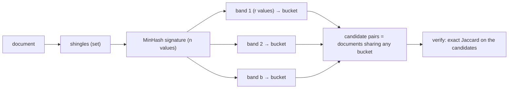

A web crawler has fetched a billion pages. A large fraction of them are near-duplicates: the same article with a different sidebar, the same product page with a different tracking parameter, the same forum thread paginated three ways. Indexing all of them wastes storage, pollutes search results, and, if the corpus is training data for a language model, makes the model memorise boilerplate. You need to find pairs of documents that are, say, 80% similar.

Comparing every pair is `n(n−1)/2 ≈ 5 × 10^17` comparisons. At a billion comparisons per second that is sixteen years. Even if each document were summarised as a small set, you cannot afford to touch every pair. You need two things: a way to estimate similarity from a small fixed-size fingerprint, and a way to find candidate pairs without enumerating pairs at all. Those are MinHash and locality-sensitive hashing. This lesson proves the one property MinHash rests on, traces a signature and a banding pass on concrete data, computes the S-curve for three settings, and then opens the tools that run this at scale. It relies on the [hash functions](/learn/data-structures/hashing/hash-functions) lesson and continues the [count-min sketch and HyperLogLog](/learn/advanced-data-structures/probabilistic-structures/count-min-sketch-and-hyperloglog) lesson, which ended on a question only MinHash can answer.

## Similarity as set overlap

First decide what "similar" means. The workhorse for documents is **Jaccard similarity** between sets:

$$J(A, B) = \frac{|A \cap B|}{|A \cup B|}.$$

Two identical sets score 1, disjoint sets score 0, and `{a, b, c, d}` against `{c, d, e}` scores `2/5 = 0.4`.

To turn a document into a set, **shingle** it: take every substring of `k` consecutive characters (or `k` consecutive words). `"abcab"` with `k = 2` gives `{ab, bc, ca}`. Shingling captures local word order, which bag-of-words does not; two documents with the same words in a different order share few shingles. Typical choices are `k = 5`–`9` characters for short text or `k = 3` words for long documents; a small `k` makes unrelated documents look similar because they share common short strings, a large `k` makes a one-character edit destroy `k` shingles. Shingles are usually hashed to 32- or 64-bit integers so the set is a set of numbers.

At this point a document is a set of a few thousand integers, and you could compute Jaccard exactly with a hash set. That solves the "what is similarity" question and none of the scale problem: the sets are still large, and there are still `n²` pairs.

## MinHash: a fingerprint whose collisions measure similarity

Pick a random permutation `π` of the universe of all possible shingles. Define `minhash_π(A)` as the element of `A` that comes first under `π`. The key fact is

$$P\big[\text{minhash}_\pi(A) = \text{minhash}_\pi(B)\big] = J(A, B).$$

Why: walk the union `A ∪ B` in `π` order and stop at the first element. Under a uniformly random permutation every element of the union is equally likely to be that first one. It is in both sets with probability `|A ∩ B| / |A ∪ B|`, in which case both minhashes equal it; otherwise it is in exactly one set, and the minhashes differ (the other set's minimum comes later). No other elements matter, which is the whole proof.

The idea is Andrei Broder's, from his 1997 work on finding near-duplicate web pages ("On the resemblance and containment of documents" and, with Glassman, Manasse and Zweig, "Syntactic clustering of the web"). One random permutation gives you a biased coin whose bias is the Jaccard similarity. Flip `n` such coins (use `n` permutations) and the fraction of agreements estimates `J`. The **signature** of a set is the vector of its `n` minhashes; `n = 128` 32-bit values is 512 bytes per document, whatever its size, and comparing two documents is comparing two 512-byte vectors position by position.

### A signature, traced

Universe `{a, b, c, d, e, f}`, `A = {a, b, c, d}`, `B = {c, d, e}`, true `J = 0.4`. Four permutations, written as the order in which elements appear:

| Permutation order | Walk of `A ∪ B = {a, b, c, d, e}` in that order | min(A) | min(B) | Agree? |
|---|---|---|---|---|
| e, a, c, b, d, f | first is `e`, only in `B` | a | e | no |
| c, f, a, b, d, e | first is `c`, in both | c | c | yes |
| d, b, e, a, c, f | first is `d`, in both | d | d | yes |
| b, e, c, a, d, f | first is `b`, only in `A` | b | e | no |

Signatures `sig(A) = [a, c, d, b]` and `sig(B) = [e, c, d, e]`; they agree in 2 of 4 positions, estimate `0.5` against a truth of `0.4`. With four permutations the standard error is `√(J(1−J)/n) = √(0.24/4) ≈ 0.24`; with 128 it is `0.043`, and with 256 about `0.03`. Measured with 128 random hash functions on two integer sets with `J = 0.286`, the estimate came out at `0.258`, one standard error low. Choose `n` from the precision you need at the threshold you care about: distinguishing 0.8 from 0.9 needs `n` in the low hundreds.

### Permutations in practice

You cannot store a random permutation of a `2^64` universe. The standard substitute is `n` random hash functions `h_i(x) = (a_i · x + b_i) mod p` with a large prime `p`; the minhash under `h_i` is `min over x in A of h_i(x)`. Computing a signature is then `n` hashes per shingle, `O(n · |A|)` per document: a 5,000-shingle document with 128 hashes is 640,000 multiplications, about a millisecond in C and tens of milliseconds in pure Python. A cheaper variant, *one-permutation hashing*, hashes each shingle once, splits the hash range into `n` bins, and takes the minimum per bin.

```python
import random

class MinHasher:
    P = (1 << 61) - 1                      # Mersenne prime
    def __init__(self, n=128, seed=0):
        rng = random.Random(seed)
        self.params = [(rng.randrange(1, self.P), rng.randrange(0, self.P)) for _ in range(n)]

    def signature(self, shingle_hashes):
        sig = []
        for a, b in self.params:
            sig.append(min((a * x + b) % self.P for x in shingle_hashes))
        return sig

def estimate_jaccard(sig_a, sig_b):
    return sum(x == y for x, y in zip(sig_a, sig_b)) / len(sig_a)
```

A signature is also a **mergeable** summary: the signature of `A ∪ B` is the position-wise minimum of the two signatures. That is what makes MinHash the right tool for the intersection question HyperLogLog could not answer: estimate `J(A, B)` from signatures, estimate `|A ∪ B|` from the merged signature's cardinality (or a HyperLogLog), and `|A ∩ B| = J · |A ∪ B|`.

## Locality-sensitive hashing: finding the pairs

Signatures make each comparison cheap, but a billion documents still means `5 × 10^17` comparisons. Locality-sensitive hashing (LSH) inverts the problem: instead of comparing pairs, hash each document into buckets in a way that *similar documents are likely to share a bucket and dissimilar ones are not*, then compare only within buckets.

For MinHash signatures the construction is **banding**. Split the `n` signature positions into `b` bands of `r` rows each (`n = b · r`). For each band, hash the band's `r` values together into a bucket. Two documents are a *candidate pair* if they land in the same bucket in *at least one* band.

### Banding, traced

Four documents with 4-position signatures, `b = 2` bands of `r = 2`:

| Document | Signature | Band 0 key | Band 1 key |
|---|---|---|---|
| 0 | `[1, 2, 3, 4]` | `(1, 2)` | `(3, 4)` |
| 1 | `[1, 2, 9, 9]` | `(1, 2)` | `(9, 9)` |
| 2 | `[5, 5, 3, 4]` | `(5, 5)` | `(3, 4)` |
| 3 | `[7, 7, 7, 7]` | `(7, 7)` | `(7, 7)` |

Band 0 buckets: `(1, 2) → {0, 1}`, `(5, 5) → {2}`, `(7, 7) → {3}`. Band 1 buckets: `(3, 4) → {0, 2}`, `(9, 9) → {1}`, `(7, 7) → {3}`. Candidate pairs: `(0, 1)` from band 0 and `(0, 2)` from band 1. Documents 1 and 2 agree on no whole band and are never compared, although they agree on nothing anyway; document 3 shares no bucket with anyone. The verification step then computes exact Jaccard for the two candidates only. The third exercise implements this grouping.

### The S-curve

If the true similarity is `s`, the probability that a band's `r` values all agree is `s^r`, so the probability that at least one of the `b` bands agrees is

$$P(\text{candidate}) = 1 - (1 - s^r)^b.$$

That function is an S-curve, and its shape is set by `b` and `r`:

| Similarity `s` | `b = 20, r = 5` (`n = 100`) | `b = 10, r = 10` (`n = 100`) | `b = 50, r = 2` (`n = 100`) |
|---|---|---|---|
| 0.2 | 0.006 | 0.0000 | 0.870 |
| 0.3 | 0.047 | 0.0001 | 0.991 |
| 0.4 | 0.186 | 0.001 | 0.9998 |
| 0.5 | 0.470 | 0.010 | 1.000 |
| 0.6 | 0.802 | 0.059 | 1.000 |
| 0.7 | 0.975 | 0.249 | 1.000 |
| 0.8 | 0.9996 | 0.679 | 1.000 |
| 0.9 | 1.000 | 0.986 | 1.000 |
| Threshold `(1/b)^{1/r}` | **0.55** | **0.79** | **0.14** |

With `b = 20, r = 5`, below 0.3 almost nothing becomes a candidate and above 0.7 almost everything does; the steep part sits near the threshold `t ≈ (1/b)^{1/r} = 0.05^{0.2} = 0.55`. Ten bands of ten rows push the threshold to 0.79 and sharpen the curve (good for "find 90% duplicates", bad for 60%); fifty bands of two rows pull it down to 0.14 and make nearly everything a candidate, which is a pairwise comparison in disguise. More rows per band (`r` up) raises the threshold and sharpens the curve; more bands (`b` up) lowers it and catches more candidates.



The cost model is what makes this work at scale. Hashing is `O(n)` per document, one pass. Candidates are found by grouping on `(band, bucket)`, which is a sort or a shuffle in a batch job. Then you compute the exact similarity only for candidate pairs. The two error types are visible in the table: pairs with `s = 0.4` become candidates 19% of the time (**false positives**, filtered out by the verification step at the cost of wasted comparisons), and pairs with `s = 0.6` are missed 20% of the time (**false negatives**, which are gone for good). If you cannot afford false negatives at your threshold, increase `b` and pay with more false positives.

## Under the hood: datasketch, Spark, SimHash and corpus deduplication

**`datasketch`** (the standard Python library) defaults to `num_perm = 128`. Before version 2.0.0 (July 2026) every permutation was `(a·x + b) mod (2^61 − 1)` truncated to 32 bits; 2.0.0 made a new `affine32` scheme the default, which pre-mixes each input hash with the MurmurHash3 finaliser and computes `a·h + b` modulo `2^32` with odd `a`, because the source notes that folding the 61-bit range down to 32 bits behaves like a random function and inflates similarity estimates on large sets. Its `MinHashLSH(threshold, num_perm, weights)` chooses `b` and `r` automatically by minimising a weighted sum of the false-positive and false-negative probability integrated over the S-curve, so `threshold = 0.5` with 128 permutations yields 25 bands of 5 (125 of the 128 values used). It also ships `MinHashLSHForest` for top-k queries and `LeanMinHash`, which drops the permutation parameters and serialises 32-bit values at 4 bytes each. **Spark MLlib** `MinHashLSH` (`numHashTables`, one per band, each of one hash function) and `BucketedRandomProjectionLSH` for Euclidean distance implement `approxSimilarityJoin`, the batch join over billions of rows that a shuffle on `(band, bucket)` makes cheap. One hash function per table means `r = 1`: the docs describe `numHashTables` as OR-amplification and list AND-amplification as future work, so Spark's S-curve is `1 − (1 − s)^b`, permissive by construction, and the distance filter after the join does the real selection.

**Google's SimHash** ([Manku, Jain and Das Sarma, WWW 2007](https://static.googleusercontent.com/media/research.google.com/en//pubs/archive/33026.pdf)) applied Charikar's simhash (STOC 2002) to near-duplicate detection for a web crawler, and found that for 8 billion pages a 64-bit fingerprint per page with a Hamming-distance threshold of 3 was enough: the fingerprint is a random-hyperplane hash over weighted term features, and the index stores several permuted copies of the fingerprints sorted so that any 3-bit-different fingerprint shares a long prefix with the query in at least one copy. Eight bytes per page, against 24 for Broder's shingle-based fingerprints, and a probe of a few sorted tables replaced pairwise comparison entirely.

**LLM corpus deduplication.** A common first pass over web-scale text is MinHash-LSH over 5-gram shingles. The paper that showed deduplication improves language models ([Lee et al., 2021](https://arxiv.org/abs/2107.06499)) used 9,000 minhashes per document split into 450 bands of 20 (the paper writes the candidate probability as `1 − (1 − s^20)^450`, about 76% at `s = 0.75` and 99.4% at 0.8), kept a candidate pair as a duplicate only if its edit similarity exceeded 0.8, and separately used a suffix array to remove exact duplicate substrings. RefinedWeb (the Falcon corpus, 2023) reused those parameters for five trillion tokens, with the banding step as a distributed group-by. Not every pipeline needs the fuzzy match: Dolma (2024) deduplicated URLs, documents and paragraphs exactly with Bloom filters, which is linear-time and catches only verbatim repeats. Getting `k`, the threshold and the band layout wrong is the difference between removing boilerplate and removing every page that shares a footer.

**Theta sketches** (Apache DataSketches, used in Druid) solve the intersection problem from the previous lesson a different way: keep the `k` smallest hash values of a set (a KMV sketch); the union is the `k` smallest of the merged values and the intersection is the values common to both below the shared threshold, with error bounds that stay honest for small intersections.

## Other similarities, other hashes

MinHash is locality-sensitive for Jaccard. Other similarity measures have their own LSH families, and the pattern is always "a hash whose collision probability is a monotone function of similarity, then banding to sharpen it".

**Cosine similarity and random hyperplanes (SimHash).** For vectors, draw a random vector `r` and record one bit: `sign(r · v)`. Two vectors on the same side of the hyperplane agree. The probability of agreement is `1 − θ/π`, where `θ` is the angle between them: 1.0 at 0°, 0.833 at 30°, 0.667 at 60°, 0.5 at 90°. Concatenate 64 such bits and the Hamming distance between the fingerprints estimates the angle.

**Euclidean distance.** Project onto a random line and quantise into buckets of width `w`; nearby points share buckets (`BucketedRandomProjectionLSH` in Spark).

### The bridge to vector search

Embedding vectors from a language model live in hundreds to a few thousand dimensions (OpenAI's `text-embedding-3-large` returns 3,072 by default), and "find the 10 nearest neighbours by cosine" is the query behind semantic search, recommendation and retrieval-augmented generation. Random-hyperplane LSH answers it, and it was the standard answer for a decade: no training, sublinear query time, easy to shard.

It is no longer the default. LSH needs many tables to reach high recall in high dimensions, and its memory grows with the number of tables. Graph-based indexes, above all **HNSW** (hierarchical navigable small world), reach 95%+ recall at a fraction of the query cost by greedily walking a graph whose edges connect near neighbours, with coarse upper layers for fast entry. The mainstream vector stores index with HNSW or an IVF-style partitioning: pgvector scans exactly until you create an HNSW or IVFFlat index, Qdrant uses only HNSW for dense vectors, Weaviate defaults to HNSW, and Elasticsearch's `dense_vector` defaults to HNSW over quantised vectors (`int8_hnsw` or `bbq_hnsw` in 9.0–9.3); the [vector databases lesson](/learn/databases/nosql-and-specialised/graph-time-series-and-vector-databases) covers their trade-offs.

```viz
{"type": "ml", "scenario": "embeddings-similarity",
 "title": "Cosine similarity between embeddings",
 "caption": "Random-hyperplane LSH turns the angle between two vectors into a collision probability; HNSW instead walks a graph of near neighbours."}
```

```viz
{"type": "ml", "scenario": "vector-search-hnsw",
 "title": "HNSW search",
 "caption": "The modern replacement for LSH in high-dimensional nearest-neighbour search: greedy descent through layered proximity graphs."}
```

LSH still wins in three places: when the data is sets rather than vectors (MinHash has no graph-based competitor for Jaccard), when you need a *join* over billions of items in a batch pipeline (bucketing shuffles beautifully; graph search does not), and when the index must be built in a single streaming pass with no training step. Say that when an interviewer asks "why not use a vector database?" for a deduplication problem.

## Trade-offs

| | Exact pairwise Jaccard | MinHash signatures, pairwise | MinHash + LSH banding | SimHash (64-bit) | HNSW over embeddings |
|---|---|---|---|---|---|
| Per-item cost | store the set | `n` hashes per shingle | same | one fingerprint | embedding + graph insert |
| Pair-finding cost | `O(N²)` set intersections | `O(N²)` 512-byte compares | `O(N · b)` bucket inserts + verify | sorted-table probes | graph search per query |
| Memory per item | the whole set | 512 B at `n = 128` | 512 B + `b` bucket ids | 8 B | vector + ~`M` edges |
| Error | none | ±`√(J(1−J)/n)` | plus banding false negatives | Hamming threshold | recall < 100% |
| Handles sets / text | yes | yes | yes | weighted features | via embeddings |
| Batch join friendly | no | no | yes (group-by) | yes | no |

## Failure modes

| Symptom | Diagnosis | Fix |
|---|---|---|
| A deduplication job removes pages that share only a header and footer | Shingle size too small or the similarity threshold too low; boilerplate dominates short documents | Larger `k`, strip boilerplate before shingling, or raise the threshold and move the S-curve with `r` |
| Two pages that differ by one character are not flagged as duplicates | `k` too large: one edit destroys `k` shingles, and on a short page that is a large fraction of the set | Smaller `k`, or word shingles |
| One bucket holds a million documents and the verification step runs for days | A common band value (empty or near-empty documents all hash to the same minima, or a band of all-equal values) creates `O(m²)` candidate pairs in one bucket | Drop documents below a minimum shingle count, salt bands with the band index, cap bucket size and sample |
| Estimated similarities are biased high for tiny documents | A document with fewer shingles than hash functions has many tied minima, and tiny sets have high Jaccard variance anyway | Skip or exact-compare documents under a shingle threshold |
| Recall on a threshold of 0.9 is fine but a product change asks for 0.6 and recall collapses | `b` and `r` were tuned for a threshold at 0.8–0.9; at 0.6 the S-curve is near zero | Re-band (more bands, fewer rows) or rebuild with more permutations; the signature can be reused, the bucketing cannot |
| LSH over embeddings gives 60% recall while the vector database gives 95% | Random-hyperplane LSH in 1,000 dimensions needs many tables for high recall; HNSW is the right structure for that workload | HNSW or IVF for vectors; keep LSH for sets and batch joins |

## Interviewer follow-ups

**"Prove that the MinHash collision probability equals the Jaccard similarity."** Model answer: under a random permutation the first element of the union is uniformly random; the minhashes agree exactly when that element lies in the intersection, which happens with probability `|A ∩ B| / |A ∪ B|`. Common wrong answer: "because hashes are uniform", which explains nothing about the intersection.

**"You have 128-value signatures. How do you choose bands and rows for a threshold of 0.8?"** Model answer: set `(1/b)^{1/r} ≈ 0.8` with `b · r = 128`, for example 16 bands of 8 (`0.0625^{0.125} = 0.707`) or 8 bands of 16 (`0.125^{1/16} = 0.878`), then compute the false-negative rate at 0.8 and the false-positive rate at, say, 0.5 for each and pick by which error is more expensive; `datasketch` does this optimisation for you. Common wrong answer: "use one band", which makes only exact signature matches candidates.

**"Why does banding produce false negatives, and how do you reduce them?"** Model answer: a pair at similarity `s` agrees in a band with probability `s^r` and can miss in all `b` bands; more bands or fewer rows per band raise `1 − (1 − s^r)^b`, at the price of more false positives for verification. Common wrong answer: "use more hash functions", which tightens the estimate but not the banding probability unless the bands change too.

**"Near-duplicate detection across 2 billion pages nightly. Sketch the pipeline and its cost."** Model answer: shingle (5-grams), 128–256 MinHash values per page, band into `(band, bucket)` keys, a distributed group-by emits candidate pairs, verify with exact Jaccard on the candidates, union-find the duplicate clusters; the cost is `O(N · n)` hashing plus one shuffle plus the verification of a few times `N` pairs, hours not years. Common wrong answer: "compare every pair on a big cluster", `2 × 10^18` comparisons.

**"When is LSH still the right choice over a vector database?"** Model answer: set similarity (Jaccard has no graph competitor), batch joins where a group-by beats per-query graph search, and streaming index construction with no training; for embedding nearest-neighbour queries, HNSW wins on recall per query. Common wrong answer: "never, vector databases replaced it".

## What mid-level engineers get wrong

- **Using bag-of-words Jaccard** and calling reordered text a duplicate.
- **Reaching for a vector database** for a set-similarity join.
- **Picking `b` and `r` without computing the S-curve**, then discovering the threshold is nowhere near the product's definition of "duplicate".
- **Skipping the verification step**, so banding false positives become false duplicates.
- **Letting empty documents into the bucketing**, which creates one giant bucket.
- **Reporting the MinHash estimate as the similarity** without its standard error.

## Exercises

```exercise
id: jaccard-percent
title: Jaccard similarity of two shingle lists
prompt: |
  Given two lists of shingles (strings, possibly with duplicates), return
  the Jaccard similarity of the two *sets* as an integer percentage,
  rounded to the nearest whole number. Two empty lists are identical
  (return 100).
languages: [python, javascript]
entry: jaccard_percent
starter:
  python: |
    def jaccard_percent(a, b):
        # your code here
        return 0
  javascript: |
    function jaccard_percent(a, b) {
      // your code here
      return 0;
    }
tests:
  - args: [["a","b","c","d"], ["c","d","e"]]
    expected: 40
  - args: [["x","y","z"], ["z","y","x"]]
    expected: 100
    label: order does not matter
  - args: [["a","b"], ["c","d"]]
    expected: 0
    label: disjoint
  - args: [["x","x","y"], ["y","z"]]
    expected: 33
    label: duplicates count once
  - args: [[], []]
    expected: 100
    hidden: true
    label: two empty sets
  - args: [["the","cat","sat"], ["the","cat","sat","on","mat"]]
    expected: 60
    hidden: true
hints:
  - "Convert both lists to sets first; the intersection size over the union size is the answer."
  - "Guard the empty-union case before dividing."
```

```exercise
id: char-shingles
title: Shingle a string
prompt: |
  Return the sorted list of distinct `k`-character shingles of `text`
  (every substring of length `k`). Return an empty list when `text` is
  shorter than `k`. Sort by plain string comparison.
languages: [python, javascript]
entry: shingles
starter:
  python: |
    def shingles(text, k):
        # your code here
        return []
  javascript: |
    function shingles(text, k) {
      // your code here
      return [];
    }
tests:
  - args: ["abcab", 2]
    expected: ["ab", "bc", "ca"]
  - args: ["banana", 3]
    expected: ["ana", "ban", "nan"]
    label: repeated shingles appear once
  - args: ["aaaa", 2]
    expected: ["aa"]
  - args: ["ab", 3]
    expected: []
    label: text shorter than k
  - args: ["hello world", 4]
    expected: [" wor", "ello", "hell", "llo ", "lo w", "o wo", "orld", "worl"]
    hidden: true
    label: spaces are characters too
  - args: ["abc", 1]
    expected: ["a", "b", "c"]
    hidden: true
hints:
  - "There are len(text) - k + 1 shingles; collect them in a set, then sort."
```

```exercise
id: lsh-candidates
title: Find candidate pairs by banding
prompt: |
  Implement `lsh_candidates(signatures, b, r)`. `signatures` is a list of
  MinHash signatures, each a list of `b * r` integers. Split every
  signature into `b` bands of `r` consecutive values. Two documents are a
  candidate pair if, for at least one band index, their values in that
  band are identical (the same band on both sides: band 0 only matches
  band 0). Return the candidate pairs as `[i, j]` with `i < j`, each pair
  once, sorted by `i` then `j`. Return `[]` for an empty list.
languages: [python, javascript]
entry: lsh_candidates
starter:
  python: |
    def lsh_candidates(signatures, b, r):
        buckets = {}   # (band, tuple of r values) -> list of document indices
        # fill the buckets, then emit every pair inside each bucket
        return []
  javascript: |
    function lsh_candidates(signatures, b, r) {
      const buckets = new Map();   // "band:v1,v2,..." -> array of document indices
      // fill the buckets, then emit every pair inside each bucket
      return [];
    }
tests:
  - args: [[[1, 2, 3, 4], [1, 2, 9, 9], [5, 5, 3, 4], [7, 7, 7, 7]], 2, 2]
    expected: [[0, 1], [0, 2]]
    label: the banding trace from the lesson
  - args: [[[1, 2, 3, 4], [1, 2, 3, 4]], 4, 1]
    expected: [[0, 1]]
    label: identical signatures pair once, not once per band
  - args: [[[1, 2], [3, 4], [5, 6]], 1, 2]
    expected: []
    label: no shared bands
  - args: [[], 2, 2]
    expected: []
    label: no documents
  - args: [[[1, 1, 1, 1, 1, 1], [1, 1, 2, 2, 3, 3], [9, 9, 2, 2, 8, 8], [1, 1, 7, 7, 3, 3]], 3, 2]
    expected: [[0, 1], [0, 3], [1, 2], [1, 3]]
    hidden: true
    label: three bands, several buckets
  - args: [[[1, 2, 3, 4], [9, 9, 3, 4], [9, 9, 8, 8], [1, 2, 8, 8]], 2, 2]
    expected: [[0, 1], [0, 3], [1, 2], [2, 3]]
    hidden: true
    label: a chain of candidates through different bands
hints:
  - "Key each bucket by the band index together with the band's values, so equal values in different bands never collide."
  - "Collect pairs in a set to deduplicate documents that share several bands, then sort."
```

## Senior signals

- You define similarity before choosing a structure: **Jaccard on shingles** for documents, **cosine** for embeddings, and you can say why bag-of-words is not enough and what `k` trades off.
- You can state and prove the MinHash property `P[collision] = J` in two sentences, trace a signature by hand, and quote the standard error for `n` hashes.
- You know LSH is about **avoiding the pairwise loop**, can trace the bucketing, sketch the banding S-curve for a given `b` and `r`, place its threshold at `(1/b)^{1/r}`, explain both error types, and pick `n`, `b` and `r` from the precision and threshold the product needs while guarding the pipeline against giant buckets and tiny documents.
- You know what `datasketch`, Spark's `MinHashLSH`, Google's SimHash index and the LLM corpus-deduplication pipelines actually run, including the 64-bit / Hamming-3 and 9,000-hash / 450-bands-of-20 settings.
- You explain why **HNSW replaced LSH** for embedding search, and the three cases where LSH still wins.
- You use MinHash signatures or Theta sketches to estimate **intersections**, where HyperLogLog subtraction fails.

## Check yourself

```quiz
- q: >-
    Two documents have Jaccard similarity 0.6. With 128 independent MinHash functions, roughly what fraction of their signature positions will agree?
  options: ["It varies with the two documents' sizes", "About 0.77, the square root of 0.6", "About 0.6, independent of set sizes", "About 0.36, since both sets must agree"]
  answer: 2
  explanation: >-
    Each position agrees with probability equal to the Jaccard similarity, independent of set sizes. 0.36 = 0.6² is the probability that two positions both agree; 0.77 = √0.6 plays no role here.
- q: >-
    In the banding trace, documents 1 and 2 have signatures [1, 2, 9, 9] and [5, 5, 3, 4] with two bands of two rows. Why are they not a candidate pair?
  options: ["They share no whole band: band 0 differs and band 1 differs", "Bucket keys ignore the band index, so their shared values cancel out", "They share only one value in total, and candidates need at least two", "Only documents whose first band matches can become candidates"]
  answer: 0
  explanation: >-
    A candidate pair must agree on every value of at least one band. Band 0 is (1, 2) against (5, 5) and band 1 is (9, 9) against (3, 4), so neither band matches and no bucket contains both. The count of individual shared values plays no part, and every band has the same standing.
- q: >-
    Your LSH uses 20 bands of 5 rows. Pairs at similarity 0.4 become candidates about 19% of the time, and you cannot afford the verification cost. What is the cheapest change?
  options: ["Use more bands of 5 rows each", "Use more rows in each band", "Use a larger shingle size", "Use exact Jaccard on all pairs"]
  answer: 1
  explanation: >-
    More rows per band lowers s^r for every s below 1, which pushes the S-curve threshold up and suppresses low-similarity candidates. More bands does the opposite. Shingle size changes what similarity means, not the LSH curve, and exact Jaccard on all pairs is the cost LSH exists to avoid.
- q: >-
    Why does banding produce false negatives, and how do you reduce them?
  options: ["They come from the verification step; skip verification", "A similar pair can miss in all bands; add or shorten bands", "Hash collisions hide similar pairs; use a stronger hash", "MinHash underestimates similarity; use more hash functions"]
  answer: 1
  explanation: >-
    A pair at similarity s agrees in a band with probability s^r; if that fails in all b bands the pair is never a candidate. More bands (or fewer rows per band) raise 1 − (1 − s^r)^b at the cost of more false positives, which verification then filters. MinHash itself is an unbiased estimate of similarity, so more hash functions alone do not fix it.
- q: >-
    You need the near-duplicate pairs among 2 billion web pages in a nightly batch job. Which approach fits?
  options: ["MinHash over shingles, bucket by band, verify candidates", "Compare every pair with exact Jaccard on a large cluster", "Build an HNSW index over page embeddings and query each page", "Sort pages by length and compare adjacent neighbours"]
  answer: 0
  explanation: >-
    Banding turns the problem into a group-by on (band, bucket), which a batch engine shuffles efficiently, and Jaccard on shingles is the right similarity for near-duplicate text. HNSW is a query-time structure for vector nearest neighbours, not a batch join over sets. Pairwise is 2 × 10^18 comparisons.
- q: >-
    Random-hyperplane hashing produces one bit per hyperplane. What does the fraction of agreeing bits between two vectors estimate?
  options: ["1 − θ/π, where θ is the angle between them", "The Jaccard similarity of their nonzero coordinates", "Their dot product, normalised to lie in [0, 1]", "Their Euclidean distance, normalised by length"]
  answer: 0
  explanation: >-
    Two vectors fall on the same side of a random hyperplane with probability 1 − θ/π. That is a monotone function of cosine similarity, which is why SimHash fingerprints work for near-duplicate detection, but it is not the cosine value (the normalised dot product) itself.
```
