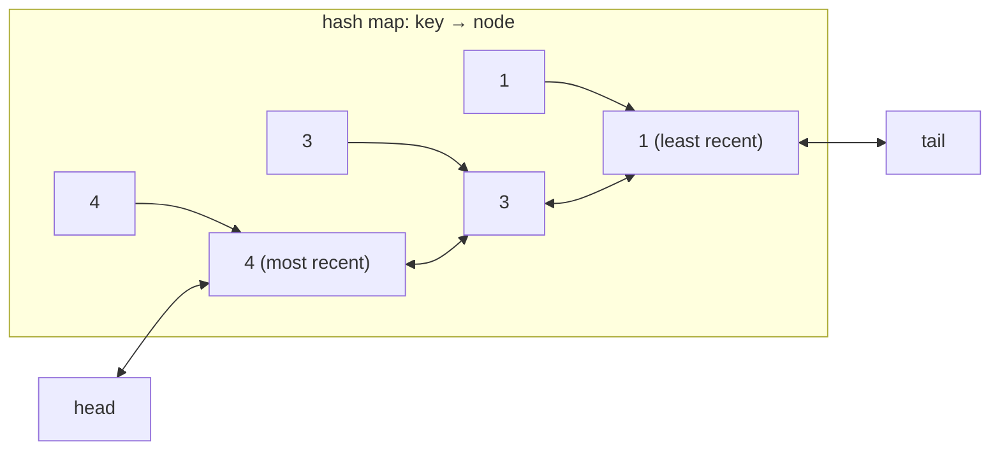

You have a slow source (a database, a remote API, a disk) and a fixed amount of fast memory. You want `get(key)` to return the cached value if it is there, `put(key, value)` to store one, and both to take constant time. When the memory is full, you must throw something away, and the thing you throw away should be the one least likely to be needed again.

Least Recently Used (LRU) is the policy that guesses "the entry nobody has touched for the longest time". It is the default answer because access patterns have temporal locality: what was used recently tends to be used again. The design problem is that "least recently used" is an ordering, and hash maps have no order, while ordered structures have no O(1) lookup. The LRU cache is the structure that gives you both at once, and it is the single most common design question in coding interviews because it tests whether you can compose two basic structures without breaking either one's invariants.

## Why one structure is not enough

A hash map gives `get` and `put` in O(1), but when the map is full you have no idea which key is the oldest; finding it means scanning every entry and comparing timestamps, O(n).

A list ordered by recency tells you the oldest entry instantly (it is at one end) and lets you move an entry to the "most recent" end, but finding the entry for a given key is a walk down the list, O(n).

Put them together. The hash map stores `key → node`, where the node lives in a doubly linked list ordered by recency. A lookup goes through the map, straight to the node, in O(1). Moving that node to the front is O(1) *because the list is doubly linked*: you can unlink a node given only a pointer to it, without walking from the head, since it knows both its neighbours. Evicting is "unlink the tail node and delete its key from the map", also O(1).



The singly linked list would not do: unlinking a node requires updating its predecessor's `next` pointer, and a singly linked node does not know its predecessor. That is the one sentence that explains why this design uses a doubly linked list, and interviewers like to hear it.

## The mechanism, step by step

```viz
{"type": "system", "scenario": "lru-cache",
 "title": "LRU cache with capacity 2",
 "caption": "Every get or put moves the entry to the front. When a put needs space, the entry at the back is evicted."}
```

Trace a capacity-2 cache by hand, writing the list from most to least recent:

| Operation | List after | Returns | Note |
|---|---|---|---|
| `put(1, 1)` | `[1]` | | |
| `put(2, 2)` | `[2, 1]` | | |
| `get(1)` | `[1, 2]` | 1 | 1 moves to the front |
| `put(3, 3)` | `[3, 1]` | | full; evict 2, the back |
| `get(2)` | `[3, 1]` | −1 | miss |
| `put(4, 4)` | `[4, 3]` | | evict 1 |
| `get(1)` | `[4, 3]` | −1 | |
| `get(3)` | `[3, 4]` | 3 | |
| `get(4)` | `[4, 3]` | 4 | |

Two details decide whether an implementation is correct. A `put` on an existing key must *update the value and refresh recency*, not insert a second node. And a `get` on a missing key must not change anything.

## The implementation

Use two sentinel nodes, `head` and `tail`, that are never removed. With sentinels the list is never empty, so `unlink` and `push_front` have no null checks and no special cases for "first node" or "last node". That is the difference between fifteen lines and forty.

```python
class Node:
    __slots__ = ("key", "value", "prev", "next")
    def __init__(self, key=None, value=None):
        self.key, self.value = key, value
        self.prev = self.next = None

class LRUCache:
    def __init__(self, capacity):
        self.capacity = capacity
        self.map = {}
        self.head, self.tail = Node(), Node()      # sentinels
        self.head.next, self.tail.prev = self.tail, self.head

    def _unlink(self, node):
        node.prev.next = node.next
        node.next.prev = node.prev

    def _push_front(self, node):
        node.next, node.prev = self.head.next, self.head
        self.head.next.prev = node
        self.head.next = node

    def get(self, key):
        node = self.map.get(key)
        if node is None:
            return -1
        self._unlink(node)
        self._push_front(node)
        return node.value

    def put(self, key, value):
        node = self.map.get(key)
        if node is not None:
            node.value = value
            self._unlink(node)
            self._push_front(node)
            return
        if len(self.map) >= self.capacity:
            lru = self.tail.prev
            self._unlink(lru)
            del self.map[lru.key]
        node = Node(key, value)
        self.map[key] = node
        self._push_front(node)
```

Note that the node stores the **key** as well as the value. Eviction finds the node via the list, not the map, and it needs the key to delete the map entry. Forgetting the key in the node is the most common bug in whiteboard versions.

### What your standard library already gives you

Every mainstream language ships an insertion-ordered map that is exactly this structure, and knowing that is worth more in production than writing the nodes by hand.

- **Python** `collections.OrderedDict` is a hash map plus a doubly linked list. `move_to_end(key)` is the refresh and `popitem(last=False)` is the eviction. Python 3.7+ plain `dict` preserves insertion order too, but has no O(1) `move_to_end`; `del d[k]; d[k] = v` works and is O(1) but relies on the order guarantee.
- **Java** `LinkedHashMap(capacity, 0.75f, true)` with `accessOrder = true` reorders on `get`; override `removeEldestEntry` to return `size() > capacity` and you have an LRU cache in five lines.
- **JavaScript** `Map` iterates in insertion order. `get` = `delete` then `set` (moves the key to the end); evict with `map.keys().next().value`. All O(1).

```javascript
class LRUCache {
  constructor(capacity) { this.capacity = capacity; this.map = new Map(); }
  get(key) {
    if (!this.map.has(key)) return -1;
    const v = this.map.get(key);
    this.map.delete(key); this.map.set(key, v);   // refresh
    return v;
  }
  put(key, value) {
    if (this.map.has(key)) this.map.delete(key);
    else if (this.map.size >= this.capacity) this.map.delete(this.map.keys().next().value);
    this.map.set(key, value);
  }
}
```

In an interview, mention the library structure, then write the explicit version if asked; the point of the question is the composition, and "I know `OrderedDict` does this" shows you know why.

## The follow-up questions

Getting the basic structure right is the mid-level bar. The senior bar is the questions that come after it.

**"Make it thread-safe."** The naive answer is one lock around every operation. It is correct and it serialises every `get`, which for a cache that exists to make reads fast is a problem. Guava's `Cache` shards the map into segments, each with its own lock, so unrelated keys do not contend. Caffeine goes further: reads do not take the lock at all; they record the access in a lock-free ring buffer that is drained in batches to update the recency order. The price is that the order is *approximately* LRU, which is fine, because LRU was only ever a heuristic.

**"Add a TTL."** Store an expiry timestamp in each node. On `get`, if the entry has expired, treat it as a miss and remove it (lazy expiry). Lazy expiry alone lets dead entries occupy memory until they happen to be touched or reach the tail, so add a periodic sweep, or, as Redis does, sample a few keys every 100 ms and delete the expired ones, repeating while more than a quarter of the sample was expired.

**"Bound by bytes, not by entry count."** Track the total size of stored values; on `put`, evict from the tail until `total + new_size ≤ budget`. That loop may evict many small entries for one large one, and a value larger than the budget must be rejected, not cached. Weighted eviction is what `maximumWeight` in Caffeine does.

**"What about a scan?"** This is the one that matters most. A single pass over a large dataset (an analytics query, a backup, a crawler) touches every key once. Pure LRU dutifully promotes each one to the front and evicts your entire working set to make room for data that will never be read again. This is *scan pollution* (also *sequential flooding*), and it is why almost no production system uses pure LRU.

## What real systems do instead

**Redis** does not maintain a linked list; the pointers would cost 16 bytes per key. Each object carries a 24-bit clock of its last access (at one-second resolution). With `maxmemory-policy allkeys-lru`, eviction samples `maxmemory-samples` random keys (default 5) and evicts the one with the oldest clock, and since Redis 3.0 it keeps a small pool of the best candidates seen across samples, which brings it close to true LRU at a fraction of the memory. The Redis documentation shows the hit ratio curves: with 10 samples the approximation is nearly indistinguishable from exact LRU.

**Linux page cache** keeps two lists, *active* and *inactive*. A page enters the inactive list on first touch and is promoted to active only on a second touch; eviction takes from the inactive tail. A one-off scan fills and drains the inactive list and never displaces the active pages. This is a two-queue (2Q) design, and it is the standard defence against scan pollution.

**MySQL InnoDB buffer pool** uses a single LRU list with *midpoint insertion*: a new page is inserted 3/8 of the way from the tail (the "old" sublist), not at the head, and it is promoted to the "new" sublist only if it is accessed again after `innodb_old_blocks_time` (1 second by default) has passed. A table scan streams through the old sublist and touches nothing that the workload actually uses.

**Postgres** avoids LRU entirely: `shared_buffers` uses a clock-sweep with a usage counter per buffer, and sequential scans of large tables use a small ring buffer so they cannot pollute the pool. [LFU and modern policies](/learn/advanced-data-structures/caches-and-eviction/lfu-and-modern-policies) covers both.

**CDN edges and reverse proxies** (Varnish, Nginx `proxy_cache`, Apache Traffic Server) use LRU or segmented LRU for the object store, often with an admission filter in front (recall the [Bloom filter](/learn/advanced-data-structures/probabilistic-structures/bloom-filters) that only admits an object on its second request).

The lesson: LRU is the *concept* every one of these approximates, and none of them implements the textbook linked list. When you propose "an LRU cache" in a design review, be ready to say which approximation you mean and what protects it from scans.

## Exercise

```exercise
id: lru-cache-class
title: Implement an O(1) LRU cache
prompt: |
  Implement `LRUCache`. The tests first call `set_capacity(n)`, then
  replay `put(key, value)` (returns nothing) and `get(key)` (returns the
  value, or `-1` if absent). Every `get` and every `put` must count as a
  use of that key; when a `put` needs space, evict the least recently
  used key. All operations must be O(1).

  Use a hash map plus a doubly linked list with sentinel nodes (or your
  language's insertion-ordered map, if you can explain why it is O(1)).
languages: [python, javascript]
entry: LRUCache
starter:
  python: |
    class Node:
        def __init__(self, key=None, value=None):
            self.key, self.value = key, value
            self.prev = self.next = None

    class LRUCache:
        def __init__(self):
            self.capacity = 0
            self.map = {}
            self.head, self.tail = Node(), Node()
            self.head.next, self.tail.prev = self.tail, self.head

        def set_capacity(self, capacity):
            self.capacity = capacity

        def get(self, key):
            # TODO
            return -1

        def put(self, key, value):
            # TODO
            pass
  javascript: |
    class LRUCache {
      constructor() {
        this.capacity = 0;
        // TODO: choose your structures
      }
      set_capacity(capacity) { this.capacity = capacity; }
      get(key) {
        // TODO
        return -1;
      }
      put(key, value) {
        // TODO
      }
    }
tests:
  - args: [["set_capacity",2],["put",1,1],["put",2,2],["get",1],["put",3,3],["get",2],["put",4,4],["get",1],["get",3],["get",4]]
    expected: [null, null, null, 1, null, -1, null, -1, 3, 4]
    label: the classic trace
  - args: [["set_capacity",1],["put",1,1],["get",1],["put",2,2],["get",1],["get",2]]
    expected: [null, null, 1, null, -1, 2]
    label: capacity 1
  - args: [["set_capacity",2],["put",1,1],["put",2,2],["put",1,10],["put",3,3],["get",1],["get",2]]
    expected: [null, null, null, null, null, 10, -1]
    label: updating a key refreshes it and keeps one entry
  - args: [["set_capacity",2],["get",5]]
    expected: [null, -1]
    label: miss on an empty cache
  - args: [["set_capacity",3],["put",1,1],["put",2,2],["put",3,3],["get",1],["get",2],["put",4,4],["get",3],["put",5,5],["get",1],["get",2],["get",4],["get",5]]
    expected: [null, null, null, null, 1, 2, null, -1, null, -1, 2, 4, 5]
    hidden: true
    label: gets refresh recency
  - args: [["set_capacity",2],["put",2,1],["put",2,2],["get",2],["put",1,1],["put",4,1],["get",2]]
    expected: [null, null, null, 2, null, null, -1]
    hidden: true
hints:
  - "Store the key inside the list node; eviction reaches the node through the list and must delete its key from the map."
  - "With head and tail sentinels, unlink is two pointer writes and push-front is four, with no null checks."
  - "A put on an existing key updates the value and moves the node to the front; it must not create a second node."
```

Then do the full problem, with its follow-ups, at [LRU Cache](/practice/lru-cache).

## Senior signals

- You explain the design by **what each structure cannot do alone**, and you say why the list must be doubly linked.
- You use **sentinels** and store the **key in the node**, and your code has no special cases.
- You know the library equivalents (`OrderedDict`, `LinkedHashMap` with access order, JS `Map`) and why they are O(1).
- You raise **scan pollution** unprompted and can describe the 2Q / midpoint-insertion defences in Linux and InnoDB.
- You know Redis approximates LRU by **sampling** and can say why exact LRU is not worth 16 bytes per key.
- You answer the thread-safety follow-up with segments or lock-free read buffers, not one global lock.

## Check yourself

```quiz
- q: >-
    Why does the LRU cache need a doubly linked list rather than a singly linked one?
  options: ["Eviction must delete the key from the map, and only a doubly linked node can store it", "Doubly linked nodes use less memory, because sentinels remove the need for null checks", "Pushing to the front needs the old head's address, which a singly linked list does not keep", "Unlinking a node needs its predecessor, which a singly linked node cannot reach in O(1)"]
  answer: 3
  explanation: >-
    The hash map hands you a pointer to the node, not to its predecessor. Unlinking needs predecessor.next = node.next; only a prev pointer gives you that without an O(n) walk. The head is always known, any node can store its key, and a prev pointer costs memory rather than saving it.
- q: >-
    A capacity-2 LRU cache runs put(1,1), put(2,2), get(1), put(3,3). Which key was evicted?
  options: ["Key 3", "Key 2", "No eviction", "Key 1"]
  answer: 1
  explanation: >-
    get(1) moved key 1 to the front, leaving key 2 as least recently used. put(3,3) needed space and evicted 2. Key 1 was inserted first, but insertion order is FIFO's rule, not LRU's.
- q: >-
    A nightly job scans every row of a large table through a pure-LRU cache in front of the database. What happens to the daytime working set?
  options: ["It survives, because its keys have far higher access counts", "It survives, because read-only access does not change LRU order", "It is evicted, because every scanned row becomes most recent", "Part of it survives, because scanned rows enter at the list midpoint"]
  answer: 2
  explanation: >-
    LRU has no notion of frequency; a single touch makes a scanned row the most recent entry. A scan larger than the cache flushes everything. Midpoint insertion is InnoDB's defence against exactly this, not something pure LRU does. This scan pollution is why Linux, InnoDB and Postgres all deviate from pure LRU.
- q: >-
    Why does Redis approximate LRU by sampling a few keys instead of keeping a linked list?
  options: ["A list needs a lock around every access, and Redis must avoid locks", "Expired keys would clog a list, and sampling purges them for free", "Sampling gives a higher hit ratio than exact LRU for the same memory", "A list costs 16 bytes per key, and sampling comes close to exact LRU"]
  answer: 3
  explanation: >-
    Sixteen bytes of pointers per key is significant when keys are small and numerous; a 24-bit clock plus sampling of 5 to 10 keys gets close to exact LRU's hit ratio at a fraction of the memory. It is not more accurate than exact LRU, only nearly as accurate and much cheaper.
- q: >-
    You add thread safety with a single mutex around get and put. What is the main cost?
  options: ["Every read queues on the one lock, so reads lose parallelism", "Gets can interleave with puts, so results become incorrect", "Memory roughly doubles, because every entry needs its own lock", "Recency order becomes approximate, because reads are buffered"]
  answer: 0
  explanation: >-
    A global lock is correct but turns a structure meant to serve reads in parallel into a serial bottleneck. Segmented locks or lock-free read buffers (Caffeine) keep reads concurrent; approximate recency order is the price of those read buffers, not of a global lock.
```
