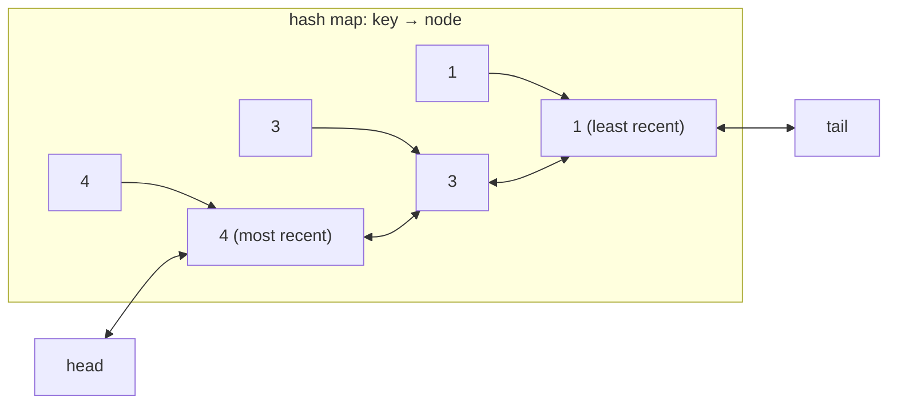

You have a slow source (a database, a remote API, a disk) and a fixed amount of fast memory. You want `get(key)` to return the cached value if it is there, `put(key, value)` to store one, and both to take constant time. When the memory is full, you must throw something away, and the thing you throw away should be the one least likely to be needed again.

Least Recently Used (LRU) is the policy that guesses "the entry nobody has touched for the longest time". It is the default answer because access patterns have temporal locality: what was used recently tends to be used again. The design problem is that "least recently used" is an ordering, and hash maps have no order, while ordered structures have no O(1) lookup. The LRU cache is the structure that gives you both at once, and it is the single most common design question in coding interviews because it tests whether you can compose two basic structures without breaking either one's invariants. This lesson traces every pointer write, prices a node in three runtimes, and then shows that no production cache implements the textbook list. It builds on [hash tables](/learn/data-structures/hashing/hash-tables) and [linked list fundamentals](/learn/data-structures/linked-lists/linked-list-fundamentals).

## Why one structure is not enough

A hash map gives `get` and `put` in O(1), but when the map is full you have no idea which key is the oldest; finding it means scanning every entry and comparing timestamps, O(n).

A list ordered by recency tells you the oldest entry instantly (it is at one end) and lets you move an entry to the "most recent" end, but finding the entry for a given key is a walk down the list, O(n).

Put them together. The hash map stores `key → node`, where the node lives in a doubly linked list ordered by recency. A lookup goes through the map, straight to the node, in O(1). Moving that node to the front is O(1) *because the list is doubly linked*: you can unlink a node given only a pointer to it, without walking from the head, since it knows both its neighbours. Evicting is "unlink the tail node and delete its key from the map", also O(1).



The singly linked list would not do: unlinking a node requires updating its predecessor's `next` pointer, and a singly linked node does not know its predecessor. That is the one sentence that explains why this design uses a doubly linked list, and interviewers like to hear it.

## The mechanism, pointer by pointer

```viz
{"type": "system", "scenario": "lru-cache",
 "title": "LRU cache with capacity 2",
 "caption": "Every get or put moves the entry to the front. When a put needs space, the entry at the back is evicted."}
```

Trace a capacity-2 cache with sentinels `H` (head) and `T` (tail). The list is drawn most-recent first; the last two columns count the pointer writes each operation performs, which is what "O(1)" means here.

| Operation | Map lookup | List before | Pointer writes | List after | Map after | Returns |
|---|---|---|---|---|---|---|
| `put(1, 1)` | miss | `H ⇄ T` | push-front: 4 (`n1.next`, `n1.prev`, `T.prev`, `H.next`) | `H ⇄ 1 ⇄ T` | {1} | |
| `put(2, 2)` | miss | `H ⇄ 1 ⇄ T` | push-front: 4 | `H ⇄ 2 ⇄ 1 ⇄ T` | {1, 2} | |
| `get(1)` | hit → n1 | `H ⇄ 2 ⇄ 1 ⇄ T` | unlink: 2 (`n2.next = T`, `T.prev = n2`); push-front: 4 | `H ⇄ 1 ⇄ 2 ⇄ T` | {1, 2} | 1 |
| `put(3, 3)` | miss, full | `H ⇄ 1 ⇄ 2 ⇄ T` | evict `T.prev` = n2: unlink 2, `del map[2]`; push-front n3: 4 | `H ⇄ 3 ⇄ 1 ⇄ T` | {1, 3} | |
| `get(2)` | miss | unchanged | 0 | `H ⇄ 3 ⇄ 1 ⇄ T` | {1, 3} | −1 |
| `put(4, 4)` | miss, full | `H ⇄ 3 ⇄ 1 ⇄ T` | evict n1: 2 + map delete; push-front n4: 4 | `H ⇄ 4 ⇄ 3 ⇄ T` | {3, 4} | |
| `get(1)` | miss | unchanged | 0 | `H ⇄ 4 ⇄ 3 ⇄ T` | {3, 4} | −1 |
| `get(3)` | hit | `H ⇄ 4 ⇄ 3 ⇄ T` | unlink 2, push-front 4 | `H ⇄ 3 ⇄ 4 ⇄ T` | {3, 4} | 3 |
| `get(4)` | hit | `H ⇄ 3 ⇄ 4 ⇄ T` | unlink 2, push-front 4 | `H ⇄ 4 ⇄ 3 ⇄ T` | {3, 4} | 4 |

Six pointer writes and one or two hash operations per hit, never more, regardless of capacity. Two details decide whether an implementation is correct. A `put` on an existing key must *update the value and refresh recency*, not insert a second node (otherwise the map has one entry and the list has two, and eviction later deletes a map key that points at the wrong node). And a `get` on a missing key must not change anything.

## The implementation

Use two sentinel nodes, `head` and `tail`, that are never removed. With sentinels the list is never empty, so `unlink` and `push_front` have no null checks and no special cases for "first node" or "last node". That is the difference between fifteen lines and forty.

```python
class Node:
    __slots__ = ("key", "value", "prev", "next")
    def __init__(self, key=None, value=None):
        self.key, self.value = key, value
        self.prev = self.next = None

class LRUCache:
    def __init__(self, capacity):
        self.capacity = capacity
        self.map = {}
        self.head, self.tail = Node(), Node()      # sentinels
        self.head.next, self.tail.prev = self.tail, self.head

    def _unlink(self, node):
        node.prev.next = node.next
        node.next.prev = node.prev

    def _push_front(self, node):
        node.next, node.prev = self.head.next, self.head
        self.head.next.prev = node
        self.head.next = node

    def get(self, key):
        node = self.map.get(key)
        if node is None:
            return -1
        self._unlink(node)
        self._push_front(node)
        return node.value

    def put(self, key, value):
        node = self.map.get(key)
        if node is not None:
            node.value = value
            self._unlink(node)
            self._push_front(node)
            return
        if len(self.map) >= self.capacity:
            lru = self.tail.prev
            self._unlink(lru)
            del self.map[lru.key]
        node = Node(key, value)
        self.map[key] = node
        self._push_front(node)
```

Note that the node stores the **key** as well as the value. Eviction finds the node via the list, not the map, and it needs the key to delete the map entry. Forgetting the key in the node is the most common bug in whiteboard versions.

### What your standard library already gives you

Every mainstream language ships an insertion-ordered map that is exactly this structure, and knowing that is worth more in production than writing the nodes by hand.

- **Python** `collections.OrderedDict` is a hash map plus a doubly linked list, implemented in C. `move_to_end(key)` is the refresh and `popitem(last=False)` is the eviction. Python 3.7+ plain `dict` preserves insertion order too, but has no O(1) `move_to_end`; `del d[k]; d[k] = v` works and is O(1) but relies on the order guarantee.
- **Java** `LinkedHashMap(capacity, 0.75f, true)` with `accessOrder = true` reorders on `get`; override `removeEldestEntry` to return `size() > capacity` and you have an LRU cache in five lines.
- **JavaScript** `Map` iterates in insertion order. `get` = `delete` then `set` (moves the key to the end); evict with `map.keys().next().value`. All O(1).

```javascript
class LRUCache {
  constructor(capacity) { this.capacity = capacity; this.map = new Map(); }
  get(key) {
    if (!this.map.has(key)) return -1;
    const v = this.map.get(key);
    this.map.delete(key); this.map.set(key, v);   // refresh
    return v;
  }
  put(key, value) {
    if (this.map.has(key)) this.map.delete(key);
    else if (this.map.size >= this.capacity) this.map.delete(this.map.keys().next().value);
    this.map.set(key, value);
  }
}
```

In an interview, mention the library structure, then write the explicit version if asked; the point of the question is the composition, and "I know `OrderedDict` does this" shows you know why.

## Under the hood: what an entry costs

The list is not free, and its price is the reason every production cache below replaces it.

| Runtime | Per-entry cost of the LRU bookkeeping | Measured or derived from |
|---|---|---|
| CPython, hand-written `Node` with `__slots__` | 64 bytes per node (16-byte GC header, 16-byte object header, four 8-byte slots) plus about 42 bytes of `dict` entry: **~106 bytes** before the key and value objects | `sys.getsizeof` on CPython 3.14 |
| CPython `OrderedDict` | 90.7 bytes per entry for a million `int → int` entries against 41.9 for a plain `dict`: the doubly linked list costs **49 bytes per entry** | `sys.getsizeof` of both containers at 10⁶ entries |
| Java `LinkedHashMap.Entry` | `HashMap.Node` (12-byte header, hash, key, value, next = 32 bytes with compressed references) plus `before` and `after` = **40 bytes**, before the boxed key and value | object layout with compressed oops |
| Redis `robj` | **24 bits** of LRU clock in the object header; no list at all | `LRU_BITS 24` in `server.h` |
| Caffeine `Node` | two references for the access-order deque plus a write-order deque when expiry is on, and a 4-bit frequency in the sketch | `BoundedLocalCache` node classes |

Two pointers per entry look cheap until the cache holds fifty million small entries: 800 MB of pointers for Java, 2.4 GB for CPython nodes, on top of the payload. That arithmetic, plus the cache-line write every `get` performs to move a node, is why Redis keeps 24 bits and samples, why memcached keeps its LRU per slab class and touches an item at most once per minute, and why Caffeine records reads in a buffer instead of moving nodes on the read path.

## Interviewer follow-ups

Getting the basic structure right is the mid-level bar. The senior bar is the questions that come after it.

**"Make it thread-safe."** Model answer: a single lock is correct but serialises every `get`, which for a structure that exists to make reads fast is the wrong shape; shard the map into segments each with its own lock (Guava's `Cache`, 4 segments by default), or record reads in a lock-free ring buffer drained in batches to update the order (Caffeine), accepting that the order is then *approximately* LRU, which is fine because LRU was only ever a heuristic. Common wrong answer: "wrap `get` and `put` in `synchronized`" and stop there.

**"Add a TTL."** Model answer: store an expiry timestamp in each node; on `get`, treat an expired entry as a miss and remove it (lazy expiry); because lazy expiry alone lets dead entries occupy memory until touched or evicted, add a periodic sweep, or, as Redis does, sample 20 keys ten times a second and delete the expired ones, repeating while more than a quarter of the sample was expired. Common wrong answer: a timer thread per entry, which is a heap of a million timers.

**"Bound by bytes, not by entry count."** Model answer: track the total weight; on `put`, evict from the tail until `total + new ≤ budget`, and reject a value heavier than the whole budget rather than evicting everything to make room for it. That loop may evict many small entries for one large one, which is what Caffeine's `maximumWeight` does. The second exercise below is this variant. Common wrong answer: bounding by count and assuming values are the same size.

**"What about a scan?"** Model answer: a single pass over a large dataset (an analytics query, a backup, a crawler) touches every key once; pure LRU promotes each one to the front and evicts the entire working set to make room for data that will never be read again. This is *scan pollution* (also *sequential flooding*), and it is why almost no production system uses pure LRU; the defences are a probation area (2Q, segmented LRU, InnoDB's midpoint insertion) or frequency-based admission ([next lesson](/learn/advanced-data-structures/caches-and-eviction/lfu-and-modern-policies)). Common wrong answer: "make the cache bigger".

**"Can you do it with a singly linked list?"** Model answer: yes, with a trick: to delete a node you can copy the *next* node's key and value into it and unlink the next node instead, updating the map for the moved key, but the tail node then needs special handling and the constant factors get worse; the doubly linked list is the honest answer and costs one pointer more. Common wrong answer: "no, it is impossible".

## Under the hood: what real systems do instead

**Redis** does not maintain a linked list; the pointers would cost 16 bytes per key. Each object carries a 24-bit clock of its last access at one-second resolution (`LRU_CLOCK_RESOLUTION 1000`, so the clock wraps every 194 days and the comparison handles the wrap). With `maxmemory-policy allkeys-lru`, eviction samples `maxmemory-samples` random keys (default 5), and since 3.0 keeps a **pool of 16 candidates** (`EVPOOL_SIZE`) sorted by idle time across samples, evicting the best of the pool. The Redis documentation's hit-ratio curves show that with 10 samples the approximation is nearly indistinguishable from exact LRU. `OBJECT IDLETIME key` reads the clock.

**Linux page cache** keeps two lists, *active* and *inactive*, with `PG_referenced` and `PG_active` flag bits per page. A page enters the inactive list on first touch and is promoted to active only on a second touch; eviction takes from the inactive tail. A one-off scan fills and drains the inactive list and never displaces the active pages. Evicted pages leave *shadow entries* so that a page refaulted soon after eviction is recognised as part of the working set and promoted directly. Since 6.1 the multi-generational LRU (MGLRU) refines this into several generations with cheaper aging. This is a two-queue (2Q) design, and it is the standard defence against scan pollution.

**MySQL InnoDB buffer pool** uses a single LRU list with *midpoint insertion*: a new page is inserted 3/8 of the way from the tail (`innodb_old_blocks_pct = 37`), not at the head, and it is promoted to the "new" sublist only if it is accessed again after `innodb_old_blocks_time` (1,000 ms by default) has passed. A table scan streams through the old sublist and touches nothing that the workload actually uses.

**memcached** keeps one LRU per slab class and, since 1.4.24, segments each into HOT, WARM and COLD sublists (HOT and WARM capped at 20% and 40% of the class); an item is "bumped" at most once every 60 seconds, so a hot item costs no list writes between bumps, and a background *LRU crawler* thread reclaims expired items. Netflix's EVCache, which fronts most of its microservices, is memcached with this eviction plus replication across availability zones, at a scale of on the order of a trillion requests a day across the fleet.

**Postgres** avoids LRU entirely: `shared_buffers` uses a clock-sweep with a usage counter per buffer, and sequential scans of large tables use a small ring buffer so they cannot pollute the pool. **CDN edges and reverse proxies** (Varnish, Nginx `proxy_cache`, Apache Traffic Server) use LRU or segmented LRU for the object store, often with an admission filter in front (recall the [Bloom filter](/learn/advanced-data-structures/probabilistic-structures/bloom-filters) that only admits an object on its second request).

The lesson: LRU is the *concept* every one of these approximates, and none of them implements the textbook linked list. When you propose "an LRU cache" in a design review, be ready to say which approximation you mean and what protects it from scans.

## Trade-offs

| | Exact LRU (list) | Sampled LRU (Redis) | Clock / second chance | 2Q / segmented LRU | W-TinyLFU |
|---|---|---|---|---|---|
| Bookkeeping per entry | 2 pointers (16 B) | 24 bits | 1–3 bits | 2 pointers + segment bit | 2 pointers + ~4 bits |
| Work per hit | 6 pointer writes | 1 clock store | 1 bit set | 6 pointer writes (or 0 if in protected and recently bumped) | 1 buffer append |
| Eviction cost | O(1) | O(samples) | amortised O(1) | O(1) | O(1) |
| Scan resistance | none | none | weak | good | good |
| Hit ratio on skewed traces | baseline | ≈ baseline with 10 samples | ≈ baseline | better | best of the group |

## Failure modes

| Symptom | Diagnosis | Fix |
|---|---|---|
| Hit ratio collapses every night at 02:00 and recovers by 08:00 | A batch scan (report, backup, reindex) runs through the cache and evicts the working set | Bypass the cache for scans, or a scan-resistant policy (2Q, midpoint insertion, TinyLFU) |
| Cache memory is 5× the payload size | Per-entry overhead: ~100 bytes in CPython, 40 in Java, plus boxed keys and values, for small entries | Store compact values (bytes, not objects), bound by weight, or use an off-heap or Redis-style store with 24-bit bookkeeping |
| Read throughput stops scaling past 4 threads; a profiler shows time in lock acquisition | One lock around `get` turns every hit into a serialised critical section | Segment the map, or a read buffer drained in batches (Caffeine); for a read-mostly cache, an immutable snapshot swapped atomically |
| The map and the list disagree: `size()` says 1,000 but iteration finds 1,002; eventually a `KeyError` during eviction | `put` on an existing key created a second node instead of updating the existing one | Look up before inserting; a test that puts the same key twice and then evicts catches it |
| Entries with a TTL keep memory long after they expire | Lazy expiry only: a dead entry lives until touched or reaching the tail | A periodic sweep, or Redis-style sampling of keys with TTLs |
| Two threads `get` the same key and one gets a stale value after a `put` | The refresh step (unlink + push-front) is not atomic with the value update, and a concurrent reader observed a half-moved node | Hold the lock for the whole operation, or design the read path to never move nodes (buffer the access instead) |

## What mid-level engineers get wrong

- **Forgetting the key in the node**, then being unable to delete the map entry on eviction.
- **Inserting a second node on `put` of an existing key**, which desynchronises map and list.
- **Proposing pure LRU for a cache that a nightly job scans through**, and blaming the database when the morning's hit ratio is 20%.
- **Counting entries instead of bytes** for a cache of variable-size values.
- **Quoting O(1) and ignoring the 100 bytes per entry**, so a "10 million entry cache" needs 5× the memory in the plan.
- **One global lock**, presented as "thread-safe" without saying what it costs.

## Exercises

```exercise
id: lru-cache-class
title: Implement an O(1) LRU cache
prompt: |
  Implement `LRUCache`. The tests first call `set_capacity(n)`, then
  replay `put(key, value)` (returns nothing) and `get(key)` (returns the
  value, or `-1` if absent). Every `get` and every `put` must count as a
  use of that key; when a `put` needs space, evict the least recently
  used key. All operations must be O(1).

  Use a hash map plus a doubly linked list with sentinel nodes (or your
  language's insertion-ordered map, if you can explain why it is O(1)).
languages: [python, javascript]
entry: LRUCache
starter:
  python: |
    class Node:
        def __init__(self, key=None, value=None):
            self.key, self.value = key, value
            self.prev = self.next = None

    class LRUCache:
        def __init__(self):
            self.capacity = 0
            self.map = {}
            self.head, self.tail = Node(), Node()
            self.head.next, self.tail.prev = self.tail, self.head

        def set_capacity(self, capacity):
            self.capacity = capacity

        def get(self, key):
            # TODO
            return -1

        def put(self, key, value):
            # TODO
            pass
  javascript: |
    class LRUCache {
      constructor() {
        this.capacity = 0;
        // TODO: choose your structures
      }
      set_capacity(capacity) { this.capacity = capacity; }
      get(key) {
        // TODO
        return -1;
      }
      put(key, value) {
        // TODO
      }
    }
tests:
  - args: [["set_capacity",2],["put",1,1],["put",2,2],["get",1],["put",3,3],["get",2],["put",4,4],["get",1],["get",3],["get",4]]
    expected: [null, null, null, 1, null, -1, null, -1, 3, 4]
    label: the classic trace
  - args: [["set_capacity",1],["put",1,1],["get",1],["put",2,2],["get",1],["get",2]]
    expected: [null, null, 1, null, -1, 2]
    label: capacity 1
  - args: [["set_capacity",2],["put",1,1],["put",2,2],["put",1,10],["put",3,3],["get",1],["get",2]]
    expected: [null, null, null, null, null, 10, -1]
    label: updating a key refreshes it and keeps one entry
  - args: [["set_capacity",2],["get",5]]
    expected: [null, -1]
    label: miss on an empty cache
  - args: [["set_capacity",3],["put",1,1],["put",2,2],["put",3,3],["get",1],["get",2],["put",4,4],["get",3],["put",5,5],["get",1],["get",2],["get",4],["get",5]]
    expected: [null, null, null, null, 1, 2, null, -1, null, -1, 2, 4, 5]
    hidden: true
    label: gets refresh recency
  - args: [["set_capacity",2],["put",2,1],["put",2,2],["get",2],["put",1,1],["put",4,1],["get",2]]
    expected: [null, null, null, 2, null, null, -1]
    hidden: true
hints:
  - "Store the key inside the list node; eviction reaches the node through the list and must delete its key from the map."
  - "With head and tail sentinels, unlink is two pointer writes and push-front is four, with no null checks."
  - "A put on an existing key updates the value and moves the node to the front; it must not create a second node."
```

```exercise
id: weighted-lru
title: LRU bounded by weight, not by count
prompt: |
  Implement `WeightedLRU`, an LRU cache whose capacity is a total weight
  (think bytes). The tests call `set_capacity(w)` first, then replay:

  - `put(key, value, weight)`: if `weight` exceeds the capacity, remove any
    existing entry for `key` and return `false` without storing. Otherwise
    remove the existing entry for `key` (if any), evict least-recently-used
    entries until the new entry fits, store it as most recently used and
    return `true`.
  - `get(key)`: return the value and mark the key most recently used, or
    `-1` if absent.
  - `total_weight()`: the sum of stored weights.
  - `keys()`: the stored keys from least to most recently used.
languages: [python, javascript]
entry: WeightedLRU
starter:
  python: |
    from collections import OrderedDict

    class WeightedLRU:
        def __init__(self):
            self.capacity = 0
            self.weight = 0
            self.entries = OrderedDict()   # key -> (value, weight), LRU first

        def set_capacity(self, capacity):
            self.capacity = capacity

        def put(self, key, value, weight):
            # TODO
            return False

        def get(self, key):
            # TODO
            return -1

        def total_weight(self):
            return self.weight

        def keys(self):
            return list(self.entries.keys())
  javascript: |
    class WeightedLRU {
      constructor() {
        this.capacity = 0;
        this.weight = 0;
        this.entries = new Map();   // key -> {value, weight}, LRU first
      }
      set_capacity(capacity) { this.capacity = capacity; }
      put(key, value, weight) {
        // TODO
        return false;
      }
      get(key) {
        // TODO
        return -1;
      }
      total_weight() { return this.weight; }
      keys() { return [...this.entries.keys()]; }
    }
tests:
  - args: [["set_capacity", 10], ["put", "a", 1, 4], ["put", "b", 2, 4], ["put", "c", 3, 4], ["keys"], ["total_weight"]]
    expected: [null, true, true, true, ["b", "c"], 8]
    label: the third entry evicts the first
  - args: [["set_capacity", 10], ["put", "a", 1, 4], ["put", "b", 2, 4], ["get", "a"], ["put", "c", 3, 4], ["keys"], ["get", "b"]]
    expected: [null, true, true, 1, true, ["a", "c"], -1]
    label: a get protects the entry
  - args: [["set_capacity", 10], ["put", "a", 1, 2], ["put", "b", 2, 2], ["put", "c", 3, 2], ["put", "big", 9, 9], ["keys"], ["total_weight"]]
    expected: [null, true, true, true, true, ["big"], 9]
    label: one heavy entry evicts several light ones
  - args: [["set_capacity", 10], ["put", "a", 1, 3], ["put", "huge", 1, 11], ["keys"], ["get", "huge"]]
    expected: [null, true, false, ["a"], -1]
    label: heavier than the whole cache is rejected, nothing else is evicted
  - args: [["set_capacity", 10], ["put", "a", 1, 3], ["put", "a", 2, 8], ["keys"], ["total_weight"], ["get", "a"]]
    expected: [null, true, true, ["a"], 8, 2]
    label: re-putting a key replaces its weight
  - args: [["set_capacity", 5], ["put", "a", 1, 5], ["put", "b", 2, 1], ["keys"], ["put", "c", 3, 5], ["keys"], ["total_weight"]]
    expected: [null, true, true, ["b"], true, ["c"], 5]
    hidden: true
    label: an entry equal to the capacity fits alone
  - args: [["set_capacity", 10], ["get", "x"], ["keys"], ["total_weight"]]
    expected: [null, -1, [], 0]
    hidden: true
    label: empty cache
  - args: [["set_capacity", 10], ["put", "a", 1, 6], ["put", "a", 2, 20], ["keys"], ["total_weight"]]
    expected: [null, true, false, [], 0]
    hidden: true
    label: an oversized re-put removes the old entry
hints:
  - "Remove the old entry for the key before checking the weight, so the rejected oversized put still clears it."
  - "Evict with a loop: while `weight + new > capacity`, pop the least recently used entry and subtract its weight."
  - "In JavaScript, `map.delete(key); map.set(key, entry)` moves a key to the most-recent end."
```

Then do the full problem, with its follow-ups, at [LRU Cache](/practice/lru-cache).

## Senior signals

- You explain the design by **what each structure cannot do alone**, and you say why the list must be doubly linked.
- You use **sentinels** and store the **key in the node**, your code has no special cases, and you can count the six pointer writes a hit costs.
- You know the library equivalents (`OrderedDict`, `LinkedHashMap` with access order, JS `Map`) and why they are O(1), and you can quote what an entry costs (about 100 bytes in CPython, 40 in Java, 24 bits in Redis).
- You raise **scan pollution** unprompted and can describe the 2Q / midpoint-insertion / segmented-LRU defences in Linux, InnoDB and memcached.
- You know Redis approximates LRU by **sampling** with a 16-entry candidate pool and can say why exact LRU is not worth 16 bytes per key.
- You answer the thread-safety follow-up with segments or lock-free read buffers, not one global lock, and the byte-bound follow-up with a weight loop that rejects oversized values.

## Check yourself

```quiz
- q: >-
    Why does the LRU cache need a doubly linked list rather than a singly linked one?
  options: ["Eviction must delete the key from the map, and only a doubly linked node can store it", "Doubly linked nodes use less memory, because sentinels remove the need for null checks", "Pushing to the front needs the old head's address, which a singly linked list does not keep", "Unlinking a node needs its predecessor, which a singly linked node cannot reach in O(1)"]
  answer: 3
  explanation: >-
    The hash map hands you a pointer to the node, not to its predecessor. Unlinking needs predecessor.next = node.next; only a prev pointer gives you that without an O(n) walk. The head is always known, any node can store its key, and a prev pointer costs memory rather than saving it.
- q: >-
    A capacity-2 LRU cache runs put(1,1), put(2,2), get(1), put(3,3). Which key was evicted?
  options: ["Key 3", "Key 2", "No eviction", "Key 1"]
  answer: 1
  explanation: >-
    get(1) moved key 1 to the front, leaving key 2 as least recently used. put(3,3) needed space and evicted 2. Key 1 was inserted first, but insertion order is FIFO's rule, not LRU's.
- q: >-
    A `put` on a key that is already cached creates a fresh node and pushes it to the front, leaving the old node in the list. What is the first visible consequence?
  options: ["Nothing, because the map now points at the new node and the old one is unreachable", "The value is stored twice, so memory use doubles immediately", "The old node is evicted first, so the cache behaves as if the key were refreshed", "The map and the list disagree in size, and a later eviction deletes a map entry that points at the wrong node"]
  answer: 3
  explanation: >-
    The map has one entry per key but the list has two nodes for it. When the stale node reaches the tail, eviction deletes the key from the map even though the fresh node is still near the front, so a live entry disappears and later the fresh node is unlinked with no map entry. Memory grows by one node, not double, and the old node is still reachable through the list.
- q: >-
    A nightly job scans every row of a large table through a pure-LRU cache in front of the database. What happens to the daytime working set?
  options: ["It survives, because its keys have far higher access counts", "It survives, because read-only access does not change LRU order", "It is evicted, because every scanned row becomes most recent", "Part of it survives, because scanned rows enter at the list midpoint"]
  answer: 2
  explanation: >-
    LRU has no notion of frequency; a single touch makes a scanned row the most recent entry. A scan larger than the cache flushes everything. Midpoint insertion is InnoDB's defence against exactly this, not something pure LRU does. This scan pollution is why Linux, InnoDB and Postgres all deviate from pure LRU.
- q: >-
    Why does Redis approximate LRU by sampling a few keys instead of keeping a linked list?
  options: ["A list needs a lock around every access, and Redis must avoid locks", "Expired keys would clog a list, and sampling purges them for free", "Sampling gives a higher hit ratio than exact LRU for the same memory", "A list costs 16 bytes per key, and sampling comes close to exact LRU"]
  answer: 3
  explanation: >-
    Sixteen bytes of pointers per key is significant when keys are small and numerous; a 24-bit clock plus sampling of 5 to 10 keys, with a 16-entry pool of the best candidates, gets close to exact LRU's hit ratio at a fraction of the memory. It is not more accurate than exact LRU, only nearly as accurate and much cheaper.
- q: >-
    You add thread safety with a single mutex around get and put. What is the main cost?
  options: ["Every read queues on the one lock, so reads lose parallelism", "Gets can interleave with puts, so results become incorrect", "Memory roughly doubles, because every entry needs its own lock", "Recency order becomes approximate, because reads are buffered"]
  answer: 0
  explanation: >-
    A global lock is correct but turns a structure meant to serve reads in parallel into a serial bottleneck. Segmented locks or lock-free read buffers (Caffeine) keep reads concurrent; approximate recency order is the price of those read buffers, not of a global lock.
```
